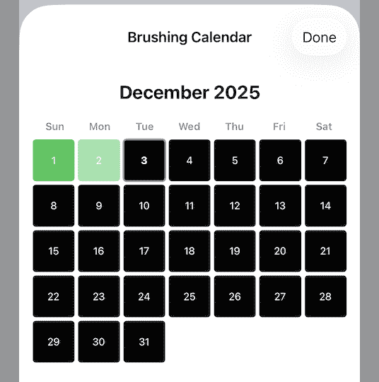
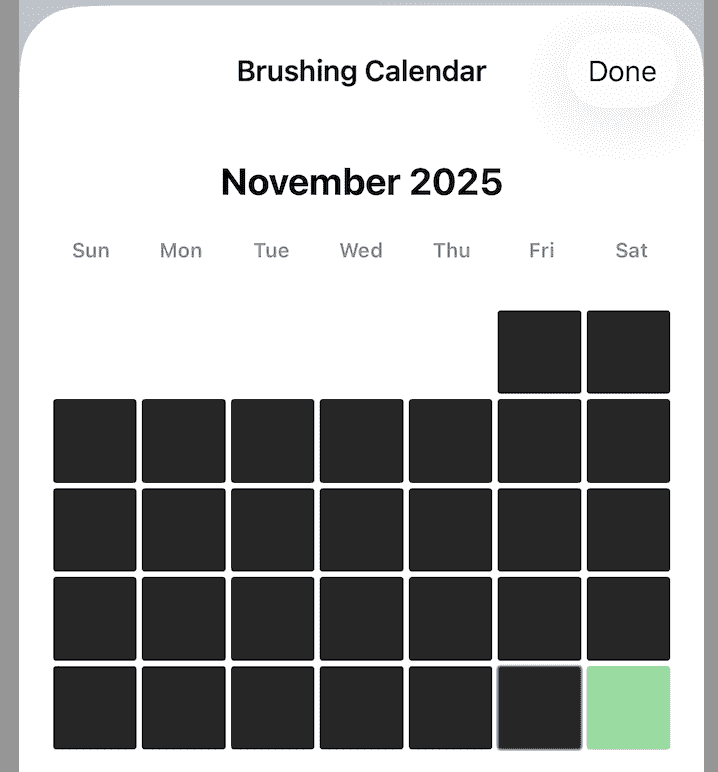
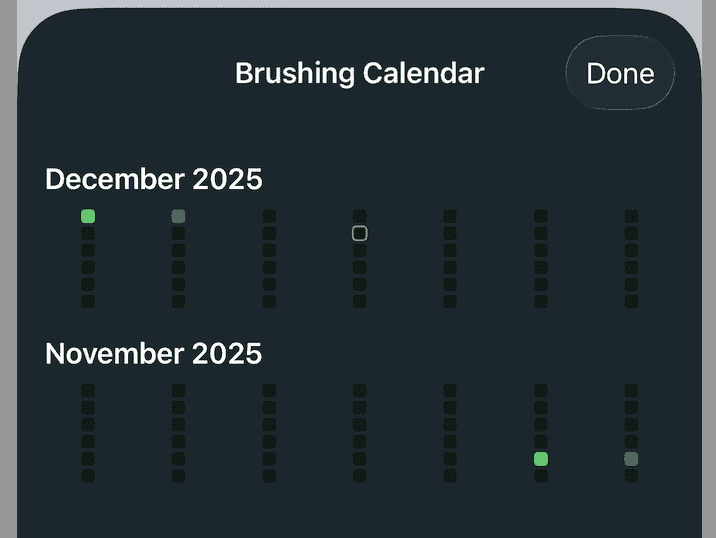
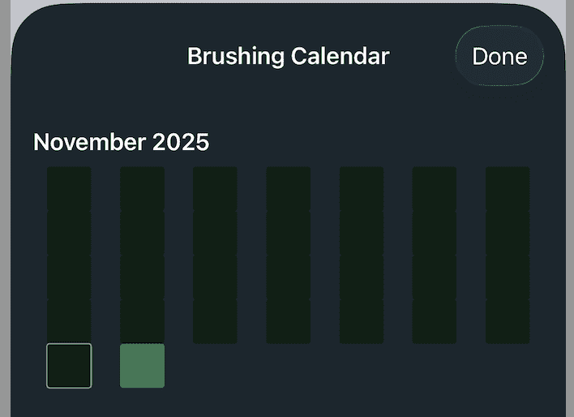
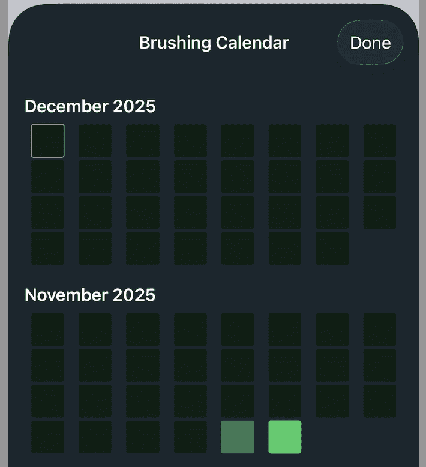

# 使用光标将新功能添加到我的 iOS 应用中的分步过程

> [`towardsdatascience.com/step-by-step-process-of-adding-a-new-feature-to-my-ios-app-with-cursor/`](https://towardsdatascience.com/step-by-step-process-of-adding-a-new-feature-to-my-ios-app-with-cursor/)

我最近开始 vibe-coding，以创建网站和 iOS 应用。我已经在 App Store 上发布了两个应用。

我的第一个应用是[Brush Tracker](https://apps.apple.com/us/app/brush-tracker/id6754214621)，它帮助你跟踪日常刷牙习惯，保持一致性，并通过小激励提醒保持牙齿清洁。我还写了一篇[文章](https://towardsdatascience.com/i-built-an-ios-app-in-3-days-with-literally-no-prior-swift-knowledge/)，讲述了构建应用并将其发布到 App Store 的整个过程。

最近，我决定向 Brush Tracker 添加一个新功能：一个类似日历的网格，显示用户的月度刷洗一致性。在这篇文章中，我将向您展示我是如何使用光标和一些手动调整来实现这个功能的。

## 初始提示

我心里想的是类似于你在习惯跟踪应用中看到的网格或 GitHub 上的贡献图。

我从 Cursor 的计划模式开始，我发现当添加新功能或进行重大更改时，这个模式非常高效。你定义功能或解释任务，Cursor 就会生成详细的实施计划。

这里是我用于在计划模式中开始时使用的确切提示：

> 我想添加一个类似日历的网格来跟踪用户完成的刷洗天数。网格中的每个方块代表一个月中的某一天。网格中方块的初始状态是黑色。如果用户完成所有刷洗，则用绿色填充方块；如果用户部分完成刷洗，则用浅绿色填充。例如，用户将每日刷洗次数设置为 2。如果他们在一天内完成一次刷洗，则该天的方块应该是浅绿色。如果他们在一天内完成两次刷洗，则该天的方块应该是绿色。网格可以通过按屏幕左上角的日历图标来访问。

光标向我提出了两个问题，以在最终确定实施计划之前澄清一些细节。我真的喜欢这个步骤，因为看到光标寻求澄清而不是自己做出假设，这让人感到安心。

光标提出的两个问题：

+   日历网格应该只显示当前月份，还是允许在月份之间导航？

+   我们应该从今天开始跟踪，还是也显示过去的日子（这将显示为黑色）？

我指示光标允许在月份之间导航，并在黑色中显示月份的前几天。然后，光标创建了一个 Markdown 文件，概述了详细的实施计划。

计划详细说明了如何实施该功能，并包括一个可操作的待办事项列表。

光标的待办事项：

+   *扩展 BrushModel 以跟踪具有持久性的历史每日刷牙数据*

+   *创建具有月网格和彩色正方形的 CalendarGridView 组件*

+   *将日历图标按钮添加到 ContentView 的左上角*

+   *将 CalendarGridView 与 ContentView 使用 sheet 呈现方式集成*

接下来，我要求 Cursor 实施这个计划。它还允许在执行前修改计划，但我希望坚持 Cursor 原始的轮廓不变。

实现第一次尝试就成功了，我能够在 Xcode 模拟器中直接测试这个功能。然而，设计非常糟糕：



注意：本文中使用的所有图片均包含来自我的应用 Brush Tracker 的屏幕截图。

Xcode 模拟器不再包括日期和时间设置，所以我将我的 Mac 系统日期更改以测试网格颜色在不同日期的更新情况。

我一点也不喜欢这种风格。所以我要求 Cursor 使用以下提示重新设计网格：

> 我们需要改变网格的设计。我心目中的样子类似于 Github 贡献网格。此外，不要在代表日期的正方形中显示日期值。

这个提示没有达到我预期的效果。它所做的唯一改变是移除了日期数字：



接下来，我分享了一个我想要的网格样式的样本图像，并要求 Cursor 制作一个类似的设计。

新的设计更接近我心目中的样子，但它存在结构问题。正方形太小，在布局中扩展得不好：



所以这个设计中存在两个主要问题：

1.  每个月包含 42 个正方形（不表示任何月份的日期）。

1.  正方形太小。

我用以下提示要求 Cursor 修复第一个问题：

> 在当前实现中，11 月和 12 月有 42 个正方形。网格中的正方形代表一个月中的日期，所以正方形的数量必须等于该月的天数。

另一个问题更简单，我可以通过调整一些参数值来解决。例如，可以通过`squareSize`参数改变网格中正方形的大小：

```py
struct DaySquare: View {
    let isToday: Bool
    let isCurrentMonth: Bool
    let brushCount: Int
    let brushesPerDay: Int

    private let squareSize: CGFloat = 8 // change this parameter
```

在我将正方形大小更改为 32 后，网格看起来是这样的：



另一个问题可以通过调整参数值来解决，即行之间的填充。

在上面的屏幕截图中，似乎行与行之间没有空间。这可以通过增加行之间的填充来改变。

我还希望每行有 8 个正方形（即天数）并改变行之间的空间。

所有这些都可以在以下代码片段中完成：

```py
 // Calendar grid - smaller GitHub style
            LazyVGrid(columns: Array(repeating: GridItem(.flexible(), spacing: 0.2), count: 8), spacing: 0) {
                ForEach(Array(calendarDays.enumerated()), id: \.offset) { index, dayInfo in
                    DaySquare(
                        isToday: dayInfo.isToday,
                        isCurrentMonth: dayInfo.isCurrentMonth,
                        brushCount: dayInfo.brushCount,
                        brushesPerDay: model.brushesPerDay,
                        size: 32
                    )
                    .padding(.bottom, 3)
                }
            }
```

+   `spacing`控制行中正方形之间的空间

+   `padding`控制行之间的空间

+   `count`控制每行中的正方形数量

在上面的代码片段中调整这些参数值后，我得到了以下网格：



如果用户在一天内完成了所有的刷牙，她会得到一个明亮的绿色。如果只是部分完成，那天对应的方块会用浅绿色着色。其他天用黑色显示，而当前天用白色边框标出。

在实现了跟踪过去几天的功能之后，添加关于连续性的通知似乎是顺理成章的。我要求 Cursor 使用以下提示来完成这项任务：

> 添加当用户连续完成 10 天、20 天和 30 天刷牙的通知。此外，当用户在一个月内完成所有天数时，也要添加一个月度通知。通知应该是鼓舞人心和激励人的。

我创建的网格不是最佳设计，但足以传达信息。当用户查看这个网格时，她立即就能了解她的刷牙频率。

在 Cursor 的帮助和一些手动调整下，我能够在几个小时内实现并发布这个功能。在撰写本文时，这个版本仍在 App Store 审核中。当你阅读这篇文章时，它可能已经被分发。如果你想查看或试用这个应用，这里有一个 App Store 链接到[Brush Tracker](https://apps.apple.com/us/app/brush-tracker/id6754214621)。

感谢您阅读！如果您对这篇文章或应用有任何反馈，我很乐意听听您的想法。
