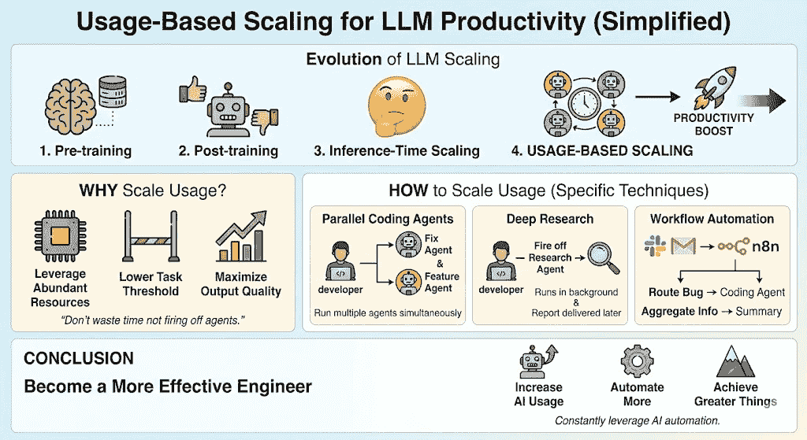
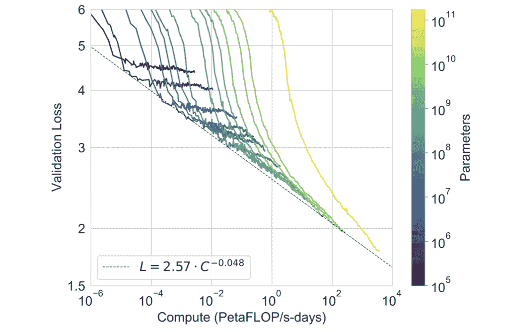

# 如何扩展你的 LLM 使用

> [如何扩展你的 LLM 使用](https://towardsdatascience.com/how-to-scale-your-llm-usage/)

<mdspan datatext="el1764225009291" class="mdspan-comment">“扩展”这个词可能是大型语言模型（LLM）中最重要的词，尤其是随着 ChatGPT 的发布。ChatGPT 之所以如此成功，很大程度上是因为 OpenAI 进行了扩展的**预训练**，使其成为一个强大的语言模型。

随后，Frontier LLM 实验室开始扩展**后训练**，使用监督微调和 RLHF，模型在遵循指令和执行复杂任务方面变得越来越出色。

就在我们认为 LLM 即将达到顶峰时，我们开始通过推理模型的发布进行**推理时间扩展**，其中花费*思考令牌*极大地提高了输出质量。

这张信息图突出了本文的主要内容。我首先会讨论为什么你应该扩展你的 LLM 使用，强调它如何提高生产力。接着，我会具体说明如何增加你的 LLM 使用，包括运行并行编码代理和使用 Gemini 3 Pro 中的深度研究模式。图片由 Gemini 提供

我现在认为我们应该继续这种扩展，采用一种新的扩展范式：**基于使用的扩展**，即扩展你使用 LLM 的程度：

+   并行运行更多编码代理

+   总是开始深入研究一个感兴趣的话题

+   运行信息检索工作流程

> 如果你不在午餐前或睡觉前启动代理，你就是在浪费时间

在这篇文章中，我将讨论扩展 LLM 使用如何提高生产力，尤其是在作为程序员工作时。此外，我将讨论你可以使用的具体技术来扩展你的 LLM 使用，无论是个人还是为公司工作。我会保持这篇文章的高层次，旨在激发你如何最大限度地利用 AI 来获得优势。

## 为什么你应该扩展 LLM 使用

我们之前已经看到扩展是多么强大，例如：

+   预训练

+   后训练

+   推理时间扩展

原因是，结果证明，你在某件事上投入的算力越多，你将获得更好的输出质量。当然，这假设你能够有效地使用计算机。例如，对于预训练，能够扩展计算依赖于

+   足够大的模型（足够的权重进行训练）

+   足够的数据进行训练

如果你没有这两个组件就扩展计算，你不会看到改进。然而，如果你扩展了这三个组件，你会得到惊人的结果，比如我们现在看到的 Frontier LLM，例如，随着 Gemini 3 的发布。

因此，我主张你应该尽可能扩展你自己的 LLM 使用。例如，这可以是同时启动几个代理进行并行编码，或者在你感兴趣的主题上启动 Gemini 深度研究。

当然，使用必须仍然具有价值。在你不需要的某些晦涩的任务上启动编码代理是没有意义的。相反，你应该在以下情况下启动编码代理：

+   一个你从未觉得有时间坐下来自己解决的问题

+   上次销售通话中请求的一个快速功能

+   一些 UI 改进，你知道的，今天的编码代理可以轻松处理

这张图像显示了扩展定律，展示了我们可以看到随着扩展的增加而性能增加。我主张当我们扩展我们的 LLM 使用时，也会发生同样的事情。图片来自[NodeMasters.](https://www.node-masters.com/blog/why-openai-is-so-confident-on-future-ai-progress)

* * *

> 在资源丰富的世界里，我们应该努力最大化使用它们

我在这里的主要观点是，自从 LLM 发布以来，执行任务的门槛已经显著降低。以前，当你收到一个错误报告时，你必须坐下来集中精力 2 小时，思考如何解决这个问题。

然而，今天，情况不再是这样。相反，你可以进入 Cursor，输入错误报告，让 Claude Sonnet 4.5 尝试修复它。然后你可以 10 分钟后回来，测试问题是否已修复，并创建拉取请求。

> 你在仍然使用这些令牌做些有用的事情的同时能花费多少令牌

## 如何扩展 LLM 的使用

我谈到了为什么你应该通过运行更多的编码代理、深度研究代理和任何其他 AI 代理来扩展 LLM 的使用。然而，确定应该启动哪些 LLM 可能很难。因此，在本节中，我将讨论你可以启动以扩展你的 LLM 使用的特定代理。

### 并行编码代理

并行编码代理是任何程序员扩展 LLM 使用最简单的方法之一。你不再一次只处理一个问题，而是同时启动两个或更多代理，无论是使用光标代理、Claude 代码还是任何其他代理编码工具。通常，通过利用 Git 工作树，这使得并行编码变得非常容易。

例如，我通常有一个主要任务或项目在处理，我在 Cursor 中坐着编程。然而，有时我会收到一个错误报告，我会自动将其路由到 Claude Code，让它搜索问题发生的原因，并在可能的情况下修复它。有时，这会直接解决问题；有时，我需要稍微帮助它一下。

然而，启动这个错误修复代理的成本超级低（我实际上只需将线性问题复制到 Cursor 中，Cursor 可以使用线性 MCP 读取问题）。同样，我还有一个自动研究相关潜在客户的脚本，我在后台运行它。

### 深度研究

深度研究是你可以使用任何前沿模型提供商（如 Google Gemini、OpenAI ChatGPT 和 Anthropic 的 Claude）的功能。尽管有许多其他可靠的深度研究工具，但我更喜欢 Gemini 3 的深度研究。

每当我想要了解更多关于某个主题的信息，寻找信息，或类似的事情时，我都会用 Gemini 启动一个深度研究代理。

例如，我对根据特定的 ICP 寻找一些潜在客户感兴趣。然后我迅速将 ICP 信息粘贴到 Gemini 中，给它一些上下文信息，并让它开始研究，这样它就可以在我忙于主要编程项目时运行。

20 分钟后，我从 Gemini 那里得到了一份简短的报告，结果发现其中包含大量有用的信息。

### 使用 n8n 创建工作流程

另一种扩展 LLM 使用的方法是使用 n8n 或任何类似的流程构建工具。使用 n8n，你可以构建特定的流程，例如，读取 Slack 消息并根据这些 Slack 消息执行某些操作。

例如，你可以有一个工作流程，它读取 Slack 上的错误报告组，并自动为特定的错误报告启动一个 Claude 代码代理。或者，你可以创建另一个工作流程，从许多不同的来源汇总信息，并以易于阅读的格式提供给你。使用工作流程构建工具，实际上有无数的机会。

### 更多

你可以使用许多其他技术来扩展你的 LLM 使用。我只列出了当我与 LLM 一起工作时想到的前几项。我建议始终牢记你可以使用 AI 自动化的内容，以及你可以如何利用它来提高效率。如何扩展 LLM 使用将因公司、职位和其他许多因素而大相径庭。

## 结论

在这篇文章中，我讨论了如何扩展你的 LLM 使用，以成为一个更有效的工程师。我认为我们过去看到扩展工作做得非常出色，并且我们很可能通过扩展我们自己的 LLM 使用看到越来越强大的结果。这可能是并行启动更多的编码代理，在吃午饭时运行深度研究代理。总的来说，我相信通过增加我们的 LLM 使用，我们可以变得越来越高效。

**👉 我的免费资源**

**🚀** [使用 LLM 提高你的工程效率（免费 3 天电子邮件课程）](https://www.eivindkjosbakken.com/email-course)

📚 [获取我的免费视觉语言模型电子书](https://eivindkjosbakken.com/ebook)

💻 [我的视觉语言模型网络研讨会](https://www.eivindkjosbakken.com/webinar)

**👉 在社交平台上找到我：**

📩 [订阅我的通讯](https://eivindkjosbakken.com/newsletter)

🧑‍💻 [联系我](https://eivindkjosbakken.com/)

🔗 [LinkedIn](https://www.linkedin.com/in/eivind-kjosbakken/)

🐦 [X / Twitter](https://x.com/EivindKjos)

✍️ [Medium](https://oieivind.medium.com/)
