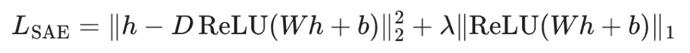
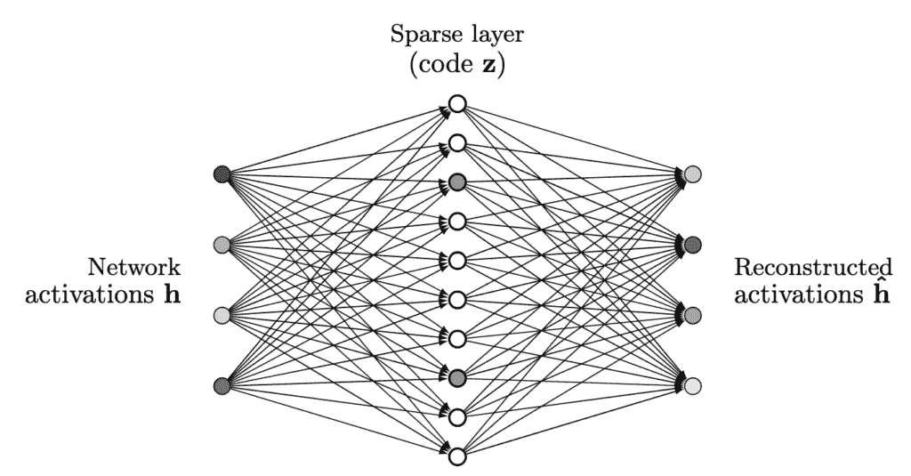
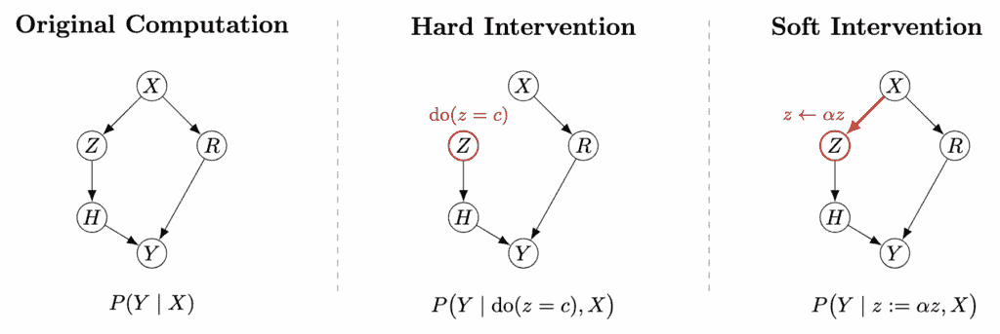

# 神经网络模糊不清，符号系统支离破碎。稀疏自编码器帮助我们结合它们。

> [`towardsdatascience.com/neuro-symbolic-systems-the-art-of-compromise-2/`](https://towardsdatascience.com/neuro-symbolic-systems-the-art-of-compromise-2/)

在我们建造计算机和人工智能之前，我们已经建立了旨在系统地推理人类行为的机构——法院。法律体系是人类最古老的推理引擎之一，其中事实和证据被视为输入，相关的*法律*被用作推理规则，而判决则是系统的输出。然而，法律从人类文明开始就已经一直在不断演变。最早的**法典**——《汉谟拉比法典》（约公元前 1750 年）——代表了将道德和社会推理正式化为明确符号规则的第一大规模尝试。它的美在于清晰和统一——然而它也是僵化的，无法适应语境。几个世纪之后，像由*唐纳休诉史蒂文森案（1932 年）*塑造的**普通法**传统，引入了相反的哲学：基于先例经验和案例的推理。正如我们所知，今天的法律体系通常是两者的结合，而比例在不同国家之间有所不同。

与法律体系中的一致性组合相比，在人工智能领域，类似的范式对——**符号主义**和**连接主义**——似乎要困难得多，难以统一。后者在近年来人工智能发展的激增中占据了主导地位，其中所有内容都是通过大量数据和计算资源隐式学习，并在神经网络参数中进行编码。确实，这一方向在基准性能方面已被证明非常有效。那么，我们真的需要在我们的 AI 系统中包含符号组件吗？

## 符号系统与神经网络：信息压缩的视角

要回答上述问题，我们需要更仔细地观察这两个系统。从计算的角度来看，符号系统和神经网络都可以被视为压缩机器——它们将世界的巨大复杂性简化为紧凑的表示，从而实现推理、预测和控制。然而，它们通过根本不同的机制实现，受制于相反的“理解”哲学。

本质上，这两种范例都可以想象成应用于原始现实的过滤器。给定输入 \(X\)，每个都学习或定义一个变换 \(H(\cdot)\)，它产生一个压缩表示 \(Y = H(X)\)，保留它认为有意义的部分，丢弃其余部分。但这个过滤器的形状是不同的。一般来说，符号系统表现得像**高通滤波器**——它们提取世界的锐利、规则定义的轮廓，而忽略其平滑的梯度。相比之下，神经网络更像是**低通滤波器**，平滑局部波动以捕捉全局结构。区别不在于它们看到了什么，而在于它们选择忘记什么。

符号系统通过**离散化**来压缩。它们将经验的连续织物切割成不同的类别、关系和规则：一部法律代码、一种语法或一个本体。每个符号都充当一个*清晰的边界*，在预定义的方案中操作的把手。这个过程类似于将一个有噪声的信号投影到一组人类设计的基础向量上——一个由实体和关系等概念构成的空间。例如，一个知识图谱可能会读取句子“UIUC 是一所非凡的大学，我非常喜欢它”，并且只保留 *(UIUC, is_a, Institution)*，丢弃其方案之外的所有内容。结果是清晰和可组合性，但也带来了刚性：本体框架之外的意义简单地消失了。

与之相反，神经网络通过**平滑**来压缩。它们放弃离散类别，转而选择平滑流形，其中附近的输入产生相似的激活（在现代大型语言模型中通常由某个 Lipschitz 常数界定）。它们不是将数据映射到预定义的坐标，而是学习一个潜在的几何结构，该结构隐式地编码相关性。在这个观点中，世界不是一个规则集，而是一个梯度场。这使得神经表示非常适应性强：它们可以在未见过的例子之间进行插值、类比和泛化。但正是这种灵活性带来的平滑性也产生了不透明性。信息变得纠缠，语义变得分散，在泛化的过程中，可解释性也随之丧失。

| **属性** | **符号系统** | **神经网络** |
| --- | --- | --- |
| **存活信息** | 离散、模式定义的事实 | 频繁、连续的统计模式 |
| **抽象来源** | 人类定义的本体 | 数据驱动流形 |
| **鲁棒性** | 在规则边缘脆弱 | 局部鲁棒但全局模糊 |
| **错误模式** | 缺失事实 *(覆盖缺口)* | 平滑事实 *(幻觉)* |
| **可解释性** | 高 | 低 |

总之，我们可以从信息压缩的角度用一句话总结两种系统之间的差异：“**神经网络是世界模糊的图像，而符号系统是带有缺失补丁的高分辨率图片。**”这实际上表明了神经符号系统是一种折衷的艺术：它们可以通过在不同尺度上协作使用两种范式来利用两种范式中的知识，神经网络提供全局的低分辨率骨干，而符号组件提供高分辨率局部细节。

## 规模化挑战

虽然将符号组件添加到神经网络中以利用两种方法的好处非常诱人，但可扩展性是我们尝试中的一个重大问题，尤其是在基础模型时代。传统的神经符号系统依赖于一组专家定义的本体/模式/符号，这被认为可以涵盖所有可能的输入情况。这对于特定领域的系统是可以接受的（例如，披萨订购聊天机器人）；然而，你不能将类似的方法应用于开放域系统，在那里你需要专家构建数万亿个符号及其关系。 

一个自然的反应是完全数据驱动：我们不再要求人类手工制作本体，而是让模型从内部激活中诱导出它自己的“符号”。**稀疏自编码器（SAEs）**是这个想法的一个显著体现。通过将隐藏状态分解成大量稀疏特征，它们似乎为我们提供了一个**神经概念字典**：每个特征在特定模式上触发，通常是可解释的，并且表现得像一个可以开启或关闭的离散单元。乍一看，这似乎是一个完美的解决方案，可以摆脱专家瓶颈：我们不再设计符号集；我们学习它。

在这里，\(D\) 被称为**字典矩阵**，其中每一列存储一个具有语义意义的概念；第一个项是隐藏状态 \(h\) 的**重建损失**，而第二个项是一个**稀疏惩罚**，鼓励代码中激活的最小神经元。

然而，仅采用 SAE（自编码器）的方法会遇到两个基本问题。第一个是计算上的：将 SAE 作为实时符号层，需要将每个隐藏状态乘以一个巨大的字典矩阵，即使最终代码是稀疏的，这也将带来密集的计算成本。这使得它们在基础模型规模下无法部署。第二个是概念上的：SAE 特征是符号类表示，但它们不是一个符号系统——它们缺乏显式的形式语言、组合运算符和可执行规则。**它们告诉我们模型潜在空间中存在哪些概念，但并没有告诉我们如何对这些概念进行推理。**

这并不意味着我们应该完全放弃 SAE——它们提供的是配料，而不是成品。我们不必要求 SAE 成为符号系统，我们可以将它们视为模型内部概念空间和许多我们已有的符号工件（如知识图谱、本体、规则库、分类法）之间的桥梁：推理可以通过定义发生。然后，在大型模型的隐藏状态上训练的高质量 SAE 成为共享的“概念坐标系”：不同的符号系统可以在这个坐标系内通过将它们的符号与 SAE 特征关联起来进行对齐，这些特征在符号在上下文中被调用时始终被激活。

这样做与简单地将符号系统并排放置并独立查询相比，具有几个优势。首先，它实现了**跨系统符号合并和别名**：如果来自不同公理的两个符号反复激活几乎相同的 SAE 特征集，我们就有了强有力的证据表明它们对应于相同的潜在神经概念，并且可以相互链接或甚至统一。其次，它支持**跨系统关系发现**：在我们手工设计的模式中相隔甚远的符号，但在 SAE 空间中始终靠近，指向我们未能编码的桥梁——新关系、抽象或领域之间的映射。第三，SAE 激活为我们提供了一个以模型为中心的显著性概念：那些在神经概念空间中找不到明确对应物的符号是剪枝或重构的候选者，而没有任何系统中匹配符号的强大 SAE 特征则突显了我们所有当前抽象共有的盲点。

关键的是，这种 SAE 的使用仍然是可扩展的。昂贵的 SAE 是在离线状态下训练的，而符号系统本身不需要增长到“基础模型大小”——它们可以保持与各自任务需求一样小或大。在推理时间，神经网络继续在其连续潜在空间中承担繁重的工作；符号工件只在显式结构和问责制最有价值的点上塑造、约束或审计行为。SAE 通过将这些异构的符号视图全部关联到模型学习到的单一概念图，使得比较、合并和改进它们成为可能，而无需构建一个统一的、专家设计的符号孪生体。

## 当 SAE 可以作为符号桥梁时？

上面的图片默默地假设我们的 SAE“足够好”，可以作为有意义的坐标系。这实际上需要什么？我们不需要完美，也不需要 SAE 在每一个轴上超越人类的符号系统。相反，我们需要一些更多、但至关重要的属性：

– **语义连续性**：表达相同底层概念的输入应该在稀疏代码中诱导出相似的支持模式：相同的 SAE 特征子集应该倾向于非零，而不是在小的改写或上下文转换下闪烁。换句话说，语义等价性应该在活跃概念的稳定模式中得到反映。

– **部分可解释性**：我们不必理解每个特征，但其中相当一部分应该允许稳健的人类描述，以便在概念级别进行合并和调试。

– **行为相关性**：SAE 发现的特征必须对模型的输出真正重要：干预它们或根据它们的存在进行条件化，应该以系统的方式改变或预测模型的决策。

– **容量和基础**：SAE 只能重构基础模型中已经存在的结构；它不能从薄弱的骨架中创造丰富的概念。为了使“概念坐标系”图有意义，基础模型本身必须足够大且训练良好，以至于其隐藏状态已经编码了一个多样化的、非平凡的抽象集合。同时，SAE 必须具有足够的维度和过度完备性：如果代码空间太小，许多不同的概念将被迫共享相同的特征，导致纠缠和不稳定的表示。

现在我们详细讨论前三个属性。

### 语义连续性

在纯函数逼近级别，具有 ReLU 或 GELU 类型激活的深度神经网络实现了一个 Lipschitz 连续映射：输入的小扰动不会导致输出 logits 的任意无界跳跃。但这种连续性与我们在稀疏自编码器中需要的连续性非常不同。

对于基础模型，少数神经元开启或关闭很容易被下游层和冗余吸收；只要最终的 logits 变化平滑，我们就满意了。相比之下，在 SAE 中，我们不再只是看一个平滑的输出——**我们将残差流上重建的稀疏代码的支持模式视为一个原符号对象**。一个“概念”与一个特定的激活代码子集相关联。这使得几何结构变得更加脆弱：如果底层表示的微小变化将预激活推过 SAE 层的 ReLU 阈值，代码中的一个神经元会突然从关闭变为开启（或反之），从符号的角度来看，概念已经出现或消失。没有下游网络来平均这一点；代码本身是我们关心的表示。

在构建 SAE 时，稀疏惩罚甚至加剧了这种情况。通常的 SAE 目标函数结合了一个重建损失和一个对激活的\(\ell_1\)惩罚，这明确鼓励大多数神经元值尽可能接近零。因此，即使许多有用的神经元最终也位于激活边界附近：当它们被需要时略高于零，当它们不被需要时略低于零——这被称为 SAE 中的“激活收缩”。这在支持模式级别的语义连续性方面是糟糕的：输入中的微小扰动可能会改变非零神经元，即使基本意义几乎没有改变。因此，基础模型的 Lipschitz 连续性并不能自动给我们一个在 SAE 空间中稳定的非零代码子集，支持级别的稳定性必须被视为一个独立的设计目标并明确评估。

### 部分可解释性

SAE 定义了一个*过度完备*的字典来存储从数据中学习到的可能特征。因此，*我们只需要这些字典条目的一个子集是可解释的特征*。即使对于这个子集，*特征的意义只需要是近似准确的*。当我们将现有符号对齐到 SAE 空间时，我们依赖的是 SAE 层的**激活模式**：我们在符号“在游戏中”的上下文中探测模型，记录产生的稀疏代码，并使用聚合代码作为该符号的嵌入。来自不同系统且嵌入接近的符号可以链接或合并，即使我们从未为每个特征分配可读的语义。

可解释的特征随后扮演了一个更专注的角色：它们在这个激活几何中提供了**面向人类的锚点**。如果一个特定的特征有一个相当准确的描述，那么所有对其有重载的符号都会继承一个共享的语义提示（例如，“这些都是类似职责关怀的事情”），这使得检查、调试和组织合并的符号空间变得更加容易。换句话说，我们不需要一个完美的、完全命名的字典。我们需要（i）足够的容量，以便重要概念可以得到它们自己的方向，以及（ii）一个足够大、与行为相关的特征子集，其近似意义足够稳定，可以作为锚点。其余的过度完备代码可以保持匿名背景；它仍然在 SAE 空间中的距离和聚类中做出贡献，即使我们从未为每个特征分配可读的语义。

### 通过反事实进行行为相关性

一个特征只有在作为桥梁的一部分并实际影响模型的行为时才有意义——而不仅仅是如果它与数据中的某个模式相关。在因果的术语中，我们关心的是该特征是否位于网络从输入到输出的计算中的*因果路径*上：如果我们扰动该特征而保持其他一切不变，模型的行为是否会按照其被认为的意义所预测的方式改变？

形式上，改变特征类似于在因果意义上形式为 \(\text{do}(z = c)\) 的干预，其中我们覆盖那个内部变量并重新运行计算。但与经典因果推断建模不同，我们实际上并不真的需要 Pearl 的*do-calculus*来识别 \(P(y \mid \text{do}(z = c))\)。神经网络是一个**完全可观察和可干预的系统**，因此我们可以简单地执行对内部节点的干预并观察新的输出。从这个意义上说，神经网络为我们提供了在大多数现实世界的社会或经济系统中不可能的理想化干预的奢侈。

对 SAE 特征进行干预在概念上相似，但实现方式略有不同。我们通常不知道特征空间中任意值的含义，因此上述提到的*硬干预*（值赋值）可能没有意义。相反，我们放大或抑制现有特征的幅度，这更像是一种*软干预*：结构图保持不变，但特征的影响幅度发生了变化。因为 SAE 将隐藏激活表示为少数具有语义意义的特征的线性组合，我们可以改变这些特征的系数，以实现有意义、局部化的软干预，而不会影响其他特征。

## 基于符号系统的压缩作为对齐过程

现在让我们换一个稍微不同的视角。虽然神经网络将世界压缩成一些高度抽象、连续的流形，*符号系统则将其压缩成一个人为定义的空间，其中包含具有语义意义的轴，系统行为可以据此进行判断*。从这个角度来看，将信息压缩到符号空间是一个**对齐过程**，在这个过程中，一个混乱、高维的世界被投射到一个空间中，其坐标反映了人类的概念、兴趣和价值观。

当我们将“注意义务”、“暴力威胁”或“受保护属性”等符号引入符号系统时，我们不仅仅是发明标签。这个压缩过程同时做三件事：

– 它选择系统必须关注世界的哪些方面（以及它应该忽略哪些方面）。

– 它创建了一个**共享词汇表**，以便不同的利益相关者可以在争议和审计中可靠地指向“同一事物”。

– 它将这些符号转化为**承诺点**：一旦写下来，它们可以被引用、挑战和重新解释，但不能悄无声息地被删除。

相比之下，纯神经压缩完全存在于模型内部。其潜在轴是无名的，其几何形状是私有的，其内容会随着训练数据或微调目标的改变而漂移。这种表示非常适合泛化，但在义务中心方面却很糟糕。在仅有的那个空间中，很难说系统*欠*任何人什么，或者它应该将哪些区别视为不变。换句话说，**神经压缩服务于预测，而符号压缩服务于与人类规范性框架的对齐**。

一旦将符号系统视为对齐图而不是简单的规则列表，与*问责制*的联系就变得直接。说“模型不得基于受保护属性进行歧视”，或者“模型必须遵守谨慎行事的标准”，就是坚持某些符号区别必须以稳定的方式反映在其内部概念空间中——并且我们能够定位、探测，并在必要时纠正这些反映。这种问责制通常是期望的，即使是以牺牲模型部分能力为代价。

## 从隐藏法则到共享符号

在《左传》中，晋国政治家叔向曾写信给郑国的子产：“*当惩罚未知时，威慑变得难以捉摸。*”几个世纪以来，统治阶级通过保密来维持秩序，认为在理解结束的地方恐惧繁荣。这就是为什么在公元前 536 年，子产打破了这个传统，将刑法铸在铜鼎上，并公之于众，成为了中国古代历史的一个里程碑。现在，人工智能系统也面临着类似的问题。下一个子产会是谁？

> *[杨晓聪](https://xiaocong-yang.github.io/personal-website/) 是伊利诺伊大学厄巴纳-香槟分校计算机科学专业的博士生，也是[AI Interpretability @ Illinois](https://interpretability.web.illinois.edu/)的创始人。要引用这项工作，请参考我个人网站上的[存档版本](https://xiaocong-yang.github.io/personal-website/posts/2025/11/symbolic-system/) [版本](https://xiaocong-yang.github.io/personal-website/posts/2025/11/symbolic-system/)。*

## 参考文献

+   Bloom, J., Elhage, N., Nanda, N., Heimersheim, S., & Ngo, R. (2024). Scaling monosemanticity: Sparse autoencoders and language models. Anthropic.

+   Garcez, A. d’Avila, Gori, M., Lamb, L. C., Serafini, L., Spranger, M., & Tran, S. N. (2019). Neural-symbolic computing: An effective methodology for principled integration of machine learning and reasoning. FLAIRS Conference Proceedings, 32, 1–6.

+   Gao, L., Dupré la Tour, T., Tillman, H., Goh, G., Troll, R., Radford, A., Sutskever, I., Leike, J., & Wu, J. (2024). Scaling and evaluating sparse autoencoders.

+   Bartlett, P. L., Foster, D. J., & Telgarsky, M. (2017). Spectrally-normalized margin bounds for neural networks. Advances in Neural Information Processing Systems, 30, 6241–6250.

+   Chiang, T. (2023, February 9). ChatGPT is a blurry JPEG of the Web. The New Yorker.

+   Pearl, J. (2009). 因果关系：模型、推理和推断（第 2 版）. 剑桥大学出版社。

+   Donoghue v Stevenson [1932] AC 562 (HL)。

（所有图片均由作者创作）
