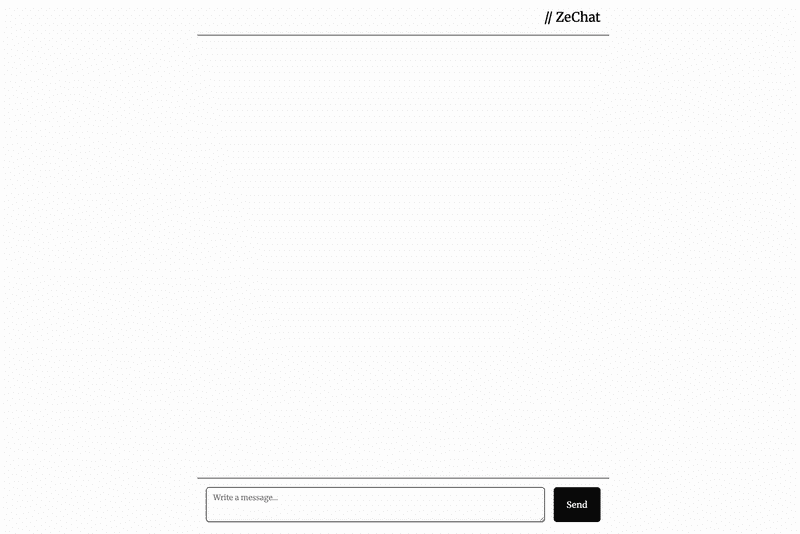

# JavaScript 疲劳：HTMX 是构建 ChatGPT 的全部所需 — 第一部分

> [`towardsdatascience.com/javascript-fatigue-you-dont-need-js-to-build-chatgpt/`](https://towardsdatascience.com/javascript-fatigue-you-dont-need-js-to-build-chatgpt/)

## 摘要

+   关于 HTML 和 Web 的简介

+   一个简单的 HTMX 示例

+   使用 HTMX 和 FastAPI 进行基本的聊天

+   使用流和服务器发送事件进行更高级的聊天

+   使用 Gemini 和 ADK 的代理聊天机器人

+   结论

## 简介

我记得很久以前，构建网站是很容易的。HTML 和 CSS。感觉很简单。如今，JavaScript 框架无处不在。不断的变化，复杂性不断增加。这种现象被称为“*JavaScript 疲劳*”，它完全是关于开发者因追逐最新的框架、构建工具、库而感到疲惫，并试图跟上节奏。但有了 **HTMX**，开发者现在有了一种以更大的简单性和更少的疲惫来构建引人入胜的 Web 应用程序的方法——而且无需所有这些 JavaScript 烦恼。

我所说的参与式 Web 应用程序是指像 ChatGPT 这样的东西，在不到 200 行代码中，纯 Python 和 HTML。就像这样：



## 快速回顾一下 Web 是如何工作的

当蒂姆·伯纳斯-李（Tim Berners-Lee）在 1990 年创建了第一个网页时，他设计的系统基本上是一个“只读”系统，通过超链接将页面连接起来，这就是我们所有人都知道的 HTML 中的锚点标签。因此，HTML 1.0 依赖于一个单一的标签，并提供了页面之间的简单导航。

```py
<!-- The original web: simple hypermedia -->
<a href="/about">About Us</a>
```

锚点标签是一个超媒体控件，执行以下过程：

+   向用户显示这是一个链接（可点击）

+   向超链接 URL 发起 GET 请求

当服务器响应一个新页面时，浏览器将用新页面替换当前页面（导航）

然后出现了 Web 2.0，它引入了一个新的标签，即表单标签。这个标签允许除了通过 `<a>` 标签读取资源外，还可以更新资源。能够更新资源意味着我们可以真正开始构建 Web 应用程序。所有这些只需要两个控件：`<form>` 和 `<a>`。

```py
<!-- Web 2.0: now we can update data -->
<form method="POST" action="/login">
    <input type="email" name="email" required>
    <input type="password" name="password" required>
    <button type="submit">Login</button>
</form>
```

提交表单的过程与锚点标签非常相似，但我们可以：

+   选择我们想要执行哪种类型的请求（GET 或 POST）

+   将用户信息（如电子邮件、密码等）附加到请求中传递

这两个标签是纯 HTML 中唯一可以与服务器交互的元素。

## 接着是 JavaScript。

JavaScript 最初是为了向网页添加简单的交互而创建的：表单验证、数据获取和基本动画。但随着 XMLHttpRequest（后来被称为 AJAX）的引入，JavaScript 发展成为一种更加强大和复杂的工具。

通过 AJAX，开发者现在可以触发 HTTP 请求，而无需两个标签。AJAX 允许从服务器获取数据，尽管 XHR 可以获取任何类型的数据——包括原始 HTML 片段、文本或 XML——但 JSON 成为了事实上的数据交换格式。

这意味着需要额外的步骤，将 JSON 转换为 HTML，通过一个从 JSON 渲染 HTML 的函数来完成。如下面的示例所示，我们通过以下步骤进行：

+   从`/api/users`端点（`response => response.json()`部分）获取 JSON 数据

+   将这些数据插入到 HTML 模板中（`const html`部分）

+   然后将这些添加到 DOM 中（`document.getElementById()`部分）

```py
// The JavaScript way: JSON → HTML conversion
fetch('/api/users')
    .then(response => response.json())
    .then(users => {
        const html = users.map(user => 
            `<div class="user">${user.name}</div>`
        ).join('');
        document.getElementById('users').innerHTML = html;
    });
```

**这种渲染涉及 JSON 数据格式和 HTML 渲染之间的紧密耦合：如果 JSON 数据格式发生变化，它就会破坏 HTML 渲染函数**。这一点通常是前端和后端开发者之间摩擦的来源：前端开发者基于预期的 JSON 格式构建 UI，后端开发者决定更改格式，前端开发者需要更新 UI，后端开发者再次更改，前端开发者再次更改，等等。

最终，行业大量转向由 JSON 驱动的架构，从而催生了**单页应用程序（SPAs）**。我们不再构建需要从一页跳转到另一页的网站，而是开始构建完全位于浏览器内的软件。在这个模型中，服务器被简化为一个简单的数据 API，而 JavaScript 则负责处理状态管理和 UI 渲染的重任。这是 React、Angular 和 Vue 背后的引擎——强大但复杂。

下面是一些来自优秀来源的思考，我鼓励你阅读，以便你可以做出自己的判断：

> *“网络开发的兴起规范是构建一个具有服务器渲染的 React 单页应用程序，其关键元素类似于：*
> 
> *– 主要 UI 是用 React 或类似的东西在 JavaScript 中构建和更新的。*
> 
> *– 后端是一个应用程序对其发起请求的 API。*
> 
> *这个想法真的在互联网上引起了轰动。它始于几个主要流行的网站，然后逐渐渗透到营销网站和博客等角落。“*
> 
> *(汤姆·麦克赖特，https://macwright.com/2020/05/10/spa-fatigue)*

大多数当前的 SPA 架构是“客户端厚重”的应用程序，其中大部分工作发生在客户端，而后端只是一个返回 JSON 的 API。这种设置以其提供迅速和流畅的用户体验而闻名，但我们真的每次都需要这种复杂性吗？

> *“（…）还有一些问题，我觉得使用 React 并没有带来任何具体的益处。这些主要是像博客、购物车网站、主要是 CRUD 和表单网站。”*
> 
> *(汤姆·麦克赖特，[`macwright.com/2020/05/10/spa-fatigue`](https://macwright.com/2020/05/10/spa-fatigue))*

## JavaScript 疲劳是真实的

随着 SPAs 的盛行，JavaScript 框架的数量以及与之相关的复杂性也在增加。对于开发者来说，这种选择过剩、有偏见的框架和库最终导致了一种集体疲劳感，被称为“JavaScript 疲劳”。以下是 JavaScript 框架燃尽的一些原因：

+   **复杂性增加**：库和框架变得越来越庞大和复杂，需要大型团队来管理。一些有偏见的框架还意味着 JS 开发者必须专注于一种技术。没有 Python 开发者会称自己为“Tensorflow Python 开发者”。他们只是 Python 开发者，从 TF 切换到 Pytorch 并不是问题。

+   **紧密耦合**：数据 API 和 UI 之间的耦合在团队内部造成摩擦。每天都有破坏性变化发生，只要团队使用 JSON 作为他们的交换接口，就无法解决这个问题。

+   **框架激增**：框架的数量持续增加，导致 JS 开发者感到真正的“疲劳”。

+   **过度设计**：90% 的时间你不需要重量级的 JS 框架。在某些情况下（内容密集型应用），这甚至是一个坏主意（参考 Tom MacWright 的博客文章）

除了高度交互式/协作的 UI 之外，简单的 HTML 和多页面应用通常就足够了。那么我们如何回到古老的 HTML 呢？

## HTMX 是你所需要的全部

HTMX 是一个非常轻量级的 JS 库（14k），它采用以 HTML 为中心的构建动态 Web 应用程序的方法。它通过允许任何元素发起 AJAX 请求并更新 DOM 的任何部分来扩展 HTML。与在客户端进行所有渲染的 JS 框架不同，繁重的工作由服务器完成，通过返回要插入 DOM 中的 HTML 片段。这也意味着，如果你已经熟悉模板引擎和 HTML，与学习 React 或 Angular 相比，学习曲线将容易得多。

与放弃超媒体转而使用 JSON API 相比，HTMX 通过以下方式使 HTML 更加强大：

+   任何元素都可以发起 HTTP 请求（不仅仅是 `<a>` 和 `<form>`）

+   任何 HTTP 方法（GET、POST、PUT、DELETE、PATCH）

+   任何元素都可以被用于更新

+   任何事件都可以触发请求（点击、提交、加载等）

事实上，你实际上可以用 HTMX 和几行 Python 编写自己的小 GPT-like UI！

## 简单的 HTMX 示例

对于这篇文章，我们将用不到 100 行的 Python 和 HTML 来构建一个小聊天应用。但在那之前，我们将从一个简单的演示开始，展示 HTMX 的工作原理。

假设我们有一个返回用户列表的 API。我们想点击一个按钮来获取数据并显示列表。


在传统的 JS 方式下，你可能会这样做。注意，在这种情况下，我们使用的是原生 JavaScript，甚至没有安装 Next 或 Vite 以及它们的数十兆依赖项！

```py
<!-- Traditional JavaScript approach -->
<!DOCTYPE html>
<html>

<head>
  <title>Demo</title>
</head>

<body>
  <h1>Users</h1>
  <button onclick="getUsers()">Show</button>
  <div>
    <ul id="usersList">
    </ul>
  </div>

  <script>
    function getUsers() {
      fetch('https://dummyjson.com/users')
        .then(res => res.json())
        .then(data => {
          const usersList = document.getElementById('usersList');
          if (usersList) {
            data.users.forEach(user => {
              const listItem = document.createElement('li');
              listItem.textContent = `${user.firstName} ${user.lastName}`;
              usersList.appendChild(listItem);
            });
          }
        })
        .catch(error => {
          console.error('Error fetching users:', error);
        });
    }

  </script>
</body>

</html>
```

而使用 HTMX 则是这样做的。

首先创建你的后端：

```py
from fastapi import FastAPI, Request
from fastapi.responses import HTMLResponse
from fastapi.templating import Jinja2Templates
import requests

app = FastAPI()
templates = Jinja2Templates(directory="templates")

@app.get("/", response_class=HTMLResponse)
async def home(request: Request):
    return templates.TemplateResponse("demo.html", {"request": request})

@app.get("/users")
async def get_users():
    r = requests.get("https://dummyjson.com/users")
    data = r.json()
    html = ""
    for row in data['users']:
        html += f"<li>{row['firstName']} {row['lastName']}</li>\n"
    return HTMLResponse(html)
```

然后是 HTML：

```py
<!-- HTMX approach -->
<!DOCTYPE html>
<html>

<head>
  <title>Demo</title>
  <script src="https://cdn.jsdelivr.net/npm/[[email protected]](/cdn-cgi/l/email-protection)/dist/htmx.min.js" integrity="sha384-/TgkGk7p307TH7EXJDuUlgG3Ce1UVolAOFopFekQkkXihi5u/6OCvVKyz1W+idaz" crossorigin="anonymous"></script>

</head>

<body>
  <h1>Users</h1>
   <button hx-get="/users" hx-target="#usersList" hx-swap="innerHTML">Show</button>
  <div>
    <ul id="usersList">
    </ul>
  </div>
</body>
```

你会得到完全相同的结果！这里发生了什么？看看 `<button>` 元素。我们看到有 3 个以 `hx-` 开头的属性。它们在这里有什么作用？

+   `hx-get`：点击这个按钮将触发对 `/users` 端点的 GET 请求

+   `hx-target`: 它告诉浏览器用从服务器接收的 HTML 数据替换具有 `usersList` id 的元素的 内容

+   `hx-swap`: 它告诉浏览器在目标元素内插入 HTML

通过这样，你已经知道了如何使用 HTMX。这种方式的好处在于，如果你决定更改你的 HTML，它不会破坏你页面上的任何内容。

当然，使用 HTMX 有其优点和缺点。但作为一个 Python 开发者，能够与我的 FastAPI 后端玩耍，而不必过多担心渲染 HTML，感觉非常好。只需添加 Jinja 模板，一点 Tailwind CSS，你就可以开始了！

### 我们第一次使用 HTMX 和 FastAPI 进行聊天

所以现在是我们开始认真的时候了。为了构建我们的聊天机器人，我们将一步一步地进行：

+   将一个真实的 LLM 与 Google 搜索工具连接起来，以获得真实答案并说明***代理聊天机器人的概念***

+   从一个简单的聊天机器人开始，它将用户的查询取反。这将说明***HTMX 如何发送和接收数据***

+   为我们的聊天机器人添加一个流式处理能力，将用户的查询词逐个输出，以说明***服务器端事件 (SSE) 和异步通信***

让我们从我们的简单聊天机器人开始。为此，我们将设计一个简单的用户界面，它将：

+   一系列消息

+   用户输入的文本区域

猜猜看，HTMX 将负责发送/接收消息！结果将如下所示：


#### 概述

流程如下：

1.  用户在文本区域中输入查询

1.  这个文本区域被一个表单包裹，该表单将带有 `query` 参数的 POST 请求发送到服务器。

1.  后端接收请求，对 `query` 进行处理（在现实生活中，我们可以使用大型语言模型来回答查询）。在我们的例子中，为了演示目的，我们将逐字逐句地回复查询。

1.  后端将响应包裹在 HTMLResponse 中（不是 JSON！）

1.  在我们的表单中，HTMX 告诉浏览器在哪里插入响应，如 `hx-target` 所示，以及如何与当前 DOM 交换

就这些了。那么，让我们开始吧！

#### 后端

我们将定义一个 `/send` 路由，它期望从前端接收一个 `query` 字符串，将其反转，并以 `<li>` 标签的形式发送回来。

```py
from fastapi import FastAPI, Request, Form
from fastapi.templating import Jinja2Templates
from fastapi.responses import HTMLResponse
import asyncio
import time

app = FastAPI()
templates = Jinja2Templates("templates")

@app.get("/")
async def root(request: Request):
    return templates.TemplateResponse(request, "simple_chat_sync.html")

@app.post("/send")
async def send_message(request: Request, query: str=Form(...)):
    message = "".join(list(query)[::-1])
    html = f"<li class='mb-6 justify-end flex'><div class='max-w-[70%] bg-black text-white rounded-xl px-4 py-2'><div class='font-bold text-right'>AI</div><div>{message}</div></div></li>"
    return HTMLResponse(html)
```

#### 前端

在前端，我们使用 Tailwind CSS 和 HTMX 定义一个简单的 HTML 页面：

```py
<!doctype html>
<html>

<head>
  <meta charset="UTF-8" />
  <meta name="viewport" content="width=device-width, initial-scale=1.0" />
  <script src="https://cdn.jsdelivr.net/npm/@tailwindcss/browser@4"></script>
  <link rel="stylesheet" href="https://cdnjs.cloudflare.com/ajax/libs/highlight.js/11.11.1/styles/default.min.css">
  <script src="https://cdnjs.cloudflare.com/ajax/libs/highlight.js/11.11.1/highlight.min.js"></script>
  <script src="https://cdn.jsdelivr.net/npm/[[email protected]](/cdn-cgi/l/email-protection)/dist/htmx.min.js"
    integrity="sha384-/TgkGk7p307TH7EXJDuUlgG3Ce1UVolAOFopFekQkkXihi5u/6OCvVKyz1W+idaz"
    crossorigin="anonymous"></script>
  <script src="https://cdn.jsdelivr.net/npm/[[email protected]](/cdn-cgi/l/email-protection)"
    integrity="sha384-A986SAtodyH8eg8x8irJnYUk7i9inVQqYigD6qZ9evobksGNIXfeFvDwLSHcp31N"
    crossorigin="anonymous"></script>
  <link rel="preconnect" href="https://fonts.googleapis.com">
  <link rel="preconnect" href="https://fonts.gstatic.com" crossorigin>
  <link href="https://fonts.googleapis.com/css2?family=Merriweather:[[email protected]](/cdn-cgi/l/email-protection)&display=swap" rel="stylesheet">

  <style>
    body {
      font-family: "Merriweather";
    }
  </style>
</head>

<body class="flex w-full bg-white h-screen">
  <main class="flex flex-col w-full md:w-3/4 lg:w-1/2 pb-4 justify-between items-left mx-auto ">
    <header class="border-b p-4 text-2xl text-right">
      // ZeChat
    </header>
    <div class="mb-auto max-h-[80%] overflow-auto">
      <ul id="chat" class="rounded-2xl p-4 mb-16 justify-start">

      </ul>
    </div>

    <footer class="p-4 border-t">
      <form id="userInput" class="flex max-h-16 gap-4" hx-post="/send" hx-swap="beforeend" hx-target="#chat"
        hx-trigger="click from:#submitButton" hx-on::before-request="
                htmx.find('#chat').innerHTML += `<li class='mb-6 justify-start flex'><div class='max-w-[70%] border border-black rounded-xl px-4 py-2'><div class='font-bold'>Me</div><div>${htmx.find('#query').value}</div></div></li>`;
                htmx.find('#query').value = '';
                ">
        <textarea id="query" name="query"
          class="flex w-full rounded-md border border-input bg-transparent px-3 py-2 text-sm shadow-sm placeholder:text-muted-foreground focus-visible:outline-none focus-visible:ring-1 focus-visible:ring-ring disabled:cursor-not-allowed disabled:opacity-50 min-h-[44px] max-h-[200px]"
          placeholder="Write a message..." rows="4"></textarea>
        <button type="submit" id="submitButton"
          class="inline-flex max-h-16 items-center justify-center rounded-md bg-neutral-950 px-6 font-medium text-neutral-50 transition active:scale-110">Send</button>

      </form>
    </footer>
  </main>
</body>

</html>
```

让我们更仔细地看看 `<form>` 标签。这个标签有几个属性，所以让我们花点时间来回顾一下：

+   `hx-post="/send"`: 它将向 `/send` 端点发送 POST 请求。

+   `hx-trigger="click from:#submitButton"`: 这意味着当点击 `submitButton` 时将触发请求

+   `hx-target="#chat"`: 这告诉浏览器将 HTML 响应放在哪里。在这种情况下，我们希望响应被附加到列表中。

+   `hx-swap="beforeend"`: hx-target 告诉内容放置的位置，hx-swap 告诉如何放置。在这种情况下，我们希望内容在末尾之前添加（即在最后一个子元素之后）

`hx-on::before-request`稍微复杂一些，但很容易解释。它基本上发生在点击和发送请求的瞬间。它会在列表底部添加用户输入，并清除用户输入。这样，我们就能获得一个快速的用户体验！

## 使用流式传输和 SSE 的更好聊天

我们构建的是一个非常简单但实用的聊天工具，然而如果我们想要接入 LLM，可能会遇到服务器响应时间过长的情况。我们目前的聊天工具是同步的，这意味着直到 LLM 完成写作，什么都不会发生。这不是一个很好的用户体验。

我们现在需要的是流式传输，以及一个真正的 LLM 来进行对话。[这是第二部分](https://towardsdatascience.com/javascript-fatigue-you-dont-need-js-to-build-chatgpt-part-2/).
