# Power BI 聚合终极指南

> [Power BI 聚合终极指南](https://towardsdatascience.com/power-bi-aggregations-the-ultimate-guide/)

<mdspan datatext="el1762979076775" class="mdspan-comment">如果你曾经</mdspan>在 Power BI 中使用过复合模型功能，你可能已经听说过另一个极其重要且强大的概念——聚合！这是因为，在许多场景中，尤其是在企业级模型中，聚合是复合模型的一个自然“成分”。

然而，由于复合模型功能也可以在不涉及聚合的情况下使用，我认为单独解释聚合概念是有意义的。

在我们解释 Power BI 中聚合的工作原理并查看一些特定用例之前，让我们首先回答以下问题：

#### *我们为什么需要聚合？在模型中拥有两个相同数据表有什么好处？*

在我们澄清这两个要点之前，重要的是要记住，在 Power BI 中有两种不同类型的聚合。

+   **用户定义的聚合**在几年前是 Power BI 中唯一的聚合类型。在这里，你负责定义和管理聚合，尽管 Power BI 在执行查询时后来会自动识别聚合。

+   **自动聚合**是 Power BI 中较新的功能之一。当启用自动聚合功能时，你可以喝杯咖啡，坐下来放松，因为机器学习算法将收集关于你报告中运行最频繁的查询的数据，并自动构建聚合以支持这些查询。

这两种类型之间的重要区别，当然除了自动聚合不需要你做任何事情，只需在你的租户中打开此功能之外，还有许可限制。虽然用户定义的聚合可以与 Premium 和 Pro 一起使用，但自动聚合目前需要 Premium 许可证。

从现在开始，我们将只讨论用户定义的聚合，请记住这一点。

好的，这里是对聚合以及在 Power BI 中如何工作的简短解释。这里是场景：你有一个非常大的事实表，可能包含数亿行数据。那么，你是如何处理如此大量数据的分析请求的呢？

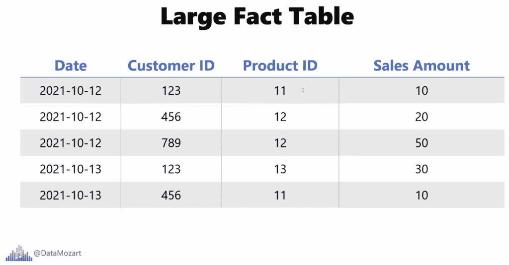

图片由作者提供

你只需简单地创建聚合表！实际上，这种情况非常罕见，或者说它更像是一个例外而不是规则，即分析需求是查看单个交易或单个记录作为最低级别的细节。在大多数情况下，你希望对汇总数据进行分析：比如，我们特定的一天有多少收入？或者，产品 X 的总销售额是多少？进一步，客户 X 总共花费了多少？

此外，您还可以对多个属性进行数据聚合，这通常是情况，并总结特定日期、客户和产品的数据。

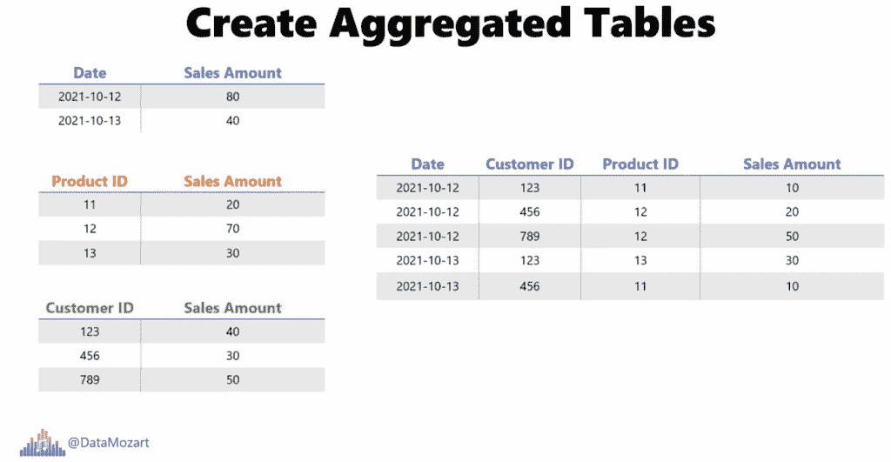

图片由作者提供

如果你在想聚合数据的意义何在……嗯，最终的目标是通过提前准备数据来减少行数，从而减少整体数据模型的大小。

因此，如果我想查看客户 X 在第一季度为产品 Y 花费的总销售额，我可以利用这些数据已经提前汇总的优势。

### 关键“成分”——让 Power BI“意识到”聚合！

好的，这是故事的一方面。现在，更有趣的部分来了。仅仅创建聚合本身并不能加快您的 Power BI 报告的速度——您需要让 Power BI 意识到聚合！

在我们进一步进行之前，先提一句：聚合意识只有在原始事实表使用 DirectQuery 存储模式时才会有效。我们很快就会解释如何设计和管理聚合以及如何设置表的正确存储模式。现在，只需记住原始事实表应该处于 DirectQuery 模式。

### 让我们开始构建我们的聚合！

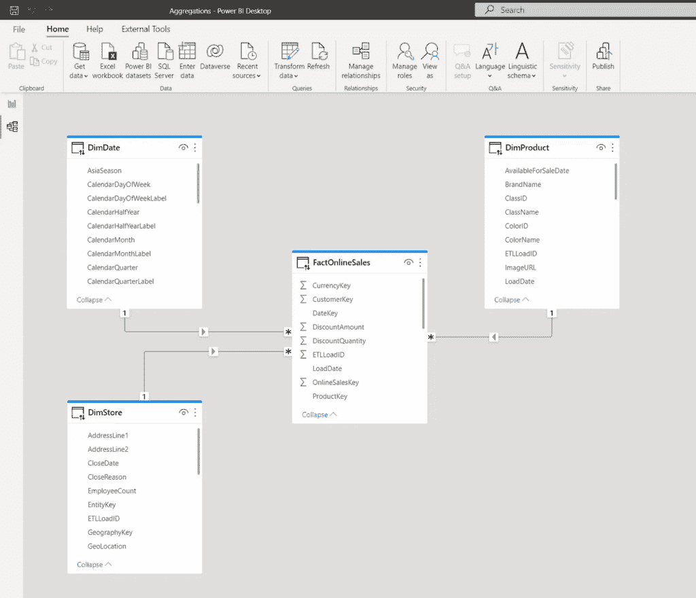

图片由作者提供

如您在上述插图中所见，我们的模型相当简单——由一个事实表（FactOnlineSales）和三个维度（DimDate、DimStore 和 DimProduct）组成。所有表目前都使用 DirectQuery 存储模式。

让我们去创建两个额外的表，我们将使用它们作为聚合表：第一个将按日期和产品分组数据，而另一个将使用日期和店铺进行分组：

```py
/*Table 1: Agg Data per Date & Product */
SELECT DateKey
       ,ProductKey
       ,SUM(SalesAmount) AS SalesAmount
       ,SUM(SalesQuantity) AS SalesQuantity 
FROM FactOnlineSales 
GROUP BY DateKey
        ,ProductKey
```

```py
/*Table 2: Agg Data per Date & Store */
SELECT DateKey
       ,StoreKey
       ,SUM(SalesAmount) AS SalesAmount
       ,SUM(SalesQuantity) AS SalesQuantity 
FROM FactOnlineSales 
GROUP BY DateKey
        ,StoreKey
```

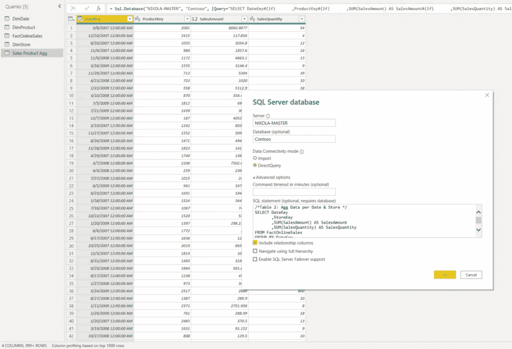

图片由作者提供

我已经将这些查询重命名为“销售产品聚合”和“销售店铺聚合”分别，并关闭了 Power Query 编辑器。

由于我们希望为大多数查询（这些查询检索按日期和/或产品/店铺汇总的数据）获得最佳性能，我将新创建的聚合表的存储模式从 DirectQuery 切换到 Import：

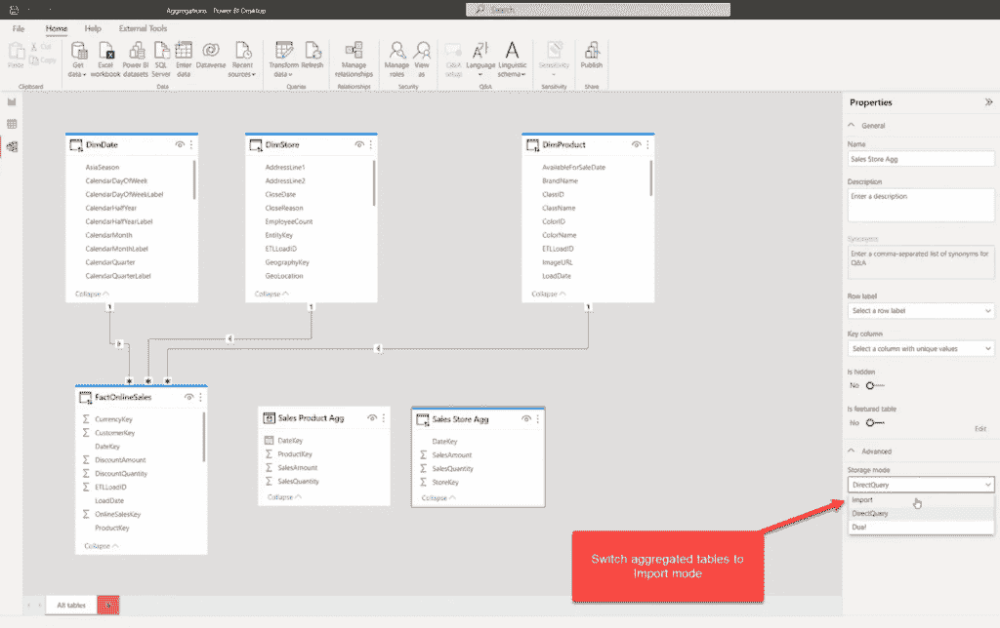

图片由作者提供

现在，这些表已加载到缓存内存中，但它们仍然没有连接到我们现有的维度表。让我们在维度和聚合表之间创建关系：

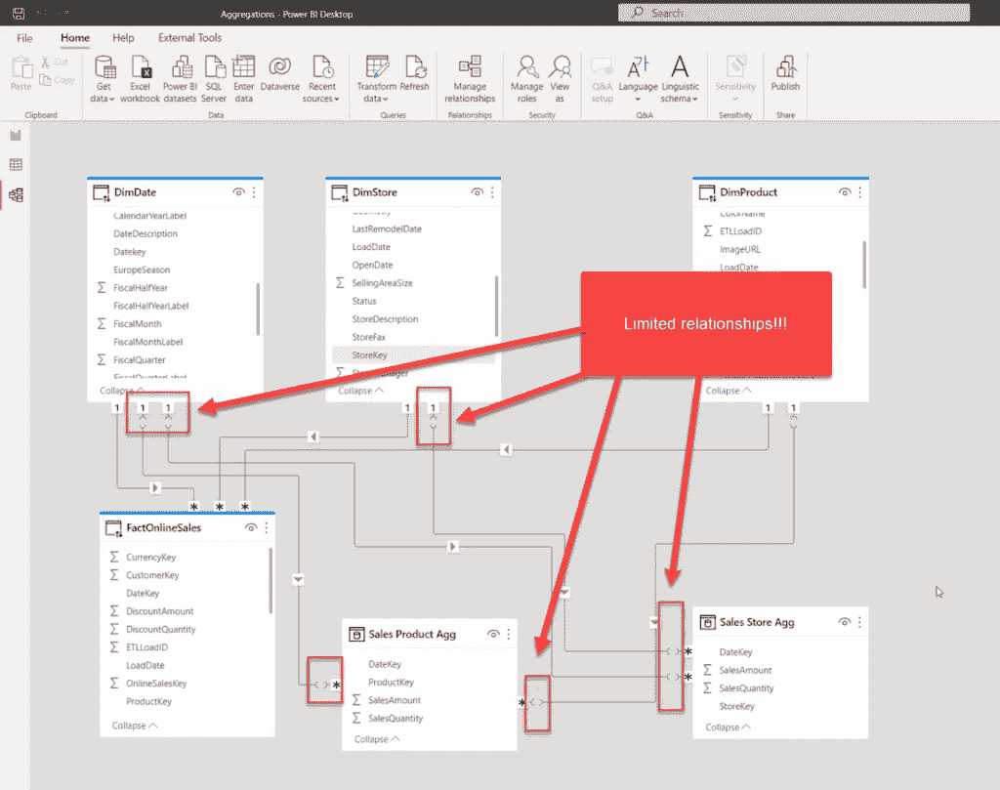

图片由作者提供

在我们继续之前，让我停下来片刻，解释一下我们创建关系时发生了什么。如果你还记得我们之前的文章，我提到过 Power BI 中有两种类型的关系：常规和限制性。这很重要：当不同源组（导入模式是一个源组，直接查询是另一个源组）的表之间存在关系时，你将有一个限制性关系！带着所有它的限制和约束。

但是，我有好消息要告诉你！如果我将我的维度表（如 DimDate、DimProduct、DimStore）的存储模式切换到 Dual，这意味着它们也将被加载到缓存内存中，并且根据在查询时哪个事实表提供数据，维度表将表现为导入模式（如果查询针对导入模式的事实表），或直接查询（如果从原始事实表检索数据）：

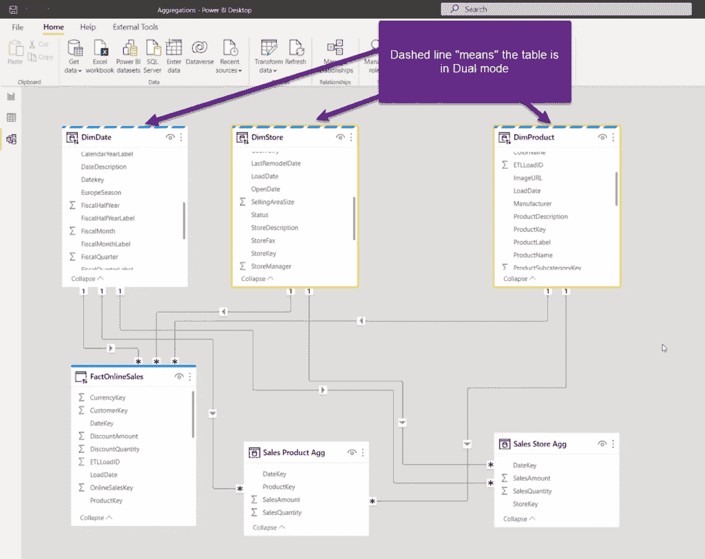

图片由作者提供

如你所注意到的，不再有更多的限制性关系，这真是太好了！

因此，总结一下，我们的模型配置如下：

+   原始的 FactOnlineSales 表（包含所有详细数据）- 直接查询

+   维度表（DimDate、DimProduct、DimStore）- 双重

+   聚合表（Sales Product Agg 和 Sales Store Agg）- 导入

太棒了！现在我们有了我们的聚合表，查询应该会更快，对吧？哔！错误！

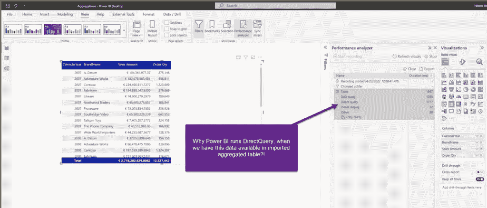

图片由作者提供

表视觉包含我们在 Sales Product Agg 表中预先聚合的这些列 - 那么，为什么 Power BI 运行直接查询而不是从导入的表中获取数据呢？这是一个合理的问题！

记得我一开始告诉你，我们需要让 Power BI**意识到**聚合表，这样它就可以在查询中使用了吗？

让我们回到 Power BI 桌面版，并做这件事：

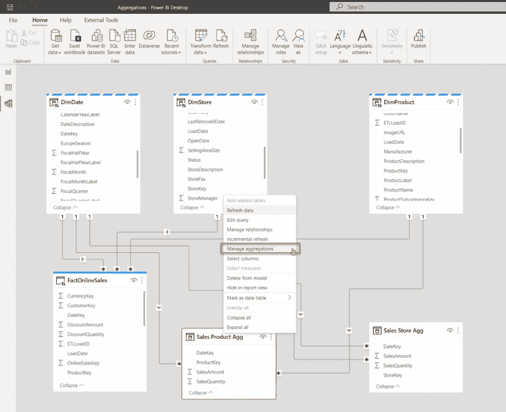

图片由作者提供

右键单击 Sales Product Agg 表，并选择管理聚合选项：

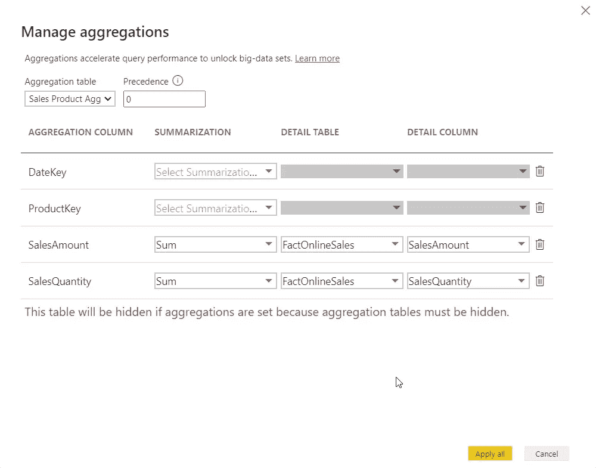

图片由作者提供

这里有一些重要的注意事项：为了使聚合工作，**原始事实表和聚合表之间的列数据类型必须匹配**！在我的情况下，我必须将我的聚合表中的 SalesAmount 列的数据类型从“十进制数”更改为“固定小数”。

此外，你看到红色的消息：这意味着，一旦你创建了一个聚合表，它将隐藏给最终用户！我已经为我的第二个聚合表（商店）应用了完全相同的步骤，现在这些表被隐藏了：

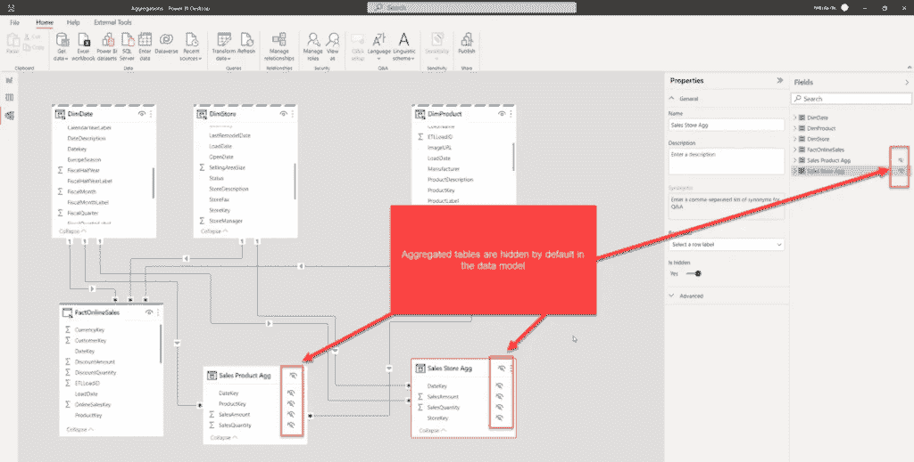

图片由作者提供

现在让我们回到报告页面并刷新，看看是否有什么变化：

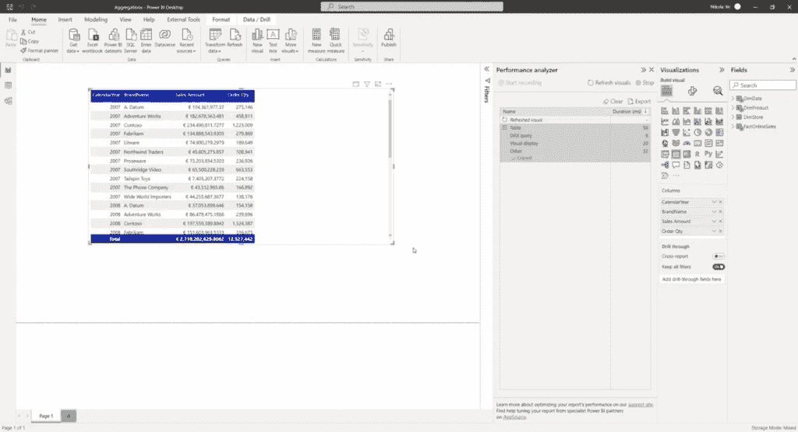

图片由作者提供

太好了！这次没有使用 DirectQuery，而且与渲染这个视觉需要近 2 秒的时间相比，这次只用了 58 毫秒！此外，如果我抓取查询并转到 DAX Studio 查看发生了什么...

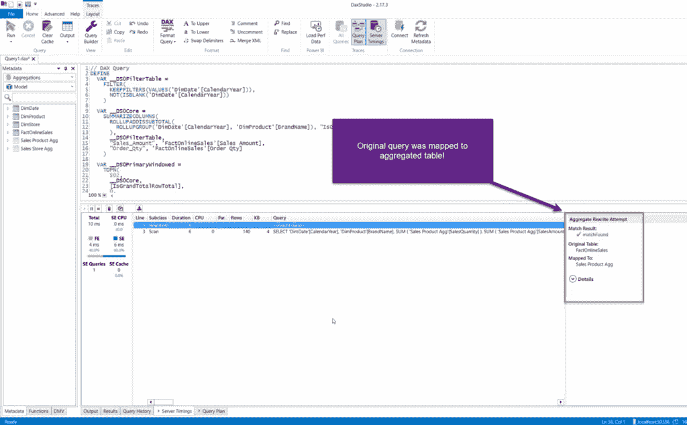

图片由作者提供

如你所见，原始查询被映射到目标从导入模式中的聚合表，并且“匹配找到”的消息清楚地表明视觉中的数据来自销售产品聚合表！即使我们的用户甚至不知道这个表在模型中存在！

即使在这个相对较小的数据集上，性能差异也非常大！

### 多个聚合表

现在，你可能想知道为什么我创建了两个不同的聚合表。好吧，让我们假设我有一个查询，显示各种商店的数据，也按日期维度分组。而不是在 DirectQuery 模式下扫描 1260 万行，引擎可以轻松地从缓存中提供数据，从只有几千行的表中提供数据！

实际上，你可以在数据模型中创建多个聚合表 – 不仅结合两个分组属性（就像我们在这里使用日期+产品或日期+商店），还包括额外的属性（例如，在一个聚合表中包括日期以及产品和商店）。这样，你将增加表的粒度，但如果你的视觉需要显示产品和商店的数字，你将能够仅从缓存中检索结果！

在我们的例子中，由于我没有包含产品和商店的预聚合数据级别的数据，如果我在表中包含商店，我就失去了拥有聚合表的好处：

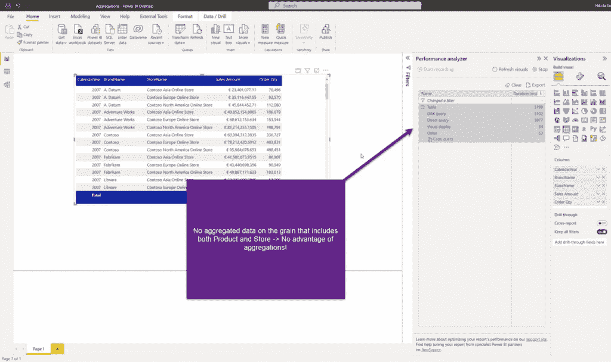

图片由作者提供

因此，为了利用聚合，你需要确保它们在视觉所需的精确粒度级别上定义！

### 聚合优先级

在处理聚合时，还有一个重要的属性需要理解——优先级！当打开“管理聚合”对话框时，有一个选项可以设置聚合的优先级：

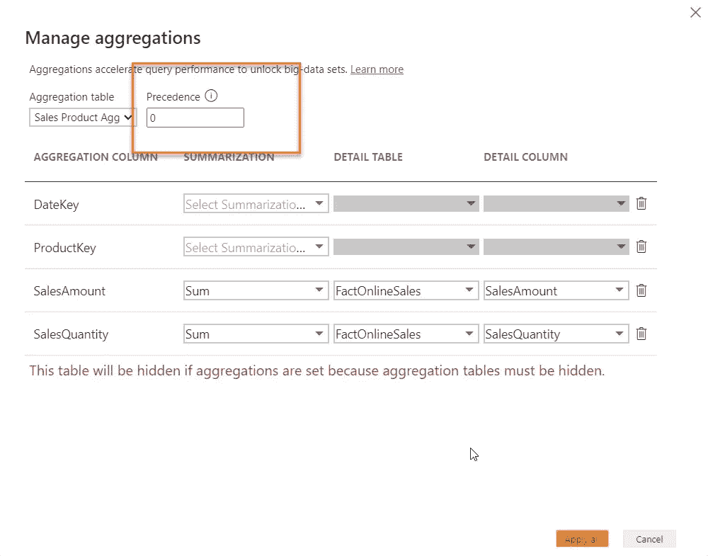

图片由作者提供

这个值“指示”Power BI 在查询可以从多个不同的聚合中满足的情况下使用哪个聚合表！默认情况下，它设置为 0，但你可以更改这个值。数字越高，该聚合的优先级就越高。

为什么这很重要？好吧，想象一下这样一个场景，你有一个包含数十亿行的主事实表。然后，你在不同的粒度上创建了多个聚合表：

1.  聚合表 1：在日期级别上分组数据 – 有约 2000 行（5 年的日期）

1.  聚合表 2：在日期和产品级别上分组数据 – 有约 100,000 行（5 年的日期 x 50 个产品）

1.  聚合表 3：在日期、产品和商店级别上分组数据 – 有约 5,000,000 行（100,000 行来自上一个粒度 x 50 家商店）

现在，假设报告的视觉显示仅在日期级别上聚合数据。你认为：是扫描表 1（2,000 行）还是表 3（5 百万行）更好？我相信你知道答案：）从理论上讲，查询可以从两个表中满足，那么为什么还要依赖于 Power BI 的任意选择呢？！

相反，当你创建多个具有不同粒度级别的聚合表时，确保以这种方式设置优先级值，以便具有较低粒度的表获得优先权！

### 结论

聚合是 Power BI 中最强大的功能之一，尤其是在大数据集的场景中！尽管复合模型功能和聚合可以独立使用，但这两个功能通常协同使用，以提供性能和所有数据细节之间最优化平衡的最佳方案！

感谢阅读！
