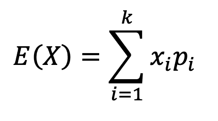
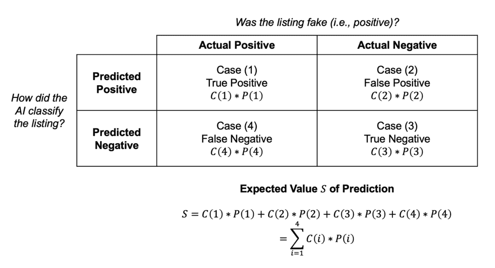
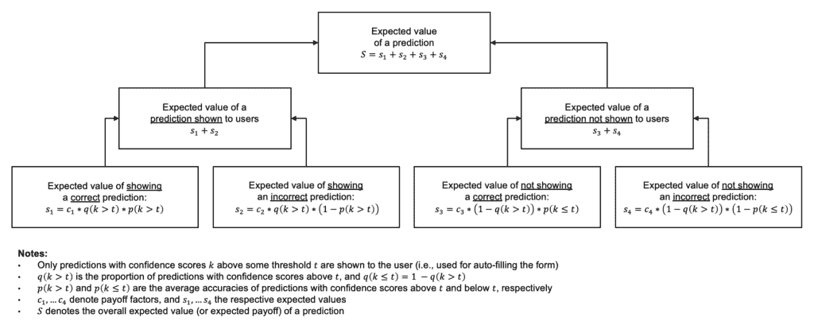

# 人工智能产品管理中的期望值分析

> [`towardsdatascience.com/expected-value-analysis-in-ai-product-management/`](https://towardsdatascience.com/expected-value-analysis-in-ai-product-management/)

在不确定性下进行决策是产品团队的一个核心关注点。大小决策往往需要在时间压力下做出，尽管对问题和解决方案空间的信息可能不完整——甚至可能不准确。这可能是由于缺乏相关的用户研究、对业务背景的复杂性了解有限（通常见于那些做得很少的以客户为中心和跨团队合作的公司），以及/或对某种技术可以和不可以做什么的理解有缺陷（尤其是在使用新颖、未经测试的技术构建领先产品时）。

对于人工智能产品团队来说，情况特别具有挑战性，至少有三个原因。首先，许多人工智能算法本质上具有概率性，因此会产生不确定的结果（例如，模型预测可能正确或错误，有一定的概率）。其次，高质量、相关的大量数据可能并不总是可用，以正确训练人工智能系统。第三，最近围绕人工智能——特别是生成式人工智能——的炒作爆炸性增长，导致客户、华尔街分析师（不可避免地）以及高层管理决策者对期望值产生了不切实际的想法；许多这些利益相关者的感觉似乎是，现在几乎任何问题都可以用人工智能轻松解决。不用说，产品团队管理这样的期望值可能很困难。

那么，人工智能产品团队有什么希望呢？虽然没有灵丹妙药，但本文向读者介绍了“期望值”的概念以及如何将其用于指导人工智能产品管理中的决策。在简要概述关键理论概念之后，我们将探讨三个现实生活中的案例研究，强调期望值分析如何帮助人工智能产品团队在产品生命周期的不确定性下做出战略决策。鉴于主题的基础性质，本文的目标受众包括数据科学家、人工智能产品经理、工程师、用户体验研究员和设计师、经理以及所有希望开发优秀人工智能产品的相关人员。

**注意：** 下文中所有图表和公式均由本文作者创建。

## 期望值

在正式定义期望值之前，让我们考虑两个简单的游戏来建立我们的直觉。

### 掷骰子的游戏

在第一局游戏中，想象你正在和朋友们参加一个掷骰子的比赛。每个人都可以公平地掷一个六面的骰子*N*次。每次掷骰子的得分由掷骰子后骰子顶面的点数决定；1、2、3、4、5 和 6 是任何给定掷骰子可能得到的唯一得分。在*N*次掷骰子结束后得分最高的玩家赢得比赛。假设*N*是一个很大的数字（比如说，500），我们期望在比赛结束时看到什么？会出现一个明显的赢家，还是会有平局？

结果表明，随着*N*的增大，每位玩家的总得分很可能收敛到 3.5*N*。例如，在 500 次掷骰子后，你和你朋友的得分很可能在 3.5*500 = 1750 左右。为了理解这一点，请注意，对于一个公平的六面骰子，任何一面在掷骰子后成为顶面的概率是 1/6。因此，平均每次掷骰子的得分将是(1 + 2 + 3 + 4 + 5 + 6)/6 = 3.5，即每次掷骰子可能得到的得分的平均值——这也恰好是掷骰子的期望值。假设所有掷骰子的结果都是相互独立的，我们预计*N*次掷骰子的平均得分将是 3.5。因此，在 500 次掷骰子后，如果每个玩家的总得分大约是 1750，我们不应该感到惊讶。事实上，数学中有一个所谓的**大数定律**，它表明如果你足够多次地重复一个实验（比如掷骰子），所有这些实验的平均结果几乎肯定将收敛到期望值。

### 轮盘赌游戏

接下来，让我们考虑轮盘赌，这是一种在赌场中流行的游戏。想象一下，你正在和一个朋友玩一个简化的轮盘赌游戏，如下所示。轮盘有 38 个槽位，游戏在经过*N*轮后结束。对于每一轮，你必须选择一个介于 1 到 38 之间的整数，然后你的朋友将旋转轮盘，并将一个小球扔到旋转的轮盘上。一旦轮盘停止旋转，如果小球最终落在你选择的数字对应的槽位中，你的朋友将支付你$35；然而，如果小球落在其他任何槽位中，你必须支付你的朋友$1。在*N*轮之后，你和你朋友期望能赚多少钱？

你可能会想，既然 35 美元远远超过 1 美元，你的朋友在游戏结束时最终会付给你相当多的钱——但等等。让我们将我们在掷骰子游戏中使用的基本方法应用到这个看似有利可图的轮盘赌游戏中。对于任何一轮，球最终落在你选择的数字口袋的概率是 1/38。球落在其他口袋的概率是 37/38。从你的角度来看，每轮的平均结果是 $35*1/38 – $1*37/38 = -$0.0526。所以，看起来你实际上在每一轮后实际上会欠你的朋友一点五分钱。经过 *N* 轮，你将损失大约 $0.0526**N**。如果你像上面的掷骰子游戏那样玩 500 轮，你将大约支付给你的朋友 26 美元。这是一个“房子”（即赌场，或者在这种情况下，你的朋友）有利可图的游戏的例子。

### 正式定义

设 *X* 为一个可以产生 *k* 个结果值之一的随机变量，分别为 *x*[1]、**x**[2]、…、**x**[k]，每个结果发生的概率分别为 **p**[1]、***p***[2]、…、***p***[k]。*X* 的 *期望值*，*E(X)*，是结果值乘以其发生的概率之和：

*N* 次独立发生的 *X* 的总期望值将是 *N*E(X)*。

下面的视频将介绍一些关于期望值计算的更多实际示例：

在以下案例研究中，我们将看到期望值分析如何帮助在不确定性下做出决策。为了保护涉及企业的匿名性，整个案例研究中使用了虚构的公司名称。

## 案例研究 1：电子商务中的欺诈检测

*Cars Online* 是一个在线平台，用于在欧洲范围内转售二手车。合法的汽车经销商和二手车的私人车主可以在 *Cars Online* 上列出他们的车辆进行销售。一个典型的列表将包括卖家的要价、关于汽车的事实（例如，其基本属性、特殊功能和任何损坏/磨损的细节），以及汽车内部和外观的照片。买家可以在平台上浏览众多列表，找到喜欢的列表后，可以点击列表页面上的按钮联系卖家安排看车，并最终完成购买。*Cars Online* 向卖家收取小额月费以在平台上展示列表。为了推动这种基于订阅的收入，卖家注册平台和创建列表的过程被尽可能地简化。

问题在于，平台上的某些列表实际上可能是虚假的。降低创建列表门槛的一个意想不到的后果是，恶意用户可以设置虚假卖家账户并创建虚假列表（通常冒充合法汽车经销商）来诱骗并可能欺骗毫无戒心的买家。虚假列表可以从两个方面对*在线汽车*产生负面影响。首先，担心声誉受损，受影响的卖家可能会将他们的列表转移到其他竞争平台，公开批评*在线汽车*的明显宽松的安全标准（这可能会触发其他卖家也离开平台），甚至提起损害赔偿诉讼。其次，受影响的买家（以及那些在媒体、社交媒体、朋友和家人那里听说欺诈事件的人）也可能放弃该平台，并在网上写下负面评论——所有这些都可能进一步说服卖家（平台的收入来源）离开。

在这样的背景下，*在线汽车*的首席产品官（CPO）指派了一位产品经理和一个跨职能团队，包括客户成功代表、数据科学家和工程师，来评估使用人工智能对抗虚假列表这一问题的可能性。CPO 对单纯的看法不感兴趣——她希望得到一个基于数据的、实施人工智能系统所能带来的净价值的估计，该系统能够帮助平台快速检测并删除虚假列表，防止它们造成任何损害。

通过考虑正确和错误预测的概率以及相应的收益和成本，可以使用预期价值分析来估计人工智能系统的净价值。特别是，我们可以区分四种情况：（1）正确检测到的虚假列表（*真阳性*），（2）被错误地认为是虚假的合法列表（*假阳性*），（3）正确检测到的合法列表（*真阴性*），和（4）被错误地认为是合法的虚假列表（*假阴性*）。每个情况 *i* 的净货币影响，*C(i)*，可以通过历史数据和利益相关者访谈来估计。真阳性和假阳性都将导致*在线汽车*为移除已识别的列表付出努力，但假阳性将导致额外的成本（例如，由于移除合法列表而失去的收入以及恢复这些列表的努力成本）。与此同时，真阴性不应产生任何成本，而假阴性可能非常昂贵——这些代表了 CPO 旨在对抗的欺诈行为。

给定一个具有一定预测准确性的 AI 模型，如果 *P(i)* 表示每个情况 *i* 在实践中发生的概率，那么总和 *S = C(1)*P(1) + C(2)*P(2) + C(3)*P(3) + C(4)*P(4)* 反映了每个预测的预期价值（见下图 1）。对于 *N* 个预测的总预期价值将是 *N*S*。

图 1：在线汽车欺诈预测案例研究中的预期价值

根据给定 AI 模型的预测性能配置文件和对四个案例（从真阳性到假阴性）的预期价值的估计，CPO 可以更好地了解构建 AI 系统进行欺诈检测的预期价值，并据此对项目做出是/否的决定。当然，与构建、运营和维护 AI 系统通常相关的额外固定和可变成本也应纳入整体决策考虑。

[这篇文章](https://medium.com/data-science/machine-learning-for-lead-management-4f15e52e732a)考虑了一个类似的案例研究，其中一家招聘机构决定实施一个 AI 系统来识别和优先处理好的潜在客户（客户可能雇佣的候选人）而不是差的潜在客户。鼓励读者阅读该案例研究，并思考其与这里讨论的案例的相似之处和不同之处。

## 案例研究 2：自动完成采购订单

美国汽车制造商*ACME Auto*的采购部门每月都会创建大量的采购订单。制造一辆汽车需要数千个单独的部件，这些部件需要按时以正确的质量标准从合格的供应商那里采购。一支采购文员团队负责手动创建采购订单；这涉及到填写一个包含多个数据字段的在线表格，这些数据字段定义了每个订单要购买的每个项目的精确规格和数量。不用说，这是一项耗时且易出错的 activity，作为公司范围内成本削减计划的一部分，*ACME Auto*的首席采购官要求她部门内的跨职能产品团队使用 AI 大幅自动化采购订单的创建。

在与采购文员紧密合作进行用户研究的基础上，产品团队决定构建一个 AI 功能来自动填写采购订单中的字段。AI 可以根据采购文员提供的任何初始输入以及从主数据表、生产线输入等来源的相关信息组合来自动填写字段。然后，采购文员可以审查自动填写的订单，并可以选择接受 AI 生成的每个字段的建议（即预测）或用手动输入覆盖错误的建议。在 AI 不确定要填写的正确值的情况下（例如，给定预测的低*模型置信度分数*），该字段将被留空，文员必须手动填写一个合适的值。可以使用称为*去噪*的方法构建这种灵活自动填写表单的 AI 功能，如[这篇文章](https://medium.com/data-science/dawn-of-the-denoisers-multi-output-ml-models-for-tabular-data-imputation-317711d7a193)所述。

为了确保高质量，产品团队希望为模型置信度分数设置一个阈值，这样只有置信度分数高于此预定义阈值的预测才会展示给用户（即用于自动填写采购订单表单）。问题是：应该选择什么阈值值？

让 *c*[1] 和 **c**[2] 分别表示向用户展示正确和错误预测的收益（由于置信度阈值以上）。让 **c**[3] 和 **c**[4] 分别表示不向用户展示正确和错误预测的收益（由于置信度阈值以下）。假设，展示正确预测（**c**[1]）和不展示错误预测（**c**[4]）应该有正收益（即好处）。相比之下，*c*[2] 和 *c*[3] 应该是负收益（即成本）。选择过低的阈值会增加展示错误预测的概率，这些预测需要店员手动更正（*c*[2]）。但选择过高的阈值会增加正确预测不被展示的概率，留下空白字段在采购订单表单上，店员需要花费一些努力手动填写（*c*[3]）。因此，产品团队面临一个权衡——预期值分析能否帮助解决它？

事实上，团队能够通过利用用户研究和业务领域专业知识来估计收益因素 *c*[1]、*c*[2]、*c*[3] 和 *c*[4] 的合理值。此外，产品团队的数据科学家能够通过在 *ACME Auto* 历史采购订单数据集上训练一个示例 AI 模型并分析结果来估计产生这些成本的概率。假设 *k* 是附加到预测上的置信度分数。给定预定义的模型置信度阈值 *t*，让 *q*(*k* > *t*) 表示置信度分数大于 *t* 的预测比例；这些是用于自动填写采购订单表单的预测。置信度分数低于阈值值的预测比例是 *q*(*k* ≤ *t*) = 1 – **q**(**k** > **t**)。此外，让 *p*(*k* > *t*) 和 *p*(*k* ≤ *t*) 表示置信度分数大于 *t* 和最多 *t* 的预测的平均准确率。每项预测的预期值（或预期收益） *S* 可以通过将每个收益驱动因素（表示为 *s*[1]、*s*[2]、*s*[3] 和 *s*[4]）的预期值相加得到，如图 2 所示。然后产品团队的任务是测试各种阈值值 *t* 并确定一个最大化预期收益 *S* 的阈值。

图 2：ACME 汽车案例研究中每项预测的预期收益

## 案例研究 3：标准化 AI 设计指南

*Ex Corp*的 CEO，一家全球企业软件供应商，最近宣布了她将公司转变为“以 AI 为先”的意图，并将所有产品和服务注入高价值的 AI 功能。为了支持这一全公司范围的转型努力，首席产品官要求*Ex Corp*的中央设计团队制定一套一致的设计指南，以帮助团队构建增强用户体验的人工智能产品。一个关键挑战是在创建过于薄弱/过于高级的指导（给予个别产品团队更大的解释自由度，同时冒着在产品团队间不一致应用指导的风险）和过于严格的指导（在未充分考虑特定产品的例外或定制需求的情况下，强制在产品团队间实施标准化）之间进行权衡。

中央设计团队最初提出的一个有良好意图的指导建议是在用户界面（例如，“最佳选项”、“良好替代品”或类似内容）旁边显示预测标签，以使用户对预测的预期质量/相关性有所了解。人们认为，显示这样的定性标签将帮助用户在与人工智能产品的互动中做出明智的决定，而不会因难以解释的统计数据（如模型置信度分数）而感到不知所措。特别是，中央设计团队相信，通过规定一套一致的全局模型置信度阈值，可以为*Ex Corp*旗下的产品在模型置信度分数和定性标签之间创建一个标准化映射。例如，置信度分数大于 0.8 的预测可以标记为“最佳”，置信度分数在 0.6 到 0.8 之间的预测可以标记为“良好”，依此类推。

正如我们在之前的案例研究中看到的，使用期望值分析推导出特定用例的模型置信度阈值是可能的，因此尝试将这个阈值推广到产品组合中的所有用例似乎很有吸引力。然而，这比最初看起来要复杂得多，期望值分析背后的概率理论可以帮助我们理解原因。考虑两个简单的游戏，抛硬币和掷骰子。抛硬币有两个可能的结果，正面或反面，每种结果发生的概率都是 1/2（假设硬币是公平的）。同时，正如我们之前讨论的，掷一个公平的六面骰子，顶面有六个可能的结果（1、2、3、4、5 或 6 点），每种结果发生的概率都是 1/6。一个关键的见解是，随着随机变量的可能结果数量（也称为结果集的*基数*）的增加，正确猜测任意事件结果通常变得越来越困难。如果你猜测下一次抛硬币的结果是正面，平均来说你会猜对一半的时间。但如果你猜测下一次掷骰子会掷出任何特定的数字（比如 3），平均来说你只会猜对六分之一的时间。

现在，如果我们为硬币和骰子游戏都设定一个全球置信度阈值，比如说 0.4，会怎么样呢？如果一个用于骰子游戏的 AI 模型预测下一次投掷结果是 3，置信度得分为 0.45，那么我们可能会高兴地将其预测标记为“良好”甚至“优秀”；毕竟，置信度得分高于预定义的全局阈值，并且显著高于 1/6（随机猜测的成功概率）。然而，如果一个用于硬币游戏的 AI 模型预测下一次抛硬币结果是正面，置信度得分同样是 0.45，我们可能会怀疑这是一个假阳性，根本不会向用户展示这个预测；尽管置信度得分高于预定义的阈值，但它仍然低于 0.5（随机猜测的成功概率）。

上述分析表明，从标准化设计指南中删除一个单一、适用于所有情况的显示定性标签的规定，对于 AI 用例来说可能是合适的。相反，也许应该赋予各个产品团队权力，让他们根据特定用例做出如何显示定性标签（如果有的话）的决定。

## 总结

在不确定性下的决策是 AI 产品团队的关键关注点，在由 AI 主导的未来可能会变得更加重要。在这种情况下，期望值分析可以帮助指导 AI 产品管理。不确定结果的期望值代表了该结果的理论、长期、平均价值。通过实际案例研究，本文展示了期望值分析如何帮助团队在产品生命周期的不确定性下做出明智、战略性的决策。

然而，与任何此类数学建模方法一样，强调两个重要观点是值得的。首先，期望值的计算仅与其结构完整性和输入的准确性相当。如果未包括所有相关的价值驱动因素，计算将结构上不完整，得出的结果将不准确。使用如图 1 和 2 所示的矩阵和树图等概念框架可以帮助团队验证其计算的完整性。读者可以参考[这本书](https://www.amazon.com/Conceptual-Frameworks-Structuring-Decisions-Presentations-ebook/dp/B07GC1JDV8)来了解如何利用概念框架。如果用于推导结果值及其概率的数据和/或假设有误，那么得出的期望值将不准确，如果用于告知战略决策（例如，错误地淘汰一个有希望的产品），则可能造成损害。其次，通常将定量方法（如期望值分析）与定性方法（例如，客户访谈，观察用户如何与产品互动）相结合是一个好主意，以获得全面的视角。定性洞察可以帮助我们对期望值计算中的输入进行合理性检查，更好地解释定量结果，并最终为决策制定得出全面的建议。
