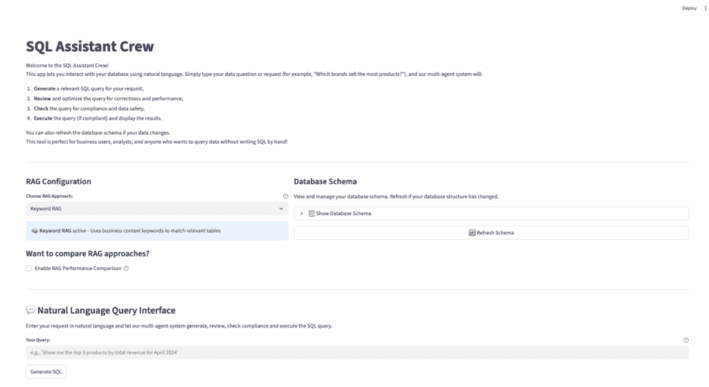
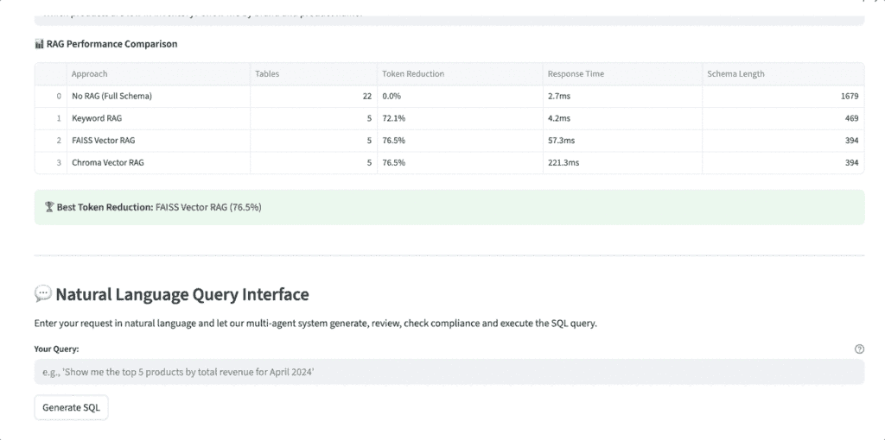

# 多智能体 SQL 助手，第二部分：构建 RAG 管理器

> [原文链接](https://towardsdatascience.com/multi-agent-sql-assistant-part-2-building-a-rag-manager/)

<mdspan datatext="el1762405237828" class="mdspan-comment">之前</mdspan>在我的[博客文章](https://towardsdatascience.com/a-multi-agent-sql-assistant-you-can-trust-with-human-in-loop-checkpoint-llm-cost-control/)中，我探讨了如何使用 CrewAI & Streamlit 构建多智能体 SQL 助手。用户可以用自然语言查询 SQLite 数据库。AI 代理将根据用户输入生成 SQL 查询，审查它，并在运行数据库以获取结果之前检查其合规性。我还实现了人工检查点以保持控制，并显示了每个查询相关的 LLM 成本，以提高透明度和成本控制。虽然原型很好，并且在我的小型演示数据库中产生了良好的结果，但我知道这不足以应对现实生活中的数据库。在之前的设置中，我正在将整个数据库模式作为上下文与用户输入一起发送。随着数据库模式变得越来越大，将完整模式传递给 LLM 会增加标记使用，减慢响应时间，并使幻觉的可能性增加。我需要一种只向 LLM 提供相关模式片段的方法。这就是**RAG（检索增强生成）**发挥作用的地方。

在这篇博客文章中，我构建了一个 RAG 管理器，并将**多个**RAG 策略添加到我的 SQL 助手中，以比较它们在响应时间和标记使用等指标上的性能。助手现在支持四种 RAG 策略：

+   **无 RAG:** 传递完整模式（比较的基线）

+   **关键词 RAG:** 使用特定领域的关键词匹配来选择相关表格

+   **FAISS RAG:** 通过 FAISS 利用`all-MiniLM-L6-v2`嵌入实现语义向量相似度

+   **Chroma RAG:** 使用 ChromaDB 的持久向量存储解决方案，适用于可扩展的生产级搜索

对于这个项目，我只关注实用、轻量级且成本效益高（免费）的 RAG 技术。你可以在其上添加任意数量的实现，并选择最适合你情况的最佳方案。为了便于实验和分析，我构建了一个交互式性能比较工具，该工具评估了所有四种策略在标记减少、表格数量、响应时间和查询准确性方面的表现。



应用程序截图，作者提供

## 构建 RAG 管理器

`rag_manager.py` 文件包含了 RAG 管理器的完整实现。首先，我创建了一个 `BaseRAG` 类 - 这是一个模板，我用于所有不同的 RAG 策略。它确保每个 RAG 方法都遵循相同的结构。任何新的策略都将有两个方面：一个用于根据用户查询获取相关模式的方法，另一个用于解释该方法的内容。通过使用**抽象基类**（ABC），我保持了代码的整洁、模块化和易于扩展。

```py
from typing import Dict, List, Any, Optional
from abc import ABC, abstractmethod

class BaseRAG(ABC):
    """Base class for all RAG implementations."""

    def __init__(self, db_path: str = DB_PATH):
        self.db_path = db_path
        self.name = self.__class__.__name__

    @abstractmethod
    def get_relevant_schema(self, user_query: str, max_tables: int = 5) -> str:
        """Get relevant schema for the user query."""
        pass

    @abstractmethod
    def get_approach_info(self) -> Dict[str, Any]:
        """Get information about this RAG approach."""
        pass 
```

## 无 RAG 策略

这基本上是我之前使用的方法，其中我将整个数据库模式作为上下文发送给 LLM，没有任何过滤或优化。这种方法最适合非常小的模式（最好少于 10 个表）。

```py
class NoRAG(BaseRAG):
    """No RAG - returns full schema."""

    def get_relevant_schema(self, user_query: str, max_tables: int = 5) -> str:
        return get_structured_schema(self.db_path)

    def get_approach_info(self) -> Dict[str, Any]:
        return {
            "name": "No RAG (Full Schema)",
            "description": "Uses complete database schema",
            "pros": ["Simple", "Always complete", "No setup required"],
            "cons": ["High token usage", "Slower for large schemas"],
            "best_for": "Small schemas (< 10 tables)"
        } 
```

## 关键字 RAG 策略

在关键字 RAG 方法中，我使用了一组预定义的关键字，这些关键字映射到模式中的每个表。当用户提出问题时，系统会在查询中检查关键字匹配，并仅选择最相关的表。这样，我就不会将整个模式发送给 LLM，从而节省令牌并加快速度。当你的模式熟悉且查询与业务相关或遵循常见模式时，这种方法效果很好。

`_build_table_keywords(self)` 方法是关键字匹配逻辑工作的核心。它包含针对模式中每个表的硬编码关键字映射。它有助于将用户查询术语（如“销售”、“品牌”、“客户”）与最可能相关的表关联起来。

```py
class KeywordRAG(BaseRAG):
    """Keyword-based RAG using business context matching."""

    def __init__(self, db_path: str = DB_PATH):
        super().__init__(db_path)
        self.table_keywords = self._build_table_keywords()

    def _build_table_keywords(self) -> Dict[str, List[str]]:
        """Build keyword mappings for each table."""
        return {
            'products': ['product', 'item', 'catalog', 'price', 'category', 'brand', 'sales', 'sold'],
            'product_variants': ['variant', 'product', 'sku', 'color', 'size', 'brand', 'sales', 'sold'],
            'customers': ['customer', 'user', 'client', 'buyer', 'person', 'email', 'name'],
            'orders': ['order', 'purchase', 'transaction', 'sale', 'buy', 'total', 'amount', 'sales'],
            'order_items': ['item', 'product', 'quantity', 'line', 'detail', 'sales', 'sold', 'brand'],
            'payments': ['payment', 'pay', 'money', 'revenue', 'amount'],
            'inventory': ['inventory', 'stock', 'quantity', 'warehouse', 'available'],
            'reviews': ['review', 'rating', 'feedback', 'comment', 'opinion'],
            'suppliers': ['supplier', 'vendor', 'procurement', 'purchase'],
            'categories': ['category', 'type', 'classification', 'group'],
            'brands': ['brand', 'manufacturer', 'company', 'sales', 'sold', 'quantity', 'total'],
            'addresses': ['address', 'location', 'shipping', 'billing'],
            'shipments': ['shipment', 'delivery', 'shipping', 'tracking'],
            'discounts': ['discount', 'coupon', 'promotion', 'offer'],
            'warehouses': ['warehouse', 'facility', 'location', 'storage'],
            'employees': ['employee', 'staff', 'worker', 'person'],
            'departments': ['department', 'division', 'team'],
            'product_images': ['image', 'photo', 'picture', 'media'],
            'purchase_orders': ['purchase', 'procurement', 'supplier', 'order'],
            'purchase_order_items': ['purchase', 'procurement', 'supplier', 'item'],
            'order_discounts': ['discount', 'coupon', 'promotion', 'order'],
            'shipment_items': ['shipment', 'delivery', 'item', 'tracking']
        }

    def get_relevant_schema(self, user_query: str, max_tables: int = 5) -> str:
        import re

        # Score tables by keyword relevance
        query_words = set(re.findall(r'\b\w+\b', user_query.lower()))
        table_scores = {}

        for table_name, keywords in self.table_keywords.items():
            score = 0

            # Count keyword matches
            for keyword in keywords:
                if keyword in query_words:
                    score += 3
                # Partial matches
                for query_word in query_words:
                    if keyword in query_word or query_word in keyword:
                        score += 1

            # Bonus for exact table name match
            if table_name.lower() in query_words:
                score += 10

            table_scores[table_name] = score

        # Get top scoring tables
        sorted_tables = sorted(table_scores.items(), key=lambda x: x[1], reverse=True)
        relevant_tables = [table for table, score in sorted_tables[:max_tables] if score > 0]

        # Fallback to default tables if no matches
        if not relevant_tables:
            relevant_tables = self._get_default_tables(user_query)[:max_tables]

        # Build schema for selected tables
        return self._build_schema(relevant_tables)

    def _get_default_tables(self, user_query: str) -> List[str]:
        """Get default tables based on query patterns."""
        query_lower = user_query.lower()

        # Sales/revenue queries
        if any(word in query_lower for word in ['revenue', 'sales', 'total', 'amount', 'brand']):
            return ['orders', 'order_items', 'product_variants', 'products', 'brands']

        # Product queries
        if any(word in query_lower for word in ['product', 'item', 'catalog']):
            return ['products', 'product_variants', 'categories', 'brands']

        # Customer queries
        if any(word in query_lower for word in ['customer', 'user', 'buyer']):
            return ['customers', 'orders', 'addresses']

        # Default
        return ['products', 'customers', 'orders', 'order_items']

    def _build_schema(self, table_names: List[str]) -> str:
        """Build schema string for specified tables."""
        if not table_names:
            return get_structured_schema(self.db_path)

        conn = sqlite3.connect(self.db_path)
        cursor = conn.cursor()
        schema_lines = ["Available tables and columns:"]

        try:
            for table_name in table_names:
                cursor.execute(f"PRAGMA table_info({table_name});")
                columns = cursor.fetchall()
                if columns:
                    col_names = [col[1] for col in columns]
                    schema_lines.append(f"- {table_name}: {', '.join(col_names)}")
        finally:
            conn.close()

        return '\n'.join(schema_lines)

    def get_approach_info(self) -> Dict[str, Any]:
        return {
            "name": "Keyword RAG",
            "description": "Uses business context keywords to match relevant tables",
            "pros": ["Fast", "No external dependencies", "Good for business queries"],
            "cons": ["Limited by predefined keywords", "May miss complex relationships"],
            "best_for": "Business queries with clear domain terms"
        } 
```

## FAISS RAG 方法

**FAISS RAG** 策略是事情开始变得智能的地方。不是将整个模式倾倒进去，而是使用句子转换器将每个表的元数据（列、关系、业务上下文）嵌入到向量中。当用户提出问题时，它也会嵌入到那个查询中，并使用 FAISS 在“意义”上进行语义搜索匹配，而不仅仅是关键字。这对于用户不是很具体或表有相关术语的查询非常完美。我喜欢 FAISS，因为它免费、本地运行，并且在节省令牌的同时给出相当准确的结果。

唯一的缺点是设置它需要一些额外的步骤，并且它比基本方法使用更多的内存。LLMs 和嵌入模型不知道你的表意味着什么，除非你向它们解释。在 `_get_business_context()` 方法中，我们需要手动编写每个表在业务中代表的简短描述。

在 `_extract_table_info()` 方法中，我从 SQLite 的 PRAGMA 查询中提取表名、列名和外键关系，以构建一个包含每个表结构化信息的字典。最后，在 `_create_table_description()` 方法中，为每个表构建了全面的描述，以便由 SentenceTransformer 嵌入。

```py
class FAISSVectorRAG(BaseRAG):
    """FAISS-based vector RAG using sentence transformers."""

    def __init__(self, db_path: str = DB_PATH):
        super().__init__(db_path)
        self.model = None
        self.index = None
        self.table_info = {}
        self.table_names = []
        self._initialize()

    def _initialize(self):
        """Initialize the FAISS vector store and embeddings."""
        try:
            from sentence_transformers import SentenceTransformer
            import faiss
            import numpy as np

            print("🔄 Initializing FAISS Vector RAG...")

            # Load embedding model
            self.model = SentenceTransformer('all-MiniLM-L6-v2')
            print("✅ Loaded embedding model: all-MiniLM-L6-v2")

            # Extract table information and create embeddings
            self.table_info = self._extract_table_info()

            # Create embeddings for each table
            table_descriptions = []
            self.table_names = []

            for table_name, info in self.table_info.items():
                description = self._create_table_description(table_name, info)
                table_descriptions.append(description)
                self.table_names.append(table_name)

            # Generate embeddings
            print(f"🔄 Generating embeddings for {len(table_descriptions)} tables...")
            embeddings = self.model.encode(table_descriptions)

            # Create FAISS index
            dimension = embeddings.shape[1]
            self.index = faiss.IndexFlatIP(dimension)  # Inner product for cosine similarity

            # Normalize embeddings for cosine similarity
            faiss.normalize_L2(embeddings)
            self.index.add(embeddings.astype('float32'))

            print(f"✅ FAISS Vector RAG initialized with {len(table_descriptions)} tables")

        except Exception as e:
            print(f"❌ Error initializing FAISS Vector RAG: {e}")
            self.model = None
            self.index = None

    def _extract_table_info(self) -> Dict[str, Dict]:
        """Extract detailed information about each table."""
        conn = sqlite3.connect(self.db_path)
        cursor = conn.cursor()
        table_info = {}

        try:
            # Get all table names
            cursor.execute("SELECT name FROM sqlite_master WHERE type='table';")
            tables = cursor.fetchall()

            for (table_name,) in tables:
                info = {
                    'columns': [],
                    'foreign_keys': [],
                    'business_context': self._get_business_context(table_name)
                }

                # Get column information
                cursor.execute(f"PRAGMA table_info({table_name});")
                columns = cursor.fetchall()
                for col in columns:
                    info['columns'].append({
                        'name': col[1],
                        'type': col[2],
                        'primary_key': bool(col[5])
                    })

                # Get foreign key information
                cursor.execute(f"PRAGMA foreign_key_list({table_name});")
                fks = cursor.fetchall()
                for fk in fks:
                    info['foreign_keys'].append({
                        'column': fk[3],
                        'references_table': fk[2],
                        'references_column': fk[4]
                    })

                table_info[table_name] = info

        finally:
            conn.close()

        return table_info

    def _get_business_context(self, table_name: str) -> str:
        """Get business context description for tables."""
        contexts = {
            'products': 'Product catalog with items, prices, categories, and brand information. Core inventory data.',
            'product_variants': 'Product variations like colors, sizes, SKUs. Links products to specific sellable items.',
            'customers': 'Customer profiles with personal information, contact details, and account status.',
            'orders': 'Purchase transactions with totals, dates, status, and customer relationships.',
            'order_items': 'Individual line items within orders. Contains quantities, prices, and product references.',
            'payments': 'Payment processing records with methods, amounts, and transaction status.',
            'inventory': 'Stock levels and warehouse quantities for product variants.',
            'reviews': 'Customer feedback, ratings, and product reviews.',
            'suppliers': 'Vendor information for procurement and supply chain management.',
            'categories': 'Product categorization hierarchy for organizing catalog.',
            'brands': 'Brand information for products and marketing purposes.',
            'addresses': 'Customer shipping and billing address information.',
            'shipments': 'Delivery tracking and shipping status information.',
            'discounts': 'Promotional codes, coupons, and discount campaigns.',
            'warehouses': 'Storage facility locations and warehouse management.',
            'employees': 'Staff information and organizational structure.',
            'departments': 'Organizational divisions and team structure.',
            'product_images': 'Product photography and media assets.',
            'purchase_orders': 'Procurement orders from suppliers.',
            'purchase_order_items': 'Line items for supplier purchase orders.',
            'order_discounts': 'Applied discounts and promotions on orders.',
            'shipment_items': 'Individual items within shipment packages.'
        }

        return contexts.get(table_name, f'Database table for {table_name} related operations.')

    def _create_table_description(self, table_name: str, info: Dict) -> str:
        """Create a comprehensive description for embedding."""
        description = f"Table: {table_name}\n"
        description += f"Purpose: {info['business_context']}\n"

        # Add column information
        description += "Columns: "
        col_names = [col['name'] for col in info['columns']]
        description += ", ".join(col_names) + "\n"

        # Add relationship information
        if info['foreign_keys']:
            description += "Relationships: "
            relationships = []
            for fk in info['foreign_keys']:
                relationships.append(f"links to {fk['references_table']} via {fk['column']}")
            description += "; ".join(relationships) + "\n"

        # Add common use cases based on table type
        use_cases = self._get_use_cases(table_name)
        if use_cases:
            description += f"Common queries: {use_cases}"

        return description

    def _get_use_cases(self, table_name: str) -> str:
        """Get common use cases for each table."""
        use_cases = {
            'products': 'product searches, catalog listings, price queries, inventory checks',
            'customers': 'customer lookup, registration analysis, geographic distribution',
            'orders': 'sales analysis, revenue tracking, order history, status monitoring',
            'order_items': 'product sales performance, revenue by product, order composition',
            'payments': 'payment processing, revenue reconciliation, payment method analysis',
            'brands': 'brand performance, sales by brand, brand comparison',
            'categories': 'category analysis, product organization, catalog structure'
        }

        return use_cases.get(table_name, 'general data queries and analysis')

    def get_relevant_schema(self, user_query: str, max_tables: int = 5) -> str:
        """Get relevant schema using vector similarity search."""
        if self.model is None or self.index is None:
            print("⚠️ FAISS not initialized, falling back to full schema")
            return get_structured_schema(self.db_path)

        try:
            import faiss
            import numpy as np

            # Generate query embedding
            query_embedding = self.model.encode([user_query])
            faiss.normalize_L2(query_embedding)

            # Search for similar tables
            scores, indices = self.index.search(query_embedding.astype('float32'), max_tables)

            # Get relevant table names
            relevant_tables = []
            for i, (score, idx) in enumerate(zip(scores[0], indices[0])):
                if idx < len(self.table_names) and score > 0.1:  # Minimum similarity threshold
                    relevant_tables.append(self.table_names[idx])

            # Fallback if no relevant tables found
            if not relevant_tables:
                print("⚠️ No relevant tables found, using defaults")
                relevant_tables = self._get_default_tables(user_query)[:max_tables]

            # Build schema for selected tables
            return self._build_schema(relevant_tables)

        except Exception as e:
            print(f"⚠️ Vector search failed: {e}, falling back to full schema")
            return get_structured_schema(self.db_path)

    def _get_default_tables(self, user_query: str) -> List[str]:
        """Get default tables based on query patterns."""
        query_lower = user_query.lower()

        if any(word in query_lower for word in ['revenue', 'sales', 'total', 'amount', 'brand']):
            return ['orders', 'order_items', 'product_variants', 'products', 'brands']
        elif any(word in query_lower for word in ['product', 'item', 'catalog']):
            return ['products', 'product_variants', 'categories', 'brands']
        elif any(word in query_lower for word in ['customer', 'user', 'buyer']):
            return ['customers', 'orders', 'addresses']
        else:
            return ['products', 'customers', 'orders', 'order_items']

    def _build_schema(self, table_names: List[str]) -> str:
        """Build schema string for specified tables."""
        if not table_names:
            return get_structured_schema(self.db_path)

        conn = sqlite3.connect(self.db_path)
        cursor = conn.cursor()
        schema_lines = ["Available tables and columns:"]

        try:
            for table_name in table_names:
                cursor.execute(f"PRAGMA table_info({table_name});")
                columns = cursor.fetchall()
                if columns:
                    col_names = [col[1] for col in columns]
                    schema_lines.append(f"- {table_name}: {', '.join(col_names)}")
        finally:
            conn.close()

        return '\n'.join(schema_lines)

    def get_approach_info(self) -> Dict[str, Any]:
        return {
            "name": "FAISS Vector RAG",
            "description": "Uses semantic embeddings and vector similarity search",
            "pros": ["Semantic understanding", "Handles complex queries", "No API costs"],
            "cons": ["Requires model download", "Higher memory usage", "Setup complexity"],
            "best_for": "Complex queries, large schemas, semantic relationships"
        } 
```

## Chroma RAG 策略

Chroma RAG 是 FAISS 的一个更适用于生产的版本，因为它提供了持久存储。它不是将嵌入保留在内存中，而是将它们存储在本地，所以即使我重新启动应用程序，向量索引仍然存在。就像在 FAISS 中一样，我仍然需要手动用业务术语描述每个表的功能（在`_get_business_context()`中）。我将模式描述嵌入并存储在 ChromaDB 中。初始化时，加载 sentence-transformer（MiniLM）。如果向量已经存在，则加载。如果不存在，我提取信息+描述并调用`_populate_collection()`来生成和存储向量。这个过程只需要做一次或当模式更改时。

它速度快，会话间一致，且易于设置。我选择它是因为它是免费的，不需要外部服务，并且适用于需要扩展而不必担心丢失向量索引或每次都重新处理所有内容的实际用例。

```py
class ChromaVectorRAG(BaseRAG):
    """Chroma-based vector RAG using sentence transformers with persistent storage."""

    def __init__(self, db_path: str = DB_PATH):
        super().__init__(db_path)
        self.model = None
        self.chroma_client = None
        self.collection = None
        self.table_info = {}
        self.table_names = []
        self._initialize()

    def _initialize(self):
        """Initialize the Chroma vector store and embeddings."""
        try:
            import chromadb
            from sentence_transformers import SentenceTransformer

            print("🔄 Initializing Chroma Vector RAG...")

            # Load embedding model
            self.model = SentenceTransformer('all-MiniLM-L6-v2')
            print("✅ Loaded embedding model: all-MiniLM-L6-v2")

            # Initialize Chroma client (persistent storage)
            self.chroma_client = chromadb.PersistentClient(path="./data/chroma_db")

            # Get or create collection
            collection_name = "schema_tables"
            try:
                self.collection = self.chroma_client.get_collection(collection_name)
                print("✅ Loaded existing Chroma collection")
            except:
                # Create new collection if it doesn't exist
                self.collection = self.chroma_client.create_collection(
                    name=collection_name,
                    metadata={"description": "Database schema table embeddings"}
                )
                print("✅ Created new Chroma collection")

                # Extract table information and create embeddings
                self.table_info = self._extract_table_info()
                self._populate_collection()

            # Load table names for reference
            self._load_table_names()

            print(f"✅ Chroma Vector RAG initialized with {len(self.table_names)} tables")

        except Exception as e:
            print(f"❌ Error initializing Chroma Vector RAG: {e}")
            self.model = None
            self.chroma_client = None
            self.collection = None

    def _extract_table_info(self) -> Dict[str, Dict]:
        """Extract detailed information about each table."""
        conn = sqlite3.connect(self.db_path)
        cursor = conn.cursor()
        table_info = {}

        try:
            # Get all table names
            cursor.execute("SELECT name FROM sqlite_master WHERE type='table';")
            tables = cursor.fetchall()

            for (table_name,) in tables:
                info = {
                    'columns': [],
                    'foreign_keys': [],
                    'business_context': self._get_business_context(table_name)
                }

                # Get column information
                cursor.execute(f"PRAGMA table_info({table_name});")
                columns = cursor.fetchall()
                for col in columns:
                    info['columns'].append({
                        'name': col[1],
                        'type': col[2],
                        'primary_key': bool(col[5])
                    })

                # Get foreign key information
                cursor.execute(f"PRAGMA foreign_key_list({table_name});")
                fks = cursor.fetchall()
                for fk in fks:
                    info['foreign_keys'].append({
                        'column': fk[3],
                        'references_table': fk[2],
                        'references_column': fk[4]
                    })

                table_info[table_name] = info

        finally:
            conn.close()

        return table_info

    def _get_business_context(self, table_name: str) -> str:
        """Get business context description for tables."""
        contexts = {
            'products': 'Product catalog with items, prices, categories, and brand information. Core inventory data.',
            'product_variants': 'Product variations like colors, sizes, SKUs. Links products to specific sellable items.',
            'customers': 'Customer profiles with personal information, contact details, and account status.',
            'orders': 'Purchase transactions with totals, dates, status, and customer relationships.',
            'order_items': 'Individual line items within orders. Contains quantities, prices, and product references.',
            'payments': 'Payment processing records with methods, amounts, and transaction status.',
            'inventory': 'Stock levels and warehouse quantities for product variants.',
            'reviews': 'Customer feedback, ratings, and product reviews.',
            'suppliers': 'Vendor information for procurement and supply chain management.',
            'categories': 'Product categorization hierarchy for organizing catalog.',
            'brands': 'Brand information for products and marketing purposes.',
            'addresses': 'Customer shipping and billing address information.',
            'shipments': 'Delivery tracking and shipping status information.',
            'discounts': 'Promotional codes, coupons, and discount campaigns.',
            'warehouses': 'Storage facility locations and warehouse management.',
            'employees': 'Staff information and organizational structure.',
            'departments': 'Organizational divisions and team structure.',
            'product_images': 'Product photography and media assets.',
            'purchase_orders': 'Procurement orders from suppliers.',
            'purchase_order_items': 'Line items for supplier purchase orders.',
            'order_discounts': 'Applied discounts and promotions on orders.',
            'shipment_items': 'Individual items within shipment packages.'
        }

        return contexts.get(table_name, f'Database table for {table_name} related operations.')

    def _populate_collection(self):
        """Populate Chroma collection with table embeddings."""
        if not self.collection or not self.table_info:
            return

        documents = []
        metadatas = []
        ids = []

        for table_name, info in self.table_info.items():
            # Create comprehensive description
            description = self._create_table_description(table_name, info)

            documents.append(description)
            metadatas.append({
                'table_name': table_name,
                'column_count': len(info['columns']),
                'has_foreign_keys': len(info['foreign_keys']) > 0,
                'business_context': info['business_context']
            })
            ids.append(f"table_{table_name}")

        # Add to collection
        self.collection.add(
            documents=documents,
            metadatas=metadatas,
            ids=ids
        )

        print(f"✅ Added {len(documents)} table embeddings to Chroma collection")

    def _create_table_description(self, table_name: str, info: Dict) -> str:
        """Create a comprehensive description for embedding."""
        description = f"Table: {table_name}\n"
        description += f"Purpose: {info['business_context']}\n"

        # Add column information
        description += "Columns: "
        col_names = [col['name'] for col in info['columns']]
        description += ", ".join(col_names) + "\n"

        # Add relationship information
        if info['foreign_keys']:
            description += "Relationships: "
            relationships = []
            for fk in info['foreign_keys']:
                relationships.append(f"links to {fk['references_table']} via {fk['column']}")
            description += "; ".join(relationships) + "\n"

        # Add common use cases
        use_cases = self._get_use_cases(table_name)
        if use_cases:
            description += f"Common queries: {use_cases}"

        return description

    def _get_use_cases(self, table_name: str) -> str:
        """Get common use cases for each table."""
        use_cases = {
            'products': 'product searches, catalog listings, price queries, inventory checks',
            'customers': 'customer lookup, registration analysis, geographic distribution',
            'orders': 'sales analysis, revenue tracking, order history, status monitoring',
            'order_items': 'product sales performance, revenue by product, order composition',
            'payments': 'payment processing, revenue reconciliation, payment method analysis',
            'brands': 'brand performance, sales by brand, brand comparison',
            'categories': 'category analysis, product organization, catalog structure'
        }

        return use_cases.get(table_name, 'general data queries and analysis')

    def _load_table_names(self):
        """Load table names from the collection."""
        if not self.collection:
            return

        try:
            # Get all items from collection
            results = self.collection.get()
            self.table_names = [metadata['table_name'] for metadata in results['metadatas']]
        except Exception as e:
            print(f"⚠️ Could not load table names from Chroma: {e}")
            self.table_names = []

    def get_relevant_schema(self, user_query: str, max_tables: int = 5) -> str:
        """Get relevant schema using Chroma vector similarity search."""
        if not self.collection:
            print("⚠️ Chroma not initialized, falling back to full schema")
            return get_structured_schema(self.db_path)

        try:
            # Search for similar tables
            results = self.collection.query(
                query_texts=[user_query],
                n_results=max_tables
            )

            # Extract relevant table names
            relevant_tables = []
            if results['metadatas'] and len(results['metadatas']) > 0:
                for metadata in results['metadatas'][0]:
                    relevant_tables.append(metadata['table_name'])

            # Fallback if no relevant tables found
            if not relevant_tables:
                print("⚠️ No relevant tables found, using defaults")
                relevant_tables = self._get_default_tables(user_query)[:max_tables]

            # Build schema for selected tables
            return self._build_schema(relevant_tables)

        except Exception as e:
            print(f"⚠️ Chroma search failed: {e}, falling back to full schema")
            return get_structured_schema(self.db_path)

    def _get_default_tables(self, user_query: str) -> List[str]:
        """Get default tables based on query patterns."""
        query_lower = user_query.lower()

        if any(word in query_lower for word in ['revenue', 'sales', 'total', 'amount', 'brand']):
            return ['orders', 'order_items', 'product_variants', 'products', 'brands']
        elif any(word in query_lower for word in ['product', 'item', 'catalog']):
            return ['products', 'product_variants', 'categories', 'brands']
        elif any(word in query_lower for word in ['customer', 'user', 'buyer']):
            return ['customers', 'orders', 'addresses']
        else:
            return ['products', 'customers', 'orders', 'order_items']

    def _build_schema(self, table_names: List[str]) -> str:
        """Build schema string for specified tables."""
        if not table_names:
            return get_structured_schema(self.db_path)

        conn = sqlite3.connect(self.db_path)
        cursor = conn.cursor()
        schema_lines = ["Available tables and columns:"]

        try:
            for table_name in table_names:
                cursor.execute(f"PRAGMA table_info({table_name});")
                columns = cursor.fetchall()
                if columns:
                    col_names = [col[1] for col in columns]
                    schema_lines.append(f"- {table_name}: {', '.join(col_names)}")
        finally:
            conn.close()

        return '\n'.join(schema_lines)

    def get_approach_info(self) -> Dict[str, Any]:
        return {
            "name": "Chroma Vector RAG",
            "description": "Uses Chroma DB for persistent vector storage with semantic search",
            "pros": ["Persistent storage", "Fast queries", "Scalable", "Easy management"],
            "cons": ["Requires disk space", "Initial setup time", "Additional dependency"],
            "best_for": "Production environments, persistent workflows, team collaboration"
        } 
```

## 比较不同的 RAG 策略

这个`RAGManager`类是切换不同 RAG 策略的控制中心。根据用户查询，它选择正确的方法，获取最相关的模式部分，并跟踪性能，如响应时间、令牌节省和表计数。它还有一个比较功能，可以并行比较所有 RAG，并存储历史指标，以便您可以分析每个策略随时间的变化情况。对于测试最佳方案并保持优化来说非常方便。

所有的不同 RAG 策略类都初始化并存储在`self.approaches`中。每个 RAG 方法都是一个继承自`BaseRAG`的类，因此它们都有一个一致的接口（`get_relevant_schema()`和`get_approach_info()`）。这意味着只要它扩展了`BaseRAG`，您就可以轻松地插入新的策略（比如 Pinecone 或 Weaviate）。

方法`get_relevant_schema()`根据所选策略返回与该查询相关的模式。如果传递了无效的策略或由于某种原因发生故障，它将智能地回退到`'Keyword RAG'`策略。

方法`compare_approaches()`将相同的查询通过所有 RAG 策略运行。它测量：

+   结果模式的长度

+   % 令牌减少与完整模式

+   响应时间

+   返回的表数量

这对于**比较策略**并选择最适合您用例的策略非常有用。

```py
class RAGManager:
    """Manager for multiple RAG approaches."""

    def __init__(self, db_path: str = DB_PATH):
        self.db_path = db_path
        self.approaches = {
            'no_rag': NoRAG(db_path),
            'keyword': KeywordRAG(db_path),
            'faiss': FAISSVectorRAG(db_path),
            'chroma': ChromaVectorRAG(db_path)
        }
        self.performance_metrics = {}

    def get_available_approaches(self) -> Dict[str, Dict[str, Any]]:
        """Get information about all available RAG approaches."""
        return {
            approach_id: approach.get_approach_info() 
            for approach_id, approach in self.approaches.items()
        }

    def get_relevant_schema(self, user_query: str, approach: str = 'keyword', max_tables: int = 5) -> str:
        """Get relevant schema using specified approach."""
        if approach not in self.approaches:
            print(f"⚠️ Unknown approach '{approach}', falling back to keyword")
            approach = 'keyword'

        start_time = time.time()

        try:
            schema = self.approaches[approach].get_relevant_schema(user_query, max_tables)

            # Record performance metrics
            end_time = time.time()
            self._record_performance(approach, user_query, schema, end_time - start_time)

            return schema

        except Exception as e:
            print(f"⚠️ Error with {approach} approach: {e}")
            # Fallback to keyword approach
            if approach != 'keyword':
                return self.get_relevant_schema(user_query, 'keyword', max_tables)
            else:
                return get_structured_schema(self.db_path)

    def compare_approaches(self, user_query: str, max_tables: int = 5) -> Dict[str, Any]:
        """Compare all approaches for a given query."""
        results = {}
        full_schema = get_structured_schema(self.db_path)
        full_schema_length = len(full_schema)

        for approach_id, approach in self.approaches.items():
            start_time = time.time()

            try:
                schema = approach.get_relevant_schema(user_query, max_tables)
                end_time = time.time()

                results[approach_id] = {
                    'schema': schema,
                    'schema_length': len(schema),
                    'token_reduction': ((full_schema_length - len(schema)) / full_schema_length) * 100,
                    'response_time': end_time - start_time,
                    'table_count': len([line for line in schema.split('\n') if line.startswith('- ')]),
                    'success': True
                }

            except Exception as e:
                results[approach_id] = {
                    'schema': '',
                    'schema_length': 0,
                    'token_reduction': 0,
                    'response_time': 0,
                    'table_count': 0,
                    'success': False,
                    'error': str(e)
                }

        return results

    def _record_performance(self, approach: str, query: str, schema: str, response_time: float):
        """Record performance metrics for analysis."""
        if approach not in self.performance_metrics:
            self.performance_metrics[approach] = []

        full_schema_length = len(get_structured_schema(self.db_path))
        schema_length = len(schema)

        metrics = {
            'query': query,
            'schema_length': schema_length,
            'token_reduction': ((full_schema_length - schema_length) / full_schema_length) * 100,
            'response_time': response_time,
            'table_count': len([line for line in schema.split('\n') if line.startswith('- ')]),
            'timestamp': time.time()
        }

        self.performance_metrics[approach].append(metrics)

    def get_performance_summary(self) -> Dict[str, Any]:
        """Get performance summary for all approaches."""
        summary = {}

        for approach, metrics_list in self.performance_metrics.items():
            if not metrics_list:
                continue

            avg_token_reduction = sum(m['token_reduction'] for m in metrics_list) / len(metrics_list)
            avg_response_time = sum(m['response_time'] for m in metrics_list) / len(metrics_list)
            avg_table_count = sum(m['table_count'] for m in metrics_list) / len(metrics_list)

            summary[approach] = {
                'queries_processed': len(metrics_list),
                'avg_token_reduction': round(avg_token_reduction, 1),
                'avg_response_time': round(avg_response_time, 3),
                'avg_table_count': round(avg_table_count, 1)
            }

        return summary

# Convenience functions for backward compatibility
def get_rag_enhanced_schema(user_query: str, db_path: str = DB_PATH, approach: str = 'keyword') -> str:
    """Get RAG-enhanced schema using specified approach."""
    manager = RAGManager(db_path)
    return manager.get_relevant_schema(user_query, approach)

# Global cached instance
_rag_manager_instance = None

def get_cached_rag_manager(db_path: str = DB_PATH) -> RAGManager:
    """Get cached RAG manager instance."""
    global _rag_manager_instance
    if _rag_manager_instance is None:
        _rag_manager_instance = RAGManager(db_path)
    return _rag_manager_instance
```

Streamlit 应用程序完全集成了这个管理器，因此用户可以选择他们想要的策略并看到实时结果。您可以在 GitHub [这里](https://github.com/sravz3/SQL-Assistant-Crew)查看完整的代码。以下是新应用程序在行动中的工作演示：



由作者编写的《RAG 实施行动》

## 最后的想法

这不是终点；还有很多需要改进的地方。我需要针对各种攻击进行压力测试，并加强防护措施以减少幻觉并确保数据安全。建立一个基于角色的数据治理访问系统将会很棒。也许用 React 这样的前端框架替换 Streamlit 可以使应用在实际部署中更具可扩展性。所有这些，都是为了下一次。

* * *

**在你离开之前…**

*跟随我，这样你就不会错过我未来写的任何新帖子；你可以在我的[个人资料页面](https://towardsdatascience.com/author/alle-sravani/)上找到更多我的文章。你还可以在*[*领英*](https://www.linkedin.com/in/alle-sravani/)*或*[*X*](https://x.com/sravani_alle)*上与我联系！*
