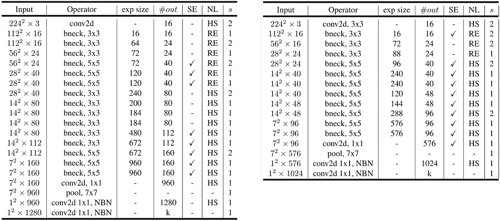
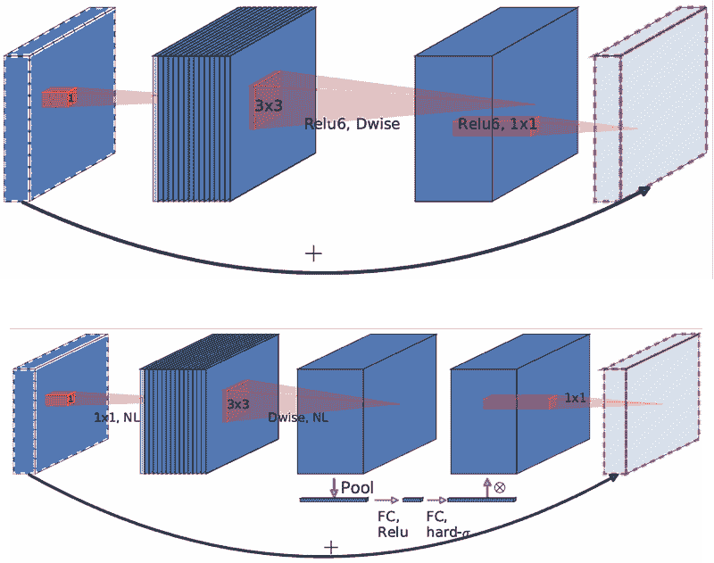
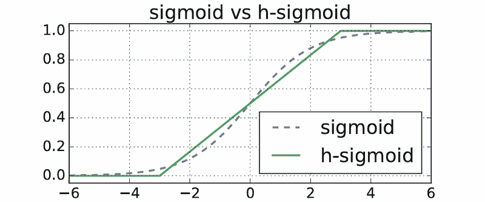
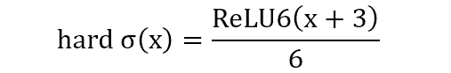
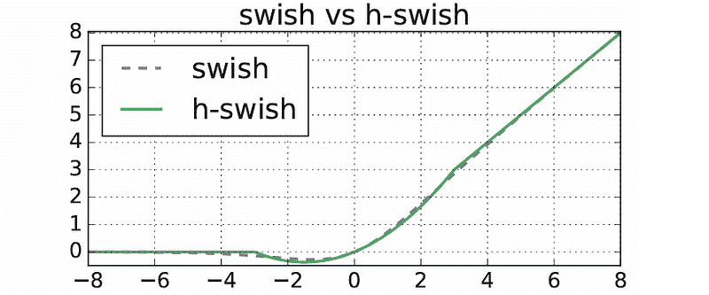
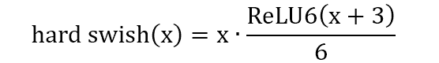
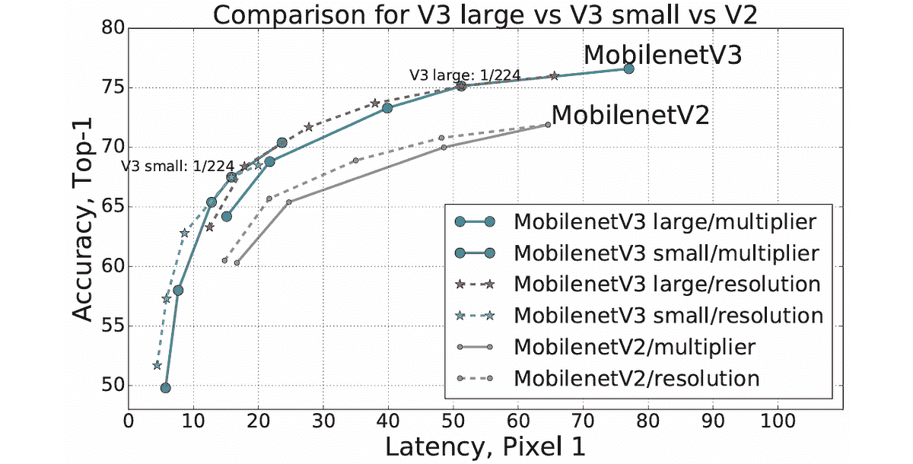
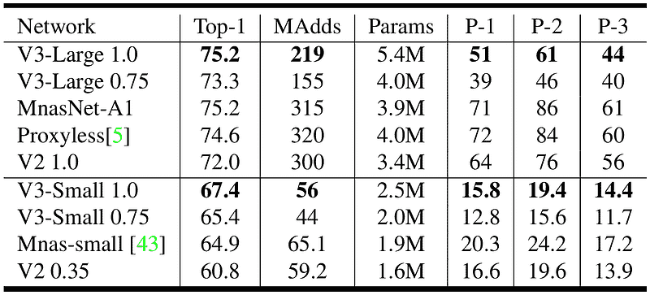
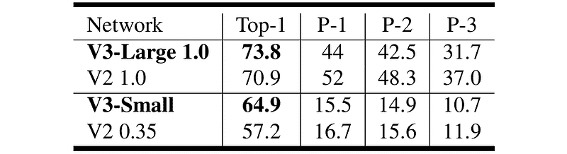
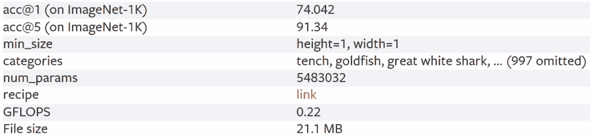

# MobileNetV3 论文解读：小型巨兽变得更聪明

> [`towardsdatascience.com/mobilenetv3-paper-walkthrough-the-tiny-giant-getting-even-smarter/`](https://towardsdatascience.com/mobilenetv3-paper-walkthrough-the-tiny-giant-getting-even-smarter/)

## <mdspan datatext="el1761970148813" class="mdspan-comment">引言</mdspan>

欢迎回到小型巨兽系列——在这个系列中，我分享了我对 MobileNet 架构的了解。在前两篇文章中，我介绍了 MobileNetV1 和 MobileNetV2。如果您感兴趣，可以查看参考文献 [1] 和 [2]。在今天的文章中，我将继续介绍模型的下一个版本：MobileNetV3。

MobileNetV3 首次在 2019 年由 Howard 等人撰写的题为“*Searching for MobileNetV3*”的论文中提出 [3]。简要回顾一下：第一个 MobileNet 版本的主要思想是用深度可分离卷积替换全卷积，与标准 CNN 相比，参数数量减少了近 90%。在第二个 MobileNet 版本中，作者引入了所谓的 *倒残差* 和 *线性瓶颈* 机制，并将它们整合到原始的 MobileNetV1 块中。现在在第三个 MobileNet 版本中，作者通过将 *Squeeze-and-Excitation* (SE) 模块和 *硬激活函数* 集成到块中，试图进一步提高网络性能。此外，MobileNetV3 的整体结构部分是通过 NAS (*神经架构搜索*) 设计的，它本质上是一种在架构层面上通过最大化准确率同时最小化延迟进行参数调整的操作。然而，请注意，在这篇文章中，我不会详细介绍 NAS 的工作原理。相反，我将专注于论文中提出的 MobileNetV3 的最终设计。

* * *

## MobileNetV3 的详细架构

作者提出了该模型的两种变体，它们分别被称为 MobileNetV3-Large 和 MobileNetV3-Small。您可以在下面的图 1 中看到这两个架构的详细信息。



图 1. MobileNetV3-Large (左) 和 MobileNetV3-Small (右) 架构 [3]。

仔细观察架构，我们可以看到这两个网络主要由 *bneck* (*瓶颈*) 块组成。这些块本身的配置在 *exp size*、*#out*、*SE*、*NL* 和 *s* 列中描述。这些块的内结构和相应的参数配置将在下一个小节中进一步讨论。

* * *

### 瓶颈

MobileNetV3 使用了 MobileNetV2 中使用的修改版块。正如我之前提到的，两者之间的区别在于 SE 模块的存在以及硬激活函数的使用。您可以在图 2 中看到这两个块，MobileNetV2 在顶部，MobileNetV3 在底部。



图 2. MobileNetV2（顶部）和 MobileNetV3（底部）构建块[3]。

注意到两个构建块中的前两个卷积层基本上是相同的：一个点卷积后面跟着一个深度卷积。前者用于将通道数扩展到*exp size*（扩展大小），而后者负责独立处理结果张量的每个通道。这两个构建块之间的唯一区别在于它们使用的激活函数，它们称之为*NL*（非线性）。在 MobileNetV2 中，放置在两个卷积层之后的激活函数被固定为 ReLU6，而在 MobileNetV3 中可以是 ReLU6 或*hard-swish*。你之前在图 1 中看到的*RE*和*HS*基本上指的是这两种类型的激活。

接下来，在 MobileNetV3 中，我们在深度卷积层之后放置 SE 模块。如果你还不熟悉 SE 模块，它本质上是一种我们可以附加到任何基于 CNN 的模型中的构建块。这个组件对于为不同通道赋予权重非常有用，允许模型只关注重要的通道。我实际上有一篇单独的文章详细讨论 SE 模块。如果你想阅读那篇文章，请点击参考文献[4]中的链接。需要注意的是，这里使用的 SE 模块略有不同，因为最后一个全连接层使用的是*hard-sigmoid*而不是标准的 sigmoid 激活函数。（我将在后续小节中更详细地讨论 MobileNetV3 中使用的硬激活。）实际上，SE 模块并不总是包含在每个瓶颈块中。如果你回到图 1，你会注意到一些瓶颈块在*SE*列上有勾选，表示应用了 SE 模块。另一方面，一些块没有包含该模块，这可能是因为 NAS 过程没有在这些块中使用 SE 模块找到任何性能提升。

由于 SE 模块已经连接，我们需要放置另一个点卷积，该卷积负责根据图 1 中的*#out*列调整输出通道数。这个点卷积不包含任何激活函数，与 MobileNetV2 最初引入的*线性瓶颈*设计相一致。实际上，我需要在这里澄清一点。如果你查看图 2 中上面的 MobileNetV2 构建块，你会注意到最后一个点卷积上放置了一个 ReLU6。我相信这是作者犯的一个错误，因为根据 MobileNetV2 论文[6]，ReLU6 应该在块开始处的第一个点卷积中。

最后但同样重要的是，请注意，瓶颈块中还有一个跳过所有层的残差连接。这个连接仅在输出张量与输入具有完全相同的维度时存在，即当输入和输出通道的数量相同，并且*s*（步长）为 1 时。

### Hard-Sigmoid 和 Hard-Swish

在 MobileNetV3 中使用的激活函数在其他深度学习模型中并不常见。首先，让我们先看看*hard-sigmoid*激活函数，它是 SE 模块中用来替代传统 sigmoid 的激活函数。请看下面的图 3，以了解两者的区别。



图 3. Sigmoid 和 hard-sigmoid 激活函数[3]。

你可能还在想，我们为什么不直接使用传统的 sigmoid 呢？为什么我们真的需要使用看起来不那么平滑的分段线性函数呢？为了回答这个问题，我们需要先了解 sigmoid 函数的数学定义，我在下面的图 4 中提供了它。


图 4. 标准 sigmoid 函数的公式[5]。

我们在上面的图中可以清楚地看到，sigmoid 函数原本在分母中涉及一个指数项。事实上，这个项使得函数在计算上变得昂贵，这反过来又使得激活函数对低功耗设备来说不太合适。不仅如此，sigmoid 函数的输出本身就是一个高精度的浮点值，由于低功耗设备处理此类值的有限支持，这也并不理想。

如果你再次看图 3，你可能会认为 hard-sigmoid 函数是直接从原始 sigmoid 导出的。实际上，这并不完全正确。尽管形状相似，但 hard-sigmoid 基本上是使用 ReLU6 构建的，这可以从下面的图 5 中正式表达出来。在这里，你可以看到方程式非常简单，因为它只包含基本的算术运算和裁剪，这使得它能够被更快地处理。



图 5. hard sigmoid 函数的公式[5]。

我们将在 MobileNetV3 中使用的下一个激活函数被称为*hard-swish*，它将在瓶颈块中的前两个卷积层之后实现。就像 sigmoid 和 hard-sigmoid 一样，hard-swish 函数的图像看起来与原始的相似。



图 6. Swish 和 hard-swish 激活函数[3]。

原始的 swish 函数本身可以在图 7 中的方程式中从数学上表示。再次强调，由于方程式涉及 sigmoid 函数，它肯定会减慢计算速度。因此，为了加快过程，我们可以简单地用我们刚刚讨论的 hard-sigmoid 函数替换 sigmoid 函数。通过这样做，我们现在有了如图 8 所示的 hard swish 激活函数的硬版本。


图 7. Swish 激活函数的方程式[5]。



图 8. hard swish 激活函数的方程式[5]。

***

## 一些实验结果

在我们深入实验结果之前，你需要知道 MobileNetV3 中有两个参数允许我们根据我们的需求调整模型大小。这两个参数是*宽度乘数*和*输入分辨率*，在 MobileNetV1 中分别被称为*α*和*ρ*。虽然我们可以技术上自由调整这两个参数的值，但作者已经提供了我们可以使用的几个数字。对于*宽度乘数*，我们可以将其设置为 0.35、0.5、0.75、1.0 或 1.25，其中使用小于 1.0 的值会导致模型比图 1 中披露的具有更少的通道数，从而有效地减小模型大小。例如，如果我们将此参数设置为 0.35，那么整个网络中模型的宽度（即通道数）将只有默认宽度的 35%。

同时，输入分辨率可以是 96、128、160、192、224 或 256，正如其名所示，它直接控制输入图像的空间维度。值得注意的是，尽管使用较小的输入大小会减少推理过程中的操作数，但它根本不影响模型大小。因此，如果你的目标是减小模型大小，你需要调整*宽度乘数*，而如果你的目标是降低计算成本，你可以同时调整*宽度乘数*和*输入分辨率*。

现在看看图 9 中的实验结果，我们可以清楚地看到，在相似的延迟下，MobileNetV3 在准确性方面优于 MobileNetV2。默认配置的 MobileNetV3-Small（即*宽度乘数* 1.0 和*输入分辨率* 224×224）的确比最大的 MobileNetV2 变体具有更低的准确性。但如果你考虑默认的 MobileNetV3-Large，它在准确性和延迟方面都轻松胜过了最大的 MobileNetV2。此外，我们还可以通过将模型大小扩大 1.25 倍（右上角的蓝色数据点）进一步提高 MobileNetV3 的准确性，但请注意，这样做会显著牺牲计算速度。



图 9. MobileNetV3-Large、MobileNetV3-Small 和 MobileNetV2 之间的性能比较[3]。

作者们还与其他轻量级模型进行了比较分析，其结果如图 10 中的表格所示。



图 10. 与其他轻量级模型相比 MobileNetV3 的性能[3]。

上面的表格行分为两组，其中上组用于比较与 MobileNetV3-Large 复杂度相似的模型，而下组由与 MobileNetV3-Small 相当的模型组成。在这里你可以看到，V3-Large 和 V3-Small 在其各自组内都获得了最佳的准确率。值得注意的是，尽管 MnasNet-A1 和 V3-Large 具有相同的准确率，但前者的操作数（*MAdds*）更多，这导致了更高的延迟，如*P-1*、*P-2*和*P-3*列（以毫秒为单位）所示。如果你在好奇，标签*P-1*、*P-2*和*P-3*实际上对应于用于测试实际计算速度的不同 Google Pixel 系列。接下来，有必要承认，与组内其他模型相比，MobileNetV3 的两个变体都有最高的参数数量（*params*列）。然而，这似乎并不是作者们的主要关注点，因为 MobileNetV3 的主要目标是最大限度地减少计算延迟，即使这意味着模型会稍微大一些。

作者们进行的下一个实验是关于值量化（value quantization）的影响，即一种降低浮点数精度以加快计算的技术。虽然网络已经包含了与量化值兼容的硬激活函数，但这个实验通过将量化应用于整个网络来进一步推进量化，以查看速度能提高多少。应用值量化时的实验结果如图 11 所示。



图 11. 使用量化值时 MobileNetV2 和 MobileNetV3 的准确性和延迟[3]。

如果你将图 11 中 V2 和 V3 的结果与图 10 中的相应模型进行比较，你会注意到延迟有所降低，这证明了使用低精度数字确实可以提高计算速度。然而，重要的是要记住，这也导致了准确性的降低。

* * *

## MobileNetV3 实现

我认为上面所有的解释都涵盖了关于 MobileNetV3 背后理论的几乎所有你需要知道的内容。现在，在这一节中，我将带你进入这篇文章最有趣的部分：从头开始实现 MobileNetV3。

和往常一样，我们做的第一件事是导入所需的模块。

```py
# Codeblock 1
import torch
import torch.nn as nn
```

之后，我们需要初始化模型的配置参数，即`WIDTH_MULTIPLIER`、`INPUT_RESOLUTION`和`NUM_CLASSES`，如下面的代码块 2 所示。我相信前两个变量是直截了当的，因为我已经在上一节中详细解释了它们。在这里，我决定为这两个变量分配默认值。如果你想要调整模型的复杂度，你可以根据论文中提供的值更改这些数字。接下来，第三个变量对应于分类头中的输出神经元数量。我将其设置为 1000，因为模型最初是在 ImageNet-1K 数据集上训练的。值得注意的是，MobileNetV3 架构实际上并不仅限于分类任务。相反，它也可以用于目标检测和语义分割，正如论文中所示。然而，由于本文的重点是实现骨干网络，让我们只使用标准的分类头作为输出层以保持简单。

```py
# Codeblock 2
WIDTH_MULTIPLIER = 1.0
INPUT_RESOLUTION = 224
NUM_CLASSES      = 1000
```

我们接下来要做的是将重复的组件封装到单独的类中。通过这样做，我们稍后只需在需要时简单地实例化它们，而不是一次又一次地重写相同的代码。现在让我们首先从 Squeeze-and-Excitation 模块开始。

* * *

### Squeeze-and-Excitation 模块

此组件的实现如下所示，代码块 3。我不会深入探讨代码，因为它几乎与我之前文章[4]中的代码完全相同。然而，一般来说，这段代码通过用一个数字表示每个输入通道（行`#(1)`），用一系列线性层处理得到的向量（`#(2–3)`），然后将其转换为权重向量（`#(4)`）来工作。请记住，在原始 SE 模块中，我们通常使用标准的 sigmoid 激活函数来获得权重向量，但在这里在 MobileNetV3 中我们使用 hard-sigmoid。这个权重向量然后将与原始张量相乘，通过这样做我们可以减少对最终输出没有贡献的通道的影响（`#(5)`）。

```py
# Codeblock 3
class SEModule(nn.Module):
    def __init__(self, num_channels, r):
        super().__init__()

        self.global_pooling = nn.AdaptiveAvgPool2d(output_size=(1,1))
        self.fc0 = nn.Linear(in_features=num_channels,
                             out_features=num_channels//r, 
                             bias=False)
        self.relu6 = nn.ReLU6()
        self.fc1 = nn.Linear(in_features=num_channels//r,
                             out_features=num_channels, 
                             bias=False)
        self.hardsigmoid = nn.Hardsigmoid()

    def forward(self, x):
        print(f'original\t\t: {x.size()}')

        squeezed = self.global_pooling(x)              #(1)
        print(f'after avgpool\t\t: {squeezed.size()}')

        squeezed = torch.flatten(squeezed, 1)
        print(f'after flatten\t\t: {squeezed.size()}')

        excited = self.fc0(squeezed)                   #(2)
        print(f'after fc0\t\t: {excited.size()}')

        excited = self.relu6(excited)
        print(f'after relu6\t\t: {excited.size()}')

        excited = self.fc1(excited)                    #(3)
        print(f'after fc1\t\t: {excited.size()}')

        excited = self.hardsigmoid(excited)            #(4)
        print(f'after hardsigmoid\t: {excited.size()}')

        excited = excited[:, :, None, None]
        print(f'after reshape\t\t: {excited.size()}')

        scaled = x * excited                           #(5)
        print(f'after scaling\t\t: {scaled.size()}')

        return scaled
```

现在我们通过创建一个`SEModule`实例并将一个虚拟张量传递给它来检查上述代码是否正常工作。下面是代码块 4 的详细信息。在这里，我配置 SE 模块以接受 512 通道的图像作为输入。同时，`r`（*缩减比例*）参数设置为 4，这意味着两个全连接层之间的向量长度将是输入和输出的四分之一。可能值得知道，这个数字与原始的 Squeeze-and-Excitation 论文[7]中提到的不同，其中*r = 16*被认为是平衡准确性和复杂性的最佳点。

```py
# Codeblock 4
semodule = SEModule(num_channels=512, r=4)
x = torch.randn(1, 512, 28, 28)

out = semodule(x)
```

如果上面的代码产生以下输出，则确认我们的 SE 模块实现是正确的，因为它成功地将输入张量通过整个 SE 模块的所有层。

```py
# Codeblock 4 Output
original          : torch.Size([1, 512, 28, 28])
after avgpool     : torch.Size([1, 512, 1, 1])
after flatten     : torch.Size([1, 512])
after fc0         : torch.Size([1, 128])
after relu6       : torch.Size([1, 128])
after fc1         : torch.Size([1, 512])
after hardsigmoid : torch.Size([1, 512])
after reshape     : torch.Size([1, 512, 1, 1])
after scaling     : torch.Size([1, 512, 28, 28])
```

* * *

### 卷积块

接下来我将要创建的是`ConvBlock`类封装的组件，其详细实现可以在代码块 5 中看到。实际上，这实际上只是一个标准的卷积层，但我们不直接使用`nn.Conv2d`，因为在 CNN 中我们通常使用*Conv-BN-ReLU*结构。因此，如果我们将这些三个层组合在一个类中将会很方便。然而，我们不会实际遵循这个标准结构，而是会根据 MobileNetV3 架构的要求进行定制。

```py
# Codeblock 5
class ConvBlock(nn.Module):
    def __init__(self, 
                 in_channels,             #(1)
                 out_channels,            #(2)
                 kernel_size,             #(3)
                 stride,                  #(4)
                 padding,                 #(5)
                 groups=1,                #(6)
                 batchnorm=True,          #(7)
                 activation=nn.ReLU6()):  #(8)
        super().__init__()

        bias = False if batchnorm else True    #(9)

        self.conv = nn.Conv2d(in_channels=in_channels, 
                              out_channels=out_channels,
                              kernel_size=kernel_size, 
                              stride=stride, 
                              padding=padding, 
                              groups=groups,
                              bias=bias)
        self.bn = nn.BatchNorm2d(num_features=out_channels) if batchnorm else nn.Identity()  #(10)
        self.activation = activation

    def forward(self, x):    #(11)
        print(f'original\t\t: {x.size()}')

        x = self.conv(x)
        print(f'after conv\t\t: {x.size()}')

        x = self.bn(x)
        print(f'after bn\t\t: {x.size()}')

        x = self.activation(x)
        print(f'after activation\t: {x.size()}')

        return x
```

实例化`ConvBlock`实例需要传递几个参数。前五个参数（`#(1–5)`）相当直接，因为它们基本上是`nn.Conv2d`层的标准参数。在这里，我将`groups`参数设置为可配置的（`#(6)`），这样这个类不仅可以用于标准卷积，还可以用于深度卷积。接下来，在第`#(7)`行，我创建了一个名为`batchnorm`的参数，它决定了`ConvBlock`实例是否实现批归一化层。这基本上是因为在某些情况下我们不实现这个层，即图 1 中的最后两个带有*NBN*标签（代表*no batch normalization*）的卷积。我们这里有的最后一个参数是激活函数（`#(8)`）。稍后，会有一些情况需要我们将它设置为`nn.ReLU6()`、`nn.Hardswish()`或`nn.Identity()`（无激活）。

在`__init__()`方法中，如果改变`batchnorm`参数的输入参数，会有两件事情发生。当我们将其设置为`True`时，首先，卷积层的偏置项将被禁用（`#(9)`），其次，`bn`将是一个`nn.BatchNorm2d()`层（`#(10)`）。在这种情况下不会使用偏置项，因为卷积后应用批归一化会将其抵消。所以，最初利用偏置基本上没有意义。同时，如果我们将`batchnorm`参数设置为`False`，`bias`变量将是`True`，因为在这种情况下它不会被抵消。`bn`本身将只是一个身份层，这意味着它不会对张量做任何操作。

关于`forward()`方法（`#(11)`），我认为没有必要解释什么，因为我们在这里所做的只是按顺序通过层传递一个张量。现在让我们继续到代码块 6，看看我们的`ConvBlock`实现是否正确。在这里，我尝试创建两个`ConvBlock`实例，其中第一个使用默认的`batchnorm`和`activation`，而第二个省略了批归一化层（`#(1)`）并使用 hard-swish 激活函数（`#(2)`）。在这里，我不想让你通过它们传递张量，而是想让你在生成的输出中看到我们的代码是否正确实现了这两种结构，根据我们传递的输入参数。

```py
# Codeblock 6
convblock1 = ConvBlock(in_channels=64, 
                       out_channels=128, 
                       kernel_size=3, 
                       stride=2, 
                       padding=1)

convblock2 = ConvBlock(in_channels=64, 
                       out_channels=128, 
                       kernel_size=3, 
                       stride=2, 
                       padding=1, 
                       batchnorm=False,             #(1)
                       activation=nn.Hardswish())   #(2)

print(convblock1)
print('')
print(convblock2)
```

```py
# Codeblock 6 Output
ConvBlock(
  (conv): Conv2d(64, 128, kernel_size=(3, 3), stride=(2, 2), padding=(1, 1), bias=False)
  (bn): BatchNorm2d(128, eps=1e-05, momentum=0.1, affine=True, track_running_stats=True)
  (activation): ReLU6()
)

ConvBlock(
  (conv): Conv2d(64, 128, kernel_size=(3, 3), stride=(2, 2), padding=(1, 1))
  (bn): Identity()
  (activation): Hardswish()
)
```

* * *

### 瓶颈

随着`SEModule`和`ConvBlock`的完成，我们现在可以继续到 MobileNetV3 架构的主要组件：瓶颈。在瓶颈中，我们本质上只是将一层层放置在一起，其一般结构在图 2 中之前已经展示过。在 MobileNetV2 的情况下，它只包含三个卷积层，而在这里的 MobileNetV3 中，我们在第二和第三卷积之间放置了一个额外的 SE 块。查看代码块 7a 和 7b，看看我是如何实现 MobileNetV3 的瓶颈块的。

```py
# Codeblock 7a
class Bottleneck(nn.Module):
    def __init__(self, 
                 in_channels, 
                 out_channels, 
                 kernel_size, 
                 stride,
                 padding,
                 exp_size,     #(1)
                 se,           #(2)
                 activation):
        super().__init__()

        self.add = in_channels == out_channels and stride == 1    #(3)

        self.conv0 = ConvBlock(in_channels=in_channels,    #(4)
                               out_channels=exp_size,    #(5)
                               kernel_size=1,    #(6)
                               stride=1, 
                               padding=0,
                               activation=activation)

        self.conv1 = ConvBlock(in_channels=exp_size,    #(7)
                               out_channels=exp_size,    #(8)
                               kernel_size=kernel_size,    #(9)
                               stride=stride, 
                               padding=padding,
                               groups=exp_size,    #(10)
                               activation=activation)

        self.semodule = SEModule(num_channels=exp_size, r=4) if se else nn.Identity()    #(11)

        self.conv2 = ConvBlock(in_channels=exp_size,    #(12)
                               out_channels=out_channels,    #(13)
                               kernel_size=1,    #(14)
                               stride=1, 
                               padding=0, 
                               activation=nn.Identity())    #(15)
```

从表面上看，`Bottleneck`类的输入参数与`ConvBlock`类的参数相似。这确实是有道理的，因为我们将确实使用它们在`Bottleneck`内部实例化`ConvBlock`实例。然而，如果你再次仔细观察，你会注意到还有一些你之前没有见过的参数，即`se`（`#(1)`）和`exp_size`（`#(2)`）。稍后，这些参数的输入参数将从图 1 中的表格中提供的配置中获取。

在`__init__()`方法内部，我们首先需要检查输入和输出张量维度是否相同，使用代码在第`#(3)`行。通过这样做，我们将有一个包含`True`或`False`的`add`变量。这种维度检查很重要，因为我们需要决定是否在两个之间执行逐元素求和以实现跳过瓶颈块内所有层的跳过连接。

接下来，现在让我们实例化这些层本身，其中前两层是一个点卷积（`conv0`）和一个深度卷积（`conv1`）。对于`conv0`，我们需要将内核大小设置为 1×1（`#(6)`），而对于`conv1`，内核大小应该与输入参数中的内核大小相匹配（`#(9)`），这可以是 3×3 或 5×5。在`ConvBlock`中应用填充是必要的，以防止在每次卷积操作后图像大小缩小。对于 1×1、3×3 和 5×5 的内核大小，所需的填充值分别是 0、1 和 2。谈到通道数，`conv0`负责将其从`in_channels`扩展到`exp_size`（`#(4–5)`）。同时，`conv1`层的输入和输出通道数完全相同（`#(7–8)`）。除了`conv1`层之外，`groups`参数应该设置为`exp_size`（`#(10)`），因为我们希望每个输入通道独立于其他每个输入通道进行处理。

在完成前两个卷积层之后，接下来我们需要实例化的是 Squeeze-and-Excitation 模块（`#(11)`）。在这里，我们需要将输入通道数设置为`exp_size`，与`conv1`层产生的张量大小相匹配。请记住，SE 模块并不总是被使用，因此这个组件的实例化应该在条件语句中进行，实际上它只会在`se`参数为`True`时被实例化。否则，它将只是一个恒等层。

最后，最后一个卷积层(`conv2`)负责将输出通道数从`exp_size`映射到`out_channels`(`#(12–13)`)。就像`conv0`层一样，这一层也是一个点卷积，因此我们将核大小设置为 1×1(`#(14)`)，这样它就只关注沿着通道维度聚合信息。这一层的激活函数被固定设置为`nn.Identity()`(`#(15)`)，因为我们在这里将实现线性瓶颈的想法。

对于瓶颈块内的层来说，这就差不多是全部内容了。接下来，我们只需要在`forward()`方法中创建网络的流程，就像下面的代码块 7b 所示。

```py
 # Codeblock 7b
    def forward(self, x):
            residual = x
            print(f'original\t\t: {x.size()}')

            x = self.conv0(x)
            print(f'after conv0\t\t: {x.size()}')

            x = self.conv1(x)
            print(f'after conv1\t\t: {x.size()}')

            x = self.semodule(x)
            print(f'after semodule\t\t: {x.size()}')

            x = self.conv2(x)
            print(f'after conv2\t\t: {x.size()}')

            if self.add:
                x += residual
                print(f'after summation\t\t: {x.size()}')

            return x
```

现在，我想通过模拟图 1 中表格的第三行来测试我们刚刚创建的`Bottleneck`类。查看下面的代码块 8，看看我是如何做到这一点的。如果您回到架构细节，您会注意到这个瓶颈接受一个大小为 16×112×112 的张量(`#(7)`)。在这种情况下，瓶颈块被配置为将通道数扩展到 64(`#(3)`)，然后最终将其缩小到 24(`#(1)`)。深度卷积的核大小设置为 3×3(`#(2)`)，步长设置为 2(`#(4)`)，这将空间维度减半。在这里，我们使用 ReLU6 作为前两个卷积的激活函数(`#(6)`)。最后，由于表中*SE*列没有勾选，SE 模块将不会实现(`#(5)`)。

```py
# Codeblock 8
bottleneck = Bottleneck(in_channels=16,
                        out_channels=24,   #(1)
                        kernel_size=3,     #(2)
                        exp_size=64,       #(3)
                        stride=2,          #(4)
                        padding=1, 
                        se=False,          #(5)
                        activation=nn.ReLU6())  #(6)

x = torch.randn(1, 16, 112, 112)           #(7)
out = bottleneck(x)
```

如果您运行上述代码，屏幕上应该出现以下输出。

```py
# Codeblock 8 Output
original        : torch.Size([1, 16, 112, 112])
after conv0     : torch.Size([1, 64, 112, 112])
after conv1     : torch.Size([1, 64, 56, 56])
after semodule  : torch.Size([1, 64, 56, 56])
after conv2     : torch.Size([1, 24, 56, 56])
```

此输出确认，从空间维度来看，我们的实现是正确的，从 112×112 减半到 56×56，而通道数正确地从 16 增加到 64，然后从 64 减少到 24。更具体地谈谈 SE 模块，我们可以在上述输出中看到，尽管我们将`se`参数设置为`False`，张量仍然通过了这个组件。实际上，如果您尝试打印出这个瓶颈的详细架构，就像我在代码块 9 中做的那样，您会看到`semodule`只是一个恒等层，这有效地使这个结构表现得好像我们直接将`conv1`的输出传递给`conv2`。

```py
# Codeblock 9
bottleneck
```

```py
# Codeblock 9 Output
Bottleneck(
  (conv0): ConvBlock(
    (conv): Conv2d(16, 64, kernel_size=(1, 1), stride=(1, 1), bias=False)
    (bn): BatchNorm2d(64, eps=1e-05, momentum=0.1, affine=True, track_running_stats=True)
    (activation): ReLU6()
  )
  (conv1): ConvBlock(
    (conv): Conv2d(64, 64, kernel_size=(3, 3), stride=(2, 2), padding=(1, 1), groups=64, bias=False)
    (bn): BatchNorm2d(64, eps=1e-05, momentum=0.1, affine=True, track_running_stats=True)
    (activation): ReLU6()
  )
  (semodule): Identity()
  (conv2): ConvBlock(
    (conv): Conv2d(64, 24, kernel_size=(1, 1), stride=(1, 1), bias=False)
    (bn): BatchNorm2d(24, eps=1e-05, momentum=0.1, affine=True, track_running_stats=True)
    (activation): Identity()
  )
)
```

如果我们将`se`参数设置为`True`来实例化上述瓶颈，它的行为将会不同。在下面的代码块 10 中，我尝试创建 MobileNetV3-Large 架构中的第五行的瓶颈块。在这种情况下，如果您打印出详细的结构，您会看到`semodule`由我们之前创建的`SEModule`类中的所有层组成，而不是像之前那样只是一个恒等层。

```py
# Codeblock 10
bottleneck = Bottleneck(in_channels=24, 
                        out_channels=40, 
                        kernel_size=5, 
                        exp_size=72,
                        stride=2, 
                        padding=2, 
                        se=True, 
                        activation=nn.ReLU6())

bottleneck
```

```py
# Codeblock 10 Output
Bottleneck(
  (conv0): ConvBlock(
    (conv): Conv2d(24, 72, kernel_size=(1, 1), stride=(1, 1), bias=False)
    (bn): BatchNorm2d(72, eps=1e-05, momentum=0.1, affine=True, track_running_stats=True)
    (activation): ReLU6()
  )
  (conv1): ConvBlock(
    (conv): Conv2d(72, 72, kernel_size=(5, 5), stride=(2, 2), padding=(2, 2), groups=72, bias=False)
    (bn): BatchNorm2d(72, eps=1e-05, momentum=0.1, affine=True, track_running_stats=True)
    (activation): ReLU6()
  )
  (semodule): SEModule(
    (global_pooling): AdaptiveAvgPool2d(output_size=(1, 1))
    (fc0): Linear(in_features=72, out_features=18, bias=False)
    (relu6): ReLU6()
    (fc1): Linear(in_features=18, out_features=72, bias=False)
    (hardsigmoid): Hardsigmoid()
  )
  (conv2): ConvBlock(
    (conv): Conv2d(72, 40, kernel_size=(1, 1), stride=(1, 1), bias=False)
    (bn): BatchNorm2d(40, eps=1e-05, momentum=0.1, affine=True, track_running_stats=True)
    (activation): Identity()
  )
)
```

* * *

## 完整的 MobileNetV3

由于所有组件都已创建，接下来我们需要构建 MobileNetV3 模型的主类。但在这样做之前，我想初始化一个列表，该列表存储用于实例化瓶颈块的输入参数，如下面的 Codeblock 11 所示。请注意，这些参数是根据 MobileNetV3-Large 版本编写的。如果您想创建小版本，则需要调整 `BOTTLENECKS` 列表中的值。

```py
# Codeblock 11
HS = nn.Hardswish()
RE = nn.ReLU6()

BOTTLENECKS = [[16,  16,  3, 16,  False, RE, 1, 1], 
               [16,  24,  3, 64,  False, RE, 2, 1], 
               [24,  24,  3, 72,  False, RE, 1, 1], 
               [24,  40,  5, 72,  True,  RE, 2, 2], 
               [40,  40,  5, 120, True,  RE, 1, 2], 
               [40,  40,  5, 120, True,  RE, 1, 2], 
               [40,  80,  3, 240, False, HS, 2, 1], 
               [80,  80,  3, 200, False, HS, 1, 1], 
               [80,  80,  3, 184, False, HS, 1, 1], 
               [80,  80,  3, 184, False, HS, 1, 1], 
               [80,  112, 3, 480, True,  HS, 1, 1], 
               [112, 112, 3, 672, True,  HS, 1, 1], 
               [112, 160, 5, 672, True,  HS, 2, 2], 
               [160, 160, 5, 960, True,  HS, 1, 2], 
               [160, 160, 5, 960, True,  HS, 1, 2]]
```

列出的参数按以下顺序（从左到右）结构化：*输入通道*，*输出通道*，*内核大小*，*扩展大小*，*SE*，*激活*，*步长*，和 *填充*。请注意，*填充* 在原始表中没有明确说明，但我将其包括在这里，因为它在实例化瓶颈块时需要作为输入。

现在让我们实际创建 MobileNetV3 类。下面在 Codeblocks 12a 和 12b 中查看代码实现。

```py
# Codeblock 12a
class MobileNetV3(nn.Module):
    def __init__(self):
        super().__init__()

        self.first_conv = ConvBlock(in_channels=3,    #(1)
                                    out_channels=int(WIDTH_MULTIPLIER*16),
                                    kernel_size=3,
                                    stride=2,
                                    padding=1, 
                                    activation=nn.Hardswish())

        self.blocks = nn.ModuleList([])    #(2)
        for config in BOTTLENECKS:         #(3)
            in_channels, out_channels, kernel_size, exp_size, se, activation, stride, padding = config
            self.blocks.append(Bottleneck(in_channels=int(WIDTH_MULTIPLIER*in_channels), 
                                          out_channels=int(WIDTH_MULTIPLIER*out_channels), 
                                          kernel_size=kernel_size, 
                                          exp_size=int(WIDTH_MULTIPLIER*exp_size), 
                                          stride=stride, 
                                          padding=padding, 
                                          se=se, 
                                          activation=activation))

        self.second_conv = ConvBlock(in_channels=int(WIDTH_MULTIPLIER*160), #(4)
                                     out_channels=int(WIDTH_MULTIPLIER*960),
                                     kernel_size=1,
                                     stride=1,
                                     padding=0, 
                                     activation=nn.Hardswish())

        self.avgpool = nn.AdaptiveAvgPool2d(output_size=(1,1))              #(5)

        self.third_conv = ConvBlock(in_channels=int(WIDTH_MULTIPLIER*960),  #(6)
                                    out_channels=int(WIDTH_MULTIPLIER*1280),
                                    kernel_size=1,
                                    stride=1,
                                    padding=0, 
                                    batchnorm=False,
                                    activation=nn.Hardswish())

        self.dropout = nn.Dropout(p=0.8)    #(7)

        self.output = ConvBlock(in_channels=int(WIDTH_MULTIPLIER*1280),     #(8)
                                out_channels=int(NUM_CLASSES),              #(9)
                                kernel_size=1,
                                stride=1,
                                padding=0, 
                                batchnorm=False,
                                activation=nn.Identity())
```

注意在图 1 中，我们最初从标准的卷积层开始。在上面的代码块中，我将其称为 `first_conv` (`#(1)`)。值得注意的是，此层的输入参数不包括在 `BOTTLENECKS` 列表中，因此我们需要手动定义它们。记住，由于我们希望通过该变量调整模型大小，因此需要在每一步将通道数乘以 `WIDTH_MULTIPLIER`。接下来，我们初始化一个名为 `blocks` 的占位符，用于存储所有瓶颈块 (`#(2)`)。通过简单的循环（`#(3)`），我们将遍历 `BOTTLENECKS` 列表中的所有项，实际实例化瓶颈块，并将它们逐个追加到 `blocks` 中。实际上，这个循环构建了网络中的大多数层，因为它涵盖了表中列出的几乎所有组件。

瓶颈块的序列完成后，我们现在将继续进行下一个卷积层，我将其称为 `second_conv` (`#(4)`)。同样，由于此层的配置参数未存储在 `BOTTLENECKS` 列表中，我们需要手动硬编码它们。然后，此层的输出将通过一个全局平均池化层 (`#(5)`)，这将降低空间维度到 1×1。之后，我们将此层连接到两个连续的点卷积 (`#(6)` 和 `#(8)`)，中间有一个 dropout 层 (`#(7)`)。

更具体地谈谈这两个卷积，重要的是要知道，对一个具有 1×1 空间维度的张量应用 1×1 卷积本质上等同于对一个展平的张量应用 FC 层，其中通道数将对应于神经元的数量。这就是为什么我将最后一层的输出通道数设置为数据集中类别的数量 (`#(9)`)。根据架构建议，`third_conv` 和 `output` 层的 `batchnorm` 参数都设置为 `False`。

同时，`third_conv`的激活函数设置为`nn.Hardswish()`，而`output`层使用`nn.Identity()`，这相当于根本不应用任何激活函数。这基本上是因为在训练过程中 softmax 已经包含在损失函数中（`nn.CrossEntropyLoss()`）。在推理阶段稍后，我们需要在`output`层中将`nn.Identity()`替换为`nn.Softmax()`，以便模型直接返回每个类的概率分数。

接下来，让我们看看下面的`forward()`方法，我认为它很容易理解，所以我就不再进一步解释了。

```py
# Codeblock 12b
    def forward(self, x):
        print(f'original\t\t: {x.size()}')

        x = self.first_conv(x)
        print(f'after first_conv\t: {x.size()}')

        for i, block in enumerate(self.blocks):
            x = block(x)
            print(f"after bottleneck #{i}\t: {x.shape}")

        x = self.second_conv(x)
        print(f'after second_conv\t: {x.size()}')

        x = self.avgpool(x)
        print(f'after avgpool\t\t: {x.size()}')

        x = self.third_conv(x)
        print(f'after third_conv\t: {x.size()}')

        x = self.dropout(x)
        print(f'after dropout\t\t: {x.size()}')

        x = self.output(x)
        print(f'after output\t\t: {x.size()}')

        x = torch.flatten(x, start_dim=1)
        print(f'after flatten\t\t: {x.size()}')

        return x
```

代码块 13 中的代码演示了如何初始化一个 MobileNetV3 实例并通过它传递一个虚拟张量。记住，在这里我们使用默认的输入分辨率，所以我们可以将张量基本上视为一个 224×224 大小的单个 RGB 图像的批次。

```py
# Codeblock 13
mobilenetv3 = MobileNetV3()

x = torch.randn(1, 3, INPUT_RESOLUTION, INPUT_RESOLUTION)
out = mobilenetv3(x)
```

下面是生成的输出结果，其中每个块后的张量维度与图 1 中 MobileNetV3-Large 架构完全匹配。

```py
# Codeblock 13 Output
original             : torch.Size([1, 3, 224, 224])
after first_conv     : torch.Size([1, 16, 112, 112])
after bottleneck #0  : torch.Size([1, 16, 112, 112])
after bottleneck #1  : torch.Size([1, 24, 56, 56])
after bottleneck #2  : torch.Size([1, 24, 56, 56])
after bottleneck #3  : torch.Size([1, 40, 28, 28])
after bottleneck #4  : torch.Size([1, 40, 28, 28])
after bottleneck #5  : torch.Size([1, 40, 28, 28])
after bottleneck #6  : torch.Size([1, 80, 14, 14])
after bottleneck #7  : torch.Size([1, 80, 14, 14])
after bottleneck #8  : torch.Size([1, 80, 14, 14])
after bottleneck #9  : torch.Size([1, 80, 14, 14])
after bottleneck #10 : torch.Size([1, 112, 14, 14])
after bottleneck #11 : torch.Size([1, 112, 14, 14])
after bottleneck #12 : torch.Size([1, 160, 7, 7])
after bottleneck #13 : torch.Size([1, 160, 7, 7])
after bottleneck #14 : torch.Size([1, 160, 7, 7])
after second_conv    : torch.Size([1, 960, 7, 7])
after avgpool        : torch.Size([1, 960, 1, 1])
after third_conv     : torch.Size([1, 1280, 1, 1])
after dropout        : torch.Size([1, 1280, 1, 1])
after output         : torch.Size([1, 1000, 1, 1])
after flatten        : torch.Size([1, 1000])
```

为了确保我们的实现是正确的，我们可以使用以下代码打印出模型中包含的参数数量。

```py
# Codeblock 14
total_params = sum(p.numel() for p in mobilenetv3.parameters())
total_params
```

```py
# Codeblock 14 Output
5476416
```

在这里，你可以看到这个模型大约包含 550 万个参数，这与原始论文中披露的参数数量大致相同（见图 10）。此外，PyTorch 文档中给出的参数数量也与下面的图 12 中的这个数字相似。基于这些事实，我相信我可以确认我们的 MobileNetV3-Large 实现是正确的。



图 12.官方 PyTorch 文档中 MobileNetV3-Large 模型的详细信息[8]。

***

## 结束

好吧，关于 MobileNetV3 架构的内容基本上就这些了。在这里，我鼓励你实际上在你想使用的任何数据集上从头开始训练这个模型。不仅如此，我还想让你尝试调整瓶颈块的参数配置，看看我们是否还能进一步提高 MobileNetV3 的性能。顺便说一句，这篇文章中使用的代码也存放在我的 GitHub 仓库中，你可以通过参考文献编号[9]中的链接找到。

感谢阅读。如果你在我的解释或代码中发现了任何错误，请通过 LinkedIn [10]联系我。下次文章再见！

***

## 参考文献

[1] Muhammad Ardi. MobileNetV1 论文解读：小型巨人。AI 进展。[`medium.com/ai-advances/mobilenetv1-paper-walkthrough-the-tiny-giant-987196f40cd5`](https://medium.com/ai-advances/mobilenetv1-paper-walkthrough-the-tiny-giant-987196f40cd5) [访问日期：2025 年 10 月 24 日]。

[2] Muhammad Ardi. MobileNetV2 论文解读：更智能的小巨人。数据科学之路。 [`towardsdatascience.com/mobilenetv2-paper-walkthrough-the-smarter-tiny-giant/`](https://towardsdatascience.com/mobilenetv2-paper-walkthrough-the-smarter-tiny-giant/) [访问日期：2025 年 10 月 24 日].

[3] Andrew Howard 等人。寻找 MobileNetV3\. Arxiv. [`arxiv.org/abs/1905.02244`](https://arxiv.org/abs/1905.02244) [访问日期：2025 年 5 月 1 日].

[4] Muhammad Ardi. SENet 论文解读：通道注意力。AI 进展。 [`medium.com/ai-advances/senet-paper-walkthrough-the-channel-wise-attention-8ac72b9cc252`](https://medium.com/ai-advances/senet-paper-walkthrough-the-channel-wise-attention-8ac72b9cc252) [访问日期：2025 年 10 月 24 日].

[5] 由作者最初创建的图像。

[6] Mark Sandler 等人。MobileNetV2：倒残差和线性瓶颈。Arxiv. [`arxiv.org/abs/1801.04381`](https://arxiv.org/abs/1801.04381) [访问日期：2025 年 5 月 12 日].

[7] Jie Hu 等人。Squeeze and Excitation Networks. Arxiv. [`arxiv.org/abs/1709.01507`](https://arxiv.org/abs/1709.01507) [访问日期：2025 年 5 月 12 日].

[8] Mobilenet_v3_large. PyTorch. [`docs.pytorch.org/vision/main/models/generated/torchvision.models.mobilenet_v3_large.html#torchvision.models.mobilenet_v3_large`](https://docs.pytorch.org/vision/main/models/generated/torchvision.models.mobilenet_v3_large.html#torchvision.models.mobilenet_v3_large) [访问日期：2025 年 5 月 12 日].

[9] MuhammadArdiPutra. 小巨人变得更智能——MobileNetV3\. GitHub. [`github.com/MuhammadArdiPutra/medium_articles/blob/main/The%20Tiny%20Giant%20Getting%20Even%20Smarter%20-%20MobileNetV3.ipynb`](https://github.com/MuhammadArdiPutra/medium_articles/blob/main/The%20Tiny%20Giant%20Getting%20Even%20Smarter%20-%20MobileNetV3.ipynb) [访问日期：2025 年 5 月 12 日].

[10] Muhammad Ardi Putra. 领英. [`www.linkedin.com/in/muhammad-ardi-putra-879528152/`](https://www.linkedin.com/in/muhammad-ardi-putra-879528152/) [访问日期：2025 年 5 月 12 日].
