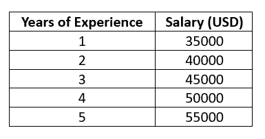
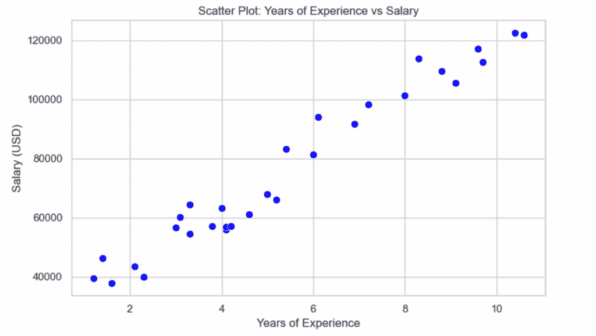
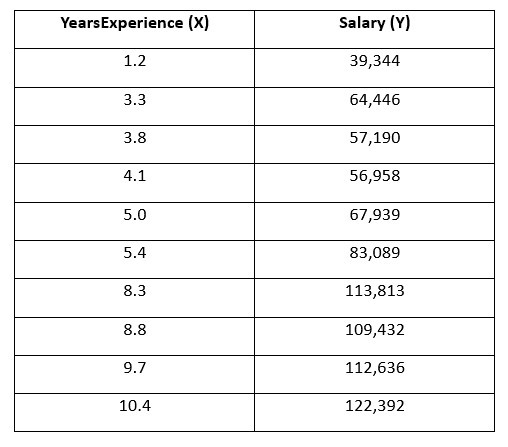
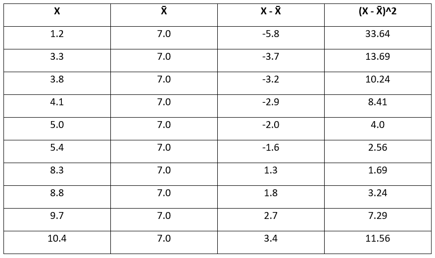
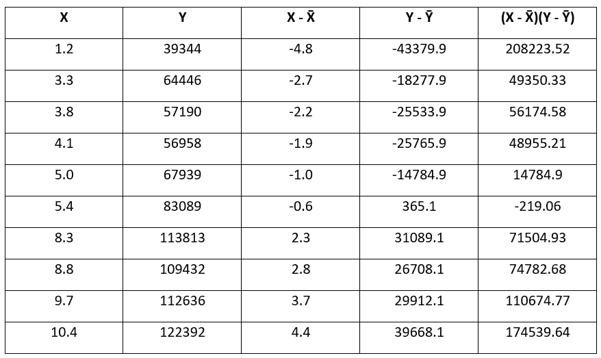

# 皮尔逊相关系数，简单解释

> [`towardsdatascience.com/pearson-correlation-coefficient-explained-simply/`](https://towardsdatascience.com/pearson-correlation-coefficient-explained-simply/)

<mdspan datatext="el1761937246531" class="mdspan-comment">当我们想要构建一个回归模型，这意味着在数据上拟合一条直线以预测未来值时，我们首先可视化我们的数据，以了解其外观，并看到模式和关系。

数据可能看起来显示出正线性关系，但我们通过计算皮尔逊相关系数来确认它，这告诉我们数据与线性关系的接近程度。

让我们考虑一个简单的[薪水数据集](https://www.kaggle.com/datasets/abhishek14398/salary-dataset-simple-linear-regression)来了解皮尔逊相关系数。

数据集包含两列：

**工作经验年数**：一个人工作了多少年

**薪水**（目标）：相应的年度薪水（美元）

现在我们需要构建一个基于工作经验预测薪水的模型。

我们可以理解这可以通过一个简单的线性回归模型来完成，因为我们只有一个预测变量和一个连续的目标变量。

但我们能否直接应用简单的线性回归算法呢？

不。

我们对线性回归应用有几个假设，其中之一是**线性关系**。

我们需要检查线性关系，为此，我们计算**相关系数**。

* * *

但什么是线性关系呢？

让我们用一个例子来理解这一点。



图片由作者提供

从上面的表中，我们可以看到，对于每增加一年的工作经验，薪水增加 5,000 美元。

变化是恒定的，当我们绘制这些值时，我们得到一条直线。

这种关系被称为**线性关系**。

* * *

现在在简单线性回归中，我们已经知道我们在数据上拟合回归线以预测未来值，这只有在数据具有线性关系时才有效。

因此，我们需要检查数据中的线性关系。

为了做到这一点，让我们计算相关系数。

在此之前，我们首先使用散点图可视化数据，以了解两个变量之间的关系。

```py
import matplotlib.pyplot as plt
import seaborn as sns
import pandas as pd

# Load the dataset
df = pd.read_csv("C:/Salary_dataset.csv")

# Set plot style
sns.set(style="whitegrid")

# Create scatter plot
plt.figure(figsize=(8, 5))
sns.scatterplot(x='YearsExperience', y='Salary', data=df, color='blue', s=60)

plt.title("Scatter Plot: Years of Experience vs Salary")
plt.xlabel("Years of Experience")
plt.ylabel("Salary (USD)")
plt.tight_layout()
plt.show()
```



图片由作者提供

从散点图中我们可以观察到，随着**工作经验**的增加，**薪水**也倾向于增加。

虽然这些点并不形成一条完美的直线，但它们之间的关系看起来是**强烈且线性的**。

为了确认这一点，我们现在计算**皮尔逊相关系数**。

```py
import pandas as pd

# Load the dataset
df = pd.read_csv("C:/Salary_dataset.csv")

# Calculate Pearson correlation
pearson_corr = df['YearsExperience'].corr(df['Salary'], method='pearson')

print(f"Pearson correlation coefficient: {pearson_corr:.4f}")
```

皮尔逊相关系数为 0.9782。

我们得到的相关系数值在 -1 和 +1 之间。

如果它……

接近 1：强烈的正线性关系

接近 0：没有线性关系

接近 -1：强烈的负线性关系

这里，我们得到了一个相关系数值为**0.9782**，这意味着数据大多遵循**直线模式**，变量之间存在**非常强的正相关关系**。

从这个结果中，我们可以观察到**简单线性回归非常适合**模拟这种关系。

* * *

但我们如何计算这个皮尔逊相关系数呢？

让我们考虑来自我们的数据集的 10 点样本数据。



图像由作者提供

**现在，让我们计算皮尔逊相关系数。**

当 X 和 Y 同时增加时，相关性被认为是**正的**。另一方面，如果一个增加而另一个减少，相关性是**负的**。

首先，让我们计算每个变量的方差。

**方差帮助我们了解值与平均值之间的距离。**

我们将首先计算**X（工作经验）**的方差。

为了做到这一点，我们首先需要计算**X 的均值**。

\[

\bar{X} = \frac{1}{n} \sum_{i=1}^{n} X_i

\]

\[

= \frac{1.2 + 3.3 + 3.8 + 4.1 + 5.0 + 5.4 + 8.3 + 8.8 + 9.7 + 10.4}{10}

\] \[

= \frac{70.0}{10}

\] \[

= 7.0

\]

接下来，我们从每个值中减去均值，然后平方它以消除负值。



图像由作者提供

**我们已经计算了每个值与平均值的平方偏差。**

现在，我们可以通过取这些平方偏差的平均值来找到**X**的方差。

\[

X 的样本方差 = \frac{1}{n – 1} \sum_{i=1}^{n} (X_i – \bar{X})²

\]

\[

= \frac{33.64 + 13.69 + 10.24 + 8.41 + 4.00 + 2.56 + 1.69 + 3.24 + 7.29 + 11.56}{10 – 1}

\] \[

= \frac{96.32}{9} \approx 10.70

\]

在这里，我们除以‘n-1’，因为我们正在处理样本数据，使用‘n-1’给我们提供了方差的非偏估计。

X 的样本方差为**10.70**，这告诉我们，工作经验的值平均而言，距离平均值有**10.70 平方单位**。

由于方差是一个平方值，我们取平方根以将其解释为与原始数据相同的单位。

这被称为**标准差**。

\[

s_X = \sqrt{\text{样本方差}} = \sqrt{10.70} \approx 3.27

\]

X 的标准差为**3.27**，这意味着工作经验的值大约在平均值**3.27 年**以上或以下。

* * *

以同样的方式，我们计算‘Y’的方差和标准差。

\[

\bar{Y} = \frac{1}{n} \sum_{i=1}^{n} Y_i

\]

\[

= \frac{39344 + 64446 + 57190 + 56958 + 67939 + 83089 + 113813 + 109432 + 112636 + 122392}{10}

\] \[

= \frac{827239}{10}

\] \[

= 82,\!723.90

\] \[

Y 的样本方差 = \frac{1}{n – 1} \sum (Y_i – \bar{Y})²

\] \[

= \frac{7,\!898,\!632,\!198.90}{9} = 877,\!625,\!799.88

\] \[

Y 的标准差为 s_Y = \sqrt{877,\!625,\!799.88} \approx 29,\!624.75

\]

我们计算了‘X’和‘Y’的方差和标准差。

下一步是计算 X 和 Y 之间的协方差。

我们已经有了 X 和 Y 的均值，以及每个值与其各自均值之间的偏差。

现在，我们乘以这些偏差，看看两个变量如何一起变化。



图片由作者提供

通过乘以这些偏差，我们试图捕捉 X 和 Y 如何一起移动。

如果 X 和 Y 都高于它们的均值，那么偏差是正的，这意味着乘积是正的。

如果 X 和 Y 都低于它们的均值，那么偏差是负的，但由于负数乘以负数是正数，所以乘积是正的。

如果一个高于均值而另一个低于均值，那么乘积是负的。

这个乘积告诉我们两个变量是否倾向于**同一方向**（两者都增加或都减少）或**相反方向**。

使用偏差乘积的总和，我们现在计算样本协方差。

\[

\text{样本协方差} = \frac{1}{n – 1} \sum_{i=1}^{n}(X_i – \bar{X})(Y_i – \bar{Y})

\]

\[

= \frac{808771.5}{10 – 1}

\] \[

= \frac{808771.5}{9} = 89,\!863.5

\]

我们得到了一个样本协方差为 89863.5。这表明随着经验的增加，薪水也倾向于增加。

但协方差的幅度取决于变量的单位（年 × 美元），因此它不能直接解释。

这个值仅显示方向。

现在我们将协方差除以 X 和 Y 标准差的乘积。

**这给出了皮尔逊相关系数，它可以称为协方差的一个标准化版本。**

由于 X 的标准差以年为单位，Y 的标准差以美元为单位，所以相乘得到年乘以美元。

当我们除以时，这些单位会相互抵消，从而得到皮尔逊相关系数，它是无单位的。

但我们主要将协方差除以标准差的原因是将其标准化，这样结果更容易解释，并且可以在不同的数据集中进行比较。

\[

r = \frac{\text{Cov}(X, Y)}{s_X \cdot s_Y}

= \frac{89,\!863.5}{3.27 \times 29,\!624.75}

= \frac{89,\!863.5}{96,\!992.13} \approx 0.9265

\]

因此，我们计算出的皮尔逊相关系数（r）是**0.9265**。

这告诉我们经验年数和薪水之间存在**非常强的正线性关系**。

这样我们就找到了皮尔逊相关系数。

皮尔逊相关系数的公式是：

\[

r = \frac{\text{Cov}(X, Y)}{s_X \cdot s_Y}

= \frac{\frac{1}{n – 1} \sum_{i=1}^{n} (X_i – \bar{X})(Y_i – \bar{Y})}

{\sqrt{\frac{1}{n – 1} \sum_{i=1}^{n} (X_i – \bar{X})²} \cdot \sqrt{\frac{1}{n – 1} \sum_{i=1}^{n} (Y_i – \bar{Y})²}}

\]

\[

= \frac{\sum_{i=1}^{n} (X_i – \bar{X})(Y_i – \bar{Y})}

{\sqrt{\sum_{i=1}^{n} (X_i – \bar{X})²} \cdot \sqrt{\sum_{i=1}^{n} (Y_i – \bar{Y})²}}

\]

* * *

在计算皮尔逊相关系数之前，我们需要确保满足以下条件：

+   变量之间的关系应该是**线性的**。

+   两个变量都应该是**连续的**和**数值的**。

+   应该没有**强烈的异常值**。

* * *

**数据集**

在这篇博客中使用的数据集是**[薪资数据集](https://www.kaggle.com/datasets/abhishek14398/salary-dataset-simple-linear-regression)**。

它在 Kaggle 上公开发布，并许可在**[Creative Commons Zero (CC0 公共领域)](https://creativecommons.org/publicdomain/zero/1.0/)**许可下。这意味着它可以无限制地免费使用、修改和共享，无论是用于**非商业目的**还是**商业目的**。

* * *

我希望这让你对皮尔逊相关系数的计算方法和使用场景有了清晰的理解。

**进一步阅读**

如果你想了解当关系不是线性的但仍朝一个方向移动时，相关性是如何工作的，你可以阅读我对[Spearman 相关系数](https://towardsdatascience.com/spearman-correlation-coefficient-for-when-pearson-isnt-enough/)的简单解释。

感谢阅读！
