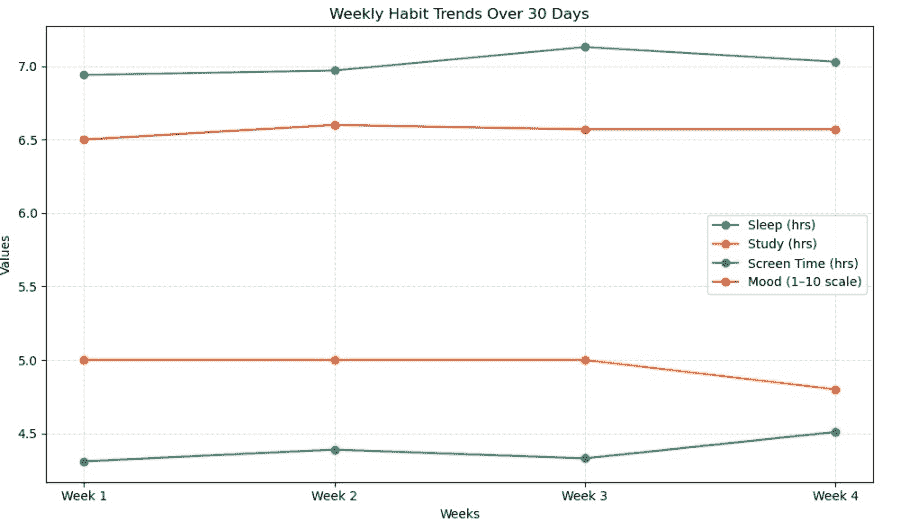

# 使用 NumPy 分析我的日常习惯（睡眠、屏幕时间与情绪）

> [`towardsdatascience.com/using-numpy-to-analyze-my-daily-habits-sleep-screen-time-mood/`](https://towardsdatascience.com/using-numpy-to-analyze-my-daily-habits-sleep-screen-time-mood/)

<mdspan datatext="el1761675348118" class="mdspan-comment">我已经运行了一个小的 NumPy 项目系列，其中我试图真正*构建一些东西*，而不是仅仅通过随机函数和文档。我一直觉得最好的学习方式是通过实践，所以在这个项目中，我想创建一些既实用又个性化的东西。

简单的想法：分析我的日常习惯——睡眠、学习时间、屏幕时间、锻炼和情绪——看看它们如何影响我的生产力和整体福祉。数据不是真实的；它是虚构的，模拟了 30 天。但目标不是数据的准确性——而是学习如何有意义地使用 NumPy。

所以让我们一步一步地走一遍这个过程。

## 第 1 步——加载数据和理解数据

我首先创建了一个简单的 NumPy 数组，包含 30 行（每天一行）和六列——每一列代表一个不同的习惯指标。然后我将其保存为`.npy`文件，这样我就可以轻松地稍后加载它。

```py
# TODO: Import NumPy and load the .npy data file
import numpy as np
data = np.load(‘activity_data.npy’)
```

加载后，我想确认一切看起来都符合预期。所以我检查了**形状**（以了解有多少行和列）和**维度数**（以确认它是一个 2D 表格，而不是 1D 列表）。

```py
# TODO: Print array shape, first few rows, etc.
data.shape
data.ndim
```

**输出：30 行，6 列，维度=2**

我还打印出了一些前几行，只是为了从视觉上确认每个值看起来都很好——例如，睡眠时间不是负数，或者情绪值在合理的范围内。

```py
# TODO: Top 5 rows
data[:5]
```

**输出：**

```py
array([[ 1\. , 6.5, 5\. , 4.2, 20\. , 6\. ],
[ 2\. , 7.2, 6\. , 3.1, 35\. , 7\. ],
[ 3\. , 5.8, 4\. , 5.5, 0\. , 5\. ],
[ 4\. , 8\. , 7\. , 2.5, 30\. , 8\. ],
[ 5\. , 6\. , 5\. , 4.8, 10\. , 6\. ]])
```

## 第 2 步——验证数据

在进行任何分析之前，我想确保数据是有意义的。当我们处理虚构数据时，我们经常跳过这一点，但这仍然是一个好的实践。

所以我检查了：

+   没有负睡眠时间

+   没有低于 1 或高于 10 的情绪分数

对于睡眠，这意味着选择睡眠列（我的数组中的索引 1）并检查是否有任何值低于零。

```py
# Make sure values are reasonable (no negative sleep)
data[:, 1] < 0
```

**输出：**

```py
array([False, False, False, False, False, False, False, False, False,
False, False, False, False, False, False, False, False, False,
False, False, False, False, False, False, False, False, False,
False, False, False])
```

这意味着没有负数。然后我对情绪也做了同样的处理。我数了一下，发现情绪列在索引 5，检查是否有任何值低于 1 或高于 10。

```py
# Is mood out of range?
data[:, 5] < 1
data[:, 5] > 10
```

**我们得到了相同的输出。**

一切看起来都很好，所以我们可以继续。

## 第 3 步——将数据拆分为周

我有 30 天的数据，我想按周分析它。第一个直觉是使用 NumPy 的`split()`函数，但失败了，因为 30 不能被 4 整除。所以，我使用了`np.array_split()`，它允许不均匀的拆分。

这给了我：

+   第一周 → 8 天

+   第二周 → 8 天

+   第三周 → 7 天

+   第四周 → 7 天

```py
# TODO: Slice data into week 1, week 2, week 3, week 4
weekly_data = np.array_split(data, 4)
weekly_data
```

**输出：**

```py
[array([[ 1\. , 6.5, 5\. , 4.2, 20\. , 6\. ],
[ 2\. , 7.2, 6\. , 3.1, 35\. , 7\. ],
[ 3\. , 5.8, 4\. , 5.5, 0\. , 5\. ],
[ 4\. , 8\. , 7\. , 2.5, 30\. , 8\. ],
[ 5\. , 6\. , 5\. , 4.8, 10\. , 6\. ],
[ 6\. , 7.5, 6\. , 3.3, 25\. , 7\. ],
[ 7\. , 8.2, 3\. , 6.1, 40\. , 7\. ],
[ 8\. , 6.3, 4\. , 5\. , 15\. , 6\. ]]),

array([[ 9\. , 7\. , 6\. , 3.2, 30\. , 7\. ],
[10\. , 5.5, 3\. , 6.8, 0\. , 5\. ],
[11\. , 7.8, 7\. , 2.9, 25\. , 8\. ],
[12\. , 6.1, 5\. , 4.5, 15\. , 6\. ],
[13\. , 7.4, 6\. , 3.7, 30\. , 7\. ],
[14\. , 8.1, 2\. , 6.5, 50\. , 7\. ],
[15\. , 6.6, 5\. , 4.1, 20\. , 6\. ],
[16\. , 7.3, 6\. , 3.4, 35\. , 7\. ]]),

array([[17\. , 5.9, 4\. , 5.6, 5\. , 5\. ],
[18\. , 8.3, 7\. , 2.6, 30\. , 8\. ],
[19\. , 6.2, 5\. , 4.3, 10\. , 6\. ],
[20\. , 7.6, 6\. , 3.1, 25\. , 7\. ],
[21\. , 8.4, 3\. , 6.3, 40\. , 7\. ],
[22\. , 6.4, 4\. , 5.1, 15\. , 6\. ],
[23\. , 7.1, 6\. , 3.3, 30\. , 7\. ]]),

array([[24\. , 5.7, 3\. , 6.7, 0\. , 5\. ],
[25\. , 7.9, 7\. , 2.8, 25\. , 8\. ],
[26\. , 6.2, 5\. , 4.4, 15\. , 6\. ],
[27\. , 7.5, 6\. , 3.5, 30\. , 7\. ],
[28\. , 8\. , 2\. , 6.4, 50\. , 7\. ],
[29\. , 6.5, 5\. , 4.2, 20\. , 6\. ],
[30\. , 7.4, 6\. , 3.6, 35\. , 7\. ]])]
```

现在数据被分成了四块，我可以轻松地分别分析每一块。

## 第 4 步——计算每周指标

我想了解每个习惯每周是如何变化的。所以我关注了四个主要方面：

+   平均睡眠

+   平均学习时间

+   平均屏幕时间

+   平均情绪评分

我将每周的数组存储在单独的变量中，然后使用`np.mean()`计算每个指标的平均值。

### 平均睡眠时间

```py
# store into variables
week_1 = weekly_data[0]
week_2 = weekly_data[1]
week_3 = weekly_data[2]
week_4 = weekly_data[3]

# TODO: Compute average sleep
week1_avg_sleep = np.mean(week_1[:, 1])
week2_avg_sleep = np.mean(week_2[:, 1])
week3_avg_sleep = np.mean(week_3[:, 1])
week4_avg_sleep = np.mean(week_4[:, 1])
```

### 平均学习时间

```py
# TODO: Compute average study hours
week1_avg_study = np.mean(week_1[:, 2])
week2_avg_study = np.mean(week_2[:, 2])
week3_avg_study = np.mean(week_3[:, 2])
week4_avg_study = np.mean(week_4[:, 2])
```

### 平均屏幕时间

```py
# TODO: Compute average screen time
week1_avg_screen = np.mean(week_1[:, 3])
week2_avg_screen = np.mean(week_2[:, 3])
week3_avg_screen = np.mean(week_3[:, 3])
week4_avg_screen = np.mean(week_4[:, 3])
```

### 平均情绪评分

```py
# TODO: Compute average mood score
week1_avg_mood = np.mean(week_1[:, 5])
week2_avg_mood = np.mean(week_2[:, 5])
week3_avg_mood = np.mean(week_3[:, 5])
week4_avg_mood = np.mean(week_4[:, 5])
```

然后，为了使结果更容易阅读，我很好地格式化了结果。

```py
# TODO: Display weekly results clearly
print(f”Week 1 — Average sleep: {week1_avg_sleep:.2f} hrs, Study: {week1_avg_study:.2f} hrs, “
f”Screen time: {week1_avg_screen:.2f} hrs, Mood score: {week1_avg_mood:.2f}”)

print(f”Week 2 — Average sleep: {week2_avg_sleep:.2f} hrs, Study: {week2_avg_study:.2f} hrs, “
f”Screen time: {week2_avg_screen:.2f} hrs, Mood score: {week2_avg_mood:.2f}”)

print(f”Week 3 — Average sleep: {week3_avg_sleep:.2f} hrs, Study: {week3_avg_study:.2f} hrs, “
f”Screen time: {week3_avg_screen:.2f} hrs, Mood score: {week3_avg_mood:.2f}”)

print(f”Week 4 — Average sleep: {week4_avg_sleep:.2f} hrs, Study: {week4_avg_study:.2f} hrs, “
f”Screen time: {week4_avg_screen:.2f} hrs, Mood score: {week4_avg_mood:.2f}”)
```

**输出：**

```py
Week 1 – Average sleep: 6.94 hrs, Study: 5.00 hrs, Screen time: 4.31 hrs, Mood score: 6.50
Week 2 – Average sleep: 6.97 hrs, Study: 5.00 hrs, Screen time: 4.39 hrs, Mood score: 6.62
Week 3 – Average sleep: 7.13 hrs, Study: 5.00 hrs, Screen time: 4.33 hrs, Mood score: 6.57
Week 4 – Average sleep: 7.03 hrs, Study: 4.86 hrs, Screen time: 4.51 hrs, Mood score: 6.57
```

## 第 5 步—理解结果

一旦打印出这些数字，一些模式开始显现。

我的**睡眠时间**在前两周相当稳定（大约 6.9 小时），但在第三周，它们增加到了大约 7.1 小时。这意味着随着时间的推移，我的睡眠质量有所提高。到了第四周，它大致保持在 7.0 小时左右。

对于**学习时间**，情况正好相反。第一周和第二周的平均每天大约是 5 小时，但到了第四周，它下降到了大约 4 小时。基本上，我一开始势头很猛，但后来慢慢失去了动力——这说实话听起来很合理。

接下来是**屏幕时间**。这一点有点令人痛苦。在第一周，它大约是每天 4.3 小时，而且每周都在稳步上升。这是典型的早期生产力高，然后在月底慢慢转向更多“滚动休息”的周期。

最后，还有**情绪**。我的情绪评分在一周开始时大约为 6.5，在第二周略有上升至 6.6，然后在整个期间徘徊。它没有大幅变动，但看到第二周的小幅上升——就在我的学习时间下降和屏幕时间增加之前，这很有趣。

为了使事物更具互动性，我认为使用 matplotlib 进行可视化会很好。



## 第 6 步—寻找模式

现在我有了这些数字，我想知道*为什么*我的情绪在第二周上升。

因此，我并排比较了这些周。第二周有充足的睡眠，高学习时间，与后几周相比，屏幕时间相对较低。

这可能解释了为什么我的情绪评分在那里达到峰值。到了第三周，尽管我睡得更多，但我的学习时间已经开始下降——也许我休息得更多，但完成的工作更少，这并没有像预期的那样大幅提升我的情绪。

我喜欢这个项目的这一点：这并不是关于数据是否真实，而是关于你如何*使用 NumPy*来探索模式、关系和小的洞察。即使是虚构的数据，当你以正确的方式看待它时，也能讲述一个故事。

## 第 7 步—总结和下一步

在这个小小的项目中，我学到了一些关键的东西——关于 NumPy 以及如何构建这种分析结构。

我们从一个虚构的日常习惯的原始数组开始，学习了如何检查其结构和有效性，将其分割成有意义的块（周），然后使用简单的 NumPy 操作来分析每个部分。

这是一种小型的项目，会让你意识到数据分析并不总是复杂的。有时，它只是关于提出简单的问题，比如*“我的屏幕时间是如何随时间变化的？”*或者*“我在什么时候感觉最好？”*

如果我想进一步深入（我可能会的），有这么多方向可以走：

+   找到整体上**最好和最坏的日子**

+   比较工作日和周末

+   或者甚至创建一个基于多种习惯结合的简单“幸福感评分”

但这可能是系列下一部分的内容。

目前为止，我很高兴能够将 NumPy 应用到感觉真实和贴近实际的事物上——不仅仅是抽象的数组和数字，还有习惯和情感。这就是那种能够留下深刻印象的学习。

**感谢阅读。**

如果你正在跟随这个系列，尝试用自己的虚构数据重现这个过程。即使你的数字是随机的，这个过程也会教你如何像专业人士一样切割、拆分和分析数组。
