# 构建真正有效的监控系统

> [构建真正有效的监控系统的文章](https://towardsdatascience.com/building-a-monitoring-system-that-actually-works/)

在构建和管理产品时，确保它们按预期运行且一切运行顺畅至关重要。我们通常依赖指标来衡量我们产品的健康状况。许多因素可以影响我们的 KPIs，从内部变化，如 UI 更新、价格调整或事件，到外部因素，如竞争对手的行动或季节性趋势。这就是为什么持续监控您的 KPIs 很重要，这样您就可以在事情偏离轨道时迅速做出反应。否则，可能需要几周时间才能意识到您的产品有 5%的客户完全损坏，或者在上一个版本发布后转化率下降了 10 个百分点。

为了获得这种可见性，我们创建带有关键指标的仪表板。但让我们说实话，没有人积极监控的仪表板几乎没有价值。我们要么需要人们不断监视数十个甚至数百个指标，要么我们需要一个自动警报和监控系统。而且我强烈倾向于后者。因此，在这篇文章中，我将向您介绍一种构建有效监控系统的实用方法，以监控您的关键绩效指标（KPIs）。您将了解不同的监控方法，如何构建您的第一个统计监控系统，以及在生产环境中部署时可能会遇到的挑战。

## 设置监控

让我们从如何架构您的监控系统的整体图景开始，然后我们将深入技术细节。在设置监控时，您需要做出一些关键决策：

+   **灵敏度**。您需要在错过重要异常（假阴性）和每天被 100 次虚假警报轰炸（假阳性）之间找到正确的平衡。我们稍后会讨论您可以调整这些杠杆的方法。

+   **维度**。您选择监控的细分市场也会影响您的灵敏度。如果在小细分市场（如特定浏览器或国家）存在问题，如果您直接监控该细分市场的指标，您的系统更有可能捕捉到它。但这里有一个问题：您监控的细分市场越多，您处理的假阳性就越多，因此您需要找到最佳平衡点。

+   **时间粒度**。如果您有大量数据且无法承受延迟，查看每分钟的数据可能值得考虑。如果您没有足够的数据，可以将它们汇总到 5-15 分钟的桶中，并监控这些桶。无论如何，始终在实时监控的同时进行更高级别的每日、每周或每月监控，以关注长期趋势。

然而，监控不仅仅是关于技术解决方案。它还关乎你实施的过程：

+   **您需要有人负责监控和响应警报**。我们过去在团队中通过轮班制来处理这个问题，每周有一个人负责审查所有警报。

+   **除了自动化监控之外，进行一些手动检查也是值得的**。您可以在办公室设置电视显示屏，或者至少建立一个流程，让某人（如值班人员）每天或每周审查一次指标。

+   **您需要建立反馈循环**。当您审查警报并回顾可能错过的事件时，花时间微调监控系统的设置。

+   **变更日志（影响您关键绩效指标的所有变更的记录）的价值不容小觑**。它帮助您和您的团队始终了解关键绩效指标发生了什么变化以及何时发生。此外，它还为您提供了一个宝贵的数据集，用于评估您在做出更改（如确定新配置实际会捕获多少过去异常）时对监控系统的影响。

现在我们已经概述了整体情况，让我们继续深入探讨如何在实际中检测时序数据的异常。

## 监控框架

有许多现成的框架可供您用于监控。我将它们分为两大类。

第一组涉及创建带有置信区间的预测。以下是一些选项：

+   您可以使用[**statsmodels**](https://www.statsmodels.org/stable/generated/statsmodels.tsa.arima.model.ARIMA.html)和 ARIMA 类模型的经典实现进行时序预测。

+   另一个通常开箱即用的选项是 Meta 的 [**Prophet**](https://facebook.github.io/prophet/)。它是一个简单的加性模型，返回不确定性区间。

+   此外，还有 [**GluonTS**](https://github.com/awslabs/gluonts)，这是 AWS 提供的一个基于深度学习的预测框架。

第二组专注于异常检测，以下是一些流行的库：

+   [**PyOD**](https://pyod.readthedocs.io/en/latest/)：最受欢迎的 Python 异常检测工具箱，包含 50 多种算法（包括时序和深度学习方法）。

+   [**ADTK**](https://github.com/arundo/adtk) **（异常检测工具包）**：专为无监督/基于规则的时序异常检测而构建，易于集成到 pandas 数据框中。

+   [**Merlion**](https://github.com/salesforce/Merlion)：结合经典和机器学习方法，用于时序数据的预测和异常检测。

我在这里只提到了几个例子；实际上有更多的库可供选择。你完全可以尝试用你的数据来测试它们，看看它们的性能如何。然而，我想分享一个通常从更简单的方法开始监控的方法。尽管它非常简单，以至于你可以用单个 SQL 查询来实现，但在许多情况下它表现得相当出色。这种简单性的另一个显著优点是，你几乎可以在任何工具中实现它，而将更复杂的机器学习方法部署到某些系统中可能会很棘手。

## 监控的统计方法

监控背后的核心思想很简单：使用历史数据来构建置信区间（CI），并检测当前指标是否超出预期行为。我们通过过去数据的平均值和标准差来估计这个置信区间。这仅仅是基本的统计学。

\[

**置信区间** = (\textbf{mean} – \textsf{coef}_1 \times \textbf{std},\; \textbf{mean} + \textsf{coef}_2 \times \textbf{std})

\]

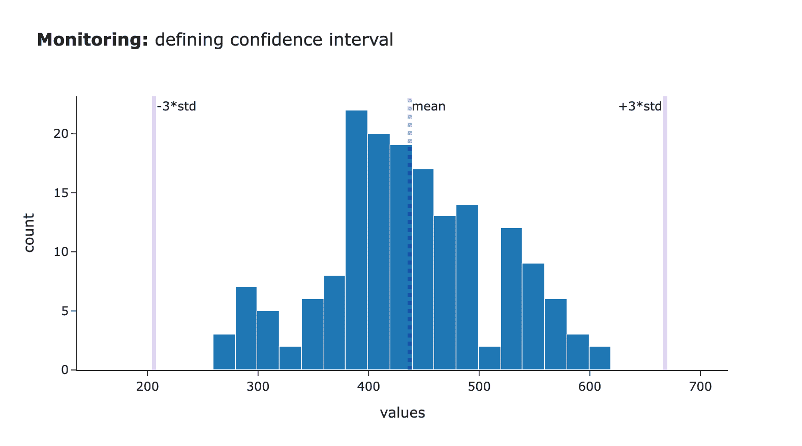

图片由作者提供

然而，这种方法的有效性取决于几个关键参数，你在这里所做的选择将显著影响你警报的准确性。

第一个决策是如何定义用于计算统计数据的样本。通常，我们将当前指标与前几天同一时间段进行比较。这涉及两个主要组成部分：

+   **时间窗口：** 我通常选择当前时间戳周围±10–30 分钟的时间窗口，以考虑到短期波动。

+   **历史天数：** 我更喜欢使用过去 3–5 周内的同一工作日。这种方法考虑到了通常存在于业务数据中的周季节性。然而，根据你的季节性模式，你可能需要选择不同的方法（例如，将天数分为两组：工作日和周末）。

另一个重要的参数是用于设置置信区间宽度的系数选择。我通常使用三个标准差，因为它涵盖了接近正态分布的 99.7%的观测值。

如你所见，有多个决策需要做出，没有一种适合所有情况的答案。最可靠的确定最佳设置的方法是使用自己的数据尝试不同的配置，并选择最适合你用例的最佳性能配置。因此，这是一个将方法付诸实践并观察它在真实数据上表现如何的理想时刻。

### 示例：监控出租车行程数量

为了测试这一点，我们将使用[流行的纽约出租车数据集](https://www.nyc.gov/site/tlc/about/tlc-trip-record-data.page) ([<mdspan datatext="el1761589640513" class="mdspan-comment">开放数据</mdspan>](https://opendata.cityofnewyork.us/overview/#termsofuse))。我加载了 2025 年 5 月至 7 月的数据，并专注于与高需求出租车相关的行程。由于我们每分钟有数百次行程，我们可以使用每分钟的数据进行监控。

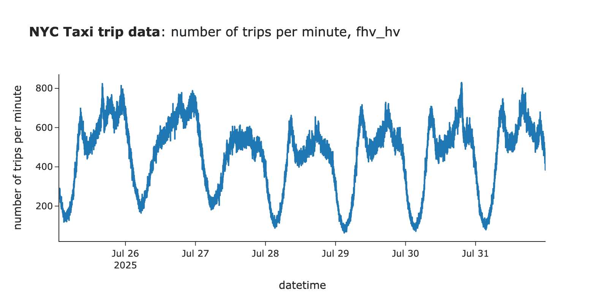

作者提供的图片

## 构建第一个版本

因此，让我们尝试我们的方法，并基于实际数据构建置信区间。我从一个默认的关键参数集开始：

+   以当前时间戳为中心的±15 分钟的时间窗口，

+   当前日期的数据加上前四周同一天的数据，

+   置信带定义为±3 个标准差。

现在，让我们创建一些具有业务逻辑的函数来计算置信区间并检查我们的值是否超出它。

```py
# returns the dataset of historic data
def get_distribution_for_ci(param, ts, n_weeks=3, n_mins=15): 
  tmp_df = df[['pickup_datetime', param]].rename(columns={param: 'value', 'pickup_datetime': 'dt'})

  tmp = [] 
  for n in range(n_weeks + 1):
    lower_bound = (pd.to_datetime(ts) - pd.Timedelta(weeks=n, minutes=n_mins)).strftime('%Y-%m-%d %H:%M:%S')
    upper_bound = (pd.to_datetime(ts) - pd.Timedelta(weeks=n, minutes=-n_mins)).strftime('%Y-%m-%d %H:%M:%S')
    tmp.append(tmp_df[(tmp_df.dt >= lower_bound) & (tmp_df.dt <= upper_bound)])

  base_df = pd.concat(tmp)
  base_df = base_df[base_df.dt < ts]
  return base_df

# calculates mean and std needed to calculate confidence intervals
def get_ci_statistics(param, ts, n_weeks=3, n_mins=15):
  base_df = get_distribution_for_ci(param, ts, n_weeks, n_mins)
  std = base_df.value.std()
  mean = base_df.value.mean()
  return mean, std

# iterating through all the timestamps in historic data
ci_tmp = []
for ts in tqdm.tqdm(df.pickup_datetime):
  ci = get_ci_statistics('values', ts, n_weeks=3, n_mins=15)
  ci_tmp.append(
    {
        'pickup_datetime': ts,
        'mean': ci[0],
        'std': ci[1],
    }
  )

ci_df = df[['pickup_datetime', 'values']].copy()
ci_df = ci_df.merge(pd.DataFrame(ci_tmp), how='left', on='pickup_datetime')

# defining CI
ci_df['ci_lower'] = ci_df['mean'] - 3 * ci_df['std']
ci_df['ci_upper'] = ci_df['mean'] + 3 * ci_df['std']

# defining whether value is outside of CI
ci_df['outside_of_ci'] = (ci_df['values'] < ci_df['ci_lower']) | (ci_df['values'] > ci_df['ci_upper'])
```

## 分析结果

让我们看看结果。首先，我们看到了相当多的假阳性触发（似乎由于正常变化而位于置信区间之外的孤立点）。

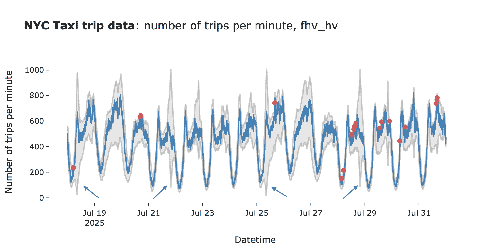

作者提供的图片

我们有两种方法可以调整我们的算法来考虑这一点：

+   置信区间不需要对称。我们可能对行程数量的增加不太关心，因此我们可以为上限使用更高的系数（例如，使用 5 而不是 3）。

+   数据波动性较大，因此偶尔会出现单个点落在置信区间之外的情况。为了减少这种假阳性警报，我们可以使用更稳健的逻辑，并且只有在多个点都位于置信区间之外时才触发警报（例如，过去 5 个点中的至少 4 个，或者 10 个点中的 8 个）。

然而，我们当前的置信区间还存在另一个潜在问题。如您所见，有相当多的情况中置信区间过于宽泛。这看起来不正常，可能会降低我们监控的敏感性。

让我们看看一个例子来理解为什么会发生这种情况。我们目前用来估计置信区间的分布是双峰的，这导致标准差更高，置信区间更宽。这是因为 7 月 14 日晚上的行程数量显著高于其他星期。

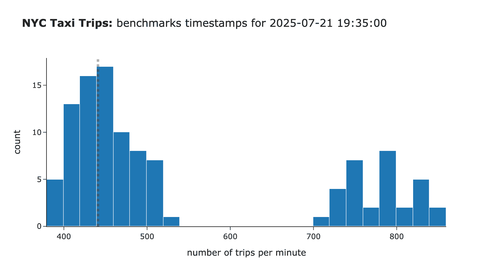

作者提供的图片

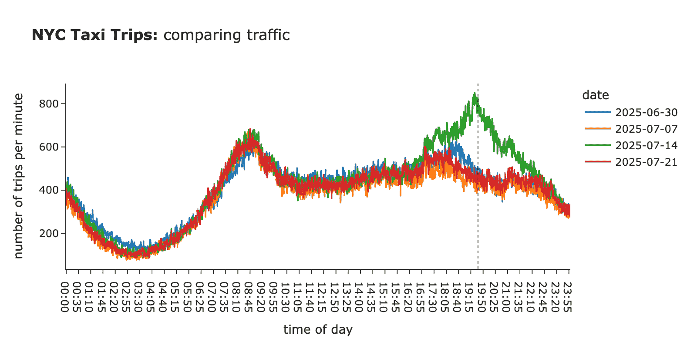

作者提供的图片

因此，我们在过去遇到了影响置信区间的异常情况。有两种方法可以解决这个问题：

+   如果我们进行持续监控，我们知道 7 月 14 日需求异常高，我们可以在构建置信区间时排除这些时段。这种方法需要一定的纪律来跟踪这些异常，但会带来更准确的结果。

+   然而，总有一个快速且简单的方法：我们可以在构建 CI 时简单地丢弃或限制异常值。

## 提高准确性

因此，在第一次迭代之后，我们识别出我们监控方法的一些潜在改进：

+   **对于上限使用更高的系数**，因为我们不太关心增加。我使用了 6 个标准差而不是 3。

+   **处理异常值**以过滤掉过去的异常。我尝试了移除或限制前 10-20%的异常值，并发现将限制设置为 20%同时将周期增加到 5 周在实践中效果最好。

+   **只有当最后 5 个点中有 4 个点超出 CI 时才发出警报**，以减少由正常波动引起的假阳性警报的数量。

让我们看看这在代码中是如何实现的。我们已经更新了`get_ci_statistics`中的逻辑，以考虑处理异常的不同策略。

```py
def get_ci_statistics(param, ts, n_weeks=3, n_mins=15, show_vis = False, filter_outliers_strategy = 'none', 
                   filter_outliers_perc = None):
  assert filter_outliers_strategy in ['none', 'clip', 'remove'], "filter_outliers_strategy must be one of 'none', 'clip', 'remove'"
  base_df = get_distribution_for_ci(param, ts, n_weeks, n_mins, show_vis)
  if filter_outliers_strategy != 'none': 
    p_upper = base_df.value.quantile(1 - filter_outliers_perc)
    p_lower = base_df.value.quantile(filter_outliers_perc)
    if filter_outliers_strategy == 'clip':
      base_df['value'] = base_df['value'].clip(lower=p_lower, upper=p_upper)
    if filter_outliers_strategy == 'remove':
      base_df = base_df[(base_df.value >= p_lower) & (base_df.value <= p_upper)]
  std = base_df.value.std()
  mean = base_df.value.mean()
  return mean, std
```

我们还需要更新定义`outside_of_ci`参数的方式。

```py
for ts in tqdm.tqdm(ci_df.pickup_datetime):
  tmp_df = ci_df[(ci_df.pickup_datetime <= ts)].tail(5).copy()
  tmp_df = tmp_df[~tmp_df.ci_lower.isna() & ~tmp_df.ci_upper.isna()]
  if tmp_df.shape[0] < 5: 
    continue
  tmp_df['outside_of_ci'] = (tmp_df['values'] < tmp_df['ci_lower']) | (tmp_df['values'] > tmp_df['ci_upper'])
  if tmp_df.outside_of_ci.map(int).sum() >= 4:
    anomalies.append(ts) 

ci_df['outside_of_ci'] = ci_df.pickup_datetime.isin(anomalies)
```

我们可以看到，CI 现在明显变窄了（不再有异常宽的 CI），而且由于我们增加了上限系数，我们收到的警报也少得多。

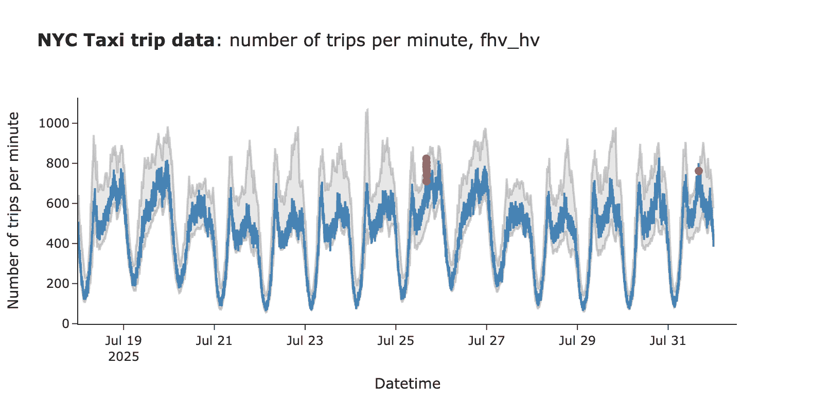

作者提供的图片

让我们调查我们发现的两个警报。在将流量与上周进行比较时，过去两周的两个警报看起来是合理的。

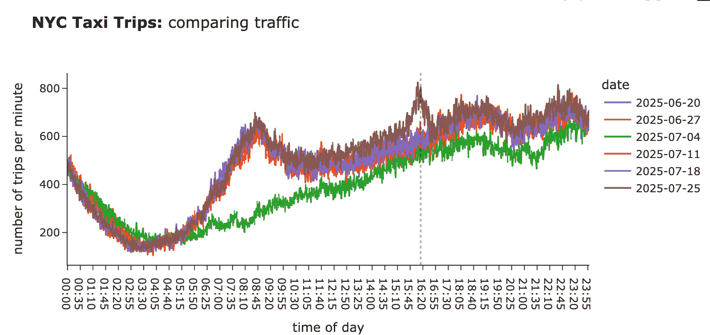

作者提供的图片

> ***实用技巧**：这张图也提醒我们，理想情况下，我们应该考虑公共假日，要么排除它们，要么在计算 CI 时将它们视为周末。*

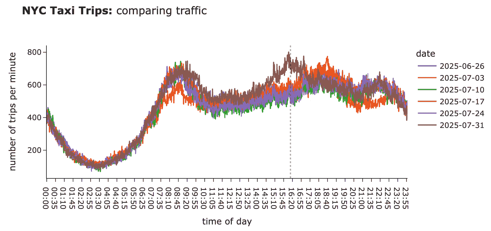

作者提供的图片

因此，我们新的监控方法完全合理。然而，也存在一个缺点：通过只寻找 4 分钟中有 5 分钟落在 CI 之外的情况，我们在一切完全出错的情况下延迟了警报。为了解决这个问题，实际上可以使用两个 CI：

+   **末日 CI**：一个宽泛的置信区间，即使只有一个点落在区间外，就意味着需要恐慌。

+   **事件 CI**：这是我们之前构建的，我们可能需要等待 5-10 分钟才能触发警报，因为指标下降并不那么关键。

让我们为我们的案例定义 2 个 CI。

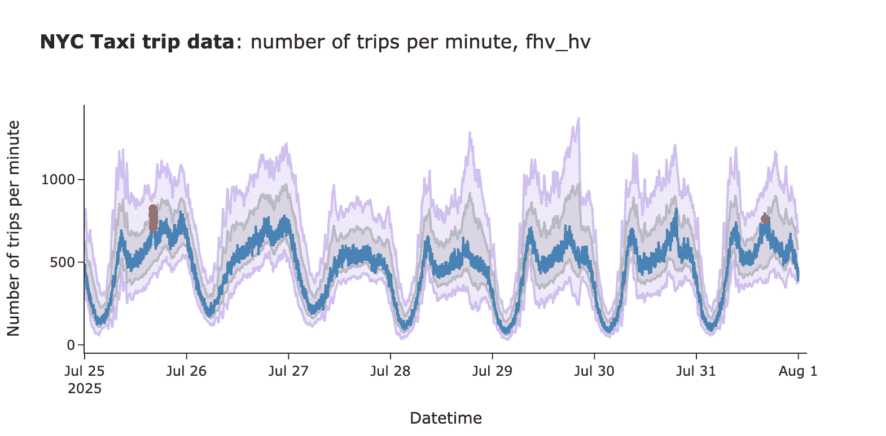

作者提供的图片

这是一个平衡的方法，它让我们在两个世界中都能得到最好的结果：当某件事完全出错时，我们可以快速反应，同时仍然控制假阳性。有了这个，我们已经取得了良好的结果，准备继续前进。

## 测试我们的监控对异常的处理

我们已经确认我们的方法对于常规业务案例效果良好。然而，通过模拟我们想要捕捉的异常并检查监控的表现，进行一些压力测试也是值得的。在实践中，测试之前已知的异常以查看它如何处理现实世界的例子是值得的。

在我们的案例中，我们没有之前异常的变化日志，所以我模拟了行程数量下降 20%，我们的方法立即捕捉到了它。

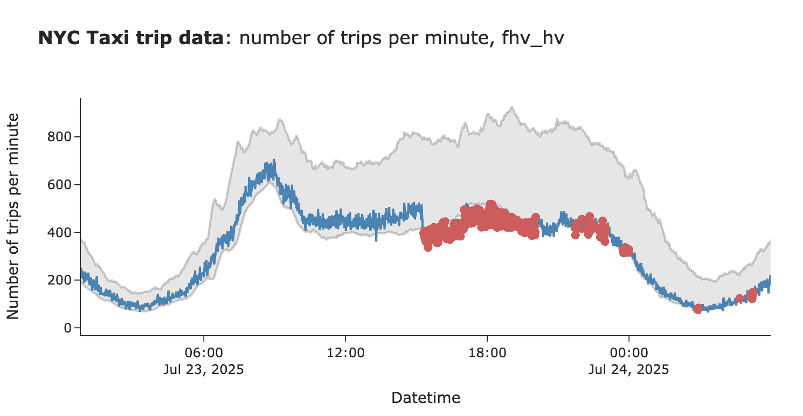

作者图片

这些类型的阶跃变化在现实生活中可能会很棘手。想象一下，如果我们失去了一个合作伙伴，那么较低的水平就变成了新的正常水平，对于这个指标来说。在这种情况下，调整我们的监控也是值得的。如果可能的话，基于当前状态重新计算历史指标（例如，通过过滤掉失去的合作伙伴），那将是理想的，因为这会将监控恢复到正常状态。如果这不可行，我们可以调整历史数据（比如，减去 20%的交通量作为我们估计的变化）或者丢弃变化之前的所有数据，只使用新的数据来构建置信区间。

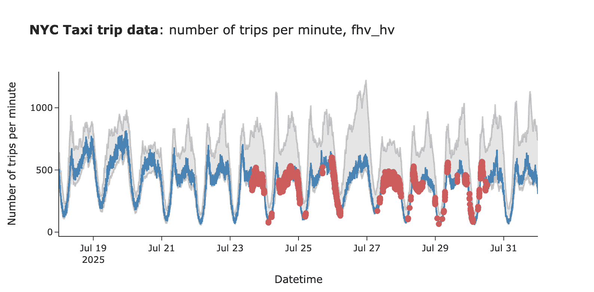

作者图片

让我们看看另一个棘手的现实世界例子：逐渐衰减。如果你的指标每天都在缓慢下降，那么我们的实时监控可能不会捕捉到这种情况，因为置信区间会随着它一起移动。为了捕捉这种情况，拥有更粗粒度的监控（如每日、每周，甚至每月）是值得的。

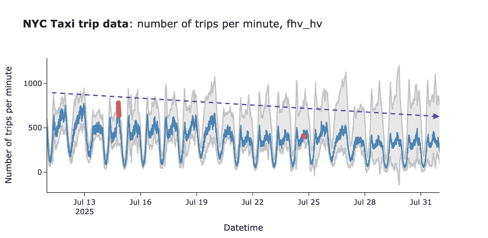

作者图片

> 你可以在[GitHub](https://github.com/miptgirl/miptgirl_medium/tree/main/alerting_and_monitoring)上找到完整的代码。

## 运营挑战

我们已经讨论了警报和监控系统背后的数学原理。然而，一旦你开始在生产环境中部署你的系统，你可能会遇到几个其他的细微差别。所以在结束之前，我想先涵盖这些内容。

**滞后数据。**在我们的例子中，我们没有遇到这个问题，因为我们正在处理历史数据，但在现实生活中，你需要处理数据滞后。数据通常需要一段时间才能到达你的数据仓库。因此，你需要学会区分数据尚未到达的情况与实际影响客户体验的事件。最直接的方法是查看历史数据，确定典型的滞后时间，并过滤掉最后 5-10 个数据点。

**不同段落的敏感性不同。**你可能会想监控不仅仅是主要的关键绩效指标（如行程数量），还要将其分解为多个段落（如合作伙伴、地区等）。添加更多的段落总是有益的，因为它有助于你发现特定段落的较小变化（例如，在曼哈顿存在问题）。然而，正如我上面提到的，有一个缺点：更多的段落意味着你需要处理的更多误报警报。为了控制这种情况，你可以为不同的段落使用不同的敏感性级别（比如，主要关键绩效指标为 3 个标准差，段落为 5 个）。

**更智能的警报系统**。此外，当你监控许多部分时，让你的警报更智能是值得的。比如说，你有主关键绩效指标和 99 个部分的监控。现在，想象一下我们有一个全球性的故障，所有行程的数量都下降了。在接下来的 5 分钟内，你（希望）会收到 100 条通知，说某处出了问题。这不是一个理想的经验。为了避免这种情况，我会构建逻辑来过滤掉冗余的通知。例如：

+   如果我们在过去 3 小时内收到了相同的通知，不要再次触发警报。

+   如果有关主关键绩效指标下降的通知，并且超过 3 个部分，只需提醒主关键绩效指标的变化。

总体来说，警报疲劳是真实存在的，所以值得最小化噪音。

就这样！我们已经涵盖了整个警报和监控主题，希望你现在已经完全准备好设置自己的系统。

## 摘要

我们在警报和监控方面已经覆盖了很多内容。让我用一个逐步指南来总结如何开始监控你的关键绩效指标。

+   **第一步是收集过去异常的变更日志**。你可以用它作为系统的一组测试用例，并在计算置信区间时过滤掉异常时期。

+   **接下来，构建一个原型并在历史数据上运行它**。我会从最高级别的关键绩效指标开始，尝试几种可能的配置，看看它如何捕捉先前的异常以及是否会产生大量的误报。在这个阶段，你应该有一个可行的解决方案。

+   **然后尝试在生产环境中运行它**，因为这是你必须处理数据滞后并实际看到监控如何表现的地方。运行 2-4 周，调整参数以确保它按预期工作。

+   **之后，与你的同事分享监控信息，并开始扩大范围**，包括其他部分。别忘了将所有异常情况添加到变更日志中，并建立反馈循环以持续改进你的系统。

就这样！现在你可以放心地休息，知道自动化正在监控你的关键绩效指标（但仍然时不时地检查一下，以防万一）。

> *感谢阅读。希望这篇文章能给你带来启发。记住爱因斯坦的建议：“重要的是不要停止质疑。好奇心有其存在的理由。”愿你的好奇心引导你发现下一个伟大的洞察。*
