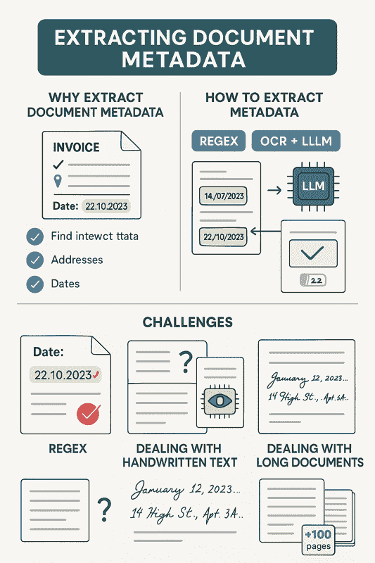
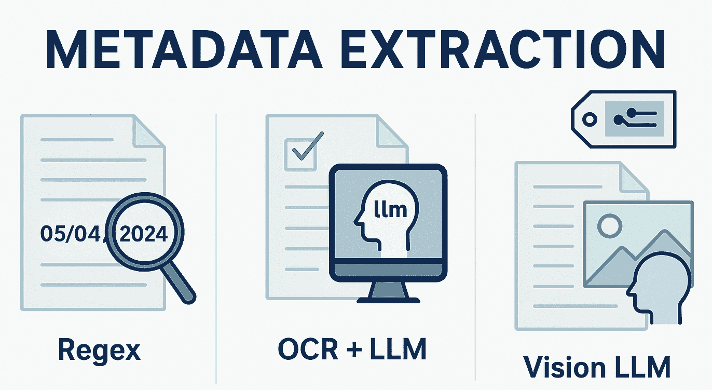
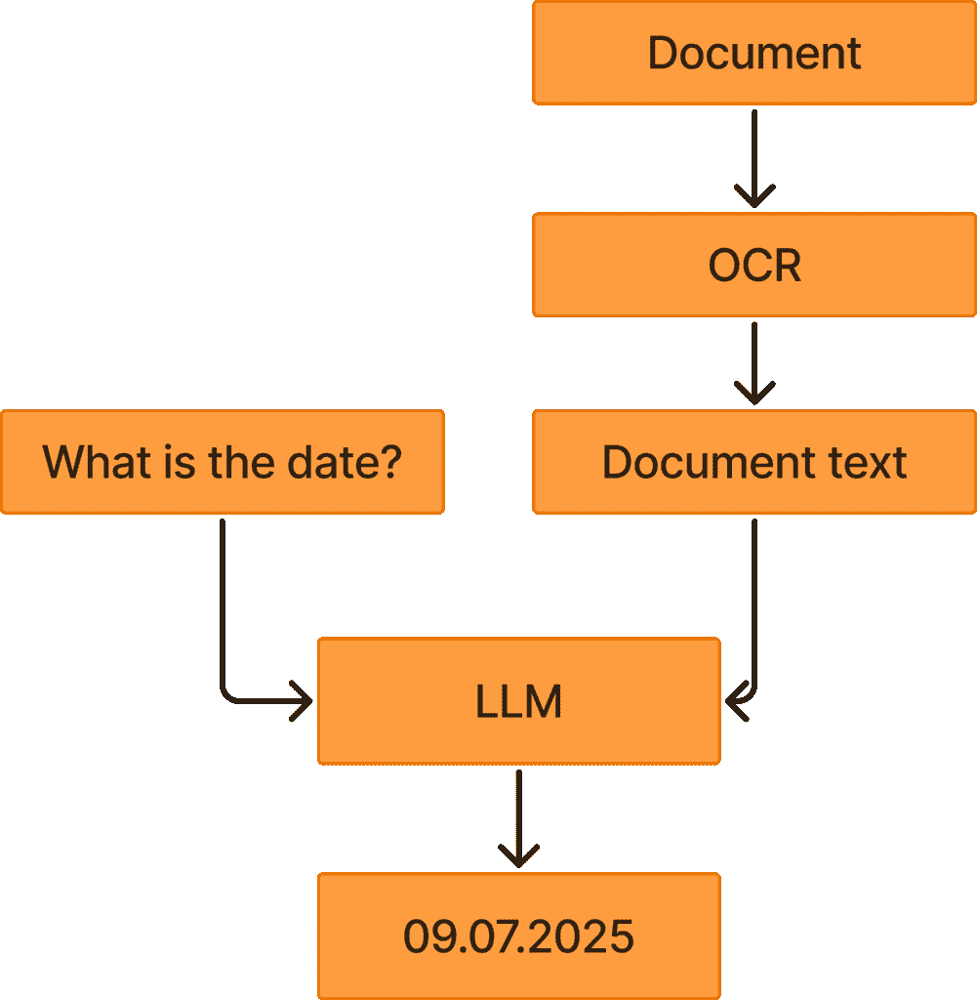
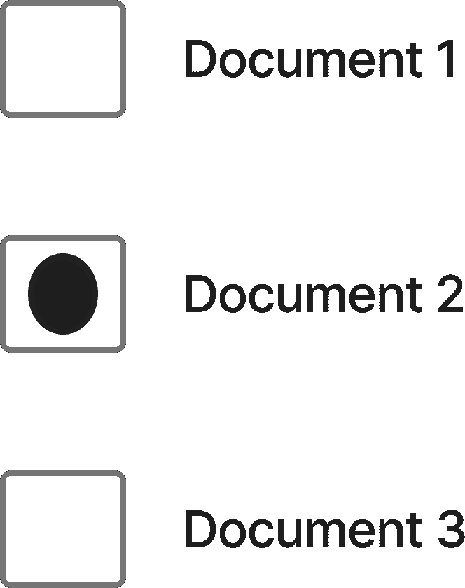

# 如何一致地从复杂文档中提取元数据

> [`towardsdatascience.com/how-to-consistently-extract-metadata-from-complex-documents/`](https://towardsdatascience.com/how-to-consistently-extract-metadata-from-complex-documents/)

<mdspan datatext="el1761243141366" class="mdspan-comment">文档包含大量重要的信息。</mdspan>然而，在许多情况下，这些信息隐藏在文档内容的深处，因此很难用于下游任务。在这篇文章中，我将讨论如何一致地从您的文档中提取元数据，考虑到元数据提取的方法和您在提取过程中可能遇到的挑战。

这篇文章是对在文档上执行元数据提取的高级概述，强调了在执行元数据提取时必须考虑的不同因素。

这张信息图表突出了本文的主要内容。我首先将讨论为什么我们需要提取文档元数据，以及它对下游任务的有用性。接着，我将讨论提取元数据的方法，包括正则表达式、OCR + LLM 和视觉 LLM。最后，我还会讨论在执行元数据提取时可能遇到的不同挑战，例如正则表达式、手写文本和处理长文档。图片由 ChatGPT 提供。

## 为什么提取文档元数据

首先，重要的是要明确为什么我们需要从文档中提取元数据。毕竟，如果信息已经在文档中存在，我们难道不能仅仅使用 RAG 或其他类似方法来找到信息吗？

在许多情况下，RAG 能够找到特定的数据点，但预先提取元数据可以简化许多下游任务。使用元数据，例如，您可以根据数据点过滤您的文档，如下所示：

+   文档类型

+   地址

+   日期

此外，如果您已经部署了 RAG 系统，那么在许多情况下，它将受益于额外提供的元数据。这是因为您将附加信息（元数据）更清晰地呈现给 LLM。例如，假设您提出一个与日期相关的问题。在这种情况下，简单地提供预先提取的文档日期给模型，而不是让模型在推理时提取日期，会更容易。这可以节省成本和延迟，并可能提高您 RAG 响应的质量。

## 如何提取元数据

我将强调三种主要的元数据提取方法，从最简单到最复杂：

+   正则表达式

+   OCR + LLM

+   视觉 LLM

这张图片突出了提取元数据的三个主要方法。最简单的方法是使用正则表达式，尽管它在许多情况下不起作用。一种更强大的方法是 OCR + LLM，它在大多数情况下表现良好，但在您依赖于视觉信息的情况下会失败。如果视觉信息很重要，您可以使用最强大的方法——视觉 LLM。图片由 ChatGPT 提供。

### 正则表达式

正则表达式是提取元数据最简单且最一致的方法。如果你事先知道数据的精确格式，正则表达式就能很好地工作。例如，如果你正在处理租赁协议，并且知道日期是以 dd.mm.yyyy 的格式编写的，总是紧跟在“日期:”这个词之后，那么正则表达式就是你的选择。

不幸的是，大多数文档处理比这更复杂。你将不得不处理不一致的文档，面临如下挑战：

+   日期在文档的不同位置编写

+   由于 OCR 质量差，文本中缺少一些字符

+   日期以不同的格式编写（例如，mm.dd.yyyy，10 月 22 日，12 月 22 日等）

由于这个原因，我们通常不得不转向更复杂的方法，比如 OCR + LLM，我将在下一节中描述。

### OCR + LLM

使用 OCR + LLM 是提取元数据的一种强大方法。这个过程从对文档应用 OCR 以提取文本内容开始。然后你将 OCR 文本提示给 LLM，以从文档中提取日期。这通常工作得非常好，因为 LLM 很擅长理解上下文（哪个日期是相关的，哪个日期是不相关的），并且可以理解各种不同格式的日期。在许多情况下，LLM 还能够理解欧洲（dd.mm.yyyy）和美国（mm.dd.yyyy）的日期标准。

这张图展示了 OCR + LLM 方法。在右侧，你可以看到我们首先对文档进行 OCR，以提取文档文本。然后我们可以提示 LLM 读取该文本并从文档中提取日期。LLM 然后输出从文档中提取的日期。图片由作者提供。

然而，在某些场景中，你想要提取的元数据需要视觉信息。在这些场景中，你需要应用最先进的技术：视觉 LLM。

### 视觉 LLM

使用视觉 LLM 是最复杂的方法，具有最高的延迟和成本。在大多数场景中，运行视觉 LLM 将比运行纯文本 LLM 贵得多。

当运行视觉 LLM 时，你通常必须确保图像具有高分辨率，这样视觉 LLM 才能读取文档中的文本。这需要大量的视觉标记，这使得处理变得昂贵。然而，具有高分辨率图像的视觉 LLM 通常能够提取 OCR + LLM 无法提取的复杂信息，例如下面图片中提供的信息。

这张图片突出显示了一个需要使用视觉 LLM 的任务。如果你对这个图像进行 OCR，你将能够提取“文档 1，文档 2，文档 3”等单词，但 OCR 将完全错过填写的复选框。这是因为 OCR 是训练来提取字符，而不是像带圆圈的复选框这样的图形。因此，尝试使用 OCR + LLM 在这种情况下将会失败。然而，如果你使用视觉 LLM 来解决这个问题，它将能够轻松地提取哪个文档被勾选。图片由作者提供。

视觉 LLM 在 OCR 可能会挣扎的手写文本场景中也表现良好。

## 提取元数据时的挑战

正如我之前指出的那样，文档是复杂的，并且以各种格式出现。因此，在从文档中提取元数据时，你必须处理许多挑战。我将强调三个主要挑战：

+   何时使用视觉 LLM 与 OCR + LLM

+   处理手写文本

+   处理长文档

### 何时使用视觉 LLM 与 OCR + LLM

理想情况下，我们会使用视觉 LLM 进行所有元数据提取。然而，这通常由于运行视觉 LLM 的成本而不可行。因此，我们必须决定何时使用视觉 LLM 与 OCR + LLM。

你可以决定你想要提取的元数据点是否需要视觉信息。如果是一个日期，OCR + LLM 在几乎所有场景下都能很好地工作。然而，如果你知道你正在处理像我在上面提到的示例任务中的复选框，你需要应用视觉 LLM。

### 处理手写文本

提到的方法有一个问题是，一些文档可能包含手写文本，而传统的 OCR 在提取手写文本方面并不特别擅长。如果你的 OCR 差，提取元数据的 LLM 也会表现不佳。因此，如果你知道你正在处理手写文本，我建议应用视觉 LLM，因为根据我的经验，它们在处理手写文本方面要好得多。重要的是要意识到，许多文档将包含原生数字文本和手写文本。

### 处理长文档

在许多情况下，你还得处理极长的文档。如果是这种情况，你必须考虑元数据点可能在文档中的哪个位置。

这之所以是一个考虑因素，是因为你想要最小化成本，而且如果你需要处理极长的文档，你需要为你的 LLM 提供大量的输入标记，这是昂贵的。在大多数情况下，重要的信息（例如日期）将出现在文档的早期，在这种情况下，你不需要很多输入标记。然而，在其他情况下，相关的信息可能出现在第 94 页，在这种情况下，你需要大量的输入标记。

当然，问题是您事先不知道元数据出现在哪一页。因此，您实际上必须做出决定，比如只查看给定文档的前 100 页，并假设几乎所有的文档的元数据都包含在前 100 页中。在罕见的情况下，数据出现在第 101 页及以后，您会错过一个数据点，但您将大大节省成本。

## 结论

在这篇文章中，我讨论了如何持续地从您的文档中提取元数据。这些元数据在进行下游任务，如根据数据点过滤文档时，通常至关重要。此外，我还讨论了三种主要的元数据提取方法：使用正则表达式、OCR + LLM 和视觉 LLMs，并概述了您在提取元数据时可能会遇到的挑战。我认为元数据提取是一个不需要太多努力的任务，但可以在下游任务中提供大量价值。因此，我相信元数据提取在未来几年内将仍然很重要，尽管我相信我们将看到越来越多的元数据提取转向仅利用视觉 LLMs，而不是 OCR + LLM。

**👉 我的免费资源**

**🚀** [使用 LLMs 提高您的工程效率（免费 3 天电子邮件课程）](https://www.eivindkjosbakken.com/email-course)

📚 [获取我的免费《视觉语言模型》电子书](https://eivindkjosbakken.com/ebook)

💻 [我的《视觉语言模型》网络研讨会](https://www.eivindkjosbakken.com/webinar)

**👉 在社交平台上找到我：**

📩 [订阅我的通讯](https://eivindkjosbakken.com/newsletter)

🧑‍💻 [联系我](https://eivindkjosbakken.com/)

🔗 [LinkedIn](https://www.linkedin.com/in/eivind-kjosbakken/)

🐦 [X / Twitter](https://x.com/EivindKjos)

✍️ [Medium](https://oieivind.medium.com/)
