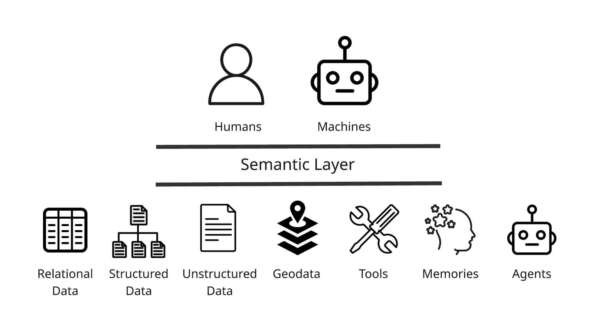

# RAG 已死？上下文工程和语义层在代理人工智能中的兴起

> 原文：[`towardsdatascience.com/beyond-rag/`](https://towardsdatascience.com/beyond-rag/)

## 引言

检索增强生成（RAG）可能是企业 AI 第一波浪潮所必需的，但它迅速演变成为更大的东西。在过去两年中，组织意识到仅仅使用向量搜索检索文本片段是不够的。上下文必须得到治理、可解释，并适应代理的目的。

本文探讨了这种演变是如何形成的，以及它对构建能够负责任推理的系统数据与 AI 领导者意味着什么。

你将得到一些关键问题的答案：

**知识图谱是如何改善 RAG 的？**

它们为企业数据提供结构和意义，将文档和数据库中的实体和关系链接起来，使检索对人类和机器都更加准确和可解释。

**语义层是如何帮助 LLMs 检索更好答案的？**

语义层标准化数据定义和治理政策，以便 AI 代理能够理解、检索和推理各种数据，以及 AI 工具、记忆和其他代理。

**在代理人工智能时代，RAG 是如何演变的？**

检索正成为更广泛推理循环中的一步（越来越多地被称为“上下文工程”），其中代理动态地在数据和工具之间编写、压缩、隔离和选择上下文。

**TL;DR**

<mdspan datatext="el1761022579113" class="mdspan-comment">检索增强生成（RAG）随着 ChatGPT 的发布和意识到上下文窗口的限制而崭露头角：你不能简单地将所有数据复制到聊天界面中。团队使用了 RAG 及其变体，如 GraphRAG（使用图数据库的 RAG），在查询时将额外的上下文带入提示。RAG 的流行很快暴露了其弱点：将错误、不相关或过多的信息放入上下文窗口实际上会降低而不是提高结果。为了克服这些限制，开发了新的技术，如重新排序器，但 RAG 并没有被设计成在新的代理世界中生存。

随着 AI 从单一提示转向自主代理，检索及其变体只是代理工具箱中的一个工具，与写作、压缩和隔离上下文并列。随着工作流程的复杂性和完成这些工作流程所需的信息量增长，检索将继续发展（尽管它可能被称为上下文工程、RAG 2.0 或代理检索）。检索（或上下文工程）的下一个时代将需要跨数据结构（不仅仅是关系型）进行元数据管理，以及工具、记忆和代理本身。我们将评估检索不仅基于准确性，还基于相关性、扎根性、来源、覆盖范围和时效性。知识图谱将是实现上下文感知、策略感知和语义扎根的检索的关键。

## RAG 的兴起

### 什么是 RAG？

*RAG，或称为检索增强生成，是一种检索相关信息以增强发送给大型语言模型（LLM）的提示，从而提高模型响应的技术。*

在 2022 年 11 月 ChatGPT 流行起来不久后，用户意识到 LLM 并不是（希望是）基于自己的数据进行训练的。为了弥合这一差距，团队开始开发在查询时检索相关数据以增强提示的方法——这种方法被称为检索增强生成（RAG）。这个术语来自 2020 年的一篇[Meta 论文](https://dl.acm.org/doi/abs/10.5555/3495724.3496517)，但 GPT 模型的流行使得这个术语和实践变得备受关注。

LangChain 和 LlamaIndex 等工具帮助开发者构建这些检索管道。[LangChain](https://www.pinecone.io/learn/series/langchain/langchain-intro)与 ChatGPT 几乎同时推出，作为一种将提示模板、LLM、代理和记忆等不同组件串联起来用于生成式 AI 应用的方式。[LlamaIndex](https://www.llamaindex.ai/blog/llamaindex-turns-1-f69dcdd45fe3)也是在同一时间推出的，旨在解决 GPT3 中有限的上下文窗口问题，从而实现 RAG。随着开发者进行实验，他们意识到向量数据库为 RAG 的检索部分提供了一种快速且可扩展的解决方案，向量数据库如 Weaviate、Pinecone 和 Chroma 成为 RAG 架构的标准部分。

### 什么是 GraphRAG？

*GraphRAG 是 RAG 的一种变体，其中用于检索的底层数据库是一个知识图谱或图数据库。*

RAG 的一种变体变得特别受欢迎：GraphRAG。这里的想法是，用于补充 LLM 提示的底层数据存储在知识图谱中。这使得模型能够对实体和关系进行推理，而不是对平面的文本块进行推理。2023 年初，研究人员开始发表[论文](https://arxiv.org/abs/2306.08302)，探讨知识图谱和 LLM 如何相互补充。2023 年底，data.world 的 Juan Sequeda、Dean Allemang 和 Bryon Jacob 发布了一篇[论文](https://arxiv.org/pdf/2311.07509)，展示了知识图谱如何提高 LLM 的准确性和可解释性。2024 年 7 月，微软开源了其[GraphRAG](https://www.microsoft.com/en-us/research/blog/graphrag-new-tool-for-complex-data-discovery-now-on-github/)框架，这使得基于图的检索对更广泛的开发者群体变得可访问，并巩固了 GraphRAG 在 RAG 中的可识别类别。

GraphRAG 的兴起重新点燃了对知识图谱的兴趣，就像 2012 年谷歌推出其知识图谱时一样。对结构化上下文和可解释检索的突然需求赋予了它们新的相关性。

在**2023-2025**年间，市场迅速做出反应：

+   **2023 年 1 月 23 日 – 数字科学** [**收购**](https://www.digital-science.com/blog/2023/01/digital-science-acquires-metaphacts/) **metaphacts**，该平台是 metaphactory 平台的创造者：“一个支持客户加速采用知识图谱并推动知识民主化的平台。”

+   **2023 年 2 月 7 日 – Progress** [**收购**](https://investors.progress.com/news-releases/news-release-details/progress-completes-acquisition-marklogic) **在 2023 年 2 月收购了 MarkLogic**。MarkLogic 是一个多模态 NoSQL 数据库，特别擅长管理图技术的核心数据格式 RDF 数据。

+   **2024 年 7 月 18 日 – 三星** [**收购**](https://news.samsung.com/global/samsung-electronics-announces-acquisition-of-oxford-semantic-technologies-uk-based-knowledge-graph-startup) **牛津语义技术公司**，该公司是 RDFox 图数据库的制造商，以在设备上实现推理和个人知识能力。

+   **2024 年 10 月 23 日 – Ontotext 和语义网络公司** [**合并**](https://www.ontotext.com/company/news/semantic-web-company-and-ontotext-merge-to-create-knowledge-graph-and-ai-powerhouse-graphwise/) **成立 Graphwise**，明确围绕 GraphRAG 定位。“这一公告对图行业具有重要意义，因为它将 Graphwise 提升为最全面的知识图谱 AI 组织，并确立了 Graph RAG 作为类别民主化发展的明确路径。”

+   **2025 年 5 月 7 日 – ServiceNow 宣布其** [**收购**](https://news.samsung.com/global/samsung-electronics-announces-acquisition-of-oxford-semantic-technologies-uk-based-knowledge-graph-startup) **data.world**，将基于图的数据库目录和语义层集成到其企业工作流平台中。

这些只是与知识图谱和相关语义技术相关的事件。如果我们将其扩展到包括更广泛的元数据管理和/或语义层，那么还有更多的交易，最值得注意的是 Salesforce 以 80 亿美元收购了元数据领导者 Informatica。

这些举措标志着明显的转变：知识图谱不再仅仅是元数据管理工具——它们已成为人工智能的语义骨干，更接近其作为专家系统的起源。GraphRAG 通过赋予其在检索、推理和可解释性中的关键角色，使知识图谱重新变得相关。

在我的日常工作作为一家[语义数据和 AI 公司](https://www.topquadrant.com/)的产品负责人时，我们致力于解决数据与其实际意义之间的差距，这些公司是世界上最大的公司之一。使他们的数据为 AI 准备就绪是一个混合过程，包括使其互操作性、可发现性和可用性，以便它可以上下文相关地提供信息，以产生安全、准确的结果。这对于管理指数级数据的大量、高度监管和复杂企业来说是一项不小的任务。

## RAG 的衰落和上下文工程的兴起

RAG 已经死亡了吗？不，但它已经进化了。RAG 的原始版本依赖于单次密集向量搜索，并将结果直接输入到 LLM 中。GraphRAG 在此基础上增加了某些图分析和实体以及/或关系过滤器。这些实现几乎立即遇到了关于相关性、可扩展性和噪声的限制。这些限制推动了 RAG 向前发展，进入了许多人熟知的新的进化阶段：[代理检索](https://www.llamaindex.ai/blog/rag-is-dead-long-live-agentic-retrieval)、[RAG 2.0](https://contextual.ai/research/introducing-rag2) 和最近最著名的 [上下文工程](https://rlancemartin.github.io/2025/06/23/context_engineering/)。原始的、天真的实现基本上已经死亡，但其后代正在蓬勃发展，而该术语本身仍然非常流行。

随着 2024 年的 RAG 炒作周期，不可避免地出现了幻灭。虽然现在可以在几分钟内构建一个 RAG 演示，许多人确实做到了，但要使您的应用程序在企业中扩展变得相当困难。“人们认为 RAG 很简单，因为现在您可以在单个文档上非常快速地构建一个漂亮的 RAG 演示，而且它会相当不错。但要让这实际上在真实世界数据中按比例工作，您有企业限制，这是一个非常不同的问题，”[道乌·基拉](https://open.spotify.com/episode/1x2LGmp2XxF3NnIOCZvnOV?si=dab35acc539f49b7) [Contextual AI](https://contextual.ai/) 和 2020 年 Meta 原始 RAG 论文的作者之一说道。

在扩展 RAG 应用时，检索时所需的数据量是一个问题。“我认为人们遇到的问题是将其扩展。在处理 100 份文档时很好，但现在我突然需要处理 10 万或 100 万份文档，”[Rajiv Shah](https://open.spotify.com/episode/3NBOA7jKCKxmHuvJsapWY1?si=dd9e9c54bceb4923)说。但随着 LLM 的成熟，它们的上下文窗口也在增长。上下文窗口的大小是 RAG 最初旨在解决的问题的原点，这引发了 RAG 是否仍然必要或有用的疑问。正如彭博公司的 Sebastian Gehrmann 博士[指出](https://open.spotify.com/episode/0LsaFcX2AE90Bpga1rziAN?si=eb6fe6c817a844e7)，“如果我能直接粘贴更多文档或更多上下文，我就不需要依赖那么多技巧来缩小上下文窗口。我只需依赖大型语言模型。不过，这里有一个权衡，”他补充说，“更长的上下文通常伴随着显著增加的延迟和成本。”

不仅将更多信息随意地填充到上下文窗口中会带来成本和延迟的风险，你还会降低性能。RAG（Retrieval-Augmented Generation）可以提高 LLM（Large Language Model）的响应质量，*前提是检索到的上下文与初始提示相关*。如果上下文不相关，你可能会得到更差的结果，这被称为“上下文中毒”或“上下文冲突”，其中误导性或矛盾的信息会污染推理过程。即使你检索到的上下文是相关的，过量的信息也可能使模型不堪重负，导致“上下文混淆”或“上下文干扰”。虽然术语各不相同，但多项研究表明，模型准确率往往会随着上下文大小的增加而下降。这一点在 2024 年 8 月的一篇[Databricks 论文](https://www.databricks.com/blog/long-context-rag-performance-llms)中得到了证实，并通过[Chroma](https://www.trychroma.com/)的[最近研究](https://research.trychroma.com/context-rot)得到了加强，他们将其称为“上下文退化”。Drew Breuning 的[文章](https://www.dbreunig.com/2025/06/22/how-contexts-fail-and-how-to-fix-them.html)将这些问题有益地归类为不同的“上下文失败”。

为了解决模型过载、提供错误或不相关信息的问题，重新排序器越来越受欢迎。正如 RelationalAI 的 Nikolaos Vasiloglou[所说](https://open.spotify.com/episode/3u9MbffwCelnRx6lWXzsPN?si=be84424c725f4f43)，“重新排序器在你引入事实之后，如何决定保留什么和丢弃什么，[这]有很大的影响。”流行的重新排序器包括 Cohere Rerank、Voyage AI Rerank、Jina Reranker 和 BGE Reranker。在今天的代理世界中，仅仅重新排序是不够的。新一代的 RAG 已经嵌入到代理中——这越来越被称为上下文工程。

### 什么是上下文工程？

*“在每个代理轨迹的每一步中，填充上下文窗口以恰好合适的信息的艺术和科学。”* [*Lance Martin*](https://rlancemartin.github.io/2025/06/23/context_engineering/) *来自 LangChain。*

我想要关注上下文工程的两个原因：RAG 2.0 和 Agentic Retrieval（分别对应上下文 AI 和 LlamaIndex）这两个术语的创造者已经开始使用上下文工程这个术语；并且根据谷歌搜索趋势，这是一个更加流行的术语。上下文工程也可以被视为提示工程的一种演变。提示工程是关于如何构建一个提示以获得你想要的结果，而上下文工程则是关于补充适当的上下文到这个提示中

RAG 在 2023 年获得了显著的关注，在 AI 的时间线中已经是很久以前了。从那时起，一切都已经变得“有代理性”。RAG 是基于假设提示将由人类生成，而响应将由人类阅读而创建的。有了代理，我们需要重新思考这是如何运作的。Lance Martin 将上下文工程分解为四个类别：**编写、压缩、隔离和选择**。代理需要**编写**（或持久化或记住）从一项任务到另一项任务的信息，就像人类一样。代理在从一项任务过渡到另一项任务时往往会拥有过多的上下文，需要以某种方式**压缩**或浓缩它，通常是通过总结或“修剪”。我们不是将所有上下文都提供给模型，而是可以**隔离**它或将其分散到代理之间，这样它们就可以[如 Anthropic 所描述的](https://www.anthropic.com/engineering/multi-agent-research-system)“同时探索问题的不同部分”。为了避免上下文腐烂和结果退化，这里的想法是不要给 LLM 足够的绳子来吊死自己。

代理在需要时必须使用他们的记忆或调用工具来检索额外的信息，即他们需要**选择**（检索）使用哪些上下文。这些工具之一可能是基于向量的检索，即传统的 RAG。但这只是代理工具箱中的一个工具。正如 AWS 的 Mark Brooker [所说](https://open.spotify.com/episode/4VWQKGvgoOYxeZJ8yclfix?si=4ae802515a5744e1)，“我确实期待我们将会看到一些关于向量的一些新奇的闪光点逐渐平息，我们进入一个拥有这个新工具的世界，但我们正在构建的大多数代理都在使用关系接口。他们使用这些文档接口。他们使用主键查找，使用次级索引查找。他们使用地理查找。所有这些在数据库领域存在了几十年的东西，现在我们也有了这一种，即通过语义意义查找，这非常令人兴奋、新颖且强大。”

处于前沿的人们已经在这样做。马丁引用了 Windsurf 的 Varun Mohan 的话[说](https://x.com/_mohansolo/status/1899630200780153274)，“我们 [...] 依赖于像 grep/文件搜索、基于知识图谱的检索以及 ... 一个重新排序步骤，其中[上下文]按照相关性排序。”

天真的 RAG 可能已经死亡，我们仍在试图为现代实现命名，但有一点似乎很确定：**检索**的未来是光明的。我们如何确保代理能够跨企业检索不同的数据集？从关系型数据到文档？答案越来越多地被称为语义层。

## 上下文工程需要语义层

### 什么是语义层？

*语义层是一种将元数据附加到所有数据的形式，使其既适合人类阅读也适合机器阅读，以便人们和计算机可以一致地理解、检索和推理它。*

来自关系型数据领域的人们最近推动在关系型数据上构建一个语义层。Snowflake 甚至创建了一个[开放语义交换](https://www.snowflake.com/en/blog/open-semantic-interchange-ai-standard/)（OSI）的倡议，试图标准化公司记录数据的方式，使其为人工智能做好准备。

但仅仅关注关系型数据是对语义的狭隘看法。那么非结构化数据和半结构化数据呢？这正是大型**语言**模型擅长的地方，也是所有 RAG 狂热开始的地方。如果真的有一个先例，可以在大量非结构化数据中检索相关搜索结果就好了 🤔。

Google 几十年来一直在使用结构化数据在整个互联网上检索相关信息。在这里，我所说的结构化数据是指机器可读的元数据，或者如 Google[描述的](https://developers.google.com/search/docs/appearance/structured-data/intro-structured-data)，“提供关于页面信息并分类页面内容的标准化格式。”图书管理员、信息科学家和 SEO 从业者通过知识组织、信息检索、结构化元数据和语义网技术来解决非结构化数据检索问题。他们描述、链接和管理非结构化数据的方法是今天公共和企业的搜索和发现系统的基础。语义层的未来将通过结合关系型数据管理的严谨性和图书馆科学及知识图谱的上下文丰富性，连接关系型和结构化数据世界。

图片由作者提供

## RAG 的未来

这里是我对 RAG 未来的预测。

**RAG 将继续进化成更智能的模式**。这意味着上下文的检索只是推理循环的一部分，这个循环还包括写作、压缩和隔离上下文。检索变成了一种迭代过程，而不是一次性的。Anthropic 的[模型上下文协议（MCP）](https://www.anthropic.com/news/model-context-protocol)将检索视为可以通过 MCP 提供给代理的工具。OpenAI 提供了[文件搜索](https://platform.openai.com/docs/guides/tools-file-search)作为代理可以调用的工具。LangChain 的代理框架 LangGraph 允许你使用节点和边模式（类似于图）来构建代理。在他们提供的[快速入门指南](https://langchain-ai.github.io/langgraph/tutorials/get-started/2-add-tools/)中，你可以看到检索（在这种情况下是网络搜索）只是代理可以用来完成其工作的工具之一。[这里](https://docs.langchain.com/oss/python/langgraph/workflows-agents)他们列出了检索是代理或工作流程可以采取的行动之一。Wikidata 也有一个[模型上下文协议（MCP）](https://www.wikidata.org/wiki/Wikidata:MCP)，它使用户能够直接与公共数据交互。

**检索将扩展并包括所有类型的数据（即多模态检索）：**关系型、内容型，然后是图像、音频、地理数据和视频。LlamaIndex 提供了四种[“检索模式”](https://developers.llamaindex.ai/python/cloud/llamacloud/retrieval/modes/)：块、通过元数据访问文件、通过内容访问文件、自动路由。他们还提供了[复合检索](https://developers.llamaindex.ai/python/cloud/llamacloud/retrieval/composite/)，允许你同时从多个来源检索。Snowflake 提供了[Corpus Search](https://docs.snowflake.com/en/user-guide/snowflake-cortex/cortex-search/cortex-search-overview)用于内容检索和[Corpus Analyst](https://docs.snowflake.com/en/user-guide/snowflake-cortex/cortex-analyst)用于关系型数据。LangChain 在关系型数据、图数据（Neo4j）、词汇和向量上提供了[检索器](https://python.langchain.com/docs/concepts/retrievers/)。

**检索将扩展到包括关于工具本身的元数据以及“记忆”**。Anthropic 的 MCP 标准化了代理调用工具的方式，即通过一个[工具注册表](https://modelcontextprotocol.io/docs/learn/architecture)来管理工具元数据。例如，[OpenAI](https://platform.openai.com/docs/guides/function-calling)、[LangChain](https://python.langchain.com/docs/concepts/tools/)、[LlamaIndex](https://developers.llamaindex.ai/python/framework/module_guides/deploying/agents/tools/)、[AWS Bedrock](https://docs.aws.amazon.com/bedrock/latest/userguide/agents-api-schema.html)、[Azure](https://learn.microsoft.com/en-us/azure/ai-foundry/agents/how-to/tools/overview)、[Snowflake](https://docs.snowflake.com/en/user-guide/snowflake-cortex/cortex-agents)和[Databricks](https://docs.databricks.com/aws/en/generative-ai/agent-framework/agent-tool)都具备管理工具的能力，其中一些直接通过 MCP，而另一些则通过它们自己的注册表。在记忆方面，[LlamaIndex](https://developers.llamaindex.ai/python/examples/memory/memory/)和[LangChain](https://docs.langchain.com/oss/python/concepts/memory)都将记忆视为可检索的数据（短期和长期），代理可以在工作流程中查询。像[Cognee](https://www.cognee.ai/)这样的项目通过专用的、可查询的代理记忆进一步推进了这一点。

**知识图谱将在关系型数据和无结构数据之间的元数据层中发挥关键作用，用更健壮的元数据管理框架取代目前使用的狭义语义层定义**。过去几年中我们所看到的行业整合以及上述描述，我认为，是市场日益认识到知识图谱和元数据管理在代理执行更复杂的企业数据任务时将变得至关重要的一个迹象。Gartner 2025 年 5 月的报告*“[将您的数据工程学科转向高效支持 AI 用例](https://www.gartner.com/en/documents/6509371)”*建议数据工程团队采用语义技术（如本体和知识图谱）来支持 AI 用例。知识图谱、元数据管理和参考数据管理在大型的生命科学和金融服务公司中已经无处不在，这主要是因为它们高度受监管，需要基于事实、有根据的数据来推动它们的 AI 计划。其他行业将开始采用经过验证的语义技术方法，随着用例的成熟和需要可解释的答案，这些方法将变得更加重要。

**上下文检索的评估指标将越来越受欢迎。** [Ragas](https://docs.ragas.io/en/stable/howtos/applications/evaluate-and-improve-rag/)、[Databricks](https://docs.databricks.com/aws/en/generative-ai/agent-evaluation/) Mosaic AI 代理评估和[TruLens](https://www.trulens.org/getting_started/core_concepts/rag_triad/)都提供了评估 RAG 的框架。[Evidently](https://www.evidentlyai.com/llm-guide/rag-evaluation)提供了开源库和关于 RAG 评估的指导材料。LangChain 的评估产品 LangSmith 有一个[模块](https://docs.langchain.com/langsmith/evaluate-rag-tutorial)专注于 RAG。重要的是，这些框架不仅评估了根据提示给出的答案的准确性，还评估了上下文的相关性和基础性（响应被上下文支持得有多好）。一些供应商正在构建指标来评估检索上下文的来源（引用和来源）、覆盖范围（我们检索了多少？）以及新鲜度或时效性。

**策略即代码的护栏**确保检索遵守访问控制、策略、法规和最佳实践。Snowflake 和 Databricks 已经启用了[行](https://docs.snowflake.com/en/user-guide/security-row-intro)级访问控制和[列](https://docs.databricks.com/aws/en/data-governance/unity-catalog/filters-and-masks/)[掩码](https://docs.snowflake.com/en/user-guide/security-column-ddm-use)。像[Open Policy Agent (OPA)](https://www.openpolicyagent.org/)和[Oso](https://www.osohq.com/)这样的策略引擎正在将访问控制嵌入到代理工作流程中。正如彭博公司的 Sebastian Gehrmann 博士[发现](https://open.spotify.com/episode/0LsaFcX2AE90Bpga1rziAN?si=eb6fe6c817a844e7)的那样，“RAG 并不一定更安全”，并且可能引入新的治理风险。我预计需要护栏的需求将增长，包括更复杂的治理规则（超越访问控制）、策略要求和最佳实践。

## 结论

RAG（检索即生成）从未是最终目标，它只是一个起点。随着我们进入代理时代，检索正在演变成为完整学科的一部分：上下文工程。代理不仅需要找到文档，还需要理解在推理的每一步中哪些数据、工具和记忆是相关的。这种理解需要一个语义层——一种理解、检索和治理整个企业的方式。知识图谱、本体和语义模型将提供这种连接性组织。下一代检索不仅关乎速度和准确性，还将关乎可解释性和信任。RAG 的未来不仅仅是检索，而是具有上下文感知、策略感知和语义基础的检索。

**关于作者：**Steve Hedden 是[TopQuadrant](https://www.topquadrant.com/)的产品管理负责人，他领导着 TopBraid EDG 平台的战略规划，这是一个知识图谱和元数据管理的平台。他的工作专注于通过本体、分类法和语义技术将企业数据治理与人工智能连接起来。Steve 经常撰写和发表关于知识图谱以及语义在人工智能系统演变中的角色的文章和演讲。
