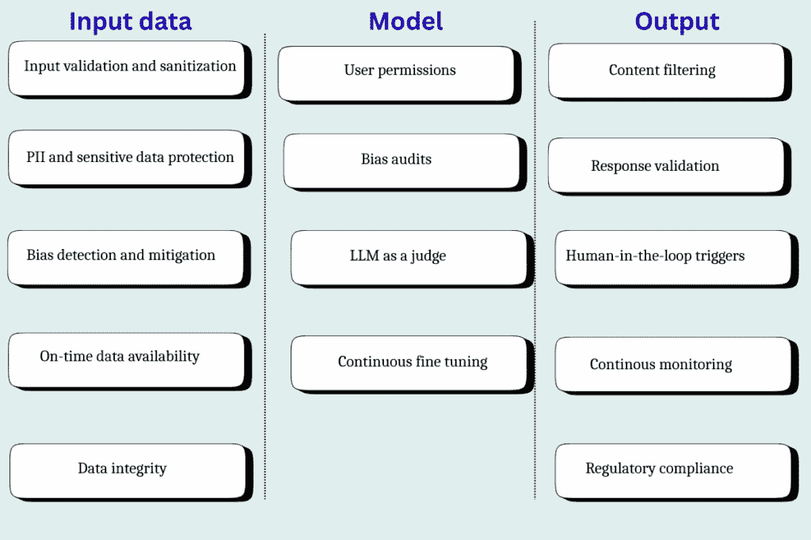

# 如何构建有效的技术护栏以用于人工智能应用

> [`towardsdatascience.com/how-to-build-effective-technical-guardrails-for-ai-applications/`](https://towardsdatascience.com/how-to-build-effective-technical-guardrails-for-ai-applications/)

<mdspan datatext="el1759772921968" class="mdspan-comment">每个人都喜欢自动化</mdspan>，只要有一点控制和安全保障。护栏为人工智能应用提供了这样的保障。但如何将这些护栏构建到应用中呢？

在应用编码开始之前，就已经建立了一些安全护栏。首先，有政府提供的法律护栏，例如[欧盟人工智能法案](https://www.europarl.europa.eu/topics/en/article/20230601STO93804/eu-ai-act-first-regulation-on-artificial-intelligence)，它强调了人工智能可接受和禁止的使用案例。然后，公司还设定了政策护栏。这些护栏表明公司认为哪些使用案例在人工智能应用方面是可接受的，无论是从安全还是伦理的角度来看。这两个护栏筛选了人工智能应用的使用案例。

在越过前两种类型的护栏后，一个可接受的使用案例达到工程团队。当工程团队实施这个使用案例时，他们会进一步整合技术护栏以确保数据的安全使用并保持应用的预期行为。我们将在文章中探讨这种第三种类型的护栏。

## 人工智能应用不同层的顶级技术护栏

护栏在输入、模型和输出层创建。每个层都有其独特的作用：

+   **数据层：** 数据层的护栏确保任何敏感的、有问题的或错误的数据不会进入系统。

+   **模型层：** 在这个层建立护栏是好的，以确保模型按预期工作。

+   **输出层：** 输出层护栏确保模型不会以高置信度提供错误的答案——这是人工智能系统常见的威胁。



图片由作者提供

### 1. 数据层

让我们来看看数据层必须具备的护栏：

#### (i) 输入验证和清理

在任何人工智能应用中首先要检查的是输入数据是否处于正确的格式，并且不包含任何不适当或冒犯性的语言。实际上，这相当容易做到，因为大多数数据库都提供了内置的 SQL 函数用于模式匹配。例如，如果一列应该是字母数字的，那么你可以使用简单的正则表达式模式来验证值是否处于预期的格式。同样，在像 Microsoft Azure 这样的云应用中，也有可用的函数来执行粗俗语言检查（不适当或冒犯性的语言）。但如果你数据库中没有这样的函数，你总是可以构建一个自定义函数。

```py
Data validation:
– The query below only takes entries from the customer table where the customer_email_id is in a valid format
SELECT * FROM customers WHERE REGEXP_LIKE(customer_email_id, '^[A-Z0-9._%+-]+@[A-Z0-9.-]+\\.[A-Z]{2,}$' );
—-----------------------------------------------------------------------------------------
Data sanitization:
– Creating a custom profanity_check function to detect offensive language
CREATE OR REPLACE FUNCTION offensive_language_check(INPUT VARCHAR)
RETURNS BOOLEAN
LANGUAGE SQL
AS $$
 SELECT REGEXP_LIKE(
   INPUT
   '\\b(abc|...)\\b', — list of offensive words separated by pipe
 );
$$;
– Using the custom profanity_check function to filter out comments with offensive language
SELECT user_comments from customer_feedback where offensive_language_check(user_comments)=0; 
```

#### (ii) 个人信息和敏感数据保护

在构建安全的 AI 应用时，另一个关键考虑因素是确保没有任何 PII 数据到达模型层。大多数数据工程师与跨职能团队合作，标记表中的所有 PII 列。还有可用的 PII 识别自动化工具，它们可以使用 ML 模型执行数据概要分析，并标记 PII 列。常见的 PII 列包括：姓名、电子邮件地址、电话号码、出生日期、社会安全号码（SSN）、护照号码、驾照号码和生物识别数据。间接 PII 的其他例子包括健康信息或财务信息。

防止此类数据进入系统的常见方法是通过应用去标识化机制。这可能只是简单地删除数据，或者使用复杂的掩码或哈希伪匿名化技术——这是模型无法解释的。

```py
– Hashing PII data of customers for data privacy 
SELECT SHA2(customer_name, 256) AS encrypted_customer_name, SHA2(customer_email, 256) AS encrypted_customer_email, … FROM customer_data 
```

#### (iii) 偏差检测和缓解

在数据进入模型层之前，另一个检查点是验证其是否准确且无偏差。一些常见的偏差类型包括：

+   **选择偏差**：输入数据不完整，并不能准确代表整个目标受众。

+   **幸存者偏差**：对于成功路径的数据更多，使得模型在处理失败场景时变得困难。

+   **种族或关联偏差**：由于过去的模式或偏见，数据偏向于某一性别或种族。

+   **测量或标签偏差**：数据由于标签错误或记录者的偏见而错误。

+   **罕见事件偏差**：输入数据缺少所有边缘情况，给出的是一个不完整的画面。

+   **时间偏差**：输入数据过时，不能准确反映当前世界。

虽然我也希望有一个简单的系统来检测这样的偏差，但实际上这是一项繁琐的工作。数据科学家必须坐下来，运行查询，并测试每个场景的数据以检测任何偏差。例如，如果你正在开发一个健康应用，并且没有足够的数据来支持特定的年龄组或 BMI，那么数据中存在偏差的可能性很高。

```py
– Identifying if any age group data or BMI group data is missing
select age_group, count(*) from users_data group by age_group;
select BMI, count(*) from users_data group by BMI; 
```

#### (iv) 数据及时可用性

另一个需要验证的方面是数据的及时性。对于模型有效运行，必须提供正确且相关的数据。一些模型可能需要实时数据，一些需要接近实时数据，而对于一些模型，批量数据就足够了。无论你的需求是什么，都需要一个系统来监控是否提供了最新的所需数据。

例如，如果品类经理每天午夜根据市场动态刷新产品的定价，那么你的模型必须具有在午夜后更新的最新数据。你可以建立系统来在数据过时时发出警报，或者你可以在数据编排层周围构建主动警报，监控 ETL 管道的及时性。

```py
–Creating an alert if today’s data is not available
SELECT CASE WHEN TO_DATE(last_updated_timestamp) != TO_DATE(CURRENT_TIMESTAMP()) THEN 'FRESH' ELSE 'STALE' END AS table_freshness_status FROM product_data; 
```

#### (v) 数据完整性

维护完整性对于模型准确性也非常关键。数据完整性指的是数据的准确性、完整性和可靠性。系统中任何过时、无关和错误的数据都可能导致输出混乱。例如，如果你正在构建面向客户的聊天机器人，那么它必须只能访问最新的公司政策文件。访问错误文件可能会导致模型将多个文件中的术语合并，并向客户提供完全不准确的信息。而且你仍然要对此承担法律责任。就像加拿大航空不得不为客户退款一样[Air Canada had to refund flight charges](https://www.bbc.com/travel/article/20240222-air-canada-chatbot-misinformation-what-travellers-should-know)。

没有直接的方法来验证完整性。这需要数据分析师和工程师亲自动手，验证文件/数据，并确保只有最新/相关的数据被发送到模型层。维护数据完整性也是控制幻觉的最佳方式，这样模型就不会产生垃圾输入，垃圾输出。

### 2. 模型层

在数据层之后，以下检查点可以构建到模型层：

#### (i) 基于角色的用户权限

保护 AI 模型层不受未经授权的更改，这些更改可能会在系统中引入错误或偏差，这是非常重要的。同时，也需要防止任何数据泄露。你必须控制谁有权访问这一层。为此，可以采用基于角色的访问控制（RBAC）的标准化方法，只有授权角色的员工，如机器学习工程师、数据科学家或数据工程师，才能访问模型层。

例如，DevOps 工程师可以拥有只读访问权限，因为他们不应该更改模型逻辑。ML 工程师可以拥有读写权限。建立基于角色的访问控制（RBAC）是维护模型完整性的重要安全实践。

#### (ii) 偏差审计

偏差处理是一个持续的过程。它可能在系统的后期出现，即使你在输入层进行了所有必要的检查。事实上，一些偏差，尤其是确认偏差，往往在模型层形成。这是一种当模型完全过拟合到数据中，没有留下任何细微差别空间时的偏差。在出现任何过拟合的情况下，模型需要轻微的校准。样条校准是校准模型的一种流行方法。它对数据进行轻微调整，以确保所有点都连接起来。

```py
import numpy as np
import scipy.interpolate as interpolate
import matplotlib.pyplot as plt
from sklearn.metrics import brier_score_loss

# High level Steps:
#Define input (x) and output (y) data for spline fitting
#Set B-Spline parameters: degree & number of knots
#Use the function splrep to compute the B-Spline representation
#Evaluate the spline over a range of x to generate a smooth curve.
#Plot original data and spline curve for visual comparison.
#Calculate the Brier score to assess prediction accuracy.
#Use eval_spline_calibration to evaluate the spline on new x values.
#As a final step, we need to analyze the plot by:
# Check for fit quality (good fit, overfitting, underfitting), validating consistency with expected trends, and interpreting the Brier score for model performance.

######## Sample Code for the steps above ########

# Sample data: Adjust with your actual data points
x_data = np.array([...])  # Input x values, replace '...' with actual data
y_data = np.array([...])  # Corresponding output y values, replace '...' with actual data

# Fit a B-Spline to the data
k = 3  # Degree of the spline, typically cubic spline (cubic is commonly used, hence k=3)
num_knots = 10  # Number of knots for spline interpolation, adjust based on your data complexity
knots = np.linspace(x_data.min(), x_data.max(), num_knots)  # Equally spaced knot vector over data range

# Compute the spline representation
# The function 'splrep' computes the B-spline representation of a 1-D curve
tck = interpolate.splrep(x_data, y_data, k=k, t=knots[1:-1])

# Evaluate the spline at the desired points
x_spline = np.linspace(x_data.min(), x_data.max(), 100)  # Generate x values for smooth spline curve
y_spline = interpolate.splev(x_spline, tck)  # Evaluate spline at x_spline points

# Plot the results
plt.figure(figsize=(8, 4))
plt.plot(x_data, y_data, 'o', label='Data Points')  # Plot original data points
plt.plot(x_spline, y_spline, '-', label='B-Spline Calibration')  # Plot spline curve
plt.xlabel('x') 
plt.ylabel('y')
plt.title('Spline Calibration') 
plt.legend() 
plt.show()  

# Calculate Brier score for comparison
# The Brier score measures the accuracy of probabilistic predictions
y_pred = interpolate.splev(x_data, tck)  # Evaluate spline at original data points
brier_score = brier_score_loss(y_data, y_pred)  # Calculate Brier score between original and predicted data
print("Brier Score:", brier_score) 

# Placeholder for calibration function
# This function allows for the evaluation of the spline at arbitrary x values
def eval_spline_calibration(x_val):
   return interpolate.splev(x_val, tck)  # Return the evaluated spline for input x_val 
```

#### (iii) LLM 作为裁判

LLM（大型语言模型）作为裁判是一种验证模型的有意思的方法，其中使用一个 LLM 来评判另一个 LLM 的输出。它取代了人工干预，并支持大规模实施响应验证。

要实现 LLM 作为裁判，你需要构建一个评估输出的提示。提示结果必须是可衡量的标准，例如分数或排名。

```py
A sample prompt for reference:
Assign a helpfulness score for the response based on the company’s policies, where 1 is the highest score and 5 is the lowest 
```

这种提示输出可以用来在输出意外时触发监控框架。

**提示**：最近技术进步的最好部分是，你甚至不需要从头开始构建 LLM。有即插即用的解决方案可用，如 Meta Lama，你可以下载并在本地运行。

#### (iv) 持续微调

对于任何模型的长期成功，持续的微调是必不可少的。这是模型为了提高准确性而定期进行精炼的地方。实现这一目标的一种简单方法是通过引入带有人类反馈的强化学习，其中人类审阅者对模型的输出进行评分，模型从中学习。但这个过程资源密集。要实现规模化，你需要自动化。

一种常见的微调方法是低秩适应（LoRA）。在这种技术中，你创建一个独立的可训练层，该层具有优化逻辑。你可以在不修改基础模型的情况下提高输出准确性。例如，你正在为流媒体平台构建一个推荐系统，而当前的推荐并没有导致点击。在 LoRA 层中，你构建一个单独的逻辑，将具有相似观看习惯的观众群组在一起，并使用群组数据来做出推荐。这个层可以用来做出推荐，直到帮助实现所需的准确性。

### 3. 输出层

这些是在输出层进行的最终安全检查：

#### (i) 语言、粗话、关键词过滤

与输入层类似，输出层也会进行过滤，以检测任何冒犯性语言。这种双重检查确保没有不良的用户体验。

#### (ii) 响应验证

通过创建一个简单的基于规则的框架，也可以对模型响应进行一些基本检查。这些检查可能包括简单的验证，例如验证输出格式、可接受值等。这些检查可以在 Python 和 SQL 中轻松完成。

```py
– Simple rule-based checking to flag invalid response
select
CASE
WHEN <condition_1> THEN ‘INVALID’
WHEN <condition_2> THEN ‘INVALID’
ELSE ‘VALID’  END as OUTPUT_STATUS
from
output_table; 
```

#### (iii) 置信度阈值和人工介入触发

没有 AI 模型是完美的，只要在需要的地方涉及人类，那就没问题。有一些 AI 工具可以在其中硬编码何时使用 AI 以及何时启动人工介入触发。通过引入置信度阈值，也可以自动化这一操作。每当模型对输出表现出低置信度时，将请求重定向到人类以获得准确的答案。

```py
import numpy as np
import scipy.interpolate as interpolate
# One option to generate a confidence score is using the B-spline or its derivatives for the input data
# scipy has interpolate.splev function takes two main inputs:
# 1\. x: The x values at which you want to evaluate the spline 
# 2\. tck: The tuple (t, c, k) representing the knots, coefficients, and degree of the spline. This can be generated using make_splrep (or the older function splrep) or manually constructed
# Generate the confidence scores and remove the values outside 0 and 1 if present
predicted_probs = np.clip(interpolate.splev(input_data, tck), 0, 1)

# Zip the score with input data
confidence_results = list(zip(input_data, predicted_probs))

# Come up with a threshold and identify all inputs that do not meet the threshold, and use it for manual verification
threshold = 0.5
filtered_results = [(i, score) for i, score in confidence_results if score <= threshold]

# Records that can be routed for manual/human verification
for i, score in filtered_results:
   print(f"x: {i}, Confidence Score: {score}") 
```

#### (iv) 持续监控和警报

就像任何软件应用程序一样，AI 模型也需要一个日志和警报框架，可以检测预期的（和意外的）错误。有了这个安全栏，你会有每个动作的详细日志文件，以及当事情出错时的自动警报。

#### (v) 合规性

许多合规处理发生在输出层之前。法律上可接受的使用案例在初始需求收集阶段就已经确定。任何敏感数据都在输入层进行哈希处理。除此之外，如果有任何监管要求，例如对任何数据进行加密，这可以通过简单的基于规则的框架在输出层完成。

## 平衡 AI 与人类专业知识

边界条件帮助你充分利用 AI 自动化，同时仍然对过程保持一定的控制。我已经涵盖了你在模型的不同层级可能需要设置的常见类型的边界条件。

除此之外，如果你遇到任何可能影响模型预期输出的因素，你也可以为该因素设置一个边界条件。本文不是固定公式，而是识别（并修复）常见障碍的指南。最后，你的 AI 应用必须完成其预期任务：自动化繁琐的工作而不会带来任何烦恼。边界条件有助于实现这一点。
