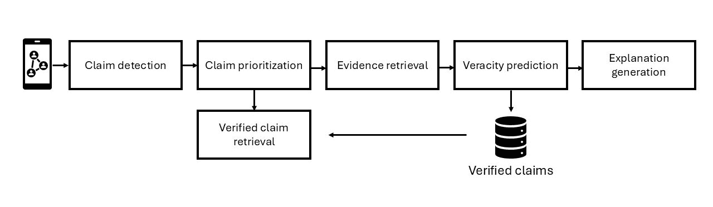
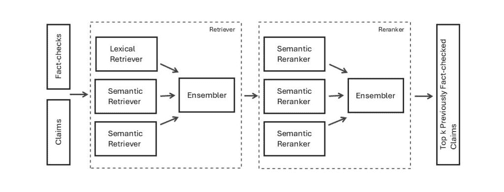

# 构建事实核查系统：在它们传播之前捕捉重复的虚假声明

> [`towardsdatascience.com/building-fact-checking-systems-catching-repeating-false-claims-before-they-spread/`](https://towardsdatascience.com/building-fact-checking-systems-catching-repeating-false-claims-before-they-spread/)

## <mdspan datatext="el1758911321332" class="mdspan-comment">从乌托邦到现实</mdspan>：为什么我们需要自动化事实核查

与传统媒体相比，传统媒体在发表文章之前会进行编辑和验证，而社交媒体则完全改变了这一方法。突然之间，每个人都可以发声。帖子可以瞬间分享，使人们能够接触到来自世界各地的想法和观点。至少这是梦想。

最初的想法是保护言论自由，给个人提供表达意见而不受审查的机会，但这也带来了一定的权衡。信息核查非常少。这使得检测准确性和错误性比以往任何时候都更困难。

另一个挑战是虚假声明很少只出现一次。它们经常在不同的平台上被重新分享，通常在措辞、格式、长度甚至语言上被修改，这使得检测和验证变得更加困难。随着这些变化在平台上传播，它们可能对读者来说看起来很熟悉，因此可信。

开放、无审查和可靠信息的空间原始想法遇到了一个悖论。正是为了赋予人们权力而开放的空间也使得错误信息传播变得容易。这正是事实核查系统发挥作用的地方。

## 事实核查管道的发展

传统上，事实核查是一个手动过程，依赖于专家（记者、研究人员或事实核查组织）通过引用官方文件或专家意见来验证声明。这种方法非常可靠和彻底，但也很耗时。因此，这种延迟的结果是虚假叙述有更多的时间传播、塑造公众舆论和进行进一步的操作。

这就是自动化介入的地方。研究人员已经开发出事实核查管道，它们的行为类似于人类事实核查专家，但可以扩展到大量在线内容。事实核查管道遵循一个结构化的流程，通常包括以下五个步骤：

1.  声明检测 - 找出具有事实含义的陈述。

1.  声明优先级 - 根据传播速度、潜在危害或公众兴趣进行排序，优先处理最具影响力的案例。

1.  证据检索 - 收集支持材料并提供评估其背景。

1.  真实性预测 - 判断声明是真实的、虚假的还是介于两者之间。

1.  解释生成 - 产生读者可以理解的正当理由。

除了五个步骤之外，许多管道还增加了一个第六步：**检索先前已核查的主张（PFCR）**。而不是从头开始重做工作，系统会检查一个主张，即使经过重新表述，是否已经被验证。如果是的话，它将与事实核查和主张的裁决相链接。如果不是，管道将继续进行证据检索。

这个快捷方式节省了精力，加快了验证速度，并在多语言环境中带来更多好处，因为它允许在一个语言中进行事实核查以支持另一个语言的验证。

这个组件有多个名称；*已验证主张检索*、*主张匹配*或*先前已核查主张检索（PFCR）*。无论名称如何，想法都是相同的：重用现有知识以更快、更有效地对抗虚假信息。

图 1：事实核查管道（作者创建）

## 设计 PFCR 组件（检索管道）

在其核心，先前已核查的主张检索（PFCR）是一个**信息检索任务**：给定社交媒体帖子中的一个主张，我们希望在已经核查（验证）的大量主张集合中找到最相关的匹配。如果存在匹配，我们可以立即将其链接到来源和裁决，因此不需要从头开始进行验证！

大多数现代信息检索系统使用**检索器-重新排序器架构**。检索器作为第一层过滤器，从语料库中返回一组更大的候选文档（前 *k*）。然后，重新排序器使用更深、计算量更大的模型对这些候选者进行细化排名。这种两阶段设计平衡了速度（检索器）和准确性（重新排序器）。

用于**检索**的模型可以分为两类：

+   **词汇模型**：当有强烈的词语重叠时，快速、可解释且有效。但当想法以不同的方式表达时（同义词、释义、翻译），它们会面临挑战。

+   **语义模型**：捕捉意义而不是表面词语，这使得它们非常适合 PFCR。它们会认识到，例如，“地球围绕太阳运行”和“我们的星球围绕着太阳系中心的恒星旋转”描述的是同一个事实，尽管措辞完全不同。

一旦检索到候选者，**重新排序阶段**应用更强大的模型（通常是交叉编码器）来仔细重新评分顶级结果，确保最相关的核查排名更高。由于重新排序器运行成本更高，它们只应用于更小的候选者池（例如，前 100 名）。

一起，检索器-重新排序管道提供了**覆盖范围**（通过识别更广泛的可能匹配）和**精确度**（通过将最相似的排名更高）。对于 PFCR 来说，这种平衡至关重要，因为它实现了一种快速且可扩展的方式来检测重复的主张，但同时又具有高精度，以便用户可以信任他们阅读的信息。

## 构建集成

检索器-重排器管道已经提供了坚实的性能。但在评估模型和运行实验的过程中，一件事情变得很清楚：**没有哪个模型单独就足够好**。

词汇模型，如 BM25，擅长精确的关键词匹配，但一旦断言被以不同的方式表达，它们就会失败。这就是语义模型介入的地方。它们在处理释义、翻译或跨语言场景时没有问题，但有时在措辞最为重要的直接匹配上会感到困难。而且，并非所有的语义模型都相同，每个模型都有自己的细分市场：一些在英语中表现更好，其他在多语言环境中表现更好，还有一些用于捕捉细微的上下文细微差别。换句话说，正如错误信息会以无数种变化形式突变和重新出现一样，语义检索模型也会根据它们的训练方式带来不同的优势。如果错误信息是可适应的，那么检索系统也必须是可适应的。

正是在这里，集成的想法出现了。不是只押注一个“最好的”模型，而是将多个模型在集成中的预测结合起来，以便它们可以协作和互相补充。为什么不让他们作为一个团队一起工作呢？

在进一步探讨集成设计之前，我将简要解释选择检索器时的决策过程。

#### 建立基准（词汇模型）

BM25 是最有效和最广泛使用的**词汇**检索模型之一，常被用作现代信息检索研究中的基准。在评估基于嵌入（语义）模型之前，我很好奇想看看 BM25 能表现得多好（或多坏）。结果证明，它并不差！

> ***技术细节：*** BM25 是一个基于 TF-IDF 的排名函数。它通过引入饱和函数和文档长度归一化来改进 TF-IDF。与词频评分不同，BM25 考虑了术语的重复出现，防止长文档被不公平地偏爱。它还包括一个参数（b），该参数控制分配给词频和文档长度的权重。

#### 语义模型

作为语义（基于嵌入）模型的起点，我参考了 HuggingFace 的[大规模文本嵌入基准（MTEB）](https://huggingface.co/spaces/mteb/leaderboard)并评估了领先模型，同时考虑到 GPU 资源限制。

突出的两个模型是 E5 ([intfloat/multilingual-e5-large-instruct](https://huggingface.co/intfloat/multilingual-e5-large-instruct)) 和 BGE ([BAAI/bge-m3](https://huggingface.co/BAAI/bge-m3))。在检索前 100 个候选者时，它们都取得了很好的结果，因此我选择了它们进行进一步的调整和与 BM25 的集成。

#### 集成设计

在设置好检索器之后，问题变成了：我们如何将它们结合起来？我测试了不同的**聚合策略**，包括多数投票、指数衰减权重和互反排名融合（RRF）。

RRF 表现最佳，因为它不仅平均分数，而且奖励那些在不同排名中持续出现高分的文档，无论是由哪个模型产生的。这样，集成倾向于那些多个模型“达成共识”的论断，同时仍然允许每个模型独立贡献。

我还尝试了**第一阶段检索的候选人数**（通常称为超参数*k*）。想法很简单：如果你只拉入一个非常小的候选集，你可能会完全错过相关的核查事实。另一方面，如果你选择太多，重新排序器必须通过大量的噪声，这增加了计算成本，但实际上并没有提高准确性。

通过实验，我发现随着*k*的增加，性能最初有所提高，因为集成有更多机会找到正确的核查事实。但达到某个点后，增加更多候选者就不再有帮助了。重新排序器已经可以看到足够的相关核查事实来做出良好的决策，额外的那些大多是无关的。在实践中，这意味着找到一个“甜点”，候选池足够大以确保覆盖范围，但又不会降低重新排序器的有效性。

作为最后一步，我调整了**每个模型的权重**。减少 BM25 的影响，同时增加语义检索器的权重，提高了性能。换句话说，BM25 是有用的，但主要的工作是由 E5 和 BGE 完成的。

简要概述 PFCR 组件；该流程包括检索和重新排序，其中对于检索我们可以使用词汇或语义模型，而对于重新排序，我们会使用语义模型。此外，我们注意到在集成中使用多个模型可以提高检索/重新排序的性能。好的，那么我们如何在集成中整合？

## 集成适合在哪里？

集成不仅限于流程的某一部分。我在检索和重新排序中都应用了它。

+   **检索阶段**→ 我合并了由 BM25、E5 和 BGE 产生的候选列表。这样，系统不依赖于单个模型对可能相关内容的“看法”，而是将它们的观点汇总成一个更强的起始集。

+   **重新排序阶段**→ 我随后结合了多个重新排序器的排名（再次提到 MTEB 和我的 GPU 限制）。由于每个重新排序器捕捉到相似性的细微差别略有不同，混合它们有助于以更高的准确性细化核查事实的最终排序。

在**检索阶段**，集成使候选池更广泛，确保更少的有关论断被遗漏（*提高召回率*）。而**重新排序阶段**则缩小了焦点，将最相关的核查事实推到顶部（*提高精确度*）。

图 2：检索器-重新排序器集成流程（作者创作）

## 整合所有内容（TL;DR）

简而言之，预期的开放信息共享的数字乌托邦如果没有验证，将无法实现，甚至可能产生相反的效果——成为错误信息的渠道。

那是推动自动化事实核查管道发展的动力，这使我们更接近最初的承诺。它们使得快速且大规模地验证信息变得更加容易，因此当新的虚假声明以新的形式出现时，它们可以立即被发现并得到处理，有助于保持数字世界的准确性和信任。

吸取的教训很简单：**多样性是关键**。正如错误信息通过多种形式传播一样，一个有弹性的事实核查系统得益于多个视角的协作。使用集成方法，管道变得更加稳健，更加适应性强，最终能够实现一个值得信赖的数字空间。

### 对于好奇的心灵

如果你对深入了解此管道背后的检索和集成策略感兴趣，可以查看我的完整论文[这里](https://aclanthology.org/2025.semeval-1.153/)。它涉及模型选择、实验和系统内的详细评估指标。

* * *

## 参考文献

Scott A. Hale, Adriano Belisario, Ahmed Mostafa, 和 Chico Camargo. 2024\. Analyzing Misinformation Claims During the 2022 Brazilian General Election on WhatsApp, Twitter, and Kwai. ArXiv:2401.02395.

Rrubaa Panchendrarajan 和 Arkaitz Zubiaga. 2024\. Claim detection for automated fact-checking: A survey on monolingual, multilingual and cross-lingual research. Natural Language Processing Journal, 7:100066.

Matúš Pikuliak, Ivan Srba, Robert Moro, Timo Hromadka, Timotej Smolen, Martin Melišek, Ivan ˇ Vykopal, Jakub Simko, Juraj Podroužek, 和 Maria Bielikova. 2023\. Multilingual Previously FactChecked Claim Retrieval. In Proceedings of the 2023 Conference on Empirical Methods in Natural Language Processing, pages 16477–16500, Singapore. Association for Computational Linguistics.

Preslav Nakov, David Corney, Maram Hasanain, Firoj Alam, Tamer Elsayed, Alberto Barrón-Cedeño, Paolo Papotti, Shaden Shaar, 和 Giovanni Da San Martino. 2021\. Automated Fact-Checking for Assisting Human Fact-Checkers. ArXiv:2103.07769.

Oana Balalau, Pablo Bertaud-Velten, Younes El Fraihi, Garima Gaur, Oana Goga, Samuel Guimaraes, Ioana Manolescu, 和 Brahim Saadi. 2024\. FactCheckBureau: Build Your Own Fact-Check Analysis Pipeline. In Proceedings of the 33rd ACM International Conference on Information and Knowledge Management, CIKM ‘24, pages 5185–5189, New York, NY, USA. Association for Computing Machinery

Alberto Barrón-Cedeño, Tamer Elsayed, Preslav Nakov, Giovanni Da San Martino, Maram Hasanain, Reem Suwaileh, Fatima Haouari, Nikolay Babulkov, Bayan Hamdan, Alex Nikolov, Shaden Shaar, and Zien Sheikh Ali. 2020\. 概述 CheckThat! 2020：社交媒体中声明的自动识别和验证. 在实验信息检索与多语言、多模态和交互会议论文集中，第 215–236 页，Cham. Springer 国际出版社。

Ashkan Kazemi, Kiran Garimella, Devin Gaffney, 和 Scott Hale. 2021a. 超越英语的声明匹配以扩展全球事实核查。在第 59 届计算语言学年会和第 11 届国际自然语言处理联合会议（第一卷：长篇论文）论文集中，第 4504–4517 页，在线。计算语言学协会。

Shaden Shaar, Nikolay Babulkov, Giovanni Da San Martino, 和 Preslav Nakov. 2020\. 这是一条已知的谎言：检测先前已核查的声明。在第 58 届计算语言学年会论文集中，第 3607–3618 页，在线。计算语言学协会。

Alberto Barrón-Cedeño, Tamer Elsayed, Preslav Nakov, Giovanni Da San Martino, Maram Hasanain, Reem Suwaileh, Fatima Haouari, Nikolay Babulkov, Bayan Hamdan, Alex Nikolov, Shaden Shaar, 和 Zien Sheikh Ali. 2020\. checkthat! 2020 概述：社交媒体中声明的自动识别和验证. 在实验信息检索与多语言、多模态和交互：第 11 届 CLEF 协会国际会议，CLEF 2020，希腊塞萨洛尼基，2020 年 9 月 22–25 日，会议论文集，第 215–236 页，柏林，海德堡. Springer-Verlag。

Gordon V. Cormack, Charles L A Clarke, 和 Stefan Buettcher. 2009\. 互反排名融合优于 Condorcet 和个体排名学习方法. 在第 32 届国际 ACM SIGIR 信息检索研究与发展会议论文集中，SIGIR '09，第 758–759 页，纽约，纽约，美国. 计算机协会。

Iva Pezo, Allan Hanbury, 和 Moritz Staudinger. 2025\. ipezoTU 在 SemEval-2025 任务 7：多语言事实核查的混合集成检索. 在 *第 19 届国际语义评估研讨会（SemEval-2025）论文集中*，第 1159–1167 页，维也纳，奥地利. 计算语言学协会。
