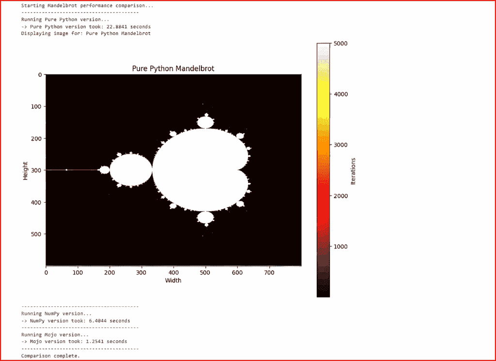
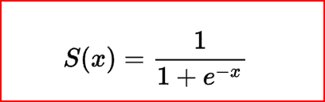

# Python Can Now Call Mojo

> [原文链接](https://towardsdatascience.com/python-can-now-call-mojo/)

<mdspan datatext="el1758301824242" class="mdspan-comment">作为数据科学家、机器学习工程师和软件开发者，从我们的代码库中优化每一丝性能可能是一个重要的考虑因素。如果你是 Python 用户，你可能会意识到它在性能方面的某些不足。Python 被认为是一种较慢的语言，你可能也听说过，造成这种情况的许多原因都归因于其全局解释器锁（GIL）机制。

这就是它的本质，但我们能做些什么呢？在 Python 中编码时，我们可以通过几种方式改善这个问题，尤其是如果你使用的是相对较新的 Python 版本。

+   Python 的最新版本有一种运行代码而不使用全局解释器锁（GIL）的方法。

+   我们可以利用高性能的第三方库，如 NumPy，来进行数值计算。

+   现在语言中内置了许多并行和并发处理的方法。

我们还可以使用的一种方法是，在 Python 中调用其他高性能语言，以处理代码中的时间关键部分。这就是本文将要介绍的内容，我将向您展示如何从 Python 中调用**Mojo**代码。

你之前听说过 Mojo 吗？如果没有，这里有一个快速的历史课。

Mojo 是由 Modular Inc**.**（一家由 LLVM 和 Swift 的创始人、编译器编写传奇人物**Chris Lattner**和前 Google TPUs 负责人**Tim Davis**共同创立的 AI 基础设施公司）开发的一种相对较新的系统级语言，并于**2023 年 5 月**首次公开亮相。

它起源于一个简单的痛点，即我们之前讨论的 Python 性能不足。Mojo 通过将 Python 语法的超集嫁接到基于 LLVM/MLIR 的编译器管道上，直接解决这个问题，该管道提供零成本抽象、静态类型、基于所有权的内存管理、自动向量化以及为 CPU 和 GPU 加速器无缝生成代码。

在其发布时的早期基准测试中，内核密集型工作负载比纯 Python 快**35,000 倍**，证明了 Mojo 可以匹配甚至超过 C/CUDA 的原始吞吐量，同时让开发者保持在熟悉的“Pythonic”领域。

然而，总会有一个障碍，那就是人们不愿意完全转向一种新的语言。我也是这些人之一，所以我很高兴地读到，就在几周前，现在可以直接从 Python 中调用 Mojo 代码。

这是否意味着我们得到了两全其美的结果：Python 的简单性和 Mojo 的性能？

为了测试这些说法，我们将使用纯 Python 编写一些代码。然后，对于每个版本，我们还将使用 NumPy 编写一个版本，最后，我们将编写一个将部分计算卸载到 Mojo 模块的 Python 版本。最终，我们将比较各种运行时间。

我们会看到显著的性能提升吗？请继续阅读以了解。

## 设置开发环境

我将使用 WSL2 Ubuntu for Windows 进行我的开发。最佳实践是为每个正在工作的项目设置一个新的开发环境。我通常使用 conda 来做这件事，但似乎每个人和他们的祖母都在转向使用新的**uv**包管理器，所以我打算试一试。安装 uv 有几种方法。

```py
$ curl -LsSf https://astral.sh/uv/install.sh | sh

or...

$ pip install uv
```

接下来，初始化一个项目。

```py
$ uv init mojo-test 
$ cd mojo-test
$ uv venv
$ source .venv/bin/activate

Initialized project `mojo-test` at `/home/tom/projects/mojo-test`
(mojo-test) $ cd mojo-test
(mojo-test) $ ls -al
total 28
drwxr-xr-x  3 tom tom 4096 Jun 27 09:20 .
drwxr-xr-x 15 tom tom 4096 Jun 27 09:20 ..
drwxr-xr-x  7 tom tom 4096 Jun 27 09:20 .git
-rw-r--r--  1 tom tom  109 Jun 27 09:20 .gitignore
-rw-r--r--  1 tom tom    5 Jun 27 09:20 .python-version
-rw-r--r--  1 tom tom    0 Jun 27 09:20 README.md
-rw-r--r--  1 tom tom   87 Jun 27 09:20 main.py
-rw-r--r--  1 tom tom  155 Jun 27 09:20 pyproject.toml
```

现在，添加我们需要的任何外部库

```py
(mojo-test) $ uv pip install modular numpy matplotlib
```

## 如何从 Python 调用 Mojo？

假设我们有一个以下简单的 Mojo 函数，它接受一个 Python 变量作为参数并将其值增加二。例如，

```py
# mojo_func.mojo
#
fn add_two(py_obj: PythonObject) raises -> Python
    var n = Int(py_obj)
    return n + 2
```

当 Python 尝试加载 add_two 时，它会寻找一个名为**PyInit_add_two()**的函数。在 PyInit_add_two()中，我们必须使用**PythonModuleBuilder**库声明所有可以从 Python 调用的 Mojo 函数和类型。因此，实际上，我们最终的 Mojo 代码将类似于以下内容。

```py
from python import PythonObject
from python.bindings import PythonModuleBuilder
from os import abort

@export
fn PyInit_mojo_module() -> PythonObject:
    try:
        var m = PythonModuleBuilder("mojo_func")
        m.def_functionadd_two
        return m.finalize()
    except e:
        return abortPythonObject)

fn add_two(py_obj: PythonObject) raises -> PythonObject:
    var n = Int(py_obj)
    n + 2
```

Python 代码需要额外的样板代码才能正确运行，如下所示。

```py
import max.mojo.importer
import sys

sys.path.insert(0, "")

import mojo_func

print(mojo_func.add_two(5))

# SHould print 7
```

## 代码示例

对于我的每个例子，我将展示三种不同的代码版本。一个将是纯 Python 编写的，一个将利用 NumPy 来加速，另一个将适当地替换 Mojo 的调用。

> 提醒您，从 Python 调用 Mojo 代码还处于早期开发阶段。您可以期待 API 和用户体验将发生重大变化

### 示例 1—计算曼德布罗特集

在我们的第一个例子中，我们将计算并显示一个曼德布罗特集。这相当计算量大，而且正如我们将看到的，纯 Python 版本需要相当长的时间才能完成。

这个例子总共需要四个文件。

1/ mandelbrot_pure_py.py

```py
# mandelbrot_pure_py.py
def compute(width, height, max_iters):
    """Generates a Mandelbrot set image using pure Python."""
    image = [[0] * width for _ in range(height)]
    for row in range(height):
        for col in range(width):
            c = complex(-2.0 + 3.0 * col / width, -1.5 + 3.0 * row / height)
            z = 0
            n = 0
            while abs(z) <= 2 and n < max_iters:
                z = z*z + c
                n += 1
            image[row][col] = n
    return image
```

2/ mandelbrot_numpy.py

```py
# mandelbrot_numpy.py

import numpy as np

def compute(width, height, max_iters):
    """Generates a Mandelbrot set using NumPy for vectorized computation."""
    x = np.linspace(-2.0, 1.0, width)
    y = np.linspace(-1.5, 1.5, height)
    c = x[:, np.newaxis] + 1j * y[np.newaxis, :]
    z = np.zeros_like(c, dtype=np.complex128)
    image = np.zeros(c.shape, dtype=int)

    for n in range(max_iters):
        not_diverged = np.abs(z) <= 2
        image[not_diverged] = n
        z[not_diverged] = z[not_diverged]**2 + c[not_diverged]

    image[np.abs(z) <= 2] = max_iters
    return image.T
```

3/ mandelbrot_mojo.mojo

```py
# mandelbrot_mojo.mojo 

from python import PythonObject, Python
from python.bindings import PythonModuleBuilder
from os import abort
from complex import ComplexFloat64

# This is the core logic that will run fast in Mojo
fn compute_mandel_pixel(c: ComplexFloat64, max_iters: Int) -> Int:
    var z = ComplexFloat64(0, 0)
    var n: Int = 0
    while n < max_iters:
        # abs(z) > 2 is the same as z.norm() > 4, which is faster
        if z.norm() > 4.0:
            break
        z = z * z + c
        n += 1
    return n

# This is the function that Python will call
fn mandelbrot_mojo_compute(width_obj: PythonObject, height_obj: PythonObject, max_iters_obj: PythonObject) raises -> PythonObject:

    var width = Int(width_obj)
    var height = Int(height_obj)
    var max_iters = Int(max_iters_obj)

    # We will build a Python list in Mojo to return the results
    var image_list = Python.list()

    for row in range(height):
        # We create a nested list to represent the 2D image
        var row_list = Python.list()
        for col in range(width):
            var c = ComplexFloat64(
                -2.0 + 3.0 * col / width,
                -1.5 + 3.0 * row / height
            )
            var n = compute_mandel_pixel(c, max_iters)
            row_list.append(n)

        image_list.append(row_list)

    return image_list

# This is the special function that "exports" our Mojo function to Python
@export
fn PyInit_mandelbrot_mojo() -> PythonObject:
    try:

        var m = PythonModuleBuilder("mandelbrot_mojo")
        m.def_functionmandelbrot_mojo_compute
        return m.finalize()
    except e:
        return abortPythonObject
```

4/ main.py

这将调用其他三个程序，并允许我们在 Jupyter Notebook 中绘制曼德布罗特图。我只会展示一次图表。您必须相信，在代码的三个运行中，图表都正确绘制。

```py
# main.py (Final version with visualization)

import time
import numpy as np
import sys

import matplotlib.pyplot as plt # Now, import pyplot

# --- Mojo Setup ---
try:
    import max.mojo.importer
except ImportError:
    print("Mojo importer not found. Please ensure the MODULAR_HOME and PATH are set correctly.")
    sys.exit(1)

sys.path.insert(0, "")

# --- Import Our Modules ---
import mandelbrot_pure_py
import mandelbrot_numpy
import mandelbrot_mojo

# --- Visualization Function ---
def visualize_mandelbrot(image_data, title="Mandelbrot Set"):
    """Displays the Mandelbrot set data as an image using Matplotlib."""
    print(f"Displaying image for: {title}")
    plt.figure(figsize=(10, 8))
    # 'hot', 'inferno', and 'plasma' are all great colormaps for this
    plt.imshow(image_data, cmap='hot', interpolation='bicubic')
    plt.colorbar(label="Iterations")
    plt.title(title)
    plt.xlabel("Width")
    plt.ylabel("Height")
    plt.show()

# --- Test Runner ---
def run_test(name, compute_func, *args):
    """A helper function to run and time a test."""
    print(f"Running {name} version...")
    start_time = time.time()
    # The compute function returns the image data
    result_data = compute_func(*args)
    duration = time.time() - start_time
    print(f"-> {name} version took: {duration:.4f} seconds")
    # Return the data so we can visualize it
    return result_data

if __name__ == "__main__":
    WIDTH, HEIGHT, MAX_ITERS = 800, 600, 5000

    print("Starting Mandelbrot performance comparison...")
    print("-" * 40)

    # Run Pure Python Test
    py_image = run_test("Pure Python", mandelbrot_pure_py.compute, WIDTH, HEIGHT, MAX_ITERS)
    visualize_mandelbrot(py_image, "Pure Python Mandelbrot")

    print("-" * 40)

    # Run NumPy Test
    np_image = run_test("NumPy", mandelbrot_numpy.compute, WIDTH, HEIGHT, MAX_ITERS)
    # uncomment the below line if you want to see the plot
    #visualize_mandelbrot(np_image, "NumPy Mandelbrot")

    print("-" * 40)

    # Run Mojo Test
    mojo_list_of_lists = run_test("Mojo", mandelbrot_mojo.compute, WIDTH, HEIGHT, MAX_ITERS)
    # Convert Mojo's list of lists into a NumPy array for visualization
    mojo_image = np.array(mojo_list_of_lists)
    # uncomment the below line if you want to see the plot  
    #visualize_mandelbrot(mojo_image, "Mojo Mandelbrot")

    print("-" * 40)
    print("Comparison complete.")
```

最后，这是输出结果。



图片由作者提供

好吧，所以 Mojo 的起点很令人印象深刻。它比纯 Python 实现快了近 20 倍，比 NumPy 代码快 5 倍。

### 示例 2—数值积分

对于这个例子，我们将使用辛普森法则进行数值积分，以确定 0 到π区间内 sin(X)的值。回想一下，辛普森法则是计算积分近似值的一种方法，定义为，

∫ ≈ (h/3) * [f(x₀) + 4f(x₁) + 2f(x₂) + 4f(x₃) + … + 2f(xₙ-₂) + 4f(xₙ-₁) + f(xₙ)]

其中：

+   h 是每步的宽度。

+   权重为 1，4，2，4，2，…，4，1。

+   第一个和最后一个点的权重为**1**。

+   索引为**奇数**的点权重为**4**。

+   索引为**偶数**的点权重为**2**。

我们试图计算的积分的真实值是**二**。让我们看看我们的方法有多准确（以及多快）。

再次强调，我们需要四个文件。

1/ integration_pure_py.py

```py
# integration_pure_py.py
import math

def compute(start, end, n):
    """Calculates the definite integral of sin(x) using Simpson's rule."""
    if n % 2 != 0:
        n += 1 # Simpson's rule requires an even number of intervals

    h = (end - start) / n
    integral = math.sin(start) + math.sin(end)

    for i in range(1, n, 2):
        integral += 4 * math.sin(start + i * h)

    for i in range(2, n, 2):
        integral += 2 * math.sin(start + i * h)

    integral *= h / 3
    return integral
```

2/ integration_numpy

```py
# integration_numpy.py
import numpy as np

def compute(start, end, n):
    """Calculates the definite integral of sin(x) using NumPy."""
    if n % 2 != 0:
        n += 1

    x = np.linspace(start, end, n + 1)
    y = np.sin(x)

    # Apply Simpson's rule weights: 1, 4, 2, 4, ..., 2, 4, 1
    integral = (y[0] + y[-1] + 4 * np.sum(y[1:-1:2]) + 2 * np.sum(y[2:-1:2]))

    h = (end - start) / n
```

3/ integration_mojo.mojo

```py
# integration_mojo.mojo
from python import PythonObject, Python
from python.bindings import PythonModuleBuilder
from os import abort
from math import sin

# Note: The 'fn' keyword is used here as it's compatible with all versions.
fn compute_integral_mojo(start_obj: PythonObject, end_obj: PythonObject, n_obj: PythonObject) raises -> PythonObject:
    # Bridge crossing happens ONCE at the start.
    var start = Float64(start_obj)
    var end = Float64(end_obj)
    var n = Int(n_obj)

    if n % 2 != 0:
        n += 1

    var h = (end - start) / n

    # All computation below is on NATIVE Mojo types. No Python interop.
    var integral = sin(start) + sin(end)

    # First loop for the '4 * f(x)' terms
    var i_1: Int = 1
    while i_1 < n:
        integral += 4 * sin(start + i_1 * h)
        i_1 += 2

    # Second loop for the '2 * f(x)' terms
    var i_2: Int = 2
    while i_2 < n:
        integral += 2 * sin(start + i_2 * h)
        i_2 += 2

    integral *= h / 3

    # Bridge crossing happens ONCE at the end.
    return Python.float(integral)

@export
fn PyInit_integration_mojo() -> PythonObject:
    try:
        var m = PythonModuleBuilder("integration_mojo")
        m.def_functioncompute_integral_mojo
        return m.finalize()
    except e:
        return abortPythonObject
```

4/ main.py

```py
import time
import sys
import numpy as np

# --- Mojo Setup ---
try:
    import max.mojo.importer
except ImportError:
    print("Mojo importer not found. Please ensure your environment is set up correctly.")
    sys.exit(1)
sys.path.insert(0, "")

# --- Import Our Modules ---
import integration_pure_py
import integration_numpy
import integration_mojo

# --- Test Runner ---
def run_test(name, compute_func, *args):
    print(f"Running {name} version...")
    start_time = time.time()
    result = compute_func(*args)
    duration = time.time() - start_time
    print(f"-> {name} version took: {duration:.4f} seconds")
    print(f"   Result: {result}")

# --- Main Test Execution ---
if __name__ == "__main__":
    # Use a very large number of steps to highlight loop performance
    START = 0.0
    END = np.pi 
    NUM_STEPS = 100_000_000 # 100 million steps

    print(f"Calculating integral of sin(x) from {START} to {END:.2f} with {NUM_STEPS:,} steps...")
    print("-" * 50)

    run_test("Pure Python", integration_pure_py.compute, START, END, NUM_STEPS)
    print("-" * 50)
    run_test("NumPy", integration_numpy.compute, START, END, NUM_STEPS)
    print("-" * 50)
    run_test("Mojo", integration_mojo.compute, START, END, NUM_STEPS)
    print("-" * 50)
    print("Comparison complete.")
```

那么，结果如何？

```py
Calculating integral of sin(x) from 0.0 to 3.14 with 100,000,000 steps...
--------------------------------------------------
Running Pure Python version...
-> Pure Python version took: 4.9484 seconds
   Result: 2.0000000000000346
--------------------------------------------------
Running NumPy version...
-> NumPy version took: 0.7425 seconds
   Result: 1.9999999999999998
--------------------------------------------------
Running Mojo version...
-> Mojo version took: 0.8902 seconds
   Result: 2.0000000000000346
--------------------------------------------------
Comparison complete.
```

很有趣的是，这次，NumPy 代码在速度上略快于 Mojo 代码，并且其最终值更准确。这突显了高性能计算中的一个关键概念：**向量化与即时编译循环**之间的权衡。

NumPy 的优势在于其向量化操作的能力。它分配一大块内存，然后调用高度优化的、预编译的 C 代码，利用现代 CPU 特性，如 SIMD，同时对数百万个值执行 sin()函数。这种“爆发式处理”非常高效。

另一方面，Mojo 将我们的简单 while 循环即时编译成高度高效的机器代码。虽然这避免了 NumPy 的大规模初始内存分配，但在这种特定情况下，NumPy 的向量化原始力量给它带来了一丝优势。

### 示例 3——Sigmoid 函数

Sigmoid 函数是人工智能中的一个重要概念，因为它是二元分类的基石。

也被称为逻辑函数，其定义如下。



Sigmoid 函数接受任何实数值输入 x，并将其平滑地“压缩”到开区间（0,1）。简单来说，无论传递给 sigmoid 函数什么值，它总会返回介于 0 和 1 之间的值。

例如，

```py
S(-197865) = 0
S(-2) = 0.0009111
S(3) = 0.9525741
S(10776.87) = 1
```

这使其非常适合表示某些事物，如概率。

由于 Python 代码更简单，我们可以将其包含在基准测试脚本中，因此这次我们只有两个文件。

**sigmoid_mojo.mojo**

```py
from python               import Python, PythonObject
from python.bindings      import PythonModuleBuilder
from os                   import abort
from math                 import exp
from time                 import perf_counter

# ----------------------------------------------------------------------
#   Fast Mojo routine (no Python calls inside)
# ----------------------------------------------------------------------
fn sigmoid_sum(n: Int) -> (Float64, Float64):
    # deterministic fill, sized once
    var data = ListFloat64
    for i in range(n):
        data[i] = (Float64(i) / Float64(n)) * 10.0 - 5.0   # [-5, +5]

    var t0: Float64 = perf_counter()
    var total: Float64 = 0.0
    for x in data:                       # single tight loop
        total += 1.0 / (1.0 + exp(-x))
    var elapsed: Float64 = perf_counter() - t0
    return (total, elapsed)

# ----------------------------------------------------------------------
#   Python-visible wrapper
# ----------------------------------------------------------------------
fn py_sigmoid_sum(n_obj: PythonObject) raises -> PythonObject:
    var n: Int = Int(n_obj)                        # validates arg
    var (tot, secs) = sigmoid_sum(n)

    # safest container: build a Python list (auto-boxes scalars)
    var out = Python.list()
    out.append(tot)
    out.append(secs)
    return out                                     # -> PythonObject

# ----------------------------------------------------------------------
#   Module initialiser  (name must match:  PyInit_sigmoid_mojo)
# ----------------------------------------------------------------------
@export
fn PyInit_sigmoid_mojo() -> PythonObject:
    try:
        var m = PythonModuleBuilder("sigmoid_mojo")
        m.def_functionpy_sigmoid_sum
        return m.finalize()
    except e:
        # if anything raises, give Python a real ImportError
        return abortPythonObject
```

**main.py**

```py
# bench_sigmoid.py
import time, math, numpy as np

N = 50_000_000  

# --------------------------- pure-Python -----------------------------------
py_data = [(i / N) * 10.0 - 5.0 for i in range(N)]
t0 = time.perf_counter()
py_total = sum(1 / (1 + math.exp(-x)) for x in py_data)
print(f"Pure-Python : {time.perf_counter()-t0:6.3f} s  - Σσ={py_total:,.1f}")

# --------------------------- NumPy -----------------------------------------
np_data = np.linspace(-5.0, 5.0, N, dtype=np.float64)
t0 = time.perf_counter()
np_total = float(np.sum(1 / (1 + np.exp(-np_data))))
print(f"NumPy       : {time.perf_counter()-t0:6.3f} s  - Σσ={np_total:,.1f}")

# --------------------------- Mojo ------------------------------------------
import max.mojo.importer          # installs .mojo import hook
import sigmoid_mojo               # compiles & loads shared object

mj_total, mj_secs = sigmoid_mojo.sigmoid_sum(N)
print(f"Mojo        : {mj_secs:6.3f} s  - Σσ={mj_total:,.1f}")
```

这里是输出结果。

```py
$ python sigmoid_bench.py
Pure-Python :  1.847 s  - Σσ=24,999,999.5
NumPy       :  0.323 s  - Σσ=25,000,000.0
Mojo        :  0.150 s  - Σσ=24,999,999.5
```

**Σσ=…**的输出显示了所有计算出的 Sigmoid 值的总和。从理论上讲，这应该精确等于输入 N 除以 2，因为 N 趋向于无穷大。

但正如我们所见，Mojo 实现相对于已经很快的 NumPy 代码提升了超过 2 倍，并且比基础 Python 实现快 12 倍以上。

还不错。

## 摘要

本文探讨了直接从 Python 调用高性能 Mojo 代码以加速计算密集型任务的新功能。Mojo 是 Modular 公司的一个相对较新的系统编程语言，它承诺以熟悉的 Python 语法提供 C 级性能，旨在解决 Python 历史速度限制问题。

为了测试这一承诺，我们通过纯 Python、优化 NumPy 和混合 Python-Mojo 方法实现了每个计算密集型场景：Mandelbrot 集生成、数值积分和 sigmoid 计算函数。

结果揭示了循环密集型算法的性能特点，在这些算法中，数据可以完全使用原生 Mojo 类型进行处理。Mojo 可以显著优于纯 Python 代码，甚至比高度优化的 NumPy 代码还要快。然而，我们也看到，对于与 NumPy 的向量化、预编译 C 函数完美匹配的任务，NumPy 可以保持对 Mojo 的微小优势。

这项调查表明，虽然 Mojo 是 Python 加速的强大新工具，但要实现最佳性能，需要深思熟虑地减少两种语言运行时之间的“桥梁跨越”开销。

始终如一，在考虑对您的代码进行性能提升时，测试，测试，再测试。这是判断是否值得做的最终裁决。
