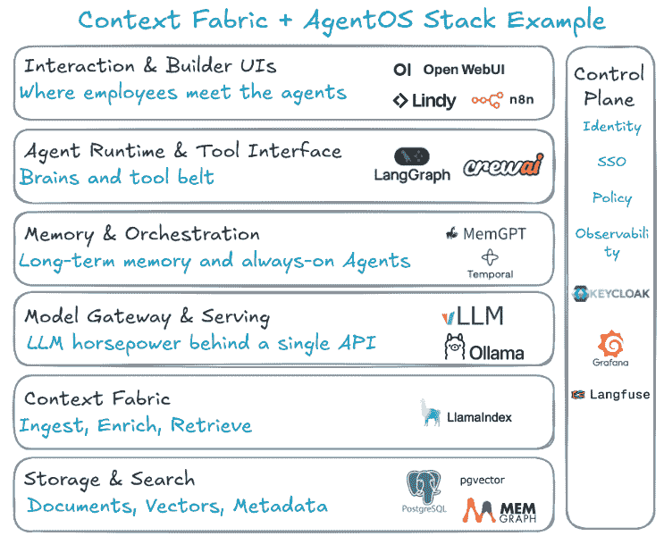

# 你只需要三样东西就能将人工智能实验转化为人工智能优势

> [`towardsdatascience.com/you-only-need-3-things-to-turn-ai-experiments-into-ai-advantage/`](https://towardsdatascience.com/you-only-need-3-things-to-turn-ai-experiments-into-ai-advantage/)

在短短两年时间里，人工智能现在无处不在。但对于大多数组织来说，它只实现了其潜力的极小部分。有多个研究，例如来自 BCG 和 MIT 的研究，表明超过 80%的人工智能项目都在失败。但这并不是什么新鲜事。在商业智能、大数据、数据科学、分析和机器学习的时代也发生过。有研究表明，失败率在 80-90%之间。这个数字不太可能改变。领导者应该思考的是如何成为 10-20%的赢家之一。

为什么大多数组织会失败？因为它们同时被拉向了千个方向。供应商销售点解决方案，只能解决问题的很小一部分。顾问推动框架，承诺很多，但只提供片段。初创公司销售创新，但与更大的图景脱节。结果是，组织只剩下试点项目、聊天机器人和范围狭窄的倡议，这些从未转化为任何有意义的商业成果。这又发生了：围绕人工智能确实有紧迫感，但没有专注，最终会陷入 80%的失败率中。

走出这种混乱的方法是集中精力构建能够提升公司众多船只能力的平台。企业需要围绕三个基础支柱来构建。如果做得好，其他所有事情都会各就各位。

## 基础支柱 1：构建上下文平台——企业真实性的织锦

没有人会否认，为了从人工智能中获得最大利益，需要高质量的数据。但大多数组织仍然在上一时代的框架内思考这个问题。拥有统一的数据平台，拥有数据真实性的单一来源，拥有黄金表格，数据治理等，这些都是必需的。但今天人工智能所需要的不仅仅是数据，还需要上下文。

大多数企业仍然没有单一的真实版本。从某种意义上说，这可能是今天的优势。作为一个后来者，可以构建一个上下文平台而不是一个纯粹的数据平台。这不仅仅是要有可以相互连接和查询的数据。相反，上下文平台是关于提供数据周围的全部上下文。

例如，为了理解客户的下一步最佳行动，高级人工智能推理系统通过拥有全面的情况意识而受益匪浅。这意味着除了提供传统的指标，如收入和产品使用情况外，还要提供丰富的上下文。例如：

+   **客户参与上下文**：每一封电子邮件，每一个支持工单，组织中的每一次互动等。

+   **业务上下文**：续订信息、合同条款和之前的定价行为等。

+   **市场和行业背景**：竞争对手活动、监管变化、行业趋势、宏观经济因素等。

所有这些情境意识可以极大地增强推荐。假设一个人正在设置交叉销售引擎。没有上下文织物，推荐可能仅基于当前收入和产品使用模式。但有了上下文织物，AI 可以将使用数据与过去的互动和市场信号（如行业新闻）相结合。然后可能会发现，逻辑上下一个最佳产品是客户在过去的销售对话中已经表现出抵抗的产品。然而，客户面临竞争威胁，使得另一种产品更适合。

但如何构建这样的织物？上下文平台是数据平台的演变，它集成了多个组件：

+   **连接和索引数据**：从应用程序、SaaS 系统、数据湖和运营系统批量导入和流式导入

+   **语义丰富**：将实体和关系提取到知识图谱中，并丰富本体、血缘和业务术语

+   **混合检索能力**：结合关键词、向量和图遍历的多模态搜索。重新排序以确保 AI 模型的相关性

+   **治理**：用户级访问控制、PII 编辑/遮蔽、审计跟踪和 AI 治理工作流程

+   **评估和可观察性**：持续监控相关性、答案准确性、延迟和成本的基础设施

在技术层面，有多种方法可以构建这个平台。所有大型云平台都提供可以为此目的拼接的产品。我们稍后会讨论这样一个堆栈。

## 第二个支柱：AgentOS — 代理操作平台

在建立上下文织物的背景下，下一个支柱是向组织提供正确的智能工具。即使有了上下文织物，大多数组织仍会陷入 POC 炼狱。根本原因是碎片化：数十个聊天机器人、数百个试点项目，但没有企业能力以一致的方式、大规模地构建。 

AgentOS 是一个平台，它使大量员工能够以受控的方式使用和构建自己的 AI 代理。这些 AI 代理可以帮助他们提高效率并自动化他们的任务。但这不仅仅是提高效率的问题。平台应该使技术团队能够构建在后台运行的周围代理，不仅自动化，而且以自动化的方式完成大量当前任务的大部分工作，并在异常和错误管理中引入人类。这个受控的、可重用的、运行时平台可以以规模构建、部署、监控和保障 AI 代理，它提供了 3 个核心服务：

1.  **共同飞行员**：直接集成到正确的工具和工作流程中，实现实时协助和决策。

1.  **代理构建框架**：基于 GUI 的工具和专业代码 SDK，允许团队在上下文织物的支持下快速创建特定领域的代理。

1.  **环境代理**：在后台运行，自主处理常规任务，同时人类管理异常情况。

AgentOS 在其最终状态下应旨在提供 6 套能力：

+   **构建**：具有多代理编排的 GUI 和专业代码代理创建

+   **基础**：连接器、RAG 检索、长期和短期记忆

+   **行动**：确保 API 和工具访问、工作流程操作、MCP 支持

+   **互操作性**：开放协议用于跨代理通信，避免供应商锁定

+   **信任**：基于角色的访问控制、审计跟踪、身份管理、内容安全

+   **监控**：用于指挥、成本、质量和安全指标的仪表板。

这当然是一套非常高级的功能。但不是所有东西都需要一次性构建，也不是所有组件都需要一开始就具备。应该从 2-5 个用户团队开始，围绕他们的需求构建，有钢铁般的线索，然后扩展。再次强调，这可以通过多个供应商堆栈实现。以下是一个主要开源堆栈的例子，它将上下文织物和代理操作系统结合在一起。

来源：作者

没有编排层，每个代理只是另一个孤岛。有了它，它们就变成了相互关联的力量倍增器。

## 第三支柱：人力资源魔法

即使是最佳的技术堆栈，如果没有人类的采用也会失败。特别是对于人工智能，人类在回路中是一个关键组成部分。麦肯锡的研究预测，到 2030 年，60-70%的今天的工作活动将被自动化。世界经济论坛估计，即使有 9200 万人失业，也将出现 7800 万个新工作岗位。所有这些都意味着工作的基本性质将发生变化。为这种变化做好准备的组织将能够更好地利用人工智能。这将使员工为即将到来的变化做好准备。并使雇主成为那些成功的 20%的人。

员工不仅需要学会使用人工智能，他们还需要重新设计工作流程，做出判断，并优化代理与人类之间的协作，例如使用环境代理。

一个结构化的员工计划可以有三个组成部分：

1.  **技能护照**：将每个角色映射到具体的 AI 时代能力，并培训员工。

1.  **代理构建冲刺**：教育和赋权员工在批准的基础设施上构建代理，并拥有自己的效率目标。

1.  **AI 重写**：让领导者负责使他们的组织成为 AI 原生。跟踪重新部署的小时数、AI 流利度和重新设计的过程。不仅仅是成本节约。

人工智能的成功将无法与人力资源准备分开。技术、代理和上下文都很重要。但它们都需要人类才能有效运作。没有这一点，企业人工智能就会失败。

## 结论

我看到许多组织被这种快速发展的技术所瘫痪。他们知道需要行动，但无法以所需的步伐进行。尽管有许多事情可以做，但上述做法将建立一个持久的优势，这不仅有助于企业成功，还有助于员工成为成功的合作伙伴，并大规模释放人工智能的潜力。

* * *

Shreshth Sharma 是一位拥有 15 年领导和管理执行经验的商业策略、运营和数据高管，曾在管理咨询（BCG 的专家级合伙人）、媒体和娱乐（索尼影业的副总裁）以及技术（Twilio 的高级总监）等行业工作。您可以在[LinkedIn](https://www.linkedin.com/in/shreshth)上关注他。
