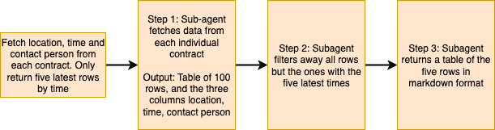
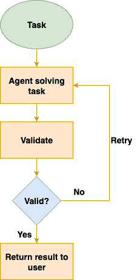

# 如何构建有效的 AI 代理以处理数百万个请求

> [原文链接](https://towardsdatascience.com/how-to-build-effective-ai-agents-to-process-millions-of-requests/)

<mdspan datatext="el1757394115861" class="mdspan-comment">AI 代理迅速</mdspan>成为使用 LLM 进行问题解决的有效方式。几乎每周，你都会看到一个新的大型 AI 研究实验室发布具有特定代理能力的 LLM。然而，构建一个有效的生产代理要比看起来复杂得多。代理需要护栏、特定的工作流程和适当的错误处理，才能在生产使用中有效。在这篇文章中，我将强调在部署 AI 代理到生产之前需要考虑的问题，以及如何使用代理制作有效的 AI 应用程序。

## 目录

+   动机

+   护栏

+   通过问题解决引导代理

+   错误处理

+   调试你的代理

+   结论

如果你想了解上下文工程，你可以阅读我关于[问答系统的上下文工程](https://towardsdatascience.com/how-to-context-engineer-to-optimize-question-answering-pipelines/)的文章，或者[使用上下文工程增强 LLM](https://eivindkjosbakken.com/2025/08/25/1347/)。

## 动机

我写这篇文章的动机是，AI 代理最近变得极其强大和有效。我们看到越来越多的 LLM 被发布，这些 LLM 专门针对代理行为进行训练，例如[Qwen 3](https://qwenlm.github.io/blog/qwen3/)，其中改进的代理能力是新发布的 LLM 的一个重要亮点。

许多在线教程强调设置代理现在有多简单，使用如[LangGraph](https://www.langchain.com/langgraph)等框架。然而，这些教程是为代理实验设计的，而不是用于在生产中利用代理。有效地利用 AI 代理进行生产使用要困难得多，需要解决你在本地实验代理时不会真正面对的挑战。因此，本文的重点将是如何制作生产就绪的 AI 代理

## 护栏

当你在生产中部署 AI 代理时需要解决的第一个挑战是设置护栏。护栏在在线空间中是一个模糊定义的术语，所以我会为这篇文章提供自己的定义。

> LLM 护栏指的是确保 LLM 在其分配的任务内行动、遵守指令且不执行意外行为的理念。

现在的问题是：你如何为你的 AI 代理设置护栏？以下是一些设置护栏的示例：

+   限制代理可访问的函数数量

+   限制智能体工作的时间，或在没有人工干预的情况下他们可以调用的工具数量。

+   在执行危险任务时，让智能体请求人工监督，例如删除对象。

这样的指导方针将确保智能体在其设计职责范围内行动，不会引发如下问题：

+   用户夸张的等待时间

+   由于极端的令牌使用导致的大额云费用（例如，如果智能体陷入循环）

此外，指导方针对于确保智能体保持正确的方向非常重要。如果您为您的 AI 智能体提供太多的选项，智能体很可能无法完成任务。这就是为什么我的下一节将讨论通过使用特定的工作流程来最小化智能体的选项。

## 引导智能体通过问题解决

在使用智能体进行生产时，另一个非常重要的点是尽量减少智能体可访问的选项数量。你可能想象可以创建一个智能体，它立即可以访问所有工具，从而创建一个有效的 AI 智能体。

不幸的是，这在实践中很少有效：智能体会陷入循环，无法选择正确的功能，并且难以从之前的错误中恢复。解决这个问题的方法是引导智能体通过其问题解决过程。在[Anthropic 的构建有效 AI 智能体](https://www.anthropic.com/engineering/building-effective-agents)中，这被称为*prompt chaining*，并应用于可以分解为不同步骤的智能体工作流程。*在我的经验中，大多数工作流程都具有这种属性，因此这个原则对于您可以用智能体解决的问题来说都是相关的。

我将通过一个例子来增强解释：

**任务**：从 100 份合同中获取关于位置、时间和联系人信息。然后，以表格形式展示最新的五份合同。

**不良解决方案**：指示一个智能体完成整个任务，因此这个智能体试图阅读所有合同，获取相关信息，并以表格形式展示。最可能的结果是，智能体会向您提供错误的信息。

**正确解决方案**：将问题分解成多个步骤。

此图突出了从合同中获取和展示数据问题的正确解决方法。您通过三个步骤引导智能体，以帮助智能体有效地解决问题。图片由作者提供。

1.  信息获取（获取所有位置、时间和联系人）

1.  信息过滤（仅保留最新的五份合同）

1.  信息展示（以表格形式展示结果）

此外，在步骤之间，您可以有一个验证器来确保任务完成按计划进行（确保您已从所有文档中获取信息等）。

因此，对于第一步，你可能会有一个特定的信息提取子代理并将其应用于所有 100 个合同。这将为你提供一个包含 3 列和 100 行的表格，每行包含一个合同，包括位置、时间和联系人。

第二步涉及信息过滤步骤，其中代理会查看表格并过滤掉不在最新 5 个合同中的任何合同。最后一步只是简单地使用 Markdown 格式将这些发现呈现为一张漂亮的表格。

诀窍是在事先生成此工作流程以简化问题。而不是让代理自己找出这三个步骤，你可以创建一个包含三个预定义步骤的信息提取和过滤工作流程。然后，你可以利用这三个步骤，在每个步骤之间添加一些验证，并拥有一个有效的信息提取和过滤代理。然后，你可以为任何其他想要执行的工作流程重复此过程。

## 错误处理

代理处理是维护生产中有效代理的关键部分。在最后一个例子中，你可以想象信息提取代理未能从 3/100 个合同中获取信息。你将如何处理这种情况？

你的第一个方法应该是添加重试逻辑。如果一个代理无法完成任务，它会重试，直到成功执行任务或达到最大重试限制。然而，你也需要知道何时重试，因为代理可能不会遇到代码错误，而是获取到错误的信息。为此，你需要适当的 LLM 输出验证，你可以在我的关于[大规模 LLM 验证](https://towardsdatascience.com/how-to-perform-comprehensive-large-scale-llm-validation/)的文章中了解更多信息。

此图显示了使用验证和重试逻辑的简单代理错误处理。代理接收一个任务并尝试解决它。然后使用验证函数验证输出。如果输出有效，则将其返回给用户，否则代理会重试任务。图片由作者提供。

错误处理，如上段所述，可以使用简单的 try/catch 语句和验证函数来处理。然而，当考虑到一些合同可能已损坏或不含正确信息时，它变得更加复杂。例如，假设其中一个合同包含联系人信息，但缺少时间。这又提出了另一个问题，因为你无法在没有时间的情况下执行任务的下一步（过滤）。为了处理此类错误，你应该预先定义缺失或不完整信息将发生什么。在这里，一个简单而有效的方法是在两次重试后忽略所有无法从（位置、时间、联系人）中提取所有三个信息点的合同。

错误处理的一个重要部分是处理以下问题：

+   令牌限制

+   响应时间慢

当对数百份文档进行信息提取时，你不可避免地会遇到问题，比如你被限制速率或 LLM 响应时间过长。我通常推荐以下解决方案：

+   令牌限制：尽可能提高限制（LLM 提供商通常在这里非常严格），并利用指数退避

+   如果可能，始终等待 LLM 调用。这可能会造成顺序处理时间变长的麻烦；然而，这将使构建你的智能体应用程序变得更加简单。如果你真的需要提高速度，你可以在以后进行优化。

另一个需要考虑的重要方面是检查点。如果你的智能体执行的任务超过 1 分钟，检查点就很重要，因为如果出现故障，你不想让模型从零开始重新启动。这通常会导致糟糕的用户体验，因为用户不得不等待较长时间。

## 调试你的智能体

构建人工智能智能体的最后一个重要步骤是调试你的智能体。我在调试方面的主要观点与我在多篇文章中分享的信息相关，由 Greg Brockman 在 X 上发布：

> 手动检查数据可能是机器学习活动中价值与声望比最高的活动。
> 
> — Greg Brockman (@gdb) [2023 年 2 月 6 日](https://twitter.com/gdb/status/1622683988736479232?ref_src=twsrc%5Etfw)

这条推文通常指的是一个标准的分类问题，你检查数据以了解机器学习系统如何进行分类。然而，我发现这条推文也非常适合调试你的智能体：

> 你应该手动检查智能体使用的输入、思考和输出令牌，以完成一系列任务。

这将帮助你了解智能体是如何处理给定问题的，智能体解决问题的上下文，以及智能体提出的解决方案。你智能体面临的大多数问题的答案通常包含在这三组令牌（输入、思考、输出）中的一组。我发现，通过简单地留出我做出的 20 个 API 调用，审查我提供给智能体的整个上下文以及输出令牌，我很快就意识到我哪里出了错，例如：

+   我向我的 LLM 提供了重复的上下文，这使得它更难遵循指示

+   思考令牌显示了 LLM 如何误解我提供给它的任务，表明我的系统提示不够清晰。

总体而言，我也建议为你的智能体创建几个测试任务，并设置一个真实数据集。然后你可以调整你的智能体，确保它们能够通过所有测试案例，然后将其部署到生产环境中。

## 结论

在这篇文章中，我讨论了如何开发有效的、可用于生产的智能代理。许多在线教程都涵盖了如何在几分钟内本地设置代理。然而，将代理成功部署到生产环境中通常是一个更大的挑战。我讨论了如何使用引导措施，指导代理通过问题解决和有效的错误处理，以成功地在生产环境中运行代理。最后，我还讨论了如何通过手动检查代理提供的输入和输出标记来调试你的代理。

**👉 我的免费电子书和网络研讨会：**

📚 [获取我的免费视觉语言模型电子书](https://eivindkjosbakken.com/ebook)

💻 [我的关于视觉语言模型的网络研讨会](https://www.eivindkjosbakken.com/webinar)

**👉 在社交媒体上找到我：**

📩 [订阅我的通讯](https://eivindkjosbakken.com/newsletter)

🧑‍💻 [联系我](https://eivindkjosbakken.com/)

🔗 [LinkedIn](https://www.linkedin.com/in/eivind-kjosbakken/)

🐦 [X / Twitter](https://x.com/EivindKjos)

✍️ [Medium](https://oieivind.medium.com/)
