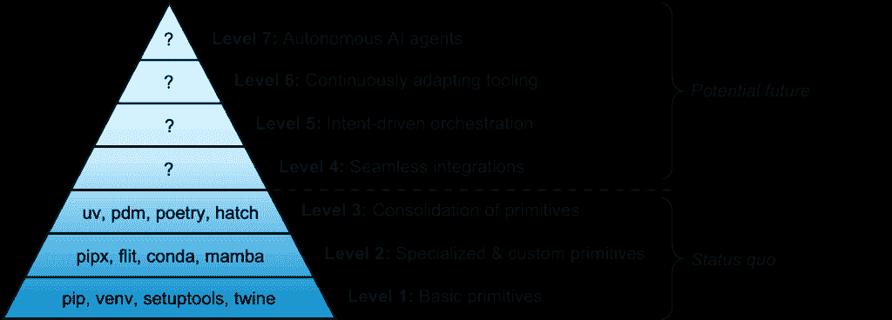
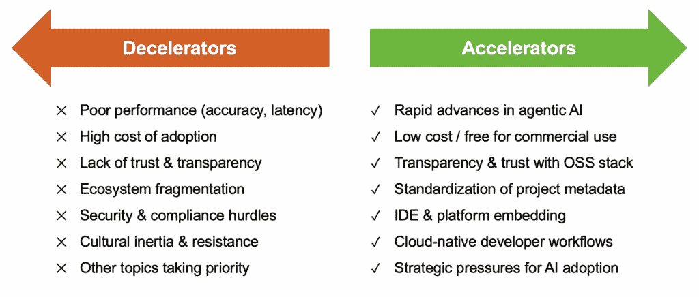

# 代理人工智能与 Python 项目管理工具的未来

> [原文链接](https://towardsdatascience.com/agentic-ai-and-the-future-of-python-project-management-tooling/)

<mdspan datatext="el1757338080956" class="mdspan-comment">在过去</mdspan>，在 Python 生态系统中工作的数据科学家通常会例行公事地使用多个工具来执行基本的项目管理任务，从使用`venv`创建虚拟环境，到使用`pip`或`conda`安装依赖项，再到使用`setuptools`和`twine`构建和发布软件包。如今，这些任务中的许多都可以通过使用单个工具如`uv`快速完成，而且与俄罗斯套娃——一套木制娃娃，其中较小的娃娃隐藏在较大的娃娃里面——不同，`uv`不仅仅是更多原始工具的包装，而是完全用 Rust 中高效实现的类似功能来替代它们。

然而，我们今天所看到的这种功能整合可能不会是最终结果。实际上，项目管理中所有相关的繁琐工作和 Python 中高度碎片化的生态系统似乎都为代理人工智能的颠覆做好了准备。在接下来的章节中，我们将使用金字塔结构来阐述 Python 项目管理工具的演变，讨论进化的潜在减速和加速力量，并为该领域的现有企业和新进入者提供一系列战略建议。

**注意：**以下各节中的所有图表均由本文作者创建。

## 工具演化的金字塔框架

图 1 提出了一种金字塔框架，用于将 Python 中多样化的项目管理工具映射到一个进化轨迹上，该轨迹始于我们可能称之为*原始工具*（具有单一基本目的的工具）的创建，并以将项目管理任务委托给代理人工智能而告终。

图 1：Python 项目管理工具的金字塔框架

在一定程度上，这个框架让人联想到马斯洛的需求层次理论，这是一种心理学中的动机理论，它认为人类需求是按顺序满足的，从生理需求（例如，食物、水、住所）和安全相关需求（例如，健康、就业、财产）开始，然后进展到更高层次的需求，如爱与归属感、自尊（例如，家庭、友谊、声誉），最终达到自我实现（即实现自己的全部潜力）。

在 Python 项目管理背景下，图 1 表明，最基本的需求，如环境隔离、依赖项管理、打包和发布，由第一级原语（如`pip`、`venv`、`setuptools`和`twine`）提供。第二级原语更专门针对某些用户群体或用例；例如，`pipx`是一个专门的包安装器，`flit`非常适合发布没有构建步骤的纯 Python 包，而像`conda`和`mamba`这样的工具主要服务于某些领域（例如 AI/ML、科学计算）。然而，同时处理第一级和第二级原语可能会很痛苦，因此第三级工具旨在尽可能整合低级原语的功能。例如，`uv`、`pdm`、`poetry`和`hatch`等工具提供了一站式商店，用于执行从环境隔离、Python 版本管理、依赖项管理、打包和发布等多样化的任务。

虽然第 1 级到第 3 级反映了现状，但第 4 级到第 7 级概述了 Python 项目管理工具潜在的未来轨迹。第 4 级的目标是项目管理系统工具与典型 Python 开发者堆栈中的其他组件的无缝集成，包括集成开发环境（IDE）、CI/CD 工具和其他配置工件。例如，`uv`（相对较新，于 2024 年推出）被其他工具支持花费了一些时间，在撰写本文时，与`conda`等替代方案相比，`uv`与 IDE（如 Visual Studio Code）的集成仍然有些繁琐。

第五级是工具开始展现智能的地方，并且很可能会由日益复杂的 AI 提供动力——而不是触发确定性命令，用户明确指定期望的结果（类似于 LLM 提示），工具正确地推断出（潜在的）意图，并执行所有相关步骤以实现期望的结果。第六级工具通过持续监控 Python 代码库、项目目标和性能瓶颈，自动更新依赖项、优化配置、修补漏洞，并为代码重构提出相关建议，将智能提升到一个巨大的新台阶。最后，在第七级，工具成为自主的 AI 代理，可以接管大多数——如果不是所有——项目管理任务，只需要最小程度的人类监督；在这个阶段，Python 开发者可以腾出时间专注于更有价值的活动（即软件开发中的“为什么”和“是什么”）。

## 加速和减速因素

然而，通往第七级工具的旅程远非预先注定，有几个因素可能会加快或减缓进化过程。图 2 列出了关键加速和减速因素。

图 2：塑造进化过程加速和减速因素

其中一些因素涉及“基本筹码”问题，例如性能（在 AI 输出的相关性和延迟方面），成本（大多数用户负担不起昂贵的订阅），以及安全和合规性（企业用户的关键障碍）。除此之外，提供将 AI 嵌入流行 IDE 的方法，并确保与 CI/CD 工具的无缝集成，可以进一步加快采用速度。然而，如果项目元数据的标准不久后没有得到稳固的建立（例如，使用`project.toml`文件），并且生态系统仍然碎片化，那么多个竞争性的 AI 标准可能会持续一段时间，导致选择困难症和采用碎片化。最后，即使 AI 代理的可行性得到验证，现有工具的文化和流程上的根深蒂固可能难以迅速克服。正如前总统吉米·卡特时期的预算和管理办公室主任伯特·兰斯在 1977 年显然所说的，“如果它没有坏，就不要修它”，开发者可能对 Python 项目管理工具也有同样的看法。

目前围绕 AI 代理的炒作建立在这样一个假设之上：随着时间的推移，加速器将加强，减速器将减弱。性能和成本效益可能会提高，并且随着行业普遍采用管理代理 AI 的稳健护栏和政策，关于安全和合规性的担忧应该会得到缓解。经济激励措施（例如，缩短上市时间，降低入职努力）可能进一步促使企业用户，尤其是他们，采取行动。然而，今天，关于 5 级及以上工具如何以及何时出现，仍然远未明朗。

## 针对现任者和新进入者的战略建议

现有工具最好为包括 5 级及以上工具的未来进行战略规划，因为如果这些新进入者一旦确立，就有被取代的真实风险。考虑`uv`及其对包括`pip`、`venv`和`pyenv`在内的各种原语的长远影响——`uv`实际上用一种易于使用且快速的基于 Rust 的实现替换了所有这些既有的功能。AI 代理的出现可能会给非 AI 工具带来类似的命运，包括（讽刺地）`uv`，通过遵循一种“平台剧本”。AI 代理可能开始作为一个集成器，位于现有工具之上，成为工具链的用户界面部分不可或缺的一部分，然后随着 AI 代理有效控制用户关系，逐渐用更高效和适应性强的实现替换底层的（后端）工具。

为了减轻被新进入者取代的风险，Python 工具空间中的现有企业可以制定一个多管齐下的战略，该战略基于图 2 中的见解。毕竟，根据定义，现有企业相对于新进入者在心智份额、市场份额、信任和目标用户群体中的熟悉度方面都有先发优势，现有企业应该利用这一点。现有工具可以加深与涵盖关键领域（如安全扫描、云部署和测试）的供应商解决方案的集成。非 AI 现有企业可以将确定性流程作为差异化因素：知道给定的输入将始终导致给定的输出可以在建立清晰的依赖来源和保证可重复性方面成为一种资产。类似地，非 AI 工具可以强调透明的依赖解析、可验证的锁定文件和可重复构建。社区锚定是另一个可探索的角度：现有企业可以通过加强与核心 Python 开发者社区的联系、赞助 PEP 和积极塑造不断发展的元数据标准来投资，以防止即将到来的竞争。最后，现有企业可以尝试找到通过 AI 增强现有功能的价值创造方式（例如，提供“NLP 模式”，其中 CLI 可以解释自然语言提示）。

同时，新进入者也有自己的一些战略选择来加速采用。确保开发者体验——从一键安装和直观的产品入门到轻松的、类似礼宾服务的执行基本功能（例如，项目初始化、环境隔离）——将是说服用户切换到新工具或最初就使用该工具的一个非常有效的方法；如果开发者体验针对的是大型、高增长但尚未得到充分服务的用户群体（例如，非技术用户、产品经理、架构师、数据科学家、主要使用除 Python 以外的语言工作的开发者），这将特别强大。如果能够与 IDE、CI/CD 软件和其他核心软件开发供应商成功谈判，将新 AI 工具嵌入现有产品生态系统中（例如，将 AI 工具作为默认 IDE 插件发布），开发者可能开始熟悉新工具，而无需主动做出选择。

准确的 AI 响应以及对 AI 推理步骤的透明度（例如，在执行之前显示推断出的计划）也有助于建立用户信任；通过在公共场合迭代产品（例如，分享路线图、发布变更日志和快速修复报告的 bug）可以增强这种积极影响。确保工具根据观察到的使用情况和开发者偏好持续学习和适应将进一步强调 AI 的承诺。最后，AI 工具不需要声称自己是完美的，它甚至可以为高级用户提供在必要时降级到更低级别的非 AI 工具（如`uv`、`pip`或`venv`）的可能性。

显然，现有企业和新进入者都有在 AI 主导的未来中竞争的方法，但这不一定是零和游戏。事实上，AI 和非 AI 工具可能通过占据互补的利基市场并相互交换价值来实现共存。非 AI 的现有企业可以公开稳定的 API 和 CLI，作为可靠的执行引擎，而 AI 工具则处理自然语言编排和决策，创造一个保持底层“管道”稳健和用户界面智能的责任分工。

允许用户在 AI 和非 AI 工作方式之间切换的双模式工作流程将使初学者能够依赖 AI 驱动的指导，同时让高级开发者能够无缝地进入底层命令，扩大用户基础而不会使任何一方感到疏远。共享元数据标准（例如，管理`*.toml`和`*.lock`文件）、共同撰写的 PEP 和互操作模式将减少碎片化，使融合或切换工具变得更加容易。联合教程和教育倡议可以突出 AI 和非 AI 工具的互补性，而市场或基于插件的商业模式将竞争转化为一个平台游戏，不同工具的成功可以共享。这种合作关系将保护现有企业，加速基于 AI 的新进入者的采用，并让开发者能够在 AI 辅助的便利性和裸机控制之间自由选择。

## 总结

在代理 AI 时代的 Python 项目管理工具生态系统不断发展之际，现有企业和新进入者都可能面临一系列挑战——但同时也拥有许多机遇——因此应相应地制定策略。现有企业应找到方法来利用他们赢得的信任、业绩记录、可靠性和深厚的社区联系，以保持不可或缺的地位，同时有选择地拥抱 AI 以增强可用性，而不牺牲确定性和可重复性的好处。新进入者可以通过无缝的入职、智能自动化和适应性学习来抓住颠覆性创新的机遇，通过透明度和高影响力的产品集成来建立信任。

关键的是，最佳的前进道路可能不在于面对面、零和竞争，而在于培养一种共生关系，其中 AI 驱动的编排和经过验证的低级执行相互补充。通过达成共享标准、促进互操作性以及共同创造价值，Python 工具社区可以确保下一波创新扩大不同用户群体的选择范围，加速生产力，并整体加强生态系统。
