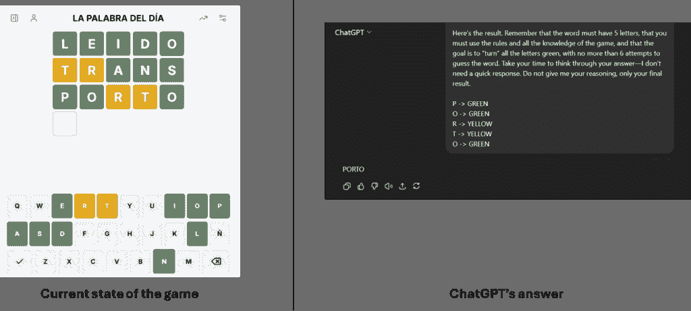
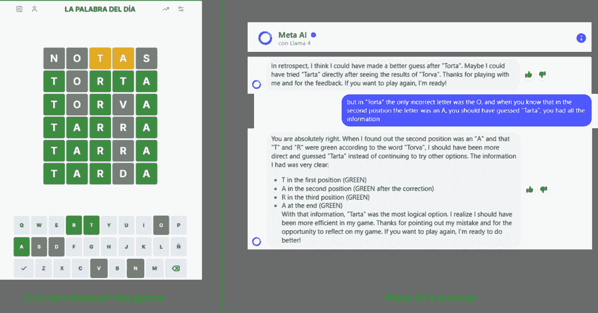
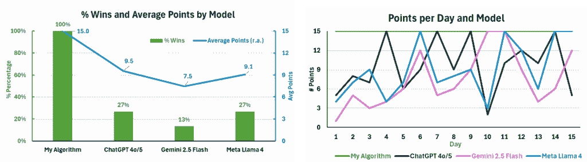
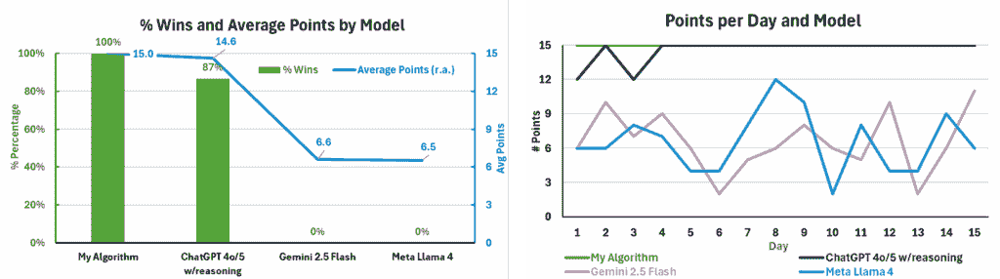

# 我们是否应该像使用瑞士军刀一样使用 LLM？

> [`towardsdatascience.com/should-we-use-llms-as-if-they-were-swiss-knives/`](https://towardsdatascience.com/should-we-use-llms-as-if-they-were-swiss-knives/)

<mdspan datatext="el1757010819438" class="mdspan-comment">在过去一年左右的时间里</mdspan>，无法否认的是，人们对人工智能的炒作水平有所上升，尤其是在生成式人工智能和代理式人工智能的兴起之后。作为一名在咨询公司工作的数据科学家，我注意到关于如何利用这些新技术使流程更高效或自动化的咨询数量显著增长。虽然这种兴趣可能会让我们这些数据科学家感到自豪，但有时人们似乎期望 AI 模型能像变魔术一样解决所有问题，好像他们只需要一个提示就能解决所有问题。另一方面，虽然我个人认为生成式和代理式人工智能已经（并将继续）改变我们的工作和生活方式，但在进行业务流程改进时，我们必须考虑其局限性和挑战，并看看它在哪些方面证明是一个好工具（例如，我们不会用叉子来切食物）。

作为一名技术爱好者，我理解了 LLM 的工作原理，因此我想测试它们在类似西班牙版[Wordle](https://lapalabradeldia.com/)的逻辑游戏中的表现，这个游戏是我几年前在几个小时之内构建的逻辑（更多细节可以在[这里](https://towardsdatascience.com/human-vs-machine-comparing-my-performance-in-wordle-against-an-algorithm-ac449ca76124/)找到）。具体来说，我有以下问题：

+   我的算法会比 LLM 模型好吗？

+   LLM 模型中的推理能力会如何影响它们的性能？

## 构建基于 LLM 的解决方案

为了通过 LLM 模型获得解决方案，我构建了三个主要的提示。第一个提示是为了获取一个初始猜测：

> 假设我正在玩 WORDLE，但使用西班牙语。这是一个你需要猜测 5 个字母单词的游戏，你只有 6 次机会。此外，最终单词中可以重复字母。
> 
> 首先，让我们回顾一下游戏规则：每天游戏会选择一个 5 个字母的单词，玩家需要在 6 次尝试内猜出这个单词。在玩家输入他们认为的单词后，每个字母会被标记为绿色、黄色或灰色：绿色表示字母正确且位置正确；黄色表示字母在隐藏单词中但不在正确的位置；灰色表示字母不在隐藏单词中。
> 
> 但是如果你重复放置一个字母，一个显示为绿色，另一个显示为黄色，这意味着这个字母重复出现：一次在绿色位置，一次在另一个不是黄色的位置。
> 
> 示例：如果隐藏的单词是**“PIZZA”**，而你第一次尝试的单词是**“PANEL”**，那么响应将如下所示：**“P”**将是绿色，**“A”**是黄色，而**“N”**、**“E”**和**“L”**是灰色。
> 
> 由于现在我们对目标单词一无所知，给我一个好的起始单词——一个你认为将提供有用信息以帮助我们找出最终单词的单词。

然后，使用第二个提示来展示所有单词规则（由于空间限制，这里没有展示完整的提示，但完整的版本也包括示例游戏和示例推理）：

> 现在，我们的想法是回顾游戏策略。我将给你游戏结果。我们的想法是，给定这个结果，你提出一个新的 5 个字母的单词。记住，总共只有 6 次尝试。我将以下列格式给你结果：
> 
> LETTER -> COLOR
> 
> 例如，如果隐藏的单词是**PIZZA**，并且尝试的单词是**PANEL**，我将以以下格式给出结果：
> 
> P -> 绿色（它是最终单词的第一个字母）
> 
> A -> 黄色（它在单词中，但不在第二个位置——而是在最后一个位置）
> 
> N -> 灰色（它不在单词中）
> 
> E -> 灰色（它不在单词中）
> 
> L -> 灰色（它不在单词中）
> 
> 让我们记住规则。如果一个字母是绿色的，这意味着它在放置的位置。如果它是黄色的，这意味着字母在单词中，但不在那个位置。如果它是灰色的，这意味着它不在单词中。
> 
> 如果你放置一个字母两次，一个显示绿色，另一个显示灰色，这意味着字母在单词中只出现一次。但如果放置一个字母两次，一个显示绿色，另一个显示黄色，这意味着字母出现两次：一次在绿色位置，另一次在另一个位置（不是黄色位置）。
> 
> 我给你提供的所有信息都必须用于构建你的建议。最终，我们希望“转换”所有字母为绿色，因为这意味着我们猜对了单词。
> 
> 你的最终答案必须只包含单词建议——不要你的推理。

最终提示用于在得到我们的尝试结果后获得新的建议：

> 这是结果。记住单词必须有 5 个字母，你必须使用规则和所有游戏知识，目标是用不超过 6 次尝试猜出单词。花点时间思考你的答案——我不需要快速回应。不要给我你的推理，只给出你的最终结果。

在这里的一个重要的事情是，我从未试图引导 LLMs 或指出逻辑中的错误或错误。我想要一个纯基于 LLMs 的结果，并且不想以任何形式偏袒解决方案。

## 初始实验

事实是，我最初的假设是，虽然我期望我的算法比 LLMs 更好，但我认为基于生成式 AI 的解决方案在没有太多帮助的情况下会做得相当不错，但经过几天后，我注意到一些“有趣”的行为，如下所示（答案很明显）：

*示例游戏解决方案（版权：作者图片）*

答案相当明显：只需要切换两个字母。然而，ChatGPT 给出了与之前相同的猜测。

在看到这些错误之后，我开始在游戏结束时询问这个问题，LLM 基本上承认了它们的错误，但没有对它们的答案给出明确的解释：

最终结果解释（图片由作者提供）

虽然这只是两个例子，但这种行为在生成纯 LLM 解决方案时很常见，展示了基础模型推理中的一些潜在局限性。

## 结果分析

在考虑了所有这些信息之后，我进行了一个为期 30 天的实验。在前 15 天，我将我的算法与 3 个基础 LLM 模型进行了比较：

+   ChatGPT 的 4o/5 模型（在 OpenAI 发布了 GPT-5 模型后，我无法在 ChatGPT 免费版之间切换模型）

+   Gemini 的 2.5-Flash 模型

+   Meta 的 Llama 4 模型

在这里，我比较了两个主要指标：获胜百分比和点数系统指标（最终猜测中的任何绿色字母获得 3 分，黄色字母获得 1 分，灰色字母获得 0 分）：

*我的算法与 LLM 基础模型之间的初始结果（图片由作者提供）*

如上图所示，我的算法（虽然针对这个特定用例，我只花了大约一天时间来构建）是唯一每天都能获胜的方法。分析 LLM 模型，Gemini 的表现最差，而 ChatGPT 和 Meta 的 Llama 提供了相似的数据。然而，如图右所示，每个模型的表现都有很大的变化，并且一致性并不是这些替代方案在这个特定用例中展示出来的。

然而，如果我们没有分析一个推理 LLM 模型与我的算法（以及与基础 LLM 模型）的对比，这些结果就不会完整。因此，在接下来的 15 天里，我也比较了以下模型：

+   ChatGPT 的 4o/5 模型使用推理能力

+   Gemini 的 2.5-Flash 模型（与之前的模型相同）

+   Meta 的 Llama 4 模型（与之前的模型相同）

这里有一些重要的评论：最初，我计划使用 Grok，但在 Grok 4 发布后，Grok 3 的推理切换消失了，这使得比较变得困难；另一方面，我尝试使用 Gemini 的 2.5-Pro，但与 ChatGPT 的推理选项相比，这个选项不是一个切换，而是一个不同的模型，它每天只允许我发送 5 个提示，这使我们无法完成整个游戏。考虑到这一点，我们展示了以下 15 天的结果：

*我的算法与 LLM 模型之间的附加结果（图片由作者提供）*

LLM 背后的推理能力为这项任务提供了巨大的性能提升，这项任务需要理解每个位置可以使用哪些字母，哪些已经被评估，记住所有结果并理解所有组合。不仅平均结果更好，而且性能更加一致，因为在两个未能获胜的游戏中，只错过了一个字母。尽管有这种改进，但我构建的特定算法在性能上仍然略胜一筹，但如我之前提到的，这是为了这个特定任务。有趣的是，在这 15 场比赛中，基础 LLM 模型（Gemini 2.5 Flash 和 Llama 4）一次也没有获胜，其表现比另一组更差，这让我怀疑之前获得的胜利是幸运还是不幸。

## 最后的评论

本练习的目的是尝试测试大型语言模型（LLM）在针对需要应用逻辑规则以生成成功结果的任务上，与专门构建的算法的性能对比。我们发现，基础模型的表现并不理想，但 LLM 解决方案的推理能力提供了重要的提升，其性能与我所构建的定制算法的结果相似。需要注意的是，尽管这种改进是真实的，但在现实世界的应用和生产系统中，我们还要考虑响应时间（推理 LLM 模型生成答案所需的时间比基础模型或在此情况下我构建的逻辑要长）和成本（根据[Azure OpenAI 定价页面](https://azure.microsoft.com/en-us/pricing/details/cognitive-services/openai-service/)，截至 2025 年 8 月 30 日，通用目的 GPT-4o-mini 模型每 100 万个输入标记的价格约为 0.15 美元，而 o4-mini 推理模型每 100 万个输入标记的成本为 1.10 美元）。虽然我坚信 LLM 和生成式 AI 将继续改变我们的工作方式，但我们不能将其视为一把瑞士军刀，解决所有问题，而忽略了其局限性，没有评估易于构建的定制解决方案。
