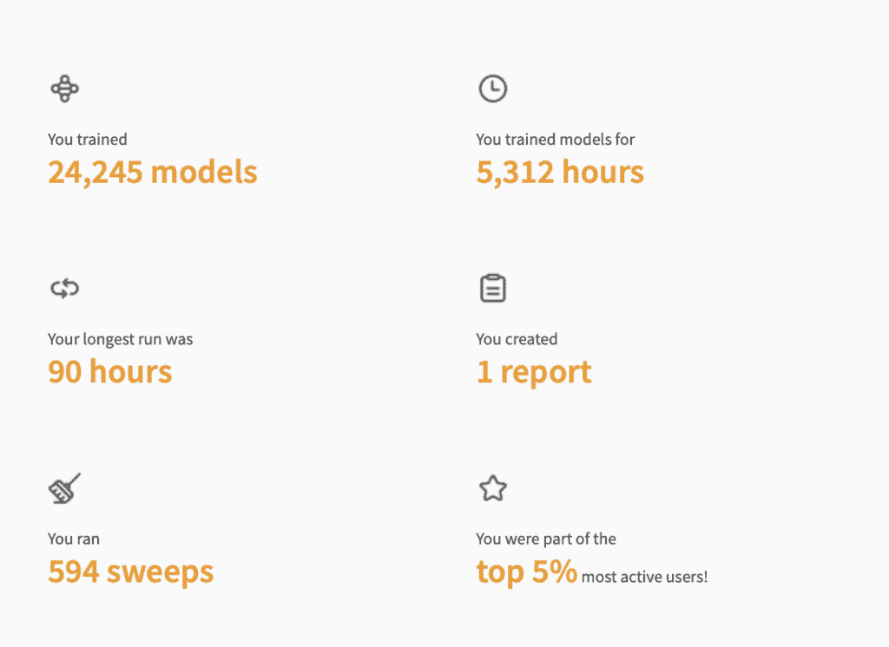

# 本月我学到的机器学习经验教训

> [本月机器学习经验教训](https://towardsdatascience.com/this-months-machine-learning-lessons-learned/)

<mdspan datatext="el1756489022307" class="mdspan-comment">在机器学习的大多数日子里</mdspan>都是一样的。

编码，等待结果，解释它们，然后回到编码。此外，还有一些关于个人进度中间展示的内容。但是，事情大多相同并不意味着没有东西可以学习。恰恰相反！两到三年前，我开始养成一个习惯，每天写下我从机器学习工作中学到的经验教训。在回顾这个月的某些经验教训时，我发现有三个实用的经验教训脱颖而出：

1.  保持日志简单

1.  使用实验笔记本

1.  考虑过夜运行

## 保持日志简单

几年来，我一直把 Weights & Biases（W&B）*作为我的首选实验日志记录工具。实际上，我曾经是所有活跃用户中前 5%的人。下面图表中的统计数据告诉我，当时我训练了近 25000 个模型，累计使用了 5000 小时的计算资源，并进行了超过 500 次超参数搜索。我用它来写论文，用于像使用大型数据集进行天气预报这样的大型项目，以及跟踪无数的小规模实验。

我曾经使用 W&B 进行实验日志记录的统计数据。图片由作者提供。

W&B 确实是一个伟大的工具：如果你想拥有漂亮的仪表板并且与团队协作**，W&B 会大放异彩。而且，直到最近，在从训练好的神经网络中重建数据时，我进行了多次超参数扫描，W&B 的可视化能力是无价的。我可以直接比较运行之间的重建结果。

但我意识到，对于我大多数的研究项目来说，W&B（Weights & Biases）过于复杂了。我很少重新访问单个运行，一旦项目完成，日志就放在那里，我再也没有对它们做过任何事情。当我后来重构提到的数据重建项目时，因此明确地移除了 W&B 集成。不是因为它有任何问题，而是因为它不是必要的。

现在，我的设置要简单得多。我只是将选定的指标记录到 CSV 和文本文件中，直接写入磁盘。对于超参数搜索，我依赖于 Optuna。甚至不是带有中央服务器的分布式版本——只是本地的 Optuna，将研究状态保存到 pickle 文件中。如果发生崩溃，我会重新加载并继续。实用且足够（对于我的用例来说）。

这里的关键洞察是：日志记录不是工作本身。它是一个支持系统。花 99%的时间决定你想要记录什么——梯度？权重？分布？以及以何种频率？——很容易让你分心，无法专注于实际的研究。对我来说，简单、本地的日志记录覆盖了所有需求，并且设置努力最小。

## 维护实验实验室手册

1939 年 12 月，威廉·肖克利在他的实验笔记本中写下了一个想法：用半导体替换真空管。大约 20 年后，肖克利和贝尔实验室的两位同事因发明现代晶体管而获得了诺贝尔奖。

虽然我们大多数人没有在我们的笔记本中写下诺贝尔奖级的条目，但我们仍然可以从这个原则中学习。诚然，在机器学习中，我们的实验室没有化学物质或试管，这是我们想到实验室时都会想到的。相反，我们的实验室通常是我们的电脑；我用来写这些行的同一台设备在过去的几年里训练了无数个模型。而且这些实验室本质上具有便携性，尤其是在我们在高性能计算集群上远程开发时。更好的是，多亏了高度熟练的行政人员，这些集群全天候运行——所以总有时间运行实验！

但是，问题是，哪个实验？在这里，一位前同事向我介绍了保持实验笔记本的想法，最近我以最简单的方式回归了它。在开始长时间运行的实验之前，我会写下：

我在测试什么，以及为什么我要测试它。

然后，当我稍后回来——通常是第二天早上——我可以看到哪些结果已经准备好，以及我希望学到什么。这很简单，但它改变了工作流程。不再是“重跑直到它工作”，这些专门的实验成为了一个文档化的反馈循环的一部分。失败更容易解释。成功更容易复制。

## 晚上运行实验

这是我这个月（重新）学到的一个小而痛苦的经验教训。

在一个周五晚上，我发现了一个可能影响我的实验结果的问题。我修复了它，重新运行了实验以验证。到周六早上，运行已经完成——但当我检查结果时，我意识到我忘记包括一个关键的消融。这意味着……又是一个完整的等待日。

在机器学习中，晚上的时间是宝贵的。对我们程序员来说，它是休息时间。对我们来说，它是工作。如果我们睡觉时没有运行实验，我们实际上是在浪费免费的计算周期。

这并不意味着你应该仅仅为了实验而进行实验。但每当有一个有意义的实验可以启动时，晚上开始它们是完美的时机。集群通常被过度利用，资源可以更快地获得，而且——最重要的是——你将在第二天早上有结果可以分析。

一个简单的技巧是有意地计划这一点。正如 Cal Newport 在他的书《深度工作》中提到的，好的工作日是从前一天开始的。如果你知道明天的任务，你就可以及时设置正确的实验。

* * *

* 这并不是在批评 W&B（比如 MLFlow 也会一样），而是要求用户评估他们的项目目标，然后花大部分时间全力以赴地追求这些目标。

**脚注：在我看来，仅仅合作还不足以证明使用这样的共享仪表板是合理的。你需要从这些共享工具中获得比设置它们所花费的时间更多的洞察。**
