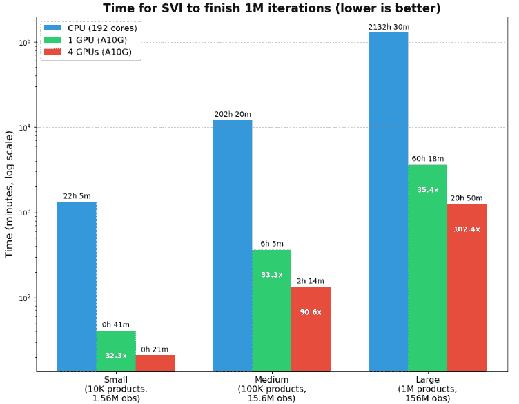

# 10,000 倍更快的贝叶斯推理：多 GPU SVI 与传统的 MCMC

> 原文：[`towardsdatascience.com/10000x-faster-bayesian-inference-multi-gpu-svi-vs-traditional-mcmc/`](https://towardsdatascience.com/10000x-faster-bayesian-inference-multi-gpu-svi-vs-traditional-mcmc/)

**<mdspan datatext="el1749583804470" class="mdspan-comment">慢速计算时间是否阻止你在生产中实施贝叶斯模型？** 你并不孤单。虽然贝叶斯模型为结合先验知识和不确定性量化提供了一个强大的工具，但其在工业界的采用受到一个关键因素的制约：传统的推理方法非常慢，尤其是在扩展到高维空间时。在这篇指南中，我将向您展示如何通过使用多 GPU 随机变分推理（SVI）来加速您的贝叶斯推理，其速度比基于 CPU 的马尔可夫链蒙特卡洛（MCMC）方法快 10,000 倍。

**你将学到：**

+   马尔可夫链蒙特卡洛方法和变分推理方法之间的差异。

+   如何在多个 GPU 之间实现数据并行。

+   步骤-by-步骤的技术（和代码）来扩展你的模型以处理数百万或数十亿个观测值/参数。

+   CPU、单 GPU 和多 GPU 实现之间的性能基准

本文继续我们的关于层次贝叶斯建模的实用系列，基于我们之前的[需求价格弹性示例](https://towardsdatascience.com/estimating-product-level-price-elasticities-using-hierarchical-bayesian/)。无论你是处理大规模数据集的数据科学家，还是希望探索以前难以处理问题的学术研究人员，这些技术将改变你估计贝叶斯模型的方法。

**想跳过理论直接进入实现吗？** 你可以在下面的实现部分找到实用的代码示例。

## 推理方法

回顾我们的基线规范：

$$\log(\textrm{Demand}_{it})= \beta_i \log(\textrm{Price})_{it} +\gamma_{c(i),t} + \delta_i + \epsilon_{it}$$

位置：

+   \(\textrm{Units Sold}_{it} \sim \textrm{Poisson}(\textrm{Demand}_{it}, \sigma_D) \)

+   \(\beta_i \sim \text{Normal}(\beta_{c(i)},\sigma_i)\)

+   $\beta_{c(i)}\sim \text{Normal}(\beta_g,\sigma_{c(i)})$

+   $\beta_g\sim \text{Normal}(\mu,\sigma)$

我们希望使用数据 $x = \{ \text{Units}_{it}, \text{Price}_{it}\}$ 来估计参数向量（及其方差）$z = \{ \beta_g, \beta_{c(i)}, \beta_i, \gamma_{c(i),t}, \delta_i, \text{Demand}_{it} \}$。与频率主义方法相比，使用贝叶斯方法的一个优点是，我们可以直接使用泊松分布等分布来建模计数/销售数据，从而避免在使用对数变换模型时可能出现的零值问题。使用贝叶斯方法，我们指定一个先验分布（基于我们的信念）$p(z)$，该分布结合了我们关于向量 $z$ 的知识，在看到任何数据之前。然后，给定观察到的数据 $x$，我们生成一个似然 $p(x|z)$，它告诉我们观察到的数据 $x$ 在我们指定 $z$ 的条件下有多可能。然后，我们应用贝叶斯定理 $p(z|x) = \frac{p(z)p(x|z)}{p(x)}$ 来获得后验分布，这代表了我们根据数据更新的关于参数的信念。分母也可以写成 $p(x) = \int p(z,x) \, dz = \int p(z)p(x|z) \, dz$。这使我们方程简化为：

$$p(z|x) = \frac{p(z)p(x|z)}{\int p(z)p(x|z) \, dz}$$

这个方程需要计算在观察到的数据 $x$ 条件下的参数后验分布 $p(z|x)$，它等于先验分布 $p(z)$ 乘以给定某些参数 $z$ 的数据似然。然后，我们将该乘积除以边缘似然（证据），这是数据在所有可能的参数值上的总概率。计算 $p(z|x)$ 的困难在于，证据需要计算一个高维积分 $p(x) = \int p(x|z)p(z)dz$。许多具有层次结构或复杂参数关系的模型也没有积分的封闭形式解。此外，计算复杂度随着参数数量的指数增长，使得对于高维模型直接计算变得不可行。因此，在实践中，贝叶斯推理是通过近似积分来进行的。

我们现在将探讨贝叶斯推理中最流行的两种方法；马尔可夫链蒙特卡洛（Markov-Chain Monte Carlo，MCMC）和[随机变分推理](https://jmlr.org/papers/volume14/hoffman13a/hoffman13a.pdf)（Stochastic Variational Inference，SVI）在接下来的章节中。虽然这些是最流行的方法，但还存在其他方法，例如[重要性抽样](https://builtin.com/articles/importance-sampling)、[粒子滤波（顺序蒙特卡洛）](https://www.ma.imperial.ac.uk/~agandy/teaching/ltcc/lecture5.pdf)和[期望传播](https://tminka.github.io/papers/ep/minka-ep-uai.pdf)，但本文将不会涉及这些方法。

### 马尔可夫链蒙特卡洛

MCMC 方法是一类算法，允许我们在直接采样困难时从概率分布中进行采样。在贝叶斯推理中，MCMC 使我们能够从后验分布 $p(z|x)$ 中抽取样本，而无需显式计算分母中的积分。核心思想是构建一个马尔可夫链，其平稳分布等于我们的目标后验分布。从数学上讲，我们的目标分布 $p(z|x)$ 可以表示为 $\pi$，我们试图构建一个转移矩阵 $P$，使得 $\pi = \pi P$。一旦链达到其平稳分布（在丢弃可能不平稳的烧毁样本之后），链的每个后续状态将近似地按照我们的目标分布 $\pi$ 分布。通过收集足够的这些样本，我们可以构建后验分布的经验近似，随着样本数量的增加，这种近似将趋于无偏。

马尔可夫链方法是一类采样器，提供了构建转移矩阵 $P$ 的不同方法。其中最基本的是 [Metropolis-Hastings](https://arxiv.org/pdf/1504.01896) (MH) 算法，它从提议分布中提出新状态，并根据确保链收敛到目标分布的概率比接受或拒绝这些状态。虽然 MH 是马尔可夫链方法的基础，但该领域的近期进展已经转向更复杂的采样器，如 [哈密顿蒙特卡洛](https://bayesianbrad.github.io/posts/2019_hmc.html) (HMC)，它通过包含梯度信息来结合物理概念，从而更有效地探索参数空间。最后，近年来默认的采样器是 [无回转采样器](https://www.jmlr.org/papers/volume15/hoffman14a/hoffman14a.pdf) (NUTS)，它通过自动调整 HMC 的超参数来改进 HMC。

尽管 MCMC 方法具有令人向往的理论特性，但当扩展到大型数据集和高维参数空间时，它们面临着显著的局限性。MCMC 的顺序性质在链的每一步都依赖于前一个状态，从而在计算上形成瓶颈，使得并行化变得困难。此外，MCMC 方法通常需要在每次迭代中使用整个数据集来评估似然函数。尽管正在进行的研究提出了克服这一局限性的方法，例如 [随机梯度](https://arxiv.org/abs/1907.06986) 和 [小批量](https://arxiv.org/abs/1908.02910)，但这些方法尚未得到广泛应用。这些扩展问题使得在大数据设置中应用传统的贝叶斯推理变得具有挑战性。

### 随机变分推理

贝叶斯推理中常用的第二种方法是随机变分推理。我们不是从未知的后验分布中进行采样，而是假设存在一个分布族 $\mathcal{Q}$，它可以近似未知的后验 $p(z|x)$。这个族由变分参数 $\phi$（在 Pyro/Numpyro 中也称为引导）参数化，我们的目标是找到 $\mathcal{Q}$ 中与真实后验最相似的成员 $q_\phi(z)$。标准提出的分布使用平均场近似，即它假设所有潜在变量都是相互独立的。这个假设意味着联合分布分解为边缘分布的乘积，使得计算更加可行。例如，我们可以有一个对角多元正态分布作为引导，参数 $\phi$ 将是每个对角元素的定位和尺度参数。由于所有协方差项都被设置为零，这个分布族具有相互独立的参数。这对于销售数据来说尤其成问题，因为溢出效应很普遍。

与使用采样的 MCMC 不同，SVI 通过最小化我们的近似与真实后验之间的[Kullback-Leibler (KL) 散度](https://towardsdatascience.com/understanding-kl-divergence-f3ddc8dff254/)将贝叶斯推理公式化为一个优化问题：$\text{KL}(q_\phi(z) || p(z|x))$。虽然我们不能有效地计算整个散度，但最小化 KL 散度等价于使用已建立的优化技术随机最大化证据下界（ELBO）([推导](https://chrisorm.github.io/VI-ELBO.html))。

沿着这条路线的研究往往集中在两个主要方向上：改进变分族 $\mathcal{Q}$ 或开发更好的 ELBO 版本。更具有表现力的族，如[正态化流](https://arxiv.org/abs/1505.05770)，可以捕捉复杂的后验几何形状，但伴随着更高的计算成本。[重要性加权 ELBO](https://arxiv.org/abs/1509.00519)推导出对数边缘似然的一个更紧的界限，减少了 SVI 的偏差。由于 SVI 本质上是一种最小化技术，它也受益于为深度学习开发的优化算法。这些改进使得 SVI 可以扩展到极其庞大的数据集，然而是以牺牲一些近似质量为代价。此外，平均场假设意味着 SVI 的后验不确定性往往被低估。这意味着可信区间太窄，可能无法正确捕捉真实参数值，这是我们在这系列的第一部分中展示的。

### 应该使用哪一个

由于本文的目标是扩展，我们将使用 SVI 来处理未来的应用。正如[Blei 等人（2016）](https://arxiv.org/abs/1601.00670)所指出的，“变分推断适用于大型数据集和我们需要快速探索多个模型的情况；MCMC 适用于较小数据集和我们可以愿意为更精确的样本支付更高计算成本的情况”。应用 SVI 的论文已经显示出在[多项式对数模型](https://arxiv.org/abs/2004.05426)、[天体物理学](https://arxiv.org/abs/1803.06473)和[大数据营销](https://english.ckgsb.edu.cn/sites/default/files/files/Variational%20Bayesian%20Inference%20for%20Big%20Data%20Marketing%20Models.pdf)方面的推理速度显著加快（高达 3 个数量级）。

## 数据分片

[JAX](https://docs.jax.dev/en/latest/)是一个针对加速器导向数组计算的 Python 库，它结合了 NumPy 熟悉的 API、GPU/TPU 加速和自动微分。在底层，JAX 使用 JIT 和 XLA 来高效编译和优化计算。本文的关键是 JAX 能够在多个设备之间分配数据([数据分片](https://docs.jax.dev/en/latest/notebooks/Distributed_arrays_and_automatic_parallelization.html))，这通过在硬件资源之间分割计算来实现并行处理。在我们的模型背景下，这意味着我们可以将我们的$X$向量分割到多个设备上以加速 SVI 的收敛。JAX 还允许复制，这将在所有设备上复制数据。这对于我们模型的一些参数（全局弹性、类别弹性和按时间分组的子类别固定效应）很重要，这些信息可能所有设备都可能需要。对于我们的价格弹性示例，我们将在复制系数的同时对索引和数据分片。

最后一点需要注意的是，JAX 中分片数组的领先维度必须能被系统中设备数量整除。对于一个二维数组，这意味着行数必须能被设备数量整除。因此，我们必须编写一个自定义辅助函数来填充我们输入到需求函数中的数组，否则我们将收到错误。这个计算也必须在模型外部完成，否则 SVI 的每一次迭代都会重复填充操作，从而减慢计算速度。因此，我们不会直接将我们的`DataFrame`传递到模型中，而是在模型外部预先计算所有所需的转换，并将其输入到模型中。

## 实施和评估

模型的先前版本可以在[上一篇文章](https://towardsdatascience.com/estimating-product-level-price-elasticities-using-hierarchical-bayesian/)中查看。除了先前的例子中的 DGP，我们还添加了两个函数，用于从我们的`DataFrame`创建一个`dict`以及将数组填充到可被设备数量整除的大小。然后我们将所有计算（计算板大小、取对数价格、索引）移到模型外部，然后将其作为`dict`反馈到模型中。

```py
import jax
import jax.numpy as jnp
def pad_array(arr):
    num_devices = jax.device_count()
    remainder = arr.shape[0] % num_devices
    if remainder == 0:
        return arr

    pad_size = num_devices - remainder
    padding = [(0, pad_size)] + [(0, 0)] * (arr.ndim - 1)

    # Choose appropriate padding value based on data type
    pad_value = -1 if arr.dtype in (jnp.int32, jnp.int64) else -1.0
    return jnp.pad(arr, padding, constant_values=pad_value)

def create_dict(df):
    # Define indexes
    product_idx, unique_product = pd.factorize(df['product'])
    cat_idx, unique_category = pd.factorize(df['category'])
    time_cat_idx, unique_time_cat = pd.factorize(df['cat_by_time'])

    # Convert the price and units series to jax numpy arrays
    log_price = jnp.log(df.price.values)
    outcome = jnp.array(df.units_sold.values, dtype=jnp.int32)

    # Generate mapping
    product_to_category = jnp.array(pd.DataFrame({'product': product_idx, 'category': cat_idx}).drop_duplicates().category.values, dtype=np.int16)
    return {
        'product_idx': pad_array(product_idx),
        'time_cat_idx': pad_array(time_cat_idx),
        'log_price': pad_array(log_price),
        'product_to_category': product_to_category,
        'outcome': outcome,
        'cat_idx': cat_idx,
        'n_obs': outcome.shape[0],
        'n_product': unique_product.shape[0],
        'n_cat': unique_category.shape[0],
        'n_time_cat': unique_time_cat.shape[0],
    }

data_dict = create_dict(df)
data_dict
```

```py
{'product_idx': Array([    0,     0,     0, ..., 11986, 11986,    -1], dtype=int32),
 'time_cat_idx': Array([   0,    1,    2, ..., 1254, 1255,   -1], dtype=int32),
 'log_price': Array([ 6.629865 ,  6.4426994,  6.4426994, ...,  5.3833475,  5.3286524,
        -1\.       ], dtype=float32),
 'product_to_category': Array([0, 1, 2, ..., 8, 8, 7], dtype=int16),
 'outcome': Array([  9,  13,  11, ..., 447, 389, 491], dtype=int32),
 'cat_idx': array([0, 0, 0, ..., 7, 7, 7]),
 'n_obs': 1881959,
 'n_product': 11987,
 'n_cat': 10,
 'n_time_cat': 1570}
```

在更改模型输入后，我们还需要更改模型的一些组件。首先，每个板的尺寸现在预先计算，我们可以直接将这些数据输入到板创建中。为了应用数据分片和复制，我们需要添加一个网格（一个 N 维数组，用于确定数据应该如何分割）并定义哪些输入需要分片以及哪些需要复制。`in_spec`变量定义了在网格中定义的‘批量’维度上需要分片/复制的输入参数。然后我们重新定义`calculate_demand`函数，确保每个参数对应正确的`in_spec`顺序。我们使用`jax.experimental.shard_map.shard_map`告诉 JAX 自动并行化函数在分片上的计算，然后使用分片函数计算需求，如果模型参数`parallel`为 True。最后，我们将`data_plate`更改为只接受非填充索引，通过包含`ind`，因为原始数据的大小存储在字典的`n_obs`变量中。

```py
 from jax.sharding import Mesh
from jax.sharding import PartitionSpec as P
import jax.experimental.shard_map

import numpyro
import numpyro.distributions as dist
from numpyro.infer.reparam import LocScaleReparam

def model(data_dict, outcome: None, parallel:bool = False):
    # get info from dict
    product_to_category = data_dict['product_to_category']
    product_idx = data_dict['product_idx']
    log_price = data_dict['log_price']
    time_cat_idx = data_dict['time_cat_idx']

    # Create the plates to store parameters
    category_plate = numpyro.plate("category", data_dict['n_cat'])
    time_cat_plate = numpyro.plate("time_cat", data_dict['n_time_cat'])
    product_plate = numpyro.plate("product", data_dict['n_product'])
    data_plate = numpyro.plate("data", size=data_dict['n_obs'])

    # DEFINING MODEL PARAMETERS
    global_a = numpyro.sample("global_a", dist.Normal(-2, 1), infer={"reparam": LocScaleReparam()})

    with category_plate:
        category_a = numpyro.sample("category_a", dist.Normal(global_a, 1), infer={"reparam": LocScaleReparam()})

    with product_plate:
        product_a = numpyro.sample("product_a", dist.Normal(category_a[product_to_category], 2), infer={"reparam": LocScaleReparam()})
        product_effect = numpyro.sample("product_effect", dist.Normal(0, 3), infer={"reparam": LocScaleReparam()})

    with time_cat_plate:
        time_cat_effects = numpyro.sample("time_cat_effects", dist.Normal(0, 3), infer={"reparam": LocScaleReparam()})

    # Calculating expected demand
    # Define infomrmation about the device
    devices = np.array(jax.devices())
    num_gpus = len(devices)
    mesh = Mesh(devices, ("batch",))

    # Define the sharding/replicating of input and output
    in_spec=(
        P(),            # product_a: replicate
        P("batch"),     # product_idx: shard
        P("batch"),     # log_price: shard 
        P(),            # time_cat_effects: replicate
        P("batch"),     # time_cat_idx: shard
        P(),            # product_effect: replicate
    )
    out_spec=P("batch") # expected_demand: shard     
    def calculate_demand(
        product_a,
        product_idx,
        log_price,
        time_cat_effects,
        time_cat_idx,
        product_effect,
    ):
        log_demand = product_a[product_idx]*log_price + time_cat_effects[time_cat_idx] + product_effect[product_idx]
        expected_demand = jnp.exp(jnp.clip(log_demand, -4, 20)) # clip for stability and exponentiate 
        return expected_demand
    shard_calc = jax.experimental.shard_map.shard_map(
        calculate_demand,
        mesh=mesh,
        in_specs=in_spec,
        out_specs=out_spec
    )    
    calculate_fn = shard_calc if parallel else calculate_demand
    demand = calculate_fn(
        product_a,
        product_idx,
        log_price,
        time_cat_effects,
        time_cat_idx,
        product_effect,
    )

    with data_plate as ind:
        # Sample observations
        numpyro.sample(
            "obs",
            dist.Poisson(demand[ind]),
            obs=outcome
        )

numpyro.render_model(
    model=model,
    model_kwargs={"data_dict": data_dict,"outcome": data_dict['outcome']},
    render_distributions=True,
    render_params=True,
) 
```


## 评估

要获取分布式 GPU 资源，我们在 AWS 中使用 SageMaker 笔记本实例运行此笔记本，使用 G5.24xlarge 实例。这个 G5 实例有 192 个 vCPU 和 4 个 NVIDIA A10G GPU。由于 NumPyro 提供了一个方便的进度条，我们将比较三种不同模型大小下的优化速度：在所有 CPU 核心上并行运行，在单个 GPU 上运行，或在所有 4 个 GPU 上分布式运行。我们将评估完成一百万个观察值所需的时间，这三种数据集大小。所有数据集都将有 156 个周期，产品数量从 10k、100k 增加到 1 百万。最小的数据集将有 1.56MM 个观察值，最大的数据集将有 156MM 个观察值。对于优化器，我们使用`optax`的加权 ADAM，学习率采用指数衰减计划。在运行 SVI 算法时，请注意`Numpyro`需要一些时间来编译所有代码和数据，因此随着数据大小和模型复杂性的增加，会有一些开销。

我们不是在标准的 ELBO 上优化，而是使用`RenyiELBO`损失来实现 Renyi 的[$\alpha$-散度](https://arxiv.org/abs/1602.02311)。作为默认参数，$\alpha=0$实现了[重要性加权 ELBO](https://arxiv.org/abs/1509.00519)，给我们提供了更紧的界限和更少的偏差。对于引导，我们采用标准的 AutoNormal 引导，它为后验分布参数化一个对角多元正态分布。AutoMultivariateNormal 和归一化流（AutoBNAFNormal，AutoIAFNormal）都需要$O(n²)$的内存，这在大型模型中是无法实现的。AutoLowRankMultivariateNormal 可以提高后验推理，并且只使用$O(kn)$的内存，其中$k$是秩超参数。然而，对于这个例子，我们采用标准的公式。

```py
100%|██████████| 10000/10000 [00:36<00:00, 277.49it/s,
init loss: 131118161920.0000, avg. loss [9501-10000]: 10085247.5700] #sample progress bar
```

```py
 ## SVI
import gc
from numpyro.infer import SVI, autoguide, init_to_median, RenyiELBO
import optax
import matplotlib.pyplot as plt
numpyro.set_platform('gpu') # Tells numpyro/JAX to use GPU as the default device 

rng_key = jax.random.PRNGKey(42)
guide = autoguide.AutoNormal(model)
learning_rate_schedule = optax.exponential_decay(
    init_value=0.01,
    transition_steps=1000,
    decay_rate=0.99,
    staircase = False,
    end_value = 1e-5,
)

# Define the optimizer
optimizer = optax.adamw(learning_rate=learning_rate_schedule)

# Code for running the 4 GPU computations
gc.collect()
jax.clear_caches()
svi = SVI(model, guide, optimizer, loss=RenyiELBO(num_particles=4))
svi_result = svi.run(rng_key, 1_000_000, data_dict, data_dict['outcome'], parallel = True)

# Code for running the 1 GPU computations
gc.collect()
jax.clear_caches()
svi = SVI(model, guide, optimizer, loss=RenyiELBO(num_particles=4))
svi_result = svi.run(rng_key, 1_000_000, data_dict, data_dict['outcome'], parallel = False)

# Code for running the parallel CPU computations (parallel = False) since all CPUs are seen as 1 device 
with jax.default_device(jax.devices('cpu')[0]):
    gc.collect()
    jax.clear_caches()
    svi = SVI(model, guide, optimizer, loss=RenyiELBO(num_particles=4))
    svi_result = svi.run(rng_key, 1_000_000, data_dict, data_dict['outcome'], parallel = False) 
```

完成一次 1M 迭代的预期时间（以小时:分钟计）[CPU 加速比]

| 数据集大小 | CPU（192 核） | 1 GPU（A10G） | 4 GPUs（A10G） |
| --- | --- | --- | --- |
| 小型（10K 产品，1.56M 观测值，21.6k 参数） | ~22:05 | ~0:41 [32.3x] | ~0:21 [63.1x] |
| 中型（100K 产品，15.6M 观测值，201.5k 参数） | ~202:20 | ~6:05 [33.3x] | ~2:14 [90.6x] |
| 大型（1M 产品，156M 观测值，2M 参数） | ~2132:30 | ~60:18 [35.4x] | ~20:50 [102.4x] |



作为参考点，我们还使用 NUTS 采样器对最小的数据集进行了 3,000 次抽取（1,000 次烧录），在 192 核 CPU 上大约需要 20 小时，但并不能保证收敛。随着后验空间变得更加复杂，MCMC 必须增加抽取次数和烧录次数，因此 MCMC 的正确时间估计很难衡量。对于 SVI，我们的发现表明，从 CPU 过渡到 GPU 时，性能有显著提升，数据集大小不同，速度大约快 32-35 倍。从单个 GPU 扩展到四个 GPU 可以获得进一步的重大性能提升，从小数据集的 2 倍加速到大数据集的 2.9 倍加速。这表明，随着问题规模的增加，分配计算的额外开销变得越来越合理。

这些结果表明，在合理的时间内估计大型分层贝叶斯模型，多 GPU 配置是必不可少的。随着更先进硬件的出现，性能优势变得更加明显。例如，在我的工作应用中，从 A10 4-GPU 配置过渡到 H100 8-GPU 配置，将推理速度从每秒 5 次迭代提高到每秒 260 次迭代——加速了 52 倍！与传统基于 CPU 的 MCMC 方法相比，大型模型的潜在加速可以达到 10,000 倍，使科学家能够解决以前无法解决的问题。

**关于小批量训练的注意事项：** 我已经使这个代码支持小批量处理，但与在 GPU 上加载完整数据集相比，模型的实际速度显著减慢。我假设在创建批处理索引、将数据从 CPU 移动到 GPU 以及将数据和索引在 GPU 之间分配的过程中存在一些损失。根据我在实际操作中看到的，每批 1024 个小批量处理比 4 个 GPU 的情况慢 2-3 倍，而每批 1048576 个小批量处理比 4 个 GPU 的情况慢 8 倍。因此，**如果数据集可以适应内存，则最好不包含小批量处理**。

## 最后的总结

本指南演示了如何通过结合 SVI 和多 GPU 设置来显著加速层次贝叶斯模型。当处理包含数百万个参数的大型数据集时，这种方法比传统的基于 CPU 的 SVI 快 102 倍。当与 SVI 相对于 MCMC 提供的加速相结合时，我们可能获得高达 10,000 倍的性能提升。这些改进使得以前难以处理的层次模型在实际工业应用中变得可行。

本文有几个关键要点。(1) 在 MCMC 的基础上进行扩展时，SVI（Stochastic Variational Inference）是必不可少的，但会牺牲准确性。(2) 当数据量增大时，多 GPU 设置的益处显著增加。(3) 代码的实现很重要，因为只有将所有预计算移出模型之外，我们才能实现这种速度。然而，尽管这种方法提供了显著的速度提升，但仍然存在几个关键缺点。引入小批量处理会降低分布式性能，但在实际操作中对于太大而无法适应 GPU 内存的数据集可能是必要的。通过使用更先进的 GPU（如 A100、H100）并配备 80GB 内存而不是 A10G 提供的 24GB 内存，可以部分缓解这个问题。这种小批量处理和分布式计算的集成是未来工作的一个有希望的领域。其次，我们 SVI 方法中的均值场假设往往低估了与完整 MCMC 相比的后验不确定性，这可能会影响对不确定性量化至关重要的应用。其他指南可以包含更复杂的后验，但代价是内存扩展（通常是指数级的），对于大型数据集来说可能不可行。一旦我找到了通过后处理纠正后验不确定性的最佳方法，我还会写一篇关于这个主题的文章…

**应用领域：**本文展示的方法为众多之前因计算限制而难以实现的应用打开了大门。营销团队现在可以构建细粒度的营销组合模型，捕捉地区和客户画像之间的差异，并提供渠道有效性的本地化估计。金融机构可以实施大规模的 VaR（价值在风险）计算，同时模型化数千种证券之间的复杂依赖关系，并捕捉市场行为中特定段落的改变。科技公司可以开发混合推荐系统，将协作过滤和基于内容的过滤与贝叶斯不确定性相结合，从而实现更好的探索-利用权衡。在宏观经济学中，研究人员可以估计完全异质的代理（HANK）模型，该模型衡量货币和财政政策如何不同地影响各种经济行为者，而不仅仅是使用代表性代理人。

如果您有机会在自己的工作中应用这个概念，我很乐意听听您的想法。请随时通过我的电子邮件或[LinkedIn](https://www.linkedin.com/in/derek-tran-ab75ab64/)与我联系。如果您对这篇文章有任何反馈，或者想要请求因果推断/机器学习方面的其他主题，也请随时联系。感谢您阅读！

**注意：**本文中使用的所有图像均由作者生成。
