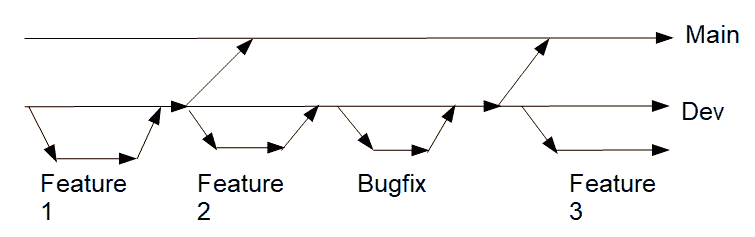
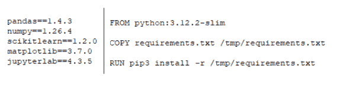
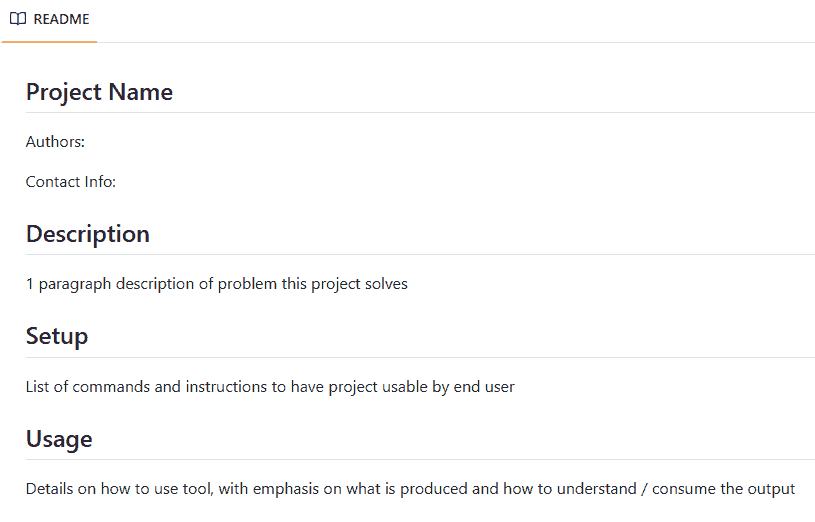
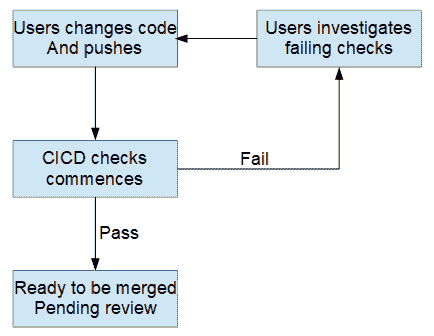

# 数据科学项目缩短价值实现时间：第四部分

> [`towardsdatascience.com/reducing-time-to-value-for-data-science-projects-part-4/`](https://towardsdatascience.com/reducing-time-to-value-for-data-science-projects-part-4/)

<mdspan datatext="el1755024170002" class="mdspan-comment">本系列中关于缩短项目价值实现时间的最后一部分（参见[第一部分](https://towardsdatascience.com/reducing-time-to-value-for-data-science-projects-part-1/)、[第二部分](https://towardsdatascience.com/reducing-time-to-value-for-data-science-projects-part-2/)和[第三部分](https://towardsdatascience.com/reducing-time-to-value-for-data-science-projects-part-3/))采取了一种不那么以实施为导向的方法，而是专注于代码开发的最佳实践。不是详细说明具体要编写什么和如何编写代码，我想谈谈你应该如何一般性地处理项目开发，这为之前所涵盖的所有内容奠定了基础。

## 引言

成为数据科学家意味着将众多不同的学科结合起来，并将它们应用于为企业创造价值。数据科学家最被看重的技能是技术能力，能够生产出可以立即投入使用的训练有素的模型。这涵盖了广泛的知识领域，如探索性数据分析、特征工程、数据转换、特征选择、超参数调整、模型训练和模型评估。仅学习这些步骤本身就是一项重大任务，尤其是在大型语言模型和生成式 AI 不断发展的世界中。数据科学家可以将所有学习都投入到成为技术高手，了解最先进模型内部运作的过程中。

虽然技术熟练度很重要，但如果你想要成为一名真正优秀的数据科学家，还需要培养其他技能。其中最重要的技能是成为一名优秀的软件开发者。能够编写健壮、灵活和可扩展的代码与掌握所有最新的技术和模型一样重要，甚至更为重要。缺乏这些软件技能会让不良实践渗透到你的工作中，最终导致代码可能不适合生产环境。拥抱软件开发原则将为你确保代码高质量提供一种结构化的方法，并加快整体项目开发过程。

本文将作为对多个书籍所讨论主题的简要介绍。因此，我并不期望这篇文章能全面地剖析所有软件开发的内容；相反，我希望这仅仅是你编写清晰代码、帮助推动企业价值之旅的起点。

## 正确设置您的 DevOps 平台

所有数据科学家都被教导在他们的教育中使用 Git 来执行诸如克隆仓库、创建分支、拉取/推送更改等任务。这些通常由 GitHub 或 GitLab 等平台支持，数据科学家乐于将这些平台纯粹用作远程存储代码的地方。然而，它们作为完整的 DevOps 平台提供了更多功能，并且以这种方式使用将极大地改善您的编码体验。

### 在您的仓库中为团队成员分配角色

许多人可能出于不同目的想要或需要访问你的项目仓库。出于安全考虑，限制每个人如何与之交互是一种良好的做法。人们可以承担的角色通常分为以下几类：

+   分析师：只需要能够读取仓库

+   开发者：需要能够读取和写入仓库

+   维护者：需要能够编辑仓库设置

对于数据科学家来说，你应该让项目中的高级员工担任维护者，而初级员工担任开发者。这在决定谁可以将更改合并到生产中时变得很重要。

### 管理分支

当使用 Git 开发项目时，你将广泛使用分支来添加功能/开发功能。分支可以分为不同的类别，例如：

+   main/master：用于官方生产发布

+   开发：用于汇集功能和功能

+   功能：在进行代码开发工作时应该使用什么

+   修复错误：用于小修复



正确管理分支结构可以简化开发过程。图片由作者提供

主分支和开发分支是特殊的，因为它们是永久的，代表着最接近生产的作业。因此，对这些分支必须特别小心，具体来说：

+   确保它们不能被删除

+   确保它们不能直接被推送

+   它们只能通过合并请求进行更新

+   限制谁可以将更改合并到其中

我们可以也应该保护这些分支来强制执行上述规则。这通常是项目维护者的工作。

当决定将功能添加到开发/主分支的合并策略时，我们需要考虑：

+   谁有权限触发和批准这些合并（特定角色/人员）？

+   在合并被接受之前需要多少个批准？

+   分支需要通过哪些检查才能被接受？

通常，我们对更新开发分支和更新主分支的控制可能不那么严格，但重要的是要有一个一致的策略。

当处理功能分支时，你需要考虑：

+   这个分支将被称为什么？

+   提交信息应该遵循什么样的结构？

重要的是，作为团队达成一致，制定分支命名的指南。一些例子可以是根据工单命名，有一个共同的列表作为分支的前缀，或者添加一个后缀以方便识别所有者。对于提交信息，你可能希望使用第三方库如 Commitizen 来在整个团队中强制标准化。

## 维护一致的开发环境

退一步，编写代码将需要你：

+   有权访问软件开发工具包中的编程语言

+   安装第三方库以开发你的解决方案

即使到了这个阶段，也必须小心。遇到解决方案在本地运行正常，而其他团队成员尝试运行时却失败的情况非常普遍。这是由于不一致的开发环境造成的：

+   安装了不同版本的编程语言

+   安装了第三方库的不同版本

确保每个人都在与生产条件相同的环境中开发，这将确保我们之间没有兼容性问题，解决方案将在生产中工作，并消除对库的临时安装的需求。以下是一些建议：

+   至少使用 requirements.txt / pyproject.toml。不要在运行时即时安装库！

+   考虑使用 docker / 容器化以拥有完全可交付的环境



一致的环境和库确保可重复性和减少摩擦。图片由作者提供

如果没有这些标准化措施，就无法保证你的解决方案在生产部署时能够正常工作

## Readme.md

当你在 DevOps 平台上打开一个项目时，首先看到的是 Readme。它为你提供了一个机会，提供项目的高级概述，并告知你的受众如何与之互动。在 Readme 中应包含的一些重要部分有：

+   项目标题、描述和设置，以便让人们加入

+   如何运行/使用，以便人们可以使用任何核心功能并解释结果

+   贡献者/联系人信息，以便人们跟进



一个一站式商店，让用户加入你的项目。图片由作者提供

Readme 不需要是关于项目所有相关内容的详尽文档，而只是一个快速入门指南。更详细的历史背景、实验结果等可以放在其他地方，例如内部 Wiki 如 Confluence。

## 测试，测试，再测试！

任何人都可以编写代码，但不是每个人都能编写正确且可维护的代码。确保你的代码没有错误是至关重要的，并且应该采取一切预防措施来减轻这种风险。最简单的方法是为你开发的任何代码编写测试。你可以编写不同类型的测试，例如：

+   单元测试：测试单个组件

+   集成测试：测试各个组件如何协同工作

+   回归测试：测试任何新更改是否破坏了现有功能

编写良好的单元测试依赖于编写良好的函数。函数应尽量遵循诸如“只做一件事”（DOT）或“不要重复自己”（DRY）的原则，以确保你可以编写清晰的测试。一般来说，你应该测试以下内容：

+   展示函数的工作情况

+   展示函数的失败情况

+   触发函数内抛出的任何异常

另一个需要考虑的重要方面是代码的测试覆盖率。虽然达到 100%的覆盖率是理想化的场景，但在实践中，你可能不得不接受更低的覆盖率，这是可以接受的。这通常发生在你加入一个现有项目，其中标准没有得到适当维护的情况下。重要的是要从一个覆盖率基线开始，然后随着时间的推移，随着解决方案的成熟，尝试增加覆盖率。这可能会涉及一些技术债务工作来编写测试。

```py
pytest --cov=src/ --cov-fail-under=20 --cov-report term --cov-report xml:coverage.xml --junitxml=report.xml tests
```

此示例 pytest 调用既运行了测试，又检查是否达到了最低覆盖率水平。

## 代码审查

编写代码最重要的部分之一是让另一位开发者审查和批准。审查代码可以确保：

+   生成的代码回答了原始问题

+   代码符合所需标准

+   代码使用了适当的实现

由于数据科学项目的实验性质，代码审查可能涉及额外步骤。虽然这不是一个详尽的列表，但一些一般的检查包括：

+   代码是否运行？

+   是否进行了充分的测试？

+   是否使用了适当的编程范式和数据结构？

+   代码是否易于阅读？

+   代码是否可维护和可扩展？

```py
def bad_function(keys, values, specifc_key):

    for i, key in enumerate(keys):
        if key == specific_key:
            value[i] = X
    return keys, values
```

上述代码片段突出了各种不良习惯，例如使用列表而不是字典，没有类型提示或文档字符串。从数据科学的角度来看，你还将希望检查以下内容：

+   笔记本是否被适当地使用并进行了适当的注释？

+   分析是否得到了充分的沟通（例如，图表标注，数据框描述等）

+   在生成模型时是否采取了适当的注意（没有数据泄露，仅使用推理时可用特征等）

+   是否生成了任何工件，并且它们是否被适当地存储？

+   实验是否按照高标准进行，例如，提出研究问题，跟踪和记录？

+   从这项工作中是否有明确的下一步行动？

将来会有你离开项目去做其他事情的时候，其他人将接管。在编写代码时，你应该始终问自己：

> 对于其他人来说，理解我所写的内容并舒适地维护或扩展功能有多容易？

## 使用 CICD 自动化日常任务

随着项目在人员和代码规模上的增长，拥有检查和标准变得越来越重要。这通常通过代码审查来完成，可能包括以下任务：

+   实现

+   测试

+   测试覆盖率

+   代码风格标准化

我们还希望检查安全相关的问题，例如暴露的 API 密钥/凭证或容易受到恶意攻击的代码。对于每次代码审查都需要手动检查所有这些内容，这很快就会变得耗时，也可能导致检查被忽视。许多这些检查可以通过第三方库来覆盖，例如：

+   Black, Flake8 和 isort

+   Pytest

虽然这减轻了一些审查者的工作负担，但仍然存在需要自行运行这些库的问题。更好的做法是能够自动化这些检查和其他检查，这样您就不再需要这样做。这可以使代码审查更加专注于解决方案和实现。这正是持续集成/持续部署（CICD）发挥作用的地方。



自动化检查可以释放开发者的时间。图片由作者提供

可用的持续集成/持续部署（CICD）工具有很多（GitLab Pipelines、GitHub Actions、Jenkins、Travis 等），它们允许自动化任务。我们可以更进一步，自动化构建环境甚至训练/部署模型的任务。虽然 CICD 可以涵盖整个软件开发过程，但我希望我已经激发了一些有用的例子，说明其在改善数据科学项目中的应用。

## 结论

本文总结了一系列文章，在这些文章中，我专注于如何通过更加严谨的代码开发和实验策略来缩短数据科学项目的价值实现时间。最后一篇文章涵盖了与软件开发相关的广泛主题，以及它们如何在数据科学环境中应用以改善您的编码体验。重点关注的关键领域包括充分利用 DevOps 平台，保持一致的开发环境，readme 文件和代码审查的重要性，以及通过持续集成/持续部署（CICD）利用自动化。所有这些都将确保您开发的软件足够健壮，能够帮助支持您的数据科学项目，并尽快为您的业务提供价值。
