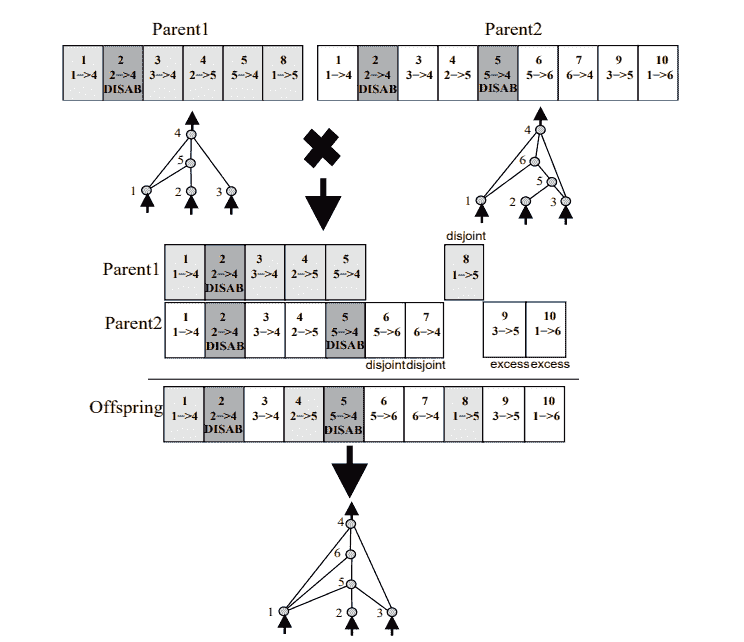

# 从基因到神经网络：从头开始理解并构建 NEAT（神经进化增强拓扑）

> [`towardsdatascience.com/from-genes-to-neural-networks-understanding-and-building-neat-neuro-evolution-of-augmenting-topologies-from-scratch/`](https://towardsdatascience.com/from-genes-to-neural-networks-understanding-and-building-neat-neuro-evolution-of-augmenting-topologies-from-scratch/)

## 引言

<mdspan datatext="el1754935272936" class="mdspan-comment">神经进化增强拓扑（NEAT）</mdspan>是一种强大的算法，由德克萨斯大学奥斯汀分校的 Kenneth O. Stanley 和 Risto Miikkulainen 于 2002 年提出，在[这篇论文](https://nn.cs.utexas.edu/downloads/papers/stanley.ec02.pdf)中介绍。NEAT 算法引入了一种新思想到标准的神经进化技术中，这些技术通过在代际间动态增加网络的复杂性来进化固定拓扑网络。

在这篇文章中，我将从头开始介绍 NEAT 算法及其在 Python 中的实现，重点关注算法的设计决策以及使 NEAT 既优雅又具有挑战性的复杂性。本文面向熟悉神经网络和进化计算基础的技术读者。

## 进化算法：一般概述

在深入研究 NEAT 之前，让我们回顾一下进化算法的基础。受遗传学和自然选择启发，进化算法是一种优化算法，通过迭代改进候选解决方案的种群来解决复杂问题。

核心思想是模仿生物进化的过程：

1.  **初始化**：这个过程首先通过生成一个初始的**种群**候选解决方案开始。这些初始解决方案是随机生成的，每个解决方案通常表示为一个“基因组”或“染色体”，它编码了其特征和特性。

1.  **评估**：根据每个个体解决给定问题的能力来评估种群中的每个个体。这是通过一个**适应度函数**来完成的，该函数为每个解决方案分配一个数值分数。适应度越高，解决方案越好。

1.  **选择**：根据它们的适应度，从种群中选择一个子集成为下一代“父母”。具有更高适应度分数的个体有更高的被选中概率。

1.  **繁殖**：选定的个体随后通过使用**遗传算子**繁殖，为下一代创建“后代”。在这个阶段有两个主要过程：

    +   **交叉**：将两个或多个父代基因组结合以产生新的后代基因组，合并有利特性。

    +   **变异**：在后代基因组中随机引入小的变化。这引入了新颖性并有助于探索搜索空间，防止算法陷入局部最优。

1.  **替换：** 新生成的后代替换当前种群（全部或部分），形成新一代。

1.  **终止条件：** 步骤 2–5 会重复执行固定次数的代数，直到达到某个适应度阈值，或者找到问题的满意解。

## NEAT 的独特之处在哪里？

NEAT 的突出之处在于它比常规进化算法走得更远，常规进化算法只进化网络的权重。NEAT 还进化网络的拓扑结构，使它们变得越来越复杂。

在 NEAT 之前，有两个主要挑战阻止了常规进化算法被用来动态调整网络的架构。NEAT 解决了这两个挑战：

+   **如何在拓扑结构多样化的网络之间进行交叉：** 在传统的遗传算法中，将具有截然不同结构的两个基因组结合在一起，往往会导致非功能性或畸形的后代。想象一下尝试将两个不同的神经网络结合起来，其中一个有三个隐藏层，而另一个只有一个，简单地平均权重或随机合并连接很可能会破坏网络的功能性。

+   **如何在具有截然不同拓扑结构的种群中保持多样性：** 当网络可以增长复杂性（添加新的节点和连接）时，这些结构变异通常会导致其适应度暂时下降。例如，一个新的连接可能在参数得到适当调整之前干扰现有网络的功能。因此，最近发生变异的网络可能会被更简单、更优化的网络提前竞争，即使新变体有潜力在更多时间后进化成更优解。这种过早收敛到局部最优解是常见的问题。

## NEAT 如何解决这些挑战

NEAT 通过两种巧妙机制解决这两个基本问题：历史标记（也称为创新数字）和物种形成。

#### 历史标记



来源：[*通过增强拓扑结构进化神经网络*](https://nn.cs.utexas.edu/downloads/papers/stanley.ec02.pdf)

为了解决在拓扑结构多样化的网络之间进行交叉的问题，NEAT 引入了**创新数字**的概念。当在变异过程中向网络添加新的连接或节点时，它会分配一个全局唯一的创新数字。这个数字作为一个历史标记，表明了该特定遗传特征的起源历史。

让我们看看上图中的例子，其中我们有两个网络，“父代 1”和“父代 2”正在进行交叉。我们可以看到，两个网络都有一个从节点 2 到节点 5 的连接，创新数字为 4。这告诉我们，这个连接必须是在某个时候从共同祖先那里被两个网络继承的。然而，我们也可以看到“父代 1”有一个从节点 1 到节点 5 的连接，创新数字为 8，但“父代 2”没有这个连接。这表明“父代 1”独立进化了这个特定的连接。

在交叉过程中，NEAT 根据创新数字将两个父母的基因（节点和连接）对齐。

+   **匹配基因**（具有相同创新数字的基因）从任一父母那里随机继承。

+   **不连续基因**（存在于一个父母中但不在另一个父母中，并且创新数字在另一个父母基因的范围内）通常从更适应的父母那里继承。

+   **多余基因**（存在于一个父母中但不在另一个父母中，并且创新数字超出另一个父母基因的范围，这意味着它们在进化历史中出现较晚）通常也来自更适应的父母。

整个过程确保了网络中功能相似的部分被正确组合，即使它们的整体结构差异很大。

#### 物种形成

为了在具有极大不同拓扑结构的种群中保持多样性，并防止过早收敛，NEAT 采用了一种称为**物种形成**的技术。通过物种形成，种群被划分为基于拓扑相似性的不同“物种”。同一物种内的网络更有可能共享共同的祖先特征，因此结构更相似。

两个网络（基因组）之间的相似度是通过兼容度距离函数计算的。该函数考虑了三个组成部分：

+   **不连续基因**（存在于一个基因组中但不在另一个基因组中，但位于共享的历史范围内）的数量。

+   **多余基因**（存在于一个基因组中但不在另一个基因组中，并且位于共享历史范围之外）的数量。

+   匹配基因的**平均权重差异**。

如果两个网络之间的兼容度距离低于某个阈值，它们被认为是属于同一物种。

通过物种形成种群，NEAT 确保：

+   **竞争仅在物种内部发生**：这保护了新颖或不太复杂的结构免受高度复杂但可能目前次优设计的即时竞争。

+   **每个物种都有机会创新和改进**：每个物种的最佳个体被允许繁殖（精英主义），促进不同拓扑生态位内独特解决方案的进化。

+   **如果物种不成功，它们可能会灭绝**：如果一个物种持续表现不佳，它将缩小并最终消失，为更有希望的遗传线腾出空间。

## NEAT 的核心组件

NEAT 算法中有四个核心组件：

#### 节点基因

每个节点基因代表神经网络中的一个神经元。每个节点具有：

+   一个 ID（唯一标识符）

+   一层：它可以是输入层、隐藏层或输出层

+   激活函数

+   偏置值

```py
class NodeGene:
    def __init__(self, id, layer, activation, bias):
        self.id = id
        self.layer = layer  # The layer to which the node belongs
        self.activation = activation    # Activation function
        self.bias = bias
```

#### 连接基因

连接基因（突触）代表网络中神经元之间的连接。每个连接基因具有：

+   输入节点 ID

+   输出节点 ID

+   权重

+   启用标志（指示连接是否启用）

+   创新编号（在连接首次创建时分配的唯一标识符）

```py
class ConnectionGene:
    def __init__(self, in_node_id: int, out_node_id: int, weight: float,  innov: int, enabled: bool = True):
        self.in_node_id = in_node_id
        self.out_node_id = out_node_id
        self.weight = weight
        self.enabled = enabled  # Whether the connection is enabled or not
        self.innov = innov  # Innovation number described in the paper
```

#### 基因组

基因组是 NEAT 算法中单个神经网络的“遗传蓝图”。它本质上是一组定义网络结构和参数的所有节点和连接基因。有了基因组，我们可以在以后构建实际的运行网络（我们将其称为*表型*）。每个基因组代表种群中的一个个体。

```py
class Genome:
    def __init__(self, nodes, connections):
        self.nodes = {node.id: node for node in nodes if node is not None}
        self.connections = [c.copy() for c in connections]
        self.fitness = 0
```

#### 创新追踪器

任何 NEAT 实现中的关键组件是一个**创新追踪器**。这是我对此机制的自定义实现，它负责在整个过程中为每个新创建的连接和节点分配和跟踪唯一的创新编号。这确保了历史标记在整个种群中的一致性，这对于在交叉过程中正确对齐基因是基本要求。

```py
class InnovationTracker:
    def __init__(self):
        self.current_innovation = 0
        self.connection_innovations = {}  # (in_node_id, out_node_id) -> innovation_number
        self.node_innovations = {}        # connection_innovation -> (node_innovation, conn1_innovation, conn2_innovation)
        self.node_id_counter = 0

    def get_connection_innovation(self, in_node_id, out_node_id):
        """Get innovation number for a connection, creating new if needed"""
        key = (in_node_id, out_node_id)
        if key not in self.connection_innovations:
            self.connection_innovations[key] = self.current_innovation
            self.current_innovation += 1
        return self.connection_innovations[key]

    def get_node_innovation(self, connection_innovation):
        """Get innovation numbers for node insertion, creating new if needed"""
        if connection_innovation not in self.node_innovations:
            # Create new node and two connections
            node_id = self.node_id_counter
            self.node_id_counter += 1

            conn1_innovation = self.current_innovation
            self.current_innovation += 1
            conn2_innovation = self.current_innovation
            self.current_innovation += 1

            self.node_innovations[connection_innovation] = (node_id, conn1_innovation, conn2_innovation)
        return self.node_innovations[connection_innovation]
```

## NEAT 算法流程

在理解了核心组件之后，现在我们可以将它们组合起来，了解 NEAT 是如何工作的。在示例中，算法试图解决 XOR 问题。

#### 1. 初始化

基因组的第一个版本总是以一个非常简单和固定的结构创建。这种方法符合 NEAT 的“从简单开始，逐渐增加复杂性”的哲学，确保它首先探索最简单的解决方案，然后逐渐增加复杂性。

在此代码示例中，我们使用最小结构初始化网络：一个没有隐藏层的全连接网络。

```py
def create_initial_genome(num_inputs, num_outputs, innov: InnovationTracker):
    input_nodes = []
    output_nodes = []
    connections = []

    # Create input nodes
    for i in range(num_inputs):
        node = NodeGene(i, "input", lambda x: x, 0)
        input_nodes.append(node)

    # Create output nodes
    for i in range(num_outputs):
        node_id = num_inputs + i    # We start the ids where we left in the previous loop
        node = NodeGene(node_id, "output", sigmoid, random.uniform(-1, 1))
        output_nodes.append(node)

    # Update the innov tracker's node id
    innov.node_id_counter = num_inputs + num_outputs

    # Create connections
    for i in range(num_inputs):
        for j in range(num_outputs):
            in_node_id = i
            out_node_id = j + num_inputs
            innov_num = innov.get_connection_innovation(in_node_id, out_node_id)
            weight = random.uniform(-1, 1)
            conn = ConnectionGene(in_node_id, out_node_id, weight, innov_num, True)
            connections.append(conn)

    all_nodes = input_nodes + output_nodes
    return Genome(all_nodes, connections)
```

```py
def create_initial_population(size, num_inputs, num_outputs, innov):
    population = []
    for _ in range(size):
        genome = create_initial_genome(num_inputs, num_outputs, innov)
        population.append(genome)
    return population
```

#### 2. 评估种群适应度

在初始种群设置完成后，NEAT 算法进入主进化循环。这个循环重复预定义的代数，或者直到其解决方案达到一个适应度阈值。每一代都要经历一系列关键步骤：评估、物种形成、适应度调整和繁殖。第一步是评估种群中每个个体的适应度。为此，我们首先必须完成以下步骤：

1.  **表型表达**：对于每个基因组，我们首先需要将其表达为其表型（一个可运行的神经网络）。这涉及到从基因组内的*节点*和*连接*列表中构建实际的神经网络。

1.  **正向传播**：一旦网络构建完成，我们使用给定的输入进行正向传播以产生输出。

1.  **适应性计算：** 给定网络的输入和输出，现在可以使用适应性函数来计算其适应性。适应性函数是特定于问题的，旨在返回一个数值分数，表示网络实现其目标的好坏。

```py
def topological_sort(edges):
  """ Helper function to sort the network's nodes """
        visited = set()
        order = []

        def visit(n):
            if n in visited:
                return
            visited.add(n)
            for m in edges[n]:
                visit(m)
            order.append(n)

        for node in edges:
            visit(node)

        return order[::-1]

class Genome:
    ... # The rest of the methods would go here

    def evaluate(self, input_values: list[float]):
      """ 
          Method of the Genome class.
          Performs the phenotype expression and forward pass
      """
        node_values = {}
        node_inputs = {n: [] for n in self.nodes}

        input_nodes = [n for n in self.nodes.values() if n.layer == "input"]
        output_nodes = [n for n in self.nodes.values() if n.layer == "output"]

        # Verify that the number of input values matches the number of input nodes
        if len(input_nodes) != len(input_values):
            raise ValueError(f"Number of inputs doesn't match number of input nodes. Input={len(input_nodes)}, num_in_val={len(input_values)}")

        # Assign input values
        for node, val in zip(input_nodes, input_values):
            node_values[node.id] = val

        edges = {}
        for n in self.nodes.values():
            edges[n] = []

        for conn in self.connections:  # Only construct enabled connections
            if conn.enabled:
                in_node = self.get_node(conn.in_node_id)
                out_node = self.get_node(conn.out_node_id)
                edges[in_node].append(out_node)
                node_inputs[conn.out_node_id].append(conn)

        sorted_nodes = topological_sort(edges)

        for node in sorted_nodes:
            if node.id in node_values:
                continue

            incoming = node_inputs[node.id]
            total_input = sum(
                node_values[c.in_node_id] * c.weight for c in incoming
            ) + node.bias

            node_values[node.id] = node.activation(total_input)

        return [node_values.get(n.id, 0) for n in output_nodes]
```

```py
def fitness_xor(genome):
    """Calculate fitness for XOR problem"""
    # XOR Problem data
    X = [[0, 0], [0, 1], [1, 0], [1, 1]]
    y = [0, 1, 1, 0]
    total_error = 0
    for i in range(len(X)):
        try:
            output = genome.evaluate(X[i])
            # print(f"Output: {output}")
            if output:
                error = abs(output[0] - y[i])
                total_error += error
            else:
                error = y[i]
                total_error += error
        except Exception as e:
            print(f"Error: {e}")
            return 0  # Return 0 fitness if evaluation fails

    fitness = 4 - total_error
    return max(0, fitness)
```

#### 3. 物种形成

与让所有个体在全球范围内竞争不同，NEAT 将种群划分为物种，将拓扑结构相似的基因组放在一起。这种方法防止新的拓扑创新立即被更大、更成熟的物种所取代，并允许它们成熟。

每一代物种形成的过程包括：

1.  **测量兼容性：** 我们使用兼容度距离函数来衡量两个基因组之间的差异。它们之间的距离越短，两个基因组就越相似。以下代码实现使用了原始论文中提出的公式，并采用了建议的参数。

```py
def distance(genome1: Genome, genome2: Genome, c1=1.0, c2=1.0, c3=0.4):
    genes1 = {g.innov: g for g in genome1.connections}
    genes2 = {g.innov: g for g in genome2.connections}

    innovations1 = set(genes1.keys())
    innovations2 = set(genes2.keys())

    matching = innovations1 & innovations2
    disjoint = (innovations1 ^ innovations2)
    excess = set()

    max_innov1 = max(innovations1) if innovations1 else 0
    max_innov2 = max(innovations2) if innovations2 else 0
    max_innov = min(max_innov1, max_innov2)

    # Separate excess from disjoint
    for innov in disjoint.copy():
        if innov > max_innov:
            excess.add(innov)
            disjoint.remove(innov)

    # Weight difference of matching genes
    if matching:
        weight_diff = sum(
            abs(genes1[i].weight - genes2[i].weight) for i in matching
        )
        avg_weight_diff = weight_diff / len(matching)
    else:
        avg_weight_diff = 0

    # Normalize by N
    N = max(len(genome1.connections), len(genome2.connections))
    if N < 20:  # NEAT typically uses 1 if N < 20
        N = 1

    delta = (c1 * len(excess)) / N + (c2 * len(disjoint)) / N + c3 * avg_weight_diff
    return delta
```

2. **分组为物种：** 在每一代的开始，物种形成者负责将所有基因组分类为现有或新物种。每个物种都有一个代表基因组，它作为基准，用于将种群中的每个个体与之比较，以确定其是否属于该物种。

```py
class Species:
    def __init__(self, representative: Genome):
        self.representative = representative
        self.members = [representative]
        self.adjusted_fitness = 0
        self.best_fitness = -float('inf')
        self.stagnant_generations = 0

    def add_member(self, genome: Genome):
        self.members.append(genome)

    def clear_members(self):
        self.members = []

    def update_fitness_stats(self):
        if not self.members:
            self.adjusted_fitness = 0
            return

        current_best_fitness = max(member.fitness for member in self.members)

        # Check for improvement and update stagnation
        if current_best_fitness > self.best_fitness:
            self.best_fitness = current_best_fitness
            self.stagnant_generations = 0
        else:
            self.stagnant_generations += 1

        self.adjusted_fitness = sum(member.fitness for member in self.members) / len(self.members)
```

```py
class Speciator:
    def __init__(self, compatibility_threshold=3.0):
        self.species = []
        self.compatibility_threshold = compatibility_threshold

    def speciate(self, population: list[Genome]):
        """ Group genomes into species based on distance """
        # Clear all species for the new generation
        for s in self.species:
            s.clear_members()

        for genome in population:
            found_species = False
            for species in self.species:
                if distance(genome, species.representative) < self.compatibility_threshold:
                    species.add_member(genome)
                    found_species = True
                    break

            if not found_species:
                new_species = Species(representative=genome)
                self.species.append(new_species)

        # Remove empty species
        self.species = [s for s in self.species if s.members]

        # Recompute adjusted fitness
        for species in self.species:
            species.update_fitness_stats()
            # Update representative to be the best member
            species.representative = max(species.members, key=lambda g: g.fitness)

    def get_species(self):
        return self.species
```

#### 4. 调整适应性

即使基因组被分组为物种，原始的适应性值也不足以允许公平的繁殖。较大的物种自然会产生更多的后代，可能会压倒可能持有有希望但尚处于萌芽状态的创新的小物种。为了应对这种情况，NEAT 采用**调整后的适应性**，并根据物种的表现调整适应性。

为了调整个体的适应性，其适应性被分配给其物种中个体的数量。此机制在*Species*类中的*update_fitness_stats*方法中实现。

#### 5. 繁殖

在物种形成和调整适应性之后，算法进入繁殖阶段，通过选择、交叉和变异的组合来创建下一代基因组。

1.  **选择：** 在此实现中，选择是通过主进化循环中的精英主义来完成的。

2. **交叉：** 此实现的一些关键方面包括：

+   节点继承：显式确保输入和输出节点被传递给后代。这样做是为了确保网络的 功能不受破坏。

+   匹配基因：当两个父母都有一个具有相同创新号的基因时，随机选择其中一个。如果该基因在任一父母中已被禁用，那么在后代中该基因被禁用的概率为 75%。

+   过剩基因：较不适应父母的过剩基因不会被继承。

```py
def crossover(parent1: Genome, parent2: Genome) -> Genome:
    """ Crossover assuming parent1 is the fittest parent """
    offspring_connections = []
    offspring_nodes = set()
    all_nodes = {}  # Collect all nodes from both parents

    for node in parent1.nodes.values():
        all_nodes[node.id] = node.copy()
        if node.layer in ("input", "output"):
            offspring_nodes.add(all_nodes[node.id]) # Ensure the input and output nodes are included
    for node in parent2.nodes.values():
        if node.id not in all_nodes:
            all_nodes[node.id] = node.copy()        

    # Build maps of genes keyed by innovation number
    genes1 = {g.innov: g for g in parent1.connections}
    genes2 = {g.innov: g for g in parent2.connections}

    # Combine all innovation numbers
    all_innovs = set(genes1.keys()) | set(genes2.keys())

    for innov in sorted(all_innovs):
        gene1 = genes1.get(innov)
        gene2 = genes2.get(innov)

        if gene1 and gene2:  # Matching genes
            selected = random.choice([gene1, gene2])
            gene_copy = selected.copy()

            if not gene1.enabled or not gene2.enabled:  # 75% chance of the offsprign gene being disabled
                if random.random() < 0.75:
                    gene_copy.enabled = False

        elif gene1 and not gene2:   # Disjoint gene (from the fittest parent)
            gene_copy = gene1.copy()

        else:   # Not taking disjoint genes from less fit parent
            continue

        # get nodes
        in_node = all_nodes.get(gene_copy.in_node_id)
        out_node = all_nodes.get(gene_copy.out_node_id)

        if in_node and out_node:
            offspring_connections.append(gene_copy)
            offspring_nodes.add(in_node)
            offspring_nodes.add(out_node)

    offspring_nodes = list(offspring_nodes) # Remove the duplicates

    return Genome(offspring_nodes, offspring_connections)
```

3. **变异：** 在交叉之后，对后代应用变异。此实现的一个关键方面是我们避免在添加连接时形成循环。

```py
class Genome:
    ... # The rest of the methods would go here

    def _path_exists(self, start_node_id, end_node_id, checked_nodes=None):
        """ Recursive function to check whether a apth between two nodes exists."""
        if checked_nodes is None:
            checked_nodes = set()

        if start_node_id == end_node_id:
            return True

        checked_nodes.add(start_node_id)
        for conn in self.connections:
            if conn.enabled and conn.in_node_id == start_node_id:
                if conn.out_node_id not in checked_nodes:
                    if self._path_exists(conn.out_node_id, end_node_id, checked_nodes):
                        return True
        return False

    def get_node(self, node_id):
        return self.nodes.get(node_id, None)

    def mutate_add_connection(self, innov: InnovationTracker):
        node_list = list(self.nodes.values())

        # Try max 10 times
        max_tries = 10
        found_appropiate_nodes = False

        for _ in range(max_tries):
            node1, node2 = random.sample(node_list, 2)

            if (node1.layer == "output" or (node1.layer == "hid" and node2.layer == "input")):
                node1, node2 = node2, node1 # Swap them
            # Check if it's creating a loop to the same node
            if node1 == node2:
                continue
            # Check if it's creating a connection between two nodes on the same layer
            if node1.layer == node2.layer:
                continue
            if node1.layer == "output" or node2.layer == "input":
                continue

            # Check whether the connection already exists
            conn_exists=False
            for c in self.connections:
                if (c.in_node_id == node1.id and c.out_node_id == node2.id) or\
                   (c.in_node_id == node2.id and c.out_node_id == node1.id):
                    conn_exists = True
                    break

            if conn_exists:
                continue
            # If there is a path from node2 to node1, then adding a connection from node1 to node2 creates a cycle
            if self._path_exists(node2.id, node1.id):
                continue

            innov_num = innov.get_connection_innovation(node1.id, node2.id)
            new_conn = ConnectionGene(node1.id, node2.id, random.uniform(-1, 1), innov_num, True)
            self.connections.append(new_conn)
            return

    def mutate_add_node(self, innov: InnovationTracker):
        enabled_conn = [c for c in self.connections if c.enabled]
        if not enabled_conn:
            return
        connection = random.choice(enabled_conn)    # choose a random enabled connectin
        connection.enabled = False  # Disable the connection

        node_id, conn1_innov, conn2_innov = innov.get_node_innovation(connection.innov) 

        # Create node and connections
        new_node = NodeGene(node_id, "hid", ReLU, random.uniform(-1,1))
        conn1 = ConnectionGene(connection.in_node_id, node_id, 1, conn1_innov, True)
        conn2 = ConnectionGene(node_id, connection.out_node_id, connection.weight, conn2_innov, True)

        self.nodes[node_id] = new_node
        self.connections.extend([conn1, conn2])

    def mutate_weights(self, rate=0.8, power=0.5):
        for conn in self.connections:
            if random.random() < rate:
                if random.random() < 0.1:
                    conn.weight = random.uniform(-1, 1)
                else:
                    conn.weight += random.gauss(0, power)
                    conn.weight = max(-5, min(5, conn.weight))  # Clamp weights

    def mutate_bias(self, rate=0.7, power=0.5):
        for node in self.nodes.values():
            if node.layer != "input" and random.random() < rate:
                if random.random() < 0.1:
                    node.bias = random.uniform(-1, 1)
                else:
                    node.bias += random.gauss(0, power)
                    node.bias = max(-5, min(5, node.bias))

    def mutate(self, innov, conn_mutation_rate=0.05, node_mutation_rate=0.03, weight_mutation_rate=0.8, bias_mutation_rate=0.7):
        self.mutate_weights(weight_mutation_rate)
        self.mutate_bias(bias_mutation_rate)

        if random.random() < conn_mutation_rate:
            self.mutate_add_connection(innov)

        if random.random() < node_mutation_rate:
            self.mutate_add_node(innov)
```

#### 6. 在主进化循环中重复此过程

一旦所有后代生成并且新种群形成，当前一代结束，新种群成为下一进化周期的起点。这由一个主要的进化循环处理，它协调整个算法。

```py
def evolution(population, fitness_scores, speciator: Speciator, innov: InnovationTracker, stagnation_limit: int = 15):
new_population = []

# Assign fitness to genomes
for genome, fitness in zip(population, fitness_scores):
genome.fitness = fitness

# Speciate population
speciator.speciate(population)
species_list = speciator.get_species()
species_list.sort(key=lambda s: s.best_fitness, reverse=True) # Sort species by best_fitness
print(f"Species created: {len(species_list)}")

# Remove stagnant species
surviving_species = []
if species_list:
surviving_species.append(species_list[0]) # Keep the best one regardless of stagnation
for s in species_list[1:]:
if s.stagnant_generations < stagnation_limit:
surviving_species.append(s)

species_list = surviving_species
print(f"Species that survived: {len(species_list)}")

total_adjusted_fitness = sum(s.adjusted_fitness for s in species_list)
print(f"Total adjusted fitness: {total_adjusted_fitness}")

# elitism
for species in species_list:
if species.members:
best_genome = max(species.members, key=lambda g: g.fitness)
new_population.append(best_genome)

remaining_offspring = len(population) - len(new_population)

# Allocate the remaining offspring
for species in species_list:
if total_adjusted_fitness > 0:
offspring_count = int((species.adjusted_fitness / total_adjusted_fitness) * remaining_offspring) # The more fit species will have more offspring
else:
offspring_count = remaining_offspring // len(species_list) # If all the species performed poorly, assign offspring evenly between them

if offspring_count > 0:
offspring = reproduce_species(species, offspring_count, innov)
new_population.extend(offspring)

# Ensure there are enough individuals (we could have less because of the rounding error)
while len(new_population) < len(population):
best_species = max(species_list, key=lambda s: s.adjusted_fitness)
offspring = reproduce_species(best_species, 1, innov)
new_population.extend(offspring)

return new_population
```

#### 7. 运行算法

```py
def run_neat_xor(save_best=False, generations=50, pop_size=50, target_fitness=3.9, speciator_threshold=2.0):
    NUM_INPUTS = 2
    NUM_OUTPUTS = 1

    # Initialize Innovation Number and Speciator
    innov = InnovationTracker()
    speciator = Speciator(speciator_threshold)

    # Create initial population
    population = create_initial_population(pop_size, NUM_INPUTS, NUM_OUTPUTS, innov)

    # Stats
    best_fitness_history = []
    avg_fitness_history = []
    species_count_history = []

    # main loop
    for gen in range(generations):
        fitness_scores = [fitness_xor(g) for g in population]
        print(f"fitness: {fitness_scores}")

        # get the stats
        best_fitness = max(fitness_scores)
        avg_fitness = sum(fitness_scores) / len(fitness_scores)
        best_fitness_history.append(best_fitness)
        avg_fitness_history.append(avg_fitness)
        print(f"Generation {gen}: Best={best_fitness}, Avg={avg_fitness}")

        # Check if we achieved the target fitness
        if best_fitness >= target_fitness:
            print(f"Problem was solved in {gen} generations")
            print(f"Best fitness achieved: {max(best_fitness_history)}")

            best_genome = population[fitness_scores.index(best_fitness)]

            if save_best:
                with open("best_genome.pkl", "wb") as f:
                    pickle.dump(best_genome, f)

            return best_genome, best_fitness_history, avg_fitness_history, species_count_history

        population = evolution(population, fitness_scores, speciator, innov)

    print(f"Couldn't solve the XOR problem in {generations} generations")
    print(f"Best fitness achieved: {max(best_fitness_history)}")
    return None, best_fitness_history, avg_fitness_history, species_count_history
```

## 完整代码

[Github 代码](https://github.com/Charly21r/NEAT-implementation)
