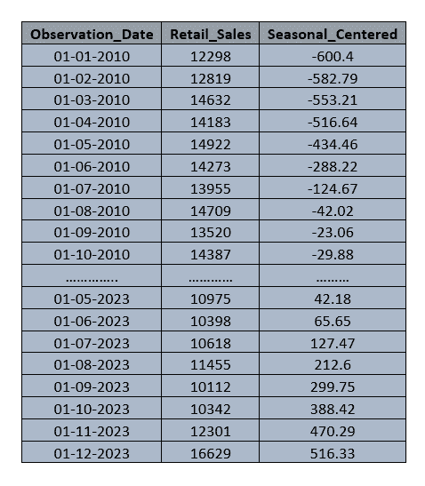
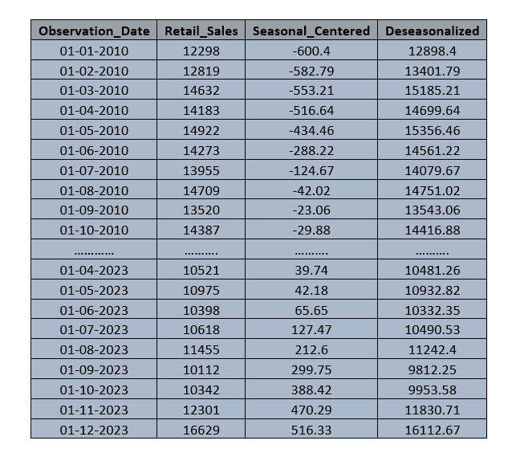
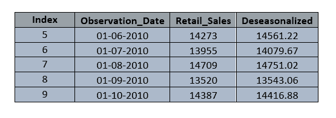
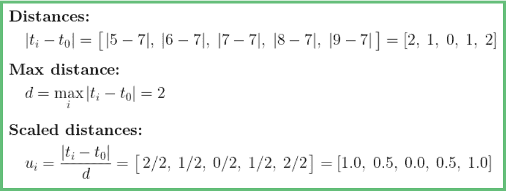
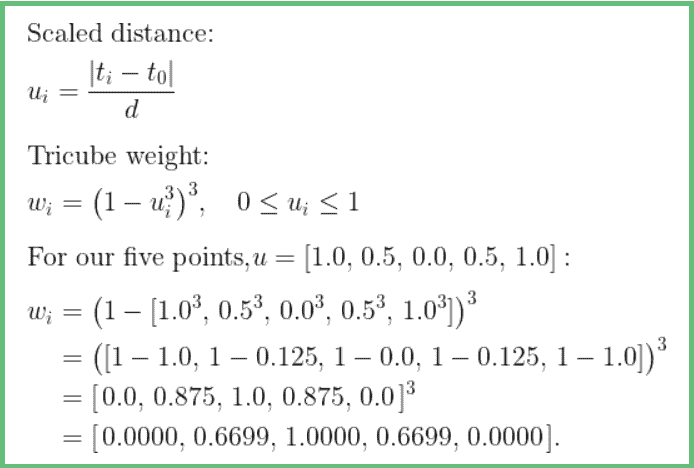
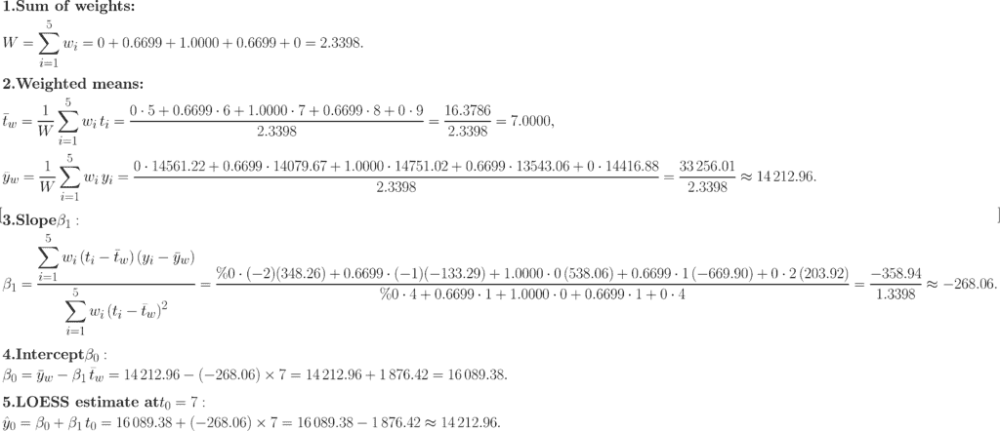
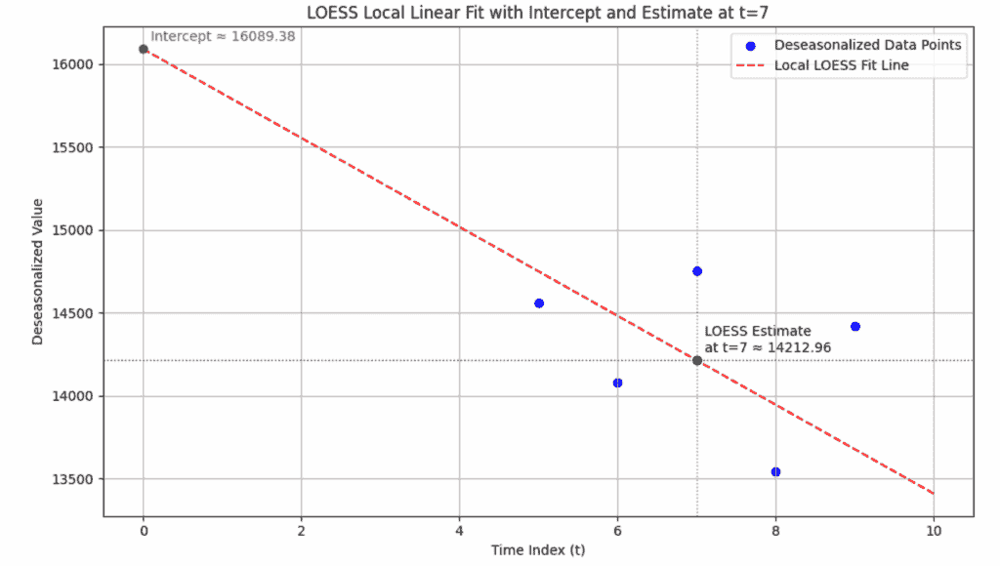
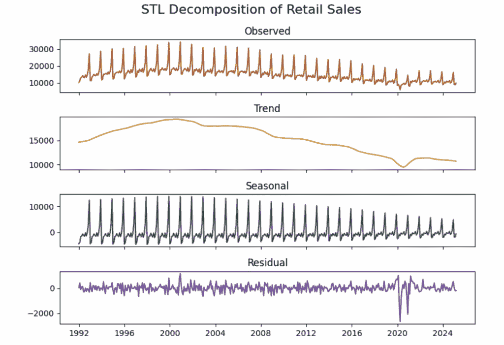

# 时间序列预测简单化（第 3.2 部分）：深入探讨基于 LOESS 的平滑

> [`towardsdatascience.com/time-series-forecasting-made-simple-part-3-2-a-deep-dive-into-loess-based-smoothing/`](https://towardsdatascience.com/time-series-forecasting-made-simple-part-3-2-a-deep-dive-into-loess-based-smoothing/)

在 **[第 3.1 部分](https://towardsdatascience.com/time-series-forecasting-made-simple-part-3-1-stl-decomposition-understanding-initial-trend-and-seasonality-prior-to-loess-smoothing/)** 中，我们开始讨论 STL 分解如何将时间序列数据分解为趋势、季节性和残差成分，由于它是一种基于平滑的技术，这意味着我们需要对趋势和季节性进行粗略估计，以便 STL 进行平滑。

为了这个目的，我们通过使用中心移动平均法计算了一个趋势的粗略估计，然后使用这个初始趋势，我们还计算了初始的季节性。（详细的数学讨论见 **第 3.1 部分**）

在本部分，我们实现 **LOESS (局部估计散点图平滑) 方法** 以获取时间序列的最终趋势和季节成分。

在 3.1 部分的结尾，我们有以下数据：



**表：第 3.1 部分的中心化季节值**

由于我们有了中心化的季节成分，下一步就是从原始时间序列中减去这部分以获得去季节化序列。



**表：去季节化值**

我们得到了去季节化值的序列，我们知道这包含了趋势和残差成分。

**现在我们将 LOESS (局部估计散点图平滑) 应用于这个去季节化序列。**

在这里，我们的目标是理解 LOESS 技术背后的概念和数学。为此，我们考虑去季节化序列中的一个单独数据点，并逐步实现 LOESS，观察值是如何变化的。

* * *

在理解 LOESS 背后的数学之前，我们试图理解 LOESS 平滑过程中的实际操作是什么。

LOESS 是类似于简单线性回归的过程，但这里的唯一区别是，我们给点分配权重，使得靠近目标点的点获得更多的权重，远离目标点的点获得较少的权重。

我们可以将其称为加权简单线性回归。

在这里，目标点是 LOESS 平滑执行的位置，在这个过程中，我们选择一个介于 0 和 1 之间的 alpha 值。

我们通常使用 0.3 或 0.5 作为 alpha 值。

例如，假设 alpha = 0.3，这意味着 30% 的数据点用于这个回归，这意味着如果我们有 100 个数据点，那么在目标点之前和之后（包括目标点）使用 15 个点进行平滑过程。

与简单线性回归类似，在这个平滑过程中，我们给数据点添加权重，并拟合一条线。

我们给数据点添加权重，因为这有助于线适应数据的局部行为，忽略波动或异常值，因为我们试图在这个过程中估计趋势成分。

现在我们已经了解到在 LOESS 平滑过程中，我们拟合一条最佳拟合数据的线，并从那条线计算目标点的平滑值。

接下来，我们将通过以一个点为例来实现 LOESS 平滑。

***

让我们通过以一个点为例来尝试理解 LOESS 平滑实际上是如何进行的。

以 2010 年 01 月 08 日为例，这里去季节化的值是 14751.02。

现在为了更容易地理解 LOESS 背后的数学，让我们考虑五个点的跨度。

这里五个点的跨度意味着我们考虑的是最接近目标点（2010-08-01）的点，包括目标点本身。



图片由作者提供

为了展示 2010 年 8 月的 LOESS 平滑处理，我们考虑了从 2010 年 6 月到 2010 年 10 月的数据值。

这里索引值（从零开始）来自原始数据。

LOESS 平滑的第一步是计算目标点与邻近点之间的距离。

我们根据索引值计算这个距离。



图片由作者提供

我们计算了距离，目标点的最大距离是‘2’。

现在 LOESS 平滑的下一步是计算三立方权重，LOESS 根据缩放距离为每个点分配权重。



图片由作者提供

这里五个点的三立方权重是[0.00, 0.66, 1.00, 0.66, 0.00]。

现在我们已经计算了三立方权重，下一步是执行加权简单线性回归。

公式与线性回归（SLR）类似，只是将常规平均值替换为加权平均值。

这里是计算 t=7 时 LOESS 平滑值的完整逐步数学过程。



图片由作者提供



图片由作者提供

这里 2010 年 8 月的 LOESS 趋势估计值是 14212.96，这低于去季节化的值 14751.02。

在我们的 5 点窗口中，如果我们看到邻近月份的值，我们可以观察到值在下降，而 8 月的值看起来像是一个突然的跳跃。

LOESS 试图拟合一条最佳拟合数据的线，它代表了潜在的本地区域趋势；它平滑掉了尖锐的峰值或低谷，并给出了数据的真实局部行为。

***

这就是 LOESS 如何计算数据点的平滑值。

对于我们的数据集，当我们使用 Python 实现 STL 分解时，alpha 值可能介于 0.3 和 0.5 之间，这取决于数据集中的点数。

我们还可以尝试不同的 alpha 值，看看哪一个最能代表数据，并选择合适的值。

这个过程对数据中的每一个点都重复进行。

一旦我们获得 LOESS 平滑趋势成分，就从原始序列中减去它以隔离季节性和噪声。

接下来，我们遵循相同的 LOESS 平滑程序，对季节性子序列（如所有一月份、二月份等）进行平滑处理（如第 3.1 部分所述），以获得 LOESS 平滑季节性成分。

在获得 LOESS 平滑趋势和季节性成分后，我们从原始序列中减去它们以获得残差。

之后，整个过程重复进行以进一步细化组成部分，从原始序列中减去 LOESS 平滑季节性成分以找到 LOESS 平滑趋势，然后从这个新的 LOESS 平滑趋势中减去原始序列以找到 LOESS 平滑季节性。

我们可以将这个过程称为一次迭代，经过几轮迭代（10-15 轮）后，三个组成部分趋于稳定，不再发生变化，STL 返回最终趋势、季节性和残差成分。

这就是我们使用以下代码在数据集上应用 STL 分解以获取三个成分时发生的情况。

```py
import pandas as pd
import matplotlib.pyplot as plt
from statsmodels.tsa.seasonal import STL

# Load the dataset
df = pd.read_csv("C:/RSDSELDN.csv", parse_dates=['Observation_Date'], dayfirst=True)
df.set_index('Observation_Date', inplace=True)
df = df.asfreq('MS')  # Ensure monthly frequency

# Extract the time series
series = df['Retail_Sales']

# Apply STL decomposition
stl = STL(series, seasonal=13)
result = stl.fit()

# Plot and save STL components
fig, axs = plt.subplots(4, 1, figsize=(10, 8), sharex=True)

axs[0].plot(result.observed, color='sienna')
axs[0].set_title('Observed')

axs[1].plot(result.trend, color='goldenrod')
axs[1].set_title('Trend')

axs[2].plot(result.seasonal, color='darkslategrey')
axs[2].set_title('Seasonal')

axs[3].plot(result.resid, color='rebeccapurple')
axs[3].set_title('Residual')

plt.suptitle('STL Decomposition of Retail Sales', fontsize=16)
plt.tight_layout()

plt.show()
```



图片由作者提供

**数据集：**本博客使用来自 FRED（联邦储备经济数据）的公开数据。*零售销售：百货商店（RSDSELD）*系列由美国人口普查局发布，可用于分析和发表，并需适当引用。

官方引用：

美国人口普查局，*零售销售：百货商店* [RSDSELD]，从圣路易斯联邦储备银行 FRED 获取；[`fred.stlouisfed.org/series/RSDSELD`](https://fred.stlouisfed.org/series/RSDSELD)，2025 年 7 月 7 日。

**注意：除非另有说明，所有图片均由作者提供。**

希望您已经对 STL 分解的工作原理有了基本的了解，从计算初始趋势和季节性到使用 LOESS 平滑找到最终成分。

在系列的下文中，我们将详细讨论“**时间序列的平稳性”**。

感谢阅读！
