# 上下文工程——使用 DSPy 的综合实战教程

> [`towardsdatascience.com/context-engineering-a-comprehensive-hands-on-tutorial-with-dspy/`](https://towardsdatascience.com/context-engineering-a-comprehensive-hands-on-tutorial-with-dspy/)

<mdspan datatext="el1754438607464" class="mdspan-comment">你现在可能已经听说过</mdspan> **上下文工程**了。本文将涵盖使用上下文工程原则创建 LLM 应用的关键思想，直观地解释这些工作流程，并分享实际应用这些概念的代码片段。

不要担心将本文中的代码复制粘贴到您的编辑器中。**在本文末尾，我将分享 GitHub 开源代码仓库的链接以及一个 1 小时 20 分钟的 YouTube 课程链接，该课程更详细地解释了这里提出的概念。**

*除非另有说明，本文中使用的所有图像均由作者制作，可免费使用。*

让我们开始吧！

* * *

## 什么是上下文工程？

在编写简单的提示和构建生产就绪的应用程序之间存在显著的差距。上下文工程是一个总称，指的是将信息适应到 LLM 在执行任务时的上下文窗口的微妙艺术和科学。

上下文工程定义的确切范围在哪里开始和结束是有争议的，但根据[安德烈·卡帕西的这条推文](https://x.com/karpathy/status/1937902205765607626)，我们可以确定以下关键点：

+   这不仅仅是原子提示工程，即向 LLM 提出一个问题并得到一个回答

+   这是一个整体的方法，将较大的问题分解成多个子问题

+   这些子问题可以通过多个 LLM（或代理）独立解决。每个代理都提供了执行其任务所需的相关上下文

+   每个代理的能力和大小可以根据任务的复杂性适当调整。

+   每个代理可以采取的中间步骤以完成任务——上下文不仅仅是输入的信息——它还包括 LLM 在生成过程中看到的*中间令牌*（例如，推理步骤、工具结果等）

+   代理通过控制流连接，我们精确地编排信息通过我们系统的流动

+   代理可用的信息可以来自多个来源——检索增强生成（RAG）的外部数据库、工具调用（如网络搜索）、内存系统或经典的少样本示例。

+   代理在生成响应的同时可以采取行动。代理可以采取的每个行动都应该定义良好，以便 LLM 可以通过推理和行动与之交互。

+   此外，系统需要通过指标进行评估，并通过可观察性进行维护。监控令牌使用、延迟和成本以输出质量是一个关键考虑因素。

### 重要：本文的结构

*在这篇文章中，我将参考上述内容，并提供如何在构建真实应用中应用这些内容的示例。每当我这样做时，我都会使用这样的引用块：*

> *这是一种整体方法，将更大的问题分解成多个子问题*

*当你看到这种格式的引文时，随后的示例将程序化地应用引用的概念*。

但在那之前，我们必须问自己一个问题…

### 为什么不把**所有**东西都传递给 LLM？

研究表明，将每一条信息都塞进 LLM 的上下文中远非理想。尽管许多前沿模型都声称支持“长上下文”窗口，但它们仍然存在像**上下文中毒**或**[上下文退化](https://research.trychroma.com/context-rot)**等问题。


一份来自 Chroma 的最新报告描述了增加标记如何对 LLM 性能产生负面影响

（来源：Chroma）

在 LLM 的上下文中，过多的不必要信息可能会污染模型的理解，导致幻觉，并导致性能不佳。

这就是为什么仅仅拥有一个大的上下文窗口是不够的。我们需要系统性的上下文工程方法。

### 为什么选择 DSPY

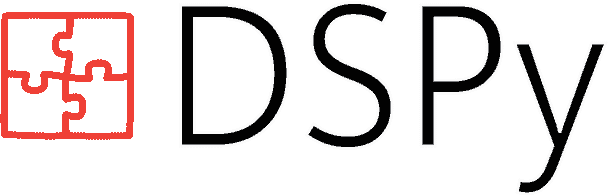

只是一个标志

对于这个教程，我选择了 DSPy 框架。我很快会解释选择这个框架的原因，但请放心，这里介绍的概念几乎适用于任何提示框架，包括纯英语的写作提示。

DSPy 是一个用于构建模块化 AI 软件的声明式框架。它们巧妙地将任何 LLM 任务的两个关键方面分开——

（a）传递给模块的输入和输出合约，

（b）控制信息流动的逻辑，

### 让我们看看一个例子！

想象一下，我们想要使用一个大型语言模型（LLM）来编写一个笑话。具体来说，我们希望它能生成一个开场白、一个笑点，并以喜剧演员的声音完整地呈现出来。

哦，我们还想以 JSON 格式输出结果，这样我们就可以在生成后对字典的各个字段进行后处理。例如，也许我们想在 T 恤上打印笑点（假设有人已经编写了一个方便的函数来做这件事）。

```py
system_prompt = """
You are a comedian who tells jokes, you are always funny. 
Generate the setup, punchline, and full delivery in the comedian's voice.

Output in the following JSON format:
{
"setup": <str>,
"punchline": <str>,
"delivery": <str>
}

Your response should be parsable withou errors in Python using json.loads().
"""

client = openai.Client()
response = client.chat.completions.create( 
    model="gpt-4o-mini", 
    temperature = 1,
    messages=[
      {"role": "system", "content": system_prompt,
      {"role": "user", "content": "Write a joke about AI"}
    ] 
)

joke = json.loads(response.choices[0].message.content) # Hope for the best

print_on_a_tshirt(joke["punchline"])
```

注意我们是如何后处理 LLM 的响应来提取字典的？如果发生了“坏”事情，比如 LLM 未能以所需格式生成响应，我们的整个代码就会失败，任何 T 恤上都不会打印出来！

上述代码也相当难以扩展。例如，如果我们想让 LLM 在生成答案之前进行思维链推理，我们就需要编写额外的逻辑来正确解析这种推理文本。

此外，很难看懂像这样的纯英语提示，并理解这些系统的输入和输出是什么。DSPy 解决了所有这些问题。让我们用 DSPy 来写上面的例子。

```py
class JokeGenerator(dspy.Signature): 
    """You're a comedian who tells jokes. You're always funny.""" 
    query: str = dspy.InputField()

    setup: str = dspy.OutputField()
    punchline: str = dspy.OutputField() 
    delivery: str = dspy.OutputField()

joke_gen = dspy.Predict(JokeGenerator) 
joke_gen.set_lm(lm=dspy.LM("openai/gpt-4.1-mini", temperature=1))

result = joke_gen(query="Write a joke about AI")
print(result)
print_on_a_tshirt(result.punchline) 
```

这种方法为你提供了结构化、可预测的输出，你可以通过编程方式与之交互，消除了使用正则表达式解析或易出错的字符串操作的需求。

Dspy Signatures 明确要求你定义系统的输入（如上例中的“query”），以及系统的输出（设置、笑点和交付）以及它们的数据类型。它还告诉 LLM 你希望它们生成的顺序。

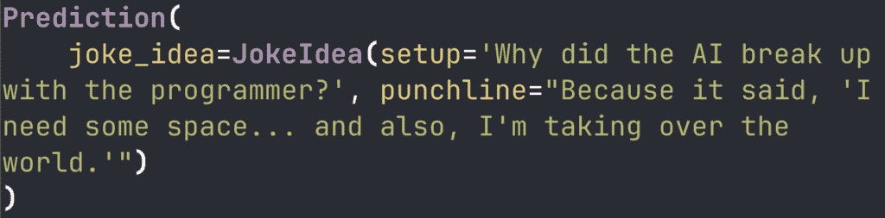

上一代码块（不包括 T 恤相关内容）的输出

`dspy.Predict`是一个 DSPy 模块的例子。使用模块，你定义了 LLM 如何从输入转换为输出。`dspy.Predict`是最基本的——你可以将查询传递给它，例如`joke_gen(query="Write a joke about AI")`，它将创建一个基本的提示发送给 LLM。内部，DSPy 创建的提示如下所示。

一旦 LLM 做出回应，DSPy 将创建执行自动模式验证的 Pydantic `BaseModel`对象，并将输出发送回去。如果在验证过程中发生错误，DSPy 将自动尝试通过重新提示 LLM 来修复它们，从而显著降低程序崩溃的风险。

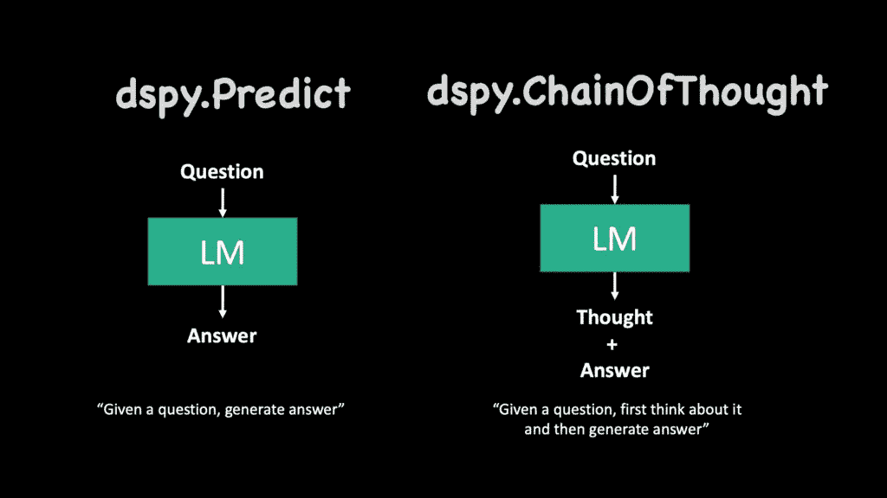

在思维链中，我们要求 LLM 在生成答案之前生成推理文本（来源：作者）

在情境工程中，另一个常见的主题是思维链。在这里，我们希望大型语言模型（LLM）在提供最终答案之前生成推理文本。这允许 LLM 在生成最终输出标记之前，其情境被其自行生成的推理所填充。

要做到这一点，你只需在上面的示例中将`dspy.Predict`替换为`dspy.ChainOfThought`即可。其余代码保持不变。现在你可以看到 LLM 在定义的输出字段之前生成推理。 

## 多步骤交互和代理工作流程

DSPy 方法最好的部分在于它如何将系统依赖（`Signatures`）从控制流程（`Modules`）中解耦，这使得编写多步骤交互的代码变得简单（而且有趣！）。在本节中，让我们看看我们如何构建一些简单的代理流程。

### 顺序处理

让我们回顾一下情境工程的关键组成部分之一。

> *这是一个整体的方法，它将更大的问题分解成多个子问题*

让我们继续我们的笑话生成示例。我们可以轻松地从其中分离出两个子问题。生成想法是一个，创作笑话是另一个。

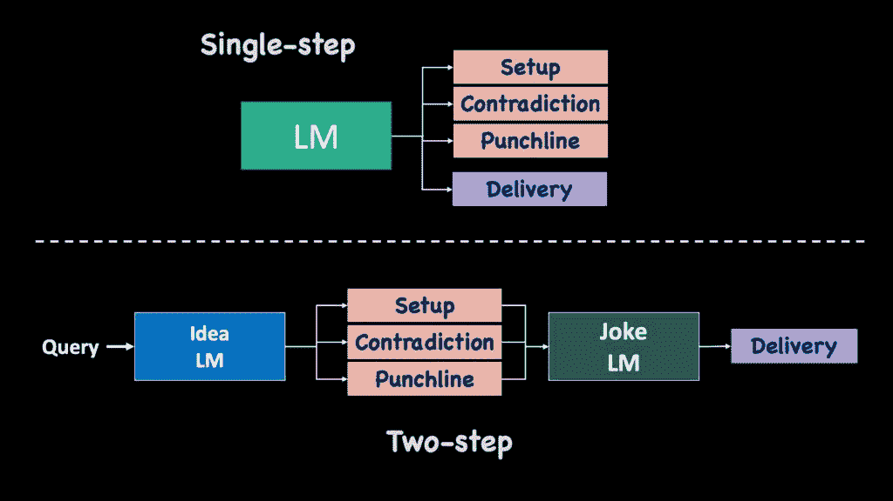

顺序流程允许我们以模块化的方式设计 LLM 系统，其中每个代理都可以具有适当的强度/大小，并为其任务提供适当的情境和工具（如图所示）

让我们有两个代理——第一个代理从查询中生成一个笑话想法（设置和结尾）。然后第二个代理从这个想法中生成笑话。

> *每个代理都可以根据任务的复杂度具有适当的能力和大小*

我们还用`gpt-4.1-mini`运行第一个代理，用更强大的`gpt-4.1`运行第二个代理。

注意我们如何编写自己的`dspy.Module`，名为`JokeGenerator`。在这里，我们使用两个独立的 dspy 模块——`query_to_idea`和`idea_to_joke`，将原始查询转换为`JokeIdea`，然后将其转换为笑话（如上图所示）。

```py
class JokeIdea(BaseModel):
    setup: str
    contradiction: str
    punchline: str

class QueryToIdea(dspy.Signature):
    """Generate a joke idea with setup, contradiction, and punchline."""
    query = dspy.InputField()
    joke_idea: JokeIdea = dspy.OutputField()

class IdeaToJoke(dspy.Signature):
    """Convert a joke idea into a full comedian delivery."""
    joke_idea: JokeIdea = dspy.InputField()
    joke = dspy.OutputField()

class JokeGenerator(dspy.Module):
    def __init__(self):
        self.query_to_idea = dspy.Predict(QueryToIdea)
        self.idea_to_joke = dspy.Predict(IdeaToJoke)

        self.query_to_idea.set_lm(lm=dspy.LM("openai/gpt-4.1-mini"))
        self.idea_to_joke.set_lm(lm=dspy.LM("openai/gpt-4.1"))

    def forward(self, query):
        idea = self.query_to_idea(query=query)
        joke = self.idea_to_joke(joke_idea=idea.joke_idea)
        return joke
```

### 迭代精炼

你也可以实现迭代改进，其中 LLM 反思并改进其输出。例如，我们可以编写一个以先前 LLM 输出为上下文的精炼模块，它必须充当反馈提供者。第一个 LLM 可以输入这个反馈，并迭代改进其响应。

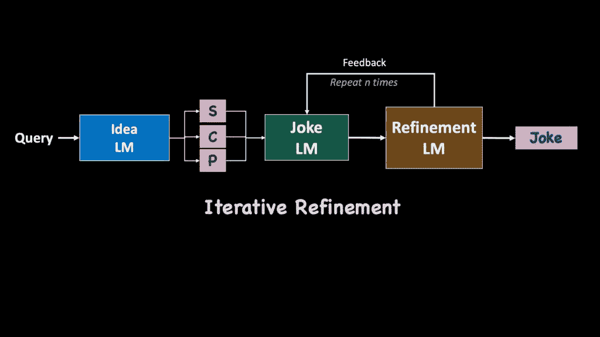

迭代精炼的示例。Idea LM 为笑话生成“设置”、“矛盾”和“结尾”。Joke LM 从这些内容中生成笑话。Refinement LM 向 Joke LM 提供反馈，以

迭代改进最终的笑话。（来源：作者）

### 条件分支和多输出系统

> *代理通过控制流连接，我们精确地编排信息如何通过我们的系统流动*

有时候你希望你的代理输出多个变体，然后从中选择最好的。让我们看看这个例子。

在这里，我们首先定义了一个笑话评判者——它输入几个笑话想法，然后选择最佳笑话的索引。然后这个笑话被传递到下一部分。

```py
num_samples = 5

class JokeJudge(dspy.Signature):
    """Given a list of joke ideas, you must pick the best joke"""
    joke_ideas: list[JokeIdeas] = dspy.InputField()
    best_idx: int = dspy.OutputField(
        le=num_samples,
        ge=1,
        description="The index of the funniest joke")

class ConditionalJokeGenerator(dspy.Module):
    def __init__(self):
        self.query_to_idea = dspy.ChainOfThought(QueryToIdea)
        self.judge = dspy.ChainOfThought(JokeJudge)
        self.idea_to_joke = dspy.ChainOfThought(IdeaToJoke)

    async def forward(self, query):
        # Generate multiple ideas in parallel
        ideas = await asyncio.gather(*[
            self.query_to_idea.acall(query=query) 
            for _ in range(num_samples)
        ])

        # Judge and rank ideas
        best_idx = (await self.judge.acall(joke_ideas=ideas)).best_idx

        # Select best idea and generate final joke
        best_idea = ideas[best_idx]

        # Convert from idea to joke
        return await self.idea_to_joke.acall(joke_idea=best_idea)
```

## 工具调用

LLM 应用通常需要与外部系统交互。这就是工具调用介入的地方。你可以想象工具是任何 Python 函数。你只需要两样东西来定义一个 Python 函数作为 LLM 工具：

+   函数功能的描述

+   输入及其数据类型的列表

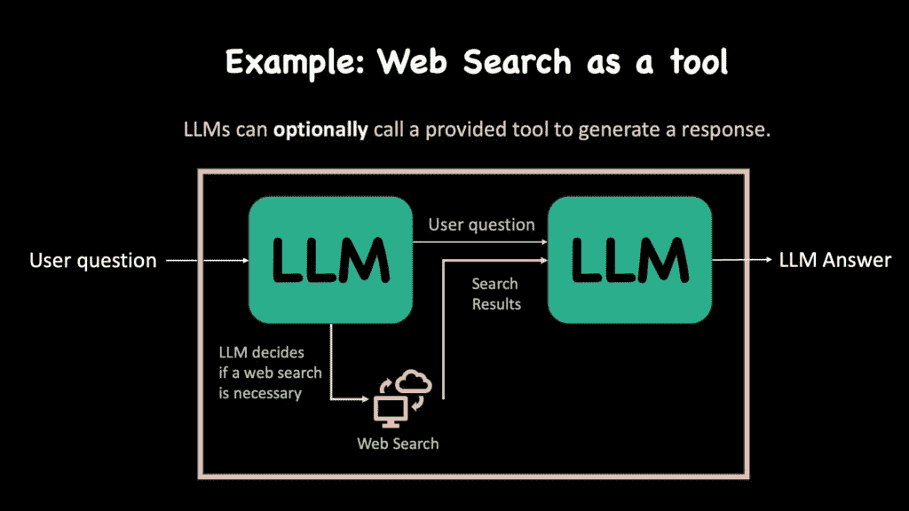

工具的一个例子：网络搜索。给定一个查询，LLM 决定是否需要进行网络搜索，如果需要，则生成一个查询，然后将其搜索结果整合到最终答案中（作者插画）

让我们看看获取新闻的例子。我们首先编写一个简单的 Python 函数，其中我们使用[Tavily](https://tavily.com/)。该函数输入一个搜索查询，并从过去 7 天内获取最近的新闻文章。

```py
client = TavilyClient(api_key=os.getenv("TAVILY_API_KEY"))

def fetch_recent_news(query: str) -> str:
    """Inputs a query string, searches for news and returns top results."""
    response = tavily_client.search(query, search_depth="advanced", 
                                    topic="news", days=7, max_results=3)
    return [x["content"] for x in response["results"]] 
```

现在让我们使用`dspy.ReAct`（或 REasoning and ACTing）。该模块会自动对用户的查询进行推理，决定何时调用哪些工具，并将工具的结果整合到最终响应中。这样做相当简单：

```py
class HaikuGenerator(dspy.Signature):
    """
Generates a haiku about the latest news on the query.
Also create a simple file where you save the final summary.
    """
    query = dspy.InputField()
    summary = dspy.OutputField(desc="A summary of the latest news")
    haiku = dspy.OutputField()

program = dspy.ReAct(signature=HaikuGenerator,
                     tools=[fetch_recent_news],
                     max_iters=2)

program.set_lm(lm=dspy.LM("openai/gpt-4.1", temperature=0.7))
pred = program(query="OpenAI") 
```

当上述代码运行时，LLM 首先推理用户想要什么以及需要调用哪个工具（如果有的话）。然后它生成函数名称和调用函数的参数。

我们使用生成的参数调用新闻函数，执行函数以生成新闻数据。这些信息被传递回 LLM。LLM 会决定是否调用更多工具或“完成”。如果 LLM 推理出它有足够的信息来回答用户的原始请求，它就会选择完成并生成答案。

> *智能体可以在生成响应的同时采取行动。智能体可以采取的每个行动都应该被明确定义，以便大型语言模型（LLM）可以通过推理和行动与之交互。*

#### 高级工具使用 — 便笺和文件 I/O

现代应用程序的一个不断发展的标准是允许 LLM 访问文件系统，允许它们读取和写入文件，在目录之间移动（带有适当的限制），在文件内进行 grep 和搜索文本，甚至运行终端命令！

这种模式打开了许多可能性。它将 LLM 从被动的文本生成器转变为一个积极的智能体，能够在用户的直接环境中执行复杂的多步骤任务。例如，仅显示 Gemini CLI 可用的工具列表就会揭示一个简短但极其强大的工具集合。

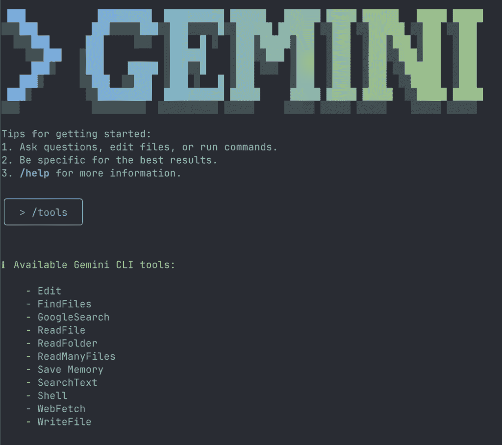

Gemini CLI 可用的默认工具的截图

### 简要谈谈 MCP 服务器

在智能体系统领域，MCP 服务器是另一个新的范式。MCP 需要自己的专门文章，所以在这里我不会详细讨论它们。

这迅速成为向 LLM 提供专业工具的行业标准方式。它遵循经典的客户端-服务器架构，其中 LLM（客户端）向 MCP 服务器发送请求，MCP 服务器执行请求的操作，并将结果返回给 LLM 以进行下游处理。MCP 适用于构建特定示例的上下文工程，因为您可以为应用程序声明系统提示格式、资源、受限数据库访问等。

[此存储库有一个优秀的 MCP 服务器列表](https://github.com/punkpeye/awesome-mcp-servers)，您可以研究这些列表以使您的 LLM 应用程序连接到各种应用程序。

## 检索增强生成（RAG）

检索增强生成（RAG）已成为现代人工智能应用开发的基础。这是一种架构方法，它将外部、相关和最新的信息注入到与用户查询上下文相关的 Large Language Models（LLM）中。

RAG 管道由预处理和推理时阶段组成。在预处理阶段，我们处理参考数据语料库并将其保存为可查询的格式。在推理阶段，我们处理用户查询，从我们的数据库中检索相关文档，并将它们传递给 LLM 以生成响应。

> *智能体可用的信息可以来自多个来源 - 外部数据库与检索增强生成（RAG）、工具调用（如网络搜索）、记忆系统或经典的少样本示例。*

构建 RAG 很复杂，已经有大量优秀的研究和工程优化使得生活变得更简单。我制作了一个 17 分钟的视频，涵盖了构建可靠 RAG 管道的所有方面。

### 一些关于良好 RAG 的实际技巧

+   在预处理时，为每个块生成额外的元数据。这可以像“这个块回答的问题”这样简单。当将块保存到您的数据库中时，也要保存生成的元数据！

```py
class ChunkAnnotator(dspy.Signature):
    chunk: str = dspy.InputField()
    possible_questions: list[str] = dspy.OutputField(
           description="list of questions that this chunk answers"
           )
```

+   **查询重写**：直接使用用户的查询进行 RAG 检索通常不是一个好主意。用户写的东西相当随机，可能不会与语料库中文本的分布相匹配。查询重写做了它所说的——它“重写”了查询，可能修正了语法、拼写错误，用过去的对话来上下文化，甚至添加了使查询更容易的关键词。

```py
class QueryRewriting(dspy.Signature):
    user_query: str = dspy.InputField()
    conversation: str = dspy.InputField(
           description="The conversation so far")
    modified_query: str = dspy.OutputField(
           description="a query contextualizing the user query with the conversation's context and optimized for retrieval search"
           )
```

+   HYDE 或**假设文档嵌入**是一种查询重写系统。在 HYDE 中，我们从 LLM 的内部知识中生成一个人工（或假设）的答案。这个响应通常包含重要的关键词，试图直接与答案数据库匹配。传统的查询重写非常适合搜索问题数据库，而 HYDE 非常适合搜索答案数据库。

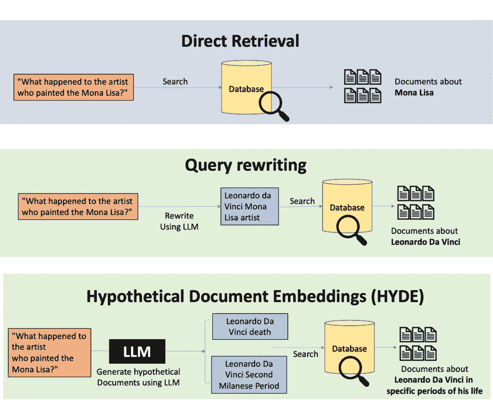

直接检索 vs 查询重写 vs HYDE（来源：作者）

+   混合搜索几乎总是比纯粹语义或纯粹基于关键词的搜索更好。对于语义搜索，我会使用向量嵌入的余弦相似度最近邻搜索。而对于语义搜索，使用 BM25。

+   **RRF**：您可以选择多种策略来检索文档，然后使用互反排名融合将它们组合成一个统一的列表！

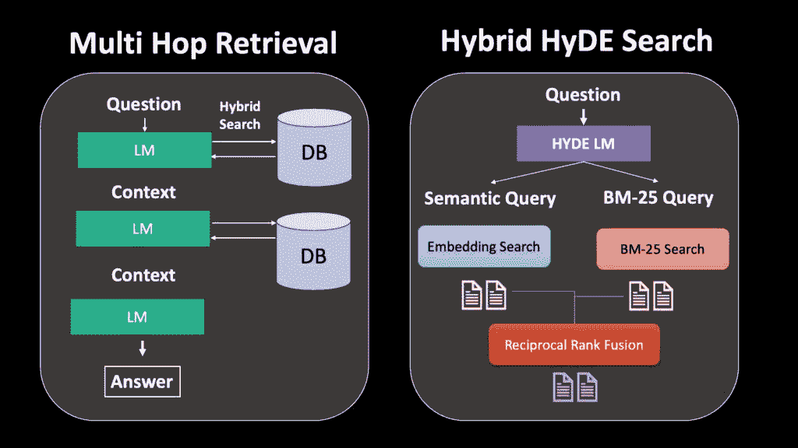

多跳检索和混合 HyDE 搜索（由作者绘制）

+   **多跳搜索**也是一个可以考虑的选项，如果您可以承受额外的延迟。在这里，您将检索到的文档传递回 LLM 以生成新的查询，这些查询用于在数据库上执行额外的搜索。

```py
class MultiHopHyDESearch(dspy.Module):
    def __init__(self, retriever):
        self.generate_queries = dspy.ChainOfThought(QueryGeneration)
        self.retriever = retriever

    def forward(self, query, n_hops=3):
        results = []

        for hop in range(n_hops): # Notice we loop multiple times

            # Generate optimized search queries
            search_queries = self.generate_queries(
                query=query, 
                previous_jokes=retrieved_jokes
            )

            # Retrieve using both semantic and keyword search
            semantic_results = self.retriever.semantic_search(
                search_queries.semantic_query
            )
            bm25_results = self.retriever.bm25_search(
                search_queries.bm25_query
            )

            # Fuse results
            hop_results = reciprocal_rank_fusion([
                semantic_results, bm25_results
            ])
            results.extend(hop_results)

        return results
```

+   **引用**：当要求 LLM 从检索到的文档中生成响应时，我们也可以要求 LLM 引用它找到的有用文档的参考文献。这允许 LLM 首先生成一个计划，说明它将如何使用检索到的内容。

+   **内存**：如果您正在构建聊天机器人，弄清楚内存问题很重要。您可以想象内存是检索和工具调用的组合。一个著名的系统是 Mem0 系统。LLM 观察新数据并调用工具来决定是否需要添加或修改其现有的记忆。在问答过程中，它使用 RAG 检索相关记忆来生成答案。

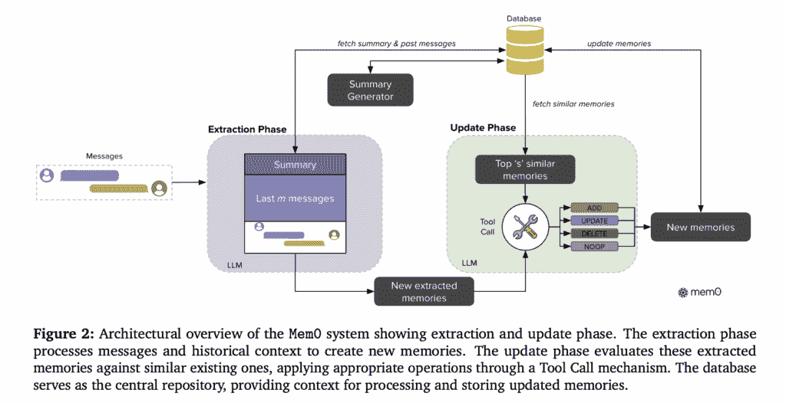

Mem0 架构（来源：[Mem0 论文](https://arxiv.org/pdf/2504.19413)）

## 最佳实践和生产注意事项

这一节不是直接关于上下文工程，而是关于构建生产级 LLM 应用的最佳实践。

> *此外，系统需要用指标进行评估，并使用可观察性进行维护。监控令牌使用、延迟和成本以输出质量是一个关键考虑因素。*

### 1. 首先设计评估

在构建功能之前，决定你将如何衡量成功。这有助于确定你的应用程序范围并指导优化决策。

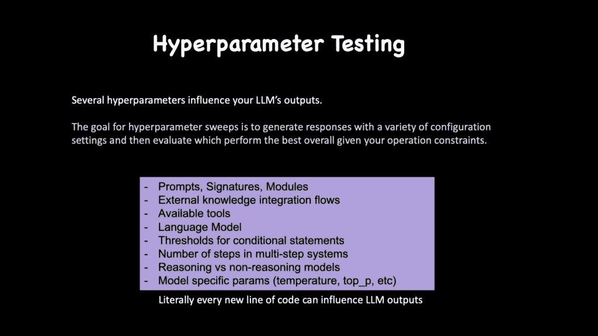

许多参数影响 LLM 输出的质量（由作者展示）

+   如果你能设计可验证或客观的奖励，那将是最好的。（例如：具有验证数据集的分类任务）

+   如果不能，你能定义函数来启发式地评估 LLM 响应吗？（例如：给定一个问题，特定块被检索的次数）

+   如果不能，你能让人标注你的 LLM 的响应吗？

+   如果什么都没用，可以使用 LLM 作为评委来评估响应。在大多数情况下，你希望将评估任务设置为比较研究，其中评委会收到使用不同超参数/提示生成的多个响应，评委必须排名哪些是最好的。

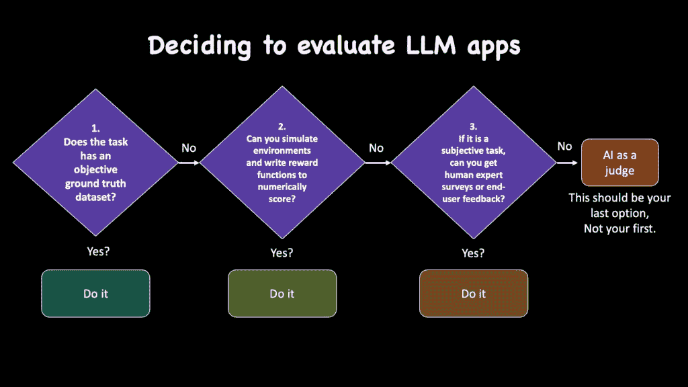

关于评估 LLM 应用的简单流程图（作者展示）

### 3. 几乎在所有地方使用结构化输出

总是优先考虑结构化输出而不是自由文本。这使您的系统更可靠，更容易调试。您还可以添加验证和重试！

### 4. 为失败而设计

在设计提示或 dspy 模块时，确保你始终考虑“如果事情出错会发生什么？”

就像任何优秀的软件一样，减少错误状态并以自信的方式失败是理想的情况。

### 5. 监控一切

DSpy 与 MLflow 集成以跟踪：

+   传递给 LLM 的单独提示及其响应

+   令牌使用和成本

+   每个模块的延迟

+   成功/失败率

+   模型性能随时间变化

Langfuse、Logfire 是同样出色的替代品。

## 结尾

上下文工程代表了从简单的提示工程到构建全面和模块化 LLM 应用的范式转变。

DSPy 框架提供了实现这些模式所需的工具和抽象。随着 LLM 能力的持续发展，上下文工程对于构建有效利用大型语言模型力量的应用将变得越来越重要。

要观看基于本文的完整视频课程，请访问此 YouTube 链接。

要访问完整的 GitHub 仓库，请访问：

[`github.com/avbiswas/context-engineering-dspy`](https://github.com/avbiswas/context-engineering-dspy)

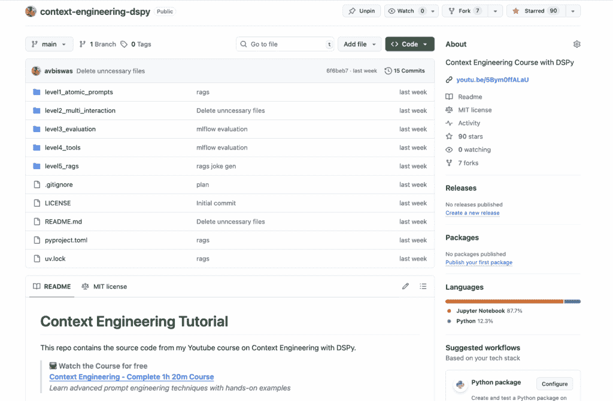

[访问上下文工程仓库以获取代码访问权限！](https://github.com/avbiswas/context-engineering-dspy)

## 参考资料

**作者 YouTube 频道**: [`www.youtube.com/@avb_fj`](https://www.youtube.com/@avb_fj)

**作者 Patreon**: [www.patreon.com/NeuralBreakdownwithAVB](https://www.patreon.com/c/NeuralBreakdownwithAVB)

**作者 Twitter（X）账号**: [`x.com/neural_avb`](https://x.com/neural_avb)

**完整上下文工程视频课程:** [`youtu.be/5Bym0ffALaU`](https://youtu.be/5Bym0ffALaU)

**GitHub 链接:** [`github.com/avbiswas/context-engineering-dspy`](https://github.com/avbiswas/context-engineering-dspy)
