# 与 Agents SDK 亲身体验：多代理协作

> [`towardsdatascience.com/hands-on-with-agents-sdk-multi-agent-collaboration/`](https://towardsdatascience.com/hands-on-with-agents-sdk-multi-agent-collaboration/)

<mdspan datatext="el1754323849072" class="mdspan-comment">在本</mdspan>系列第二部分 *与 Agents SDK 亲身体验* 中，我们将探讨多代理系统的基础知识以及代理如何使用 OpenAI Agents SDK 框架进行协作。

如果你还没有阅读第一篇文章，我强烈建议你在这里查看：[您的第一个 API 调用代理](https://towardsdatascience.com/hands%E2%80%91on-with-agents-sdk-your-first-api%E2%80%91calling-agent/)。在那篇文章中，我们从一个简单的代理开始构建，并将其增强为一个能够检索实时天气数据的工具代理。我们还为代理包装了一个最小的 Streamlit 界面，以便用户交互。

> > [与 Agents SDK 亲身体验：您的第一个 API 调用代理](https://towardsdatascience.com/hands%e2%80%91on-with-agents-sdk-your-first-api%e2%80%91calling-agent/)

现在，我们迈出下一步。不再依赖于单个 *天气专家* 代理，我们将引入另一个代理，并学习如何让他们协同工作，更有效地理解和满足用户查询。

## 多代理系统简介

让我们从一个问题开始：为什么我们需要多个代理，而单个代理——就像我们在上一篇文章中构建的那个——似乎已经足够强大来处理任务？

采用多代理系统有几个实际和理论上的原因 ^([1])。每个代理可以专注于特定领域并使用自己的工具，这可以导致更好的性能和更高品质的结果。在现实世界的应用中，业务流程通常是复杂的。多代理设置通常是更模块化、可管理和可维护的。例如，如果需要更新特定功能，我们只需修改一个代理，而不是整个系统。

OpenAI Agents SDK 提供了两种核心模式来启用代理协作：*交接* 和 *代理作为工具*。在这篇文章中，我们将探讨这两种模式，讨论何时使用它们，并展示如何自定义它们以实现更好的结果。

## 交接

Handoff 是 Agents SDK 框架的关键特性之一。有了 Handoff，一个代理可以将任务委托给另一个代理 ^([2])。为了使这个概念更清晰，想象一下医院中一个典型的流程。

假设你遇到健康问题，去医院进行检查。你通常遇到的第一个人不是医生，而是一位分诊护士。分诊护士收集你的相关信息，然后引导你到相应的部门或专家。

这个类比紧密地反映了在 Agents SDK 中交接是如何工作的。在我们的案例中，我们将有一个 *分级代理*，它“检查”用户的查询。在评估后，分级代理将查询路由到更适合的专家代理。就像分级护士一样，它将完整上下文（如收集到的健康数据）转交给那个专家代理。

这种模式在现实世界的应用中很常见，例如客户服务工作流程，其中一般代理接收初始请求，然后将其路由到特定领域的专家代理以进行处理。在我们的天气助手示例中，我们将实现类似的设置。

我们不会只有一个天气专家代理，我们将引入另一个代理：一个 *空气质量专家*。正如其名所示，这个代理将专注于回答特定位置的空气质量相关查询，并将配备一个工具来获取实时空气质量数据。

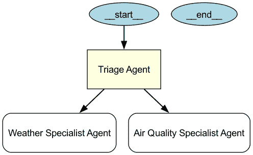

使用 GraphViz 可视化交接模式。

### 基本交接

让我们通过创建一个名为 `04-basic-handoff-app.py` 的新文件来深入代码。首先，我们将导入所需的包，就像我们在上一篇文章中做的那样。

```py
from agents import Agent, Runner, function_tool
import asyncio
import streamlit as st
from dotenv import load_dotenv
import requests

load_dotenv()
```

接下来，我们使用与上一篇文章中相同的结构定义函数工具和天气专家代理：

```py
@function_tool
def get_current_weather(latitude: float, longitude: float) -> dict:
    ...

weather_specialist_agent = Agent(
    name="Weather Specialist Agent",
    ...
)
```

在本脚本中，如上所述，我们将定义一个新的空气质量专家代理，并使用名为 `get_current_air_quality` 的工具。此工具使用与 Open-Meteo 不同的 API 端点和指标，但它接受相同的参数——纬度和经度。

代理本身定义方式与之前的天气专家代理类似，关键区别在于指令——以确保与空气质量查询的相关性。以下是空气质量专家代理的代码片段。

```py
@function_tool
def get_current_air_quality(latitude: float, longitude: float) -> dict:
    """Fetch current air quality data for the given latitude and longitude."""

    url = "https://air-quality-api.open-meteo.com/v1/air-quality"
    params = {
        "latitude": latitude,
        "longitude": longitude,
        "current": "european_aqi,us_aqi,pm10,pm2_5,carbon_monoxide,nitrogen_dioxide,sulphur_dioxide,ozone",
        "timezone": "auto"
    }
    response = requests.get(url, params=params)
    return response.json()

air_quality_specialist_agent = Agent(
    name="Air Quality Specialist Agent",
    instructions="""
    You are an air quality specialist agent.
    Your role is to interpret current air quality data and communicate it clearly to users.

    For each query, provide:
    1\. A concise summary of the air quality conditions in plain language, including key pollutants and their levels.
    2\. Practical, actionable advice or precautions for outdoor activities, travel, and health, tailored to the air quality data.
    3\. If poor or hazardous air quality is detected (e.g., high pollution, allergens), clearly highlight recommended safety measures.

    Structure your response in two sections:
    Air Quality Summary:
    - Summarize the air quality conditions in simple terms.

    Suggestions:
    - List relevant advice or precautions based on the air quality.
    """,
    tools=[get_current_air_quality],
    tool_use_behavior="run_llm_again"
)
```

现在我们有两个代理——天气专家和空气质量专家——下一步是定义 *分级代理*，它将评估用户的查询并决定将任务转交给哪个代理。

分级代理可以简单地定义为以下内容：

```py
triage_agent = Agent(
    name="Triage Agent",
    instructions="""
    You are a triage agent.
    Your task is to determine which specialist agent (Weather Specialist or Air Quality Specialist) is best suited to handle the user's query based on the content of the question.

    For each query, analyze the input and decide:
    - If the query is about weather conditions, route it to the Weather Specialist Agent.
    - If the query is about air quality, route it to the Air Quality Specialist Agent.
    - If the query is ambiguous or does not fit either category, provide a clarification request.
    """,
    handoffs=[weather_specialist_agent, air_quality_specialist_agent]
)
```

在 `instructions` 参数中，我们为这个代理提供明确的指令，以确定哪个专家代理最适合处理用户的查询。

这里最重要的参数是 `handoffs`，我们传递一个可能被委派的任务的代理列表。由于我们目前只有两个代理，我们将它们都包含在列表中。

最后，我们定义 `run_agent` 和 `main` 函数以与 Streamlit 组件集成。（*注意：有关这些函数的详细解释，请参阅第一篇文章。*）

```py
async def run_agent(user_input: str):
    result = await Runner.run(triage_agent, user_input)
    return result.final_output

def main():
    st.title("Weather and Air Quality Assistant")
    user_input = st.text_input("Enter your query about weather or air quality:")

    if st.button("Get Update"):
        with st.spinner("Thinking..."):
            if user_input:
                agent_response = asyncio.run(run_agent(user_input))
                st.write(agent_response)
            else:
                st.write("Please enter a question about the weather or air quality.")

if __name__ == "__main__":
    main()
```

<details class="wp-block-details is-layout-flow wp-block-details-is-layout-flow"><summary>我们的交接脚本的完整脚本可以在此处查看。</summary>

```py
from agents import Agent, Runner, function_tool
import asyncio
import streamlit as st
from dotenv import load_dotenv
import requests

load_dotenv()

@function_tool
def get_current_weather(latitude: float, longitude: float) -> dict:
    """Fetch current weather data for the given latitude and longitude."""

    url = "https://api.open-meteo.com/v1/forecast"
    params = {
        "latitude": latitude,
        "longitude": longitude,
        "current": "temperature_2m,relative_humidity_2m,dew_point_2m,apparent_temperature,precipitation,weathercode,windspeed_10m,winddirection_10m",
        "timezone": "auto"
    }
    response = requests.get(url, params=params)
    return response.json()

weather_specialist_agent = Agent(
    name="Weather Specialist Agent",
    instructions="""
    You are a weather specialist agent.
    Your task is to analyze current weather data, including temperature, humidity, wind speed and direction, precipitation, and weather codes.

    For each query, provide:
    1\. A clear, concise summary of the current weather conditions in plain language.
    2\. Practical, actionable suggestions or precautions for outdoor activities, travel, health, or clothing, tailored to the weather data.
    3\. If severe weather is detected (e.g., heavy rain, thunderstorms, extreme heat), clearly highlight recommended safety measures.

    Structure your response in two sections:
    Weather Summary:
    - Summarize the weather conditions in simple terms.

    Suggestions:
    - List relevant advice or precautions based on the weather.
    """,
    tools=[get_current_weather],
    tool_use_behavior="run_llm_again"
)

@function_tool
def get_current_air_quality(latitude: float, longitude: float) -> dict:
    """Fetch current air quality data for the given latitude and longitude."""

    url = "https://air-quality-api.open-meteo.com/v1/air-quality"
    params = {
        "latitude": latitude,
        "longitude": longitude,
        "current": "european_aqi,us_aqi,pm10,pm2_5,carbon_monoxide,nitrogen_dioxide,sulphur_dioxide,ozone",
        "timezone": "auto"
    }
    response = requests.get(url, params=params)
    return response.json()

air_quality_specialist_agent = Agent(
    name="Air Quality Specialist Agent",
    instructions="""
    You are an air quality specialist agent.
    Your role is to interpret current air quality data and communicate it clearly to users.

    For each query, provide:
    1\. A concise summary of the air quality conditions in plain language, including key pollutants and their levels.
    2\. Practical, actionable advice or precautions for outdoor activities, travel, and health, tailored to the air quality data.
    3\. If poor or hazardous air quality is detected (e.g., high pollution, allergens), clearly highlight recommended safety measures.

    Structure your response in two sections:
    Air Quality Summary:
    - Summarize the air quality conditions in simple terms.

    Suggestions:
    - List relevant advice or precautions based on the air quality.
    """,
    tools=[get_current_air_quality],
    tool_use_behavior="run_llm_again"
)

triage_agent = Agent(
    name="Triage Agent",
    instructions="""
    You are a triage agent.
    Your task is to determine which specialist agent (Weather Specialist or Air Quality Specialist) is best suited to handle the user's query based on the content of the question.

    For each query, analyze the input and decide:
    - If the query is about weather conditions, route it to the Weather Specialist Agent.
    - If the query is about air quality, route it to the Air Quality Specialist Agent.
    - If the query is ambiguous or does not fit either category, provide a clarification request.
    """,
    handoffs=[weather_specialist_agent, air_quality_specialist_agent]
)

async def run_agent(user_input: str):
    result = await Runner.run(triage_agent, user_input)
    return result.final_output

def main():
    st.title("Weather and Air Quality Assistant")
    user_input = st.text_input("Enter your query about weather or air quality:")

    if st.button("Get Update"):
        with st.spinner("Thinking..."):
            if user_input:
                agent_response = asyncio.run(run_agent(user_input))
                st.write(agent_response)
            else:
                st.write("Please enter a question about the weather or air quality.")

if __name__ == "__main__":
    main()
```

使用以下命令在您的终端中运行脚本：

```py
streamlit run 04-basic-handoff-app.py
```

现在我们已经有一个全新的空气质量专家代理，让我们来询问雅加达的空气质量。

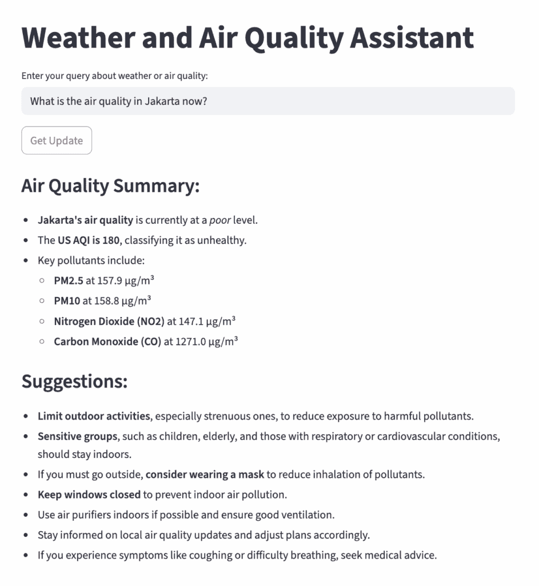


不幸的是，在撰写本文时（实际上，这种情况很常见），报告显示空气质量不健康，并附带了一些应对状况的建议。

### 检查跟踪仪表板

记得在第一篇文章中，我简要介绍了 Agents SDK 中的内置 *跟踪* 功能。在多智能体协作中，这个功能比我们还在使用简单、单个智能体时更有用。

让我们看看我们刚刚运行的查询的跟踪仪表板。

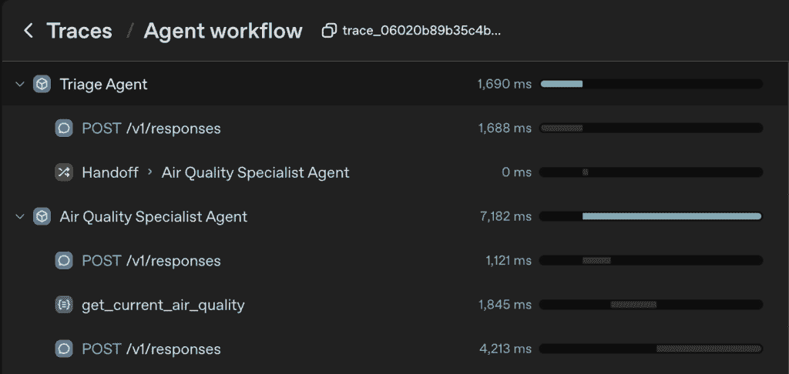

跟踪仪表板中交接模式实现截图。

我们可以看到涉及了两个智能体：三诊智能体和空气质量专家智能体。三诊智能体总共花费了 1,690 毫秒，而空气质量智能体则花费了 7,182 毫秒来处理并返回结果。

如果我们点击三诊智能体响应部分，我们可以查看详细的 LLM 属性，如下所示。注意，对于三诊智能体，LLM 将交接选项视为函数：`transfer_to_weather_specialist_agent()` 和 `transfer_to_air_quality_specialist_agent()`。这就是交接在底层是如何工作的——LLM 决定哪个函数最适合用户的查询。

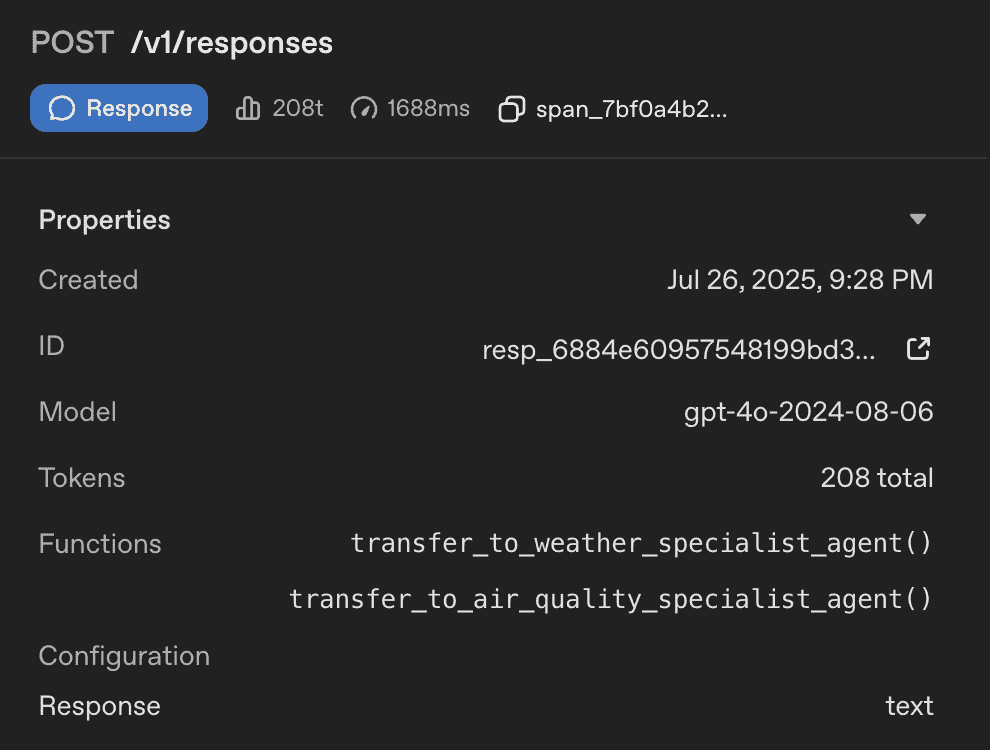

跟踪仪表板中三诊智能体响应详细截图。

由于示例询问了空气质量，三诊智能体触发的是 `transfer_to_air_quality_specialist_agent()` 函数，这无缝地将控制权转移给了空气质量专家智能体。

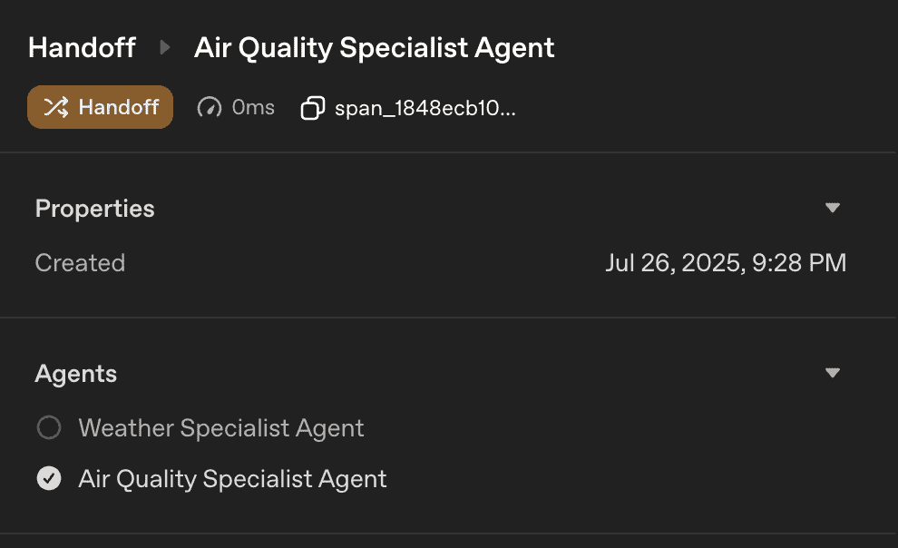


你可以尝试询问天气而不是空气质量，并检查跟踪仪表板以查看差异。

### 定制式交接

我们已经了解到，在底层，交接对 LLM 来说是可见的作为函数，这意味着我们也可以为某些方面定制交接。

要定制交接，我们可以使用 `handoff()` 函数创建交接对象，并在参数中指定我们想要定制的部分，包括：定制工具名称和描述、在交接时立即运行额外逻辑，以及向专家智能体传递结构化输入。

让我们看看以下用例中它是如何工作的。为了更清晰的参考，让我们复制之前的交接脚本并将新文件命名为 `05-customized-handoff-app.py`。

由于我们将使用 `handoff()` 函数创建交接对象，因此我们需要从 `agents` 包中添加 `handoff` 和 `RunContextWrapper` 函数，如下所示：

```py
from agents import Agent, Runner, function_tool, handoff, RunContextWrapper
import asyncio
import streamlit as st
from dotenv import load_dotenv
import requests

load_dotenv()
```

在我们导入所需的包后，接下来是定义函数工具和智能体，如下所示：

```py
@function_tool
def get_current_weather(latitude: float, longitude: float) -> dict:
    ...

weather_specialist_agent = Agent(
    name="Weather Specialist Agent",
    ...
)

@function_tool
def get_current_air_quality(latitude: float, longitude: float) -> dict:
    ...

air_quality_specialist_agent = Agent(
    ...
)
```

现在，让我们添加两个交接对象。我们将从最简单的一个逐步添加定制步骤。

#### 工具名称和描述覆盖

```py
weather_handoff = handoff(
    agent=weather_specialist_agent,
    tool_name_override="handoff_to_weather_specialist",
    tool_description_override="Handle queries related to weather conditions"
)

air_quality_handoff = handoff(
    agent=air_quality_specialist_agent,
    tool_name_override="handoff_to_air_quality_specialist",
    tool_description_override="Handle queries related to air quality conditions"
)
```

上述代码显示了我们对两个代理应用的第一种自定义，我们更改了工具名称和描述以供 LLM 可见。通常这种更改不会影响 LLM 如何响应用户查询，但只为我们提供了一种更清晰、更具体地显示工具名称和描述的方法，而不是默认的 `transfer_to_<agent_name>`。

#### 添加回调函数

使用 `handoff` 的回调函数最常用的用例之一是记录移交事件或将其显示在用户界面中。假设在应用程序中，你希望在三诊代理将查询转交给任何专家代理时通知用户。

首先，让我们定义回调函数，以便调用 Streamlit 的信息组件来告知移交事件，然后将此函数添加到两个移交对象的 `on_handoff` 属性中。

```py
def on_handoff_callback(ctx):
    st.info(f"Handing off to specialist agent for further processing...")

weather_handoff = handoff(
    agent=weather_specialist_agent,
    tool_name_override="get_current_weather",
    tool_description_override="Handle queries related to weather conditions",
    on_handoff=on_handoff_callback
)

air_quality_handoff = handoff(
    agent=air_quality_specialist_agent,
    tool_name_override="get_current_air_quality",
    tool_description_override="Handle queries related to air quality conditions",
    on_handoff=on_handoff_callback
)
```

让我们测试一下，但在运行脚本之前，我们需要使用我们刚刚定义的移交对象更改三诊代理中的移交列表。

```py
triage_agent = Agent(
    name="Triage Agent",
    instructions="""
    ...
    """,
    handoffs=[weather_handoff, air_quality_handoff]
)
```

<details class="wp-block-details is-layout-flow wp-block-details-is-layout-flow"><summary>包括 Streamlit 主函数的完整脚本可以在以下链接查看。</summary>

```py
from agents import Agent, Runner, function_tool, handoff, RunContextWrapper
import asyncio
import streamlit as st
from dotenv import load_dotenv
import requests

load_dotenv()

@function_tool
def get_current_weather(latitude: float, longitude: float) -> dict:
    """Fetch current weather data for the given latitude and longitude."""

    url = "https://api.open-meteo.com/v1/forecast"
    params = {
        "latitude": latitude,
        "longitude": longitude,
        "current": "temperature_2m,relative_humidity_2m,dew_point_2m,apparent_temperature,precipitation,weathercode,windspeed_10m,winddirection_10m",
        "timezone": "auto"
    }
    response = requests.get(url, params=params)
    return response.json()

weather_specialist_agent = Agent(
    name="Weather Specialist Agent",
    instructions="""
    You are a weather specialist agent.
    Your task is to analyze current weather data, including temperature, humidity, wind speed and direction, precipitation, and weather codes.

    For each query, provide:
    1\. A clear, concise summary of the current weather conditions in plain language.
    2\. Practical, actionable suggestions or precautions for outdoor activities, travel, health, or clothing, tailored to the weather data.
    3\. If severe weather is detected (e.g., heavy rain, thunderstorms, extreme heat), clearly highlight recommended safety measures.

    Structure your response in two sections:
    Weather Summary:
    - Summarize the weather conditions in simple terms.

    Suggestions:
    - List relevant advice or precautions based on the weather.
    """,
    tools=[get_current_weather],
    tool_use_behavior="run_llm_again"
)

@function_tool
def get_current_air_quality(latitude: float, longitude: float) -> dict:
    """Fetch current air quality data for the given latitude and longitude."""

    url = "https://air-quality-api.open-meteo.com/v1/air-quality"
    params = {
        "latitude": latitude,
        "longitude": longitude,
        "current": "european_aqi,us_aqi,pm10,pm2_5,carbon_monoxide,nitrogen_dioxide,sulphur_dioxide,ozone",
        "timezone": "auto"
    }
    response = requests.get(url, params=params)
    return response.json()

air_quality_specialist_agent = Agent(
    name="Air Quality Specialist Agent",
    instructions="""
    You are an air quality specialist agent.
    Your role is to interpret current air quality data and communicate it clearly to users.

    For each query, provide:
    1\. A concise summary of the air quality conditions in plain language, including key pollutants and their levels.
    2\. Practical, actionable advice or precautions for outdoor activities, travel, and health, tailored to the air quality data.
    3\. If poor or hazardous air quality is detected (e.g., high pollution, allergens), clearly highlight recommended safety measures.

    Structure your response in two sections:
    Air Quality Summary:
    - Summarize the air quality conditions in simple terms.

    Suggestions:
    - List relevant advice or precautions based on the air quality.
    """,
    tools=[get_current_air_quality],
    tool_use_behavior="run_llm_again"
)

def on_handoff_callback(ctx):
    st.info(f"Handing off to specialist agent for further processing...")

weather_handoff = handoff(
    agent=weather_specialist_agent,
    tool_name_override="handoff_to_weather_specialist",
    tool_description_override="Handle queries related to weather conditions",
    on_handoff=on_handoff_callback
)

air_quality_handoff = handoff(
    agent=air_quality_specialist_agent,
    tool_name_override="handoff_to_air_quality_specialist",
    tool_description_override="Handle queries related to air quality conditions",
    on_handoff=on_handoff_callback
)

triage_agent = Agent(
    name="Triage Agent",
    instructions="""
    You are a triage agent.
    Your task is to determine which specialist agent (Weather Specialist or Air Quality Specialist) is best suited to handle the user's query based on the content of the question.

    For each query, analyze the input and decide:
    - If the query is about weather conditions, route it to the Weather Specialist Agent.
    - If the query is about air quality, route it to the Air Quality Specialist Agent.
    - If the query is ambiguous or does not fit either category, provide a clarification request.
    """,
    handoffs=[weather_handoff, air_quality_handoff]
)

async def run_agent(user_input: str):
    result = await Runner.run(triage_agent, user_input)
    return result.final_output

def main():
    st.title("Weather and Air Quality Assistant")
    user_input = st.text_input("Enter your query about weather or air quality:")

    if st.button("Get Update"):
        with st.spinner("Thinking..."):
            if user_input:
                agent_response = asyncio.run(run_agent(user_input))
                st.write(agent_response)
            else:
                st.write("Please enter a question about the weather or air quality.")

if __name__ == "__main__":
    main()
```</details>

从终端运行应用程序，并询问有关天气或空气质量的问题。（在下面的示例中，我故意询问了墨尔本的空气质量，以与雅加达的空气质量形成对比。）

```py
streamlit run 05-customized-handoff-app.py
```

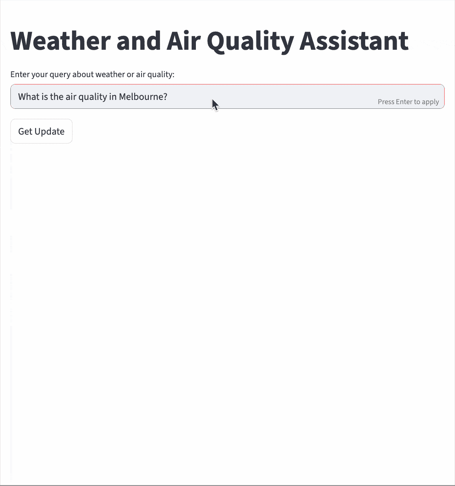

屏幕录制以展示 on-handoff 的工作原理。

我在这里包含了一段屏幕录制，以展示我们定义的 `on_handoff` 属性的目的。如上图所示，在三诊代理向专家代理发起移交后，在最终响应返回应用程序之前，会出现一个信息部分。此行为可以进一步自定义——例如，通过丰富显示的信息或添加在移交过程中执行的额外逻辑。

#### 指定输入类型

之前回调函数的示例没有提供太多有意义的 信息——它只表明发生了移交。

要将更多有用的数据传递给回调函数，我们可以在移交对象中使用 `input_type` 参数来描述输入的预期结构。

第一步是定义输入类型。通常，我们使用 Pydantic 模型类^([3]) 来指定我们想要传递的数据的结构。

假设我们希望三诊代理提供以下信息：移交的原因（以了解决策背后的逻辑）以及用户查询中提到的位置的纬度和经度。为了定义此输入类型，我们可以使用以下代码：

```py
from pydantic import BaseModel, Field

class HandoffRequest(BaseModel):
    specialist_agent: str = Field(..., description="Name of the specialist agent to hand off to")
    handoff_reason: str = Field(..., description="Reason for the handoff")
    latitude: float = Field(..., description="Latitude of the location")
    longitude: float = Field(..., description="Longitude of the location")
```

首先，我们从 Pydantic 库中导入必要的类。`BaseModel` 是提供数据验证能力的基类，而 `Field` 允许我们为每个模型字段添加元数据。

接下来，我们定义一个名为`HandoffRequest`的类，它包括我们想要的数据的结构和验证规则。在这个交接中，`specialist_agent`字段存储接收代理的名称。`handoff_reason`字段是一个字符串，解释交接发生的原因。`latitude`和`longitude`字段定义为浮点数，表示地理坐标。

一旦定义了结构化输入，下一步就是修改回调函数以适应这些信息。

```py
async def on_handoff_callback(ctx: RunContextWrapper, user_input: HandoffRequest):
    st.info(f"""
            Handing off to {user_input.specialist_agent} for further processing...\n
            Handoff reason: {user_input.handoff_reason} \n
            Location : {user_input.latitude}, {user_input.longitude} \n
            """)
```

最后，让我们将这个参数添加到我们的两个交接对象中

```py
weather_handoff = handoff(
    agent=weather_specialist_agent,
    tool_name_override="handoff_to_weather_specialist",
    tool_description_override="Handle queries related to weather conditions",
    on_handoff=on_handoff_callback,
    input_type=HandoffRequest
)

air_quality_handoff = handoff(
    agent=air_quality_specialist_agent,
    tool_name_override="handoff_to_air_quality_specialist",
    tool_description_override="Handle queries related to air quality conditions",
    on_handoff=on_handoff_callback,
    input_type=HandoffRequest
)
```

脚本的其余部分保持不变。现在，让我们尝试使用以下命令运行它：

```py
streamlit run 05-customized-handoff-app.py
```

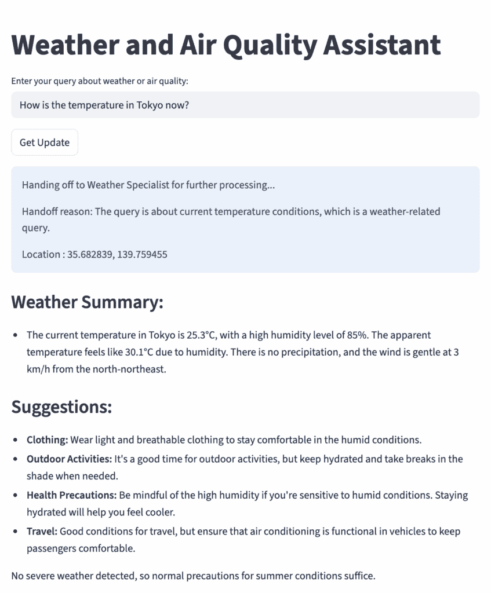

交接对象上输入类型实现的截图。

在这个例子中，我没有直接使用单词*“weather”*——相反，我询问了*“temperature。”*从蓝色信息部分，我们可以看到发生了交接到天气专家代理。我们还得到了三诊代理做出这个决定的原因：查询是关于当前温度，这被认为是一个与天气相关的话题。此外，还提供了地理位置（东京）以供进一步参考。

<details class="wp-block-details is-layout-flow wp-block-details-is-layout-flow"><summary>自定义交接的完整脚本可以在以下位置找到：</summary>

```py
from agents import Agent, Runner, function_tool, handoff, RunContextWrapper
import asyncio
import streamlit as st
from dotenv import load_dotenv
import requests

load_dotenv()

@function_tool
def get_current_weather(latitude: float, longitude: float) -> dict:
    """Fetch current weather data for the given latitude and longitude."""

    url = "https://api.open-meteo.com/v1/forecast"
    params = {
        "latitude": latitude,
        "longitude": longitude,
        "current": "temperature_2m,relative_humidity_2m,dew_point_2m,apparent_temperature,precipitation,weathercode,windspeed_10m,winddirection_10m",
        "timezone": "auto"
    }
    response = requests.get(url, params=params)
    return response.json()

weather_specialist_agent = Agent(
    name="Weather Specialist Agent",
    instructions="""
    You are a weather specialist agent.
    Your task is to analyze current weather data, including temperature, humidity, wind speed and direction, precipitation, and weather codes.

    For each query, provide:
    1\. A clear, concise summary of the current weather conditions in plain language.
    2\. Practical, actionable suggestions or precautions for outdoor activities, travel, health, or clothing, tailored to the weather data.
    3\. If severe weather is detected (e.g., heavy rain, thunderstorms, extreme heat), clearly highlight recommended safety measures.

    Structure your response in two sections:
    Weather Summary:
    - Summarize the weather conditions in simple terms.

    Suggestions:
    - List relevant advice or precautions based on the weather.
    """,
    tools=[get_current_weather],
    tool_use_behavior="run_llm_again"
)

@function_tool
def get_current_air_quality(latitude: float, longitude: float) -> dict:
    """Fetch current air quality data for the given latitude and longitude."""

    url = "https://air-quality-api.open-meteo.com/v1/air-quality"
    params = {
        "latitude": latitude,
        "longitude": longitude,
        "current": "european_aqi,us_aqi,pm10,pm2_5,carbon_monoxide,nitrogen_dioxide,sulphur_dioxide,ozone",
        "timezone": "auto"
    }
    response = requests.get(url, params=params)
    return response.json()

air_quality_specialist_agent = Agent(
    name="Air Quality Specialist Agent",
    instructions="""
    You are an air quality specialist agent.
    Your role is to interpret current air quality data and communicate it clearly to users.

    For each query, provide:
    1\. A concise summary of the air quality conditions in plain language, including key pollutants and their levels.
    2\. Practical, actionable advice or precautions for outdoor activities, travel, and health, tailored to the air quality data.
    3\. If poor or hazardous air quality is detected (e.g., high pollution, allergens), clearly highlight recommended safety measures.

    Structure your response in two sections:
    Air Quality Summary:
    - Summarize the air quality conditions in simple terms.

    Suggestions:
    - List relevant advice or precautions based on the air quality.
    """,
    tools=[get_current_air_quality],
    tool_use_behavior="run_llm_again"
)

from pydantic import BaseModel, Field

class HandoffRequest(BaseModel):
    specialist_agent: str = Field(..., description="Name of the specialist agent to hand off to")
    handoff_reason: str = Field(..., description="Reason for the handoff")
    latitude: float = Field(..., description="Latitude of the location")
    longitude: float = Field(..., description="Longitude of the location")

async def on_handoff_callback(ctx: RunContextWrapper, user_input: HandoffRequest):
    st.info(f"""
            Handing off to {user_input.specialist_agent} for further processing...\n
            Handoff reason: {user_input.handoff_reason} \n
            Location : {user_input.latitude}, {user_input.longitude} \n
            """)

weather_handoff = handoff(
    agent=weather_specialist_agent,
    tool_name_override="handoff_to_weather_specialist",
    tool_description_override="Handle queries related to weather conditions",
    on_handoff=on_handoff_callback,
    input_type=HandoffRequest
)

air_quality_handoff = handoff(
    agent=air_quality_specialist_agent,
    tool_name_override="handoff_to_air_quality_specialist",
    tool_description_override="Handle queries related to air quality conditions",
    on_handoff=on_handoff_callback,
    input_type=HandoffRequest
)

triage_agent = Agent(
    name="Triage Agent",
    instructions="""
    You are a triage agent.
    Your task is to determine which specialist agent (Weather Specialist or Air Quality Specialist) is best suited to handle the user's query based on the content of the question.

    For each query, analyze the input and decide:
    - If the query is about weather conditions, route it to the Weather Specialist Agent.
    - If the query is about air quality, route it to the Air Quality Specialist Agent.
    - If the query is ambiguous or does not fit either category, provide a clarification request.
    """,
    handoffs=[weather_handoff, air_quality_handoff]
)

async def run_agent(user_input: str):
    result = await Runner.run(triage_agent, user_input)
    return result.final_output

def main():
    st.title("Weather and Air Quality Assistant")
    user_input = st.text_input("Enter your query about weather or air quality:")

    if st.button("Get Update"):
        with st.spinner("Thinking..."):
            if user_input:
                agent_response = asyncio.run(run_agent(user_input))
                st.write(agent_response)
            else:
                st.write("Please enter a question about the weather or air quality.")

if __name__ == "__main__":
    main()
```</details>

## 代理作为工具

我们已经探讨了交接方法以及如何自定义它。当调用交接时，任务将*完全转移*给下一个代理。

在*代理作为工具*模式中，与将完整的对话控制权转移到另一个代理不同，主要代理——称为*协调代理*——保留对对话的控制权。它可以*咨询*其他专家代理作为可调用的工具。在这种情况下，协调代理可以结合来自不同代理的响应来构建一个完整的答案。

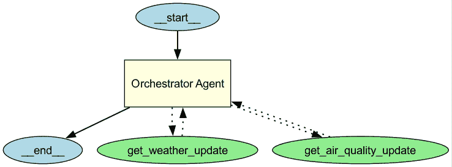

使用 GraphViz 可视化代理作为工具模式。

### 使用简单方法将代理转换为工具

现在，让我们进入代码部分。我们可以通过使用`agent.as_tool()`函数将代理转换为一个可调用的工具。这个函数需要两个参数：`tool_name`和`tool_description`。

我们可以直接在我们的新`orchestrator_agent`的`tools`列表中应用此方法，如下所示：

```py
orchestrator_agent = Agent(
    name="Orchestrator Agent",
    instructions="""
    You are an orchestrator agent.
    Your task is to manage the interaction between the Weather Specialist Agent and the Air Quality Specialist Agent.
    You will receive a query from the user and will decide which agent to invoke based on the content of the query.
    If both weather and air quality information is requested, you will invoke both agents and combine their responses into one clear answer.
    """,
    tools=[
        weather_specialist_agent.as_tool(
            tool_name="get_weather_update",
            tool_description="Get current weather information and suggestion including temperature, humidity, wind speed and direction, precipitation, and weather codes."
        ),
        air_quality_specialist_agent.as_tool(
            tool_name="get_air_quality_update",
            tool_description="Get current air quality information and suggestion including pollutants and their levels."
        )
    ]
)
```

在`instruction`中，我们指导代理管理两个专家代理之间的交互。它可以根据查询调用一个或两个代理。如果同时调用两个专家代理，协调代理必须合并他们的响应。

<details class="wp-block-details is-layout-flow wp-block-details-is-layout-flow"><summary>以下是演示代理作为工具模式的完整脚本。</summary>

```py
from agents import Agent, Runner, function_tool
import asyncio
import streamlit as st
from dotenv import load_dotenv
import requests

load_dotenv()

@function_tool
def get_current_weather(latitude: float, longitude: float) -> dict:
    """Fetch current weather data for the given latitude and longitude."""

    url = "https://api.open-meteo.com/v1/forecast"
    params = {
        "latitude": latitude,
        "longitude": longitude,
        "current": "temperature_2m,relative_humidity_2m,dew_point_2m,apparent_temperature,precipitation,weathercode,windspeed_10m,winddirection_10m",
        "timezone": "auto"
    }
    response = requests.get(url, params=params)
    return response.json()

weather_specialist_agent = Agent(
    name="Weather Specialist Agent",
    instructions="""
    You are a weather specialist agent.
    Your task is to analyze current weather data, including temperature, humidity, wind speed and direction, precipitation, and weather codes.

    For each query, provide:
    1\. A clear, concise summary of the current weather conditions in plain language.
    2\. Practical, actionable suggestions or precautions for outdoor activities, travel, health, or clothing, tailored to the weather data.
    3\. If severe weather is detected (e.g., heavy rain, thunderstorms, extreme heat), clearly highlight recommended safety measures.

    Structure your response in two sections:
    Weather Summary:
    - Summarize the weather conditions in simple terms.

    Suggestions:
    - List relevant advice or precautions based on the weather.
    """,
    tools=[get_current_weather],
    tool_use_behavior="run_llm_again"
)

@function_tool
def get_current_air_quality(latitude: float, longitude: float) -> dict:
    """Fetch current air quality data for the given latitude and longitude."""

    url = "https://air-quality-api.open-meteo.com/v1/air-quality"
    params = {
        "latitude": latitude,
        "longitude": longitude,
        "current": "european_aqi,us_aqi,pm10,pm2_5,carbon_monoxide,nitrogen_dioxide,sulphur_dioxide,ozone",
        "timezone": "auto"
    }
    response = requests.get(url, params=params)
    return response.json()

air_quality_specialist_agent = Agent(
    name="Air Quality Specialist Agent",
    instructions="""
    You are an air quality specialist agent.
    Your role is to interpret current air quality data and communicate it clearly to users.

    For each query, provide:
    1\. A concise summary of the air quality conditions in plain language, including key pollutants and their levels.
    2\. Practical, actionable advice or precautions for outdoor activities, travel, and health, tailored to the air quality data.
    3\. If poor or hazardous air quality is detected (e.g., high pollution, allergens), clearly highlight recommended safety measures.

    Structure your response in two sections:
    Air Quality Summary:
    - Summarize the air quality conditions in simple terms.

    Suggestions:
    - List relevant advice or precautions based on the air quality.
    """,
    tools=[get_current_air_quality],
    tool_use_behavior="run_llm_again"
)

orchestrator_agent = Agent(
    name="Orchestrator Agent",
    instructions="""
    You are an orchestrator agent.
    Your task is to manage the interaction between the Weather Specialist Agent and the Air Quality Specialist Agent.
    You will receive a query from the user and will decide which agent to invoke based on the content of the query.
    If both weather and air quality information is requested, you will invoke both agents and combine their responses into one clear answer.
    """,
    tools=[
        weather_specialist_agent.as_tool(
            tool_name="get_weather_update",
            tool_description="Get current weather information and suggestion including temperature, humidity, wind speed and direction, precipitation, and weather codes."
        ),
        air_quality_specialist_agent.as_tool(
            tool_name="get_air_quality_update",
            tool_description="Get current air quality information and suggestion including pollutants and their levels."
        )
    ],
    tool_use_behavior="run_llm_again"
)

async def run_agent(user_input: str):
    result = await Runner.run(orchestrator_agent, user_input)
    return result.final_output

def main():
    st.title("Weather and Air Quality Assistant")
    user_input = st.text_input("Enter your query about weather or air quality:")

    if st.button("Get Update"):
        with st.spinner("Thinking..."):
            if user_input:
                agent_response = asyncio.run(run_agent(user_input))
                st.write(agent_response)
            else:
                st.write("Please enter a question about the weather or air quality.")

if __name__ == "__main__":
    main()
```</details>

将此文件保存为`06-agents-as-tools-app.py`，并在终端中使用以下命令运行：

```py
streamlit run 06-agents-as-tools-app.py
```

### Orchestrator 如何使用代理

让我们从只触发一个代理的查询开始。在这个例子中，我询问了雅加达的天气。

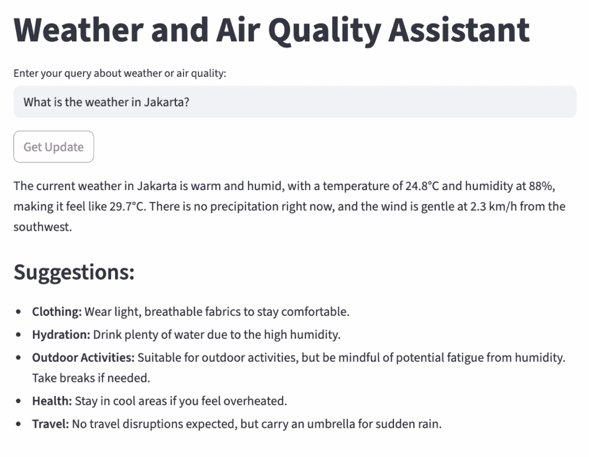

特定任务模式下代理响应的截图。

结果与我们使用交接模式得到的结果相似。天气专家代理提供了当前的温度，并根据 API 数据提供建议。

如前所述，使用代理作为工具模式的一个关键优势是它允许编排代理针对单个查询咨询多个代理。编排代理根据用户的意图智能地规划。

例如，让我们询问雅加达的天气和空气质量。结果看起来像这样：

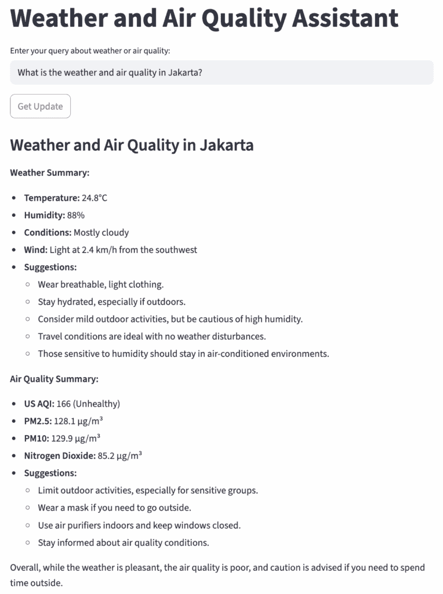

多任务模式下代理响应的截图。

编排代理首先从天气和空气质量专家代理那里返回单独的摘要，以及他们各自的建议。最后，它结合洞察力，提供总体结论——例如，由于空气质量差，建议在户外活动时谨慎行事。

### 探索跟踪仪表板

这里是跟踪结构的概述。我们可以看到主分支只涉及编排代理——与交接模式不同，在交接模式中，分诊代理将控制权转交给下一个专业代理。

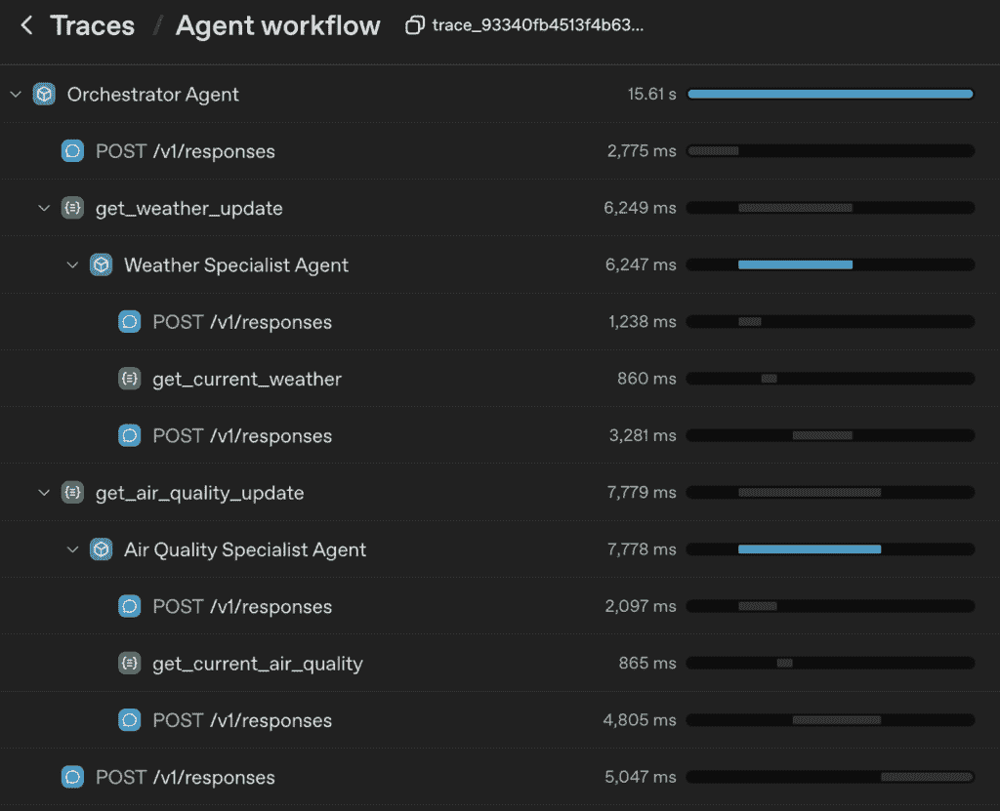

在第一个 LLM 响应中，编排代理调用了两个函数：`get_weather_update()`和`get_air_quality_update()`。这些函数最初是代理，我们将其转换成了工具。这两个函数接收相同的输入：“雅加达”。

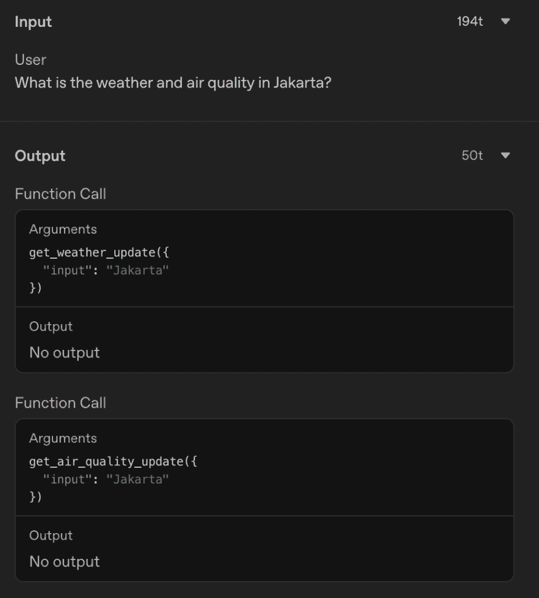

在收到两个工具的输出后，编排代理再次调用 LLM 来合并响应并生成最终的摘要。

### 定制代理作为工具

我们之前使用的方法是将代理快速转变为工具的一种方法。然而，正如我们在跟踪仪表板中看到的那样，它并没有给我们控制每个函数输入的能力。

在我们的例子中，编排代理使用“雅加达”作为输入调用函数。这意味着将这一转换成精确的地理坐标的任务留给了专业代理的 LLM。这种方法并不总是可靠的——我遇到了专业代理使用不同的经纬度值调用 API 的情况。

通过使用结构化输入定制代理作为工具，可以解决这个问题。如[文档](https://openai.github.io/openai-agents-python/tools/#customizing-tool-agents)中建议，我们可以在工具实现中使用`Runner.run()`。

```py
@function_tool
async def get_weather_update(latitude: float, longitude: float) -> str:
    result = await Runner.run(
        weather_specialist_agent,
        input="Get the current weather condition and suggestion for this location (latitude: {}, longitude: {})".format(latitude, longitude)
    )
    return result.final_output

@function_tool
async def get_air_quality_update(latitude: float, longitude: float) -> str:
    result = await Runner.run(
        air_quality_specialist_agent,
        input="Get the current air quality condition and suggestion for this location (latitude: {}, longitude: {})".format(latitude, longitude)
    )
    return result.final_output 
```

这两个函数被装饰了`@function_tool`，类似于我们定义的 API 调用工具——将这两个代理都转换成了可以被编排代理调用的工具。

现在每个函数现在都接受 `latitude` 和 `longitude` 作为参数，与之前的方法不同，我们无法控制输入值。

由于我们在这些函数内部运行代理，因此我们还需要明确地定义输入，作为一个包含纬度和经度的格式化字符串。

此方法提供了一种更可靠的方法：协调代理确定确切的坐标并将它们传递给工具，而不是依赖每个专业代理来解决位置——消除了 API 调用的不一致性。

<details class="wp-block-details is-layout-flow wp-block-details-is-layout-flow"><summary>此实现的完整脚本可以在以下位置找到。</summary>

```py
from agents import Agent, Runner, function_tool
import asyncio
import streamlit as st
from dotenv import load_dotenv
import requests

load_dotenv()

@function_tool
def get_current_weather(latitude: float, longitude: float) -> dict:
    """Fetch current weather data for the given latitude and longitude."""

    url = "https://api.open-meteo.com/v1/forecast"
    params = {
        "latitude": latitude,
        "longitude": longitude,
        "current": "temperature_2m,relative_humidity_2m,dew_point_2m,apparent_temperature,precipitation,weathercode,windspeed_10m,winddirection_10m",
        "timezone": "auto"
    }
    response = requests.get(url, params=params)
    return response.json()

weather_specialist_agent = Agent(
    name="Weather Specialist Agent",
    instructions="""
    You are a weather specialist agent.
    Your task is to analyze current weather data, including temperature, humidity, wind speed and direction, precipitation, and weather codes.

    For each query, provide:
    1\. A clear, concise summary of the current weather conditions in plain language.
    2\. Practical, actionable suggestions or precautions for outdoor activities, travel, health, or clothing, tailored to the weather data.
    3\. If severe weather is detected (e.g., heavy rain, thunderstorms, extreme heat), clearly highlight recommended safety measures.

    Structure your response in two sections:
    Weather Summary:
    - Summarize the weather conditions in simple terms.

    Suggestions:
    - List relevant advice or precautions based on the weather.
    """,
    tools=[get_current_weather],
    tool_use_behavior="run_llm_again"
)

@function_tool
def get_current_air_quality(latitude: float, longitude: float) -> dict:
    """Fetch current air quality data for the given latitude and longitude."""

    url = "https://air-quality-api.open-meteo.com/v1/air-quality"
    params = {
        "latitude": latitude,
        "longitude": longitude,
        "current": "european_aqi,us_aqi,pm10,pm2_5,carbon_monoxide,nitrogen_dioxide,sulphur_dioxide,ozone",
        "timezone": "auto"
    }
    response = requests.get(url, params=params)
    return response.json()

air_quality_specialist_agent = Agent(
    name="Air Quality Specialist Agent",
    instructions="""
    You are an air quality specialist agent.
    Your role is to interpret current air quality data and communicate it clearly to users.

    For each query, provide:
    1\. A concise summary of the air quality conditions in plain language, including key pollutants and their levels.
    2\. Practical, actionable advice or precautions for outdoor activities, travel, and health, tailored to the air quality data.
    3\. If poor or hazardous air quality is detected (e.g., high pollution, allergens), clearly highlight recommended safety measures.

    Structure your response in two sections:
    Air Quality Summary:
    - Summarize the air quality conditions in simple terms.

    Suggestions:
    - List relevant advice or precautions based on the air quality.
    """,
    tools=[get_current_air_quality],
    tool_use_behavior="run_llm_again"
)

@function_tool
async def get_weather_update(latitude: float, longitude: float) -> str:
    result = await Runner.run(
        weather_specialist_agent,
        input="Get the current weather condition and suggestion for this location (latitude: {}, longitude: {})".format(latitude, longitude)
        )
    return result.final_output

@function_tool
async def get_air_quality_update(latitude: float, longitude: float) -> str:
    result = await Runner.run(
        air_quality_specialist_agent,
        input="Get the current air quality condition and suggestion for this location (latitude: {}, longitude: {})".format(latitude, longitude)
    )
    return result.final_output

orchestrator_agent = Agent(
    name="Orchestrator Agent",
    instructions="""
    You are an orchestrator agent with two tools: `get_weather_update` and `get_air_quality_update`.
    Analyze the user's query and invoke:
      - `get_weather_update` for weather-related requests (temperature, humidity, wind, precipitation).
      - `get_air_quality_update` for air quality-related requests (pollutants, AQI).
    If the query requires both, call both tools and merge their outputs.
    Return a single, clear response that addresses the user's question with concise summaries and actionable advice.
    """,
    tools=[get_weather_update, get_air_quality_update],
    tool_use_behavior="run_llm_again"
)

async def run_agent(user_input: str):
    result = await Runner.run(orchestrator_agent, user_input)
    return result.final_output

def main():
    st.title("Weather and Air Quality Assistant")
    user_input = st.text_input("Enter your query about weather or air quality:")

    if st.button("Get Update"):
        with st.spinner("Thinking..."):
            if user_input:
                agent_response = asyncio.run(run_agent(user_input))
                st.write(agent_response)
            else:
                st.write("Please enter a question about the weather or air quality.")

if __name__ == "__main__":
    main()
```

## 结论

我们已经展示了两种多代理协作的基本模式：交接模式和代理作为工具模式。

交接模式适用于主要代理可以将整个对话委托给专业代理的场景。另一方面，当主要代理需要保持对任务的控制时，代理作为工具模式非常强大。

尽管本文中的用例相对简单，但它们说明了代理如何有效地工作和协作。从现在开始，了解何时使用交接或代理作为工具，你可以继续探索构建具有更具挑战性任务和工具的专用代理。

我们将在下一期《与代理 SDK 一起动手》中继续我们的旅程。

## 下一篇文章

> [与代理 SDK 一起动手：使用护栏保护输入和输出](https://towardsdatascience.com/hands-on-with-agents-sdk-safeguarding-input-and-output-with-guardrails/)

## 参考文献

[1] Bornet, P., Wirtz, J., Davenport, T. H., De Cremer, D., Evergreen, B., Fersht, P., Gohel, R., Khiyara, S., Sund, P., & Mullakara, N. (2025). 《代理人工智能：利用人工智能代理重塑商业、工作和生活》。世界科学出版社。

[2] OpenAI. (2025). 《OpenAI 代理 SDK 文档》。2025 年 8 月 1 日检索，来自 [`openai.github.io/openai-agents-python/`](https://openai.github.io/openai-agents-python/) [handoffs/](https://openai.github.io/openai-agents-python/handoffs/)

[3] Pydantic. (n.d.). 《模型》。Pydantic 文档。2025 年 8 月 1 日检索，来自 [`docs.pydantic.dev/latest/concepts/models/`](https://docs.pydantic.dev/latest/concepts/models/)

* * *

在这里阅读第一篇文章：

> [与代理 SDK 一起动手：你的第一个 API 调用代理](https://towardsdatascience.com/hands%e2%80%91on-with-agents-sdk-your-first-api%e2%80%91calling-agent/)

你可以在以下存储库中找到本文中使用的完整源代码：[agentic-ai-weather | GitHub 仓库](https://github.com/miqbalrp/agentic-ai-weather)。请随意探索、克隆或分叉项目以跟进或构建你自己的版本。

如果你想看到这个应用程序的实际运行情况，我还在这里部署了它：[天气助手 Streamlit](https://weather-assistant-miqbalrp.streamlit.app/)

最后，让我们在[LinkedIn](https://www.linkedin.com/in/miqbalrp/)上建立联系！
