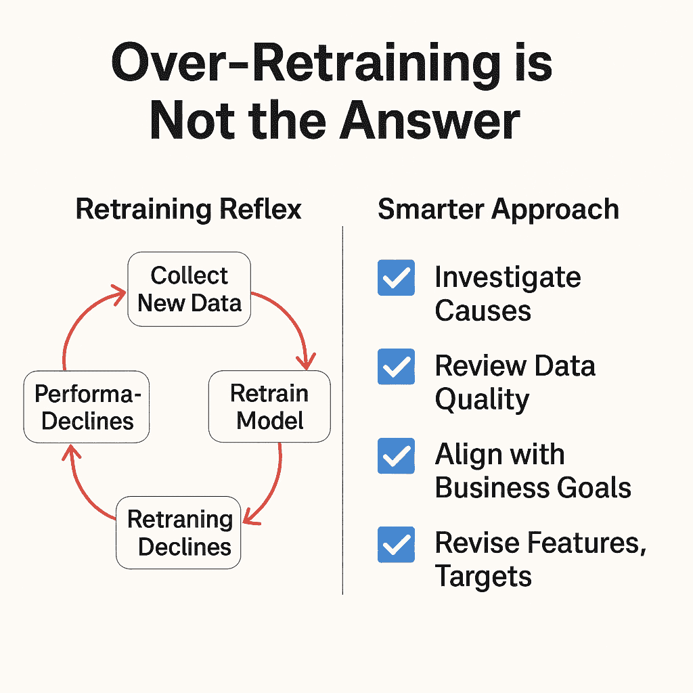
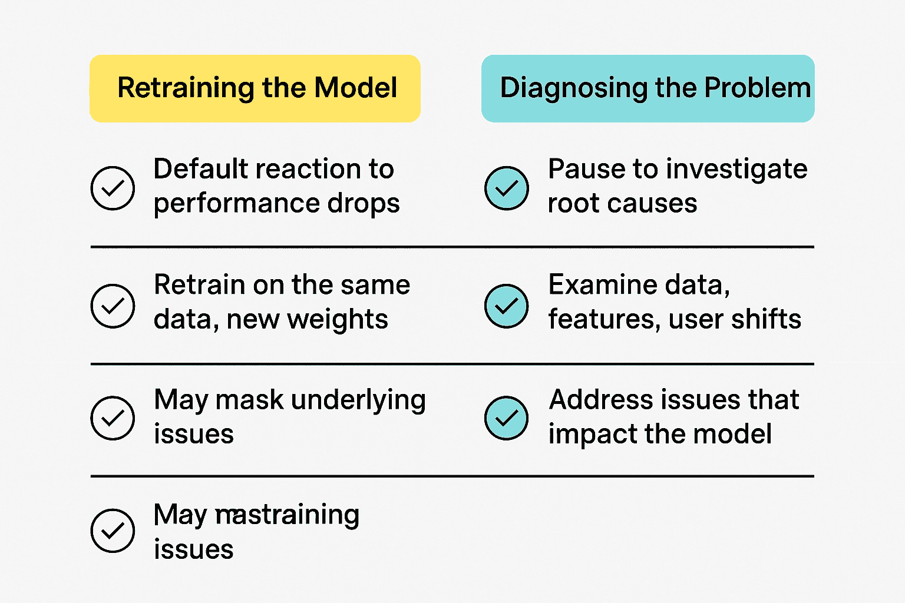

# 重新训练的误区：为什么模型刷新并不总是解决问题的方法

> [`towardsdatascience.com/the-misconception-of-retraining-why-model-refresh-isnt-always-the-fix/`](https://towardsdatascience.com/the-misconception-of-retraining-why-model-refresh-isnt-always-the-fix/)

<mdspan datatext="el1753892860984" class="mdspan-comment">这个</mdspan>短语“只是重新训练模型”听起来简单得令人上当。每当指标下降或结果变得嘈杂时，它已成为机器学习操作中的一种常见解决方案。我曾目睹整个 MLOps 管道被重新配置，以每周、每月或在大数据摄入后进行重新训练，而从未质疑过重新训练是否是适当的事情。

然而，这是我经历过的：重新训练并不总是解决方案。经常，它只是掩盖了更基本的盲点、脆弱的假设、较差的可观察性或目标不一致等问题的手段，这些问题不能仅仅通过向模型提供更多数据来解决。

## 重新训练的反射源于错误的自信

当团队设计可扩展的 ML 系统时，重新训练经常被团队操作化。你构建循环：收集新数据，证明性能，并在指标下降时重新训练。但缺乏的是暂停，或者说，是诊断层，它会询问性能下降的原因。

我与一个每周重新训练的推荐引擎合作，尽管用户基础并不非常活跃。这最初看起来是良好的卫生习惯，保持模型新鲜。然而，我们开始看到性能波动。在追踪问题后，我们发现我们只是在训练集中注入了陈旧或偏颇的行为信号：对不活跃用户的过度重视，UI 实验的点击伪影，或暗启动的不完整反馈。

重新训练的循环并没有纠正系统；它只是在注入噪音。

## 当重新训练使事情变得更糟

### 从临时噪音中无意学习

在我审计的一个欺诈检测管道中，重新训练是在预定的时间表上进行的：每周日的午夜。然而，在一个周末，针对新用户发起了一项营销活动。他们的行为不同——他们要求更多的贷款，更快地完成，并且有稍微风险一些的档案。

这种行为被模型记录并重新训练。结果？在接下来的星期，欺诈检测水平降低，误报案例增加。模型学会了将新常态视为可疑的，这阻碍了良好用户。

我们没有构建一种方法来确认性能变化是否稳定、具有代表性或是有意为之。重新训练只是短期异常，最终变成了长期问题。

### 点击反馈不是真实情况

您的目标也不应该是错误的。在某个媒体应用中，质量是通过点击率作为代理来衡量的。我们创建了一个内容推荐优化模型，并每周使用新的点击日志进行重新训练。然而，产品团队改变了设计，自动播放预览变得更加激进，缩略图更大，人们点击得更多，即使他们没有互动。

重新训练循环理解为内容相关性的增加。因此，模型加大了对这些资产的投入。实际上，我们使点击变得容易出错，而不是因为真正的兴趣。性能指标保持不变，但用户满意度下降，这是重新训练无法确定的。

**过度训练与根本原因修复（作者图片）**

## Meta 指标弃用：当模型基础发生改变时

在某些情况下，不是模型，而是数据具有不同的含义，重新训练无法帮助。

这就是最近在 2024 年废弃了 Meta（[社交媒体管理帮助](https://social-media-management-help.brandwatch.com/hc/en-us/articles/17666960115613-Deprecation-of-Facebook-Metrics-in-Measure#:~:text=As%20of%20September%2016%2C%202024,be%20used%20for%20historical%20purposes.)）的一些最基本页面洞察[指标](https://social-media-management-help.brandwatch.com/hc/en-us/articles/17666960115613-Deprecation-of-Facebook-Metrics-in-Measure#:~:text=As%20of%20September%2016%2C%202024,be%20used%20for%20historical%20purposes.)时发生的情况。例如点击量、参与用户和参与率等指标已被弃用，这意味着它们不再在最重要的分析工具中更新和支持。

这最初是一个前端分析问题。然而，我与一些团队合作，这些团队不仅使用这些指标来创建仪表板，还用于创建预测模型中的功能。推荐评分、广告支出优化和内容排名引擎的优化依赖于点击类型和参与率（触达）作为训练信号。

当此类指标停止更新时，重新训练没有出现任何错误。管道正在运行，模型已更新。然而，信号现在已失效；它们的分布被锁定，值不在同一尺度上。模型学习到了垃圾信息，它们默默地衰减，没有留下任何可见的迹象。

这里强调的是，重新训练有一个固定的含义。然而，在今天的机器学习系统中，您的特征通常是动态的 API，因此当上游语义演变时，重新训练可能会硬编码错误的假设。

## 那么，我们应该更新什么？

我相信，在大多数情况下，当模型失败时，根本问题在于模型之外。

### 修复特征逻辑，而不是模型权重

我审查的一个搜索相关性系统中的点击对齐分数正在下降。所有这些都在指向漂移：重新训练模型。然而，更彻底的检查揭示了特征管道进度落后，因为它没有检测到新的查询意图（例如，与短视频相关的查询与博客文章），分类的税则分类没有更新。

仅在确切的缺陷表示上进行重新训练只修复了错误。

我们通过重新实现特征逻辑、引入会话感知嵌入以及用推断的主题集群替换过时的查询标签来解决这个问题。没有必要再次重新训练；在输入被修复后，已经就位的工作模型运行得完美无缺。

### 段落意识

另一件通常被忽视的事情是用户群体的演变。用户行为随着产品而变化。重新训练不必重新对齐群体；它只是简单地平均它们。我了解到用户段落的重新聚类和建模宇宙的重新定义可能比重新训练更有效。

## 向更智能的更新策略迈进

重新训练应该被视为一种外科手术工具，而不是维护任务。更好的方法是监控对齐差距，而不仅仅是准确率损失。

### 监控预测后 KPIs

我依赖的最好的信号之一是[预测后 KPIs](https://milvus.io/ai-quick-reference/what-is-the-role-of-kpis-in-predictive-analytics)。例如，在保险承保模型中，我们不仅仅关注模型 AUC；我们跟踪预测风险带下的索赔损失率。当预测低风险组开始出现意外的索赔率时，这成为检查对齐而不是盲目重新训练的触发器。

### 模型信任信号

另一种技术是监控信任度下降。如果用户停止信任模型的输出（例如，贷款官员覆盖预测，内容编辑绕过建议的资产），那是一种信号损失。我们将手动覆盖作为警报信号，并据此进行调查，有时进行重新训练。

这种重新训练的反射并不局限于传统的表格或事件驱动系统。我见过类似的错误悄悄进入 LLM 管道，其中过时的提示或反馈对齐被重新训练，而不是重新评估底层提示策略或用户交互信号。

**重新训练与对齐策略：系统比较** **（图片由作者提供）**

## 结论

重新训练很有吸引力，因为它让你感觉自己在完成某件事情。数字下降了，你进行重新训练，然后它们又上升了。然而，根本原因也可能隐藏在那里：目标不一致、特征理解错误和数据质量盲点。

更深刻的观点如下：重新训练不是解决方案；它是对你是否已经学会了问题的检查。

你不会每次仪表盘闪烁时都重新启动汽车引擎。你会检查闪烁的原因，以及为什么。同样，模型更新应该被考虑，而不是自动进行。当你的目标不同时才重新训练，而不是当你的分布不同时。

最重要的是，请记住：一个维护良好的系统是一个你可以知道哪里出了问题的系统，而不是一个你只是不断更换零件的系统。
