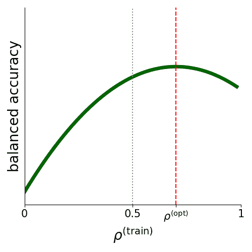
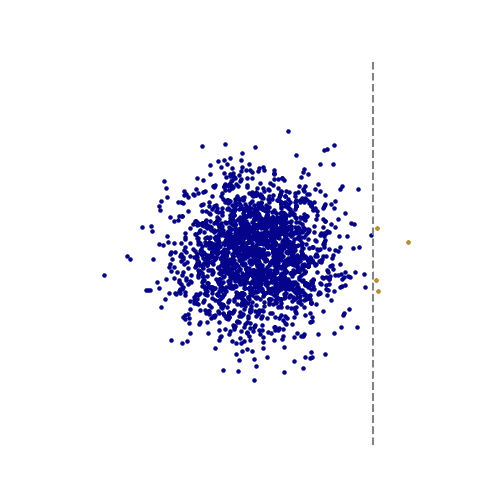
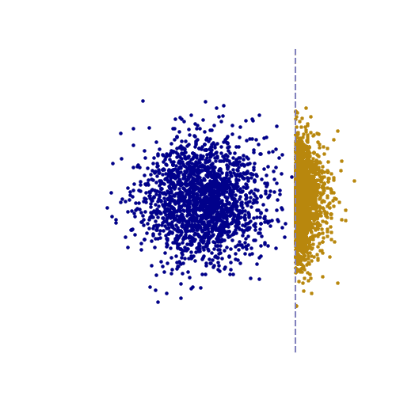

# 当 50/50 不是最佳：反驳甚至再平衡

> [当 50/50 并非最佳：反驳甚至再平衡](https://towardsdatascience.com/when-50-50-isnt-optimal-debunking-even-rebalancing/)

## <mdspan datatext="el1753388299410" class="mdspan-comment">针对旧挑战的旧解决方案</mdspan>

你正在训练你的模型进行垃圾邮件检测。你的数据集中正例比负例多得多，因此你投入了无数小时的工作来将其再平衡到 50/50 的比例。现在你很满意，因为你能够解决类别不平衡问题。如果告诉你 60/40 不仅足够，甚至更好呢？

在大多数机器学习分类应用中，一类实例的数量多于其他类。这会减慢学习速度 [1] 并可能导致训练模型产生偏差 [2]。解决这一问题的最广泛使用的方法依赖于一个简单的处方：找到一种方法给所有类别相同的权重。通常，这是通过简单的方法来实现的，例如给予少数类实例更多的重视（重新加权），从数据集中移除多数类实例（欠采样），或者多次包含少数类实例（过采样）。

这些方法的有效性经常被讨论，理论和实证工作都表明，哪种解决方案最好取决于你的具体应用 [3]。然而，有一个很少被讨论且经常被默认假设的隐藏假设：再平衡是否真的是一个好主意？在某种程度上，这些方法是有效的，所以答案是肯定的。但我们应该**完全**再平衡我们的数据集吗？为了简单起见，让我们以二元分类问题为例。我们应该将训练数据再平衡到每个类别 50%吗？直觉告诉我们是的，并且直觉指导实践至今。在这种情况下，直觉是错误的。出于直观的原因。

## 我们所说的“训练不平衡”是什么意思？

在我们深入探讨 50%为何不是二元分类中最佳训练不平衡度之前，让我们定义一些相关量。我们称 *n₀* 为一类（通常是少数类）的实例数量，而 *n₁* 为另一类的实例数量。这样，训练集中数据实例的总数是 *n*=*n₀*+*n₁*。今天我们要分析的是训练不平衡度，

*ρ*⁽ᵗʳᵃⁱⁿ⁾ = *n₀*/*n*。

## 50%是次优的证据

初始证据来自随机森林的实证工作。Kamalov 及其合作者测量了 20 个数据集上的最佳训练不平衡度 *ρ*⁽ᵒᵖᵗ⁾ [4]。他们发现其值因问题而异，但得出结论，其值大约为 *ρ*⁽ᵒᵖᵗ⁾=43%。这意味着，根据他们的实验，你希望多数类实例略多于少数类实例。但这并不是全部故事。如果你想追求最优模型，不要止步于此，直接将你的 *ρ*⁽ᵗʳᵃⁱⁿ⁾ 设置为 43%。

实际上，今年，Pezzicoli 等人的理论研究[5]表明，最佳训练不平衡并不是适用于所有应用的通用值。它不是 50%，也不是 43%。事实上，最佳不平衡是变化的。有时它可以小于 50%（如 Kamalov 和合作者测量的那样），有时可以大于 50%。*ρ*⁽ᵒᵖᵗ⁾ 的具体值将取决于每个特定分类问题的细节。找到 *ρ*⁽ᵒᵖᵗ⁾ 的一种方法是为几个 *ρ*⁽ᵗʳᵃⁱⁿ⁾ 值训练模型，并测量相关的性能。例如，这可能看起来像这样：

图片由作者创作

尽管确定 *ρ*⁽ᵒᵖᵗ⁾ 的确切模式仍然不清楚，但似乎当数据量相对于模型大小充足时，最佳不平衡小于 50%，正如 Kamalov 的实验所示。然而，许多其他因素——从少数实例的内在稀有性到训练动态的噪声程度——共同决定了训练不平衡的最佳值，并确定了当训练偏离 *ρ*⁽ᵒᵖᵗ⁾ 时损失的性能。

## 为什么完美的平衡并不总是最佳选择

正如我们所说的，答案实际上是非常直观的：由于不同的类别具有不同的属性，两个类别携带相同信息是没有理由的。事实上，Pezzicoli 的团队证明了它们通常不是。因此，为了推断最佳决策边界，我们可能需要比另一个类别更多的实例。Pezzicoli 的工作，在异常检测的背景下，为我们提供了一个简单而富有洞察力的例子。

假设数据来自一个多元高斯分布，并且我们将决策边界右侧的所有点标记为异常。在二维空间中，它看起来是这样的：

图片由作者创作，灵感来源于[5]

虚线是我们的决策边界，决策边界右侧的点是 *n*₀ 个异常。现在让我们将我们的数据集重新平衡到 *ρ*⁽ᵗʳᵃⁱⁿ⁾=0.5。为此，我们需要找到更多的异常。由于异常值很少见，我们最有可能找到的异常值都靠近决策边界。仅凭肉眼，这个场景就非常明显：

图片由作者创作，灵感来源于[5]

异常（黄色）沿着决策边界堆叠，因此比蓝色点更能提供关于其位置的信息。这可能会让人想到，优先考虑少数类别的点可能更好。另一方面，异常值只覆盖决策边界的一侧，因此一旦有足够的少数类别的点，就可以方便地投资于更多的多数类别的点，以更好地覆盖决策边界的另一侧。由于这两个相互竞争的影响，*ρ*⁽ᵒᵖᵗ⁾ 通常不是 50%，其确切值取决于问题本身。

## 根本原因是类别不对称

Pezzicoli 的理论表明，最优的不平衡通常不同于 50%，因为不同的类别有不同的属性。然而，他们只分析了类别之间多样性的一个来源，即异常值行为。然而，正如 Sarao-Mannelli 和合著者 [6] 所示，还有很多其他效应，例如类别内部的子群体存在，可以产生类似的效果。是大量效应的并发，决定了类别之间的多样性，这告诉我们我们特定问题的最优不平衡是什么。在我们有一个可以一起处理数据中所有不对称来源的理论（包括那些由模型架构处理引起的）之前，我们无法事先知道数据集的最优训练不平衡。

## 关键要点与你可以采取的不同做法

如果到目前为止你将你的二元数据集平衡到 50%，你已经做得很好了，但你很可能没有做到最好。尽管我们仍然没有一种理论可以告诉我们最优的训练不平衡应该是什么，但现在你知道它可能不是 50%。好消息是，它正在路上：机器学习理论家们正在积极解决这个话题。与此同时，你可以将 *ρ*⁽ᵗʳᵃⁱⁿ⁾ 视为一个可以先调优的超参数，就像任何其他超参数一样，以最有效的方式重新平衡你的数据。所以在你下一次模型训练运行之前，问问自己：50/50 真的是最优的吗？尝试调整你的类别不平衡——你的模型的表现可能会让你惊讶。

## 参考文献

[1] E. Francazi, M. Baity-Jesi 和 A. Lucchi, [类别不平衡下的学习动态的理论分析](https://scholar.google.com/scholar_url?url=https%3A%2F%2Fproceedings.mlr.press%2Fv202%2Ffrancazi23a%2Ffrancazi23a.pdf&hl=en&sa=T&oi=gsb-gga&ct=res&cd=0&d=12635278980990073185&ei=PJR7aN7hJvHWieoP2-iNgA4&scisig=AAZF9b84qmsQXLCTuvZC4caKucol) (2023), ICML 2023

[2] K. Ghosh, C. Bellinger, R. Corizzo, P. Branco, B. Krawczyk 和 N. Japkowicz, [深度学习中的类别不平衡问题](https://scholar.google.com/scholar_url?url=https%3A%2F%2Flink.springer.com%2Fcontent%2Fpdf%2F10.1007%2Fs10994-022-06268-8.pdf&hl=en&sa=T&oi=gsb-gga&ct=res&cd=0&d=9957691737491202054&ei=XZR7aJfnNdSWieoPwNe_8AQ&scisig=AAZF9b9ffO9g8awfNlC2Aosrky4Z) (2024), *机器学习*, *113*(7), 4845–4901

[3] E. Loffredo, M. Pastore, S. Cocco 和 R. Monasson, [恢复平衡：数据优化的原则性欠采样/过采样以实现最佳分类](https://proceedings.mlr.press/v235/loffredo24a.html) (2024), ICML 2024

[4] F. Kamalov, A.F. Atiya 和 D. Elreedy, [不平衡数据的部分重采样](https://scholar.google.com/scholar_url?url=https%3A%2F%2Farxiv.org%2Fpdf%2F2207.04631&hl=en&sa=T&oi=gsb-gga&ct=res&cd=0&d=9896611503144553266&ei=qpR7aNyiN4OuieoP-Oj-oAs&scisig=AAZF9b_ex5spbs9Z2iWV0SdiAEiM) (2022), *arXiv 预印本 arXiv:2207.04631*

[5] F.S. Pezzicoli, V. Ros, F.P. Landes 和 M. Baity-Jesi, [异常检测中的类别不平衡：从可精确求解的模型中学习](https://proceedings.mlr.press/v258/pezzicoli25a.html) (2025). AISTATS 2025

[6] S. Sarao-Mannelli, F. Gerace, N. Rostamzadeh 和 L. Saglietti, [诱导偏差的几何形状：一个具有公平性影响的可精确求解的数据模型](https://scholar.google.com/scholar_url?url=https%3A%2F%2Farxiv.org%2Fpdf%2F2205.15935&hl=en&sa=T&oi=gsb-gga&ct=res&cd=0&d=16758924486781238922&ei=7pR7aPCMBe2rieoPrfPiSA&scisig=AAZF9b9TPek54PJ6FSHgSzSvXW5M) (2022), *arXiv 预印本 arXiv:2205.15935*
