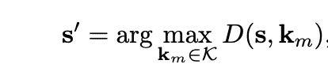
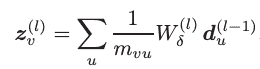
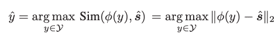

# 从规则到关系：机器是如何相互理解的

> [`towardsdatascience.com/from-rules-to-relationships-how-machines-are-learning-to-understand-each-other/`](https://towardsdatascience.com/from-rules-to-relationships-how-machines-are-learning-to-understand-each-other/)

## <mdspan datatext="el1753229384765" class="mdspan-comment">上下文</mdspan>

通信系统已经从简单的比特传输发展到智能信息共享。传统系统侧重于尽可能可靠地将原始数据从 A 点传输到 B 点。现在，随着物联网设备、自主系统和智能基础设施中机器对机器通信的爆炸式增长，我们遇到了一个基本的瓶颈。

现代网络被不必要的数据淹没。但机器不需要传统系统传输的每一比特信息。

让我们看看以下安全监控交互：

**安全摄像头：** *在非工作时间在限制区域内发现有人走动，并捕获一个 5MB 大小的视频帧*

**传统系统：** *发送包含每个单独比特的整个 5MB 帧*

**中央监控：** *分析帧并确定：“在区域 A 检测到未经授权的人员”*

在这个交互中，监控系统主要关注的是安全警报，而不是人员的服装细节、面部特征或背景。但传统的通信对每个像素都给予同等的重要性，在传输与决策相关的少数比特的同时，也传输了数百万不相关的比特。

语义通信作为一种范式转变，传输的是意义而不是比特。而不是发送整个 5MB 的视频帧，语义通信系统只会提取和传输：“zone_A, unauthorized_person, threat_level_high”，同时只需要极小的一部分数据，同时保留所有与决策相关的信息。

接收系统通过部署安全人员到区域 A 进行未经授权的入侵，得到它需要做出正确决策的确切信息。

早期系统依赖于语义知识库（SKBs）来减少带宽使用，同时不丢失消息的实际意义。

但基于 SKB 的系统存在局限性。它们在受控环境中表现良好，但在遇到未知场景时会失败。这种局限性引发了基于知识图谱的语义通信的发展，这种通信承诺通过关系推理来解决未知情况。

## 为什么基于 SKB 的语义通信会失败？

SKB 系统有一个关键弱点。为了理解它，我们首先需要看到它们是如何处理信息的。

在我们的安全监控示例中，摄像头和监控站维护一个共享的知识库 K = {k[m] ∈ R^d}[{m∈M}]，其中每个 k[m]代表类别 m 的语义属性。当安全摄像头捕获视频帧 x 时，语义编码器 S_α(·)提取特征 s ∈ R^d。

而不是直接传输“s”，系统使用余弦相似度找到最接近的匹配项：

图片来源：SKB 论文[1]

其中 D(s, k<bdo dir="ltr" lang="">[m]</bdo>) 表示 s 和 k[m] 之间的余弦相似度。

在我们的例子中，摄像头看到有人在受限区域内，并提取出“人体形状、无制服、夜间活动”等特征。它将这些特征与知识库进行比较，并发现最佳匹配项是知识库中索引 v 的“unauthorized_person”。它不是发送所有特征细节，而是只传输“v”。

这种简单的方法显著减少了带宽使用，同时保留了监控系统做出决策所需的所有信息。

### 这在哪里出了问题？

系统运行良好，直到出现意外情况。当摄像头发现其知识库中没有的东西时会发生什么？

让我们看看以下示例：

**安全摄像头：** *在非工作时间看到穿着工作服携带工具的维护工人*

**SKB 系统：** *只知道“unauthorized_person”、“authorized_person”、“vehicle”、“animal”*

**系统决策：** *自信地将工人分类为“unauthorized_person”，具有高威胁级别*

**结果：** *误报——安全团队被派遣去阻止合法的维护工作*

背后的数学可能看起来很简单，但实际上相当有问题。系统总是选择“最佳”匹配项，即使所有选项都很糟糕。这就像在多项选择题中被迫选择一个答案，而没有任何一个选项有意义。你仍然必须选择某个答案，而系统无法表示它不知道。

这些问题在实际部署中会变得更加严重。例如，如果你的训练数据没有包括阴影，系统开始将它们称为“入侵者”。没有冬季服装示例进行训练，它认为厚重的外套是“可疑装备”。系统从不承认不确定性。它总是显得自信，即使完全错误。

## 知识图谱是如何解决这个问题？

基于知识图谱的语义通信通过编码节点之间的关系来解决 SKB 的限制，而不是仅仅孤立地分类。它不是问“这个匹配哪个类别？”，而是问“这与我所知道的东西有什么关系？”

让我们通过我们的维护工人示例来了解差异：

**步骤 1：检测和特征提取** 摄像头检测与之前相同的功能，例如“人体形状、工作服、携带工具、非工作时间安排”

**步骤 2：关系映射** 而不是将这些特征强行归入一个类别，知识图谱将它们映射到多个相互连接的节点。

*人体形状 → 触发“human”节点

工作服 + 工具 → *触发* “work_tools” 和 “maintenance_equipment” 节点

非工作时间安排 → *触发* “unusual_access_time” 节点

**步骤 3：关系遍历**

为了跟踪节点之间的连接，系统使用以下公式：

图片来源：知识图谱论文[2]

其中，“z[v]”表示节点 v 的更新表示，总和聚合了所有相邻节点 u 的信息。每个节点从其连接的邻居中获取其意义。

*work_tools → indicates → maintenance_activity

maintenance_activity → performed_by → maintenance_worker

maintenance_worker → is_a → authorized_personnel (conditional)

off_hours_access + authorized_personnel → requires → verification*

**步骤 4：情境推理**

知识图谱结合了这些关系路径：“这似乎是由可能授权的人员进行的维护活动，但在确定威胁级别之前需要验证时间。”

最终分类使用以下公式：

图片来源：知识图谱论文[2]

其中ŷ是预测类别，φ(y)是类别 y 的知识图谱嵌入，ŝ是接收到的语义信息。这导致了“在警报之前验证”而不是 SKB 的强制“未经授权的人员”分类。

## 关键差异

与维护工人示例的不同之处在于，SKB 系统看到“非工作时间在限制区域内的人类”并被迫从其现有类别中进行选择。在我们的例子中，系统选择了“未经授权的人员”，因为它是最接近的匹配。

基于知识图谱的系统采取了一种完全不同的方法。它看到了同一个人，但开始连接点。携带工作工具的人暗示着维护活动，这通常是一个合法的目的。但在非工作时间发生意味着需要先进行验证。系统生成一个智能响应——“在警报之前验证。”即使系统没有针对这种场景进行训练，它也能使用关系图进行推理。

## 评估

知识图谱系统在 SKB 系统的基础上显示出显著的改进，在熟悉和不熟悉的环境中均提高了 70-80%的准确率。即使在信号质量不佳的情况下，系统也能很好地工作，这证明了它实际上可以在通信嘈杂的真实世界场景中运行。

话虽如此，知识图谱系统也有其局限性。图构建需要领域专业知识和大计算能力。我们的测试仅限于具有预定类别的特定数据集，所以我们不确定它在大规模真实世界部署中的表现如何。这些系统在完全取代基于 SKB 的系统之前需要更多的测试。

### 结论

当一切都可以预测时，SKB 系统非常出色，但在一个不熟悉的环境中却失败了。知识图谱通过真正理解节点之间如何相互连接来解决这个问题。这使得系统可以通过这些连接在陌生的环境中进行推理，而不是需要对每种可能的情况进行显式训练。它们构建起来更困难且成本更高，但它们适合现实世界的场景。

## 参考文献

[1] [`arxiv.org/pdf/2405.05738`](https://arxiv.org/pdf/2405.05738)

[2] [`arxiv.org/pdf/2507.02291`](https://arxiv.org/pdf/2507.02291)
