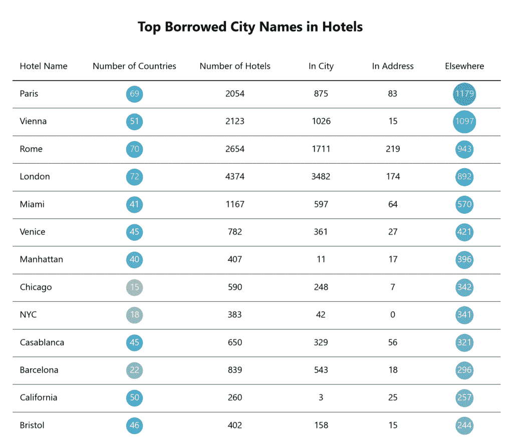
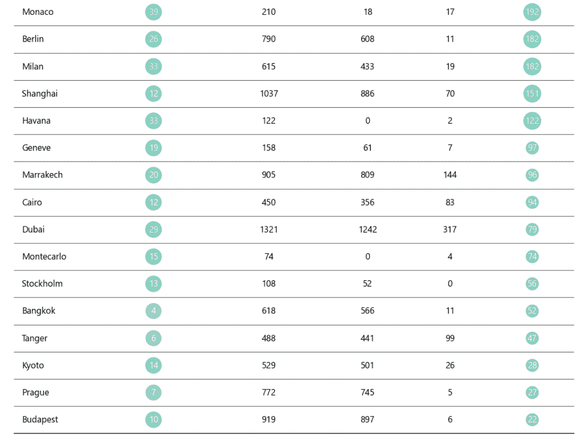
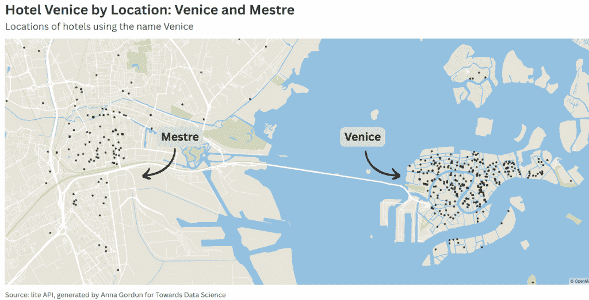
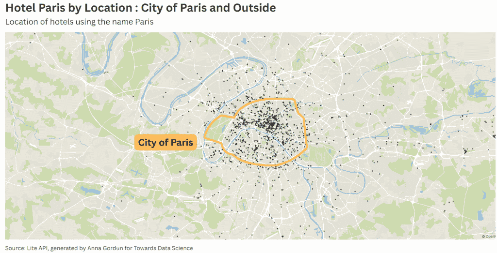
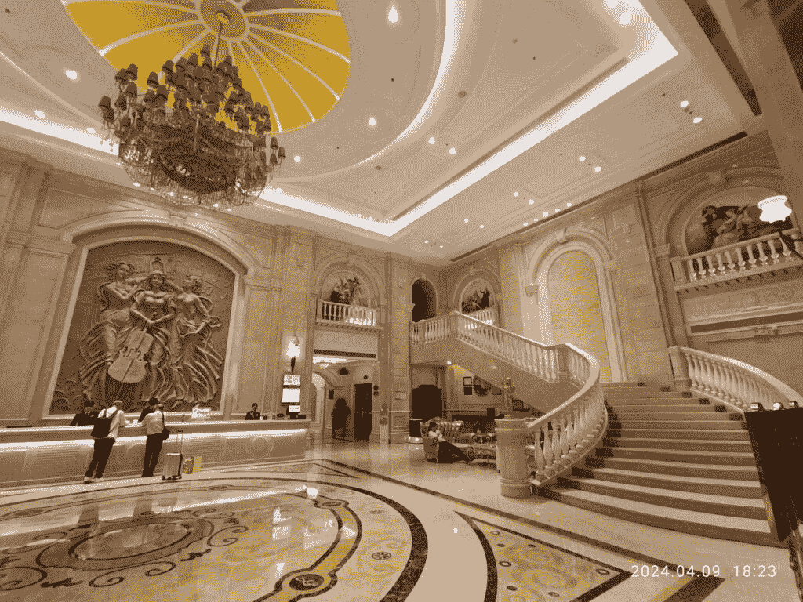
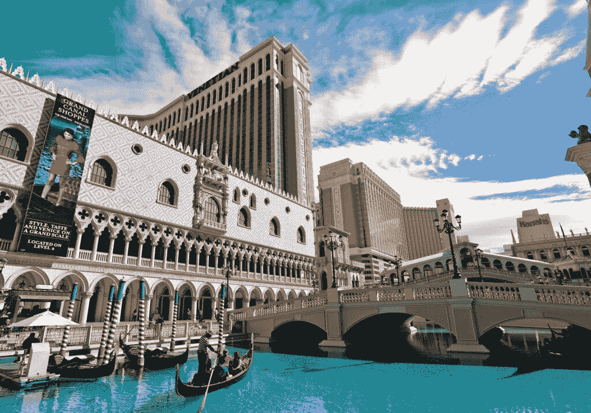
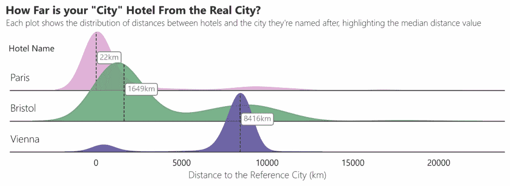

# 我分析了 25,000 个酒店名称，发现了四个令人惊讶的真相

> [原文链接](https://towardsdatascience.com/i-analysed-25000-hotel-names-and-found-something-unexpected/)

## <mdspan datatext="el1753143695213" class="mdspan-comment">引言</mdspan>

前几天我在奥斯陆散步时，经过一座装饰华丽的建筑，有红地毯、黑色遮阳篷，以及用大写字母写的名字：酒店布里斯托尔。我感到困惑。布里斯托尔？在奥斯陆？

嗯，结果发现加州酒店在巴黎，曼哈顿酒店在雅加达，维也纳酒店几乎无处不在，除了维也纳。

我本以为这全都是营销策略。但随着我进一步探索，我看到了三个故事正在展开：地理位置、抱负和古老的传统。

跟随我一起进入一个有趣的数据分析，探索那些借用其他城市名称的酒店世界。结果？比我预期的要令人惊讶得多。

* * *

## 顶级酒店名称是什么？

从奥斯陆之旅回来后，我实在无法释怀。所以我做了我最擅长的事情：培养了一种轻微的痴迷，并打开了太多的标签页。在那些标签页中的一个上，我发现了来自 liteAPI 的[酒店数据 API](https://docs.liteapi.travel/reference/get_data-hotels)，他们非常友好地允许我使用他们的数据进行分析。

这是我的做法：

我对提及主要城市但实际并不位于这些城市的酒店名称进行了全球搜索。对于每个城市名称（比如罗马），我遍历了每个国家代码，并提取了在世界任何地方都有该名称的酒店。

> *我在本文中提到“城市”，但一些名称（如加州和曼哈顿）并不是城市。我包括它们是因为它们在酒店名称中被广泛使用。*

下面的代码展示了如何提取城市列表的数据。它使用了一个名为*launch_requests*的函数来处理 API 查询，这里我不会分享——查询 API 和获取密钥的详细信息可以在官方[文档](https://docs.liteapi.travel/reference/get_data-hotels)中找到。

```py
# Loop through each city name in your list (e.g., Paris, Vienna, Rome)
citylist=["Paris","Vienna","Rome"]
for city in citylist:
    print('Starting extraction for', city)
    results=[]

    # Loop through each country code (e.g., US, FR, DE) from your DataFrame,
    # Please source your own list of countrycodes for this!

    for alpha in countrycodes['alpha-2']:
        print(alpha)

        # Construct the API request URL with the current country and city name
        # + Filters.
        url = (
            "https://api.liteapi.travel/v3.0/data/hotels"
            "?countryCode="+alpha+
            "&hotelName="+city+
            "&limit=5000"
            "&hotelTypeIds=201%2C203%2C204%2C205%2C206%2C208%2C219%2C231"
        )

        # Launch the request and append the result to the list
        results.append(launch_requests(url))

    # Combine all responses for the current city into a single DataFrame
    df_all = pd.concat(results, ignore_index=True)

    # Save the results as a CSV named after the city
    df_all.to_csv(str(city) + '_24_04.csv') 
```

我进行了精确匹配筛选，以保持事物的整洁，所以*“浪漫酒店”*没有作为错误的罗马混入。我还进一步将结果标记为*“incity”*，当酒店位于与名称相同的城市时（例如，罗马的酒店布里斯托尔），*“inaddress”*当酒店位于以城市命名的街道上时（例如，罗马街上的酒店布里斯托尔），以及“outside”用于其他所有情况。

至于城市名称，除了明显的布里斯托尔，我更多的是根据氛围而不是地理位置来挑选的。

我从古老的风情开始列名单：伦敦、罗马和巴黎。泳池边的阳光？那是*迈阿密*、*加州*、*巴塞罗那*和*哈瓦那*。我加入了*威尼斯*、*布拉格*和*维也纳*，增添了一些优雅。*马拉喀什*、*卡萨布兰卡*和*开罗*？异国情调和神秘。最后以世界性城市结束：*曼哈顿*、*柏林*和*上海*。

> 为了说明，以**巴黎人澳门**的美丽大堂为例，这是一家以巴黎为主题的酒店，位于中国澳门。


图片由[Hr Hao](https://unsplash.com/es/@hrhao?utm_content=creditCopyText&utm_medium=referral&utm_source=unsplash)在[Unsplash](https://unsplash.com/es/fotos/una-gran-habitacion-con-un-candelabro-y-pinturas-en-las-paredes-3ijRTiX9HLU?utm_content=creditCopyText&utm_medium=referral&utm_source=unsplash)提供。

现在，让我们揭晓……以下是全球酒店名称中使用最多的城市名称的最终列表。把它想象成城市名称在酒店房卡上看起来很棒的奥运比赛。

在此之前，这里是前 7 名选手的地图，以及当然，这篇文章背后的神秘原因——布里斯托尔。每个点都是一个真正的酒店，所以请随意放大、筛选并观察点在国界线上的出现。

由作者使用 Flourish 生成的交互式地图。

> *最大的惊喜？与北美分散的酒店相比，欧洲城市名称酒店的集中度很高。在北美之后叫什么名字的酒店？也许这是另一篇文章的内容？*

现在，回到数字上，这是如何阅读表格的方法（如果你好奇，我使用了[PlotTable](https://plottable.readthedocs.io/en/latest/index.html)库）。

+   酒店名称：酒店名称中提到的城市。

+   国家数量：有多少个国家有使用此名称的酒店。

+   酒店数量：全球使用此名称的酒店总数。

+   在城市中：有多少实际上是位于真实城市中的。

+   地址中：有多少位于同名街道或区域。

+   在外：其余部分和有趣的部分——借用名称但位于实际地点附近。



“酒店中借用最多的城市名称”系列第一部分。图片由作者提供。



“酒店中借用最多的城市名称”系列第二部分。图片由作者提供。

获胜者是…

**巴黎**，光之城和爱情之城，以超过 1100 家酒店在全球名列前茅。这足以让每个周末都预订一家新酒店，连续 20 年？

排名第二的是**维也纳**，这在中国的确是个惊喜，尤其是这个名字在中国非常受欢迎。

第三名是罗马，感觉在意大利的每个城镇几乎都能找到 Hotel Roma。

我不禁要问，这真的是因为这些城市所激发的奢华和魅力吗？——或者是因为某些名字听起来“昂贵”？让我们在下一节深入探讨。

* * *

## 为什么酒店要借用城市名称？

+   **可见性**

有时候——作为一个节俭的旅行者，我可以对此发誓——并不是关于身处城市，而是关于足够接近。以马斯特雷为例，它是威尼斯的大陆邻国。那里的许多酒店都在名称中使用“威尼斯”以在旅行搜索中显示。例如，“*威尼斯马斯特雷圣朱利亚诺希尔顿花园酒店*”在有人搜索“威尼斯住宿地点”时出现的可能性要大得多。查看以下地图，它展示了所有在威尼斯和马斯特雷附近使用“威尼斯”名称的酒店。



在威尼斯和马斯特雷使用“威尼斯”名称的酒店位置。图片由作者提供

在巴黎也会发生同样的事情。许多酒店位于官方城市界限之外，但足够近，让你仍然感觉像在巴黎度假。也许甚至足够近，可以闻到埃菲尔铁塔前那五欧元的咖啡香气。



在巴黎市内和市外使用“巴黎”名称的酒店位置。图片由作者提供

+   **品牌**

有时，酒店名称与地理位置关系不大，而与大堂播放的音乐有关。

我在谈论成立于 1993 年的中国深圳的**维也纳酒店集团**。创始人选择“维也纳”这个名字是为了销售优雅、舒适和古典音乐——一个欧洲幻想。

到今天，他们中的许多酒店仍然采用欧洲风格的品牌设计，包括新古典主义柱子、吊灯和大堂播放的古典钢琴音乐。难以抗拒，对吧？



深圳维也纳酒店大堂。图片来自维基共享资源。 [链接](https://commons.wikimedia.org/wiki/File:SZ_%E6%B7%B1%E5%9C%B3_Shenzhen_%E9%BE%8D%E8%8F%AF%E5%8D%80_Longhua_%E6%B0%91%E6%B2%BB_Minzhi_%E7%8E%89%E9%BE%8D%E8%B7%AF_Yulong_Road_%E7%B6%AD%E4%B9%9F%E7%BA%B3%E5%9C%8B%E9%9A%9B%E9%85%92%E5%BA%97_Vienna_Hotel_lobby_April_2024_R12S_102.jpg)

事实上，当我查看数据时，仅中国就有近 1000 家酒店在名称中包含维也纳，比任何国家都多，包括奥地利本身。

其他有趣的品牌例子是雅加达的**曼哈顿酒店**：

> ✨️查看雅加达曼哈顿酒店[`t.co/IJRO0eD4Bm`](https://t.co/IJRO0eD4Bm) [图片](https://t.co/GG370ZyD3H)
> 
> — TwinMompreneur (@TLoopid) [2024 年 4 月 22 日](https://twitter.com/TLoopid/status/1782367495346950234?ref_src=twsrc%5Etfw)

拉斯维加斯的**威尼斯酒店**，你给我多少钱我也不会去的：



图片由[tommao wang](https://unsplash.com/@tommaomaoer?utm_content=creditCopyText&utm_medium=referral&utm_source=unsplash)在[Unsplash](https://unsplash.com/photos/white-and-brown-concrete-building-beside-river-under-blue-sky-during-daytime-yfvSBMQO7lA?utm_content=creditCopyText&utm_medium=referral&utm_source=unsplash)提供

再看看菲律宾巴塔安的**迈阿密热海滩度假村**。

> 在巴塔安的迈阿密海滩度假村的中旬假期[pic.twitter.com/DFp20H5zPh](https://t.co/DFp20H5zPh)
> 
> — HANA (@hannahlynnenano) [2018 年 12 月 21 日](https://twitter.com/hannahlynnenano/status/1076160692464435200?ref_src=twsrc%5Etfw)

+   **传统**

并非每家酒店都是以销售位置或幻想来命名的。有些酒店的名字是出于纯粹的传统。

让我们回到开启这次旅程的名字：**布里斯托尔**。

我首先绘制了每个布里斯托尔酒店的地图——只需向上滚动即可查看您自己的交互式地图。结果？在英国布里斯托尔市外的英国没有一家布里斯托尔酒店。

这些酒店在欧洲乃至南美洲都很分散。所以我很好奇：这些酒店距离布里斯托尔市有多远？

这里是如何测量的：

1.  我计算了每个酒店坐标与布里斯托尔坐标之间的距离。

```py
# Compute the distance (in km) between each hotel and the city center of Bristol.
# The 'bristol' DataFrame contains one hotel per row, with 'latitude' and 'longitude' columns.

origin=(51.4545,-2.5879)
bristol['distance_km']=bristol.apply(lambda row:distance(
    origin,
    (row['latitude'],row['longitude'])
).km, axis=1) 
```

2. 我随后将那些距离与巴黎和维也纳的距离分布并排放置，使用 Seaborn 的*FacetGrid*作为 RidgePlot。代码（太长，不适合这篇文章）基于 Thiago Carvalho 在[Plain English](https://plainenglish.io/blog/ridge-plots-with-pythons-seaborn-4de5725881af)中的指南。



酒店与它们命名的城市之间的距离分布。图片由作者提供

结果不言而喻：

+   **巴黎**酒店平均距离实际城市只有**22 公里**，主要是由位置驱动的，正如我们在第一部分所探讨的。

+   **维也纳**酒店平均距离**8,416 公里**——这是一个明显的有趣品牌案例。

+   **布里斯托尔**酒店？它们平均距离布里斯托尔**1,649 公里**——位置太远，不可能是原因。

那么，这里真正的故事是什么呢？为此，我转向**[罗杰·威廉姆斯](http://thefirsthotelbristol.blogspot.com/)**，他是记者和《“布里斯托尔酒店的欢乐时光”》一书的作者，这本书探讨了全球布里斯托尔酒店的迷人起源。

> 真是个令人惊喜的发现。今天我们入住酒店[@BristolVienna](https://twitter.com/BristolVienna?ref_src=twsrc%5Etfw)时得到了免费的房间升级… [#amex](https://twitter.com/hashtag/amex?src=hash&ref_src=twsrc%5Etfw) [#bristol](https://twitter.com/hashtag/bristol?src=hash&ref_src=twsrc%5Etfw) [#vienna](https://twitter.com/hashtag/vienna?src=hash&ref_src=twsrc%5Etfw) [pic.twitter.com/bKy3u6k7kP](https://t.co/bKy3u6k7kP)
> 
> — Alexander Falk (@afalk) [2017 年 6 月 11 日](https://twitter.com/afalk/status/873921208743587841?ref_src=twsrc%5Etfw)

威廉姆斯谈论了一位 18 世纪的英国贵族，**布里斯托尔勋爵**。他以其真正的艺术和旅行鉴赏家而闻名，他的访问往往提升了某个地方的地位：他下榻的酒店甚至非正式地被称为“布里斯托尔勋爵的酒店”。结果证明，这就是欧洲第一家布里斯托尔酒店开业的方式。后来，其他酒店也采用了这个名称，要么是为了听起来更加精致奢华，要么，正如 1925 年巴黎布里斯托尔酒店的老板所说，只是为了保持一种可以追溯到 18 世纪的传统。

## 这不仅仅是一个名字

这段旅程始于对奥斯陆的布里斯托尔酒店的简单疑问，这个名字感觉奇怪地格格不入。一切始于一家酒店，但很快我就开始在世界各地绘制名称。最初只是城市名称，但很快变成了关于地理、品牌甚至一点古老欧洲传统的故事。以下是我们的发现总结：

1.  **巴黎**是拥有最多酒店名称的城市。其中大部分甚至不在巴黎——平均的“巴黎酒店”距离实际城市有 22 公里。

1.  **维也纳**紧随其后。但不仅仅是一个城市——它还是一个拥有近 1000 家分店的中国的酒店品牌，所有这些都在销售一种精致、经典的欧洲幻想。

1.  **罗马**排名第三，结果发现意大利的酒店都喜欢以首都命名。是地理位置还是愿望？也许两者都有。

所有这些都表明，酒店名称很少是随机的。它们在销售一个地点、一种幻想，有时甚至是一种传统。

并且是的，猫已经从袋子里出来了：全世界有超过 200 家布里斯托尔酒店，原因可以追溯到一位 18 世纪的英国贵族，他的酒店偏好变成了一种命名传统。

所以下次当你发现自己住在乌拉圭的伦敦、里斯本的罗马或墨西哥的巴塞罗那时——你会知道这个名字可能比你所看到的更多。现在，你知道如何开始揭开它的面纱了。

*所有本文中的图片和代码均由作者提供*
