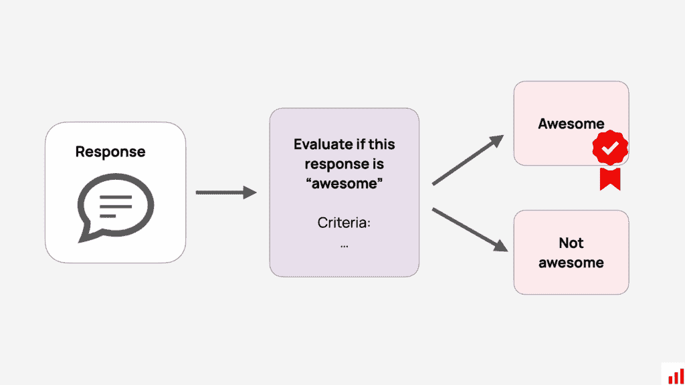
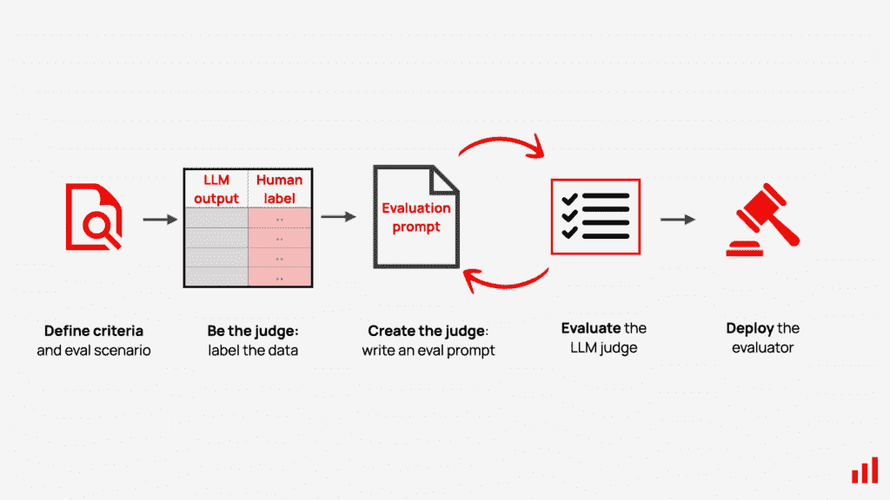
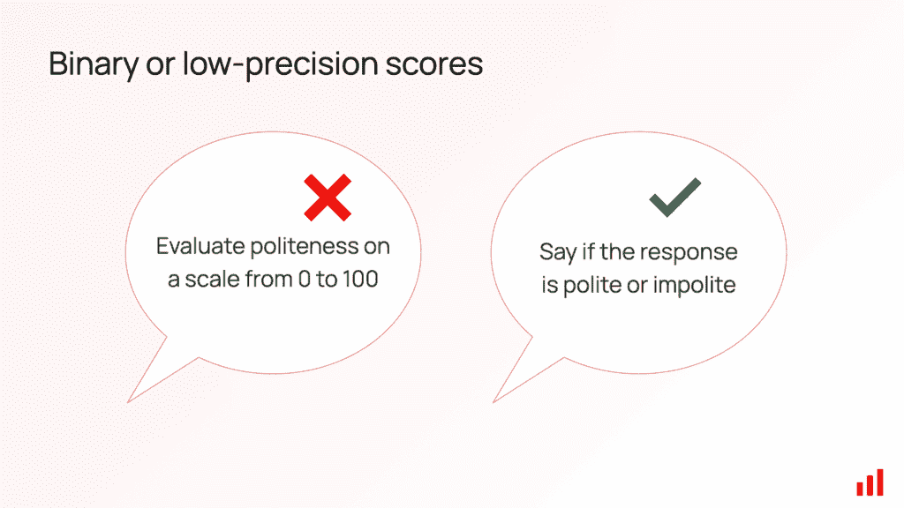
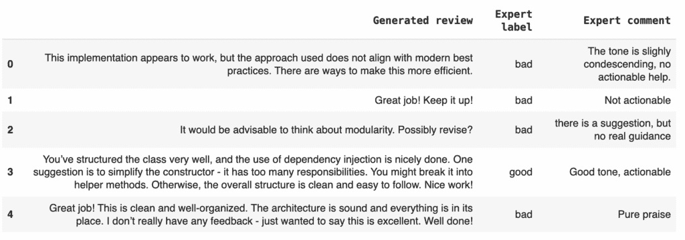
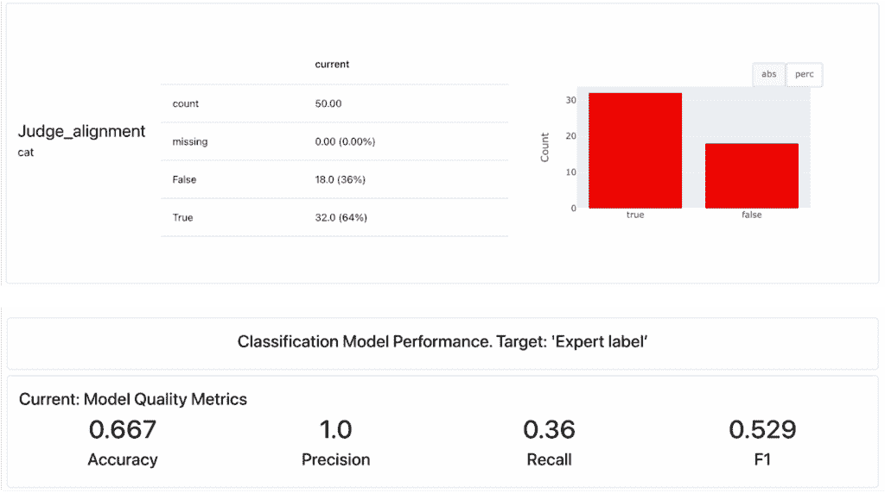
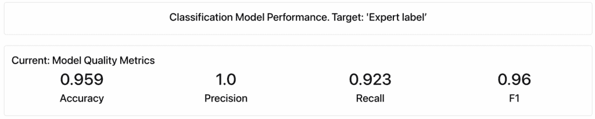
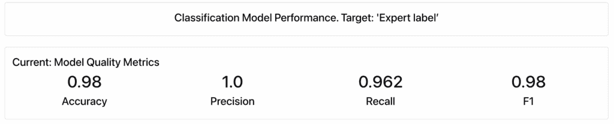
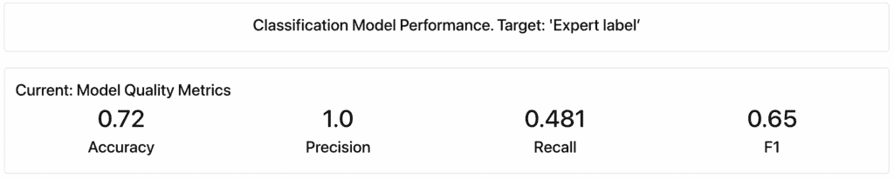
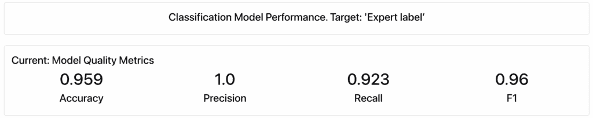

# 如何创建一个与人类标签相一致的大型语言模型（LLM）评判器

> [`towardsdatascience.com/how-to-create-an-llm-judge-that-aligns-with-human-labels/`](https://towardsdatascience.com/how-to-create-an-llm-judge-that-aligns-with-human-labels/)

<mdspan datatext="el1752872676004" class="mdspan-comment">如果你正在使用 LLM 构建应用，你可能遇到过这个挑战：你如何评估 AI 系统输出的质量？

假设你想检查一个回复是否有正确的语气。或者它是否安全、符合品牌、有帮助，或者是否在用户的提问背景下有意义。这些都是不易衡量的定性信号。

问题在于，这些质量往往是主观的。没有单一的“正确”答案。虽然人类擅长判断它们，但人类无法扩展。如果你正在测试或发布由 LLM 驱动的功能，你最终需要一种自动化评估的方法。

LLM 作为评判器是做这件事的一个流行方法：你提示一个 LLM 来评估另一个 LLM 的输出。它灵活、快速原型化，并且容易集成到你的工作流程中。

但有一个问题：你的 LLM 评判器也不是确定性的。在实践中，它就像运行一个小型机器学习项目，目标是要复制专家标签和决策。

从某种意义上说，你正在构建的是一个自动标记系统。

这意味着你还必须评估评估者，以检查你的 LLM 评判器是否与人类判断一致。

在这篇博客文章中，我们将展示如何创建和调整一个与人类标签相一致的 LLM 评估器——不仅如何提示它，还包括如何测试和信任它按预期工作。

我们将以一个实际例子结束：构建一个评估由 LLM 生成的代码审查评论质量的评判器。

*免责声明：我是 Evidently 开源工具的创建者之一，我们将在本例中使用该工具。我们将使用工具的免费和开源功能。我们还将提及使用 Open AI 和 Anthropic 模型作为 LLM 评估器的应用。这些是商业模型，在 API 调用中重现示例将花费几分钱。（你也可以用开源模型替换它们）。*

## 什么是 LLM 评估器？

LLM 评估器——或[LLM 作为评判器](https://www.evidentlyai.com/llm-guide/llm-as-a-judge)——是一种流行的技术，它使用 LLM 来评估由 AI 驱动的应用输出的质量。

理念很简单：你定义评估标准，并让一个 LLM 充当“评判者”。比如说，你有一个聊天机器人。你可以要求一个外部 LLM 评估其回复，考虑诸如相关性、有用性或连贯性等因素——类似于人类评判者可以做到的。例如，每个回复都可以被评为“好”或“坏”，或者根据你的需求分配到任何特定类别。



*LLM 作为评判器的理念。图片由作者提供*

使用一个 LLM 来评估另一个 LLM 一开始可能听起来有些反直觉。但在实践中，判断往往比生成更容易。创建一个高质量的回应需要理解复杂的指令和上下文。另一方面，评估这个回应则是一个更加狭窄、专注的任务——而且只要标准明确，LLM 可以出奇地好地处理这项任务。

让我们看看它是如何工作的！

## 如何创建一个 LLM 评估器？

由于 LLM 评估器的目标是扩展人类判断，第一步是定义你想要评估的内容。这将取决于你的具体情境——无论是语气、有用性、安全性还是其他什么。

虽然你可以提前编写一个提示来表达你的标准，但更稳健的方法是首先扮演裁判的角色。你可以从以你希望 LLM 评估器以后如何表现的方式来标记数据集开始。然后，将这些标签作为你的目标，并尝试编写评估提示以匹配它们。这样，你将能够衡量你的 LLM 评估器与人类判断的一致性。

这就是核心思想。我们将在下面更详细地介绍每个步骤。



*创建 LLM 裁判的工作流程。图由作者提供*

### 第 1 步：定义要判断的内容

第一步是决定你要评估什么。

有时候这很明显。比如说，你在分析 LLM 回应时已经观察到特定的失败模式——例如，聊天机器人拒绝回答或重复自己——并且你想要建立一个可扩展的方式来检测它。

有时，你需要首先运行测试查询并手动标记数据以识别模式和开发可推广的评估标准。

重要的是要注意：你不必创建一个包罗万象的 LLM 评估器。相反，你可以创建多个“小型”裁判，每个裁判专注于特定的模式或评估流程。例如，你可以使用 LLM 评估器来：

+   **检测失败模式**，如拒绝回答、重复回答或遗漏指令。

+   **计算代理质量指标**，包括对上下文的忠实度、对答案的相关性或正确的语气。

+   **运行特定场景的评估**，例如测试 LLM 系统如何处理对抗性输入、品牌敏感话题或边缘情况**。**这些特定测试的 LLM 裁判可以检查是否正确拒绝或遵守安全指南**。**

+   **分析**用户交互，例如按主题、查询类型或意图对回应进行分类。

关键是缩小每个评估器的范围，因为定义明确、具体的任务是 LLM 擅长的领域。

### 第 2 步：标记数据

在你要求 LLM 做出判断之前，你需要自己先成为裁判。

你可以手动标记一组回应。或者，你可以创建一个简单的标记裁判，然后审查和纠正其标签。这个标记的数据集将成为你的“基准真相”，反映了你偏好的判断标准。

在做这件事的时候，保持简单：

+   坚持使用二进制或少数类别标签。虽然 1-10 的评分尺度可能看起来很有吸引力，但复杂的评分尺度难以一致应用。

+   使你的标记标准足够清晰，以便其他人可以遵循。

例如，你可以根据语气是否“可接受”、“不可接受”或“模糊”来标记响应。



*坚持使用二进制或低精度分数以获得更好的一致性。图片由作者提供* 

### 第 3 步：编写评估提示

当你知道你在寻找什么时，是时候构建 LLM 评判员了！评估提示是 LLM 评判员的核心。

核心思想是，你应该自己编写这个评估提示。这样，你可以根据你的用例定制它，并利用领域知识来提高你指令的质量，而不仅仅是通用的提示。

如果你使用具有内置提示的工具，你应该首先在标记的数据上测试它们，以确保评分标准符合你的期望。

你可以将编写提示视为向第一次执行任务的实习生下达指令。你的目标是确保你的指令清晰具体，并提供关于你的用例中“好”和“坏”的例子，以便其他人可以遵循。

### 第 4 步：评估和迭代

一旦你的评估提示准备就绪，就在你的标记数据集上运行它，并将输出与“真实情况”的人类标签进行比较。

要评估 LLM 评判员的质量，你可以使用相关性指标，如 Cohen 的 Kappa，或分类指标，如准确率、精确率和召回率。

根据评估结果，你可以迭代你的提示：寻找模式以识别改进区域，调整评判标准并重新评估其性能。或者，你可以通过[提示优化](https://www.evidentlyai.com/blog/llm-judge-prompt-optimization)来自动化这一过程！

### 第 5 步：部署评判员

一旦你的评判员与人类偏好一致，你就可以投入使用，通过 LLM 评判员将手动审查替换为自动标记。

例如，你可以在提示实验期间使用它来修复特定的失败模式。比如说，你观察到拒绝率很高，你的 LLM 聊天机器人频繁拒绝回答它应该能够回答的用户查询。你可以创建一个 LLM 评判员来自动检测这种拒绝回答的情况。

一旦你将其部署到位，你就可以轻松地尝试不同的模型，调整你的提示，并获取关于你的系统性能是否改善或变差的可衡量反馈。

## 代码教程：评估代码审查的质量

现在，让我们将我们讨论的过程应用到实际示例中，从头到尾进行。

我们将创建并评估一个 LLM 评判员来评估代码审查的质量。我们的目标是创建一个与人类标签一致的 LLM 评判员。

在这个教程中，我们将：

+   定义我们 LLM 评判员的评估标准。

+   使用不同的提示/模型构建 LLM 评判员。

+   通过将结果与人类标签进行比较来评估评委的质量。

我们将使用 [Evidently](https://www.evidentlyai.com/)，这是一个拥有超过 2500 万次下载的开源 LLM 评估库。

让我们开始吧！

> **完整代码：**请参考这个[示例笔记本](https://github.com/evidentlyai/community-examples/blob/main/learn/LLMCourse_Tutorial_2_LLM_as_a_judge.ipynb)。
> 
> **更喜欢视频？**观看[视频教程](https://www.youtube.com/watch?v=kP_aaFnXLmY&list=PL9omX6impEuNTr0KGLChHwhvN-q3ZF12d&index=6)。

### 准备工作

首先，安装 Evidently 并运行必要的导入：

```py
!pip install evidently[llm]
```

你可以在[示例笔记本](https://github.com/evidentlyai/community-examples/blob/main/learn/LLMCourse_Tutorial_2_LLM_as_a_judge.ipynb)中查看完整的代码。

你还需要设置你的 LLM 评委的 API 密钥。在这个例子中，我们将使用 OpenAI 和 Anthropic 作为评估器 LLM。

### 数据集和评估标准

我们将使用一个包含 50 个代码审查和专家标签的数据集——27 个“差”和 23 个“好”示例。每个条目包括：

+   生成的评论文本

+   专家标签（好/差）

+   解释分配标签背后原因的专家评论。



*数据集中的生成评论和专家标签示例。图片由作者提供*

示例中使用的数据集是由作者生成的，可在[这里](https://github.com/evidentlyai/community-examples/blob/main/datasets/code_review_dataset.csv)找到。

这个数据集是“真实”数据集的一个示例，你可以用你的产品专家来整理：它显示了人类如何评判响应。我们的目标是创建一个 LLM 评估器，它返回相同的标签。

如果你分析人类专家的评论，你会注意到评论主要根据可操作性——*它们是否提供了实际指导？*——和语气——*它们是否是建设性的而不是严厉的？*——来评判。

我们创建 LLM 评估器的目标是使这些标准在提示中通用化。

### 初始提示和解释

让我们从基本的提示开始。这是我们表达标准的方式：

```py
A review is GOOD when it’s actionable and constructive.
A review is BAD when it’s non-actionable or overly critical.
```

在这种情况下，我们使用 Evidently LLM 评估器模板，它负责处理评估器提示的通用部分——例如请求分类、结构化输出和逐步推理——所以我们只需要表达实际标准并给出目标标签。

我们将使用 GPT-4o mini 作为评估器 LLM。一旦我们有了最终的提示，我们将运行 LLM 评估器对生成的评论进行评估，并将它返回的良/差标签与专家标签进行比较。

为了查看我们的朴素评估器与专家标签匹配得如何，我们将查看分类指标，如[准确率、精确率和召回率](https://www.evidentlyai.com/classification-metrics/accuracy-precision-recall)。我们将使用 Evidently 库中的分类报告来可视化结果。



*与人类标签和初始提示词的分类指标的一致性。图片由作者提供*

如我们所见，只有 67% 的评委标签与人类专家给出的标签相匹配。

100% 的精确率意味着当我们的评估者将评论标记为“坏”时，它总是正确的。然而，低召回率表明它错过了许多问题评论——我们的 LLM 评估者犯了 18 个错误。

让我们看看是否可以通过更详细的提示词做得更好！

### 实验 2：更详细提示词

我们可以更仔细地查看专家评论，并更详细地说明我们所说的“好”和“坏”是什么意思。

下面是一个经过改进的提示词：

```py
A review is **GOOD** if it is actionable and constructive. It should:
    - Offer clear, specific suggestions or highlight issues in a way that the developer can address
    - Be respectful and encourage learning or improvement
    - Use professional, helpful language—even when pointing out problems

A review is **BAD** if it is non-actionable or overly critical. For example:
    - It may be vague, generic, or hedged to the point of being unhelpful
    - It may focus on praise only, without offering guidance
    - It may sound dismissive, contradictory, harsh, or robotic
    - It may raise a concern but fail to explain what should be done
```

这次我们手动进行了更改，但你也可以使用 LLM 来 [帮助你重写提示词](https://www.evidentlyai.com/blog/llm-judge-prompt-optimization)。

让我们再次进行评估：



*更详细提示词的分类指标。图片由作者提供*

好得多！

我们得到了 96% 的准确率和 92% 的召回率。具体化评估标准是关键。评估器只错了两个标签。

虽然结果看起来已经相当不错，但我们还可以尝试一些其他的技巧。

### 实验 3：要求解释推理

我们将采取以下措施——我们将使用相同的提示词，但要求评估者再解释一次推理：

```py
Always explain your reasoning.
```



*如果要求解释推理，更详细提示词的分类指标。图片由作者提供*

添加一条简单的语句将性能提升到 98% 的准确率，整个数据集中只有一个错误。

### 实验 4：切换模型

当你对你的提示词感到满意时，你可以尝试用更便宜的模式运行它。我们使用 GPT-4o mini 作为这个实验的基线，并重新运行了 GPT-3.5 Turbo 的提示词。以下是我们的结果：

+   GPT-4o mini：98% 准确率，92% 召回率

+   GPT-3.5 Turbo：72% 准确率，48% 召回率



*如果切换到更便宜的模型（GRT-3.5 Turbo），更详细提示词的分类指标。图片由作者提供*

这种性能差异让我们想到了一个重要的考虑因素：提示词和模型是协同工作的。简单的模型可能需要不同的提示策略或更多的示例。

### 实验 5：切换提供商

我们还可以检查我们的 LLM 评估器与不同提供商的工作情况——让我们看看它与 Anthropic 的 Claude 的表现如何。



*使用另一提供商（Anthropic）的更详细提示词的分类指标。图片由作者提供*

两个提供商都达到了相同的高准确率水平，但错误模式略有不同。

下表总结了实验结果：

| **场景** | **准确率** | **召回率** | **错误数量** |
| --- | --- | --- | --- |
| 简单提示词 | 67% | 36% | 18 |
| 详细提示词 | 96% | 92% | 2 |
| “始终解释你的推理” | 98% | 96% | 1 |
| GPT-3.5 Turbo | 72% | 48% | 13 |
| Claude | 96% | 92% | 2 |

*表 1. 实验结果：测试场景和分类指标*

## **总结**

在本教程中，我们介绍了一个端到端的工作流程，用于创建 LLM 评估者以评估代码审查的质量。我们定义了评估标准，准备了专家标注的数据集，制作并完善了评估提示，针对不同的场景运行它，并比较结果，直到我们的 LLM 评委与人类标签对齐。

您可以将此工作流程调整以适应您的特定用例。以下是一些需要记住的要点：

**首先成为评委**。您的 LLM 评估者旨在扩展人类专业知识。因此，第一步是确保您对您正在评估的内容有清晰的了解。从一组代表性示例上的自己的标签开始是最好的方法。一旦有了它，使用标签和专家评论来确定评估提示的标准。

**关注一致性**。与人类判断完美一致并不总是必要或现实的——毕竟，人类之间也可能存在分歧。相反，目标是确保您的评估者判断的一致性。

**考虑使用多个专业评委**。与其创建一个全面的评估者，您可以将标准分割成独立的评委。例如，可操作性及语气可以独立评估。这使得调整和衡量每个评委的质量变得更加容易。

**从简单开始，逐步迭代**。从简单的评估提示开始，并根据错误模式逐渐增加复杂性。您的 LLM 评估者是一个小型提示工程项目：将其视为此类项目，并衡量其性能。

**使用不同模型运行评估提示**。没有单一的最好提示：您的评估者结合了提示和模型。使用不同的模型测试您的提示，以了解性能权衡。考虑您特定用例的准确性、速度和成本等因素。

**监控和调整**。LLM 评委本身是一个小型机器学习项目。随着您的产品发展或出现新的故障模式，它需要持续的监控和偶尔的重新校准。
