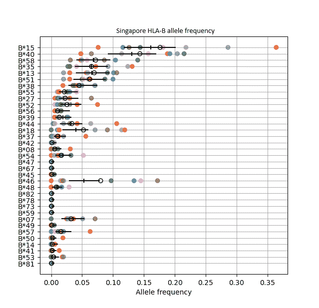
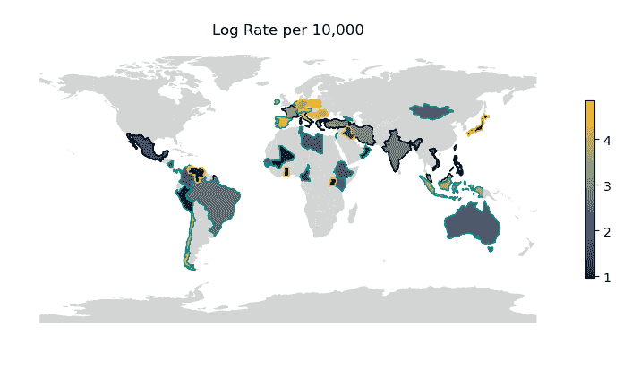
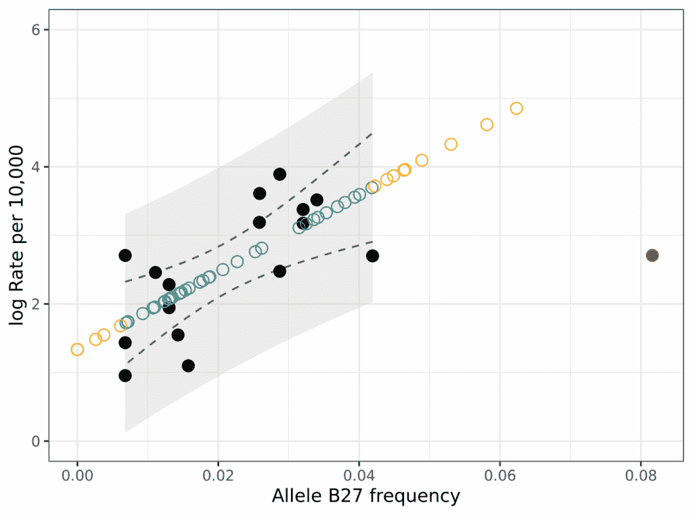

# 无诊断估计疾病率

> [`towardsdatascience.com/estimating-disease-rates-without-diagnosis/`](https://towardsdatascience.com/estimating-disease-rates-without-diagnosis/)

<mdspan datatext="el1752704582718" class="mdspan-comment">HLA 免疫基因</mdspan>对于触发免疫系统至关重要，以至于我们可以利用这些基因来预测一个人的免疫反应。在这里，我将演示如何仅从免疫基因频率中估计疾病率。从获取免疫基因数据，到识别高风险国家，以及评估模型局限性，所有步骤都进行了讨论，完整代码可在[github.com/DAWells/HLA_spondylitis_rate](https://github.com/DAWells/HLA_spondylitis_rate)找到。

HLA 基因与一个人的感染、疫苗接种反应有关，并且通常与自身免疫疾病非常紧密地相关。事实上，在大型群体中，我们可以从 HLA 基因频率中预测疾病率。HLA 频率被广泛研究，并且通常可用，这使得我们可以估计可能因诊断挑战而缺失或不准确的自身免疫状况的比率。在这篇文章中，我们将结合研究以生成免疫基因频率的准确估计，并使用这些估计来预测脊柱强直性脊柱炎的国家比率。

[allelefrequencies.net](http://allelefrequencies.net/)是一个全球人类免疫基因频率数据库，它是一个开放获取、免费且公共的资源（Gonzalez-Galarza 等人，2020 年）。然而，从多个项目中下载和合并数据可能很困难；这使得很难充分利用这些数据。幸运的是，`HLAfreq`是一个 Python 包，它使得从 allelefrequencies.net 获取最新数据并为我们分析做准备变得容易。（完全披露，我是 HLAfreq 的作者之一！）

脊柱强直性脊柱炎是一种关节炎，90%的患者有一种特定的 HLA B 基因版本。为了获取这种版本在不同国家的频率，我下载了所有可用的基因频率，并合并了同一国家的相同研究，按样本大小进行加权。简而言之，组合基于 Dirichlet 分布，我们可以使用贝叶斯方法来估计不确定性。以下图中的新加坡被用作示例（本文中的所有图表均由作者生成）。y 轴上显示了不同的 HLA-B 基因版本（也称为等位基因），x 轴上显示了新加坡的频率。原始新加坡研究的数据以颜色显示，合并估计以黑色显示。我在此分析中关注加权平均值，用黑色圆圈表示。HLAfreq 还计算了一个带有不确定性的贝叶斯估计，用黑色条形表示。



新加坡 HLA-B 等位基因的频率。每个独立研究的颜色各不相同。黑色表示带有不确定性的综合估计。

以下是用以下载、合并和绘制新加坡 HLA-B 等位基因频率数据的代码。

```py
# Download raw data
base_url = HLAfreq.makeURL(“Singapore”, standard="g", locus="B")
aftab = HLAfreq.getAFdata(base_url)
# Prepare data
aftab = HLAfreq.only_complete(aftab)
aftab = HLAfreq.decrease_resolution(aftab, 1)
# Combine data from multiple studies
caf = HLAfreq.combineAF(aftab)
hdi = HLAhdi.AFhdi(aftab, credible_interval=0.95)
caf = pd.merge(caf, hdi, how="left", on="allele")
# Plot gene frequencies
HLAfreq.plotAF(caf, aftab.sort_values("allele_freq"), hdi=hdi, compound_mean=hdi) 
```

现在我们有了国家的等位基因频率，我们可以将它们与国家的疾病率配对来研究相关性。我使用了 Dean 等人 2014 年报告的疾病率。我将疾病率进行了对数转换，使其呈正态分布，以便我可以拟合普通最小二乘线性回归。正如预期的那样，存在显著的正相关；HLA-B*27 频率较高的国家，强直性脊柱炎的发病率也较高。芬兰是个例外，它 HLA-B*27 的频率异常高，但疾病率却处于中等水平。我将芬兰从模型中移除，作为一个异常值，这个决定得到了“统计杠杆”的支持。（杠杆意味着这个点对整体模型的影响太大；我们希望模型告诉我们关于国家的一般情况，而不是特定国家的任何情况）。

我们可以使用我们的线性回归模型来预测已知 HLA-B*27 频率的国家强直性脊柱炎的发病率。这告诉我们，像奥地利和克罗地亚这样的国家预测的强直性脊柱炎发病率很高。使用这些预测将使有疾病率估计的国家数量从 16 个增加到 52 个，并有助于确定可能从额外监测中受益的国家。在下面的世界地图中，强直性脊柱炎已知或预测的发病率低的国家用蓝色表示，高发病率的国家用黄色表示。已知发病率的国家的轮廓用黑色表示，预测发病率的国家的轮廓用青色或橙色表示。青色用于我们模型范围内的国家，橙色用于我们模型范围外的国家，下面将解释为什么这很重要。



按国家已知的或预测的强直性脊柱炎发病率。有黑色轮廓的国家有已知的发病率，青色轮廓的国家有预测的发病率，橙色轮廓的国家有异常 HLA-B*27 频率的预测发病率。

我们应该谨慎预测 HLA-B*27 频率超出我们模型范围的国家疾病率。在 36 个我们预测疾病率的国家中，有 10 个国家的 HLA-B*27 频率高于或低于我们模型中使用的任何国家。因此，我们无法确定模型将为这些国家提供准确的预测。特别是，对于 HLA-B*27 频率高的国家，预测可能不可靠，我们已经知道芬兰不符合我们的模型。这可能是因为非线性趋势，但我们没有足够的数据来探索这些高频。



HLA-B*27 频率与强直性脊柱炎发生率之间的相关性。黑色点是已知发生率的各国。预测率以青色和橙色圆圈表示；橙色代表具有不寻常 HLA-B*27 频率的国家。异常值芬兰用红色表示。

已知疾病发生率的各国以实心点表示。被模型排除的芬兰用红色表示。预测的疾病发生率以空心圆圈表示，青色代表模型范围内的国家，橙色代表模型范围外的国家。模型的置信区间以虚线表示，预测区间以灰色带表示。快速提醒一下差异：我们预计 95%的时间，真实关系将落在置信区间内，我们预计 95%的数据点将落在预测区间内。

值得花点时间提醒自己，尽管存在这种相关性，但还有许多其他因素影响着疾病发生率。显然，个体患强直性脊柱炎的机会也受到其环境和遗传因素等其他因素的影响。因此，如果我们想要真正准确的疾病发生率预测，我们就需要考虑这些其他变量。但鉴于获取 HLA 频率数据如此容易，对于一种可能需要数年才能诊断的疾病来说，它是一个相当令人印象深刻的预测因子。

## 结论

HLA 基因通过感染、疫苗接种、自身免疫性疾病和器官移植对人类健康产生强烈影响。由于这些强烈的关系，我们可以使用广泛可用的 HLA 频率数据间接研究这些健康特征。[allelefrequency.net](http://allelefrequencies.net/)和[HLAfreq](https://barinthusbio.github.io/HLAfreq/HLAfreq.html)等资源使得研究这些关系更加容易，无论是直接查看这些相关性，还是当其他数据缺失时使用等位基因频率作为代理。我希望这篇帖子能让你开始思考使用 HLA 频率数据可以提出的问题。

## 参考文献

Gonzalez-Galarza, F. F., McCabe, A., Santos, E. J. M. D., Jones, J., Takeshita, L., Ortega-Rivera, N. D., … & Jones, A. R. (2020). Allele frequency net 数据库（AFND）2020 更新：金标准数据分类、开放获取基因型数据和新的查询工具. *Nucleic acids research*, *48*(D1), D783-D788.

Dean, L. E., Jones, G. T., MacDonald, A. G., Downham, C., Sturrock, R. D., & Macfarlane, G. J. (2014). 强直性脊柱炎的全球患病率. *Rheumatology*, *53*(4), 650-657.

Wells, D. A., & McAuley, M. (2023). HLAfreq: 下载和合并 HLA 等位基因频率数据. bioRxiv, 2023-09\. [`doi.org/10.1101/2023.09.15.557761`](https://doi.org/10.1101/2023.09.15.557761)
