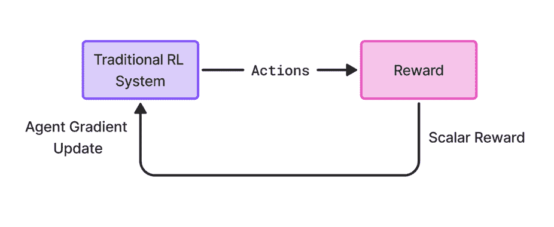
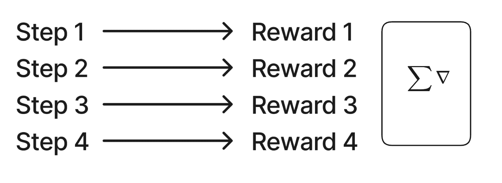
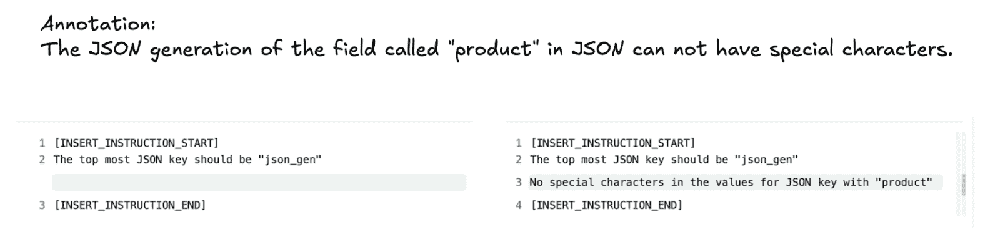
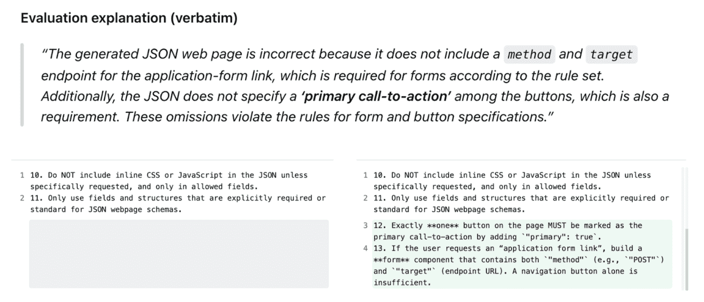
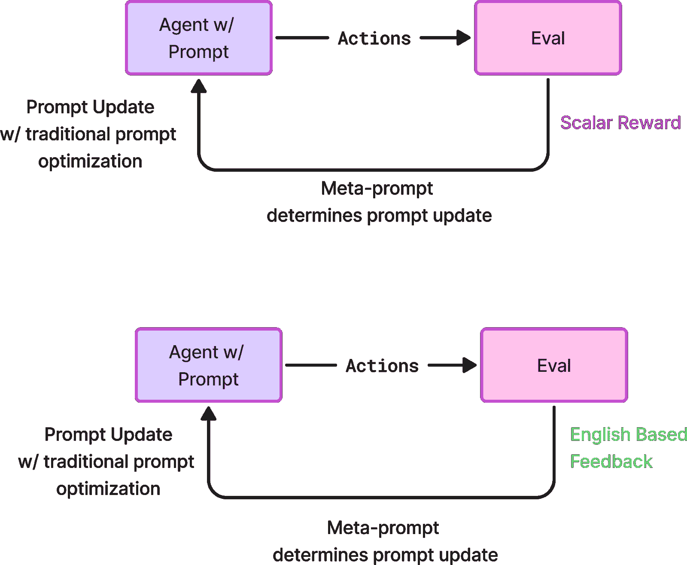
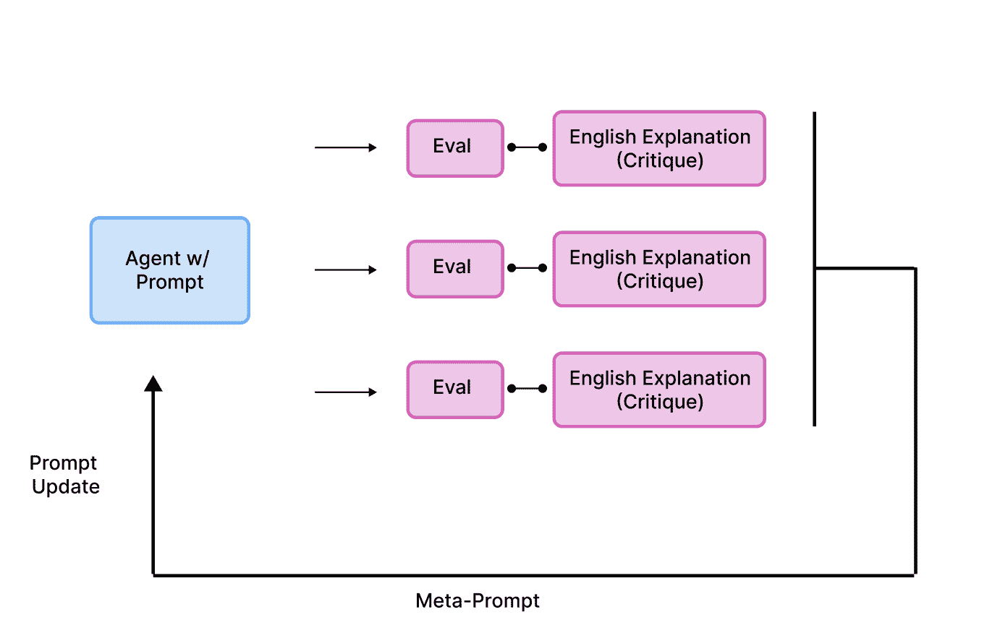
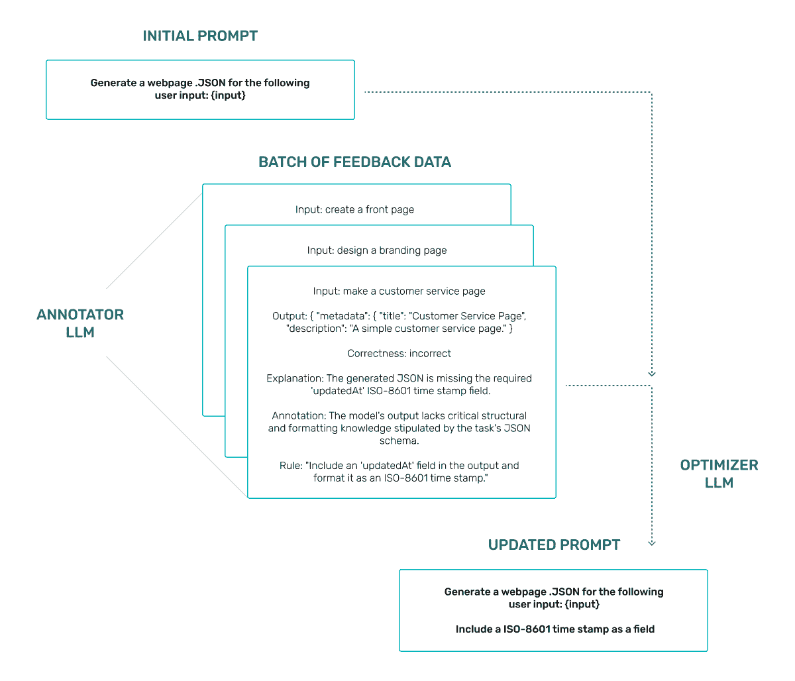

# 探索提示学习：使用英文反馈来优化 LLM 系统

> [`towardsdatascience.com/exploring-prompt-learning-using-english-feedback-to-optimize-llm-systems/`](https://towardsdatascience.com/exploring-prompt-learning-using-english-feedback-to-optimize-llm-systems/)

<mdspan datatext="el1752703563922" class="mdspan-comment">强化学习（RL）在 AI 模型构建中的应用在过去几个月里已经成为一个日益增长的话题。从将 RL 机制纳入其训练过程的 Deepseek 模型到基于 RL 改进的其他成功案例，“AI Twitter”一直非常活跃。

随着更多代理的部署，一个问题出现了：是否只能通过提示来构建强化学习控制系统？毕竟，强化学习全部是关于使用现实世界的反馈来优化目标，传统上是通过调整模型权重来实现的。但提示本身是引导大型语言模型的主要接口。

我们一直在尝试一种新的优化 LLM 提示的方法，我们称之为**“提示学习”（PL）**。与依赖于数值分数的传统优化方法不同，PL 使用自然语言反馈来迭代地改进提示。这种方法的基础在于 NVIDIA 的 Jim Fan 团队在[原始 Voyager 论文](https://arize.com/blog/voyager-an-open-ended-embodied-agent-with-llms-paper-reading-and-discussion/)中提出的思想。它也在 Andrej Karpathy 的[几条](https://x.com/karpathy/status/1944435412489171119)最近的[tweets](https://x.com/karpathy/status/1921368644069765486)中提到，他认为以提示为中心的学习将是一种关键技术。

尽管有这些初步的暗示，但据我们所知，还没有人对基于强化学习的提示调整的完整实现进行过严格的调查、特征化和测量。这正是我们着手要做的事情。

这个实现受到了原始 Voyager 论文中提出的一个想法的启发。原始 Voyager 论文中使用的迭代提示机制，作为代理获取和改进的基础，形成了我们**提示学习**方法的基础。

## 什么是提示学习？

提示学习与 MetaPrompt 提示优化在几个主要方面有所不同。

首先也是最重要的，错误项是英文的，并且不是一个分数。英文错误项允许直接使用英文反馈来调整指令。来自评估的解释会告诉你评估失败的确切原因，然后提示学习会向系统提示中添加指令以帮助解决问题。英文错误项使我们能够解决当前纯提示优化技术无法解决的问题。

其次，提示学习是一种在线方法，用于管理你的系统指令，旨在持续地对你的提示进行运行——将调整指令回语境中。基于 LLM 的系统可以帮助进行系统指令的语境工程。

提示上下文中的英语指令允许管理指令，例如如何处理相互冲突的指令或即将到期的指令，或人类对指令的审查，所有这些都在英语中进行。在我们的提示学习元提示中，甚至允许关键词，它只会对提示的特定基于指令的区域进行编辑。在“权重”和“梯度”为基础的提示优化方法中，这几乎是不可行的。

这种提示学习的实现使用应用程序运行的评估、解释和注释来自动改进你的提示。

结果很有希望：提示学习可以带来显著的改进，只需十分之一或百分之一的标记示例数量。

让我们深入了解提示学习的机制，并确切地了解为什么它有效。

## 强化学习和提示学习有什么区别？

传统强化学习依赖于使用分数或错误来生成梯度误差项，然后更新你的原始模型。每个梯度误差项都会让你的模型稍微接近最佳性能。

传统强化学习（图片由作者创建）

关键在于你需要很多很多例子来调整你的模型。随着时间的推移，这些无数的例子将推动你的模型在可能的输入上输出正确的值。它是通过累积误差梯度并轻微推动你的模型向某个方向移动来工作的。

图片由作者创建

强化学习是一个非常强大的技术。但如果你没有成千上万的例子怎么办？如果你有一系列复杂的目标，而这些目标不容易用分数来表示怎么办？最后，如果有人，一个注释者或人类专家，用英语向你传达了问题的实际情况以及如何修复它怎么办？

提示学习允许你使用**单个**例子进行强大的改变。而不是为每个例子计算梯度误差项，你计算的是为什么一个例子被评分某种方式的全文本解释。然后这些例子被反馈到优化流程中，并纳入提示。

关键思想是：

1.  “错误”，一个评估解释或注释术语是英文的

1.  改变你行为的修改是在提示上下文中进行的，而不是权重

1.  奖励函数是一个评估或人类注释

1.  指令在提示上下文中维护和管理，允许指令管理

上图展示了一个人工注释和元提示添加的指令示例（图片由作者创建）

上图展示了评估和元提示创建的指令以修复的示例（图片由作者创建）

我们的研究数据显示，一些知名的优化库在今天存在不足之处。具体来说，当评估带有批判或注释的信息时，包含的信息并非训练集中如何修复失败的方法。没有简单的方法可以将丰富的英语反馈信息轻松地反馈到梯度更新中。一般来说，你可能根本不想进行梯度更新。将所有指令都用英语表达，可以让你处理在“权重领域”中难以完成的事情，例如如何处理冲突指令、移除指令、压缩指令以及管理何时使指令过期——这本质上就是我们所说的**指令管理**。

与基于梯度的更新相比，提示学习的另一个优点是，你不需要使用成千上万的示例，只需用一个注释示例就可以对你的系统提示进行更改。

图片由作者提供

## 这与提示优化有何不同？

现在有很多用于[提示优化](https://arize.com/blog/prompt-optimization-few-shot-prompting/)的技术。提示优化通过收集示例并尝试找到与这些示例的相似性，将更传统的机器学习训练和测试方法应用于优化提示。

所有提示优化方法失败的根本原因在于将分数作为传播失败错误手段的焦点。当你思考失败时，并非每一次失败都能轻易地表达为一个数值，而数值隐藏了失败的原因。

使用分数作为传播失败的主要原因，将优化修复与失败的原因脱钩。

|  | **提示学习** | **强化学习** | **提示优化** |
| --- | --- | --- | --- |
| **反馈机制** | 基于评估的英语解释和人工注释 | 数字奖励 | 数字分数 |
| **优化** | 元提示定义优化方法 | 基于梯度的模型更新 | 多样化，但一些支持元提示 |
| **提示控制** | 只能优化提示（指令部分）的特定部分 | N/A | 通常优化整个提示 |
| **在线设置** | 设计为始终在线使用，由人类控制“提示更改”的接受或完全自动化 | 设计为在线使用 | 通常是一次性的 |

## 优化循环是如何工作的？

在许多实际应用案例中，正如我们在真实数据上与客户测试所显示的，一次优化运行和单次输出效果很好。在需要多次循环优化以提高性能的情况下，评估器的英语解释（或批判）输出可以提高性能。

图片由作者提供

英语解释（批判）是我们评估库的一个重要特性，生成解释后允许结果用于反馈循环。

在我们的测试中，由于模型需要将更多指令添加回上下文窗口以修复提示，迭代循环变得更加重要。在只需要添加 1-10 条指令的情况下，单个元提示改进循环就足够了。

## 我们是如何测试提示学习的？

我们进行了一系列使用提示学习进行优化的实验，以评估其有效性。到目前为止，这已经在大量的 AI 应用和代理用例的生产集中运行：

对于我们的演示数据应用，我们选择了一个 JSON 生成问题，其中模型必须根据自然语言提示生成网页的 JSON。

我们还生成了一组**潜在规则**，响应需要遵循。例如：

1.  每个部分都需要从预定义列表中选择一个类型值

1.  所有图像都必须包含 alt 文本

1.  所有外部资产链接都必须使用 https

这些规则隐含地体现在我们应用程序一系列跟踪的反馈和解释中。

我们设计这个测试是为了模拟一个代理的典型评估周期。评估是通过结合[LLM 作为裁判的技术](https://arize.com/llm-as-a-judge/)和人工审查来完成的，再次模拟现实世界的模式。

所有这些数据（应用程序跟踪、反馈和解释）随后被输入到优化阶段。

为了执行优化本身，我们使用了一个修改后的元提示版本，我们后来称之为**提示学习**。

作者绘制的图表

每个提示优化循环都使用单个 LLM 调用和 100 个示例。

## 提示学习是如何表现的？

提示学习能够在 5-25 规则集范围内揭示和解决大多数潜在规则。然而，随着规则的引入，性能并不会下降。

| **规则集大小** | **1 次循环准确率** | **5 次循环准确率** | **1 次循环平均遵循的规则** | **5 次循环平均遵循的规则** |
| --- | --- | --- | --- | --- |
| 10 | 15% | 100% | 71% | 100% |
| 50 | 0% | 70% | 35% | 83% |
| 100 | 0% | 55% | 14% | 68% |

随着你增加优化器系统必须学习的规则，学习规则所需的优化迭代次数就越多。

## 结论

提示学习为 AI 应用的持续改进提供了一个引人入胜的方法，它能够用相对较少的示例驱动结果，使其适用于早期阶段和生产应用。

## 附录

### 文献综述

已经有许多相关的方法值得注意

+   [Promptbreeder](https://arxiv.org/abs/2309.16797) (DeepMind)

    +   提示编辑但没有英语评论

+   [OPRO – “LLMs 作为优化器”](https://arxiv.org/pdf/2309.03409)

    +   提示编辑但没有英语评论

+   [PromptAgent](https://arxiv.org/abs/2310.16427)

    +   使用自由形式的评论来决定编辑，尽管最终的提示没有嵌入评论——搜索发生在外部规划器中而不是在提示中累积规则。

    +   不管理英语指令

+   [StablePrompt](https://arxiv.org/abs/2410.07652)

    +   使用 RL 更新而不是提示编辑

+   [Meta-Prompting: Task-Agnostic Scaffolding](https://arxiv.org/abs/2401.12954)

    +   首次使用元提示，但未使用英文评论或解释

+   [Critic-RM](https://arxiv.org/abs/2411.16646) – 自生成的评论提升语言模型的奖励建模

+   [Self-Refine: Iterative Refinement with Self-Feedback](https://arxiv.org/abs/2303.17651)

+   [Self-Generated Critiques Boost Reward Modeling for Language Models](https://arxiv.org/abs/2411.16646)

    +   使用评论来帮助奖励模型学习，设计用于下游强化学习使用

### 比较提示学习与 PromptAgent

这里是关于提示学习与 PromptAgent 的比较。基于蒙特卡洛树搜索（MCTS）的搜索最优提示，如 PromptAgent 中所示，未来工作可以与提示学习相结合。

### **PromptAgent (ICLR ‘24) vs. Prompt Learning (PL)**

| **维度** | **PromptAgent** | **Prompt Learning (PL)** |
| --- | --- | --- |
| **目标** | 找到一个 *单个* “专家级”提示，在 dev 集上最大化数值任务分数。 | **持续** 维护一个生产提示，以便在评估或用户发现新的失败模式时自我修复。 |
| **优化器** | 在提示编辑的空间上进行 MCTS 搜索；每个节点 = 一个提示，每个边 = 从错误反馈中得出的一个编辑。[arXiv](https://arxiv.org/abs/2310.16427) | 一个 **元提示控制器** 读取最新的英文评论并决定如何突变一个 *指令块*（添加、合并、重写、过期）。没有 roll-out 或搜索树。 |
| **更新粒度** | 在搜索期间编辑 *整个* 任务提示；运行后最终提示被冻结。 | 只编辑一个围栏区域内的 **指令部分**；系统提示的其他部分保持不变。 |
| **评论的使用** | 生成“建设性错误反馈”以引导下一个 MCTS 动作，但最终提示中**不保留**字面文本。[arXiv](https://arxiv.org/abs/2310.16427) | **主要信号**。英文评论（来自 LLM 评判者或人类）输入元提示；控制器提取意图并重写/合并指令。评论本身**不存储**，但其意义被提炼到指令集中。 |
| **冲突/生命周期管理** | 搜索结束后没有；提示可以包含冗余或过时的规则，操作员必须手动修剪。 | 内置：控制器可以**去重、版本控制或过期**指令，并在应用更改之前支持人工审批门。 |
| **在线与离线** | **离线**：重搜索（数百到数千个 roll-out），然后部署。 | **在线**：每次出现失败时都额外调用一次 LLM；设计为与应用程序永久并行运行。 |
| **数据需求** | 需要一个中等规模的评分 *dev* 集来评估 rollout。 | 通过每个解释信息丰富；利用现有的评估轨迹或人工标注。 |
| **计算成本** | 前置加载（搜索）；推理时可忽略。 | 初始成本最小，每次优化仅需额外调用 1 次；提示仅增加净指令文本。 |
| **可解释性** | 最终提示可读，但推理路径隐藏在搜索日志中。 | 完整审计轨迹：每个指令编辑都是纯英文；易于比较和回滚。 |
| **典型优势** | 在可以承受离线优化遍历的情况下，启动**新**任务。 | 长期运行的代理必须遵守**不断变化的政策和领域规则**，且标注数据稀缺。 |
