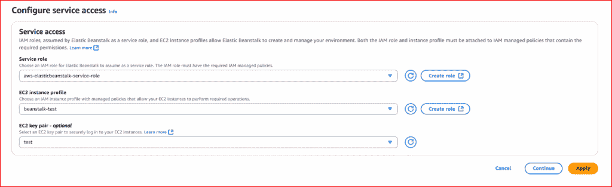
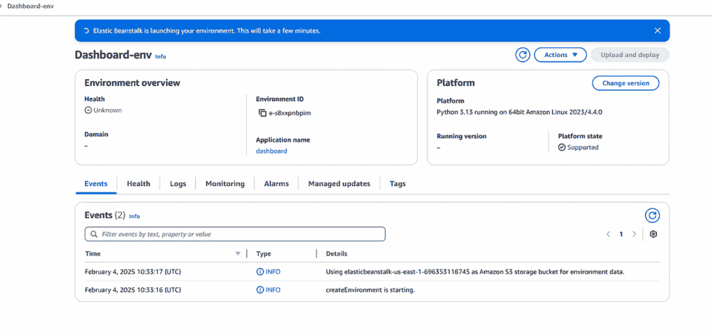
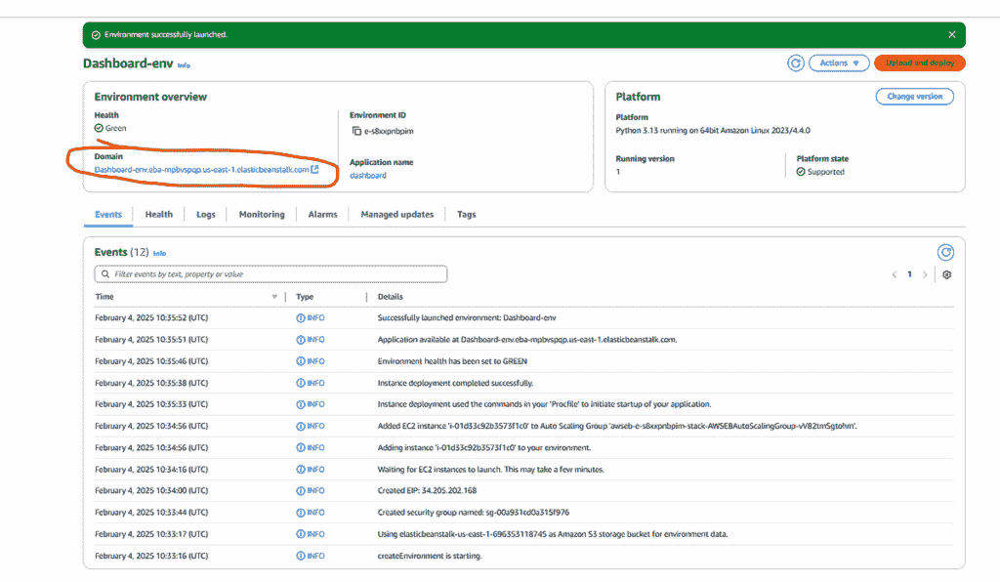
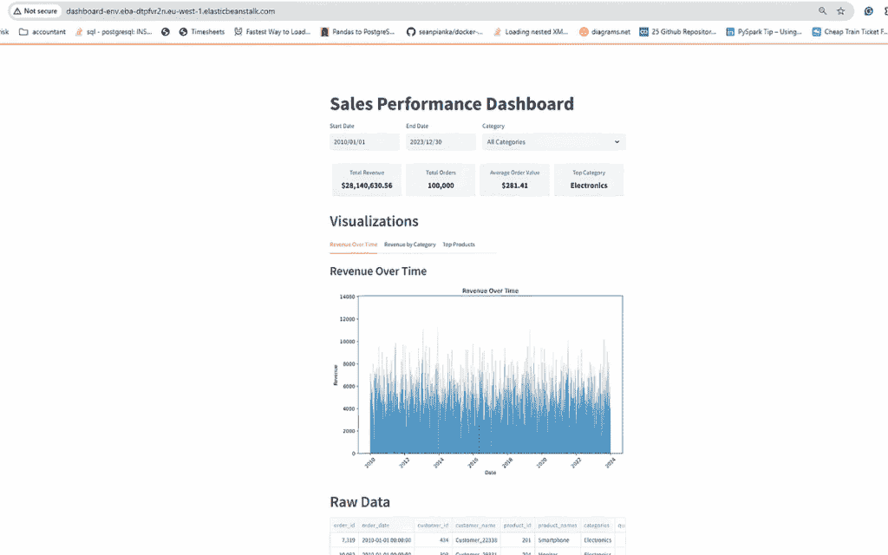
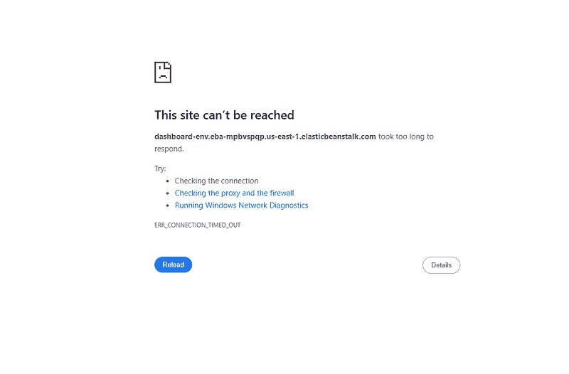
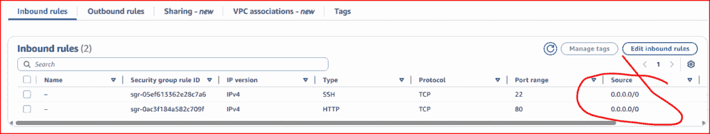

# 将 Streamlit 应用程序部署到 AWS

> [`towardsdatascience.com/deploy-a-streamlit-app-to-aws/`](https://towardsdatascience.com/deploy-a-streamlit-app-to-aws/)

<mdspan datatext="el1752603054976" class="mdspan-comment">好的，所以你已经开发了一个**出色的 Streamlit 应用程序**，现在是时候让全世界看到并使用它了。

你有哪些选择？

最简单的方法是使用 Streamlit Community Cloud 服务。这种方法允许任何拥有所需 URL 的在线用户访问你的 Streamlit 应用程序。这是一个相对简单的过程，但它是一个公开可用的端点，由于潜在的安全问题和可扩展性选项，它并不是大多数组织的选项。

由于 Streamlit 被 Snowflake 收购，现在将该平台部署为可行选项。

第三个选项是将应用程序部署到众多云服务之一，例如 Heroku、Google Cloud 或 Azure。

作为 AWS 用户，我想看看将 Streamlit 应用程序部署到 AWS 会多么简单，这正是本文的主题。如果你参考了在线的官方 Streamlit 文档（本文末尾的链接），你会注意到没有关于如何做到这一点的信息或指导。因此，这是“缺失的手册”。

部署过程相对简单。最具挑战性的部分是确保 AWS 网络配置正确设置。我的意思是你的 VPC、安全组、子网、路由表、子网关联、NAT 网关、弹性 IP 等...

由于每个组织的网络设置都不同，我将假设你或你组织中的某个人可以解决这个问题。然而，我在文章末尾包含了一些针对部署问题的最常见原因的故障排除技巧。如果你严格按照我的步骤操作，你应该会在文章结束时拥有一个运行良好、已部署的应用程序。

在我的示例部署中，我将使用一个包含公共子网和互联网网关的 VPC。相比之下，在实际场景中，你可能希望使用弹性负载均衡器、私有子网、NAT 网关和 Cognito 进行用户身份验证和增强安全性的组合。稍后，我将讨论一些保护你的应用程序的选项。

我们将要部署的应用程序是我使用 Streamlit 编写的仪表板。TDS 之前发表过那篇文章，你可以在本文末尾找到链接。在这种情况下，我从本地运行的 PostgreSQL 数据库中检索了我的仪表板数据。然而，为了避免在 AWS 上设置 RDS Postgres 数据库的成本和麻烦，我将我的仪表板代码转换为从 S3 上的 CSV 文件中检索数据——这是亚马逊的大容量存储服务。

完成这些后，只需将 CSV 文件复制到 AWS S3 存储即可，仪表板应该会像在本地使用 PostgreSQL 运行时一样工作。

我假设你有一个可以访问 AWS 控制台的 AWS 账户。此外，如果你选择 S3 作为数据源，你需要设置 AWS 凭据。一旦你有了它们，你可以在你的 HOME 目录中创建一个 .aws/credentials 文件（就像我这样做的那样），或者你可以在代码中直接传递你的凭据密钥信息。

假设所有这些先决条件都已满足，我们可以查看使用 AWS 的 Elastic Beanstalk 服务进行的部署。

## 什么是 AWS Elastic Beanstalk (EB)？

AWS Elastic Beanstalk (EB) 是一个完全托管的服务，它简化了在 AWS 云中部署、扩展和管理应用程序的过程。它允许你上传你的应用程序代码，支持流行的语言，如 Python、Java、.NET、Node.js 等。它自动处理底层基础设施的配置，例如服务器、负载均衡器和网络。使用 Elastic Beanstalk，你可以专注于编写和维护你的应用程序，而不是配置服务器或管理容量，因为该服务可以无缝地根据你的应用程序流量波动扩展资源。

除了配置你的 EC2 服务器等，EB 还会根据部署类型为你安装任何必需的外部库。它还可以配置在服务器启动时运行 OS 命令。

## 代码

在部署之前，让我们回顾一下我对原始代码所做的更改，以适应数据源从 Postgres 到 S3 的变化。这归结为用读取 S3 对象的调用替换读取 Postgres 表的调用，以将数据馈入仪表板。我还将主要图形组件的创建和显示放在一个名为 **main()** 的模块中，我在代码的末尾调用它。以下是完整的列表。

```py
import streamlit as st
import pandas as pd
import matplotlib.pyplot as plt
import datetime
import boto3
from io import StringIO

#########################################
# 1\. Load Data from S3
#########################################

@st.cache_data
def load_data_from_s3(bucket_name, object_key):
    """
    Reads a CSV file from S3 into a Pandas DataFrame.
    Make sure your AWS credentials are properly configured.
    """
    s3 = boto3.client("s3")
    obj = s3.get_object(Bucket=bucket_name, Key=object_key)
    df = pd.read_csv(obj['Body'])

    # Convert order_date to datetime if needed
    df['order_date'] = pd.to_datetime(df['order_date'], format='%d/%m/%Y')

    return df

#########################################
# 2\. Helper Functions (Pandas-based)
#########################################

def get_date_range(df):
    """Return min and max dates in the dataset."""
    min_date = df['order_date'].min()
    max_date = df['order_date'].max()
    return min_date, max_date

def get_unique_categories(df):
    """
    Return a sorted list of unique categories (capitalized).
    """
    categories = df['categories'].dropna().unique()
    categories = sorted([cat.capitalize() for cat in categories])
    return categories

def filter_dataframe(df, start_date, end_date, category):
    """
    Filter the dataframe by date range and optionally by a single category.
    """
    # Ensure start/end_date are converted to datetime just in case
    start_date = pd.to_datetime(start_date)
    end_date = pd.to_datetime(end_date)

    mask = (df['order_date'] >= start_date) & (df['order_date'] <= end_date)
    filtered = df.loc[mask].copy()

    # If not "All Categories," filter further by category
    if category != "All Categories":
        # Categories in CSV might be lowercase, uppercase, etc.
        # Adjust as needed to match your data
        filtered = filtered[filtered['categories'].str.lower() == category.lower()]

    return filtered

def get_dashboard_stats(df, start_date, end_date, category):
    """
    Calculate total revenue, total orders, average order value, and top category.
    """
    filtered_df = filter_dataframe(df, start_date, end_date, category)
    if filtered_df.empty:
        return 0, 0, 0, "N/A"

    filtered_df['revenue'] = filtered_df['price'] * filtered_df['quantity']
    total_revenue = filtered_df['revenue'].sum()
    total_orders = filtered_df['order_id'].nunique()
    avg_order_value = total_revenue / total_orders if total_orders > 0 else 0

    # Determine top category by total revenue
    cat_revenue = filtered_df.groupby('categories')['revenue'].sum().sort_values(ascending=False)
    top_cat = cat_revenue.index[0].capitalize() if not cat_revenue.empty else "N/A"

    return total_revenue, total_orders, avg_order_value, top_cat

def get_plot_data(df, start_date, end_date, category):
    """
    For 'Revenue Over Time', group by date and sum revenue.
    """
    filtered_df = filter_dataframe(df, start_date, end_date, category)
    if filtered_df.empty:
        return pd.DataFrame(columns=['date', 'revenue'])

    filtered_df['revenue'] = filtered_df['price'] * filtered_df['quantity']
    plot_df = (
        filtered_df.groupby(filtered_df['order_date'].dt.date)['revenue']
        .sum()
        .reset_index()
        .rename(columns={'order_date': 'date'})
        .sort_values('date')
    )
    return plot_df

def get_revenue_by_category(df, start_date, end_date, category):
    """
    For 'Revenue by Category', group by category and sum revenue.
    """
    filtered_df = filter_dataframe(df, start_date, end_date, category)
    if filtered_df.empty:
        return pd.DataFrame(columns=['categories', 'revenue'])

    filtered_df['revenue'] = filtered_df['price'] * filtered_df['quantity']
    rev_cat_df = (
        filtered_df.groupby('categories')['revenue']
        .sum()
        .reset_index()
        .sort_values('revenue', ascending=False)
    )
    rev_cat_df['categories'] = rev_cat_df['categories'].str.capitalize()
    return rev_cat_df

def get_top_products(df, start_date, end_date, category, top_n=10):
    """
    For 'Top Products', return top N products by revenue.
    """
    filtered_df = filter_dataframe(df, start_date, end_date, category)
    if filtered_df.empty:
        return pd.DataFrame(columns=['product_names', 'revenue'])

    filtered_df['revenue'] = filtered_df['price'] * filtered_df['quantity']
    top_products_df = (
        filtered_df.groupby('product_names')['revenue']
        .sum()
        .reset_index()
        .sort_values('revenue', ascending=False)
        .head(top_n)
    )
    return top_products_df

def get_raw_data(df, start_date, end_date, category):
    """
    Return the raw (filtered) data with a revenue column.
    """
    filtered_df = filter_dataframe(df, start_date, end_date, category)
    if filtered_df.empty:
        return pd.DataFrame()

    filtered_df['revenue'] = filtered_df['price'] * filtered_df['quantity']
    filtered_df = filtered_df.sort_values(by=['order_date', 'order_id'])
    return filtered_df

def plot_data(data, x_col, y_col, title, xlabel, ylabel, orientation='v'):
    fig, ax = plt.subplots(figsize=(10, 6))
    if not data.empty:
        if orientation == 'v':
            ax.bar(data[x_col], data[y_col])
            plt.xticks(rotation=45)
        else:
            ax.barh(data[x_col], data[y_col])
        ax.set_title(title)
        ax.set_xlabel(xlabel)
        ax.set_ylabel(ylabel)
    else:
        ax.text(0.5, 0.5, "No data available", ha='center', va='center')
    return fig

#########################################
# 3\. Streamlit Application
#########################################

def main():
    # Title
    st.title("Sales Performance Dashboard")

    # Load your data from S3
    # Replace these with your actual bucket name and object key
    bucket_name = "your_s3_bucket_name"
    object_key = "your_object_name"

    df = load_data_from_s3(bucket_name, object_key)

    # Get min and max date for default range
    min_date, max_date = get_date_range(df)

    # Create UI for date and category filters
    with st.container():
        col1, col2, col3 = st.columns([1, 1, 2])
        start_date = col1.date_input("Start Date", min_date)
        end_date = col2.date_input("End Date", max_date)
        categories = get_unique_categories(df)
        category = col3.selectbox("Category", ["All Categories"] + categories)

    # Custom CSS for metrics
    st.markdown("""
        <style>
        .metric-row {
            display: flex;
            justify-content: space-between;
            margin-bottom: 20px;
        }
        .metric-container {
            flex: 1;
            padding: 10px;
            text-align: center;
            background-color: #f0f2f6;
            border-radius: 5px;
            margin: 0 5px;
        }
        .metric-label {
            font-size: 14px;
            color: #555;
            margin-bottom: 5px;
        }
        .metric-value {
            font-size: 18px;
            font-weight: bold;
            color: #0e1117;
        }
        </style>
    """, unsafe_allow_html=True)

    # Fetch stats
    total_revenue, total_orders, avg_order_value, top_category = get_dashboard_stats(df, start_date, end_date, category)

    # Display key metrics
    metrics_html = f"""
    <div class="metric-row">
        <div class="metric-container">
            <div class="metric-label">Total Revenue</div>
            <div class="metric-value">${total_revenue:,.2f}</div>
        </div>
        <div class="metric-container">
            <div class="metric-label">Total Orders</div>
            <div class="metric-value">{total_orders:,}</div>
        </div>
        <div class="metric-container">
            <div class="metric-label">Average Order Value</div>
            <div class="metric-value">${avg_order_value:,.2f}</div>
        </div>
        <div class="metric-container">
            <div class="metric-label">Top Category</div>
            <div class="metric-value">{top_category}</div>
        </div>
    </div>
    """
    st.markdown(metrics_html, unsafe_allow_html=True)

    # Visualization Tabs
    st.header("Visualizations")
    tabs = st.tabs(["Revenue Over Time", "Revenue by Category", "Top Products"])

    # Revenue Over Time Tab
    with tabs[0]:
        st.subheader("Revenue Over Time")
        revenue_data = get_plot_data(df, start_date, end_date, category)
        st.pyplot(plot_data(revenue_data, 'date', 'revenue', "Revenue Over Time", "Date", "Revenue"))

    # Revenue by Category Tab
    with tabs[1]:
        st.subheader("Revenue by Category")
        category_data = get_revenue_by_category(df, start_date, end_date, category)
        st.pyplot(plot_data(category_data, 'categories', 'revenue', "Revenue by Category", "Category", "Revenue"))

    # Top Products Tab
    with tabs[2]:
        st.subheader("Top Products")
        top_products_data = get_top_products(df, start_date, end_date, category)
        st.pyplot(plot_data(top_products_data, 'product_names', 'revenue', "Top Products", "Revenue", "Product Name", orientation='h'))

    # Raw Data
    st.header("Raw Data")
    raw_data = get_raw_data(df, start_date, end_date, category)
    raw_data = raw_data.reset_index(drop=True)
    st.dataframe(raw_data, hide_index=True)

if __name__ == '__main__':
    main()
```

虽然这是一段相当庞大的代码，但我不会详细解释它具体做什么，因为我已经在之前引用的 TDS 文章中详细介绍了这一点。我在本文末尾包含了一个链接，供那些想了解更多信息的人参考。

因此，假设你有一个运行良好的 Streamlit 应用程序，在本地运行时没有问题，以下是你需要采取的步骤将其部署到 AWS。

## 准备我们的代码以进行部署

1/ 在你的本地系统上创建一个新的文件夹来存放你的代码。

2/ 在那个文件夹中，你需要三个文件和一个包含两个更多文件的子文件夹

+   文件 1 是 **app.py**—这是你的主要 Streamlit 代码文件

+   文件 2 是 **requirements.txt**—这列出了你的代码需要运行的 所有外部库。根据你的代码做什么，它至少会包含一个引用 Streamlit 库的记录。对于我的代码，文件包含以下内容，

```py
streamlit
boto3
matplotlib
pandas
```

+   文件 3 被称为 **Procfile**—这告诉 EB 如何运行你的代码。其内容应如下所示

```py
web: streamlit run app.py --server.port 8000 --server.enableCORS false
```

+   .**ebextensions**—这是一个包含附加文件的子文件夹（见下文）

3/ .ebextensions 子文件夹包含这两个文件。

+   **nginx.config**

它应包含以下内容：

```py
option_settings:
  aws:elasticbeanstalk:environment:proxy:
    ProxyServer: nginx
```

+   **python.config**

```py
option_settings:
  aws:elasticbeanstalk:container:python:
    WSGIPath: app:main
```

> 注意，尽管我做的这件事不需要它，但为了完整性，您可以可选地在.ebextensions 子文件夹下添加一个或多个 packages.config 文件，这些文件可以在 EC2 服务器启动时运行操作系统命令。例如，

```py
#
# 01_packages.config
#
packages:
    yum:
        amazon-linux-extras: []

commands:
    01_postgres_activate:
        command: sudo amazon-linux-extras enable postgresql10
    02_postgres_install:
        command: sudo yum install -y pip3
    03_postgres_install:
        command: sudo pip3 install -y psycopg2
```

一旦您有了所有必要的文件，下一步是将它们压缩成存档，保留文件夹和子文件夹结构。您可以使用任何您喜欢的工具，但我使用 7-Zip。

## 部署我们的代码

部署是一个多阶段的过程。首先，登录 AWS 控制台，在服务搜索栏中搜索“Elastic Beanstalk”，然后点击链接。从那里，您可以点击大型的橙色**“创建应用程序”**按钮。您将看到大约六个屏幕中的第一个，您必须填写详细信息。在以下部分，我将描述您必须输入的字段。其他所有内容保持不变。

1/ 创建应用程序

+   这很简单：填写您应用程序的名称，以及可选的描述。

2/ 配置环境

+   环境层应设置为 Web 服务器。

+   填写应用程序名称。

+   对于平台类型，选择**托管**；对于平台，选择**Python**，然后决定您想使用哪个版本的 Python。我使用了 Python 版本 3.11。

+   在**应用程序代码**部分，点击**上传您的代码**选项，并按照说明操作。输入一个版本标签，然后根据源文件所在位置点击‘本地文件’或‘S3 上传’。您想要上传我们之前创建的单个**zip 文件**。

+   在**预设**部分选择您的实例类型。我选择了**单个实例（免费层适用）**。然后点击**下一步**按钮。

3/ 配置服务访问



AWS 网站图片

+   对于服务角色，如果您有现有的，可以使用它，否则 AWS 会为您创建一个。

+   对于实例配置文件角色，您可能需要创建它。它只需要附加**AWSElasticBeanstalkWebTier**和**AmazonS3ReadOnlyAccess**策略。点击**下一步**按钮。

+   我也建议在这个阶段设置 EC2 密钥对，因为您将需要它来登录 EB 为您创建的 EC2 服务器。这对于调查潜在的服务器问题非常有价值。

4/ 设置网络、数据库和标签

+   选择您的 VPC。我只有一个默认的 VPC 已设置。如果您还没有，您也可以在这里创建一个。确保您的 VPC 至少有一个公共子网。

+   在实例设置中，我选中了公共 IP 地址选项，并选择使用我的公共子网。点击**下一步**按钮。

5/ 配置实例和扩展

+   在 EC2 安全组部分，我选择了我的默认安全组。在实例类型中，我选择了 t3.micro。点击**下一步**按钮。

6/ 监控

+   选择基本系统健康监控

+   取消选中“管理更新”复选框

+   点击**下一步**

7/ 审查

+   如果一切正常，点击**创建**。

然后，您应该会看到一个像这样的屏幕，



图片来自 AWS 网站

关注事件标签，因为它会通知你是否有任何问题出现。如果你遇到问题，可以使用日志标签检索完整的日志集或部署日志的最后 100 行，这有助于调试任何问题。

几分钟后，如果一切顺利，健康标签将从灰色切换到绿色，你的屏幕看起来可能像这样：



图片来自 AWS 网站

现在，你应该能够点击域名 URL（如上图红色圆圈所示），然后你的仪表板应该会出现。



图片由作者提供

## 故障排除

如果你运行仪表板时遇到问题，首先要检查的是你的源数据是否位于正确的位置，并且在 Streamlit 应用程序源代码文件中正确引用。如果你排除了这个问题，那么你很可能遇到了网络配置问题，你可能会看到这样的屏幕。



图片由作者提供

如果是这样的话，这里有一些你可以检查的事项。你可能需要登录到你的 EC2 实例并检查日志。在我的情况下，我遇到了 pip 安装命令的问题，因为空间不足而无法安装所有必要的包。为了解决这个问题，我不得不给我的实例添加额外的弹性块存储。

更可能的原因将是网络问题。在这种情况下，尝试以下建议中的某些或全部。

**VPC 配置**

+   确保你的 Elastic Beanstalk 环境部署在至少有一个公共子网的 VPC 中。

+   验证 VPC 是否连接了互联网网关。

**子网配置**

+   确认你的 Elastic Beanstalk 环境使用的子网是公共的。

+   确保为这个子网启用了“自动分配公共 IPv4 地址”设置。

**路由表**

+   验证与你的公共子网关联的路由表是否有一个指向互联网网关的路由（0.0.0.0/0 -> igw-xxxxxxxx）。

**安全组**

+   检查附加到你的 Elastic Beanstalk 实例的安全组入站规则。

+   确保它允许来自适当来源的端口 80（HTTP）和/或 443（HTTPS）的入站流量。

+   检查出站规则是否允许必要的出站流量。

**网络访问控制列表（NACLs**）

+   检查与你的子网关联的网络 ACL。

+   确保它们允许在必要端口上的入站和出站流量。

**Elastic Beanstalk 环境配置**

+   验证你的环境是否在 Elastic Beanstalk 控制台中使用了正确的 VPC 和公共子网。

**EC2 实例配置**

+   验证由 Elastic Beanstalk 启动的 EC2 实例是否分配了公共 IP 地址。

**负载均衡器配置（如果适用**）

+   如果你使用负载均衡器，确保它在公共子网中配置正确。

+   确认负载均衡器安全组允许传入流量并且可以与 EC2 实例通信。

## 保护您的应用程序

目前，您的已部署应用程序对任何知道您的已部署 EB 域名的互联网用户都是可见的。这**可能**不是您想要的。那么，您在 AWS 基础设施上保护应用程序有哪些选择？

**1/ 锁定安全组到受信任的 CIDR**

在控制台中，找到与您的 EB 部署关联的安全组并点击它。它应该看起来像这样，



AWS 网站图片

确保您在“入站规则”选项卡上，选择“编辑入站规则”，并将源 IP 范围更改为您的企业 IP 范围或另一组 IP 地址。

**2/ 使用私有子网、内部负载均衡器和 NAT 网关**

这是一个更具挑战性的实施选项，可能需要您的 AWS 网络管理员或部署专家的专业知识。

**3/ 使用 AWS Cognito 和应用程序负载均衡器**

再次强调，这是一个更复杂的设置，如果您不是 AWS 网络专家，您可能需要帮助。但这可能是其中最稳健的。流程是这样的：-

用户导航到您的公共 Streamlit URL。

ALB 会在请求中拦截。它看到用户要么尚未登录，要么未经过身份验证。

ALB 会自动将用户重定向到 Cognito 进行登录或创建账户。登录成功后，Cognito 会将用户重定向回您的应用程序 URL。此时，ALB 会识别有效的会话并允许请求继续到您的 Streamlit 应用程序。

您的 Streamlit 应用程序仅从经过身份验证的用户那里接收流量。

* * *

## 摘要

在本文中，我讨论了将之前编写的 Streamlit 仪表板应用程序部署到 AWS 的过程。原始应用程序使用 PostgreSQL 作为其数据源，我演示了如何切换到使用 AWS S3 以便将应用程序部署到 AWS。

我讨论了使用他们的 Elastic Beanstalk 服务将应用程序部署到 AWS。我描述并解释了在部署之前所需的额外文件，包括它们需要包含在一个 zip 存档中。

我随后简要介绍了 Elastic Beanstalk 服务，并描述了使用它将我们的 Streamlit 应用程序部署到 AWS 基础设施所需的详细步骤。我描述了需要导航的多个输入屏幕，并展示了在各个阶段应使用哪些输入。

如果应用程序部署不符合预期，我突出了一些故障排除方法。

最后，我提供了一些关于如何保护您的应用程序免受未经授权访问的建议。

> 要了解更多关于 Streamlit 的信息，请查看下文链接中的在线文档。
> 
> [`docs.streamlit.io`](https://docs.streamlit.io)
> 
> 要了解更多关于使用 Streamlit 开发的信息，请参阅下文链接中的文章，了解如何用它开发现代数据仪表板。
> 
> [构建数据仪表板](https://towardsdatascience.com/building-a-data-dashboard-9441db646697/)
