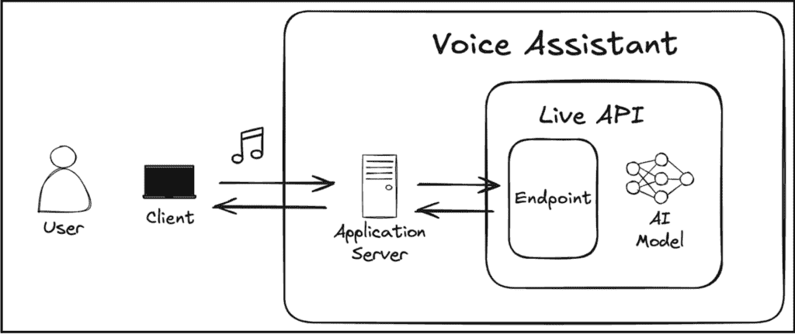
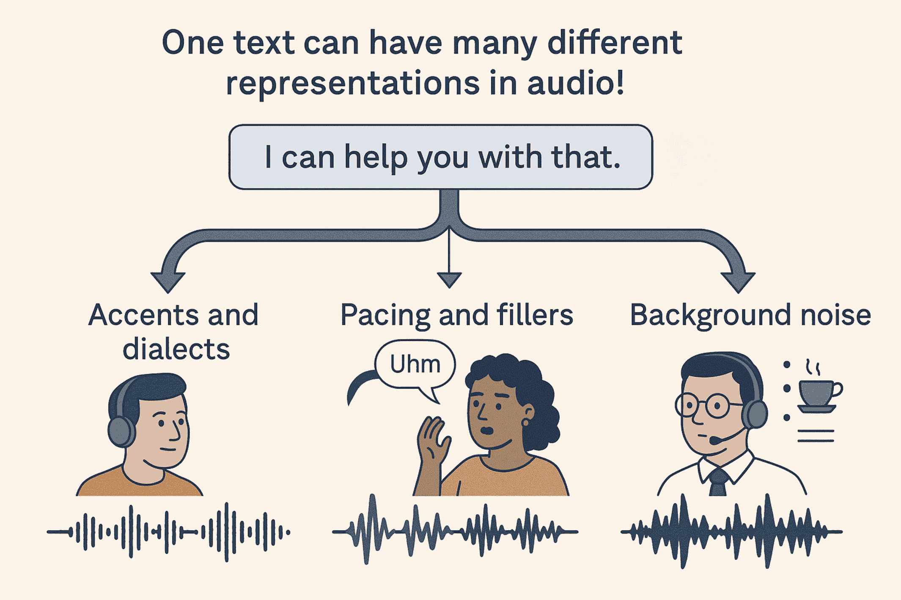
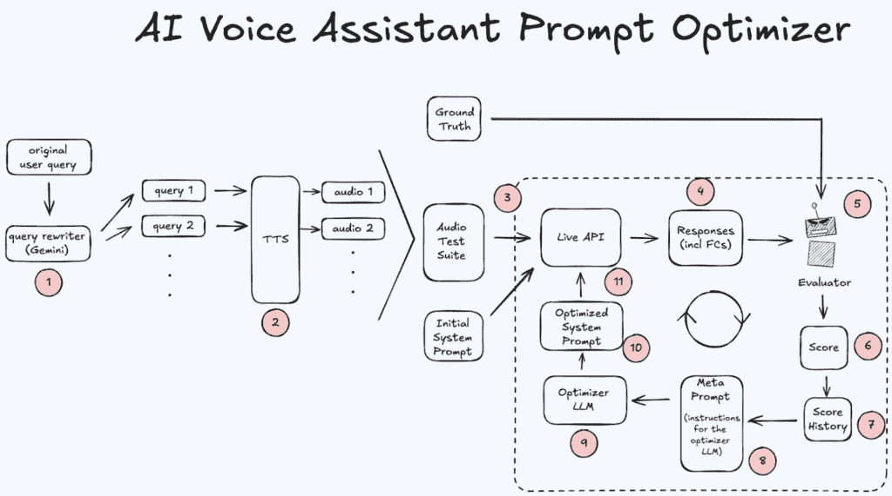
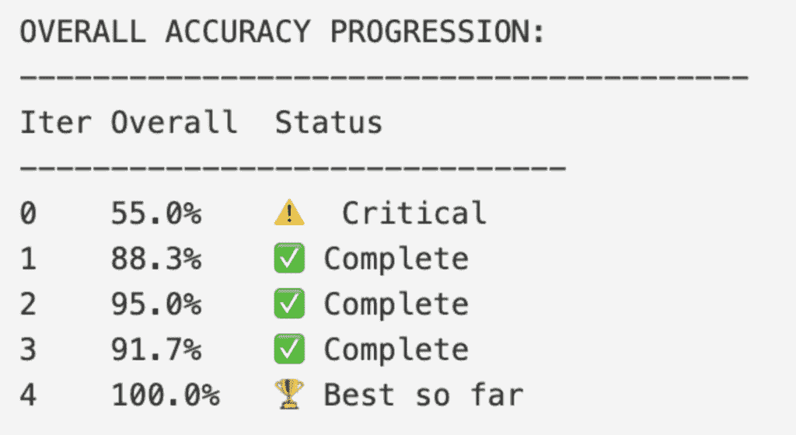
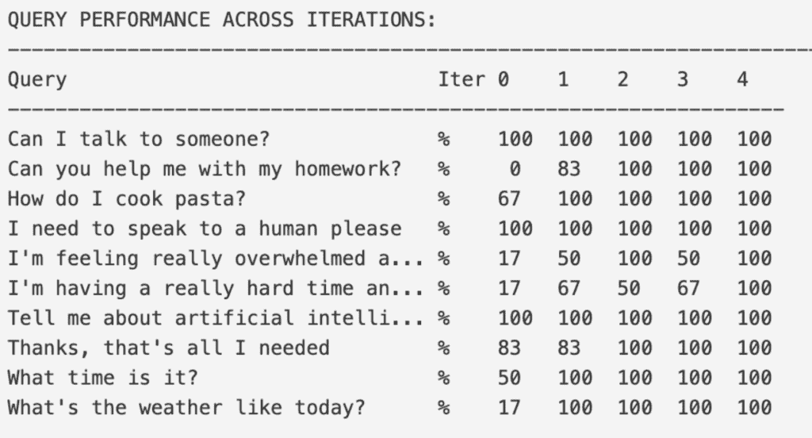

# 让 AI 调整你的语音助手

> [让 AI 调整你的语音助手](https://towardsdatascience.com/let-ai-tune-your-voice-assistant/)

<mdspan datatext="el1752258354543" class="mdspan-comment">在我们开始之前：</mdspan>语音 AI 的世界中有许多重叠的术语。为了确保我们都在同一页面上，让我们快速回顾一下主要术语以及我在本文中如何使用它们：

+   **语音助手**：用户与之对话的应用或“角色”。这是从用户角度看到的完整系统。

+   **实时 API**：连接用户到模型的“技术门户”。它处理实时双向音频和数据流。

+   **AI 模型**：代理背后的“大脑”。这是理解意图并决定采取何种行动的大型语言模型（LLM）。



图片由作者提供

清晰之后，让我们深入探讨 😃

## 这是什么意思？

在过去几个月里，我注意到对语音助手的兴趣激增。这不仅是我所服务的客户，整个行业也是如此：Google Deepmind 在 Google I/O 上展示了[Project Astra](https://deepmind.google/models/project-astra/)，OpenAI 早在几年前就推出了具有高级语音能力的[GPT-4o](https://www.youtube.com/watch?v=GiEsyOyk1m4)，最近 ElevenLabs 也推出了类似的服务[11ai](https://www.youtube.com/watch?v=HOg8jPLTwLI)。

语音助手变得越来越普遍，我们只需通过与他们说话就能在世界中执行操作。它们填补了第一代语音助手如 Siri 和 Alexa 留下的巨大空白：它们对自然语言的理解更好，能更好地推断我们的意图，并且具有上下文记忆。简而言之，它们与人的交流更加容易。

使它们能够执行操作并真正有用的核心机制是函数调用——使用像日历或天气服务这样的工具的能力。然而，助手的效率完全取决于我们如何指导其底层的 AI 模型何时使用哪个工具。这就是**系统提示**变得至关重要的地方。

在本教程中，我们将探讨如何利用自动提示工程（APE）通过自动优化系统提示来提高代理的函数调用能力。本教程分为两部分。

首先，我们将为我们的语音助手构建一个健壮的测试套件。这包括：获取用户查询，使用 LLM 生成多个语义变体，最后，将这些文本查询转换为多样化的音频文件。这些音频文件将用于与实时 API 交互。

在第二部分，我们将使用 APE 重复改进代理的性能。我们将从一个初始系统提示开始，通过观察代理对每个音频文件调用的函数来评估它对我们音频测试套件的性能。然后我们将这些响应与基准——对该查询的预期行为——进行比较，以计算整体准确率分数。这个分数，连同产生它的提示，被发送到一个“优化器”LLM。然后这个优化器根据所有先前尝试的性能，制定一个新的、改进的系统提示，这个过程再次开始。

在这个过程结束时，我们（希望）将有一个新的系统提示，它将更有效地指导 AI 模型何时使用每个功能。

如往常一样，所有代码都可以在 Github 仓库中免费获取：[`github.com/heiko-hotz/voice-assistant-prompt-optimization/`](https://github.com/heiko-hotz/voice-assistant-prompt-optimization/)

## 我们为什么要关心？

当我们进入由 LLM 驱动的语音助手时代，确保这些代理实际上以我们想要的方式行事至关重要。想象一下，我们要求一个代理检查我们的日历，结果它调用天气 API 并告诉我们天气。这是一个极端的例子，但希望它能说明问题。

这在聊天机器人中已经是一个头疼的问题，但在语音助手中，事情变得更加复杂。音频本质上比干净的书面查询要混乱。想想用户可以如何提示底层的 AI 模型——不同的口音或方言，说话快或慢，加入填充词如“嗯”和“啊”，或者背景中有一个嘈杂的咖啡馆。



图片由作者提供——使用 ChatGPT 创建

而这个额外的维度正引起真正的问题。当我与组织合作时，我经常看到他们挣扎于这种额外的复杂性，他们通常会回到他们唯一感到可以信赖的方法：手动测试。这意味着一群人坐在房间里，从脚本中阅读来模拟现实世界条件。这不仅耗时且昂贵，而且效果也不佳。

这就是自动化变得至关重要的地方。如果我们想让我们的代理有哪怕是一点点机会正确完成复杂任务，我们必须把基础做对，而且必须系统地做。这篇博客文章全部关于一种自动化语音助手整个评估和优化流程的方法——这是一种旨在**节省开发时间**、**降低测试成本**和**构建更可靠的语音助手**的方法，用户会真正信任并继续使用。

* * *

## 快速回顾：自动提示工程（APE）的原则

幸运的是，我之前已经写过关于[自动提示工程](https://towardsdatascience.com/automated-prompt-engineering-the-definitive-hands-on-guide-1476c8cd3c50/)的文章，因此我可以毫不脸红地引用我之前的博客文章 😏

我们将在本项目中也使用相同的 OPRO（通过提示进行优化）原则。[Optimisation by PROmpting](https://arxiv.org/pdf/2309.03409)。但为了快速回顾：

这有点像在监督机器学习的黄金时代中的超参数优化（HPO）：手动尝试不同的学习率和批量大小是不理想的，而且根本不实用。对于手动提示工程也是如此。然而，挑战在于提示是基于文本的，因此其优化空间巨大（只需想象我们有多少种不同的方式可以重新表述一个提示）。相比之下，传统的 ML 超参数是数值型的，这使得我们可以直接编程选择它们的值。

那么，我们如何自动化文本提示的生成呢？如果我们有一个永远不会疲倦的工具，能够以各种风格生成无数提示，并不断迭代它们，会怎么样呢？我们需要一个精通语言理解和生成的工具——而哪个工具在语言方面真正出色呢？没错，是一个大型语言模型 (LLM) 😃

但我们并不只是想让它随机尝试不同的提示，我们实际上希望它能从之前的迭代中学习。这正是 OPRO 策略的核心：如果随机提示生成类似于 HPO 中的随机搜索，那么 OPRO 就类似于贝叶斯搜索。它不仅仅随机猜测；它通过学习过去的结果，积极地尝试通过评估指标进行爬山。



图片由作者提供

OPRO 的关键是元提示（如图所示的第 8 号），它用于指导“优化器”LLM。这个元提示不仅包括任务描述，还包括优化轨迹——所有先前提示及其性能分数的历史记录。有了这些信息，优化器 LLM 可以分析模式，识别成功提示的元素，并避免失败提示的陷阱。这个过程允许优化器随着时间的推移生成越来越有效的提示，迭代地提高目标 LLM 的性能。

## 我们的项目结构

在我们深入整个流程之前，我认为快速查看我们的项目结构是值得的，以便获得良好的概述：

```py
voice-assistant-prompt-optimization/
├── 01_prepare_test_suite.py     # Step 1: Generate test cases and audio
├── 02_run_optimization.py       # Step 2: Run prompt optimization
├── initial-system-instruction.txt  # Comprehensive starting prompt
├── optimization.log             # Detailed optimization logs (auto-generated)
├── test_preparation.log         # Test suite preparation logs (auto-generated)
├── audio_test_suite/           # Generated audio files and mappings
├── configs/
│   ├── input_queries.json      # Base queries for test generation
│   └── model_configs.py        # AI model configurations
├── data_generation/
│   ├── audio_generator.py      # Text-to-speech generation
│   ├── query_restater.py       # Query variation generation
│   └── output_queries.json     # Generated query variations (auto-generated)
├── evaluation/
│   └── audio_fc_evaluator.py   # Function call evaluation system
├── optimization/
│   ├── metaprompt_template.txt # Template for prompt optimization
│   └── prompt_optimiser.py     # Core optimization engine
├── runs/                       # Optimization results (auto-generated)
└── requirements.txt            # Python dependencies
```

让我们开始，并详细说明各个组件。

## 起始点：定义我们的测试用例

在我们开始优化之前，我们首先需要定义“好”是什么样的。整个过程从创建我们的“试卷”及其相应的答案键开始。我们在这单个配置文件中完成：configs/input_queries.json。

在这个文件中，我们定义了一系列测试场景。对于每个场景，我们需要提供两个关键信息：用户的初始查询和预期的结果——即真实情况。这可能是一个带有其名称和相应参数的函数调用，或者没有函数调用。

让我们看看几个示例的结构：

```py
{
  "queries": [
    {
        "query": "What's the weather like today?",
        "trigger_function": true,
        "function_name": "get_information",
        "function_args": {
          "query": "What's the weather like today?"
        }
    },
    {
      "query": "I need to speak to a human please",
      "trigger_function": true,
      "function_name": "escalate_to_support",
      "function_args": {
        "reason": "human-request"
      }
    },
    {
        "query": "Thanks, that's all I needed",
        "trigger_function": false
    }
  ]
}
```

如我们所见，每个条目都指定了查询，是否应该触发功能，以及预期的 function_name 和 function_args。评估者将稍后使用这个事实真相来评估助手的性能。

这些“种子”查询的质量对于整个优化过程非常重要。以下是一些我们应该牢记的原则：

### 我们需要覆盖所有基础

只测试用户可能对我们代理说话的明显方式很容易。但一个好的测试套件需要涵盖一切。这意味着我们应该包括以下查询：

+   触发代理可以使用的每个功能。

+   触发每个可能的功能论点或理由（例如，我们应该测试 escalate_to_support 函数的人类请求和脆弱用户理由）。

+   触发没有任何功能。例如“谢谢，这就足够了”这类情况非常重要。它们教会模型何时不采取行动，这样它就不会在不应该的时候发出令人讨厌或错误的函数调用。

### 我们应该接受歧义和边缘情况

这就是事情变得有趣的地方，也是大多数模型失败的地方。我们的起始查询需要包含一些人们实际使用的奇怪、不清晰的措辞。例如：

+   直接与间接：我们应该有一个直接的命令，比如“我需要和人说话”，旁边是一个间接的命令，比如“我能和某人说话吗？”。起初，模型可能只会得到直接的命令。APE 过程将使它学会两者意味着同一件事。

+   细微差别：对于脆弱用户的情况，一个像“我感到非常不知所措”这样的查询可能比明显的情况更具挑战性。它迫使模型捕捉到情绪，而不仅仅是寻找关键词。

通过将这些难题放入我们的起始集合中，我们是在告诉 APE 系统，“嘿，集中精力解决这些问题。” 工作流程将会持续尝试，直到找到能够真正处理它们的提示。

## 第一部分：构建测试套件

好吧，让我们揭开盖子，看看我们如何生成测试套件。这部分的主要脚本是 01_prepare_test_suite.py，它构建我们的“考试”。这是一个两步过程：首先，我们为提供的初始用户查询生成一些文本变体，然后我们将它们转换为真实的音频文件。

### 第一步：使用 LLM 改写查询

一切都是从读取我们上面提到的 `input_queries.json` 中的“种子”查询开始的。我们开始时大约有 10 个这样的查询，涵盖了我们所关心的所有不同功能和场景。但正如讨论的那样——我们不想只测试这 10 个示例，我们想要创建许多不同的变体，以确保语音助手无论用户如何请求特定操作都能正确理解。

因此，对于这 10 个查询中的每一个，我们都会要求一个“改写器” LLM 提供五种不同的表达相同内容的方式（这个数字是可以配置的）。我们不仅仅想要五个无聊的副本；我们需要多样性。我们用于引导 LLM 进行此过程的系统提示非常简单但有效：

```py
Please restate the following user query for a financial voice assistant in {NUM_RESTATEMENTS} different ways.
    The goal is to create a diverse set of test cases.

    Guidelines:
    - The core intent must remain identical.
    - Use a mix of tones: direct, casual, polite, and formal.
    - Vary the sentence structure and vocabulary.
    - Return ONLY the restatements, each on a new line. Do not include numbering, bullets, or any other text.

    Original Query: "{query}"
```

整个过程是由我们的 01_prepare_test_suite.py 脚本启动的。它读取我们的 input_queries.json 文件，执行重述，并生成一个名为 output_queries.json 的中间文件，看起来像这样：

```py
{
  "queries": [
    {
      "original_query": "I need to speak to a human please",
      "trigger_function": true,
      "restatements": [
        "Get me a human.",
        "Could I please speak with a human representative?",
        "Can I get a real person on the line?",
        "I require assistance from a live agent.",
        "Please connect me with a human."
      ],
      "function_name": "escalate_to_support",
      "function_args": { "reason": "human-request" }
    },
    {
      "original_query": "Thanks, that's all I needed",
      "trigger_function": false,
      "restatements": [
        "Thank you, I have everything I need.",
        "Yep, thanks, I'm good.",
        "I appreciate your assistance; that's all for now.",
        "My gratitude, the provided information is sufficient.",
        "Thank you for your help, I am all set."
      ]
    }
  ]
}
```

注意到每个 original_query 现在都有一个重述列表。这很好，因为它给我们提供了一个更广泛的测试案例集。我们不仅仅测试了一种询问人类的方式；我们测试了六种（原始查询及其五种变体），从非常直接的“给我找个人”到更加礼貌的“我能和一位人类代表通话吗？”。

现在我们有了所有这些文本变体，我们准备进行下一步：将它们转换为实际的音频以创建我们的测试套件。

### 第 2 步：创建音频文件

因此，我们有一大堆文本。但这还不够。我们正在构建一个语音助手，所以我们需要实际的音频。接下来的这一步可能是整个设置中最重要的一部分，因为它使得我们的测试更加真实。

这一切仍然由 01_prepare_test_suite.py 脚本处理。它接受我们刚刚制作的 output_queries.json 文件，并将每一行——原始查询及其所有重述——输入到文本到语音（TTS）服务中。

为了获得最好、最真实的语音，我们将使用谷歌的新 Chirp 3 HD 语音。它们基本上是文本到语音的最新一代，由 LLMs 本身提供动力，听起来非常逼真和自然。我们不仅仅使用一个标准的语音将文本转换为音频。相反，我们使用了一系列不同的 HD 语音，具有不同的性别、口音和方言——美国英语、英国英语、澳大利亚英语、印度英语等等。我们这样做是因为现实中的用户听起来并不相同，我们想确保我们的代理能够理解无论是以英国口音还是美国口音说出的求助请求。

```py
VOICE_CONFIGS = [
    # US English voices
    {"name": "en-US-Chirp3-HD-Charon", "dialect": "en-US"},
    {"name": "en-US-Chirp3-HD-Kore", "dialect": "en-US"},
    {"name": "en-US-Chirp3-HD-Leda", "dialect": "en-US"},

    # UK English voices
    {"name": "en-GB-Chirp3-HD-Puck", "dialect": "en-GB"},
    {"name": "en-GB-Chirp3-HD-Aoede", "dialect": "en-GB"},

    # Australian English voices
    {"name": "en-AU-Chirp3-HD-Zephyr", "dialect": "en-AU"},
    {"name": "en-AU-Chirp3-HD-Fenrir", "dialect": "en-AU"},

    # Indian English voices
    {"name": "en-IN-Chirp3-HD-Orus", "dialect": "en-IN"},
    {"name": "en-IN-Chirp3-HD-Gacrux", "dialect": "en-IN"}
]
```

<details class="wp-block-details is-layout-flow wp-block-details-is-layout-flow"><summary>旁注：

*在我开发这个项目的时候，我遇到了一个真的很烦人的问题。一旦我生成了一个 wav 文件，我会将音频发送到实时 API，然后……什么都没有。它只是挂在那里，默默地失败。结果是生成的音频文件结束得太突然。API 的语音活动检测（VAD）没有足够的时间意识到用户（我们的音频文件）已经说完话。它只是在等待更多的音频，但音频永远不会到来。*

*所以我开发了一个解决方案：我通过程序在每一个音频文件的末尾添加了一秒钟的静音。这个小小的暂停给 API 提供了它需要的信号，知道轮到它响应了。*</summary>

脚本运行完毕后，我们会得到一个名为 audio_test_suite/ 的新文件夹。里面充满了 .wav 文件，文件名如 restatement_02_en-GB_… .wav。我们需要确保将这些音频与原始陈述以及更重要的是，与真实情况联系起来。为此，我们还将创建一个音频映射文件 `audio_test_suite/audio_mapping.json`。它将每个音频文件路径映射到其真实情况——即我们期望代理在听到该音频时做出的函数调用。

```py
{
  "audio_mappings": [
    {
      "original_query": "What's the weather like today?",
      "audio_files": {
        "original": {
          "path": "audio_test_suite/query_01/original_en-IN_Orus.wav",
          "voice": "en-IN-Chirp3-HD-Orus",
          "expected_function": {
            "name": "get_information",
            "args": {
              "query": "What's the weather like today?"
            }
          }
        },
...
```</details>

我们手持音频测试套件及其映射文件，我们的考试终于准备好了。现在，我们可以继续到有趣的部分：运行优化循环，看看我们的代理实际表现如何。

## 第二部分：运行优化循环

好吧，这是主要事件。随着我们的音频测试套件准备就绪，是时候运行优化了。我们的 02_run_optimization.py 脚本协调一个包含三个关键角色的循环：一个初始提示以开始，一个评估器来评分其性能，以及一个优化器根据这些评分提出改进建议。让我们逐一分析。

### 起始点：一个相当天真的提示

每次优化运行都必须从某个地方开始。我们从一个简单的人工编写的 starting_prompt 开始。我们在 02_run_optimization.py 脚本中直接定义它。它故意很简单，因为我们想看到明显的改进。

这里是一个我们的起始提示可能的样子：

```py
You are a helpful AI voice assistant.
Your goal is to help users by answering questions and performing actions through function calls.

# User Context
- User's preferred language: en
- Interaction mode: voice

# Responsibilities
Your main job is to understand the user's intent and route their request to the correct function.
- For general questions about topics, information requests, or knowledge queries, use the `get_information` function.
- If the user explicitly asks to speak to a human, get help from a person, or requests human assistance, use the `escalate_to_support` function with the reason 'human-request'.
- If the user sounds distressed, anxious, mentions feeling overwhelmed, or describes a difficult situation, use the `escalate_to_support` function with the reason 'vulnerable-user'.
```

这个提示看起来合理，但它非常直接。它可能无法很好地处理间接或细微的问题，这正是我们希望我们的 APE 过程解决的问题。

### 评估器：评分测试

我们的脚本首先执行一个基线测试。它使用这个 starting_prompt 并将其与我们的整个音频测试套件进行评估。这是由我们的 AudioFunctionCallEvaluator 处理的。

评估器的任务是简单但关键：

1.  它获取系统提示。

1.  它遍历 audio_test_suite/ 中的每个音频文件。

1.  对于每个音频文件，它使用给定的系统提示调用实时 API。

1.  它检查 API 做出的函数调用，并将其与我们的 audio_mapping.json 中的真实情况进行比较。

1.  它统计通过和失败的数量，并产生一个整体准确率分数。

这个第一次运行得到的分数是我们的基线。它让我们知道我们的位置，并且我们有优化历史的第一个数据点。

我们的评估/音频 _fc_evaluator.py 是实际“评分”每个提示的引擎。当我们告诉它评估一个提示时，它不仅仅进行简单的检查。

首先，它需要知道代理可以使用哪些工具。这些工具在评估器的代码中以严格的模式定义。这正是 AI 模型理解其能力的方式：

```py
# From evaluation/audio_fc_evaluator.py
GET_INFORMATION_SCHEMA = {
    "name": "get_information",
    "description": "Retrieves information or answers general questions...",
    "parameters": {"type": "OBJECT", "properties": {"query": {"type": "STRING", ...}}}
}
ESCALATE_TO_SUPPORT_SCHEMA = {
    "name": "escalate_to_support",
    "description": "Escalates the conversation to human support...",
    "parameters": {"type": "OBJECT", "properties": {"reason": {"type": "STRING", ...}}}
}
TOOL_SCHEMAS = [GET_INFORMATION_SCHEMA, ESCALATE_TO_SUPPORT_SCHEMA]
```

这些工具的实际实现无关紧要（在我们的代码中它们将是虚拟函数）——重要的是 AI 模型选择正确的工具！

然后，它将所有我们的音频测试运行在实时 API 上。对于每个测试，其比较逻辑相当微妙。它不仅检查是否进行了正确的函数调用；它还检查特定的失败类型：

+   通过：模型完全按照预期执行。

+   失败（错误函数）：本应调用 get_information，却调用了 escalate_to_support。

+   失败（遗漏调用）：本应调用一个函数，但完全没有调用。

+   失败（误报）：本应保持安静（例如，“谢谢，这就够了”），但仍然调用了函数。

这详细的反馈至关重要。它为优化器提供了它实际学习所需的丰富信息。

### 优化器：从错误中学习

这就是 OPRO 策略的核心。我们的脚本从评估者那里获取结果——提示、其初始得分以及哪些查询失败的具体分析——并利用这些信息构建一个元提示。这是我们发送给我们的优化器 LLM 的教案。

元提示的结构旨在为优化器提供最大限度的上下文。它看起来可能像这样：

```py
You are an expert in prompt engineering for voice AI. Your task is to write a new, improved system prompt that fixes the weaknesses you see below.

## PROMPT_HISTORY_WITH_DETAILED_ANALYSIS
<PROMPT>
<PROMPT_TEXT>
You are a helpful voice assistant...
</PROMPT_TEXT>
<OVERALL_ACCURACY>
68%
</OVERALL_ACCURACY>
<QUERY_PERFORMANCE>
"I need to speak to a human please": 6/6 (100%)
"Can I talk to someone?": 1/6 (17%) - CRITICAL
"I'm feeling really overwhelmed...": 2/6 (33%) - CRITICAL
</QUERY_PERFORMANCE>
<CRITICAL_FAILURES>
"Can I talk to someone?" → Expected: escalate_to_support, Got: get_information
</CRITICAL_FAILURES>
</PROMPT>

## INSTRUCTIONS
...Write a new prompt that will fix the CRITICAL issues...
```

这非常强大。优化器 LLM 不仅看到一个分数。它看到提示对于直接请求工作正常，但在间接请求上却关键性地失败了。然后它可以推理出为什么它失败了，并生成一个专门设计来修复该问题的新的提示。

这将我们带到`optimization/prompt_optimiser.py`。它的任务是利用所有丰富的反馈将其转化为更好的提示。秘诀在于元提示，它是由模板文件构建的：optimization/metaprompt_template.txt。我们已经在上一节中看到了元提示的样子。

优化器脚本使用辅助函数，如 _calculate_query_breakdown()和 _extract_failing_examples()，为{prompt_scores}部分创建详细的报告。然后，它将整个详细的元提示输入到“优化器”LLM 中。优化器模型随后编写一个新的提示，脚本通过简单的正则表达式提取[[…]]括号内的文本。

### 记录、重复和最终结果

所有这些辛勤工作都得到了细致的记录。每次运行都会在 runs/目录下创建一个带时间戳的文件夹，包含：

+   iteration_0/、iteration_1/等，包含确切使用的提示、其得分以及详细的 JSON 格式的评估。

+   best_prompt.txt：运行过程中找到的最高得分提示。

+   prompt_history.txt：记录了每个尝试的提示及其性能分析。

+   score_history_summary.txt：随着时间的推移，分数改进的整洁总结。

因此，当循环完成后，你不仅得到一个好的提示。你得到一个完整的审计轨迹，展示了系统“思考”如何到达更好的解决方案。

循环结束后，我们得到了我们的奖品：表现最佳的提示。当我第一次运行这个时，看到优化器提出的内容确实令人着迷。初始提示非常僵化，但最终的优化提示要微妙得多。

在运行文件夹中，我们可以看到提示如何随着时间的推移提高了模型性能：



图片由作者提供

我们还可以看到每个查询组在每个迭代中的改进情况：



图片由作者提供

最后，我们可以看到提示是如何从一个非常简单的提示发展到更加复杂的东西：

```py
# Identity
You are a helpful AI voice assistant.
Your goal is to help users by answering questions and performing actions through function calls.
...

# Function Selection Logic
Your primary responsibility is to accurately understand the user's request and select the appropriate function. Your decision-making process is a strict hierarchy. The most important distinction is whether the user is expressing an emotional state of distress versus requesting functional help on a task or topic.

**STEP 1: Check for Escalation Triggers (`escalate_to_support`).**
This is your first and highest priority.

*   **Reason 1: `human-request`**
    *   **Condition:** Use this ONLY when the user explicitly asks to speak to... a person, human, or agent.
    *   **Examples:** "I need to speak to a human," "Can I talk to someone?"

*   **Reason 2: `vulnerable-user`**
    *   **Condition:** Use this when the user's primary intent is to express a state of emotional distress, confusion, or helplessness. Focus on their *state of being*, even if they mention a topic.
    *   **Triggers for `vulnerable-user` include:**
        1\.  **Direct Emotional Expressions:** The user states they feel overwhelmed, stressed, anxious...
        2\.  **Indirect Distress or Helplessness:** The user makes a general, non-specific request for help, or expresses being lost or clueless... **This applies even if a topic is mentioned.**
            *   Examples: "I'm having a really hard time and could use some help," ... "My financial situation is a huge headache, and I'm totally clueless about what to do."

**STEP 2: If NO Escalation Triggers are Met, Default to `get_information`.**
If the request is not an unambiguous escalation, it is an information request.
*   **Condition:** Use this for ANY and ALL user requests for facts, explanations, "how-to" guides, or task-based assistance on a specific subject.
*   **Examples:** "What's the weather like today?", "How do I cook pasta?" ...

## Critical Disambiguation Rules
To ensure accuracy, follow these strict distinctions:

*   **"Help" Requests:**
    *   **Vague Plea = Escalate:** "I require immediate assistance." -> `escalate_to_support(reason='vulnerable-user')`
    *   **Specific Task = Information:** "I need help with my academic work." -> `get_information(query='help with academic work')`

*   **Topic-Related Requests:**
    *   **Distress ABOUT a Topic = Escalate:** "My finances feel entirely unmanageable right now." -> `escalate_to_support(reason='vulnerable-user')`
    *   **Question ABOUT a Topic = Information:** "Can you tell me about managing finances?" -> `get_information(query='how to manage finances')`

... [ Final Rule, Greeting, Language, and General Behavior sections ] ...
```

并且，就像自动提示工程中始终发生的那样，我发现观察优化器的分析和推理非常有趣：

```py
### Analysis of Failures and Strategy for Improvement

1\. Core Problem Identified: The optimiser first pinpointed the main weakness: the model struggles when a user expresses distress about a specific topic (e.g., "I'm overwhelmed by my finances"). It was incorrectly seeing the "topic" and ignoring the user's emotional state.
2\. Analysis of Past Failures: It then reviewed previous attempts, realizing that while a simple, strict hierarchy was a good start (like in Prompt 1), adding a rule that was too broad about topics was a "fatal flaw" (like in Prompt 2), and abandoning the hierarchy altogether was a disaster.
3\. Strategic Plan for the New Prompt: Based on this, it devised a new strategy:
Shift from Keywords to Intent: The core change was to stop looking for just keywords ("stressed") or topics ("finances") and instead focus on intent detection. The key question became: "Is the user expressing an emotional state of being, or are they asking for functional task/information assistance?"
Add "Critical Disambiguation" Rules: To make this new logic explicit, the optimiser planned to add a sharp, new section with direct comparisons to resolve ambiguity. The two most critical contrasts it decided to add were:
Vague Plea vs. Specific Task: Differentiating "I need help" (escalate) from "I need help with my homework" (get information).
Distress ABOUT a Topic vs. Question ABOUT a Topic: This was the crucial fix, contrasting "I'm overwhelmed by my finances" (escalate) with "Tell me about financial planning" (get information).
```

* * *

## 我们接下来要做什么：限制和下一步

让我们坦诚地说：这不是魔法。这是一个强大的工具，但我们所建立的是一个稳固的基础，它处理了拼图中一个特定但非常重要的部分。我们需要注意的一些重大限制以及许多可以使这个项目变得更好的方法。

### 最大的限制：我们只测试了第一轮

最重要的是要意识到，我们当前的设置只测试单回合交互。我们发送一个音频文件，代理做出回应，然后我们评估这个回应。就是这样。但真实的对话几乎永远不会那么简单。

一个真实用户可能会有这样的来回对话：

```py
User: "Hi, I need some help with my account."
Agent: "Of course, I can help with that. What seems to be the problem?"
User: "Well, I'm just feeling really overwhelmed by it all, I don't know where to start."
```

在我们当前的系统中，我们只测试了最后一个至关重要的句子。但一个真正优秀的代理需要维护多个回合的上下文。它应该理解用户在账户问题的上下文中处于困境。我们当前的优化过程根本不测试这一点。这是迄今为止最大的改进机会。

### 这还不包括（尚未实现）的其他功能

+   我们在隔音室里测试：我们生成的音频是“录音室质量”——完美清洁，没有任何背景噪音。但真实用户几乎永远不会在录音室里。他们可能在咖啡馆，走在街上，或者背景里有电视。我们当前的测试没有检查代理在音频杂乱且充满现实世界噪音时的表现。

+   它的质量仅取决于我们的初始测试用例：整个过程由我们在开始时创建的 input_queries.json 文件指导。如果我们没有在我们的初始查询中包含某种类型的边缘情况，优化器甚至不知道需要解决它。我们的起始测试用例的质量真的很重要。

+   优化器可能会陷入困境：有时优化器 LLM 可能会遇到“局部最优”。它可能找到一个相当好的提示（比如说，85% 准确），然后只是对它进行微小的、无益的修改，而不是尝试一个完全不同、更具创造性的方法，这可能会将它提升到 95%。

### 有趣的部分：我们如何改进它

这些限制并不是死胡同；它们是机会。这正是我们可以真正开始实验并将项目提升到下一个层次的地方。

+   构建多轮测试场景：这是最大的一个。我们可以将测试套件从单个音频文件列表更改为对话脚本列表。评估者将不得不模拟多轮对话，发送一个音频文件，得到一个响应，然后发送下一个。这将使我们能够优化那些在保持上下文方面表现优异的提示。

+   智能评估：我们不必每次都重新运行整个音频测试套件，如果我们只重新运行上次迭代中失败的测试，这将使每个循环更快、更便宜。

+   更好的评估指标：我们可以轻松扩展我们的评估器。如果我们除了检查函数调用外，还使用另一个 LLM 来评分代理的礼貌或简洁性呢？这样我们就可以同时优化多个方面。

+   人工反馈：我们可以构建一个简单的用户界面，显示优化器提出的新提示。然后我们可以在下一轮评估之前给它点赞或进行小的手动编辑，结合 AI 的规模和人类的直觉。

+   样本选择：当然，下一步是样本选择。一旦我们找到了最好的提示，我们就可以运行另一个循环来找到与之配合的最佳几个示例，从而进一步提高准确性。

可能性巨大。您可以自由地获取代码并尝试自己实现一些这些想法。这仅仅是使用自动化提示工程进行语音所能做到的开始。

## 结论

就这样结束了！我们从简单想法发展到为语音 AI 助手构建完整的自动化提示工程管道。这是对 APE 和 OPRO 算法力量的证明，表明它们甚至可以在音频的混乱世界中发挥作用。

在这篇博客文章中，我们探讨了有效提示对代理性能的重要性，但手动调整和测试的过程对于今天的复杂语音助手来说太慢、太难了。我们看到了如何使用 APE 摆脱这种令人沮丧的手动工作，并转向更系统、数据驱动的途径。

但我们不仅讨论了理论——我们还付诸实践。我们走过了整个过程，从生成具有真实声音的多样化音频测试套件到实施 OPRO 循环，其中“优化器”LLM 从详细的成功和失败历史中学习。我们看到了这个自动化过程如何从一个简单的起始提示中找到更好的一个，它能处理真实用户抛出的复杂、模糊的查询。

当然，我们所构建的只是一个起点。有许多方法可以进一步改进它，比如构建多轮对话测试或向音频中添加背景噪音。可能性巨大。

我真心希望您喜欢这个教程，并觉得它很有用。整个项目可在 GitHub 仓库中找到，我鼓励您去查看。您可以随意克隆仓库，自行运行，甚至尝试实现我们讨论的一些改进。

感谢阅读，祝您优化愉快！🤗

* * *

## 海科·霍茨

👋 关注我的[ Towards Data Science](https://towardsdatascience.com/author/heiko-hotz/)和[LinkedIn](https://www.linkedin.com/in/heikohotz/)，了解更多关于生成式 AI、机器学习和自然语言处理的内容。


图片由作者提供
