# 行动中的场景理解：多模态 AI 集成的实际验证

> [`towardsdatascience.com/scene-understanding-in-action-real-world-validation-of-multimodal-ai-integration/`](https://towardsdatascience.com/scene-understanding-in-action-real-world-validation-of-multimodal-ai-integration/)

<mdspan datatext="el1752170973332" class="mdspan-comment">在本系列关于多模态 AI 系统的文章中，我们已从概述转向了驱动架构的技术细节。</mdspan>

在第一篇文章，“**[超越模型堆叠：使多模态 AI 系统工作的架构原则](https://towardsdatascience.com/the-art-of-multimodal-ai-system-design/)**”中，我通过展示分层、模块化设计如何帮助将复杂问题分解为可管理的部分，奠定了基础。

在第二篇文章“***[四个 AI 思维协同：深入探讨多模态 AI 融合](https://towardsdatascience.com/four-ai-minds-in-concert-a-deep-dive-into-multimodal-ai-fusion/)**”中，我更详细地研究了系统背后的算法，展示了四个 AI 模型是如何无缝协同工作的。

如果您还没有阅读前面的文章，我建议您从那里开始阅读，以获得完整的图景。

现在是时候从理论转向实践了。在本系列的最后一章中，我们将转向最重要的问题：系统在实际世界中的表现如何？

为了回答这个问题，我将带您了解三个精心挑选的实际场景，这些场景将测试 VisionScout 的场景理解能力。每个场景都从不同的角度检验系统的协同智能：

+   **室内场景**：深入了解一个家庭客厅，我将展示系统如何识别功能区并理解空间关系——生成与人类直觉相符的描述。

+   **室外场景**：分析黄昏时分的城市交叉口，突出系统如何处理复杂的光照，检测物体交互，甚至推断潜在的安全问题。

+   **地标识别**：最后，我们将测试系统在世界上一个著名的地标上的零样本能力，看看它是如何引入外部知识来丰富超出可见性的上下文的。

这些例子展示了四个 AI 模型如何在统一的框架下协同工作，以实现单个模型单独无法达到的场景理解。

> 💡 在深入具体案例之前，让我先概述一下本文的技术设置。VisionScout 强调在模型选择上的灵活性，支持从轻量级的 YOLOv8n 到高精度的 YOLOv8x 的所有模型。为了在准确性和执行效率之间取得最佳平衡，所有后续的案例分析都将使用**YOLOv8m**作为我的基准模型。

## 1. 室内场景分析：在客厅中解读空间叙事

### 1.1 物体检测和空间理解

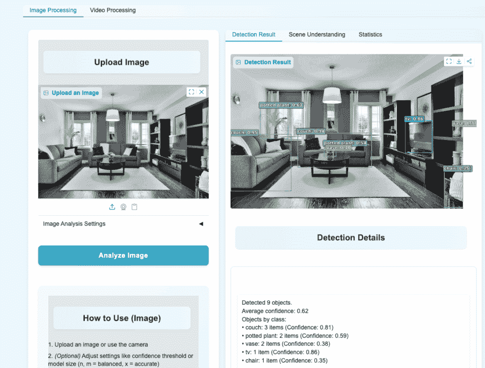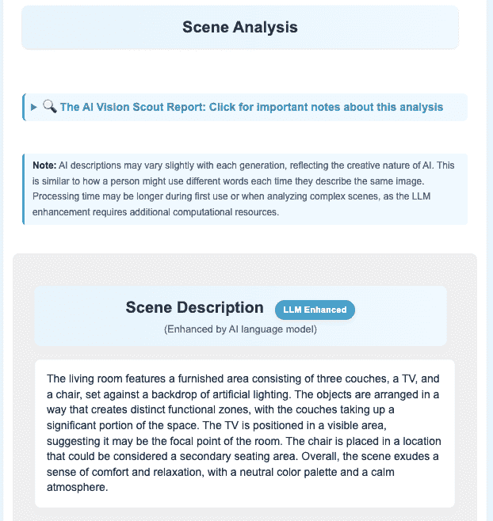

让我们从典型的家庭客厅开始。

系统的分析过程从基本的对象检测开始。

如检测详情面板所示，YOLOv8 引擎准确识别了九个对象，平均置信度得分为 0.62。这些包括三个沙发、两个盆栽、一台电视和几把椅子——这些是进一步场景分析中使用的要素。

为了使视觉解释更简单，系统将这些检测到的项目分组到更广泛的、**预定义的分类**中，如*家具*、*电子产品*或*车辆*。然后，每个类别都被分配了一个独特、一致的色彩。这种系统性的色彩编码有助于用户一眼就能快速掌握布局和对象类型。

但理解场景不仅仅是知道有哪些对象存在。系统的真正优势在于其生成最终描述的能力，这些描述感觉直观且像人类一样。

在这里，系统的语言模型（Llama 3.2）将来自所有其他模块、对象、照明、空间关系的信息整合在一起，编织成一个流畅、连贯的叙述。

例如，它不仅仅声明有沙发和电视。它推断出，由于沙发占据了相当大的空间，电视被定位为焦点，系统正在分析房间的主要生活区域。

这表明系统不仅检测对象，还**理解**它们在空间中的功能。

通过连接所有这些点，它将分散的**信号转化为对场景的有意义的解释**，展示了分层感知如何导致更深入的洞察。

### 1.2 环境分析和活动推断

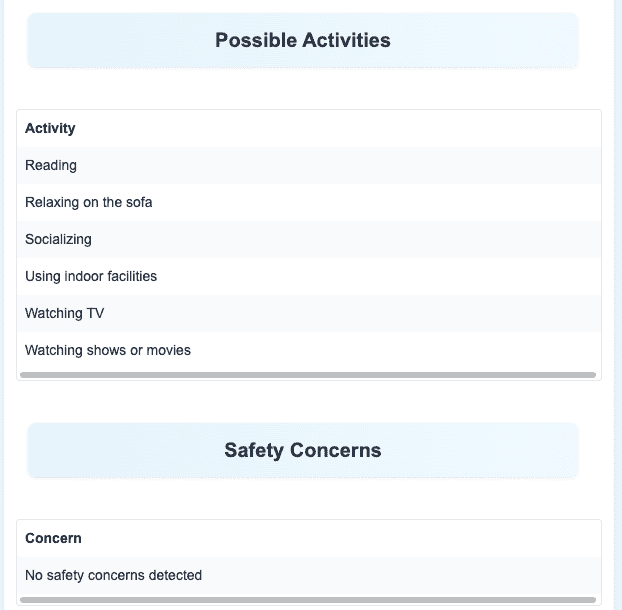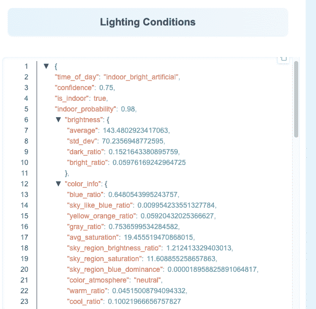

系统不仅描述对象，还**量化**和**推断**超出表面识别的抽象概念。

**可能活动**和**安全关注**面板展示了这一功能的应用。系统根据对象类型及其布局推断出可能的活动，如阅读、社交和看电视。它还标记出没有安全风险，进一步证实场景被归类为低风险。

照明条件揭示了另一个技术上的细微差别。系统将场景归类为“**室内，明亮，人工照明**”，这一结论得到了详细定量数据的支持。平均亮度为 143.48，标准差为 70.24，有助于评估照明的均匀性和质量。

颜色指标进一步支持对“**中性色调**”的描述，低暖色（0.045）和冷色（0.100）的比例与这一特征相符。颜色分析包括更细致的细节，如蓝色比例为 0.65，黄色-橙色比例为 0.06。

这个过程反映了框架的核心能力：将原始视觉输入转换为结构化数据，然后使用这些数据推断出高级概念，如氛围和活动，连接感知和**语义理解**。

* * *

## 2. 室外场景分析：城市交叉口的动态挑战

### 2.1 动态环境中的物体关系识别

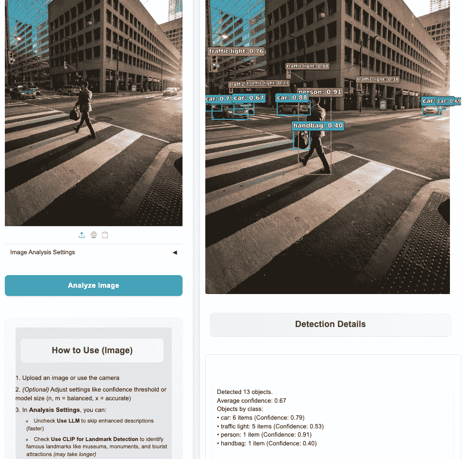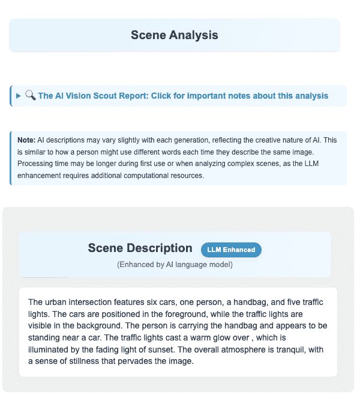

与室内空间的静态设置不同，户外街道场景引入了动态挑战。在这个傍晚拍摄的交叉路口案例中，系统在复杂环境中（13 个物体，平均置信度：0.67）保持了可靠的检测性能。通过两个重要的洞见，系统的分析深度变得明显，这两个洞见远远超出了简单的物体检测。

+   首先，系统超越了简单的标签，开始理解物体之间的关系。它不再仅仅列出像**“一个人”**和**“一个手提包”**这样的标签，而是推断出更有意义的联系：**“一个行人手提着一个手提包。”**识别这种交互，而不是将物体视为孤立的实体，是真正理解场景和预测人类行为的关键步骤。

+   第二个洞见突出了系统捕捉环境氛围的能力。在最终描述中的短语“交通灯散发出温暖的光芒……在日落渐暗的光线中照亮了……”，**显然不是预先编程的响应**。这种富有表现力的解释源于语言模型对物体数据（交通灯）、照明信息（日落）和空间背景的综合。系统能够将这些不同的元素连接成一个连贯的、情感共鸣的故事，这是其语义理解能力的明显体现。

### 2.2 上下文意识和风险评估

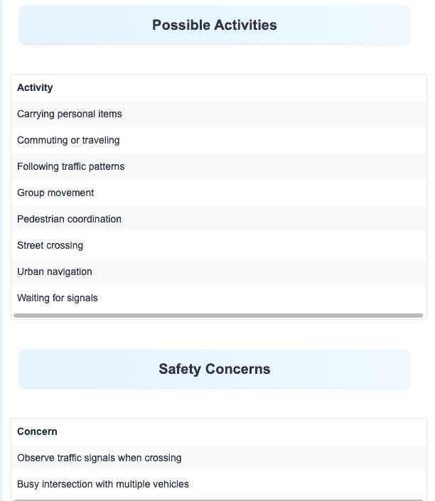

在动态的街道环境中，预测周围活动的能 力至关重要。系统在“可能活动”面板中展示了这一点，它准确地推断出与交通场景相关的**八个上下文感知动作**，包括**“街道穿越”**和**“等待信号。”**

使这个系统特别有价值的是它如何将上下文推理与主动风险评估相结合。它不仅仅列出**“6 辆车”**和**“1 个行人”**，而是将情况解释为一个**繁忙的交叉路口**，有**多辆车**，认识到其中涉及的风险。基于这种理解，它生成了两个针对性的安全提醒：**“过街时请注意交通信号”**和**“存在多辆车辆的繁忙交叉路口。”**

这种**主动**的风险评估将系统转变为一个能够**做出初步判断**的智能助手。这一功能在智能交通、辅助驾驶和视觉支持应用中非常有价值。通过将所看到的与可能的后果和安全影响联系起来，系统展示了对现实世界用户至关重要的情境理解。

### 2.3 复杂光照条件下的精确分析

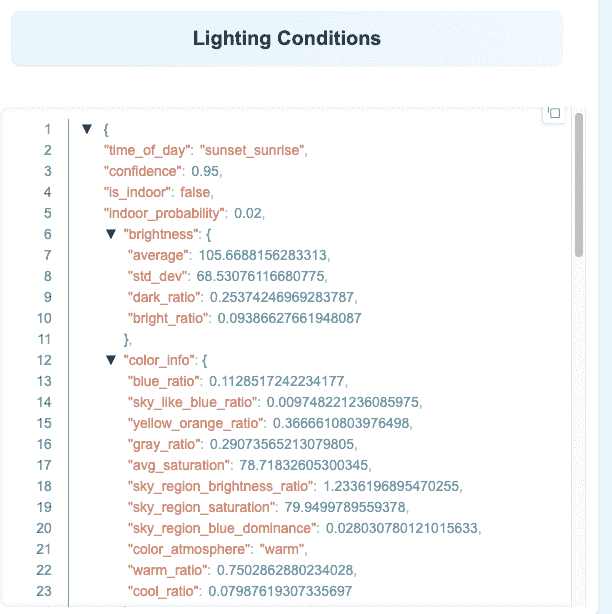

最后，为了支持其环境理解的可测量数据，系统对光照条件进行了详细分析。它将场景分类为**“户外”**，并且以**0.95**的高置信度准确识别出时间为**“日落/日出”。**

这个结论来自清晰的定量指标，而不是猜测。例如，**`warm_ratio`**（暖色调比例）相对较高，为**0.75**，而**`yellow_orange_ratio`**达到**0.37**。这些值反映了黄昏时典型的光照特征：温暖柔和的色调。**`dark_ratio`**记录在**0.25**，捕捉了日落时的渐暗光线。

与室内环境受控的光照条件相比，分析户外光照要复杂得多。系统能够将微妙且不断变化的自然光混合体**转换**为清晰的、高级的**“黄昏”**概念，展示了该架构在实际条件下的表现。

***

## 3. 地标识别分析：零样本学习实践

### 3.1 通过零样本学习实现语义突破

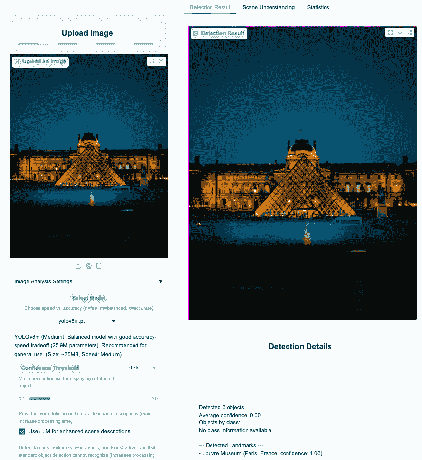

这项关于卢浮宫夜景的案例研究完美地说明了当传统目标检测模型**不足**时，多模态框架是如何适应的。

界面揭示了一个有趣的悖论：YOLO 检测到 0 个对象，平均置信度为 0.00。对于仅依赖目标检测的系统来说，这标志着分析的结束。然而，多模态框架使系统能够使用其他情境线索**继续解释**场景。

当系统检测到 YOLO 没有返回有意义的成果时，它将重点转向语义理解。在这个阶段，**CLIP**接管，利用其**零样本学习**能力来解释场景。CLIP 不是寻找像**“椅子”**或**“汽车”**这样的特定对象，而是分析图像的整体视觉模式，以找到与知识库中文化概念**“卢浮宫博物馆”**相符合的语义线索。

最终，系统以完美的**1.00 置信度分数**识别出地标。这个结果展示了集成框架的价值：它能够解释场景中嵌入的**文化意义**，而不仅仅是简单地编目视觉特征。

### 3.2 深度整合文化知识

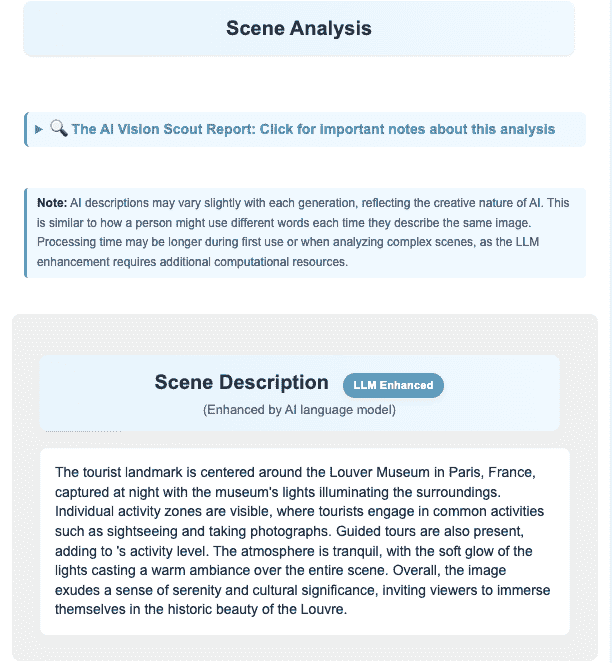

在最终的场景描述中，多模态组件协同工作变得明显。描述以*“这个旅游地标位于法国巴黎的卢浮宫，夜间拍摄”*开头，综合了至少三个独立模块的见解：**CLIP 的地标识别**、YOLO 的空检测结果和**照明模块的夜间分类**。

通过超越视觉数据的推理，出现了更深入的推理。例如，系统注意到*“游客正在进行常见的活动，如观光和摄影”*，尽管图像中并未明确检测到人。

这样的结论并非仅从像素中得出，而是源于系统的内部知识库。通过“**知道**”卢浮宫代表世界级博物馆，系统可以逻辑地推断出最常见的游客行为。从地点识别到理解社会背景的转变，将高级人工智能与传统计算机视觉工具区分开来。

除了事实报道之外，系统的描述还捕捉到了情感调调和文化相关性。识别出*“宁静的氛围”*和*“文化意义”*反映了系统对物体及其在更广泛背景中角色的更深层次语义理解。

这种能力是通过将视觉特征与人类行为、社会功能和文化背景的内部知识库相连接而得以实现的。

### 3.3 知识库集成和环境分析

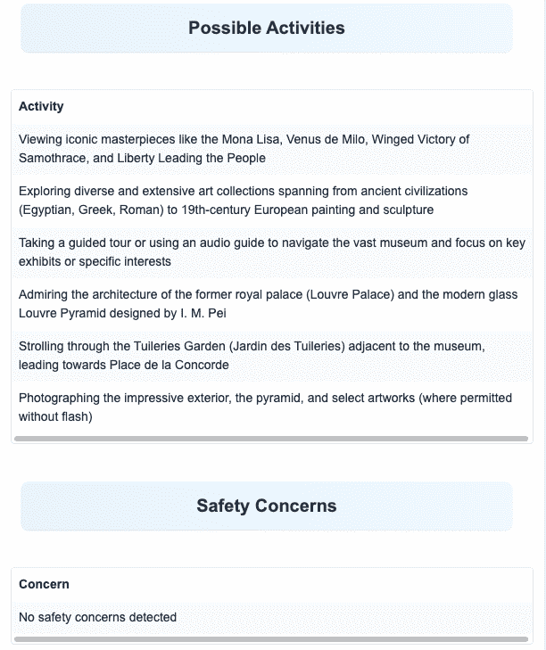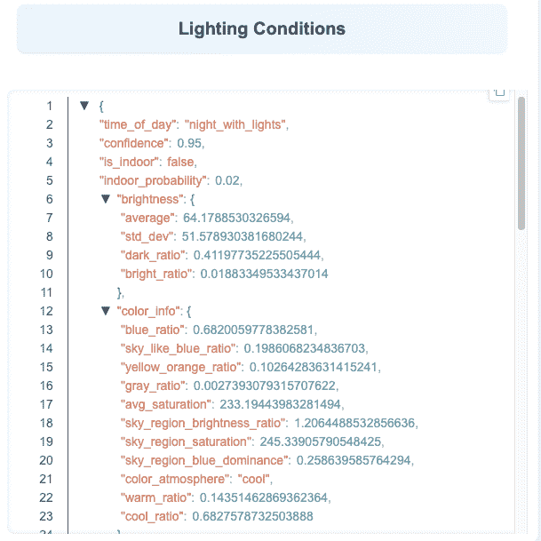

**“可能的活动”**面板清晰地展示了系统的文化和情境推理。它不仅提供了一般的建议，而且基于领域知识提出了细微的活动，例如：

+   **观赏标志性艺术品**，包括蒙娜丽莎和维纳斯像。

+   **探索广泛的收藏**，从古代文明到 19 世纪的欧洲绘画和雕塑。

+   **欣赏建筑**，从过去的皇家宫殿到贝聿铭的现代玻璃金字塔。

这些高度具体的建议超越了普通旅游建议，反映了系统的知识库与地标实际功能和文化意义如何深度一致。

一旦识别出卢浮宫，系统就利用其地标数据库来提出特定情境的活动建议。这些推荐非常精细，从游客礼仪（如“**在允许的情况下无闪光摄影**”）到本地化体验（如“**在杜乐丽花园散步**”）。

除了丰富的知识库之外，系统的环境分析也值得密切关注。在这种情况下，照明模块自信地将场景分类为“有灯光的夜间”，置信度得分为 0.95。

这个结论得到了精确的视觉指标的支撑。高暗区比率（0.41）与主导的冷色调比率（0.68）有效地捕捉了人工夜间照明的视觉特征。此外，升高的蓝色比率（0.68）反映了夜空的典型光谱特性，从而加强了系统的分类。

### 3.4 工作流程综合与关键见解

从像素级分析到地标识别，再到知识库匹配，这个工作流程展示了系统在导航复杂文化场景方面的能力。**CLIP 的无监督学习**处理识别过程，而**预先构建的活动数据库**提供上下文感知和可操作的推荐。这两个组件协同工作，展示了多模态架构在需要深度语义推理的任务中特别有效的原因。

* * *

## 4. 前路：向更深入的理解演进

案例研究展示了 VisionScout 目前能做什么，但其架构是为未来设计的。以下是系统如何演进的预览，逐步接近真正的 AI 认知。

+   超越当前基于规则的协调，系统将通过**强化学习**从经验中学习。而不是简单地遵循其编程，AI 将根据结果主动优化其策略。当它对昏暗场景做出误判时，它不会只是失败；它会学习、适应，并在下一次做出更好的决定，从而实现真正的自我纠正。

+   深化系统在视频分析中的**时间智能**是另一项关键进步。而不是在单个帧中识别对象，目标在于理解它们之间的**叙事**。而不仅仅是看到一辆汽车在移动，系统将理解这辆汽车加速超车，然后安全地回到车道上的故事。理解这些因果关系关系为真正有洞察力的视频分析打开了大门。

+   在现有的**无监督学习**能力基础上，将使系统的知识扩展变得更加敏捷。虽然系统已经通过地标识别展示了这种潜力，但未来的增强可以结合**少样本学习**来扩展这一能力到多个领域。而不是需要成千上万的训练示例，系统可以学会从少量示例中识别新的鸟类物种、特定品牌的汽车或某种建筑风格，甚至仅从文本描述中识别。这种增强能力允许快速适应特定领域，而无需昂贵的重新训练周期。

* * *

## 5. 结论：精心设计系统的力量

本系列文章从建筑理论到实际应用，描绘了一条路径。通过三个案例研究，我们见证了质的飞跃：从简单地**看到物体**到真正**理解场景**。这个项目表明，通过有效地融合多种 AI 模式，我们可以利用今天的科技构建具有细微、情境智能的系统。

从这次旅程中最引人注目的是，**一个精心设计的架构比任何单一模型的表现都更为关键**。对我来说，这个项目的真正突破不是找到一个“更聪明”的模型，而是在一个框架中，不同的 AI 思想可以有效地协作。这种系统方法，优先考虑整合的“如何”而非单个组件的“是什么”，是我学到的最有价值的经验。

应用 AI 的未来可能更多地取决于成为更好的架构师，而不是构建更大的模型。当我们从优化孤立组件转向协调它们的集体智能时，我们为能够真正**理解**和**交互**我们世界复杂性的 AI 打开了大门。

* * *

## 参考文献 & 进一步阅读

### 项目链接

**VisionScout**

+   [GitHub 仓库](https://github.com/Eric-Chung-0511/Learning-Record/tree/main/Data%20Science%20Projects/VisionScout)

+   [实时演示](https://huggingface.co/spaces/DawnC/VisionScout)

**联系方式**

+   💻 [GitHub 个人资料](https://github.com/Eric-Chung-0511)

+   📧 电子邮件

### 核心技术

+   YOLOv8: Ultralytics. (2023). YOLOv8：实时目标检测和实例分割.

+   CLIP: Radford, A., et al. (2021). 从自然语言监督中学习可迁移的视觉表示. ICML 2021.

+   Places365: 周博，等. (2017). Places：一个包含 1000 万张图像的场景识别数据库. IEEE TPAMI.

+   Llama 3.2: Meta AI. (2024). Llama 3.2：多模态和轻量级模型.

### 图片来源

本项目中使用的所有图片均来自[Unsplash](https://unsplash.com/)，这是一个为创意项目提供高质量库存摄影的平台。
