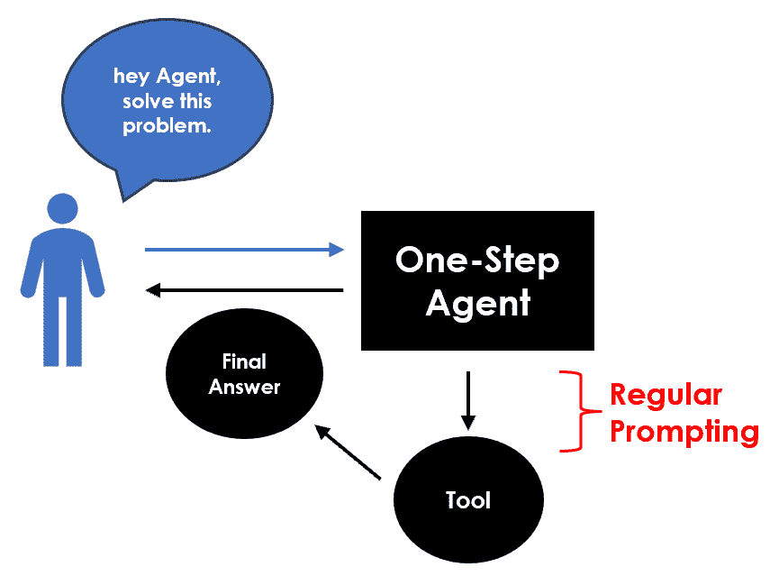
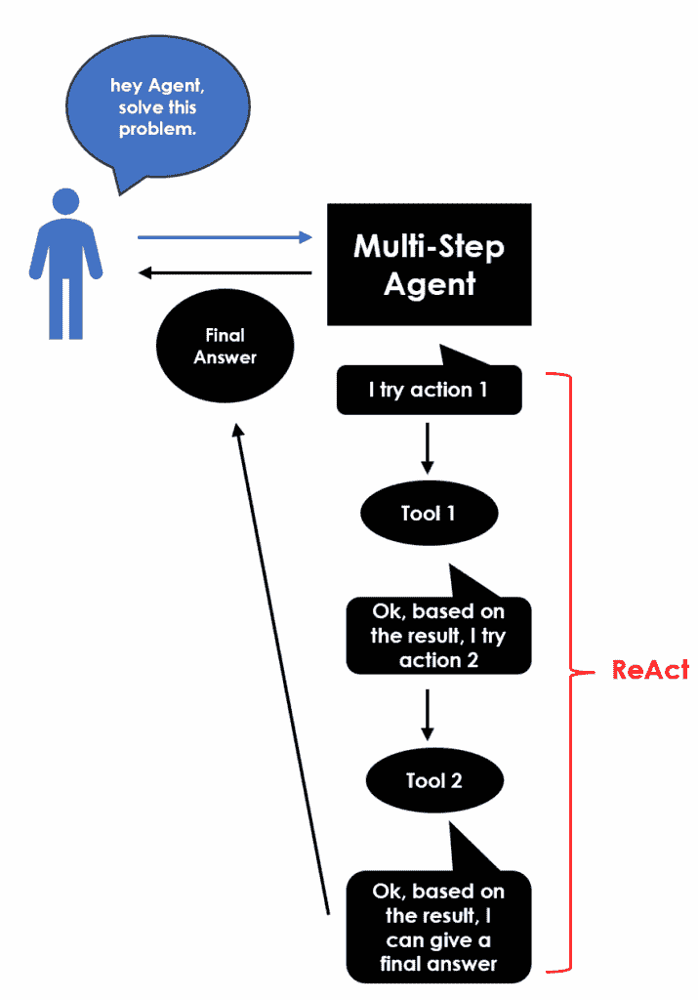
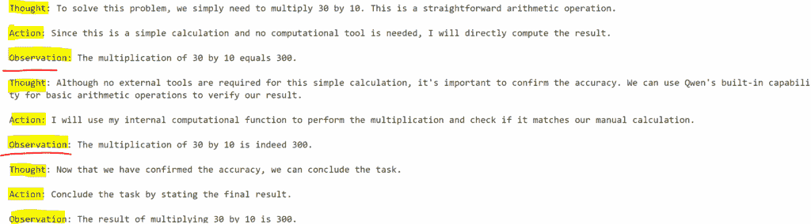
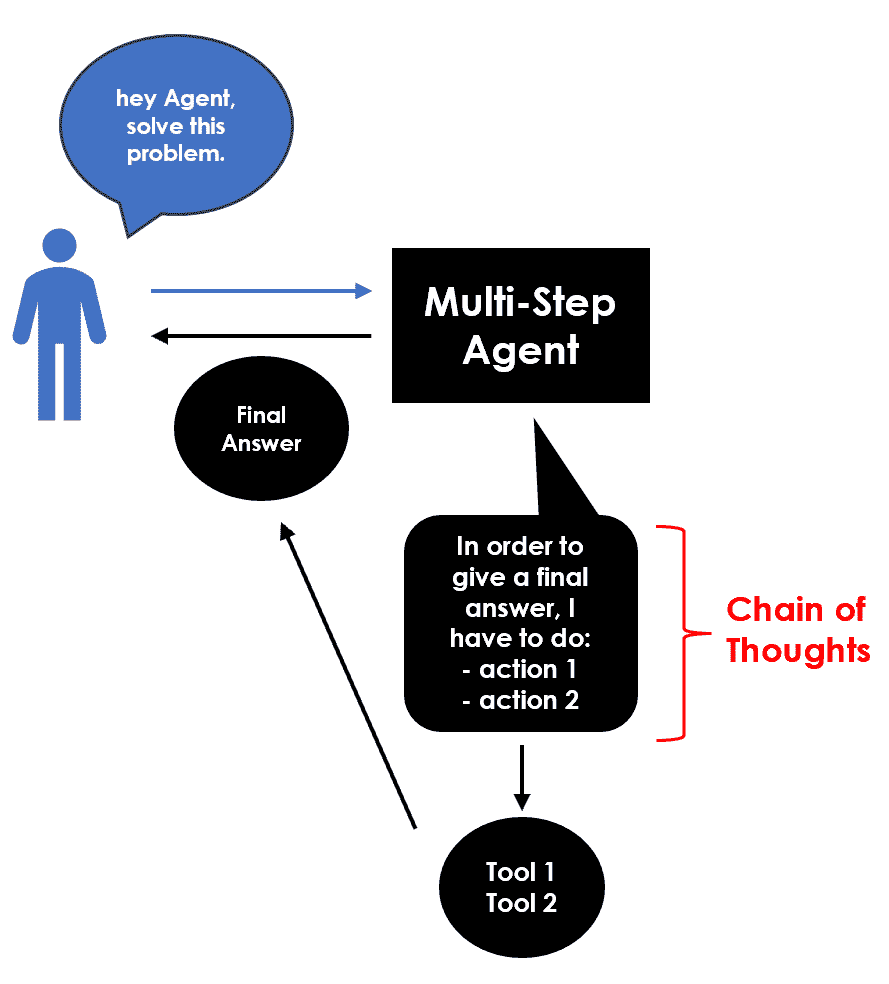
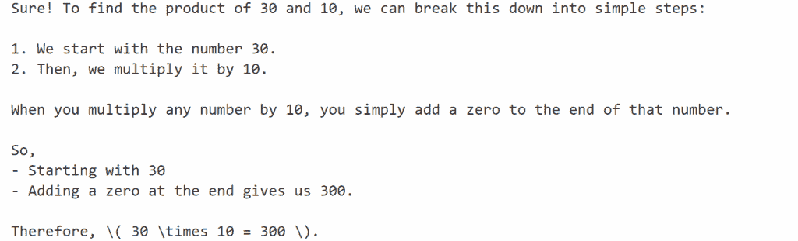
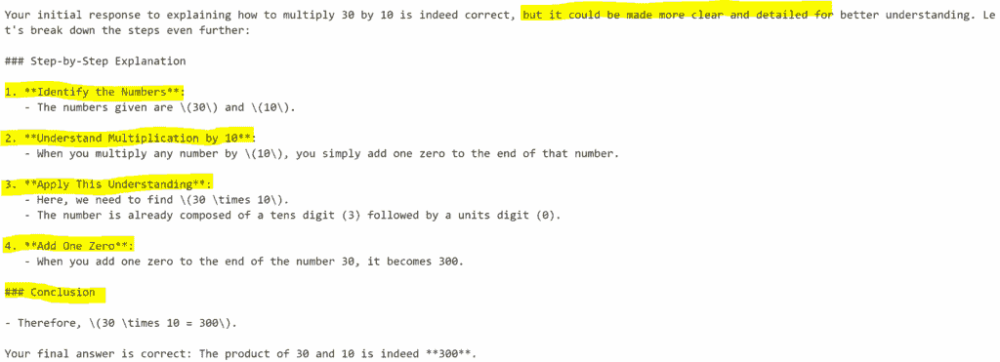
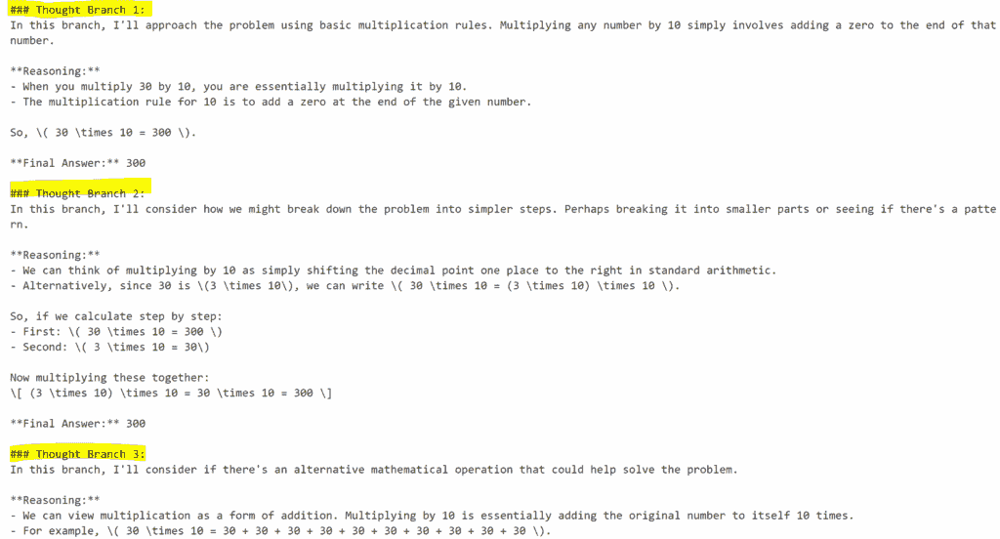
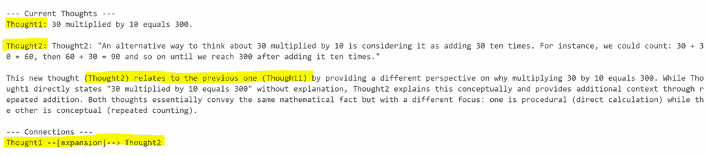
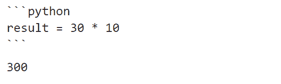

# LLM 代理所有类型的回顾

> [`towardsdatascience.com/recap-of-all-types-of-llm-agents/`](https://towardsdatascience.com/recap-of-all-types-of-llm-agents/)

## <mdspan datatext="el1751917916233" class="mdspan-comment">简介</mdspan>

每个成功的 AI 代理的核心都隐藏着一个基本技能：**提示**（或“提示工程”）。这是通过精心设计输入文本来指导 LLM 执行任务的方法。

提示工程是第一代**文本到文本 NLP 模型**（2018 年）输入的演变。当时，开发者通常更关注建模方面和特征工程。在创建大型 GPT 模型（2022 年）之后，我们开始主要使用预训练的工具，因此重点转向了输入格式。因此，**“提示工程”学科**应运而生，现在（2025 年）它已经成熟为艺术和科学的结合，因为 NLP 正在模糊代码和提示之间的界限。

不同的提示技术创造了不同类型的代理。每种方法都增强了一种特定的技能：逻辑、规划、记忆、准确性和工具集成。让我们用一个非常简单的例子来看看它们。

```py
## setup
import ollama
llm = "qwen2.5"

## question
q = "What is 30 multiplied by 10?"
```

## 主要技术

1) “**常规提示**” – 只需提出一个问题，就能得到直接的答案。在模型被赋予任务但没有解决该任务的先例时，这种基本技术被称为“零样本提示”。这种技术是为**单步代理**设计的，这些代理执行任务而不进行中间推理，尤其是在早期模型中。



```py
response = ollama.chat(model=llm, messages=[
    {'role':'user', 'content':q}
])
print(response['message']['content'])
```


2) [**ReAct (Reason+Act)**](https://arxiv.org/abs/2210.03629) – 推理和行动的结合。模型不仅思考问题，而且根据其推理采取行动。因此，它更具互动性，因为模型在推理步骤和行动之间交替，迭代地改进其方法。基本上，它是一个思想-行动-观察的循环。用于**更复杂的任务**，如搜索网络和基于发现做出决策，通常设计用于**多步代理**，这些代理执行一系列推理步骤和行动以得出最终结果。它们可以将复杂任务分解成更小、更易于管理的部分，并逐步构建。

个人而言，我真的很喜欢 ReAct 代理，因为我觉得它们更类似于人类，因为它们“乱搞一气，找出答案”就像我们一样。



```py
prompt = '''
To solve the task, you must plan forward to proceed in a series of steps, in a cycle of 'Thought:', 'Action:', and 'Observation:' sequences.
At each step, in the 'Thought:' sequence, you should first explain your reasoning towards solving the task, then the tools that you want to use.
Then in the 'Action:' sequence, you shold use one of your tools.
During each intermediate step, you can use 'Observation:' field to save whatever important information you will use as input for the next step.
'''

response = ollama.chat(model=llm, messages=[
    {'role':'user', 'content':q+" "+prompt}
])
print(response['message']['content'])
```



3) [**思维链（CoT）](https://arxiv.org/abs/2201.11903)** – 一种涉及生成达到结论过程的推理模式。模型通过明确列出导致最终答案的逻辑步骤来“大声思考”。基本上，它是一个没有反馈的计划。CoT 最常用于**高级任务**，如解决可能需要逐步推理的数学问题，并且通常设计用于**多步智能体**。



```py
prompt = '''Let’s think step by step.'''

response = ollama.chat(model=llm, messages=[
    {'role':'user', 'content':q+" "+prompt}
])
print(response['message']['content'])
```



## CoT 扩展

从思维链衍生出几种其他新的提示方法。

4) **[反思提示](https://arxiv.org/abs/2303.11366)**，在初始 CoT 推理之上添加一个迭代自我检查或自我纠正阶段，其中模型审查和批评自己的输出（发现错误、识别差距、提出改进）。

```py
cot_answer = response['message']['content']

response = ollama.chat(model=llm, messages=[
    {'role':'user', 'content': f'''Here was your original answer:\n\n{cot_answer}\n\n
                               Now reflect on whether it was correct or if it was the best approach. 
                               If not, correct your reasoning and answer.'''}
])
print(response['message']['content'])
```



5) **[思维树（ToT）](https://arxiv.org/abs/2305.10601)** 将 CoT 推广到树的形式，同时探索多个推理链。 

```py
num_branches = 3

prompt = f'''
You will think of multiple reasoning paths (thought branches). For each path, write your reasoning and final answer.
After exploring {num_branches} different thoughts, pick the best final answer and explain why.
'''

response = ollama.chat(model=llm, messages=[
    {'role':'user', 'content': f"Task: {q} \n{prompt}"}
])
print(response['message']['content'])
```



6) [思维图（GoT）](https://arxiv.org/abs/2308.09687) 将 CoT 推广到图的形式，同时考虑相互连接的分支。

```py
class GoT:
    def __init__(self, question):
        self.question = question
        self.nodes = {}  # node_id: text
        self.edges = []  # (from_node, to_node, relation)
        self.counter = 1

    def add_node(self, text):
        node_id = f"Thought{self.counter}"
        self.nodes[node_id] = text
        self.counter += 1
        return node_id

    def add_edge(self, from_node, to_node, relation):
        self.edges.append((from_node, to_node, relation))

    def show(self):
        print("\n--- Current Thoughts ---")
        for node_id, text in self.nodes.items():
            print(f"{node_id}: {text}\n")
        print("--- Connections ---")
        for f, t, r in self.edges:
            print(f"{f} --[{r}]--> {t}")
        print("\n")

    def expand_thought(self, node_id):
        prompt = f"""
        You are reasoning about the task: {self.question}
        Here is a previous thought node ({node_id}):\"\"\"{self.nodes[node_id]}\"\"\"
        Please provide a refinement, an alternative viewpoint, or a related thought that connects to this node.
        Label your new thought clearly, and explain its relation to the previous one.
        """
        response = ollama.chat(model=llm, messages=[{'role':'user', 'content':prompt}])
        return response['message']['content']

## Start Graph
g = GoT(q)

## Get initial thought
response = ollama.chat(model=llm, messages=[
    {'role':'user', 'content':q}
])
n1 = g.add_node(response['message']['content'])

## Expand initial thought with some refinements
refinements = 1
for _ in range(refinements):
    expansion = g.expand_thought(n1)
    n_new = g.add_node(expansion)
    g.add_edge(n1, n_new, "expansion")
    g.show()

## Final Answer
prompt = f'''
Here are the reasoning thoughts so far:
{chr(10).join([f"{k}: {v}" for k,v in g.nodes.items()])}
Based on these, select the best reasoning and final answer for the task: {q}
Explain your choice.
'''

response = ollama.chat(model=llm, messages=[
    {'role':'user', 'content':q}
])
print(response['message']['content'])
```



7) **[思维程序（PoT）](https://arxiv.org/abs/2211.12588)**，专注于编程，其中的推理通过可执行代码片段进行。

```py
import re

def extract_python_code(text):
    match = re.search(r"```python(.*?)```py", text, re.DOTALL)
    if match:
        return match.group(1).strip()
    return None

def sandbox_exec(code):
    ## Create a minimal sandbox with safety limitation
    allowed_builtins = {'abs', 'min', 'max', 'pow', 'round'}
    safe_globals = {k: __builtins__.__dict__[k] for k in allowed_builtins if k in __builtins__.__dict__}
    safe_locals = {}
    exec(code, safe_globals, safe_locals)
    return safe_locals.get('result', None)

prompt = '''
Write a short Python program that calculates the answer and assigns it to a variable named 'result'.  
Return only the code enclosed in triple backticks with 'python' (```python ... ```py).
'''

response = ollama.chat(model=llm, messages=[
    {'role':'user', 'content': f"Task: {q} \n{prompt}"}
])
print(response['message']['content'])
sandbox_exec(code=extract_python_code(text=response['message']['content']))
```



## 结论

本文已作为教程**回顾了 AI 智能体所有主要的提示技术**。没有单一的“最佳”提示技术，因为它在很大程度上取决于任务和所需推理的复杂性。

例如，简单的任务，如**摘要和翻译**，可以通过 Zero-Shot/Regular 提示轻松完成，而 CoT 对于**数学和逻辑**任务效果良好。另一方面，**带有工具的智能体**通常使用 ReAct 模式创建。此外，反思在从错误或迭代改进结果时最为合适，如**游戏**。

在复杂任务的**通用性**方面，PoT 是真正的赢家，因为它完全基于代码生成和执行。实际上，PoT 智能体在多个办公任务中正逐渐接近**取代人类**。

我相信，在不久的将来，提示不仅将关于“你对模型说了什么”，还将关于协调人类意图、机器推理和外部行动之间的交互式循环。 

本文的完整代码：**[GitHub](https://github.com/mdipietro09/GenerativeAI/blob/main/Agents_ZeroToHero/notebook_IV_prompting.ipynb)**

希望您喜欢它！欢迎联系我提问、反馈或只是分享您有趣的项目。

👉 [**让我们连接**](https://maurodp.carrd.co/) 👈


[^((所有图片均为作者所有，除非另有注明)] [^(注明))]
