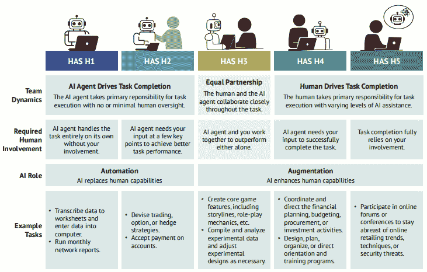
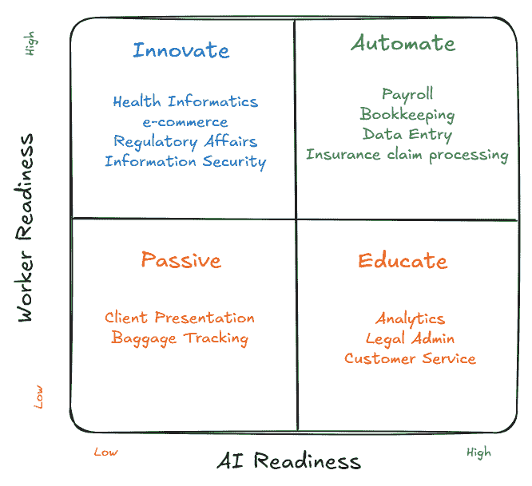
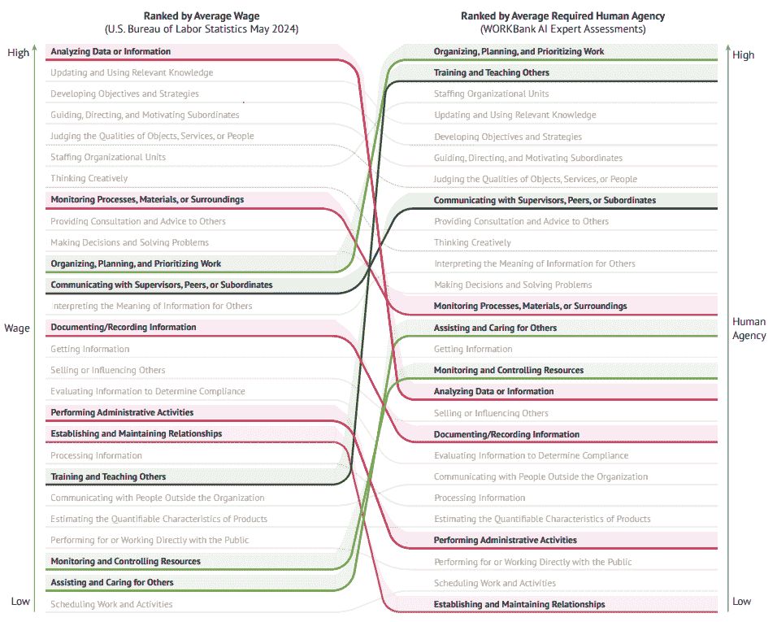
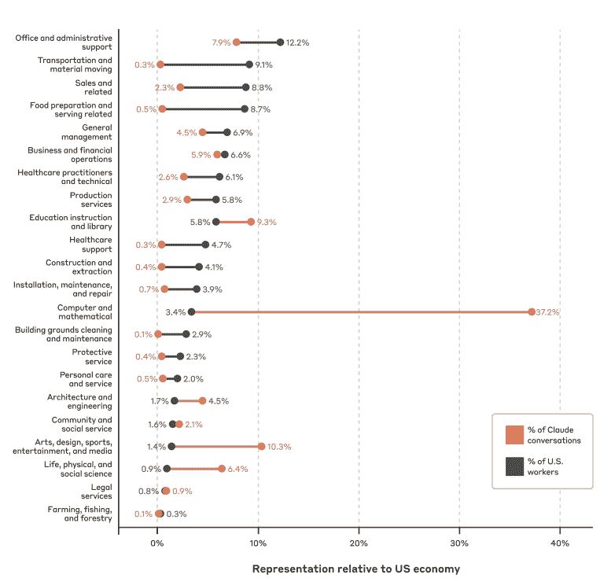
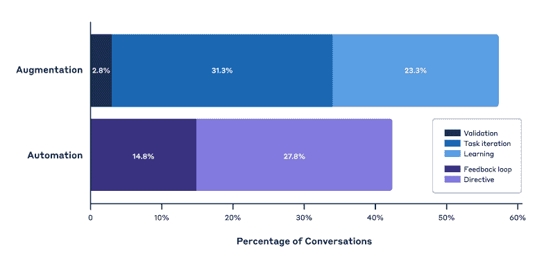

# AI 代理正在通过一项项任务塑造工作的未来，而不是通过一项项工作

> [`towardsdatascience.com/ai-agents-are-shaping-future-of-work-task-by-task-not-job-by-job/`](https://towardsdatascience.com/ai-agents-are-shaping-future-of-work-task-by-task-not-job-by-job/)

<mdspan datatext="el1752000762578" class="mdspan-comment">在过去的</mdspan>几年里，专家们一直在就 AI 对工作的影响进行辩论。它将创造工作还是摧毁工作？工作将由人领导还是由 AI 领导？这种二元的讨论，正如研究揭示的那样，并没有提出正确的问题。

两项大规模研究，[斯坦福的“WORKBank”](https://arxiv.org/pdf/2506.06576)（1,500 名工人，844 个任务）和 [Anthropic 的“Claude 经济指数”](https://arxiv.org/pdf/2503.04761)（410 万次对话，19,000 个任务），表明 AI 正在通过一项项任务重塑工作，而不是通过一项项角色。不到 4% 的职业接近完全自动化，但员工本身希望 46% 的个人任务自动化，主要是可重复的金融、报告和数据录入工作。大多数知识工作者更喜欢“平等伙伴”的副驾驶，而不是无人驾驶的自动化，现实世界的使用也证实了这一点：57% 的观察到的 AI 交互是增强对话，43% 是放手委托。技能溢价已经从常规分析转向工作流程编排、优先级排序和人际影响力。

这些细微差别很重要。AI 首先会塑造任务，而不是工作。也很可能很少有工作会完全消失。当我们谈论“工作将发生转变”时，这正是它的确切含义——那个工作中的许多任务将由 AI 完成，而更多的时间将花在其他或新的任务上。

我们需要从模糊和高级的策略转向详细的方法，例如在任务层面的工作图。在这篇文章中，我们将深入探讨这两项研究的发现，然后探讨一个三管齐下的策略。

## 工人想要什么与 AI 能做什么：斯坦福“WORKBank”研究

要理解工作的未来，我们首先必须理解工作本身。这是斯坦福“WORKBank”研究的前提，该研究系统地审查了工作，不是从上到下（职位名称），而是从下到上（个人任务）。调查了来自 104 个职业和 844 个不同任务的 1,500 多名美国工人，研究人员基于一个简单但关键的问题构建了一个独特的数据库：你希望将哪些工作部分交给 AI，哪些 AI 实际上能做？

这项研究的独特之处在于其多层次的方法。它不仅捕捉了工人的愿望，而且还将其与 52 位领先的 AI 专家的意见进行了交叉参考，这些专家对自动化每个相同任务的技术可行性进行了评估。

### 两个框架来应对未来

斯坦福团队将他们的发现综合成两个优雅的框架：

**人类代理尺度（HAS）**：这个五级尺度将任务中期望的人类参与度分类，从 H1（AI 完全执行任务或“无人工干预”自动化）到 H5（任务基本上是人类的，AI 没有角色）。它提供了讨论自动化的细微语言，超越了简单的“人机二元”。

来源：斯坦福论文《人工智能代理的未来工作：美国劳动力自动化和增强潜力审计》

**需求-能力矩阵**：研究人员随后将每个角色绘制在矩阵中。虽然他们使用 2×2 矩阵的任务分数平均值，但我认为最好查看附录 E.4 中的角色层级汇总数据。如果我们分析这些数据，在角色层级上可以更清晰地看到企业 AI 的潜在影响。这创造了四个不同的区域，每个区域都有明确的战略意义：

来源：作者，基于斯坦福论文《人工智能代理的未来工作：美国劳动力自动化和增强潜力审计》附录 E4 中的数据。

+   **绿色自动化区**：工人意愿高，AI 能力高。这些任务非常适合完全自动化，无需思考。

+   **蓝色创新区**：工人意愿高，AI 能力低。市场机会在于 AI 构建者解决工人想要解决的问题。

+   **黄色教育区**：工人意愿低，AI 能力高。工人低估了 AI 的能力，这是一个内部教育和赋能的机会。

+   **被动红区**：工人意愿低，AI 能力低。这是企业应监控进展但无需立即采取行动的区域。

### 关键发现：寻求伙伴关系而非替代

**工人希望自动化繁琐的工作**。这项研究的发现消除了围绕一个有争议领域的神话，即工人天生不想使用 AI。令人震惊的是，46%的所有任务都是工人主动想要外包的，主要是那些消耗认知资源的枯燥、重复性工作。最常见的原因是抱负：69%的人表示他们的目标是“为高价值工作腾出时间”。

**完全自动化不可取**。对 AI 自动化的需求不是对过时的需求。担忧仍然存在，28%的工人表示对工作安全和角色“去人性化”的担忧。这就是为什么理想的交互模式不是替代而是合作。全面来看，45%的职业报告称“平等合作”（代理尺度上的 H3）是他们理想的状态，远比完全接管更偏好共驾模式。

工人持续要求比专家所说的技术要求更多的代理权。这意味着高管将需要在同情心领导下引领这一路径。工人想要 AI，但想要的 AI 比可能的要少。

最具说明性的可能是新兴的“技能反转”。高端职位正迅速从常规分析任务中转移，这些任务正是过去 20 年知识工作者所定义的技能，转向一套新的元技能：组织工作、优先排序、提供指导、人际咨询以及在不确定性下做出决策。在以代理为主导的企业中，你的价值将更多地由你组织代理的能力，而不是你分析的能力来定义。

来源：斯坦福论文 – 使用 AI 代理的工作未来：在美国劳动力中审计自动化和增强型潜力

## 人们实际上在做什么：Anthropic 的“Claude 经济指数”

如果斯坦福的研究告诉我们可能性和期望，那么 Anthropic 的 Claude 经济指数就告诉我们现在实际上发生了什么。通过分析其 Claude AI 模型与 410 万真实世界互动，并将其映射到超过 19,000 项官方 O*NET 任务，Anthropic 创建了一个前所未有的、实时的 AI 野外观用的快照。

### 谁在采用，谁没有采用

数据显示，AI 的采用并不均匀；它有明显的热点和冷点。“热点”并不令人意外：37%的使用来自计算机和数学职业（编码、脚本、故障排除），其次是 10%来自写作和传播（营销文案、技术文档）。而“冷点”是那些需要物理存在的角色：建筑、餐饮和实际医疗保健几乎没有任何参与。

来源：Anthropic 论文 – 使用 AI 完成的经济任务有哪些？来自数百万 Claude 对话的证据

更具揭示性的是“工作区域”的分析，这是一种基于所需准备水平的角色分类。峰值 AI 使用发生在工作区域 4。这些角色如软件开发者、分析师和营销人员通常需要学士学位。这个群体比预期多使用 AI 50%，占所有分析使用的超过一半。相反，在极端工作区域的使用较低：工作区域 1（例如，咖啡师）和工作区域 5（例如，医生、律师）都显著低于指数。这告诉我们，AI 当前的甜蜜点在于结构化、分析性的知识工作。

### 他们是如何使用的？增强型应用仍然占主导地位

该研究证实了斯坦福大学关于工人偏好的发现。大多数互动，57%，是“增强型”的，特征是迭代对话、验证和学习，这是一种真正的副驾驶关系。只有 43%是完全“自动化”或委托的，用户给出提示并期望得到一个成品，而不需要来回沟通。

来源：Anthropic 论文 – 使用 AI 完成的经济任务有哪些？来自数百万 Claude 对话的证据

当我们深入到任务本身时，模式变得更加清晰。主导用例是在高价值、复杂的工作中：软件开发和调试、创建技术文档和业务流程分析。这不仅仅是自动化简单的文书工作；这是关于增强最有价值知识工作者的核心功能。

关键的是，这项研究显示，全面工作自动化是一个误导。只有 4%的职业看到 AI 触及其构成任务的超过 75%，这些通常是狭窄领域，如语言教学和编辑。然而，36%的职业有“高度活跃的 AI 区域”，技术至少存在于其任务的四分之一中。例如，市场营销经理可能不会使用 AI 进行客户互动，但他们会在市场研究和战略规划中大量使用它。这种任务级别的渗透率是重要的指标。

## 执行手册：赋能企业的 AI 代理的三个必要条件

这些数据不仅仅在学术上有趣。它为企业 AI 战略提供了一个蓝图。以下是针对每位高级领导的具体、可操作的三个必要条件。

### 1. 目标自动化和共飞行员机会

这里的方法应该取决于角色和任务。这些可以分为三个区域：

**自动化显而易见之事**（绿色区域）：两项研究的共识是明确的。在金融、会计和重复性数据管理中，大量任务已经准备好进行全面自动化。这就是我们应该系统地、大规模地自动化低价值任务的领域。

**战略部署共飞行员**（绿色/黄色区域）：对于商业智能、合规性、学习和开发以及创意营销等职能，任务是增强。这并不意味着购买更多工具；这意味着将 AI 能力融入现有工作流程中。例如，为分析师生成 AI 生成的起点报告，AI 驱动的合规性清单，或 AI 辅助的内容生成，以帮助营销人员。目标是提升，而不是替代。

**教育怀疑者**（黄色区域）：斯坦福大学的研究显示，我们许多最熟练的工人，如工程师、分析师和管理人员，低估了 AI 的能力。我们必须调查我们自己的组织中是否存在这种认知差距。这是否是由于工具不足？技术债务？或者是对技能丧失的文化恐惧？答案将决定我们是否需要启用活动（更好的工具和培训）或感知转变活动（展示价值和建立信任）。

### 2. 市场推广和产品创新

除了内部效率之外，这项研究还突出了巨大的外部增长机会（蓝色区域）。

**成为“AI 加速合作伙伴”**：斯坦福研究中的研发机会区域和 Anthropic 研究中的未充分渗透领域突出了法律、医疗保健、旅游和电子商务等行业，在这些行业中，工人的 AI 需求要么远远超过当前技术，要么存在被动市场。这些可以成为构建新产品和初创企业的领域。

**探索新产品前沿**：数据还指出了特定的职业需求。例如，信息安全专家和计算机网络专家都报告说，他们非常渴望当前工具无法提供的 AI 辅助。这是一个明显的信号，表明产品团队应该开始研究和探索。是否需要构建一个新的安全产品？一个由代理驱动的新的网络管理平台？数据为未满足的需求提供了地图。

### 3. 劳动力转型与技能战略

这是最具挑战性、最重要的领域。AI 在任务层面的影响需要我们彻底改革人才管理理念。

**构建“AI 编排”技能家族**：这两项研究都清晰地描绘了新的高端技能：工作流程设计、跨职能编排和应对不确定性。企业应该投资于培养这些能力。这意味着在学习和职业路径中构建一个新的“AI 编排”能力，并将其嵌入到职业路径和绩效评估中。目标是训练人们擅长指导、验证和将 AI 能力集成到复杂的工作流程中。

**采用基于任务的劳动力规划**：高级人员编制预算可能成为过去的遗迹。企业应该超越全职员工（FTEs），考虑“每个角色的任务混合”模型。这种基于任务的观点应该驱动招聘和再部署决策，并将其整合到预算周期中，以便未来的劳动力选择由人类实际要完成的工作来驱动。

**从组织结构图进化到“工作图谱”**：最终目标是实现从静态、孤立的组织结构图到动态、活跃的“工作图谱”的转变。这是一张公司范围内的地图，详细说明了各个职能的任务、负责人、依赖关系和自动化状态，打破孤岛，优化端到端的价值流。这个图谱成为优先自动化项目、识别技能差距、重新设计团队结构以及甚至关于哪些流程可以从低成本地区带回以及哪些供应商关系可以被更高效的 AI 代理所取代的战略决策的唯一真实来源。

## 合作伙伴关系是当务之急

工作的未来不是在人类和 AI 之间做出选择。这是关于构建他们的协作。那些能够繁荣发展的组织将超越二元自动化辩论，专注于智能任务分解、战略能力发展和深思熟虑的变革管理。

研究结果明确无误：工人不希望被人工智能取代，但他们确实希望摆脱那些阻碍他们发挥最佳工作状态的重复性、低价值任务。那些倾听这一信息并系统采取行动的公司，不仅能获得运营效率，还能在吸引和留住顶尖人才方面获得显著的竞争优势。

可能最具挑衅性的是，成功的组织应该探索将可完全自动化的流程从低成本地区带回集中式、云原生运营，这些运营由人工智能代理支持。同时，他们应该评估外部业务流程外包（BPO）和软件即服务（SaaS）关系，试点人工智能替代，在代理能够匹配或超越供应商服务水平的地方，并将节省下来的资金重新投资于高价值人才。

任务革命已经启动。问题不在于人工智能是否会重塑工作，而在于您的组织是会引领这一变革还是被它颠覆。目前的选择权仍然掌握在人类手中。

* * *

Shreshth Sharma 是一位拥有 15 年领导和管理执行经验的商业策略、运营和数据高管，曾在管理咨询（BCG 的专家 PL）、媒体和娱乐（索尼影业的副总裁）以及技术（Twilio 的高级总监）等行业工作。您可以在[LinkedIn](https://www.linkedin.com/in/shreshth)上关注他。
