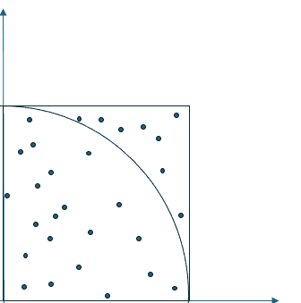
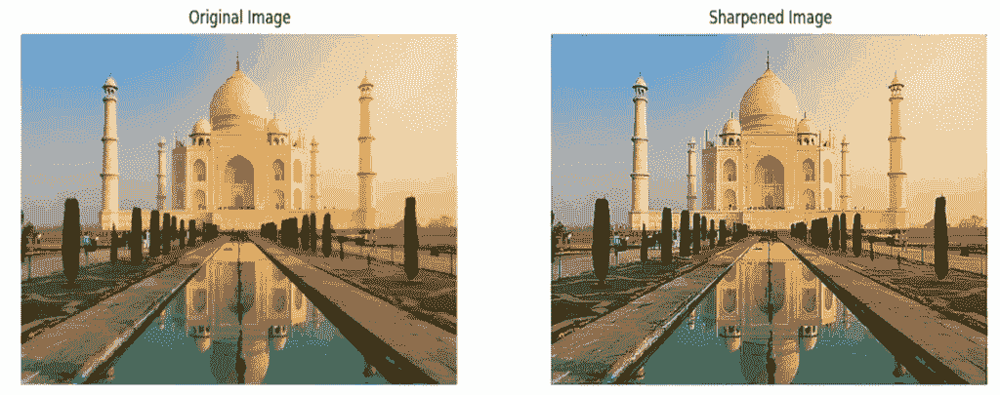
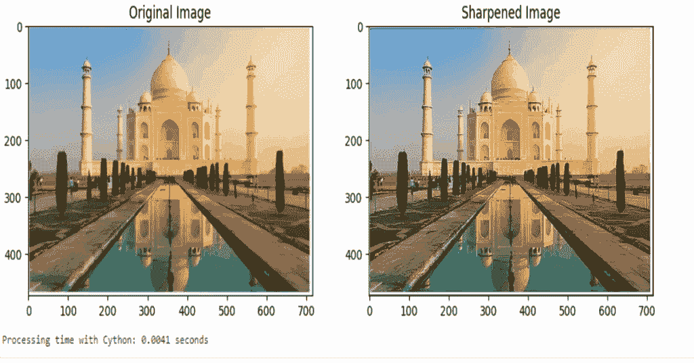

# 使用 Cython 库将 Python 代码运行速度提升至 80 倍

> [`towardsdatascience.com/run-your-python-code-up-to-80x-faster-using-the-cython-library/`](https://towardsdatascience.com/run-your-python-code-up-to-80x-faster-using-the-cython-library/)

<mdspan datatext="el1751951097703" class="mdspan-comment">Python 可能是一个</mdspan>出色的快速原型设计和代码开发语言，但我经常听到人们说使用它的一个问题是执行速度慢。这对于数据科学家和机器学习工程师来说是一个特别的痛点，因为他们经常执行计算密集型操作，如矩阵乘法、梯度下降计算或图像处理。

随着时间的推移，Python 通过引入新的语言特性来解决这些问题，例如多线程或重写现有功能以提高性能，从而在内部进行了演变。然而，Python 使用全局解释器锁（GIL）通常限制了这类努力的进展。

许多外部库也被编写来弥合 Python 和编译语言（如 Java）之间感知的性能差距。其中最常用和最知名的是**NumPy**库。NumPy 是用 C 语言实现的，从头开始设计以支持多个 CPU 核心和超快的数值和数组处理。

NumPy 有替代品，在最近的一篇 TDS 文章中，我介绍了**numexpr**库，在许多用例中，它可以甚至超越 NumPy。如果你有兴趣了解更多，我将在文章末尾包含对该故事的链接。

另一个非常有效的外部库是**Numba**。Numba 利用 Python 的即时（JIT）编译器，在运行时将 Python 和 NumPy 代码的一部分转换为快速的机器代码。它通过利用 LLVM（低级虚拟机）编译器基础设施来设计用于加速数值和科学计算任务。

在这篇文章中，我想讨论另一个运行时增强的外部库，**Cython**。它是性能最出色的 Python 库之一，但同时也是最不被理解和使用的库之一。我认为这至少部分是因为你必须稍微动手，对你的原始代码做一些修改。但如果你遵循我下面将要概述的简单四步计划，你所能获得的性能提升将使这一切变得物有所值。

## 什么是 Cython？

如果你还没有听说过 Cython，它是一种 Python 的超集，旨在通过主要使用 Python 编写的代码提供类似 C 的性能。它允许将 Python 代码转换为 C 代码，然后可以编译成共享库，就像常规 Python 模块一样导入 Python。这个过程实现了 C 的性能优势，同时保持了 Python 的可读性。

我将展示通过将您的代码转换为使用 Cython 可以实现的精确好处，通过检查三个用例并提供将现有 Python 代码转换为所需的四个步骤，以及每个运行的比较时间。

## 设置开发环境

在继续之前，我们应该为编码设置一个单独的开发环境，以保持我们的项目依赖项分离。我将使用 WSL2 Ubuntu for Windows 和 Jupyter Notebook 进行代码开发。我使用 UV 包管理器来设置我的开发环境，但请随意使用适合您的任何工具和方法。

```py
$ uv init cython-test
$ cd cython-test
$ uv venv
$ source .venv/bin/activate
(cython-test) $ uv pip install cython jupyter numpy pillow matplotlib
```

现在，在命令提示符中输入 **‘jupyter notebook’**。您应该在浏览器中看到一个笔记本打开。如果这没有自动发生，您可能会在运行 Jupyter Notebook 命令后看到一屏幕的信息。在那下面，将有一个您应该复制并粘贴到浏览器中以启动 Jupyter Notebook 的 URL。

您的 URL 将与我的不同，但它应该看起来像这样：-

```py
http://127.0.0.1:8888/tree?token=3b9f7bd07b6966b41b68e2350721b2d0b6f388d248cc69d
```

## 示例 1 – 加速 for 循环

在我们开始使用 Cython 之前，让我们从一个常规 Python 函数开始，并记录其运行所需的时间。这将作为我们的基准基准。

我们将编写一个简单的双重 for 循环函数，该函数运行需要几秒钟，然后使用 Cython 加速它，并测量两种方法之间的运行时间差异。

这里是我们的基线标准 Python 代码。

```py
# sum_of_squares.py
import timeit

# Define the standard Python function
def slow_sum_of_squares(n):
    total = 0
    for i in range(n):
        for j in range(n):
            total += i * i + j * j
    return total

# Benchmark the Python function
print("Python function execution time:")
print("timeit:", timeit.timeit(
        lambda: slow_sum_of_squares(20000),
        number=1))
```

在我的系统中，上述代码产生以下输出。

```py
Python function execution time:
13.135973724005453
```

让我们看看 Cython 对其性能提升有多大。

### 有效使用 Cython 的四个步骤计划。

在 Jupyter Notebook 中使用 Cython 提升代码运行时间是一个简单的 4 步过程。

> 如果您不是笔记本用户，请不要担心，因为我会在稍后展示如何将常规 Python .py 文件转换为使用 Cython。

1/ 在笔记本的第一个单元中，通过输入此命令加载 Cython 扩展。

```py
%load_ext Cython
```

2/ 对于任何包含您希望使用 Cython 运行的 Python 代码的后续单元，请在代码之前添加 **%%cython** 魔法命令。例如，

```py
%%cython
def myfunction():
    etc ...
        ...
```

3/ 包含参数的函数定义必须正确地进行类型化。

最后，4/ 所有变量都必须通过使用 **cdef** 指令适当地进行类型化。此外，在合理的地方，使用标准 C 库中的函数（在 Cython 中使用 **from libc.stdlib** 指令可用）。

以我们的原始 Python 代码为例，这是在应用上述所有四个步骤后，使其在笔记本中运行所需的样式。

```py
%%cython
def fast_sum_of_squares(int n):
    cdef int total = 0
    cdef int i, j
    for i in range(n):
        for j in range(n):
            total += i * i + j * j
    return total

import timeit
print("Cython function execution time:")
print("timeit:", timeit.timeit(
        lambda: fast_sum_of_squares(20000),
        number=1))
```

如您所希望看到的，将您的代码转换为现实要比所需的四个程序步骤简单得多。

上述代码的运行时间令人印象深刻。在我的系统中，这个新的 Cython 代码产生以下输出。

```py
Cython function execution time:
0.15829777799808653
```

这是一种超过 80 倍的速度提升。

## 示例 2 — 使用蒙特卡洛计算 π

对于我们的第二个示例，我们将检查一个更复杂的用例，其基础有众多实际应用。

Cython 可以在数值模拟方面显示出显著的性能提升，尤其是在涉及大量计算的情况下，如蒙特卡洛 (MC) 模拟。蒙特卡洛模拟涉及运行许多随机过程的迭代来估计系统的属性。MC 可应用于广泛的研究领域，包括气候和大气科学、计算机图形学、人工智能搜索和定量金融。这几乎总是一个计算密集型的过程。

为了说明，我们将以简化的方式使用蒙特卡洛来计算 Pi 的值。这是一个众所周知的例子，其中我们取一个边长为 1 个单位的正方形，并在其中内嵌一个半径为 1 个单位的四分之一圆，如图所示。



图片由 AI (GPT-4o) 提供

显然，四分之一圆的面积与正方形的面积之比是 (Pi/4)。

因此，如果我们考虑许多位于正方形边界内或其上的随机 (x,y) 点，随着这些点的总数趋向于无穷大，位于或位于四分之一圆内或其上的点的比例趋向于 Pi /4。然后我们乘以这个值以获得 Pi 本身的值。

这里有一些典型的 Python 代码，您可能用来模拟这种情况。

```py
import random
import time

def monte_carlo_pi(num_samples):
    inside_circle = 0
    for _ in range(num_samples):
        x = random.uniform(0, 1)
        y = random.uniform(0, 1)
        if (x**2) + (y**2) <= 1:  
            inside_circle += 1
    return (inside_circle / num_samples) * 4

# Benchmark the standard Python function
num_samples = 100000000

start_time = time.time()
pi_estimate = monte_carlo_pi(num_samples)
end_time = time.time()

print(f"Estimated Pi (Python): {pi_estimate}")
print(f"Execution Time (Python): {end_time - start_time} seconds")
```

运行这个产生了以下计时结果。

```py
Estimated Pi (Python): 3.14197216
Execution Time (Python): 20.67279839515686 seconds
```

现在，这是通过遵循我们的四步流程得到的 Cython 实现。

```py
%%cython
import cython
import random
from libc.stdlib cimport rand, RAND_MAX

@cython.boundscheck(False)
@cython.wraparound(False)
def monte_carlo_pi(int num_samples):
    cdef int inside_circle = 0
    cdef int i
    cdef double x, y

    for i in range(num_samples):
        x = rand() / <double>RAND_MAX
        y = rand() / <double>RAND_MAX
        if (x**2) + (y**2) <= 1:
            inside_circle += 1

    return (inside_circle / num_samples) * 4

import time

num_samples = 100000000

# Benchmark the Cython function
start_time = time.time()
pi_estimate = monte_carlo_pi(num_samples)
end_time = time.time()

print(f"Estimated Pi (Cython): {pi_estimate}")
print(f"Execution Time (Cython): {end_time - start_time} seconds")
```

下面是新的输出结果。

```py
Estimated Pi (Cython): 3.1415012
Execution Time (Cython): 1.9987852573394775 seconds
```

再次强调，这是 Cython 版本相当令人印象深刻的 10 倍速度提升。

在这个代码示例中，我们做了一件事，而在其他示例中没有做，那就是从 C 标准库中导入一些外部库。那就是这一行，

```py
from libc.stdlib cimport rand, RAND_MAX
```

**cimport** 命令是 Cython 关键字，用于导入 C 函数、变量、常量和类型。我们用它来导入与等效的 Python 函数 random.uniform() 相等的优化 C 语言版本。

## 示例 3—图像处理

对于我们的最后一个例子，我们将进行一些图像处理。具体来说，是一些图像卷积，这是图像处理中的一种常见操作。图像卷积有许多应用场景。我们将用它来尝试锐化下面显示的略微模糊的图像。


原始图片由 Yury Taranik 提供（授权自 Shutterstock）

首先，这是常规的 Python 代码。

```py
from PIL import Image
import numpy as np
from scipy.signal import convolve2d
import time
import os
import matplotlib.pyplot as plt

def sharpen_image_color(image):

    # Start timing
    start_time = time.time()

    # Convert image to RGB in case it's not already
    image = image.convert('RGB')

    # Define a sharpening kernel
    kernel = np.array([[0, -1, 0],
                       [-1, 5, -1],
                       [0, -1, 0]])

    # Convert image to numpy array
    image_array = np.array(image)

    # Debugging: Check input values
    print("Input array values: Min =", image_array.min(), "Max =", image_array.max())

    # Prepare an empty array for the sharpened image
    sharpened_array = np.zeros_like(image_array)

    # Apply the convolution kernel to each channel (assuming RGB image)
    for i in range(3):
        channel = image_array[:, :, i]
        # Perform convolution
        convolved_channel = convolve2d(channel, kernel, mode='same', boundary='wrap')

        # Clip values to be in the range [0, 255]
        convolved_channel = np.clip(convolved_channel, 0, 255)

        # Store back in the sharpened array
        sharpened_array[:, :, i] = convolved_channel.astype(np.uint8)

    # Debugging: Check output values
    print("Sharpened array values: Min =", sharpened_array.min(), "Max =", sharpened_array.max())

    # Convert array back to image
    sharpened_image = Image.fromarray(sharpened_array)

    # End timing
    duration = time.time() - start_time
    print(f"Processing time: {duration:.4f} seconds")

    return sharpened_image

# Correct path for WSL2 accessing Windows filesystem
image_path = '/mnt/d/images/taj_mahal.png'

image = Image.open(image_path)

# Sharpen the image
sharpened_image = sharpen_image_color(image)

if sharpened_image:
    # Show using PIL's built-in show method (for debugging)
    #sharpened_image.show(title="Sharpened Image (PIL Show)")

    # Display the original and sharpened images using Matplotlib
    fig, axs = plt.subplots(1, 2, figsize=(15, 7))

    # Original image
    axs[0].imshow(image)
    axs[0].set_title("Original Image")
    axs[0].axis('off')

    # Sharpened image
    axs[1].imshow(sharpened_image)
    axs[1].set_title("Sharpened Image")
    axs[1].axis('off')

    # Show both images side by side
    plt.show()
else:
    print("Failed to generate sharpened image.")
```

输出如下。

```py
Input array values: Min = 0 Max = 255
Sharpened array values: Min = 0 Max = 255
Processing time: 0.1034 seconds
```



图片由作者提供

让我们看看 Cython 是否能击败 0.1034 秒的运行时间。

```py
%%cython
# cython: language_level=3
# distutils: define_macros=NPY_NO_DEPRECATED_API=NPY_1_7_API_VERSION

import numpy as np
cimport numpy as np
import cython

@cython.boundscheck(False)
@cython.wraparound(False)
def sharpen_image_cython(np.ndarray[np.uint8_t, ndim=3] image_array):
    # Define sharpening kernel
    cdef int kernel[3][3]
    kernel[0][0] = 0
    kernel[0][1] = -1
    kernel[0][2] = 0
    kernel[1][0] = -1
    kernel[1][1] = 5
    kernel[1][2] = -1
    kernel[2][0] = 0
    kernel[2][1] = -1
    kernel[2][2] = 0

    # Declare variables outside of loops
    cdef int height = image_array.shape[0]
    cdef int width = image_array.shape[1]
    cdef int channel, i, j, ki, kj
    cdef int value

    # Prepare an empty array for the sharpened image
    cdef np.ndarray[np.uint8_t, ndim=3] sharpened_array = np.zeros_like(image_array)

    # Convolve each channel separately
    for channel in range(3):  # Iterate over RGB channels
        for i in range(1, height - 1):
            for j in range(1, width - 1):
                value = 0  # Reset value at each pixel
                # Apply the kernel
                for ki in range(-1, 2):
                    for kj in range(-1, 2):
                        value += kernel[ki + 1][kj + 1] * image_array[i + ki, j + kj, channel]
                # Clip values to be between 0 and 255
                sharpened_array[i, j, channel] = min(max(value, 0), 255)

    return sharpened_array

# Python part of the code
from PIL import Image
import numpy as np
import time as py_time  # Renaming the Python time module to avoid conflict
import matplotlib.pyplot as plt

# Load the input image
image_path = '/mnt/d/images/taj_mahal.png'
image = Image.open(image_path).convert('RGB')

# Convert the image to a NumPy array
image_array = np.array(image)

# Time the sharpening with Cython
start_time = py_time.time()
sharpened_array = sharpen_image_cython(image_array)
cython_time = py_time.time() - start_time

# Convert back to an image for displaying
sharpened_image = Image.fromarray(sharpened_array)

# Display the original and sharpened image
plt.figure(figsize=(12, 6))
plt.subplot(1, 2, 1)
plt.imshow(image)
plt.title("Original Image")

plt.subplot(1, 2, 2)
plt.imshow(sharpened_image)
plt.title("Sharpened Image")

plt.show()

# Print the time taken for Cython processing
print(f"Processing time with Cython: {cython_time:.4f} seconds")
```

输出如下，



图片由作者提供

两个程序都表现良好，但 Cython 的速度几乎快了 25 倍。

## 那么，在笔记本环境外运行 Cython 呢？

到目前为止，我向你展示的一切都假设你在 Jupyter Notebook 内运行你的代码。我这样做的原因是因为这是介绍 Cython 并快速运行代码的最简单方法。虽然 Notebook 环境在 Python 开发者中非常受欢迎，但大量的 Python 代码仍然包含在常规的 .py 文件中，并通过 Python 命令在终端中运行。

如果这是你主要的编码和运行 Python 脚本的方式，那么 **%load_ext** 和 **%%cython** IPython 魔法命令将不起作用，因为那些命令只被 Jupyter/IPython 所理解。

因此，这里是如何适应我的四个步骤 Cython 转换过程，如果你以常规 Python 脚本运行你的代码。

让我们以我的第一个 **sum_of_squares** 示例来展示这一点。

1/ 创建一个 .pyx 文件而不是使用 %%cython

将你的 Cython 增强代码移动到一个名为，例如：-

sum_of_squares.pyx

```py
# sun_of_squares.pyx
def fast_sum_of_squares(int n):
    cdef int total = 0
    cdef int i, j
    for i in range(n):
        for j in range(n):
            total += i * i + j * j
    return total
```

我们所做的只是移除了 %%cython 指令和计时代码（现在将位于调用函数中）

2/ 创建一个 setup.py 文件来编译你的 .pyx 文件

```py
# setup.py
from setuptools import setup
from Cython.Build import cythonize

setup(
    name="cython-test",
    ext_modules=cythonize("sum_of_squares.pyx", language_level=3),
    py_modules=["sum_of_squares"],  # Explicitly state the module
    zip_safe=False,
)
```

3/ 使用以下命令运行 setup.py 文件，

```py
$ python setup.py build_ext --inplace
running build_ext
copying build/lib.linux-x86_64-cpython-311/sum_of_squares.cpython-311-x86_64-linux-g 
```

4/ 创建一个常规 Python 模块来调用我们的 Cython 代码，如下所示，然后运行它。

```py
# main.py
import time, timeit
from sum_of_squares import fast_sum_of_squares

start = time.time()
result = fast_sum_of_squares(20000)

print("timeit:", timeit.timeit(
        lambda: fast_sum_of_squares(20000),
        number=1))
```

```py
$ python main.py

timeit: 0.14675087109208107
```

## 摘要

希望我已经说服了你使用 Cython 库在代码中的有效性。尽管一开始看起来可能有些复杂，但只要稍加努力，你就可以在运行时间上获得令人难以置信的性能提升，即使是在使用像 NumPy 这样的快速数值库时也是如此。

我提供了一个四步过程，将你的常规 Python 代码转换为使用 Cython 在 Jupyter Notebook 环境中运行。此外，我还解释了在非 Notebook 环境中运行 Cython 代码所需的步骤。

最后，我通过展示将常规 Python 代码转换为使用 Cython 的示例来强化上述内容。

在我展示的三个例子中，我们实现了 80 倍、10 倍和 25 倍的速度提升，这绝对不赖。

* * *

正如承诺的那样，这里有一个 [链接](https://towardsdatascience.com/numexpr-the-faster-than-numpy-library-that-no-ones-heard-of/) 到我之前在 Towards Data Science 上关于利用 numexpr 库加速 Python 代码的文章。
