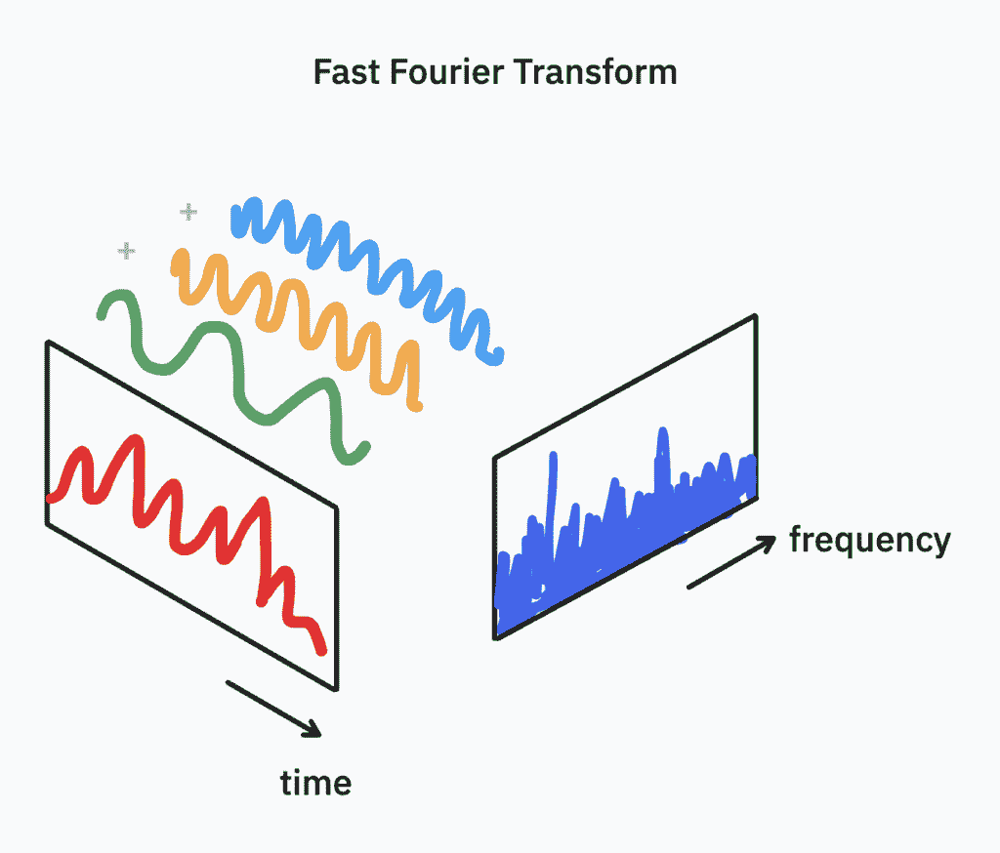
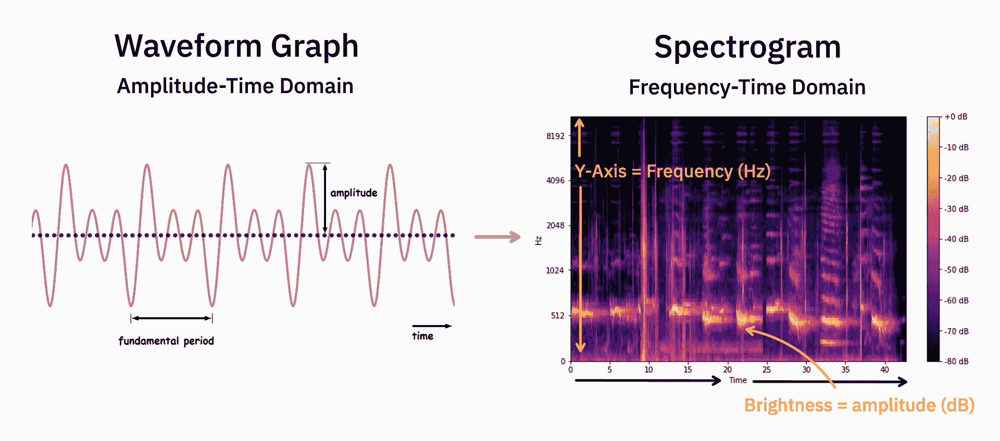
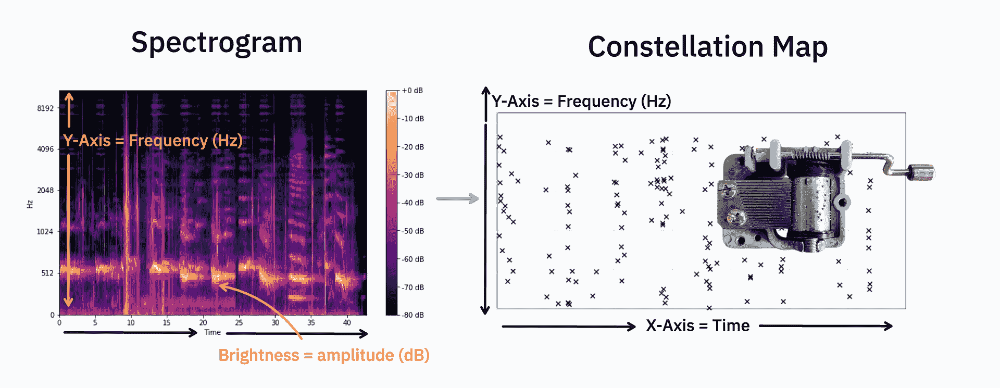
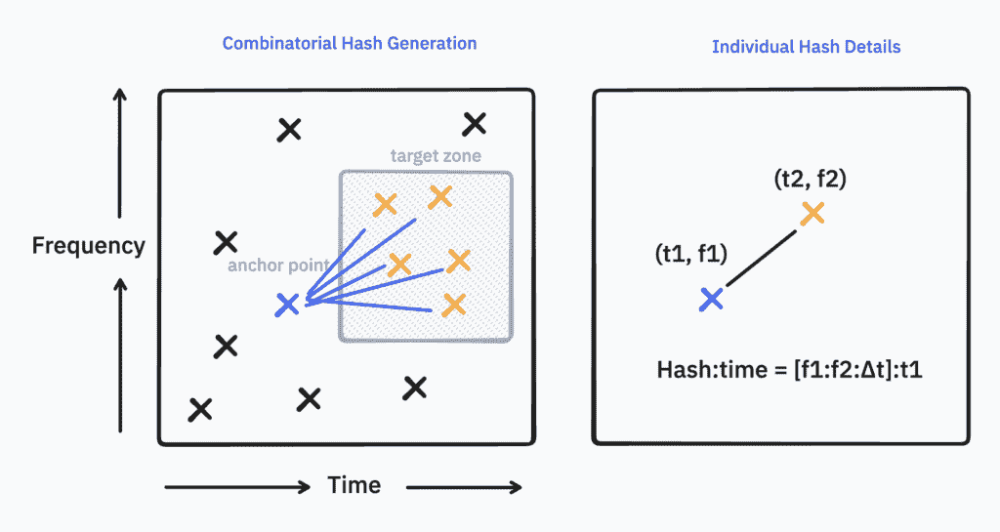
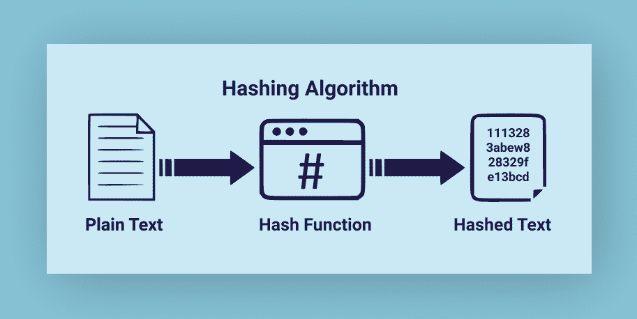
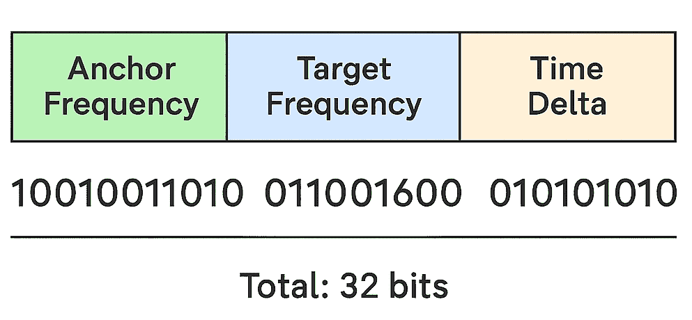
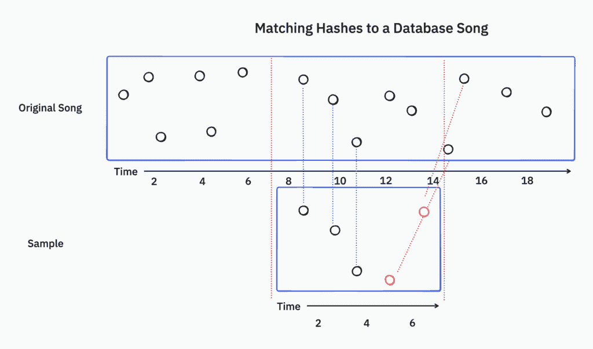

# 五秒指纹：Shazam 即时歌曲 ID 的内部机制

> [`towardsdatascience.com/the-five-second-fingerprint-inside-shazams-instant-song-id/`](https://towardsdatascience.com/the-five-second-fingerprint-inside-shazams-instant-song-id/)

* * *

***本文继续《点击背后的故事》，这是一系列探索日常科技隐藏机制的文章——从 Uber 到 Spotify 再到搜索引擎。我将深入幕后，揭开塑造你数字世界的系统。***

<mdspan datatext="el1751301811205" class="mdspan-comment">我的</mdspan>第一次音乐聆听关系始于 6 岁，通过客厅的 Onkyo 6 碟播放器循环播放专辑。*猫史蒂文斯*，*Groove Armada*，*Sade*。虽然我不知道那首歌的名字，但总是有一首歌我会反复重放。10 年后，这首歌的片段回到了我的记忆中。我在论坛上搜索了“*旧萨克斯风旋律*”，“*关于沙丘的复古歌曲*”，多年来都毫无所获。然后，有一天在大学里，我在朋友 Pegler 的宿舍里，当他播放这首歌时：

那漫长的搜索让我意识到能够找到你喜爱的音乐是多么重要。

* * *

在流媒体和智能助手出现之前，音乐发现依赖于记忆、运气或一个有良好音乐品味的朋友。那首吸引人的副歌可能会消失在虚空中。

那是一个音乐爱好者的奇迹。

几秒钟的声音。一次按键。屏幕上出现一个名字。

Shazam 让音乐变得可识别。

### 起源：2580

Shazam 于 2002 年推出，远在应用程序成为主流之前。当时它的工作方式是这样的：

你可以在手机上拨打**2580#**（仅限英国）。

将你的手机举到扬声器上。

…在沉默中等待…

并收到一条**短信**告诉你歌曲的名称。

这感觉就像魔法。创始团队，Chris Barton，Philip Inghelbrecht，Avery Wang 和 Dhiraj Mukherjee，花费了数年时间建立这个幻象。

为了建立其第一个数据库，[Shazam 雇佣了 30 名年轻的工人](https://www.youtube.com/watch?v=b6xeOLjeKs0&list=LL&index=3&t=185s)进行 18 小时轮班，手动将 10 万张 CD 加载到电脑上，并使用定制软件。由于 CD 不包含元数据，他们不得不手动输入歌曲名称，参考 CD 封面，最终创建了公司的第一个百万级音频指纹——这是一个耗时数月的繁琐过程。

在智能手机或应用程序出现之前，当诺基亚和黑莓无法处理处理或内存需求时，Shazam 必须存活足够长的时间，以便技术能够赶上他们的想法。这是一堂关于市场时机的重要课程。

这篇文章讲述了在点击和标题之间的那一刻发生的事情，即信号处理、哈希、索引和模式匹配，这使得 Shazam 能够听到你难以命名的声音。

* * *

## 算法：音频指纹识别

在 2003 年，Shazam 的联合创始人 Avery Wang[发表了](https://www.ee.columbia.edu/~dpwe/papers/Wang03-shazam.pdf)一个算法的蓝图，该算法至今仍在为应用提供动力。论文的核心思想是：如果人类可以通过叠加声音层来理解音乐，那么机器也可以做到。

让我们来看看 Shazam 是如何将声音分解成机器可以立即识别的东西。

### 1. 捕获音频样本

*它从一次轻敲开始。*

当你按下 Shazam 按钮时，应用会记录你周围 5-10 秒的音频片段。这足以识别大多数歌曲，尽管我们都曾等待过几分钟，手持手机（或在口袋里）等待识别结果。

但是 Shazam 不会存储那段录音。相反，它将其缩减为更小、更智能的东西：一个**指纹**。

### 2. 生成频谱图

在 Shazam 能够识别一首歌之前，它需要理解声音中包含哪些频率以及它们何时出现。为此，它使用一种称为[快速傅里叶变换（FFT）](https://www.sciencedirect.com/topics/engineering/fast-fourier-transform)的数学工具。

**FFT**将音频信号分解为其组成频率，揭示了在任意时刻构成声音的哪些音符或音调。

**为什么这很重要：**波形是脆弱的，对噪声、音高变化和设备压缩敏感。但随时间变化的频率关系保持稳定。这才是关键。

> 如果你在大一学习了数学，你会记得学习[离散傅里叶变换过程](https://www.robots.ox.ac.uk/~sjrob/Teaching/SP/l7.pdf)的艰辛。"快速傅里叶变换（FFT**）是一个更有效的版本，它允许我们将复杂信号分解为其频率分量，就像听到和弦中的所有音符一样。

音乐不是静态的。音符和和声会随时间变化。因此，Shazam 不仅仅运行一次 FFT，而是在信号的较小、重叠的窗口中反复运行。这个过程被称为**短时傅里叶变换（STFT**），它是**频谱图**的基础。

作者图片：快速傅里叶变换可视化

生成的**频谱图**是将声音从**幅度-时间域**（波形）转换到**频率-时间域**的转换。

将其想象成将杂乱的音频波形转换为音乐热图。

与显示声音有多响不同，频谱图显示了**在什么时间**出现了**哪些频率**。

作者图片：使用 FFT 从波形到频谱图的转换可视化

> 频谱图将分析从**幅度-时间域**转换到**频率-时间域**。它在水平轴上显示时间，在垂直轴上显示频率，并使用亮度来表示每个时刻每个频率的幅度（或音量）。这使得您不仅能看到哪些频率存在，还能看到它们的强度如何随时间演变，从而能够识别模式、瞬态事件或信号中的变化，这些在标准时间域波形中是不可见的。
> 
> [频谱图](https://en.wikipedia.org/wiki/Spectrogram)在音频分析、语音处理、地震学以及音乐等领域被广泛使用，为理解信号的时域和频域特性提供了一个强大的工具。

### 3. 从频谱图到星座图

频谱图密集且包含大量数据，无法在数百万首歌曲之间进行比较。Shazam 过滤掉低强度频率，仅留下最响亮的峰值。

这创建了一个星座图，一个随时间变化的突出频率的视觉散点图，类似于乐谱，尽管它让我想起了机械音乐盒。

图片由作者提供：星座图的视觉转换

### 4. 创建音频指纹

现在是魔法时刻，将点转换为签名。

Shazam 将每个锚点（一个主要峰值）与一小段时间窗口内的目标峰值配对，形成一个编码了频率对和时差连接。

这些都变成了哈希元组：

> (anchor_frequency, target_frequency, time_delta)

图片由作者提供：哈希生成过程

#### 什么是哈希？

哈希是数学函数（称为哈希函数）的输出，该函数将输入数据转换成固定长度的数字和/或字符字符串。这是一种将复杂数据转换为简短、唯一标识符的方法。

[哈希](https://www.codecademy.com/resources/blog/what-is-hashing/)在计算机科学和密码学中广泛使用，尤其是在数据查找、验证和索引等任务中。

图片由作者提供：参考此[来源](https://medium.com/nybles/hashing-algorithms-d10171ca2e89)了解哈希

对于 Shazam，一个典型的**哈希值**长度为 32 位，其结构可能如下所示：

+   **10 位**用于锚点频率

+   **10 位**用于目标频率

+   **12 位**用于它们之间的时间差

图片由作者提供：上述哈希示例的视觉展示

这个微小的指纹捕捉了两个声音峰值之间的关系以及它们在时间上的距离，足够强大以识别歌曲，同时又足够小，可以快速传输，即使在低带宽连接上也是如此。

### 5. 与数据库匹配

一旦 Shazam 从你的片段中创建出指纹，它需要快速在其包含数百万首歌曲的数据库中找到匹配项。

尽管 Shazam 不知道你的剪辑来自歌曲的哪个部分——前奏、副歌、桥段——没关系，它寻找哈希对之间的相对时间。这使得系统对输入音频中的时间偏移具有鲁棒性。

图片由作者提供：将匹配的哈希值可视化到数据库中的歌曲

Shazam 会将你的录音的哈希值与数据库进行比较，并识别出匹配度最高的歌曲，即使由于背景噪音不是完全匹配，也能与你的样本最佳匹配的指纹。

#### 如何快速搜索

为了实现这一闪电般的速度，Shazam 使用了一个[**哈希表**](https://www.masaischool.com/blog/understanding-hashmap-data-structure-with-examples/)，这是一种允许近乎即时查找的数据结构。

> 哈希表可以在 O(1)的时间内找到匹配项，这意味着查找时间保持恒定，即使有数百万条条目。
> 
> 相比之下，有序索引（如磁盘上的 B 树）需要 O(log n)的时间，随着数据库的增长，增长速度缓慢。
> 
> 这种时间和空间复杂性的平衡被称为[大 O 表示法](https://medium.com/@DevChy/introduction-to-big-o-notation-time-and-space-complexity-f747ea5bca58)，这是一个我不准备也不愿意教授的理论。请参考计算机科学家。 

### 6. 系统扩展

为了在全球范围内保持这种速度，Shazam 不仅使用快速的数据结构，还优化了数据存储的方式和位置：

+   [数据分片](https://aws.amazon.com/what-is/database-sharding/)数据库——按时间范围、哈希前缀或地理位置划分。

+   将热门分片保留在内存（RAM）中，以便即时访问。

+   将较冷的数据卸载到磁盘，虽然存储速度较慢但成本较低。

+   按地区（例如，美国东部、欧洲、亚洲）分配系统，以确保无论你在哪里都能快速识别。

这种设计支持**每分钟 23,000+次识别**，即使在全球范围内也是如此。

***

## 影响 & 未来应用

显而易见的应用是手机上的音乐发现，但 Shazam 的处理过程还有另一个主要应用。

Shazam 促进**市场洞察**。每次用户标记一首歌时，Shazam 都会收集匿名、地理时间元数据（歌曲在哪里、何时以及被识别的频率）。

标签、艺术家和推广者使用这一点来：

+   在歌曲登上排行榜之前发现突破性的歌曲。

+   识别地区趋势（在洛杉矶之前在东京获得动力的混音）。

+   根据有机吸引力指导营销支出。

与 Spotify 不同，Spotify 使用用户收听行为来优化推荐，而 Shazam 提供人们积极识别的歌曲的实时数据，为音乐行业提供对新兴趋势和热门歌曲的早期洞察。

[**你在做之前，Spotify 听到了什么**]

[音乐推荐的数据科学](https://medium.com/@ashton.gribble/what-spotify-hears-before-you-do-ca7a86be3e20)

在 2017 年 12 月，**苹果公司**以据报道的 **4 亿美元** 收购了 Shazam。据报道，苹果公司使用 Shazam 的数据来增强 Apple Music 的推荐引擎**，**并且唱片公司现在像以前监控 *电台播放量* 一样监控 Shazam 趋势。

照片由 [Rachel Coyne](https://unsplash.com/@rachelcoyne?utm_source=medium&utm_medium=referral) 在 [Unsplash](https://unsplash.com?utm_source=medium&utm_medium=referral) 上提供

在未来，预计将在以下领域发生演变：

+   [**视觉 Shazam**：](https://thenextweb.com/news/shazam-can-now-scan-physical-objects-for-augmented-reality-and-exclusive-video-content) 已经进行试点，将你的摄像头对准物体或艺术品以识别它们，这对于增强现实未来非常有用。

+   **音乐会模式**：在演出中实时识别歌曲并同步到实时歌单。

+   [**超本地趋势**](https://www.digitaltrends.com/mobile/shazam-now-shows-the-worlds-fastest-growing-songs/)**：** 展示“这条街”或“这个场所”正在流行的内容，扩展社区共享的音乐品味。

+   **生成式 AI 集成**：将音频片段与歌词生成、混音建议或视觉伴奏配对。

### 尾声：经久不衰的算法

在技术堆栈不断变化的世界上，一个算法能够保持相关性超过 20 年是罕见的。

但 Shazam 的指纹识别方法不仅经久不衰，而且已经扩展、演变，并成为跨行业音频识别系统的蓝图。

魔法不仅仅是 Shazam 能够识别一首歌。而是它如何做到这一点，将杂乱的声音转化为优雅的数学，并且可靠、即时、全球性地做到这一点。

所以下次当你在一个嘈杂的酒吧里，举起手机对着播放 *Lola Young 的‘Messy’* 的扬声器时，记得：在那水龙头后面是一个美丽的信号处理、哈希和搜索堆栈，设计得如此之好，几乎无需改变。
