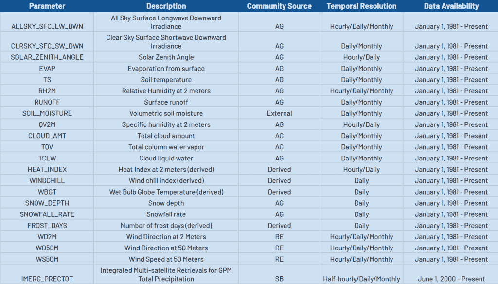
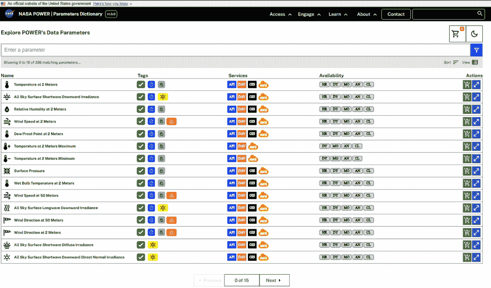
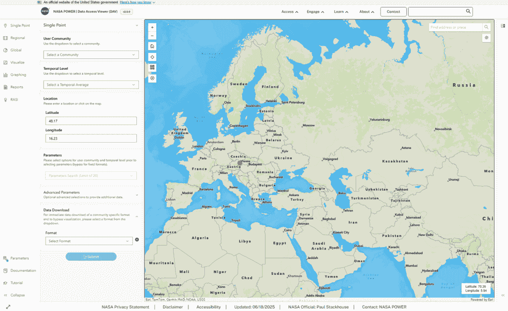
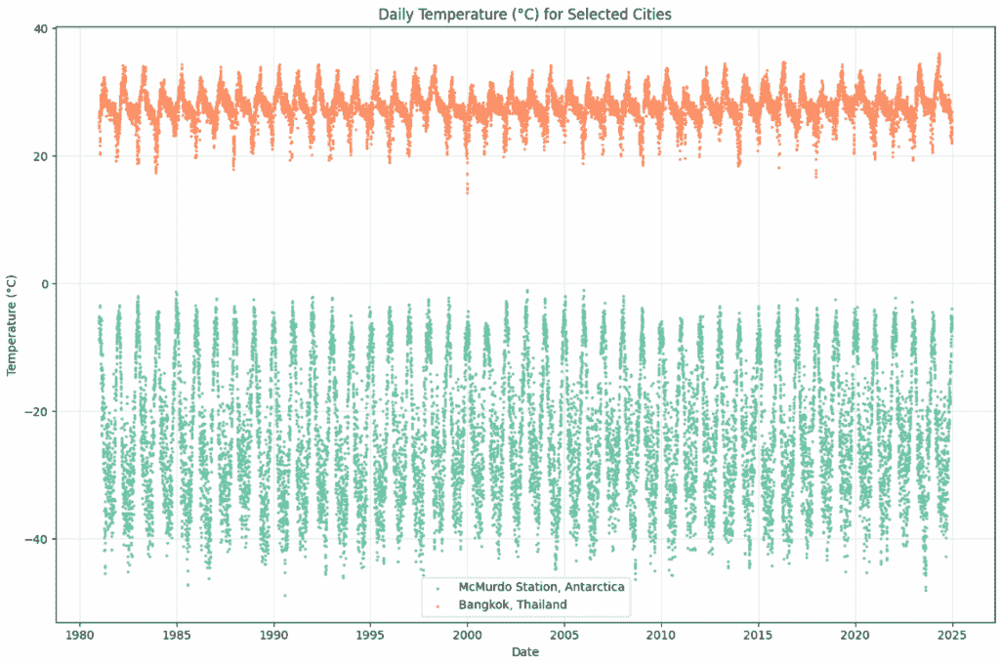
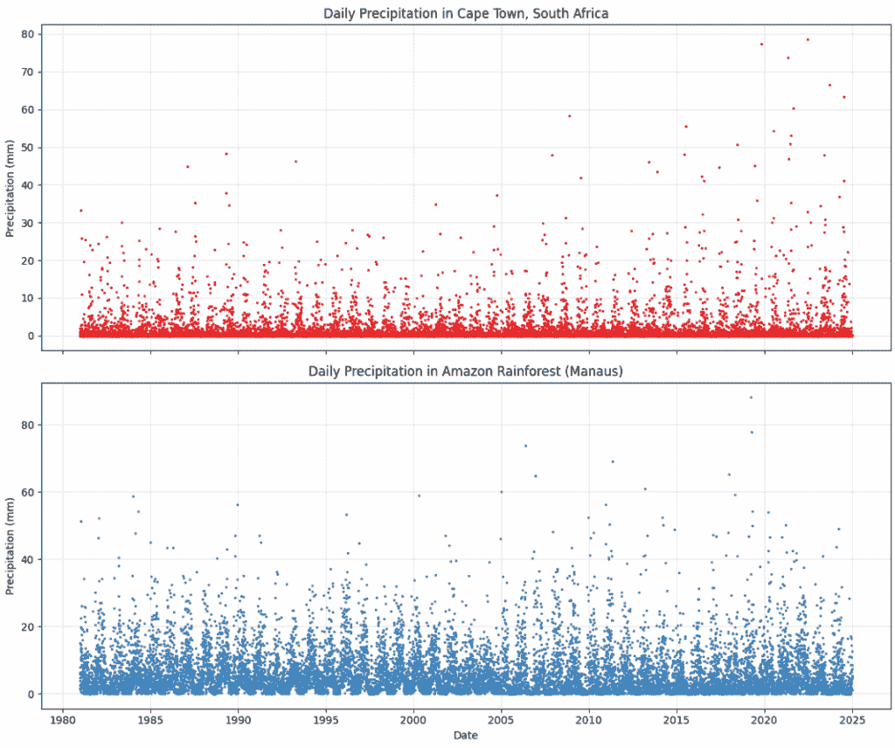
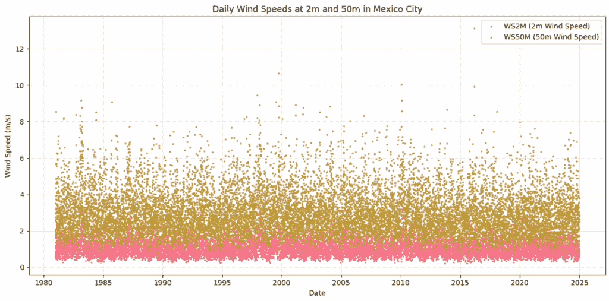
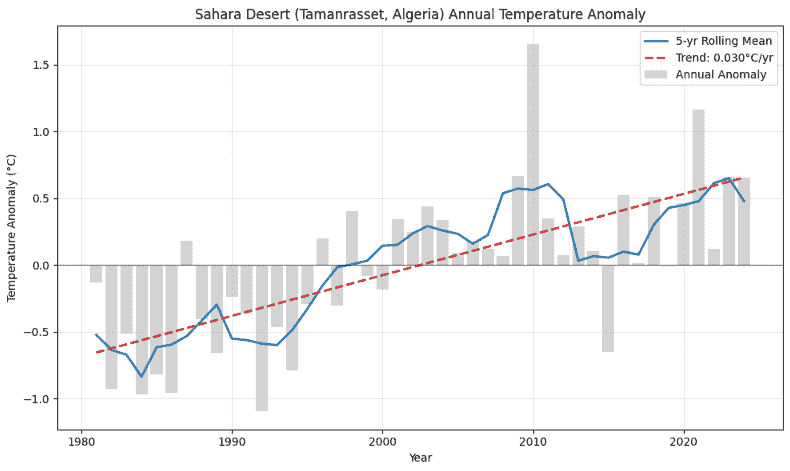
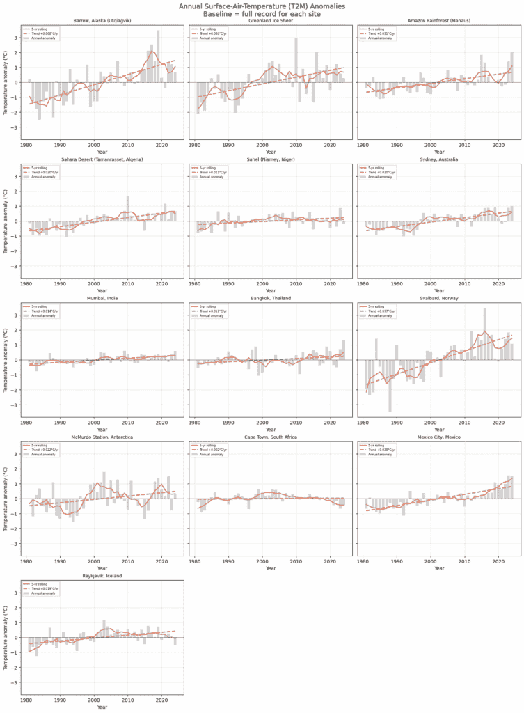

# 如何获取 NASA 的气候数据——以及它是如何助力对抗气候变化的 Pt. 1

> [原文链接](https://towardsdatascience.com/how-to-access-nasas-climate-data-and-how-its-powering-the-fight-against-climate-change-pt-1/)

我想不到一个更重要的数据集。就在今天，我看到了这样的标题：“随着气候变化，热浪变得更加危险。”你不能说我们没有收到警告。在 1988 年，我们看到了这样的标题：“专家告诉参议院全球变暖已经开始。”虽然数据科学在揭示我们可能会超过巴黎协定设定的 1.5°C 目标方面发挥了作用，但我们还有更多可以做的。首先，人们不相信它，但数据是现成的、免费的，而且易于获取。你可以自己检查！所以在这个环节中，我们将这样做。我们还将讨论目前这些数据被用来对抗气候变化影响的令人惊讶和有趣的方式。

但气候数据也同样非常有趣。你可能也见过这样的标题：**“蓝色起源将 6 人送入亚轨道空间再次因天气延误。”**这让你想，如果我们能送人上月球，那么为什么我们无法确定天气？如果“困难”这个词不足以描述，那么一个**多维随机过程**可能更合适。从数据科学的角度来看，这就是我们的黎曼猜想，我们的 P vs NP 问题。我们如何建模和理解气候数据将决定我们在地球上的未来几十年。这是我们可能正在努力解决的最重要的问题。

尽管纽约刚刚经历了一波热浪，但有必要指出，气候变化不仅仅是天气变热。

+   收获失败破坏了全球粮食安全，尤其是在脆弱地区。

+   随着温度升高，由载体传播的疾病扩散到新的地区。

+   大规模灭绝破坏了生态系统，削弱了行星的韧性。

+   海洋酸化破坏了海洋食物链，威胁到渔业和生物多样性。

+   在干旱、污染和过度使用的压力下，淡水供应减少。

但并非一切都已失去；我们将讨论一些使用数据解决这些问题的方法。以下是 NASA 跟踪的一些数据的总结。我们将访问其中的一些参数。



作者图片

## 获取数据

我们将从挑选一些我们将在这系列文章中考察的有趣地点开始。我们需要的只是它们的坐标——在谷歌地图上点击一下即可。我在这里使用了相当多的小数位数，但气象数据源的分辨率是½° x ⅝°，因此没有必要这么精确。

```py
interesting_climate_sites = {
    "Barrow, Alaska (Utqiaġvik)": (71.2906, -156.7886),    # Arctic warming, permafrost melt
    "Greenland Ice Sheet": (72.0000, -40.0000),            # Glacial melt, sea level rise
    "Amazon Rainforest (Manaus)": (-3.1190, -60.0217),     # Carbon sink, deforestation impact
    "Sahara Desert (Tamanrasset, Algeria)": (22.7850, 5.5228),  # Heat extremes, desertification
    "Sahel (Niamey, Niger)": (13.5128, 2.1127),            # Precipitation shifts, droughts
    "Sydney, Australia": (-33.8688, 151.2093),             # Heatwaves, bushfires, El Niño sensitivity
    "Mumbai, India": (19.0760, 72.8777),                   # Monsoon variability, coastal flooding
    "Bangkok, Thailand": (13.7563, 100.5018),              # Sea-level rise, heat + humidity
    "Svalbard, Norway": (78.2232, 15.6469),                # Fastest Arctic warming
    "McMurdo Station, Antarctica": (-77.8419, 166.6863),   # Ice loss, ozone hole proximity
    "Cape Town, South Africa": (-33.9249, 18.4241),        # Water scarcity, shifting rainfall
    "Mexico City, Mexico": (19.4326, -99.1332),            # Air pollution, altitude-driven weather
    "Reykjavík, Iceland": (64.1355, -21.8954),             # Glacial melt, geothermal dynamics
}
```

接下来，让我们选择一些参数。您可以在参数字典 [`power.larc.nasa.gov/parameters/`](https://power.larc.nasa.gov/parameters/) 中浏览它们。



图片由作者提供

您一次只能从一个社区请求，因此我们将参数按社区分组。

```py
community_params = {
    "AG": ["T2M","T2M_MAX","T2M_MIN","WS2M","ALLSKY_SFC_SW_DWN","ALLSKY_SFC_LW_DWN",
           "CLRSKY_SFC_SW_DWN","T2MDEW","T2MWET","PS","RAIN","TS","RH2M","QV2M","CLOUD_AMT"],
    "RE": ["WD2M","WD50M","WS50M"],
    "SB": ["IMERG_PRECTOT"]
}
```

### 这些数据是如何被使用的？

+   **AG = 农业**。农业经济学家通常在作物生长模型（如 DSSAT 和 APSIM）以及灌溉规划器（如 FAO CROPWAT）中使用这个社区。它还用于牲畜热应激评估和建立**食品安全早期预警系统**。这有助于减轻气候变化引起的粮食不安全。这些数据遵循农业经济惯例，允许它们直接被农业决策支持工具摄取。

+   **RE = 可再生能源**。根据名称以及您可以从这里获取风速数据的事实，您可能能够猜出它的用途。这些数据主要用于预测长期能源产量。风力涡轮机的风速，太阳能农场的太阳辐射。这些数据可以输入到 PVsyst、NREL-SAM 和 WindPRO 中，以估算年度能源产量和成本。这些数据支持从屋顶阵列设计到国家清洁能源目标的一切。

+   **SB = 可持续建筑**。建筑师和暖通空调工程师利用这些数据来确保他们的建筑符合能源性能规范，如 IECC 或 ASHRAE 90.1。它可以直接放入 EnergyPlus、OpenStudio、RETScreen 或 LEED/ASHRAE 合规计算器中，以验证建筑是否符合规范。

现在我们选择开始和结束日期。

```py
start_date = "19810101"
end_date   = "20241231"
```

为了使 API 调用可重复，我们使用一个函数。我们将处理每日数据，但如果您更喜欢年度、月度或甚至每小时数据，只需更改 URL 到

…/temporal/{resolution}/point.

```py
import requests
import pandas as pd

def get_nasa_power_data(lat, lon, parameters, community, start, end):
    """
    Fetch daily data from NASA POWER API for given parameters and location.
    Dates must be in YYYYMMDD format (e.g., "20100101", "20201231").
    """
    url = "https://power.larc.nasa.gov/api/temporal/daily/point"
    params = {
        "parameters": ",".join(parameters),
        "community": community,
        "latitude": lat,
        "longitude": lon,
        "start": start,
        "end": end,
        "format": "JSON"
    }
    response = requests.get(url, params=params)
    data = response.json()

    if "properties" not in data:
        print(f"Error fetching {community} data for lat={lat}, lon={lon}: {data}")
        return pd.DataFrame()

    # Build one DataFrame per parameter, then combine
    param_data = data["properties"]["parameter"]
    dfs = [
        pd.DataFrame.from_dict(values, orient="index", columns=[param])
        for param, values in param_data.items()
    ]
    df_combined = pd.concat(dfs, axis=1)
    df_combined.index.name = "Date"
    return df_combined.sort_index().astype(float)
```

这个函数从我们指定的社区检索我们请求的参数。它还将 JSON 转换为数据框。每个响应都包含一个属性键——如果它缺失，我们会打印错误信息。

让我们在循环中调用这个函数，以获取所有位置的资料。

```py
all_data = {}
for city, (lat, lon) in interesting_climate_sites.items():
    print(f"Fetching daily data for {city}...")
    city_data = {}
    for community, params in community_params.items():
        df = get_nasa_power_data(lat, lon, params, community, start_date, end_date)
        city_data[community] = df
    all_data[city] = city_data
```

目前，我们的数据是一个字典，其值也是字典。它看起来像这样：


这使得使用数据变得复杂。接下来，我们将这些数据合并到一个数据框中。我们通过数据连接然后拼接。由于没有缺失值，内部连接会产生相同的结果。

```py
# 1) For each city, join its communities on the date index
city_dfs = {
    city: comms["AG"]
                .join(comms["RE"], how="outer")
                .join(comms["SB"], how="outer")
    for city, comms in all_data.items()
}

# 2) Concatenate into one MultiIndexed DF: index = (City, Date)
combined_df = pd.concat(city_dfs, names=["City", "Date"])

# 3) Reset the index so City and Date become columns
combined_df = combined_df.reset_index()

# 4) Bring latitude/longitude in as columns
coords = pd.DataFrame.from_dict(
    interesting_climate_sites, orient="index", columns=["Latitude", "Longitude"]
).reset_index().rename(columns={"index": "City"})

combined_df = combined_df.merge(coords, on="City", how="left")

# then save into your Drive folder
combined_df.to_csv('/content/drive/MyDrive/climate_data.csv', index=False)
```

如果您一天编程累了，您也可以使用他们的**数据访问工具**。只需在地图上的任何地方点击以检索数据。这里我点击了威尼斯。然后只需选择一个社区、时间平均值和您首选的文件类型，CSV、JSON、ASCII、NETCDF，然后提交。几个点击后，您就可以获取世界上所有的天气数据。

[`power.larc.nasa.gov/data-access-viewer`](https://power.larc.nasa.gov/data-access-viewer)



图片由作者提供

### 合理性检查

现在，让我们进行快速合理性检查，以验证我们所拥有的数据是否合理。

```py
import matplotlib.pyplot as plt
import seaborn as sns # Import seaborn

# Load data
climate_df = pd.read_csv('/content/drive/MyDrive/TDS/Climate/climate_data.csv')
climate_df['Date'] = pd.to_datetime(climate_df['Date'].astype(str), format='%Y%m%d')

# Filter for the specified cities
selected_cities = [
    'McMurdo Station, Antarctica',
    'Bangkok, Thailand',
]
df_selected_cities = climate_df[climate_df['City'].isin(selected_cities)].copy()

# Create a scatter plot with different colors for each city
plt.figure(figsize=(12, 8))

# Use a colormap for more aesthetic colors
colors = sns.color_palette("Set2", len(selected_cities)) # Using a seaborn color palette

for i, city in enumerate(selected_cities):
    df_city = df_selected_cities[df_selected_cities['City'] == city]
    plt.scatter(df_city['Date'], df_city['T2M'], label=city, s=2, color=colors[i]) # Using T2M for temperature and smaller dots

plt.xlabel('Date')
plt.ylabel('Temperature (°C)')
plt.title('Daily Temperature (°C) for Selected Cities')
plt.legend()
plt.grid(alpha=0.3)
plt.tight_layout()
plt.show()
```

是的，曼谷的气温比北极要高得多。



图片由作者提供

```py
# Filter for the specified cities
selected_cities = [
    'Cape Town, South Africa',
    'Amazon Rainforest (Manaus)',
]
df_selected_cities = climate_df[climate_df['City'].isin(selected_cities)].copy()

# Set up the color palette
colors = sns.color_palette("Set1", len(selected_cities))

# Create vertically stacked subplots
fig, axes = plt.subplots(nrows=2, ncols=1, figsize=(12, 10), sharex=True)

for i, city in enumerate(selected_cities):
    df_city = df_selected_cities[df_selected_cities['City'] == city]
    axes[i].scatter(df_city['Date'], df_city['PRECTOTCORR'], s=2, color=colors[i])
    axes[i].set_title(f'Daily Precipitation in {city}')
    axes[i].set_ylabel('Precipitation (mm)')
    axes[i].grid(alpha=0.3)

# Label x-axis only on the bottom subplot
axes[-1].set_xlabel('Date')

plt.tight_layout()
plt.show()
```

是的，亚马逊雨林比南非的降雨量更多。

南非经历干旱，这对农业部门造成了重大负担。



图片由作者提供

```py
# Filter for Mexico City
df_mexico = climate_df[climate_df['City'] == 'Mexico City, Mexico'].copy()

# Create the plot
plt.figure(figsize=(12, 6))
sns.set_palette("husl")

plt.scatter(df_mexico['Date'], df_mexico['WS2M'], s=2, label='WS2M (2m Wind Speed)')
plt.scatter(df_mexico['Date'], df_mexico['WS50M'], s=2, label='WS50M (50m Wind Speed)')

plt.xlabel('Date')
plt.ylabel('Wind Speed (m/s)')
plt.title('Daily Wind Speeds at 2m and 50m in Mexico City')
plt.legend()
plt.grid(alpha=0.3)
plt.tight_layout()
plt.show()
```

是的，50 米处的风速比 2 米处的风速快得多。

通常情况下，越高风速越快。在飞行高度，风速可以达到每小时 200 公里。直到你达到 10 万米的太空。



图片由作者提供

我们将在接下来的章节中更详细地研究这些数据。

### 正在变暖

我们在多伦多经历了一场热浪。根据我空调的声音，我觉得它差点就坏了。但在温度图表中，你需要仔细观察才能看出它们在上升。这是因为存在季节性和显著的变异性。当我们查看年平均值时，事情就变得清晰了。我们将特定年份的平均值与基线之间的差异称为异常。基线是 1981-2024 年的平均温度，然后我们可以看到，近年来的年平均值显著高于基线，这主要是由于早年较冷的温度。反之亦然；由于近年来的高温，早期的年平均值显著低于基线。

在这里，所有这些技术文章中，标题如“**语法作为可注射物：自然语言处理（NLP）的特洛伊木马”**。我希望你们不会因为简单的线性回归而感到失望。但仅此就足以表明气温正在上升。然而，人们并不相信。

```py
# 1) Filter for Sahara Desert and exclude 2024
city = 'Sahara Desert (Tamanrasset, Algeria)'
df = (
    climate_df
    .loc[climate_df['City'] == city]
    .set_index('Date')
    .sort_index()
)

# 2) Compute annual mean & anomaly
annual = df['T2M'].resample('Y').mean()
baseline = annual.mean()
anomaly = annual - baseline

# 3) 5-year rolling mean
roll5 = anomaly.rolling(window=5, center=True, min_periods=3).mean()

# 4) Linear trend
years = anomaly.index.year
slope, intercept = np.polyfit(years, anomaly.values, 1)
trend = slope * years + intercept

# 5) Plot
plt.figure(figsize=(10, 6))
plt.bar(years, anomaly, color='lightgray', label='Annual Anomaly')
plt.plot(years, roll5, color='C0', linewidth=2, label='5-yr Rolling Mean')
plt.plot(years, trend, color='C3', linestyle='--', linewidth=2,
         label=f'Trend: {slope:.3f}°C/yr')
plt.axhline(0, color='k', linewidth=0.8, alpha=0.6)

plt.xlabel('Year')
plt.ylabel('Temperature Anomaly (°C)')
plt.title(f'{city} Annual Temperature Anomaly')
plt.legend()
plt.grid(alpha=0.3)
plt.tight_layout()
plt.show()
```



图片由作者提供

撒哈拉沙漠每年气温上升 0.03°C。这是世界上气温最高的沙漠。我们甚至可以检查我们挑选的每一个地点，看看是否有一个地方有负增长趋势。



图片由作者提供

所以，是的，气温正在上升。

## 专注于树木而忽略了森林

美国宇航局将数据公开的主要原因是为了对抗气候变化的影响。我们提到了建模作物产量、可再生能源和可持续建筑合规性。然而，还有其他方法可以利用数据以科学和数学为基础的方式应对气候变化。如果你对这个话题感兴趣，Luis Seco 的这段视频涵盖了我在这篇文章中没有涉及到的内容，比如

+   碳交易和碳价

+   预测性生物量工具优化植树

+   肯尼亚的饮用水安全

+   排放的社会经济成本

+   森林控制燃烧

我希望你们能和我一起踏上这段旅程。在下一集中，我们将讨论如何使用**微分方程**来模拟气候。尽管正在采取许多措施来应对气候变化，但之前列出的影响并不全面。

+   冰川融化破坏了全球气候调节，并加速了海平面上升。

+   气候相关损害通过不断上升的基础设施和医疗保健成本削弱了经济。

+   气候难民数量增加，边境压力加剧，并推动地缘政治不稳定。

+   海平面持续上升，沿海城市面临淹没的威胁

+   极端天气事件打破记录，迫使数百万人流离失所。

但有噪音，也有信号，它们可以被区分开来。


* * *

我的下一篇文章：

Tallarico, M. H. (2025, 7 月 29 日). 物理信息神经网络用于逆偏微分方程问题：使用 DeepXDE 求解热方程. Towards Data Science. [链接](https://towardsdatascience.com/physics-informed-neural-networks-for-inverse-pde-problems/). [谷歌学术](https://scholar.google.com/citations?view_op=view_citation&hl=en&user=uCZbo_kAAAAJ&citation_for_view=uCZbo_kAAAAJ:d1gkVwhDpl0C).

我的上一篇文章：

Tallarico, M. H. (2025, 6 月 2 日). 语法作为一种注入剂：NLP 的特洛伊木马：机器如何理解句子结构：组合范畴语法. Towards Data Science. [链接](https://towardsdatascience.com/grammar-as-a-trojan-horse-to-nlp-and-computer-science/). [谷歌学术](https://scholar.google.com/citations?view_op=view_citation&hl=en&user=uCZbo_kAAAAJ&citation_for_view=uCZbo_kAAAAJ:zYLM7Y9cAGgC).

## 来源

+   气候变化影响 | 国家海洋和大气管理局. (n.d.). https://www.noaa.gov/education/resource-collections/climate/climate-change-impacts

+   Freedman, A. (2025, 6 月 23 日). *随着气候变化，热浪变得越来越危险——我们可能还在低估它们*。 CNN. https://www.cnn.com/2025/06/23/climate/heat-wave-global-warming-links

+   *全球气候预测显示，未来 5 年预计温度将保持在或接近历史最高水平*。 世界气象组织. (2025, 5 月 26 日). https://wmo.int/news/media-centre/global-climate-predictions-show-temperatures-expected-remain-or-near-record-levels-coming-5-years

+   *全球变暖已经开始，专家告诉参议院（发表于 1988 年）*。[《纽约时报》](https://web.archive.org/web/20201202103915/https:/www.nytimes.com/1988/06/24/us/global-warming-has-begun-expert-tells-senate.html) (1988 年 6 月 24 日). https://web.archive.org/web/20201202103915/https:/www.nytimes.com/1988/06/24/us/global-warming-has-begun-expert-tells-senate.html

+   NASA. (未注明日期). *NASA LARC 功率项目*. NASA. https://power.larc.nasa.gov/

+   威尔，M. (2025 年 6 月 20 日). *Blue Origin 将于 6 月 29 日发射 6 人进入亚轨道空间，因天气延误*。[Space](https://www.space.com/space-exploration/private-spaceflight/watch-blue-origin-launch-6-people-to-suborbital-space-on-june-21)

[代码在此处可用](https://github.com/marco-hening-tallarico/Climate_1)

* * *

[网站](https://marcoheningtallarico.com/) | [LinkedIn](https://www.linkedin.com/in/marco-hening-tallarico/) | [GitHub](https://github.com/marco-hening-tallarico?tab=repositories)


作者
