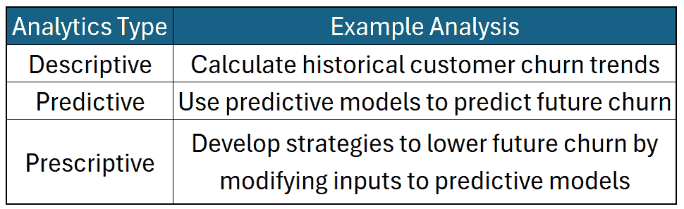
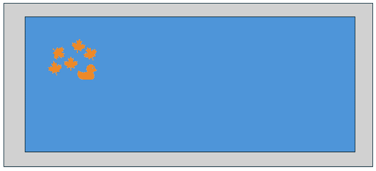
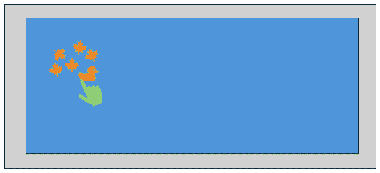

# 规范性建模做出因果赌注——无论你是否知道！

> [规范性建模做出因果赌注——无论你是否知道](https://towardsdatascience.com/prescriptive-modeling-makes-causal-bets-whether-you-know-it-or-not/)

<mdspan class="mdspan-comment is-selected" datatext="el1751308538416">规范性</mdspan>建模是分析价值的顶峰。它不仅关注已经发生的事情，甚至不关注*将要发生的事情*——它通过告诉我们应该做什么来改变*将要发生的事情*，将分析推向了更高的层次。然而，为了利用这种额外的规范性力量，我们必须承担一个额外的假设……一个因果假设。天真从业者可能没有意识到，从预测性建模转向规范性建模会带来这个隐伏的假设。我搜索了“规范性分析”，并查找了前十篇文章中的“因果”一词。不出所料（但令我失望的是），我没有找到任何相关内容。我放宽了搜索词的特定性，尝试了“假设”——这让我感到惊讶，同样没有找到任何相关内容！对我来说，这清楚地表明，这是规范性建模中一个教学不足的组成部分。让我们来解决这个问题！

> 当你使用规范性建模时，你正在做出因果赌注，无论你是否知道。而且据我所见，这一点在讨论这个话题时被严重忽视了。

到这篇文章结束时，你将清楚地了解为什么规范性建模有因果假设，以及你如何判断你的模型/方法是否符合这些假设。我们将通过以下主题来达到这个目标：

1.  规范性建模的简要概述

1.  为什么规范性建模有因果假设？

1.  我们如何知道我们是否满足了因果假设？

## 什么是规范性建模？

在我们走得太远之前，我想说，这不是一篇关于规范性分析的文章——关于这一点，其他地方有大量的信息。这部分将是一个快速概述，作为对已经对这一主题至少有些熟悉的读者的复习。

有一个广为人知的三个分析类型的层次结构：（1）描述性分析，（2）预测性分析，和（3）规范性分析。

**描述性分析**关注数据中的属性和质量。它计算趋势、平均值、中位数、标准差等。描述性分析并不试图对数据做出比经验观察更多的说明。通常，描述性分析出现在仪表板和报告中。它提供的价值在于向用户告知数据中的关键统计数据。

**预测分析**在描述性分析的基础上又前进了一步。它不是总结数据，而是在数据内部寻找关系。它试图在这些关系中分离噪声和信号，以找到潜在的、可推广的模式。从这些模式中，它可以对未见数据做出预测。它比描述性分析更进一步，因为它提供了对未见数据的见解，而不仅仅是立即观察到的数据。

**规范性分析**在预测分析的基础上又迈出一步。规范性分析使用通过预测分析创建的模型来推荐智能或最佳行动。通常，规范性分析会在预测模型中运行模拟，并推荐具有最理想结果的策略。

让我们通过一个例子来更好地说明预测分析和规范性分析之间的区别。想象你是一家销售在线出版物订阅的公司中的数据科学家。你已经开发了一个模型，该模型预测了客户在特定月份取消订阅的概率。该模型有多个输入，包括发送给客户的促销活动。到目前为止，你只进行了预测建模。有一天，你突然想到，你应该将不同的折扣输入到你的预测模型中，观察折扣对客户流失率的影响，并推荐那些在折扣成本和增加客户保留率效益之间取得最佳平衡的折扣。随着你从预测转向干预的关注点，你已经进入了规范性分析领域！

下面是针对每个分析级别的客户流失模型可能的分析示例：

客户流失分析方法的示例 - 作者图片

现在我们已经对三种类型的分析有了新的认识，让我们深入了解规范性分析中独特的因果假设。

## 规范性分析中的因果假设

从预测分析转向规范性分析感觉直观且自然。你有一个模型，使用特征来预测一个重要的结果，其中一些特征在你可控范围内。因此，模拟操作这些特征以驱动达到期望的结果是有意义的。但至少对初级模型师来说，这样做如果模型没有捕捉到目标变量和你要改变的特征之间的因果关系，就会进入一个危险的空间，这一点并不直观。

我们首先用一个涉及橡皮鸭、树叶和游泳池的简单例子来展示这种危险。然后，我们将转向由于在不需要的情况下进行因果赌注而产生的现实世界失败。

**树叶、一个游泳池和一个橡皮鸭**

您喜欢在泳池边的外面度过时间。作为一个敏锐的环境观察者，您注意到您最喜欢的泳池玩具——一个橡皮鸭——通常与从附近树上落下的树叶在泳池的同一部分。

叶子和泳池玩具通常在泳池的同一部分——图片由作者提供

最终，您决定是时候清理泳池里的树叶了。泳池有一个特定的角落最容易到达，您希望所有的树叶都在这个区域，这样您就可以更容易地收集和丢弃它们。鉴于您创建的模型——橡皮鸭与树叶在同一区域——您决定把玩具移到角落，并愉快地观察树叶跟随鸭子。然后您就可以轻松地捞起来，继续享受新清理过的泳池。

您做出改变，站在泳池角落，正对着橡皮鸭，手里拿着网，感觉像个傻瓜，对吧？而树叶却固执地停留在原地。您犯了一个可怕的错误，在模型没有通过因果假设的情况下使用了规范性分析！

移动的橡皮鸭不会移动树叶——图片由作者提供

感到困惑，您再次看向泳池。您注意到来自泳池喷嘴的水中有一丝扰动。然后您决定重新思考您的预测建模方法，使用喷嘴的角度来预测树叶的位置，而不是橡皮鸭。使用这个新模型，您估计需要如何配置喷嘴才能让树叶飘到您最喜欢的角落。您调整了喷嘴，这次您成功了！树叶飘到了角落，您把它们移除，继续您的日子，成为一个更聪明的数据科学家！

这是一个奇特但很好的例子，让我指出几个要点。

+   橡皮鸭是一个经典的“混淆”变量。它也受到泳池喷嘴的影响，对树叶的位置没有影响。

+   橡皮鸭和泳池喷嘴模型都做出了准确的预测——如果我们只想知道树叶在哪里，它们可以同样好。

+   破坏橡皮鸭模型的原因与模型本身无关，而与您如何*使用*模型有关。因果假设没有得到证实，但您还是继续前进！

我希望您喜欢这个有趣的例子——让我们过渡到谈论现实世界的例子。

**Shark Tank 投资提案**

如果您还没有看过，Shark Tank 是一个节目，企业家向富有的投资者（被称为“鲨鱼”）推销他们的商业想法，希望获得投资资金。

我最近在观看《鲨鱼坦克》的重播（就像人们通常会做的那样）——该集中（第 10 季第 15 集）的一个提案是为一家名为 GoalSetter 的公司。GoalSetter 是一家允许父母在孩子的名义下开设“迷你”银行账户的公司，家人和朋友可以向这些账户存款。这个想法是，而不是给孩子玩具或礼品卡作为礼物，人们可以给存款证书，孩子们可以存钱购买他们想要的东西（“目标”）。

我对商业理念没有异议，但在演示中，那位企业家提出了以下主张：

> …拥有以自己名义开设的储蓄账户的孩子在成年早期更有可能上大学，并且拥有股票的可能性是其他孩子的六倍和四倍…

假设这个统计数据是真实的，这个陈述本身是很好且合理的。我们可以查看数据，并看到孩子拥有以自己名义开设的银行账户与上大学和/或投资之间存在关联（描述性）。我们甚至可以开发一个模型，通过使用以孩子名义开设的银行账户作为预测因子来预测孩子是否会上大学或拥有股票（预测性）。但这并不能告诉我们任何关于因果关系的事情！投资建议中包含了这个微妙的规范性信息——“给你的孩子开设一个目标设定账户，他们更有可能上大学并拥有股票。”虽然与上面的引言在语义上相似，但这两个陈述却相去甚远！一个是基于无假设的统计事实的陈述，而另一个则是包含了一个**巨大**的因果假设的规范性陈述！我希望你现在脑海中响起了混杂变量的警报。似乎家庭收入、父母的金融素养和文化影响与孩子开设银行账户的概率以及孩子上大学的机会都有关系。给一个孩子随机开设银行账户似乎不太可能增加他们上大学的可能性。这就像移动池塘里的鸭子，并期望树叶跟着移动！

**阅读是基础计划**

在 20 世纪 60 年代，有一个由政府资助的项目叫做“阅读是基础（RIF）”。这个项目的部分内容是向低收入家庭提供书籍。目标是提高这些家庭的识字率。策略部分基于这样一个观点：拥有更多书籍的家庭有更多有文化的孩子。你可能知道我们刚才讨论的 Shark Tank 例子中我要去哪里了。观察到拥有大量书籍的家庭有更多有文化的孩子是描述性的。这并没有什么错。但是，当你开始提出建议时，你就离开了描述性空间，跳进了规范性世界——正如我们已经确立的，这伴随着因果假设。将书籍放入家庭假设书籍导致了识字率！苏珊·纽曼的研究发现，在没有额外资源的情况下，将书籍放入家庭不足以提高识字率¹。

当然，给那些买不起书的孩子提供书籍是好事——你不需要因果假设来做好事 😊。但是，如果你有提高识字率的具体目标，你最好评估你行动背后的因果假设的有效性，以实现你期望的结果！

## 我们如何知道是否满足了因果假设？

我们已经确定规范性建模需要因果假设（如此之多，你可能已经筋疲力尽了！）但我们是怎样知道我们的模型满足了假设的呢？在思考因果性和数据时，我发现将我的想法在实验数据和观察数据之间分开是有帮助的。让我们看看我们如何能够对因果假设感到满意（或者至少“可以”），使用这两种类型的数据。

**实验数据**

如果你能够获得用于你的规范性建模的*良好*实验数据，你非常幸运！实验数据是建立因果关系的黄金标准。为什么这是这种情况的细节超出了本文的范围，但我会说，在精心设计的实验中对处理的随机分配处理了混杂因素，因此你不必担心它们会破坏你的因果假设。

我们可以在良好实验的输出上训练预测模型——即，良好的实验数据。在这种情况下，数据生成过程在目标变量和随机分配处理的变量之间满足了因果识别条件。我想强调的是，只有实验中随机分配的变量才能基于实验本身符合因果陈述。其他变量的因果效应（称为协变量）可能被正确捕捉，也可能没有被正确捕捉。例如，想象我们进行了一个实验，随机向多株植物提供不同水平的氮、磷和钾，并测量了植物的生长。从这个实验数据中，我们创建了下面的模型：

植物实验的示例模型——图片由作者提供

由于氮、磷和钾是实验中随机分配的处理，我们可以得出结论，beta 1 到 3 估计了植物生长的因果关系。阳光照射不是随机分配的，这阻止了我们通过实验数据的力量来声称因果关系。这并不是说因果推断可能不适用于协变量，但这个推断将需要额外的假设，我们将在接下来的观察数据部分中讨论。

我在谈论实验数据时多次使用了限定词**好的**。什么是**好的**实验？我将概述两个我见过的常见问题，这些问题会阻止实验产生好的数据，但还有更多可能出错的地方。如果你想深入了解实验设计，你应该阅读相关资料。

**执行错误**：这是实验中最常见的问题之一。几年前，我曾负责一个项目，其中进行了一项实验，但有关哪些受试者接受了哪些处理的某些数据被混淆了——数据无法使用！如果存在重大的执行错误，你可能无法从实验数据中得出有效的因果结论。

*低效实验*：这可能由多种原因造成——例如，可能没有足够的信号来自处理，或者实验单位可能太少。即使执行完美，低效的研究可能无法揭示真实效果，这可能会阻止你达到用于规范性建模所需的因果结论。

**观察数据**

使用观察数据满足因果假设比使用实验数据更困难、更有风险且更具争议性。在创建实验数据中起关键作用的随机化之所以强大，是因为它消除了由**所有**混杂变量引起的问题——已知的和未知的，观察到的和未观察到的。在观察数据中，我们没有这种极其有用的能力。

理论上，如果我们能够**正确地**控制所有混杂变量，我们仍然可以使用观察数据做出因果推断。尽管有些人可能不同意这个说法，但原则上它是被广泛接受的。真正的挑战在于应用。

为了正确控制混杂变量，我们需要（1）对该变量有高质量的数据，以及（2）正确地模拟混杂变量与我们的目标变量之间的关系。为每个已知的混杂变量做这件事是困难的，但这还不是最糟糕的部分。最糟糕的部分是，你永远无法确定你是否已经考虑了所有混杂变量。即使有强大的领域知识，也存在一个未知的混杂变量“存在”的可能性。我们能做的最好的事情是包括我们所能想到的所有混杂变量，然后依靠所谓的“无未测量混杂变量”假设来估计因果关系。

即使我们不能确定我们已经考虑了所有混杂变量，使用观察数据进行建模在规范性分析中仍然可以增加大量价值。在使用观察数据时，我认为因果假设是在程度上而不是二元方式上得到满足的。随着我们考虑更多的混杂变量，我们更好地捕捉因果效应。即使我们错过了一些混杂变量，模型仍然可能增加价值。只要混杂变量对估计的因果关系的影响不是太大，我们可能能够通过使用稍微带有偏差的因果模型来做出决策，从而比使用我们在使用规范性建模之前的过程（例如，规则或基于直觉的决策）增加更多价值。

由于（1）观察数据比实验数据便宜得多，并且更为常见，以及（2）如果我们依赖于严密的因果结论（而我们无法通过观察数据获得），我们可能会通过排除“足够好”但并非完美的因果模型而错失价值。你和你的商业伙伴必须决定在满足因果假设时可以有多大的宽容度，建立在观察数据上的模型仍然可以增加重大价值！

## 总结

虽然规范性分析功能强大并且有潜力增加大量价值，但它依赖于因果假设，而描述性和预测性分析则不依赖。理解并尽可能满足因果假设是非常重要的。

实验数据是估计因果关系的黄金标准。建立在良好实验数据上的模型在满足规范性建模所需的因果假设方面处于有利地位。

由于潜在未知或未观察到的混杂变量的可能性，使用观察数据建立因果关系可能更困难。在使用观察数据为规范性建模时，我们应该平衡严谨性和实用性——严谨性在于考虑并尝试控制所有可能的混杂变量，实用性在于理解虽然因果效应可能无法完美捕捉，但模型可能比当前的决策过程增加更多价值。

我希望这篇文章能帮助你更好地理解为什么规范性建模依赖于因果假设，以及你如何解决满足这些假设的问题。祝建模愉快！

1.  **Neuman, S. B. (2017).** *原则上的对手：政治行动的读写能力研究*。**教师学院记录**，119(6)，1–32。
