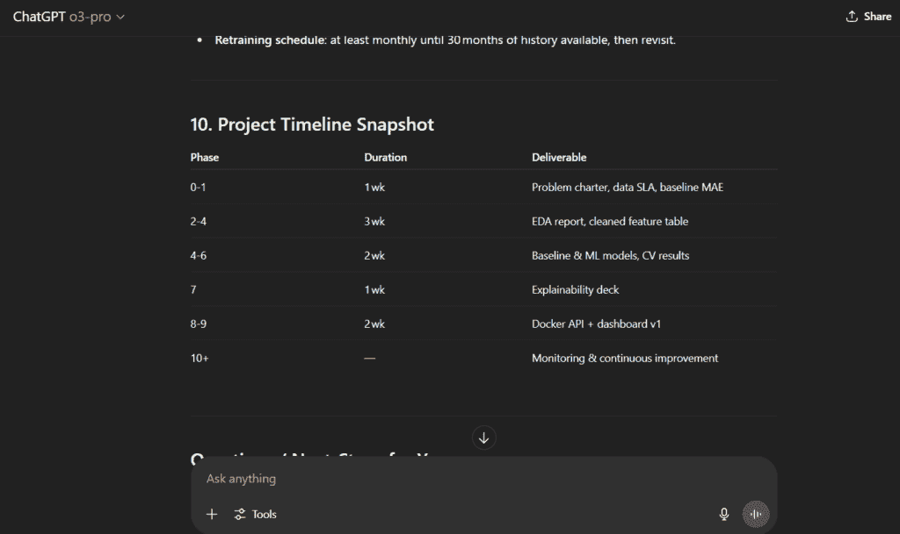

# 用这些提示工程技巧和技巧成为更好的数据科学家

> [`towardsdatascience.com/become-a-better-data-scientist-with-these-prompt-engineering-hacks/`](https://towardsdatascience.com/become-a-better-data-scientist-with-these-prompt-engineering-hacks/)

<mdspan class="mdspan-comment is-selected" datatext="el1750963439283">在这篇文章中，</mdspan>我要与你分享我最喜欢的提示和提示工程技巧，这些技巧帮助我应对数据科学和人工智能任务。

随着**提示工程**成为大多数工作描述中的一项必需技能，我认为分享一些提高你数据科学工作流程的技巧和技巧会很有用。

我们在这里讨论的是用于清理数据、探索性数据分析和特征工程的具体提示。

这是我将要写的关于提示工程数据科学系列**第一篇**文章：

+   **第一部分**：提示工程在规划、清理和探索性数据分析中的应用（本文）

+   **第二部分**：提示工程在特征、建模和评估中的应用

+   **第三部分**：提示工程在文档、DevOps 和学习中的应用

👉本文中所有的提示都可在文章末尾作为速查表找到 😉

在这篇文章中：

1.  为什么提示工程是数据科学家们的超级能力

1.  使用 LLMs 重新构想的数据科学生命周期

1.  提示工程在规划、清理和探索性数据分析中的应用

## 为什么提示工程是数据科学家们的超级能力

我知道，*提示工程*听起来就像现在的流行热词。我以前在开始听到这个术语时也是这样想的。

我会到处看到它，并想：这仅仅是写一个提示。为什么人们对此如此炒作？这有什么难的呢？

在测试了几个提示并观看了几个教程之后，我现在明白，这是数据科学家现在可以获得的最有用（也是被低估）的技能之一。

在工作描述中，提示工程已经成为一项必需的技能，这已经是很常见的现象。

**与我一起反思**：你有多经常要求 ChatGPT/Claude/你喜欢的聊天机器人帮你重写代码、清理数据，或者只是头脑风暴一个项目或你有的想法？你有多经常得到有用且有意义、非泛泛的回答？

> **提示工程**是艺术（和科学）的体现，即让大型语言模型（LLMs）如 GPT-4 或 Claude 按照你的意愿、在你想的时候、以符合你工作流程的方式实际执行你想要的操作。

因为这里的关键是：**大型语言模型（LLMs）现在无处不在**。

在你的笔记本中。

在你的集成开发环境（IDE）中。

在你的 BI 仪表板中。

在你的代码审查工具中。

而且它们只会变得更好**。**

随着数据科学工作变得更加复杂——更多的工具、更多的期望、更多的流程——能够以精确、结构化的方式与 AI“交谈”成为一种真正的优势。

我认为提示工程是一种超级能力。不仅对于试图加快速度的初级人员来说是这样，对于想要更聪明工作的经验丰富的数据科学家来说也是如此。

在这个系列中，我将向你展示提示工程如何支持你在数据科学生命周期的**每个阶段**——从头脑风暴和清理，到建模、评估、文档编写以及更多。

## 使用 LLMs 重新构想的数据科学生命周期

当你构建数据科学或机器学习项目时，这真像是一场完整的旅程。

从确定你正在解决的问题，到让利益相关者理解**为什么**你的模型很重要（而不需要向他们展示任何一行代码）。

这里是一个**典型的数据科学生命周期**：

+   你**规划与头脑风暴**，以确定正确的问题以及需要解决的问题

+   你**收集**数据，或者数据为你收集。

+   你**清理数据并预处理**——这是你花费 80%的时间和耐心（的地方）。

+   有趣的部分开始了：你开始进行探索性数据分析（EDA）——感受数据，在数字中找到故事。

+   你开始构建：**特征工程**和**建模**开始。

+   然后，你**评估**和**验证**事情是否真的**有效**。

+   最后，你**记录**和**报告**你的发现，以便其他人也能理解。

现在……想象一下拥有一个有帮助的助手，它：

+   几秒钟内写出坚实的**起始代码**，

+   建议更好的**清理**或**可视化**数据的方法，

+   帮助你向非技术人员解释**模型性能**，

+   提醒你检查可能会错过的事情（如数据泄露或类别不平衡），

+   并且全天候可用。

这就是 LLMs 可以做到的，**如果你以正确的方式提示它们**！

它们不会取代你，不用担心。它们做不到这一点！

但它们可以并且一定会放大你的能力。你仍然需要知道**你正在构建什么**以及**如何（以及为什么）**，但现在你有一个助手，它允许你以更智能的方式完成所有这些。

现在，我将向你展示提示工程如何增强你作为数据科学家的能力。

## 用于规划、清理和探索性数据分析（EDA）的提示工程

#### 1. 规划与头脑风暴：不再有空白页面

你有一个数据集。你有一个目标。现在怎么办？

你可以提示 GPT-4 或 Claude 根据数据集描述和目标列出端到端项目的步骤。

这个阶段是 LLMs 可以给你带来帮助的地方。

### 示例：规划能源消耗预测项目

这里是一个我实际使用过的提示（使用 ChatGPT）：

> “你是一位资深数据科学家。我有一个能源消耗数据集（12,000 行，18 个月的每小时数据），包括温度、使用 _kwh、地区和星期几等特征。
> 
> 任务：提出一个逐步的项目计划来预测未来的能源消耗。包括预处理步骤、季节性处理、特征工程想法和模型选项。我们将为内部利益相关者部署仪表板。”

这种类型的结构化提示可以：

+   **上下文**（数据集大小、变量、目标）

+   **限制**（类别不平衡）

+   暗示**部署**

注意：如果您正在使用 ChatGPT 的最新模型**o3-pro**，请确保提供大量的上下文。这个新模型在您提供完整的转录、文档、数据等时表现最佳。

类似的**Claude**提示也会起作用，因为 Claude 也偏好明确的指令。Claude 更大的上下文窗口甚至允许在需要时包括更多数据集模式细节或示例，这可以产生更定制化的计划”

我用 o3-pro 重新测试了这个提示，因为我很好奇结果。

o3-pro 的响应不亚于一个完整的数据科学项目计划，从数据清洗和特征工程到模型选择和部署，更重要的是：包含了关键决策点、现实的时间表，以及一开始就挑战我们假设的问题。

这里是响应的快照：

图片由作者提供。

### 奖励策略：明确 – 确认 – 完成

如果您需要更复杂的规划，有一个叫做“明确、确认、完成”的技巧，您可以在 AI 给出最终计划之前使用。

您可以要求模型：

1.  **明确**它首先需要知道什么

1.  **确认**正确的方法

1.  然后**完成**一个完整计划

例如：

*“*我想分析我们物流网络的晚点交付情况。

在提供分析计划之前：

1.  **明确**哪些数据或运营指标可能与交付延迟相关

1.  **确认**识别延迟驱动因素的最佳分析方法

1.  然后**完成**一个详细的项目计划（数据清洗、特征工程、模型或分析技术，以及报告步骤）。”

这种方法迫使 LLM 首先提出问题或陈述假设（例如，关于可用数据或指标），这迫使模型放慢速度并思考，就像我们人类一样！

### 数据清洗与预处理：再见，模板代码

现在计划已经准备好了，是时候卷起袖子了。数据清洗是工作的 80%，肯定不是一个有趣的任务。

GPT-4 和 Claude 都可以根据良好的提示生成处理缺失值或转换变量的代码片段等常见任务的代码。

#### 示例：写一些 pandas 代码

**提示**：

“我有一个包含`年龄`、`收入`、`城市`列的 DataFrame `df`。

一些值缺失，并且存在收入异常值。

任务：

1.  删除`城市`缺失的行

1.  用中位数填充缺失的`年龄`

1.  使用 IQR 方法对收入异常值进行截尾

    在代码中包含注释。

几秒钟内，您就会得到一个包含`dropna()`、`fillna()`和 IQR 逻辑的代码块，所有这些都带有解释。

#### **示例：关于清洗策略的指导**

您还可以查询概念性建议。

**提示**：

“处理金融交易数据集中异常值的不同方法有哪些？解释何时使用每种方法以及优缺点。”

这样的提示将输出针对您特定领域的多种方法，而不是一刀切解决方案。

这有助于避免从过于宽泛的问题（例如，询问“处理异常值最佳方式”可能会输出一个过于简化的“移除所有异常值”建议）得到的**简单化**或甚至误导性的建议。

### 尝试使用少量样本提示以保持一致性

需要一致格式的变量描述？

只展示 LLM 如何：

**提示：**

“原始： “客户年龄” → 标准化： “交易时的客户年龄。”

原始： “purchase_amt” → 标准化： “交易金额（美元）。”

现在标准化：

+   原始： “cust_tenure”

+   原始： “item_ct”

完美地遵循了风格。你可以使用这个技巧来标准化标签、定义特征，甚至后来描述模型步骤。

### 探索性数据分析（EDA）：提出更好的问题

EDA 是我们开始问“这里有什么有趣的地方？”的地方，而模糊的提示在这里可能会造成真正的伤害。

一个通用的“分析这个数据集”通常会返回…通用的建议。

**示例：EDA 任务**

“我有一个包含 `customer_id`、`product`、`date` 和 `amount` 的电子商务数据集。”

我想要了解：

1.  购买行为模式

1.  经常一起购买的产品

1.  随时间变化的购买变化

    对于每个，建议要分析的列和 Python 方法。

答案可能包括分组统计、时间趋势，甚至使用 `groupby()`、`seaborn` 和市场篮子分析的代码片段。

如果你已经有了**摘要统计**，你甚至可以粘贴它们并询问：

**提示：**

“基于这些汇总统计，有什么突出或潜在问题我应该关注？”

GPT-4/Claude 可能会指出一个特征的高方差或另一个特征中可疑的缺失条目数量。（**小心：**模型只能从你展示的内容中推断；如果要求在没有数据的情况下进行推测，它可能会产生幻觉模式。）

**示例提示：引导式 EDA**

“我有一个包含 50 列（混合数值和分类）的数据集。建议一个探索性数据分析计划：列出 5 项关键分析（例如，分布检查、相关性等）。对于每个，指定要查看的特定列或列对，鉴于我想了解销售绩效驱动因素。”

这个提示具体说明了目标（销售驱动因素），因此 AI 可能会建议，例如，分析销售与营销支出的散点图，如果存在日期，则进行时间序列图等，定制到“绩效驱动因素”。此外，结构化的输出（5 项分析的列表）比长段落更容易遵循。

#### 示例：让 LLM 解释你的图表

你甚至可以问：

*“收入按职业的箱线图能告诉我什么？”*

它将解释四分位数、IQR 以及异常值可能意味着什么。这在指导初级人员或准备报告、演示等幻灯片时更有帮助。

### 需要小心的问题

在这个早期阶段，大多数人会误用 LLM。以下是需要注意的事项：

#### 广泛或模糊的提示

如果你这样说：“我应该对这个数据集做什么？”

你会得到类似这样的回答：“清理数据，分析它，构建模型。”

相反，**始终包含**：

+   **上下文**（数据类型、大小、变量）

+   **目标**（预测客户流失、分析销售等）

+   **限制**（不平衡数据、缺失值、领域规则）

#### 对输出的盲目信任

是的，大型语言模型可以快速编写代码。但请测试一切。

我曾经请求过用于填充缺失值的代码。它使用`fillna()`对**所有列**进行填充，包括分类列。它没有检查数据类型，我第一次使用时也没有检查……😬

#### 隐私和泄露

如果您正在处理真实公司的数据，**不要将原始行粘贴到提示中**，除非您正在使用私有/企业模型。相反，抽象地描述数据。或者更好的是，就此事咨询您的经理。

* * *

感谢阅读！

👉 获取包含本文所有提示的**提示工程速查表**。当您订阅[**Sara 的 AI 自动化快报**](https://saranfn.substack.com/)时，我会发送给您。您还将获得访问 AI 工具库和每周的免费 AI 自动化通讯。

感谢阅读！ 😉

* * *

我在这里提供职业成长和转型的**辅导**[链接](https://topmate.io/sara_nobrega)。

**如果您想支持我的工作**，您可以**购买我最喜欢的咖啡**[链接](https://buymeacoffee.com/saranobregu)：卡布奇诺。😊

### 参考文献

[使用 ChatGPT 进行数据科学项目指南 | DataCamp](https://www.datacamp.com/tutorial/chatgpt-data-science-projects)

[(29) 从 GPT-4 到 Claude 4 的文档分析提示工程：我所学到的 | 领英](https://www.linkedin.com/pulse/prompt-engineering-document-analysis-what-i-learned-moving-kish-dubey-pznfc/)

[数据专业人士的提示工程指南 – Dataquest](https://www.dataquest.io/blog/introduction-to-prompt-engineering-for-data-professionals/#:~:text=I%20have%20a%20dataset%20of%20text%20data,%20Help%20me%20identify)

[Geeks for Geeks](https://www.geeksforgeeks.org/data-science/how-to-use-chatgpt-as-a-data-scientist/#:~:text=Data%20preprocessing%20is%20one%20of%20the%20key%20steps%20in%20data%20science,%20and%20it%20can%20help%20you%20write%20functions%20for)
