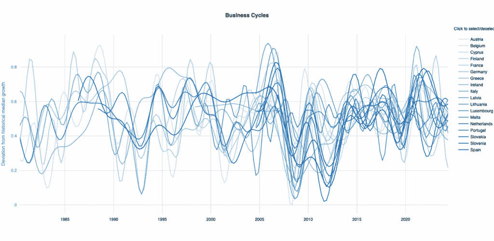
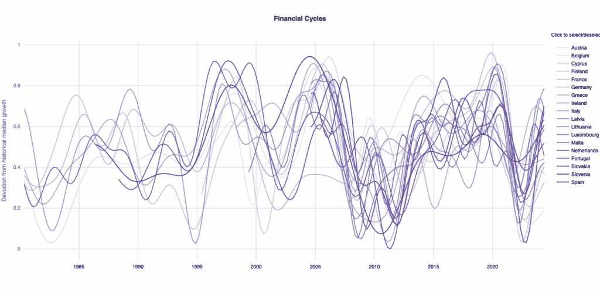
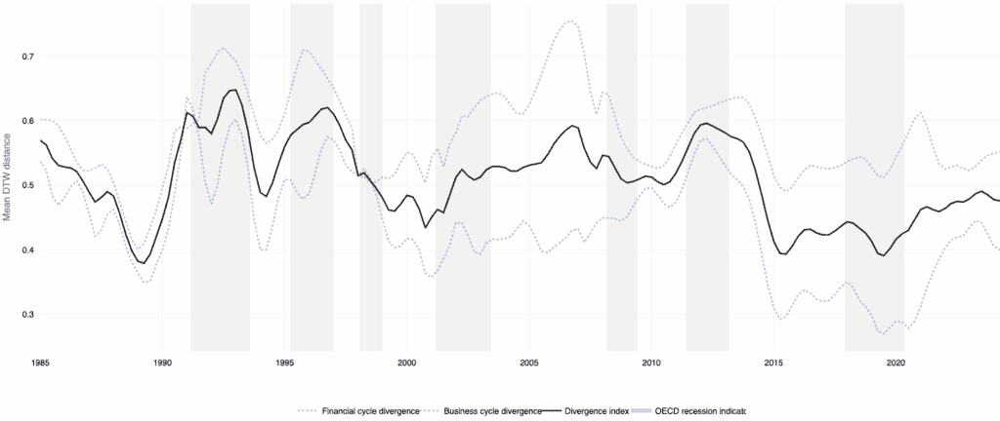

# 使用动态时间扭曲进行经济周期同步

> [经济周期同步与动态时间扭曲](https://towardsdatascience.com/economic-cycle-synchronization-with-dynamic-time-warping/)

<mdspan datatext="el1750896368962" class="mdspan-comment">经济周期</mdspan>— 产出或金融市场扩张和收缩的时期— 是宏观经济分析的核心。当国家共享一种货币，如欧元区，同步周期对于一种适合所有情况的货币政策来说是必要的。这个想法最初由罗伯特·蒙代尔（1961 年）提出，他是最优货币区理论的创始人。例如，如果德国处于危机之中，而西班牙正在繁荣，就像千年之交之后的情况一样，欧洲中央银行（ECB）无法为这两个国家设定正确的利率。较低的利率会导致西班牙经济过热，而较高的利率会加剧德国的危机。

循环同步的传统度量通常依赖于简单的相关性。但如果两个经济体遵循非常相似的商业或金融模式，但一个只是“领先”或“落后”另一个几个季度，会发生什么呢？

进入动态时间扭曲（DTW），这是一种最初为语音识别开发的技巧，但越来越在数据科学中流行，用于比较形状相似但时间不同的时间序列。在我们的论文“时间扭曲：欧元区商业和金融周期同步”（Bugdalle & Pfeifer，2025 年）中，我们构建了欧元区商业和金融周期的综合指数，然后使用 DTW 来衡量这些周期在不同国家之间的对齐程度。我们的最优货币区（OCA）监控器使得能够实时跟踪周期差异— 并且能够发现相位滞后，而不会像传统指标那样严厉地惩罚它们。

## 捕捉相位移动和振幅差异

大多数现有的循环同步研究做了三件事，这些事情可能会存在问题：

1.  **对周期的静态处理**：例如，趋势提取方法（如 HP 滤波器）从数据中移除周期成分。即使在更复杂的框架中— 例如允许周期性的状态空间模型— 周期频率本身通常保持固定。

1.  **使用平均值**：标准分散指标，如方差或标准差，总是错误地将平均值解释为“最佳”。换句话说，距离不是在两个周期之间测量，而是相对于平均值或参考周期。这掩盖了多模态性。例如，如果我们的周期实际上落入两个（或更多）很好地分离的簇中，质心将位于它们之间— 在一个没有真实数据的区域— 并且所有周期到平均值的距离看起来都很适中，尽管来自不同簇的周期实际上非常遥远。

1.  **相位偏移**：大多数距离度量都是欧几里得距离。例如，两个周期可能在时间上略有偏移，但仍能完美同步。这一点对于货币政策可能尤为重要。许多 OCA 指标最终会高估分歧，尤其是在经济“几乎”同步但相差几个月或几个季度的情况下。

## 周期同步的动态时间扭曲（DTW）

DTW 是一种非参数算法，通过允许一个时间序列在时间上拉伸或压缩以匹配另一个时间序列，从而找到两个时间序列之间的最佳对齐（或“扭曲”）。在我们的案例中，DTW 应用于每种平滑周期指数类型，这意味着为每种周期类型估计一个相似度度量。在每个周期类别中，DTW 计算每对国家*i*和*j*之间的对齐路径*π*[*ij*]，该路径最小化了两个周期之间的累积距离：

\[D(\mathbf{x}_i, \mathbf{x}_j) = \min{\pi_{ij}} \sum_{(t, s) \in \pi_{ij}} \left| \mathbf{x}_{i,t} – \mathbf{x}_{j,s} \right|²,\]

其中**x**[i]和**x**[j]是时间*t*和*s*时国家*i*和*j*的平滑周期值。结果距离***D***(**x**[i], **x**[j])捕捉了相似度程度，较小的值表示两个周期更接近对齐。为了确保 DTW 比较反映了周期性运动的时机，对齐是在由平均周期持续时间定义的局部窗口（Sakoe-Chiba Band）上进行的。最后，为了将所有成对 DTW 距离汇总成一个欧元区指标，我们计算了***D***(**x**[i], **x**[j])的 GDP 加权平均值。这个加权平均值是下面显示的分歧指数（图 3）。

在经济周期背景下使用 Sakoe-Chiba Bands 的 DTW 的关键优势：

+   **相位不变性**。小的滞后或领先不会自动触发大的分歧得分。如果基本模式几乎相同，一个季度的偏移不会严重惩罚距离。

+   **形状敏感性**。DTW 保留了关于振幅、趋势反转以及繁荣和萧条相对“形状”的信息。两个都经历过急剧信贷繁荣的国家——即使其中一个领先一个季度——仍将被认为高度相似。

+   **时间变化的灵活性**。通过在滚动窗口（例如，商业周期的±5 个季度，金融周期的±6 个季度）上应用 DTW，该方法适应了变化的周期持续时间，而不强加一个固定的频率。

## 构建复合商业和金融周期

为了说明 DTW 的力量，我们首先为每个欧元区国家构建两个复合周期指数：

1.  **商业周期指数**：季度实际 GDP 增长、私人消费增长、固定资本形成总额增长和失业增长。

1.  **金融周期指数**：季度实际信贷增长（银行贷款）、房价增长、股价增长和政府债券价格增长。

使用 Schüler 等人（2020 年）引入的非参数方法，我们提取每个国家的潜在周期——一个在 0 和 1 之间交替的指数，以反映扩张和收缩阶段，但具有随时间变化的振幅和持续时间。这避免了刚性去趋势并保持转折点完整。

**图 1 和图 2**

注意：商业周期和金融周期的指数是相对于其历史中位数的偏差——0.5 对应于每个指数的长期中位增长率。综合金融周期结合了信贷、房价、股票价格和债券价格的季度环比增长——显示了原始（未过滤）序列和采用特定国家频率带的带通滤波序列。过滤后的商业周期结合了 GDP、消费、投资和失业的季度环比增长

## 从成对 DTW 距离到综合分歧监控器

一旦估计了每个国家的商业和金融周期，我们就计算每对国家之间的成对 DTW 距离（例如，德国与西班牙，法国与意大利等）。为了形成一个单一的欧元区“分歧指数”，他们计算所有成对 DTW 距离的 GDP 加权平均值。指数值越高，意味着国家周期之间的分歧越大；值越低，意味着同步性越紧密。

**图 3**

注意：该图显示了 1985Q1 至 2023Q4 欧元区周期分歧的季度度量。虚线紫色线表示所有国家金融周期指数成对比较的平均动态时间规整（DTW）距离；虚线蓝色线显示商业周期指数的等效值。实线黑色线是这两个系列的 GDP 加权平均值，我们的综合分歧监控器。阴影灰色带标记欧元区的经合组织（OECD）衰退期。值越高，意味着成员国周期之间的分歧越大

当你绘制这个序列（图 3）时，会出现几个模式：

+   **1990 年代的收敛**：商业周期分歧在马斯特里赫特标准下的收敛标准确立后急剧下降。

+   **2008 年前的金融分歧**：金融周期实际上在金融危机之前就已经开始分歧——这种分歧的峰值几乎对基于相关性或振幅的指标不可见。

+   **2010 年后的重新定位**：欧洲央行（ECB）的非传统货币政策（OMT，QE）与商业和金融周期的收敛相一致。

+   **2021 年末的上升**：自 COVID-19 冲击以来，分歧开始缓慢上升，因为一些国家的恢复可能比其他国家更快。

## 对数据科学家和经济学家的启示

+   **灵活模式匹配**：当比较可能具有相同“形状”但不同步的经济（或任何）时间序列时，DTW（动态时间规整）通常比欧几里得距离或直接相关性是一个更好的相似度度量。

+   **处理非平稳频率**：商业和金融周期并非以整洁、固定长度的包出现。DTW 适应不同周期长度的能力保留了现实世界的转折点。

想要探索代码或跟踪欧元区的实时“分歧监控器”？请查看[代码或监控器](https://github.com/Moritz-Pfeifer/Divergence_Monitor) [`github.com/Moritz-Pfeifer/Divergence_Monitor`](https://github.com/Moritz-Pfeifer/Divergence_Monitor)以获取数据、Python 笔记本，以及[交互式可视化](https://moritz-pfeifer.github.io/eurozone-divergence-monitor/) [`moritz-pfeifer.github.io/eurozone-divergence-monitor/`](https://moritz-pfeifer.github.io/eurozone-divergence-monitor/)，让您看到自 1980 年代以来同步如何演变。

**参考文献：**

**Bugdalle，T.，Pfeifer，M. (2025).** 时间扭曲：欧元区的商业和金融周期同步。*SSRN* 预印本。[工作论文链接](https://papers.ssrn.com/sol3/papers.cfm?abstract_id=5238187)

**Sakoe，H.，Chiba，S. (1978).** 语音识别中动态规划算法优化。*IEEE 交易，声学，言语和信号处理，26*(1)，43–49。 [论文链接](https://ieeexplore.ieee.org/document/1163055)

**Schüler，Y. S.，P. P. Hiebert，和 T. A. Peltonen (2020).** 金融周期：特征化和实时测量。国际货币与金融杂志 100。 [论文链接](https://www.sciencedirect.com/science/article/abs/pii/S0261560619301597)

**蒙代尔，R. (1961).** 最优货币区理论。*美国经济评论，51*(4)，657–665。[论文链接](https://www.jstor.org/stable/1812792)
