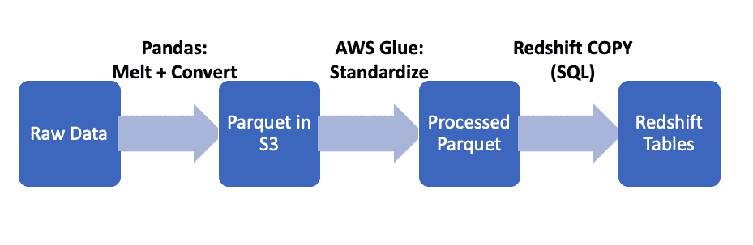
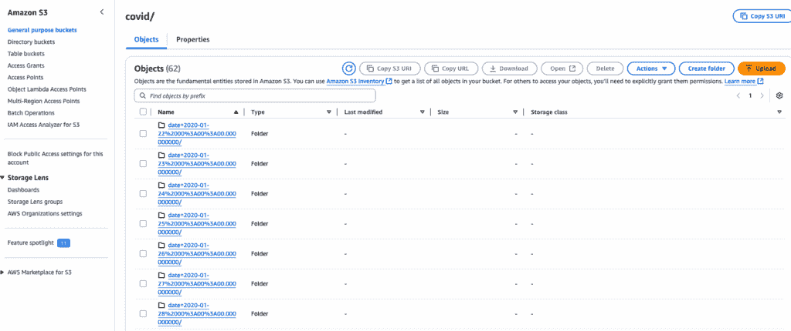
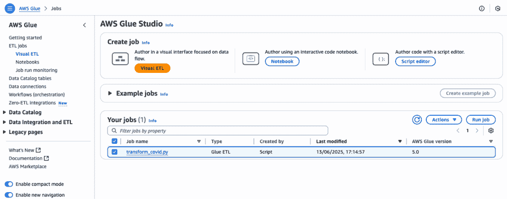
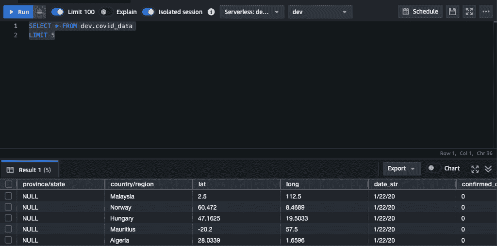
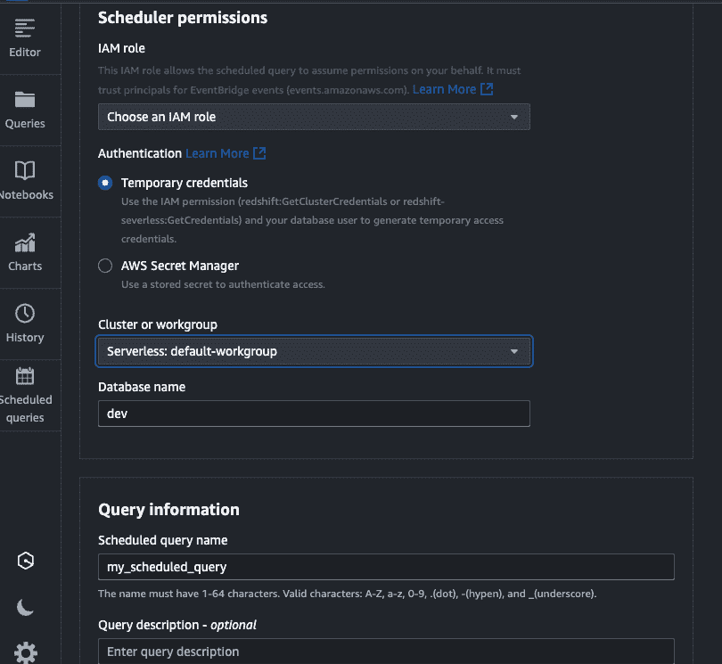
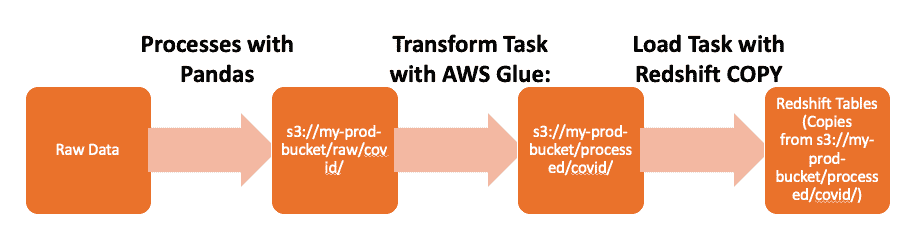

# 从配置到编排：使用 AWS 构建一个 ETL 工作流程不再是一个挑战

> [`towardsdatascience.com/from-configuration-to-orchestration-building-etl-workflow-with-aws-is-no-longer-struggling/`](https://towardsdatascience.com/from-configuration-to-orchestration-building-etl-workflow-with-aws-is-no-longer-struggling/)

<mdspan datatext="el1750294795484" class="mdspan-comment">AWS 继续领先云行业，市场份额高达 32%，这得益于其早期市场进入、强大的技术和全面的服务提供。然而，许多用户发现 AWS 的导航具有挑战性，这种不满导致更多公司和组织更倾向于选择其竞争对手 Microsoft Azure 和 Google Cloud Platform。>

尽管学习曲线更陡峭且界面不太直观，但 AWS 仍然是最顶级的云服务，这得益于其可靠性、混合云和最大的服务选项。更重要的是，选择合适的策略可以显著减少配置复杂性、简化工作流程并提高性能。

在这篇文章中，我将介绍一种基于我自身经验的高效方法来在 AWS 上设置一个完整的 ETL 流程，并包含编排。这将也会给你一个关于使用 AWS 生成数据的全新视角，或者如果你是第一次使用 AWS 来完成某些任务，这会让你在配置时感到不那么困难。

## 设计高效数据管道的策略

AWS 拥有最全面的生态系统，其庞大的服务。要在 AWS 上构建一个生产就绪的数据仓库，至少需要以下服务：

+   IAM - 虽然这项服务没有包含在工作流程的任何部分中，但它却是访问所有其他服务的基础。

+   AWS S3 - 数据湖存储

+   AWS Glue - ETL 处理

+   Amazon Redshift - 数据仓库

+   CloudWatch - 监控和日志

如果你需要安排更复杂的依赖项并执行错误处理的高级重试，那么你需要访问 Airflow，尽管 Redshift 可以处理一些基本的 cron 作业。

为了使你的工作更轻松，我强烈推荐安装一个 IDE（Visual Studio Code 或 PyCharm，当然你也可以选择你自己的 favorite IDE）。IDE 可以显著提高你编写复杂 Python 代码、本地测试/调试、版本控制集成和团队协作的效率。在下一节中，我将提供逐步配置。

## 初始设置

这里是初始配置的步骤：

+   在你的 IDE 中启动一个虚拟环境

+   安装依赖项 - 实际上，我们需要安装稍后将要使用的库。

```py
pip install apache-airflow==2.7.0 boto3 pandas pyspark sqlalchemy
```

+   安装 AWS CLI - 此步骤允许你编写脚本来自动化各种 AWS 操作，并使 AWS 资源的管理更加高效。

+   AWS 配置 - 确保在提示时输入这些 IAM 用户凭据：

    +   AWS 访问密钥 ID：来自你的 IAM 用户。

    +   AWS 密钥访问密钥：来自你的 IAM 用户。

    +   默认区域：`us-east-1`（或你偏好的区域）

    +   默认输出格式：`json`。

+   集成 Airflow - 这里是步骤：

    +   初始化 Airflow

    +   在 Airflow 中创建 DAG 文件

    +   在 http://localhost:8080（登录：admin/admin）运行网络服务器

    +   打开另一个终端标签并启动调度器

```py
export AIRFLOW_HOME=$(pwd)/airflow
airflow db init
airflow users create \
  --username admin \
  --password admin \
  --firstname Admin \
  --lastname User \
  --role Admin \
  --email [[email protected]](/cdn-cgi/l/email-protection)
#Initialize Airflow
```

```py
airflow webserver --port 8080 ##run the webserver
```

```py
airflow scheduler #start the scheduler
```

## 开发工作流程：COVID-19 数据案例研究

我使用约翰霍普金斯大学（JHU）的公共 COVID-19 数据集（CC BY 4.0 许可）进行演示。你可以参考数据[这里](https://raw.githubusercontent.com/CSSEGISandData/COVID-19/master/archived_data/archived_time_series/time_series_19-covid-Confirmed_archived_0325.csv)，

下面的图表显示了从数据摄取到数据加载到开发环境中 Redshift 表的流程。



作者创建的开发工作流程

**数据摄取**

在数据摄取到 AWS S3 的第一步中，我通过将数据熔化成长格式并转换日期格式来处理数据。我将数据保存为 parquet 格式以提高存储效率，增强查询性能并降低存储成本。此步骤的代码如下：

```py
import pandas as pd
from datetime import datetime
import os
import boto3
import sys

def process_covid_data():
    try:
        # Load raw data
        url = "https://github.com/CSSEGISandData/COVID-19/raw/master/archived_data/archived_time_series/time_series_19-covid-Confirmed_archived_0325.csv"
        df = pd.read_csv(url)

        # --- Data Processing ---
        # 1\. Melt to long format
        df = df.melt(
            id_vars=['Province/State', 'Country/Region', 'Lat', 'Long'], 
            var_name='date_str',
            value_name='confirmed_cases'
        )

        # 2\. Convert dates (JHU format: MM/DD/YY)
        df['date'] = pd.to_datetime(
            df['date_str'], 
            format='%m/%d/%y',
            errors='coerce'
        ).dropna()

        # 3\. Save as partitioned Parquet
        output_dir = "covid_processed"
        df.to_parquet(
            output_dir,
            engine='pyarrow',
            compression='snappy',
            partition_cols=['date']
        )

        # 4\. Upload to S3
        s3 = boto3.client('s3')
        total_files = 0

        for root, _, files in os.walk(output_dir):
            for file in files:
                local_path = os.path.join(root, file)
                s3_path = os.path.join(
                    'raw/covid/',
                    os.path.relpath(local_path, output_dir)
                )
                s3.upload_file(
                    Filename=local_path,
                    Bucket='my-dev-bucket',
                    Key=s3_path
                )
            total_files += len(files)

        print(f"Successfully processed and uploaded {total_files} Parquet files")
        print(f"Data covers from {df['date'].min()} to {df['date'].max()}")
        return True

    except Exception as e:
        print(f"Error: {str(e)}", file=sys.stderr)
        return False

if __name__ == "__main__":
    process_covid_data()
```

运行 Python 代码后，你应该能够在 S3 存储桶的 'raw/covid/' 文件夹下看到 parquet 文件。



作者截图

**ETL 管道开发**

AWS Glue 主要用于 ETL 管道开发。尽管在没有数据加载到 S3 的情况下也可以用于数据摄取，但其优势在于处理数据，一旦数据进入 S3 用于数据仓库目的。以下是数据转换的 PySpark 脚本：

```py
# transform_covid.py
from awsglue.context import GlueContext
from pyspark.sql.functions import *

glueContext = GlueContext(SparkContext.getOrCreate())
df = glueContext.create_dynamic_frame.from_options(
    "s3",
    {"paths": ["s3://my-dev-bucket/raw/covid/"]},
    format="parquet"
).toDF()

# Add transformations here
df_transformed = df.withColumn("load_date", current_date())

# Write to processed zone
df_transformed.write.parquet(
    "s3://my-dev-bucket/processed/covid/",
    mode="overwrite"
)
```



作者截图

下一步是将数据加载到 Redshift。在 Redshift 控制台中，点击左侧的“查询编辑器 Q2”，然后你可以编辑你的 SQL 代码并完成 Redshift COPY 操作。

```py
# Create a table covid_data in dev schema
CREATE TABLE dev.covid_data (
    "Province/State" VARCHAR(100),  
    "Country/Region" VARCHAR(100),
    "Lat" FLOAT8,
    "Long" FLOAT8,
    date_str VARCHAR(100),
    confirmed_cases FLOAT8  
)
DISTKEY("Country/Region")   
SORTKEY(date_str);
```

```py
# COPY data to redshift
COPY dev.covid_data (
    "Province/State",
    "Country/Region",
    "Lat",
    "Long",
    date_str,
    confirmed_cases
)
FROM 's3://my-dev-bucket/processed/covid/'
IAM_ROLE 'arn:aws:iam::your-account-id:role/RedshiftLoadRole'
REGION 'your-region'
FORMAT PARQUET;
```

然后，你会看到数据已成功上传到数据仓库。



作者截图

**管道自动化**

自动化你的数据管道最简单的方法是在 Redshift 查询编辑器 v2 下创建存储过程（我有一个关于 SQL 存储过程的更详细介绍，你可以参考[这篇文章](https://towardsdatascience.com/how-to-enhance-sql-code-security-and-maintainability-3e398b4dd68e/))。

```py
CREATE OR REPLACE PROCEDURE dev.run_covid_etl()
AS $$
BEGIN
  TRUNCATE TABLE dev.covid_data;
  COPY dev.covid_data 
  FROM 's3://simba-dev-bucket/raw/covid'
  IAM_ROLE 'arn:aws:iam::your-account-id:role/RedshiftLoadRole'
  REGION 'your-region'
  FORMAT PARQUET;
END;
$$ LANGUAGE plpgsql;
```



作者截图

或者，你可以运行 Airflow 来执行计划任务。

```py
from datetime import datetime
from airflow import DAG
from airflow.providers.amazon.aws.operators.redshift_sql import RedshiftSQLOperator

default_args = {
    'owner': 'data_team',
    'depends_on_past': False,
    'start_date': datetime(2023, 1, 1),
    'retries': 2
}

with DAG(
    'redshift_etl_dev',
    default_args=default_args,
    schedule_interval='@daily',
    catchup=False
) as dag:

    run_etl = RedshiftSQLOperator(
        task_id='run_covid_etl',
        redshift_conn_id='redshift_dev',
        sql='CALL dev.run_covid_etl()',
    )
```

## 生产工作流程

如果有多个依赖项，Airflow DAG 可以有效地编排你的整个 ETL 管道，这在生产环境中也是一种良好的实践。

在开发和测试你的 ETL 管道后，你可以使用 Airflow 在生产环境中自动化你的任务。



作者创建的生产工作流程

这里有一些关键准备步骤的清单，以帮助在 Airflow 中成功部署：

+   创建 S3 存储桶 `my-prod-bucket`

+   在 AWS 控制台中创建 Glue 作业 `prod_covid_transformation`

+   创建 Redshift 存储过程 `prod.load_covid_data()`

+   配置 Airflow

+   在 `airflow.cfg` 中配置 SMTP 用于电子邮件

然后在 Airflow 中部署数据管道是：

```py
from datetime import datetime, timedelta
from airflow import DAG
from airflow.operators.python import PythonOperator
from airflow.providers.amazon.aws.operators.glue import GlueJobOperator
from airflow.providers.amazon.aws.operators.redshift_sql import RedshiftSQLOperator
from airflow.operators.email import EmailOperator

# 1\. DAG CONFIGURATION
default_args = {
    'owner': 'data_team',
    'retries': 3,
    'retry_delay': timedelta(minutes=5),
    'start_date': datetime(2023, 1, 1)
}

# 2\. DATA INGESTION FUNCTION
def load_covid_data():
    import pandas as pd
    import boto3

    url = "https://github.com/CSSEGISandData/COVID-19/raw/master/archived_data/archived_time_series/time_series_19-covid-Confirmed_archived_0325.csv"
    df = pd.read_csv(url)

    df = df.melt(
        id_vars=['Province/State', 'Country/Region', 'Lat', 'Long'], 
        var_name='date_str',
        value_name='confirmed_cases'
    )
    df['date'] = pd.to_datetime(df['date_str'], format='%m/%d/%y')

    df.to_parquet(
        's3://my-prod-bucket/raw/covid/',
        engine='pyarrow',
        partition_cols=['date']
    )

# 3\. DAG DEFINITION
with DAG(
    'covid_etl',
    default_args=default_args,
    schedule_interval='@daily',
    catchup=False
) as dag:

    # Task 1: Ingest Data
    ingest = PythonOperator(
        task_id='ingest_data',
        python_callable=load_covid_data
    )

    # Task 2: Transform with Glue
    transform = GlueJobOperator(
        task_id='transform_data',
        job_name='prod_covid_transformation',
        script_args={
            '--input_path': 's3://my-prod-bucket/raw/covid/',
            '--output_path': 's3://my-prod-bucket/processed/covid/'
        }
    )

    # Task 3: Load to Redshift
    load = RedshiftSQLOperator(
        task_id='load_data',
        sql="CALL prod.load_covid_data()"
    )

    # Task 4: Notifications
    notify = EmailOperator(
        task_id='send_email',
        to='you-email-address',
        subject='ETL Status: {{ ds }}',
        html_content='ETL job completed: <a href="{{ ti.log_url }}">View Logs</a>'
    )
```

## 我的最后想法

尽管一些用户，尤其是那些对云服务新手和寻求简单解决方案的用户可能会被 AWS 高高的入门门槛和服务选择的庞大所吓倒，但这值得花费时间和精力，以下是原因：

+   配置过程、设计、构建和测试数据管道的过程让您对典型的数据工程工作流程有了深入的理解。即使您使用其他云服务，如 Azure、GCP 和阿里云来制作项目，这些技能也会对您有所帮助。

+   AWS 拥有成熟的生态系统和提供的大量服务，使用户能够定制他们的数据架构策略，并在项目中享受更多的灵活性和可扩展性。

感谢阅读！希望这篇文章能帮助您构建基于云的数据管道！
