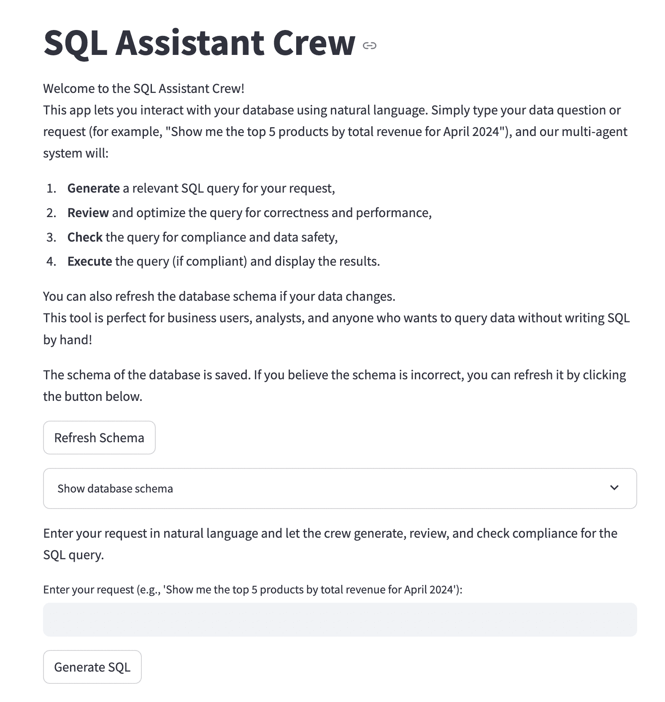
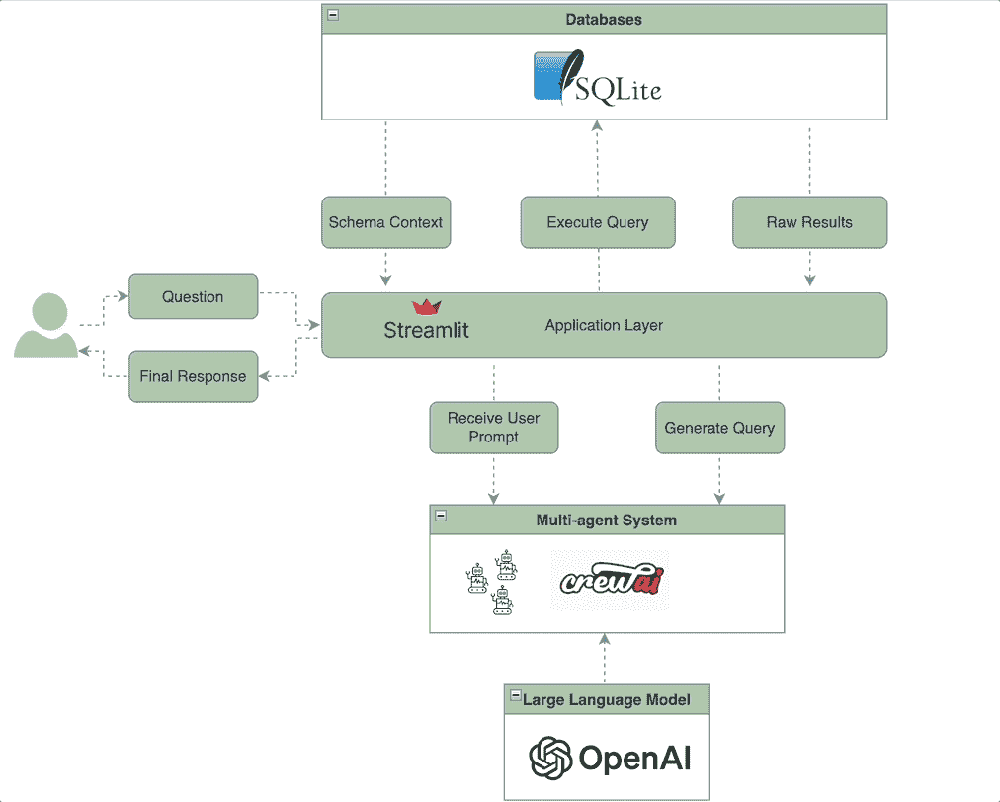
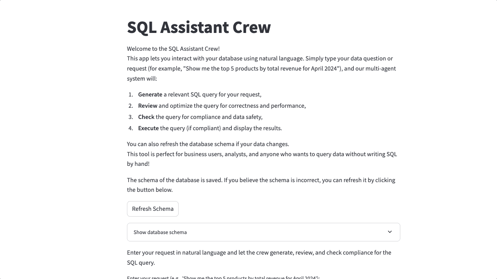
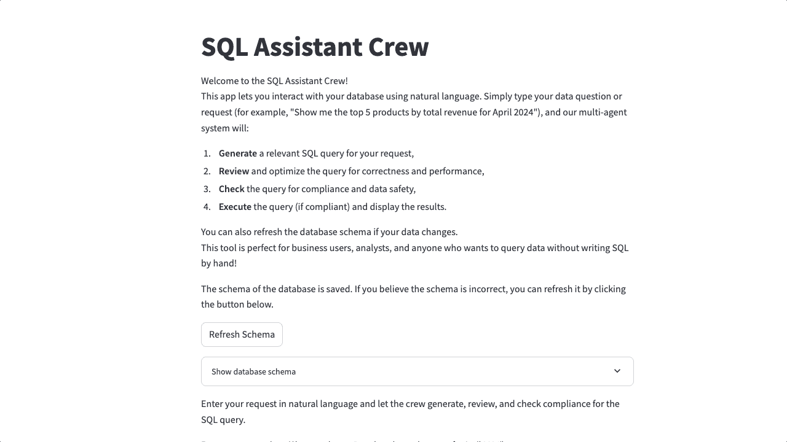

# 你可以信赖的多人 SQL 助手，带有人类在环检查点和 LLM 成本控制

> [`towardsdatascience.com/a-multi-agent-sql-assistant-you-can-trust-with-human-in-loop-checkpoint-llm-cost-control/`](https://towardsdatascience.com/a-multi-agent-sql-assistant-you-can-trust-with-human-in-loop-checkpoint-llm-cost-control/)

<mdspan datatext="el1750121838839" class="mdspan-comment">你是否曾想过</mdspan>构建自己的 AI 智能体？你是否经常被围绕智能体的各种术语所淹没？你并不孤单；我也曾经历过。有许多工具可供选择，甚至确定选择哪一个都可能感觉像是一项项目。此外，成本和基础设施的不确定性也存在。我会消耗过多的令牌吗？我该如何以及在哪里部署我的解决方案？

一段时间里，我也犹豫是否要自己动手做一些事情。我首先需要了解基础知识，看看几个例子来理解事物是如何运作的，然后通过实际操作来将这些概念付诸实践。经过大量的研究，我终于选择了**CrewAI**——结果证明这是一个完美的起点。DeepLearning.AI 提供了两门优秀的课程：[使用 crewAI 的多智能体系统](https://www.coursera.org/learn/multi-ai-agent-systems-with-crewai/home/week/1)和[使用 crewAI 的实用多智能体和高级用例](https://www.coursera.org/learn/practical-multi-ai-agents-and-advanced-use-cases-with-crewai/home/module/1)。在课程中，讲师非常清晰地解释了您需要了解的所有关于智能体以开始学习的内容。课程中提供了超过 10 个带有代码的案例研究，这可以作为良好的起点。

现在仅仅学习知识是不够的。如果你没有应用你所学的知识，你很可能会随着时间的推移而忘记基础知识。如果我只是重新运行课程中的用例，这并不真正算是“应用”。我必须自己构建并实施它。我决定构建一个与我工作紧密相关的用例。作为一名数据分析师和工程师，我主要使用 Python 和 SQL。我想知道如果我能构建一个基于自然语言的 SQL 查询助手会多么酷。我同意市场上已经有 plenty of 现成的解决方案。我并不是要重新发明轮子。通过这个原型，我想了解这样的系统是如何构建的，以及它们的潜在局限性。我试图揭示的是构建这样一个助手需要哪些条件。



演示应用的截图（作者提供）

在这篇帖子中，我将向您展示我是如何使用 **CrewAI** 和 **Streamlit** 来构建一个 **多代理 SQL 助手** 的。它允许用户使用自然语言查询 **SQLite** 数据库。为了更好地控制整个过程，我还集成了 **人机交互**检查，并显示每个查询的 **LLM 使用成本**。一旦助手生成查询，用户将拥有 3 个选项：如果查询看起来不错，则接受并继续；如果查询看起来不合适，则让助手再试一次；如果查询不起作用，则终止整个过程。拥有这个检查点有很大的不同——它赋予用户更多权力，避免执行不良查询，并在长期内帮助节省 LLM 成本。

您可以在 [这里](https://github.com/sravz3/SQL-Assistant-Crew) 找到完整的代码仓库。下面是完整的项目结构：

```py
SQL Assistant Crew Project Structure
===================================

.
├── app.py (Streamlit UI)
├── main.py (terminal)
├── crew_setup.py
├── config
│   ├── agents.yaml
│   └── tasks.yaml
├── data
│   └── sample_db.sqlite
├── utils
│   ├── db_simulator.py
│   └── helper.py
```



由作者使用 [`app.diagrams.net/`](https://app.diagrams.net/) 创建

**代理架构（我的 CrewAI 团队**）

为了我的 SQL 助手系统，我至少需要 3 个基本代理来高效地处理整个流程：

1.  **查询生成代理**会将用户提出的问题转换为 SQL 查询，使用数据库模式作为上下文。

1.  **查询审查代理**会接收生成代理生成的 SQL 查询，并进一步优化以提高准确性和效率。

1.  **合规性检查代理**会检查查询是否存在潜在的 PII 暴露，并提交一个判断，说明查询是否符合规范。

每个代理都必须具有 3 个核心属性——一个角色（代理应该是什么），一个目标（代理的使命），以及一个背景故事（设定代理的性格，以指导其行为）。我已经启用了 `verbose=“True”` 来查看代理的内部思维过程。我正在使用 `openai/gpt-4o-mini` 作为所有代理的底层语言模型。经过大量的尝试和错误，我将 `temperature=0.2` 设置为减少代理的幻觉。较低的温度使模型更加确定，并提供可预测的输出（例如，在我的情况下是 SQL 查询）。还有许多其他可调整的参数，例如 `max_tokens`（设置响应长度的限制），`top_p`（用于核采样），`allow_delegation`（将任务委托给其他代理）等。如果您使用其他 LLMs，您只需在此处指定 LLM 模型名称。您可以为所有代理设置相同的 LLM 或根据您的需求设置不同的 LLM。

下面是定义代理的 yaml 文件：

```py
query_generator_agent:
  role: Senior Data Analyst
  goal: Translate natural language requests into accurate and efficient SQL queries
  backstory:  >
        You are an experienced analyst who knows SQL best practices. You work with stakeholders to gather requirements
        and turn their questions into clear, performant queries. You prefer readable SQL with appropriate filters and joins.
  allow_delegation: False
  verbose: True
  model: openai/gpt-4o-mini
  temperature: 0.2

query_reviewer_agent:
  role: SQL Code Reviewer
  goal: Critically evaluate SQL for correctness, performance, and clarity
  backstory: >
        You are a meticulous reviewer of SQL code. You identify inefficiencies, bad practices, and logical errors, and
        provide suggestions to improve the query's performance and readability.
  allow_delegation: False
  verbose: True
  model: openai/gpt-4o-mini
  temperature: 0.2

compliance_checker_agent:
  role: Data Privacy and Governance Officer
  goal: Ensure SQL queries follow data compliance rules and avoid PII exposure
  backstory: >
        You are responsible for ensuring queries do not leak or expose personally identifiable information (PII) or
        violate company policies. You flag any unsafe or non-compliant practices.
  allow_delegation: False
  verbose: True
  model: openai/gpt-4o-mini
  temperature: 0.2
```

一旦你完成了代理的创建，下一步就是定义它们应该执行的任务。每个任务都必须有一个明确的描述，说明代理应该做什么。强烈建议你也将`expected_output`参数设置为调整 LLM 最终响应的形状。这是一种告诉 LLM 你期望得到什么类型答案的方式——它可能是一段文本、一个数字、一个查询，甚至是一篇文章。描述必须尽可能详细和具体。描述模糊只会导致模糊甚至完全错误的输出。在测试过程中，我不得不多次修改描述以调整代理生成的响应质量。我最喜欢的功能之一是能够通过提供花括号（{}）将**动态输入**注入任务描述中。这些占位符可以是用户提示、概念、定义，甚至是先前代理的输出。所有这些都允许 LLM 生成更准确的结果。

```py
query_task:
  description: |
    You are an expert SQL assistant. Your job is to translate user requests into SQL queries using ONLY the tables and columns listed below.
    SCHEMA:
    {db_schema}
    USER REQUEST:
    {user_input}
    IMPORTANT:
    - First, list which tables and columns from the schema you will use to answer the request.
    - Then, write the SQL query.
    - Only use the tables and columns from the schema above.
    - If the request cannot be satisfied with the schema, return a SQL comment (starting with --) explaining why.
    - Do NOT invent tables or columns.
    - Make sure the query matches the user's intent as closely as possible.
  expected_output: First, a list of tables and columns to use. Then, a syntactically correct SQL query using appropriate filters, joins, and groupings.

review_task:
  description: |
    Review the following SQL query for correctness, performance, and readability: {sql_query} and verify that the query fits the schema: {db_schema}
    Ensure that only tables and columns from the provided schema are used.
    IMPORTANT:
    - First, only review the SQL query provided for correctness, performance, or readability
    - Do NOT invent new tables or columns.
    - If the Query is already correct, return it unchanged.
    - If the Query is not correct and cannot be fixed, return a SQL comment (starting with --) explaining why.
  expected_output: An optimized or verified SQL query

compliance_task:
  description: >
    Review the following SQL query for compliance violations, including PII access, unsafe usage, or policy violations.
    List any issues found, or state "No issues found" if the query is compliant.
    SQL Query: {reviewed_sqlquery}
  expected_output: >
    A markdown-formatted compliance report listing any flagged issues, or stating that the query is compliant. Include a clear verdict at the top (e.g., "Compliant" or "Issues found")
```

将代理和任务定义放在单独的 YAML 文件中是一种良好的实践。如果你想要更新代理或任务的定义，你只需要修改 YAML 文件，而无需触及代码库。在`crew_setup.py`文件中，所有内容都汇集在一起。我读取并加载了从各自的 YAML 文件中读取的代理和任务配置。我还使用 Pydantic 模型创建了所有预期输出的定义，以赋予它们结构并验证 LLM 应该返回的内容。然后，我将代理分配给它们相应的任务并组装我的团队。根据用例，你可以有多种方式来构建团队。一个单一的代理团队可以按顺序或并行执行任务。或者，你可以创建多个团队，每个团队负责工作流程的特定部分。对于我的用例，我选择构建多个团队，通过插入人工检查点和控制成本来更好地控制执行流程。

```py
from crewai import Agent, Task, Crew
from pydantic import BaseModel, Field
from typing import List
import yaml

# Define file paths for YAML configurations
files = {
    'agents': 'config/agents.yaml',
    'tasks': 'config/tasks.yaml',
}

# Load configurations from YAML files
configs = {}
for config_type, file_path in files.items():
    with open(file_path, 'r') as file:
        configs[config_type] = yaml.safe_load(file)

# Assign loaded configurations to specific variables
agents_config = configs['agents']
tasks_config = configs['tasks']

class SQLQuery(BaseModel):
    sqlquery: str = Field(..., description="The raw sql query for the user input")

class ReviewedSQLQuery(BaseModel):
    reviewed_sqlquery: str = Field(..., description="The reviewed sql query for the raw sql query")

class ComplianceReport(BaseModel):
    report: str = Field(..., description="A markdown-formatted compliance report with a verdict and any flagged issues.")

# Creating Agents
query_generator_agent = Agent(
  config=agents_config['query_generator_agent']
)

query_reviewer_agent = Agent(
  config=agents_config['query_reviewer_agent']
)

compliance_checker_agent = Agent(
  config=agents_config['compliance_checker_agent']
)

# Creating Tasks
query_task = Task(
  config=tasks_config['query_task'],
  agent=query_generator_agent,
  output_pydantic=SQLQuery
)

review_task = Task(
  config=tasks_config['review_task'],
  agent=query_reviewer_agent,
  output_pydantic=ReviewedSQLQuery
)

compliance_task = Task(
  config=tasks_config['compliance_task'],
  agent=compliance_checker_agent,
  context=[review_task],
  output_pydantic=ComplianceReport
)

# Creating Crew objects for import
sql_generator_crew = Crew(
    agents=[query_generator_agent],
    tasks=[query_task],
    verbose=True
)

sql_reviewer_crew = Crew(
    agents=[query_reviewer_agent],
    tasks=[review_task],
    verbose=True
)

sql_compliance_crew = Crew(
    agents=[compliance_checker_agent],
    tasks=[compliance_task],
    verbose=True
)
```

我设置了一个带有一些样本数据的本地 SQLite 数据库，以模拟真实生活中的数据库交互，用于我的原型。我获取了数据库模式，它包含了系统中所有表和列的名称。后来，我将这个模式作为上下文输入给 LLM，以及原始用户查询，以帮助 LLM 生成一个 SQL 查询，使用的是提供的模式中的原始表和列，而不是自行发明。一旦生成器代理创建了一个 SQL 查询，它将由审查代理进行审查，然后由合规代理进行合规性检查。只有经过这些审查后，我才会允许审查后的查询在数据库上执行，通过 streamlit 界面向用户展示最终结果。通过添加验证和安全检查，我确保只有高质量的查询在数据库上执行，从而最小化不必要的令牌使用和长期计算成本。

```py
import sqlite3
import pandas as pd

DB_PATH = "data/sample_db.sqlite"

def setup_sample_db():
    conn = sqlite3.connect(DB_PATH)
    cursor = conn.cursor()

    # Drop tables if they exist (for repeatability in dev)
    cursor.execute("DROP TABLE IF EXISTS order_items;")
    cursor.execute("DROP TABLE IF EXISTS orders;")
    cursor.execute("DROP TABLE IF EXISTS products;")
    cursor.execute("DROP TABLE IF EXISTS customers;")
    cursor.execute("DROP TABLE IF EXISTS employees;")
    cursor.execute("DROP TABLE IF EXISTS departments;")

    # Create richer example tables
    cursor.execute("""
        CREATE TABLE products (
            product_id INTEGER PRIMARY KEY,
            product_name TEXT,
            category TEXT,
            price REAL
        );
    """)
    cursor.execute("""
        CREATE TABLE customers (
            customer_id INTEGER PRIMARY KEY,
            name TEXT,
            email TEXT,
            country TEXT,
            signup_date TEXT
        );
    """)
    cursor.execute("""
        CREATE TABLE orders (
            order_id INTEGER PRIMARY KEY,
            customer_id INTEGER,
            order_date TEXT,
            total_amount REAL,
            FOREIGN KEY(customer_id) REFERENCES customers(customer_id)
        );
    """)
    cursor.execute("""
        CREATE TABLE order_items (
            order_item_id INTEGER PRIMARY KEY,
            order_id INTEGER,
            product_id INTEGER,
            quantity INTEGER,
            price REAL,
            FOREIGN KEY(order_id) REFERENCES orders(order_id),
            FOREIGN KEY(product_id) REFERENCES products(product_id)
        );
    """)
    cursor.execute("""
        CREATE TABLE employees (
            employee_id INTEGER PRIMARY KEY,
            name TEXT,
            department_id INTEGER,
            hire_date TEXT
        );
    """)
    cursor.execute("""
        CREATE TABLE departments (
            department_id INTEGER PRIMARY KEY,
            department_name TEXT
        );
    """)

    # Populate with mock data
    cursor.executemany("INSERT INTO products VALUES (?, ?, ?, ?);", [
        (1, 'Widget A', 'Widgets', 25.0),
        (2, 'Widget B', 'Widgets', 30.0),
        (3, 'Gadget X', 'Gadgets', 45.0),
        (4, 'Gadget Y', 'Gadgets', 50.0),
        (5, 'Thingamajig', 'Tools', 15.0)
    ])
    cursor.executemany("INSERT INTO customers VALUES (?, ?, ?, ?, ?);", [
        (1, 'Alice', '[[email protected]](/cdn-cgi/l/email-protection)', 'USA', '2023-10-01'),
        (2, 'Bob', '[[email protected]](/cdn-cgi/l/email-protection)', 'Canada', '2023-11-15'),
        (3, 'Charlie', '[[email protected]](/cdn-cgi/l/email-protection)', 'USA', '2024-01-10'),
        (4, 'Diana', '[[email protected]](/cdn-cgi/l/email-protection)', 'UK', '2024-02-20')
    ])
    cursor.executemany("INSERT INTO orders VALUES (?, ?, ?, ?);", [
        (1, 1, '2024-04-03', 100.0),
        (2, 2, '2024-04-12', 150.0),
        (3, 1, '2024-04-15', 120.0),
        (4, 3, '2024-04-20', 180.0),
        (5, 4, '2024-04-28', 170.0)
    ])
    cursor.executemany("INSERT INTO order_items VALUES (?, ?, ?, ?, ?);", [
        (1, 1, 1, 2, 25.0),
        (2, 1, 2, 1, 30.0),
        (3, 2, 3, 2, 45.0),
        (4, 3, 4, 1, 50.0),
        (5, 4, 5, 3, 15.0),
        (6, 5, 1, 1, 25.0)
    ])
    cursor.executemany("INSERT INTO employees VALUES (?, ?, ?, ?);", [
        (1, 'Eve', 1, '2022-01-15'),
        (2, 'Frank', 2, '2021-07-23'),
        (3, 'Grace', 1, '2023-03-10')
    ])
    cursor.executemany("INSERT INTO departments VALUES (?, ?);", [
        (1, 'Sales'),
        (2, 'Engineering'),
        (3, 'HR')
    ])

    conn.commit()
    conn.close()

def run_query(query):
    try:
        conn = sqlite3.connect(DB_PATH)
        df = pd.read_sql_query(query, conn)
        conn.close()
        return df.head().to_string(index=False)
    except Exception as e:
        return f"Query failed: {e}"

def get_db_schema(db_path):
    conn = sqlite3.connect(db_path)
    cursor = conn.cursor()
    schema = ""
    cursor.execute("SELECT name FROM sqlite_master WHERE type='table';")
    tables = cursor.fetchall()
    for table_name, in tables:
        cursor.execute(f"SELECT sql FROM sqlite_master WHERE type='table' AND name='{table_name}';")
        create_stmt = cursor.fetchone()[0]
        schema += create_stmt + ";\n\n"
    conn.close()
    return schema

def get_structured_schema(db_path):
    conn = sqlite3.connect(db_path)
    cursor = conn.cursor()
    cursor.execute("SELECT name FROM sqlite_master WHERE type='table';")
    tables = cursor.fetchall()
    lines = ["Available tables and columns:"]
    for table_name, in tables:
        cursor.execute(f"PRAGMA table_info({table_name})")
        columns = [row[1] for row in cursor.fetchall()]
        lines.append(f"- {table_name}: {', '.join(columns)}")
    conn.close()
    return '\n'.join(lines)

if __name__ == "__main__":
    setup_sample_db()
    print("Sample database created.")
```

LLM 按令牌收费—简单的文本片段。对于任何 LLM，都有一个基于输入和输出令牌数量的定价模型，通常按每百万令牌计费。有关所有 OpenAI 模型的完整定价列表，请参阅他们的官方定价页面[这里](https://platform.openai.com/docs/pricing)。对于`gpt-4o-mini`，输入令牌的费用为$0.15/M，输出令牌的费用为$0.60/M。为了处理 LLM 请求的总成本，我在`helper.py`中创建了以下辅助函数来根据请求中的令牌使用情况计算总成本。

```py
import re

def extract_token_counts(token_usage_str):
    prompt = completion = 0
    prompt_match = re.search(r'prompt_tokens=(\d+)', token_usage_str)
    completion_match = re.search(r'completion_tokens=(\d+)', token_usage_str)
    if prompt_match:
        prompt = int(prompt_match.group(1))
    if completion_match:
        completion = int(completion_match.group(1))
    return prompt, completion

def calculate_gpt4o_mini_cost(prompt_tokens, completion_tokens):
    input_cost = (prompt_tokens / 1000) * 0.00015
    output_cost = (completion_tokens / 1000) * 0.0006
    return input_cost + output_cost
```

`app.py`文件创建了一个强大的 Streamlit 应用程序，允许用户使用自然语言提示 SQLite 数据库。幕后，我的 CrewAI 代理组开始工作。第一个代理生成 SQL 查询后，它将显示在应用程序上供用户查看。用户将有三个选项：

+   确认与回顾 — 如果用户认为查询可接受并希望继续

+   重新尝试 — 如果用户对查询不满意并希望代理再次生成新的查询

+   中断 — 如果用户希望在此处停止流程

除了上述选项，此请求产生的 LLM 成本也会在屏幕上显示。一旦用户点击“确认与回顾”按钮，SQL 查询将进入下一轮的两级审查。审查代理将优化其正确性和效率，随后是合规性代理检查合规性。如果查询符合要求，它将在 SQLite 数据库上执行。最终结果和整个过程中产生的累积 LLM 成本将在应用程序界面上显示。用户在整个过程中不仅处于控制地位，而且也注重成本。

```py
import streamlit as st
from crew_setup import sql_generator_crew, sql_reviewer_crew, sql_compliance_crew
from utils.db_simulator import get_structured_schema, run_query
import sqlparse
from utils.helper import extract_token_counts, calculate_gpt4o_mini_cost

DB_PATH = "data/sample_db.sqlite"

# Cache the schema, but allow clearing it
@st.cache_data(show_spinner=False)
def load_schema():
    return get_structured_schema(DB_PATH)

st.title("SQL Assistant Crew")

st.markdown("""
Welcome to the SQL Assistant Crew!  
This app lets you interact with your database using natural language. Simply type your data question or request (for example, "Show me the top 5 products by total revenue for April 2024"), and our multi-agent system will:
1\. **Generate** a relevant SQL query for your request,
2\. **Review** and optimize the query for correctness and performance,
3\. **Check** the query for compliance and data safety,
4\. **Execute** the query (if compliant) and display the results.

You can also refresh the database schema if your data changes.  
This tool is perfect for business users, analysts, and anyone who wants to query data without writing SQL by hand!
""")

st.write("The schema of the database is saved. If you believe the schema is incorrect, you can refresh it by clicking the button below.")
# Add a refresh button
if st.button("Refresh Schema"):
    load_schema.clear()  # Clear the cache so next call reloads from DB
    st.success("Schema refreshed from database.")

# Always get the (possibly cached) schema
db_schema = load_schema()

with st.expander("Show database schema"):
    st.code(db_schema)

st.write("Enter your request in natural language and let the crew generate, review, and check compliance for the SQL query.")

if "generated_sql" not in st.session_state:
    st.session_state["generated_sql"] = None
if "awaiting_confirmation" not in st.session_state:
    st.session_state["awaiting_confirmation"] = False
if "reviewed_sql" not in st.session_state:
    st.session_state["reviewed_sql"] = None
if "compliance_report" not in st.session_state:
    st.session_state["compliance_report"] = None
if "query_result" not in st.session_state:
    st.session_state["query_result"] = None
if "regenerate_sql" not in st.session_state:
    st.session_state["regenerate_sql"] = False
if "llm_cost" not in st.session_state:
    st.session_state["llm_cost"] = 0.0

user_prompt = st.text_input("Enter your request (e.g., 'Show me the top 5 products by total revenue for April 2024'):")

# Automatically regenerate SQL if 'Try Again' was clicked
if st.session_state.get("regenerate_sql"):
    if user_prompt.strip():
        try:
            gen_output = sql_generator_crew.kickoff(inputs={"user_input": user_prompt, "db_schema": db_schema})
            raw_sql = gen_output.pydantic.sqlquery
            st.session_state["generated_sql"] = raw_sql
            st.session_state["awaiting_confirmation"] = True
            st.session_state["reviewed_sql"] = None
            st.session_state["compliance_report"] = None
            st.session_state["query_result"] = None
            # LLM cost tracking
            token_usage_str = str(gen_output.token_usage)
            prompt_tokens, completion_tokens = extract_token_counts(token_usage_str)
            cost = calculate_gpt4o_mini_cost(prompt_tokens, completion_tokens)
            st.session_state["llm_cost"] += cost
            st.info(f"Your LLM cost so far: ${st.session_state['llm_cost']:.6f}")
        except Exception as e:
            st.error(f"An error occurred: {e}")
    else:
        st.warning("Please enter a prompt.")
    st.session_state["regenerate_sql"] = False

# Step 1: Generate SQL
if st.button("Generate SQL"):
    if user_prompt.strip():
        try:
            gen_output = sql_generator_crew.kickoff(inputs={"user_input": user_prompt, "db_schema": db_schema})
            # st.write(gen_output)  # Optionally keep for debugging
            raw_sql = gen_output.pydantic.sqlquery
            st.session_state["generated_sql"] = raw_sql
            st.session_state["awaiting_confirmation"] = True
            st.session_state["reviewed_sql"] = None
            st.session_state["compliance_report"] = None
            st.session_state["query_result"] = None
            # LLM cost tracking
            token_usage_str = str(gen_output.token_usage)
            prompt_tokens, completion_tokens = extract_token_counts(token_usage_str)
            cost = calculate_gpt4o_mini_cost(prompt_tokens, completion_tokens)
            st.session_state["llm_cost"] += cost
        except Exception as e:
            st.error(f"An error occurred: {e}")
    else:
        st.warning("Please enter a prompt.")

# Only show prompt and generated SQL when awaiting confirmation
if st.session_state.get("awaiting_confirmation") and st.session_state.get("generated_sql"):
    st.subheader("Generated SQL")
    formatted_generated_sql = sqlparse.format(st.session_state["generated_sql"], reindent=True, keyword_case='upper')
    st.code(formatted_generated_sql, language="sql")
    st.info(f"Your LLM cost so far: ${st.session_state['llm_cost']:.6f}")
    col1, col2, col3 = st.columns(3)
    with col1:
        if st.button("Confirm and Review"):
            try:
                # Step 2: Review SQL
                review_output = sql_reviewer_crew.kickoff(inputs={"sql_query": st.session_state["generated_sql"],"db_schema": db_schema})
                reviewed_sql = review_output.pydantic.reviewed_sqlquery
                st.session_state["reviewed_sql"] = reviewed_sql
                # LLM cost tracking for reviewer
                token_usage_str = str(review_output.token_usage)
                prompt_tokens, completion_tokens = extract_token_counts(token_usage_str)
                cost = calculate_gpt4o_mini_cost(prompt_tokens, completion_tokens)
                st.session_state["llm_cost"] += cost
                # Step 3: Compliance Check
                compliance_output = sql_compliance_crew.kickoff(inputs={"reviewed_sqlquery": reviewed_sql})
                compliance_report = compliance_output.pydantic.report
                # LLM cost tracking for compliance
                token_usage_str = str(compliance_output.token_usage)
                prompt_tokens, completion_tokens = extract_token_counts(token_usage_str)
                cost = calculate_gpt4o_mini_cost(prompt_tokens, completion_tokens)
                st.session_state["llm_cost"] += cost
                # Remove duplicate header if present
                lines = compliance_report.splitlines()
                if lines and lines[0].strip().lower().startswith("# compliance report"):
                    compliance_report = "\n".join(lines[1:]).lstrip()
                st.session_state["compliance_report"] = compliance_report
                # Only execute if compliant
                if "compliant" in compliance_report.lower():
                    result = run_query(reviewed_sql)
                    st.session_state["query_result"] = result
                else:
                    st.session_state["query_result"] = None
                st.session_state["awaiting_confirmation"] = False
                st.info(f"Your LLM cost so far: ${st.session_state['llm_cost']:.6f}")
                st.rerun()
            except Exception as e:
                st.error(f"An error occurred: {e}")
    with col2:
        if st.button("Try Again"):
            st.session_state["generated_sql"] = None
            st.session_state["awaiting_confirmation"] = False
            st.session_state["reviewed_sql"] = None
            st.session_state["compliance_report"] = None
            st.session_state["query_result"] = None
            st.session_state["regenerate_sql"] = True
            st.rerun()
    with col3:
        if st.button("Abort"):
            st.session_state.clear()
            st.rerun()

# After review, only show reviewed SQL, compliance, and result
elif st.session_state.get("reviewed_sql"):
    st.subheader("Reviewed SQL")
    formatted_sql = sqlparse.format(st.session_state["reviewed_sql"], reindent=True, keyword_case='upper')
    st.code(formatted_sql, language="sql")
    st.subheader("Compliance Report")
    st.markdown(st.session_state["compliance_report"])
    if st.session_state.get("query_result"):
        st.subheader("Query Result")
        st.code(st.session_state["query_result"])
    # LLM cost display at the bottom
    st.info(f"Your LLM cost so far: ${st.session_state['llm_cost']:.6f}")
```

这里是应用程序操作的快速演示。我要求它显示基于总销售额的前列产品。助手生成了一个 SQL 查询，我点击了“确认和回顾”。查询已经优化得很好，所以审查代理没有进行任何修改就返回了相同的查询。接下来，合规性检查代理审查了查询并确认其安全运行—没有风险操作或敏感数据泄露。经过两轮审查后，查询在样本数据库上运行，并显示了结果。对于整个流程，LLM 的使用成本仅为$0.001349。



应用程序演示 — 示例 1（作者提供）

这里还有一个例子，我要求应用程序识别哪些产品退货最多。然而，模式中没有任何关于退货的信息。因此，助手没有生成查询并说明了相同的原因。到目前为止，LLM 的成本是$0.00853。由于没有理由审查或执行不存在的查询，我简单地点击了“中断”以优雅地结束流程。



应用程序演示 — 示例 2（作者提供）

CrewAI 对于构建多智能体系统来说非常强大。通过将其与 Streamlit 结合，可以轻松地创建一个简单的交互式 UI，以便与系统一起工作。在这个 POC 中，我探讨了如何添加人机交互元素，以在整个工作流程中保持控制和透明度。我还跟踪了每个步骤消耗了多少令牌，帮助用户在过程中保持成本意识。在合规代理的帮助下，我通过阻止风险或 PII 暴露相关的查询来实施一些基本的安全措施。我调整了模型的温度，并迭代地细化任务描述，以提高输出质量并减少幻觉。它完美吗？答案是：不。有时系统仍然会进行幻觉。如果我在规模上实施这个，那么 LLM 的成本就会成为一个更大的问题。在现实生活中，数据库很复杂，因此它们的模式也会很大。我必须探索与 RAG（检索增强生成）合作，只为 LLM 提供相关的模式片段，优化智能体内存，并使用缓存以避免冗余的 API 调用。

### 最后的想法

这是一个有趣的项目，结合了 LLM 的力量、Streamlit 的实用性以及 CrewAI 的模块化智能。如果你对构建用于数据交互的智能代理感兴趣，不妨试试看——或者 fork 仓库并在此基础上构建！

* * *

**在你离开之前…**

**跟我来，这样你就不会错过我未来写的任何新帖子；你可以在我的[个人资料页面](https://towardsdatascience.com/author/alle-sravani/)上找到更多我的文章。* 你也可以在* [*LinkedIn*](https://www.linkedin.com/in/alle-sravani/) *或* [*X*](https://x.com/sravani_alle)*上联系我！*
