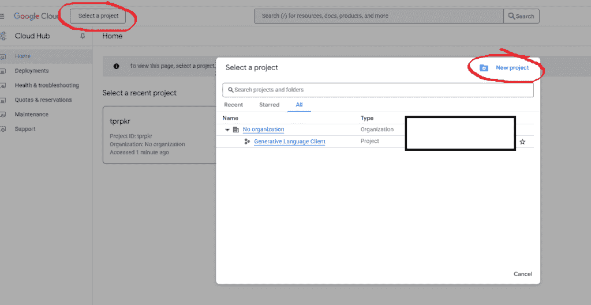
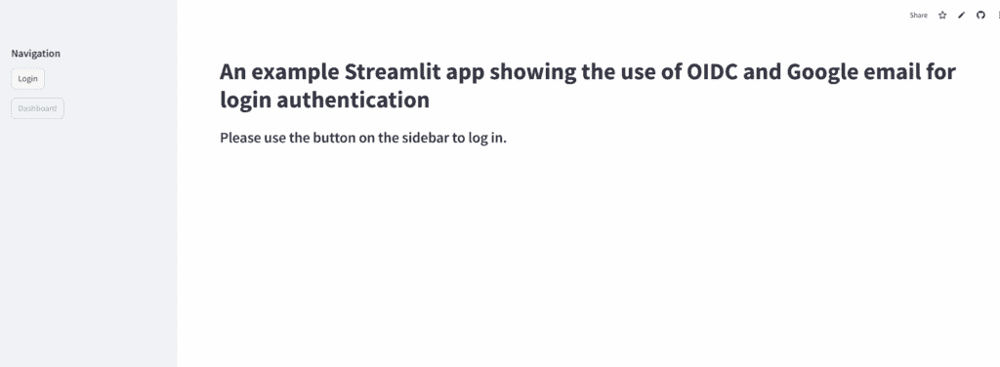
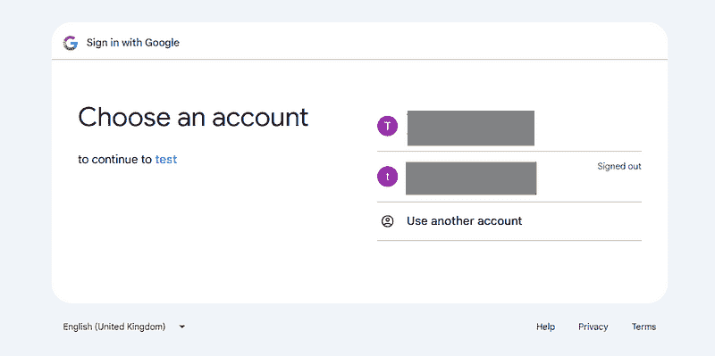
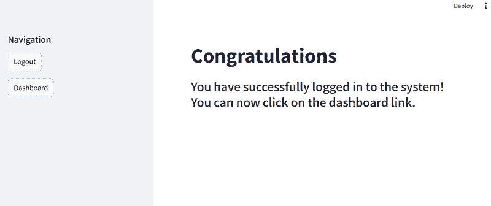
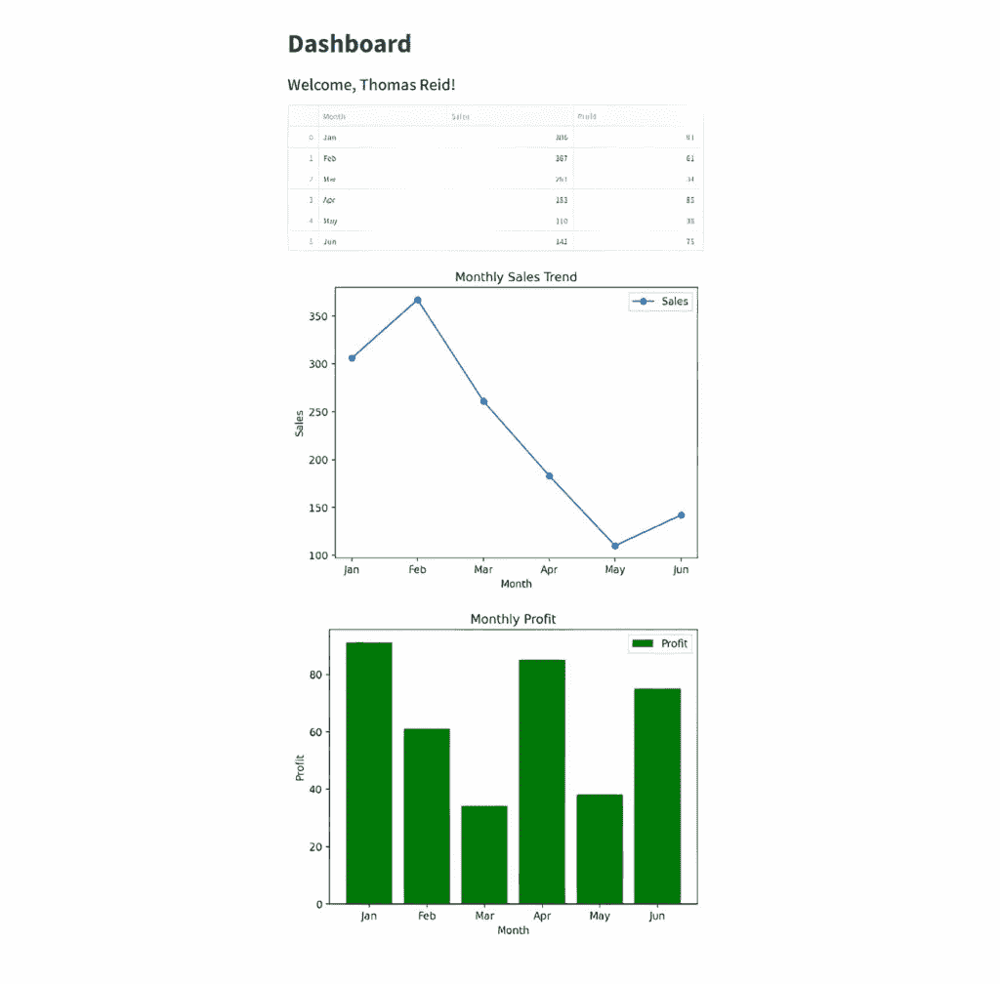

# 使用 OIDC 和 Google 在 Streamlit 中进行用户授权

> [Streamlit 中的用户授权使用 OIDC 和 Google](https://towardsdatascience.com/user-authorisation-in-streamlit-with-oidc-and-google/)

<mdspan datatext="el1749671432908" class="mdspan-comment">在过去的几周里，随着 AI 领域活动的激增，Streamlit 最近的一个重要公告——它现在支持 OpenID Connect (OIDC) 登录认证——几乎被我忽略了。

用户授权和验证对于数据科学家、机器学习工程师以及参与创建仪表板、机器学习概念验证（PoCs）和其他应用程序的人来说可能是一个重要的考虑因素。保持可能敏感的数据私密性至关重要，因此你希望确保只有授权用户才能访问你的应用程序。

在这篇文章中，我们将讨论 Streamlit 的这个新特性，并开发一个简单的应用程序来展示它。我们的应用程序可能很简单，但它演示了在创建更复杂的软件时你需要了解的所有关键事项。

## 什么是 Streamlit？

如果你从未听说过 Streamlit，它是一个开源的 Python 库，旨在通过最少的代码快速构建和部署交互式网络应用程序。它被广泛用于数据可视化、机器学习模型部署、仪表板和内部工具。使用 Streamlit，开发者可以创建无需前端经验（HTML、CSS 或 JavaScript）的 Web 应用程序。

它的关键特性包括用户输入的小部件、内置的缓存以优化性能，以及与 Pandas、Matplotlib 和 TensorFlow 等数据科学库的轻松集成。Streamlit 特别受数据科学家和 AI/ML 实践者的欢迎，他们使用它来在基于网络的界面上共享见解和模型。

如果你想了解更多关于 Streamlit 的信息，我写了一篇关于如何使用它创建数据仪表板的 TDS 文章，你可以通过这个链接访问：[此链接](https://towardsdatascience.com/building-a-data-dashboard-9441db646697/)。

## 什么是 OIDC？

OpenID Connect (OIDC) 是一个建立在 OAuth 2.0 之上的认证协议。它允许用户使用来自像 Google、Microsoft、Okta 和 Auth0 这样的身份提供者的现有凭据安全地登录到应用程序。

它实现了单点登录（SSO），并通过 ID 令牌提供用户身份信息，包括电子邮件地址和配置文件详情。与专注于授权的 OAuth 不同，OIDC 明确设计用于认证，使其成为在 Web 和移动应用程序中提供安全、可扩展和用户友好登录体验的标准。

在这篇文章中，我将向你展示如何设置 Streamlit 应用程序并编写代码，该应用程序使用 OIDC 提示你的 Google 电子邮件和密码。你可以使用这些详细信息登录应用程序并访问包含数据仪表板示例的第二屏幕。

## 前提条件

由于这篇文章侧重于使用 Google 作为身份提供者，如果你还没有，你需要一个 Google 邮箱地址和一个 Google Cloud 账户。一旦你有了你的邮箱，请使用下面的链接通过它登录 Google Cloud。

[`console.cloud.google.com`](https://console.cloud.google.com)

如果你担心注册 Google Cloud 的费用，请不要担心。他们提供免费的 90 天试用和价值 300 美元的信用额度。你只需为所使用的服务付费，并且可以在免费试用到期前或之后随时取消你的云账户订阅。无论如何，我们在这里要做的应该不会产生任何费用。然而，我总是建议为任何你注册的云服务设置账单警报——以防万一。

我们稍后会回到设置云账户必须做的事情。

## 设置我们的开发环境

我在 Windows 上使用 WSL2 Ubuntu Linux 进行开发，但以下内容也应该在常规 Windows 上工作。在开始这样的项目之前，我总是创建一个单独的 Python 开发环境，这样我就可以安装所需的任何软件并尝试编程。现在，我在这个环境中所做的任何操作都将被隔离，不会影响我的其他项目。

我使用 Miniconda 来做这个，但你可以使用最适合你的任何方法。如果你想遵循 Miniconda 的路线并且还没有安装它，你必须首先安装 Miniconda。

现在，你可以这样设置你的环境。

```py
(base) $ conda create -n streamlit python=3.12 -y
(base) $ conda activate streamlit
# Install required Libraries
(streamlit) $ pip install streamlit  streamlit-extras Authlib 
(streamlit) $ pip install pandas matplotlib numpy
```

## 我们将构建的内容

这将是一个 Streamlit 应用程序。最初，将有一个屏幕显示以下文本，

> 一个示例 Streamlit 应用程序，展示了使用 OIDC 和 Google 邮箱进行登录认证的使用
> 
> 请使用侧边栏上的按钮登录。

在左侧侧边栏中，将有两个按钮。一个按钮上写着**登录**，另一个按钮上写着**仪表板**。

如果用户未登录，仪表板按钮将变灰，无法使用。当用户点击登录按钮时，将显示一个屏幕，要求用户通过 Google 登录。一旦登录，将发生两件事：-

+   侧边栏上的**登录**按钮将变为**注销**。

+   **仪表板**按钮现在可以使用了。目前这会显示一些示例数据和图表。

如果已登录的用户点击**注销**按钮，应用程序将重置到其初始状态。

> 注意。我已经将我的应用程序的一个工作版本部署到了 Streamlit 社区云。为了提前预览，请点击下面的链接。如果有一段时间没有人点击它，你可能需要先“唤醒”应用程序，但这只需要几秒钟。
> 
> [`oidc-example.streamlit.app`](https://oidc-example.streamlit.app)

## 在 Google Cloud 上设置

要使用你的 Google Gmail 账户启用电子邮件验证，你首先需要在 Google Cloud 上做一些事情。它们相当直接，所以请慢慢来，仔细遵循每个步骤。我假设你已经设置或有一个 Google 邮箱和云账户，并且你将为你的工作创建一个新的项目。

前往 [Google Cloud 控制台](https://console.cloud.google.com) 登录。你应该会看到一个类似于下面显示的屏幕。



图片由作者提供

您需要先设置一个项目。点击 **项目选择器** 按钮。它位于屏幕右上角 Google Cloud 标志的右侧，将标记为您的现有项目名称之一或“**选择一个项目**”（如果您没有现有项目）。在出现的弹出窗口中，点击右上角的 **新建项目** 按钮。这将允许您输入项目名称。接下来，点击 **创建** 按钮。

完成后，您的新项目名称将显示在屏幕顶部的 Google Cloud 标志旁边。接下来，点击页面左上角的汉堡式菜单。

+   导航到 **APIs & Services → Credentials**

+   点击 **创建凭证 → OAuth 客户端 ID**

+   选择 **Web 应用**

+   将 **http://localhost:8501/oauth2callback** 添加为 **授权重定向 URI**

+   请注意 **客户端 ID** 和 **客户端密钥**，因为我们很快就会用到它们。

## 本地设置和 Python 代码

决定您的主要 Python Streamlit 应用文件将存放在哪个本地文件夹中。在那里，创建一个文件，例如 app.py，并将以下 Python 代码插入其中。

```py
import streamlit as st
import pandas as pd
import numpy as np
import matplotlib.pyplot as plt

# ——— Page setup & state ———
st.set_page_config(page_title="SecureApp", page_icon="🔑", layout="wide")

if "page" not in st.session_state:
    st.session_state.page = "main"

# ——— Auth Helpers ———
def _user_obj():
    return getattr(st, "user", None)

def user_is_logged_in() -> bool:
    u = _user_obj()
    return bool(getattr(u, "is_logged_in", False)) if u else False

def user_name() -> str:
    u = _user_obj()
    return getattr(u, "name", "Guest") if u else "Guest"

# ——— Main & Dashboard Pages ———
def main():
    if not user_is_logged_in():
        st.title("An example Streamlit app showing the use of OIDC and Google email for login authentication")
        st.subheader("Use the sidebar button to log in.")
    else:
        st.title("Congratulations")
        st.subheader("You’re logged in! Click Dashboard on the sidebar.")

def dashboard():
    st.title("Dashboard")
    st.subheader(f"Welcome, {user_name()}!")

    df = pd.DataFrame({
        "Month": ["Jan","Feb","Mar","Apr","May","Jun"],
        "Sales": np.random.randint(100,500,6),
        "Profit": np.random.randint(20,100,6)
    })
    st.dataframe(df)

    fig, ax = plt.subplots()
    ax.plot(df["Month"], df["Sales"], marker="o", label="Sales")
    ax.set(xlabel="Month", ylabel="Sales", title="Monthly Sales Trend")
    ax.legend()
    st.pyplot(fig)

    fig, ax = plt.subplots()
    ax.bar(df["Month"], df["Profit"], label="Profit")
    ax.set(xlabel="Month", ylabel="Profit", title="Monthly Profit")
    ax.legend()
    st.pyplot(fig)

# ——— Sidebar & Navigation ———
st.sidebar.header("Navigation")

if user_is_logged_in():
    if st.sidebar.button("Logout"):
        st.logout()
        st.session_state.page = "main"
        st.rerun()
else:
    if st.sidebar.button("Login"):
        st.login("google")  # or "okta"
        st.rerun()

if st.sidebar.button("Dashboard", disabled=not user_is_logged_in()):
    st.session_state.page = "dashboard"
    st.rerun()

# ——— Page Dispatch ———
if st.session_state.page == "main":
    main()
else:
    dashboard() 
```

此脚本构建了一个包含 Google（或 OIDC）登录和简单仪表盘的两个页面 Streamlit 应用：

1.  **页面设置与状态**

    +   配置浏览器标签（标题/图标/布局）。

    +   使用 `st.session_state["page"]` 来记住您是在“主”屏幕还是“仪表盘”。

1.  **认证助手**

    +   `_user_obj()` 安全地获取 `st.user` 对象（如果存在）。

    +   `user_is_logged_in()` 和 `user_name()`。检查您是否已登录并获取您的名字（或默认为“访客”）。

1.  **主页面与仪表盘页面**

    +   **主页面**：如果你未登录，显示一个标题/副标题提示你登录；如果你已登录，显示一个祝贺信息并引导你到仪表盘。

    +   **仪表盘**：通过您的名字问候您，生成一个每月销售/利润的虚拟 DataFrame，显示它，并为销售绘制一个折线图，为利润绘制一个柱状图。

1.  **侧边栏导航**

    +   根据您的状态显示“登录”或“注销”按钮（调用 `st.login("google")` 或 `st.logout()`）。

    +   显示一个“仪表盘”按钮，只有您登录后才能启用。

1.  **页面分发**

    +   在底部，它检查 `st.session_state.page` 并相应地运行 `main()` 或 `dashboard()`。

## 配置您的 `secrets.toml` 以进行 Google OAuth 认证

在您的 app.py 文件所在的同一文件夹中，创建一个名为 **.streamlit** 的子文件夹。现在进入这个新子文件夹，创建一个名为 **secrets.toml** 的文件。将 Google Cloud 的 **客户端 ID** 和 **客户端密钥** 添加到该文件中，以及一个重定向 URI 和 cookie 密钥。您的文件应类似于以下内容，

```py
#
# secrets.toml 
#
[auth]
redirect_uri = "http://localhost:8501/oauth2callback"
cookie_secret = "your-secure-random-string-anything-you-like"

[auth.google]
client_id = "************************************.apps.googleusercontent.com"
client_secret = "*************************************"
server_metadata_url = "https://accounts.google.com/.well-known/openid-configuration"
```

好的，我们现在应该能够运行我们的应用了。要做到这一点，请回到 app.py 所在的文件夹，并在命令行中输入以下内容。

```py
(streamlit) $ streamlit run app.py
```

如果你的代码和设置一切顺利，你应该会看到以下屏幕。



图片由作者提供

注意侧边栏上的仪表板按钮应该是灰色的，因为你还没有登录。首先点击侧边栏上的登录按钮。你应该会看到下面的屏幕（出于安全原因，我已经隐藏了我的凭证），



图片由作者提供

一旦你选择了一个账户并登录，Streamlit 应用程序的显示将变为如下。



图片由作者提供

你还会注意到仪表板按钮现在是可点击的，当你点击它时，你应该会看到一个像这样的屏幕。



图片由作者提供

最后，注销登录，应用程序应该返回到其初始状态。

## 摘要

在这篇文章中，我解释了现在 Streamlit 用户可以获得适当的 OIDC 授权。这允许你确保使用你应用程序的任何人都是合法用户。除了谷歌，你还可以使用流行的提供商，如微软、OAuth、Okta 以及其他。

我解释了 Streamlit 是什么以及它的用途，并简要描述了 OpenID Connect（OIDC）认证协议。

在我的编码示例中，我专注于使用谷歌作为认证器，并展示了正确设置它在谷歌云平台上的使用所需的先决步骤。

我还提供了一个示例 Streamlit 应用程序，展示了谷歌授权的实际操作。尽管这是一个简单的应用程序，但它突出了如果你需要更复杂的解决方案所需的所有技术。
