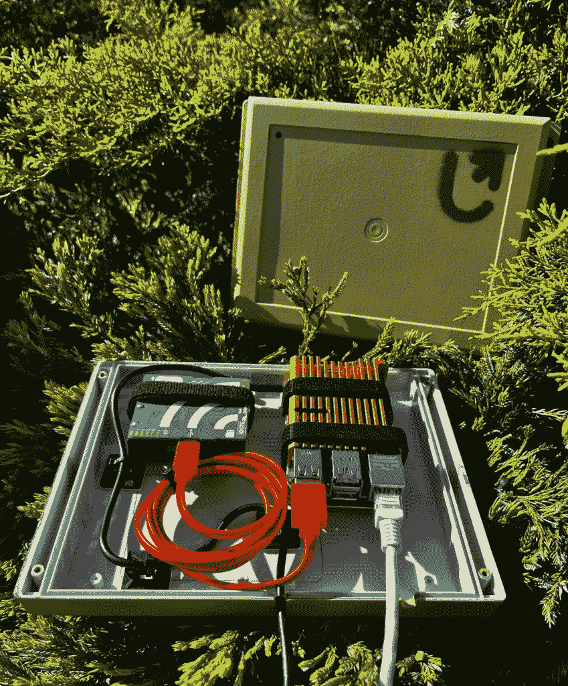
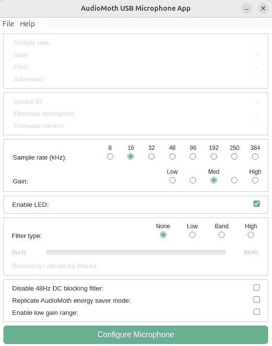
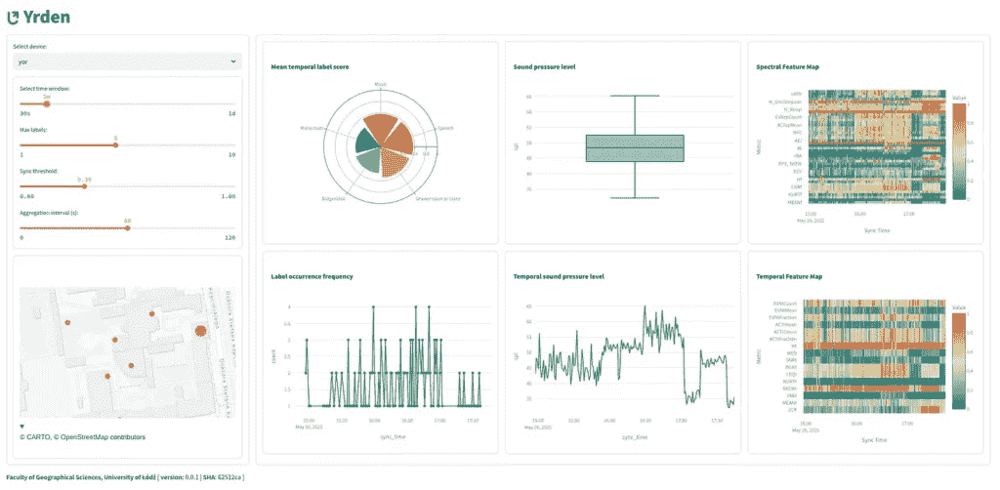

# 超出实验室的音频频谱变换器

> [原文链接](https://towardsdatascience.com/audio-spectrogram-transformers-beyond-the-lab/)

## <mdspan datatext="el1749599095175" class="mdspan-comment">简介</mdspan>

想知道是什么吸引我进行声音景观分析？

这是一个将科学、创造力和探索结合在一起，而其他领域很少做到的领域。首先，**你的实验室就是你的脚步所到之处**——森林小径、城市公园或偏远山间小路都可以成为科学发现和声学调查的空间。其次，**监测选定的地理区域完全是关于创造力的**。创新是环境音频研究的核心，无论是搭建定制设备、在树冠中隐藏传感器，还是使用太阳能进行离网设置。最后，**数据的量确实令人难以置信**，正如我们所知，在空间分析中，所有方法都是公平竞争的**。**从动物的叫声到城市机械的微妙嗡嗡声，收集到的声学数据可以非常庞大和复杂，这为使用从深度学习到地理信息系统（GIS）来理解所有这些数据打开了大门。

在我之前对波兰某条河流的[声音景观分析](https://medium.com/@maciej.adamiak/soundscapes-unveiled-6e2525391aa0)的冒险之后，我决定提高标准，设计和实施一个能够实时分析声音景观的解决方案。在这篇博客文章中，您将找到所提出的方法描述，以及一些推动整个过程的代码，主要使用[音频频谱变换器](https://arxiv.org/abs/2104.01778)（AST）进行声音分类。



传感器原型的户外/城市版本（图片由作者提供）

## 方法

### 设置

在这个特定情况下，我选择使用 Raspberry Pi 4 和 AudioMoth 的组合有许多原因。相信我，我测试了各种设备——从 Raspberry Pi 家族中更节能的型号，经过各种 Arduino 版本，包括[Portenta](https://docs.arduino.cc/hardware/portenta-h7/)，一直到[Jetson Nano](https://developer.nvidia.com/embedded/jetson-nano)。这只是开始。选择正确的麦克风证明更加复杂。

最终，我选择了 **Pi 4 B (4GB RAM**)，因为它性能稳定且功耗相对较低（运行我的代码时约为 ~**700mAh**）。此外，将其与 AudioMoth 以 USB 麦克风模式配对，在原型设计阶段给了我很大的灵活性。[AudioMoth](https://www.openacousticdevices.info/audiomoth) 是一款功能强大的设备，拥有丰富的配置选项，例如采样率从 8 kHz 到惊人的 384 kHz。我坚信——从长远来看——这将证明是我声音景观研究的一个完美选择。



AudioMoth USB 麦克风配置应用程序。记得在配置之前用适当的固件刷写设备。

### 捕获声音

使用 Python 从 USB 麦克风捕获音频竟然出奇地麻烦。在与各种库斗争了一段时间后，我决定回归到古老的 Linux `arecord` 命令。整个声音捕获机制都封装在以下命令中：

```py
arecord -d 1 -D plughw:0,7 -f S16_LE -r 16000 -c 1 -q /tmp/audio.wav
```

我故意使用一个插件设备来启用自动转换，以防我需要修改 **USB microphone** 的配置。AST 在 **16 kHz** 采样上运行，因此录音和 AudioMoth 采样都设置为这个值。

注意代码中的生成器。在指定的时间间隔内持续捕获音频非常重要。我的目标是只存储设备上最新的音频样本，并在分类后丢弃它。这种方法在后续更大规模的城区研究中特别有用，因为它有助于确保人们的隐私并符合 **GDPR** 合规性。

```py
import asyncio
import re
import subprocess
from tempfile import TemporaryDirectory
from typing import Any, AsyncGenerator

import librosa
import numpy as np

class AudioDevice:
    def __init__(
        self,
        name: str,
        channels: int,
        sampling_rate: int,
        format: str,
    ):
        self.name = self._match_device(name)
        self.channels = channels
        self.sampling_rate = sampling_rate
        self.format = format

    @staticmethod
    def _match_device(name: str):
        lines = subprocess.check_output(['arecord', '-l'], text=True).splitlines()
        devices = [
            f'plughw:{m.group(1)},{m.group(2)}'
            for line in lines
            if name.lower() in line.lower()
            if (m := re.search(r'card (\d+):.*device (\d+):', line))
        ]

        if len(devices) == 0:
            raise ValueError(f'No devices found matching `{name}`')
        if len(devices) > 1:
            raise ValueError(f'Multiple devices found matching `{name}` -> {devices}')
        return devices[0]

    async def continuous_capture(
        self,
        sample_duration: int = 1,
        capture_delay: int = 0,
    ) -> AsyncGenerator[np.ndarray, Any]:
        with TemporaryDirectory() as temp_dir:
            temp_file = f'{temp_dir}/audio.wav'
            command = (
                f'arecord '
                f'-d {sample_duration} '
                f'-D {self.name} '
                f'-f {self.format} '
                f'-r {self.sampling_rate} '
                f'-c {self.channels} '
                f'-q '
                f'{temp_file}'
            )

            while True:
                subprocess.check_call(command, shell=True)
                data, sr = librosa.load(
                    temp_file,
                    sr=self.sampling_rate,
                )
                await asyncio.sleep(capture_delay)
                yield data
```

### 分类

现在是时候介绍最激动人心的部分了。

利用音频频谱变换器（AST）和出色的 [HuggingFace](https://huggingface.co/) 生态系统，我们可以高效地分析音频并将检测到的片段分类到超过 500 个类别中。

注意，我已经准备了系统以支持各种预训练模型。默认情况下，我使用 [*MIT/ast-finetuned-audioset-10–10–0.4593*](https://huggingface.co/MIT/ast-finetuned-audioset-10-10-0.4593)，因为它提供了最佳结果，并且在 Raspberry Pi 4 上运行良好。然而，[*onnx-community/ast-finetuned-audioset-10–10–0.4593-ONNX*](https://huggingface.co/onnx-community/ast-finetuned-audioset-10-10-0.4593-ONNX) 也值得探索——特别是它的 **量化版本**，它需要的内存更少，并且可以更快地提供推理结果。

你可能会注意到我没有将模型限制在单个分类标签上，这是故意的。而不是假设在任何给定时间只有一个声音源存在，我将对模型的 logits 应用**sigmoid 函数**以获得**每个类别的独立概率**。这允许模型同时表达对多个标签的**信心**，这对于**现实世界的声音景观**至关重要，在这些景观中，重叠的声音源——如鸟鸣、风和远处的交通——经常同时出现。选择**前五个结果**确保系统在样本中捕获最可能的声音事件，而不强制做出赢家通吃的决定。

```py
from pathlib import Path
from typing import Optional

import numpy as np
import pandas as pd
import torch
from optimum.onnxruntime import ORTModelForAudioClassification
from transformers import AutoFeatureExtractor, ASTForAudioClassification

class AudioClassifier:
    def __init__(self, pretrained_ast: str, pretrained_ast_file_name: Optional[str] = None):
        if pretrained_ast_file_name and Path(pretrained_ast_file_name).suffix == '.onnx':
            self.model = ORTModelForAudioClassification.from_pretrained(
                pretrained_ast,
                subfolder='onnx',
                file_name=pretrained_ast_file_name,
            )
            self.feature_extractor = AutoFeatureExtractor.from_pretrained(
                pretrained_ast,
                file_name=pretrained_ast_file_name,
            )
        else:
            self.model = ASTForAudioClassification.from_pretrained(pretrained_ast)
            self.feature_extractor = AutoFeatureExtractor.from_pretrained(pretrained_ast)

        self.sampling_rate = self.feature_extractor.sampling_rate

    async def predict(
        self,
        audio: np.array,
        top_k: int = 5,
    ) -> pd.DataFrame:
        with torch.no_grad():
            inputs = self.feature_extractor(
                audio,
                sampling_rate=self.sampling_rate,
                return_tensors='pt',
            )
            logits = self.model(**inputs).logits[0]
            proba = torch.sigmoid(logits)
            top_k_indices = torch.argsort(proba)[-top_k:].flip(dims=(0,)).tolist()

            return pd.DataFrame(
                {
                    'label': [self.model.config.id2label[i] for i in top_k_indices],
                    'score': proba[top_k_indices],
                }
            )
```

要运行模型的 ONNX 版本，您需要将[Optimum](https://huggingface.co/docs/optimum/index)添加到您的依赖项中。

### 声压级

除了音频分类之外，我还捕捉了声压级的信息。这种方法不仅确定了**是什么**产生了声音，而且还了解了每个声音**强度**的细节。通过这种方式，模型捕捉到了更丰富、更真实的声音场景表示，最终可以用来检测更细粒度的噪声污染信息。

```py
import numpy as np
from maad.spl import wav2dBSPL
from maad.util import mean_dB

async def calculate_sound_pressure_level(audio: np.ndarray, gain=10 + 15, sensitivity=-18) -> np.ndarray:
    x = wav2dBSPL(audio, gain=gain, sensitivity=sensitivity, Vadc=1.25)
    return mean_dB(x, axis=0)
```

增益（前置放大器+放大器）、灵敏度（dB/V）和 Vadc（V）主要是为 AudioMoth 设置的，并通过实验验证。如果你使用的是不同设备，你必须通过参考技术规范来识别这些值。

### 存储

每个传感器的数据每 30 秒与 PostgreSQL 数据库同步。当前的都市声音景观监控原型使用以太网连接；因此，我在网络负载方面没有限制。用于更偏远地区的设备将使用 GSM 连接每小时同步数据。

```py
label           score        device   sync_id                                sync_time
Hum             0.43894055   yor      9531b89a-4b38-4a43-946b-43ae2f704961   2025-05-26 14:57:49.104271
Mains hum       0.3894045    yor      9531b89a-4b38-4a43-946b-43ae2f704961   2025-05-26 14:57:49.104271
Static          0.06389702   yor      9531b89a-4b38-4a43-946b-43ae2f704961   2025-05-26 14:57:49.104271
Buzz            0.047603738  yor      9531b89a-4b38-4a43-946b-43ae2f704961   2025-05-26 14:57:49.104271
White noise     0.03204195   yor      9531b89a-4b38-4a43-946b-43ae2f704961   2025-05-26 14:57:49.104271
Bee, wasp, etc. 0.40881288   yor      8477e05c-0b52-41b2-b5e9-727a01b9ec87   2025-05-26 14:58:40.641071
Fly, housefly   0.38868183   yor      8477e05c-0b52-41b2-b5e9-727a01b9ec87   2025-05-26 14:58:40.641071
Insect          0.35616025   yor      8477e05c-0b52-41b2-b5e9-727a01b9ec87   2025-05-26 14:58:40.641071
Speech          0.23579548   yor      8477e05c-0b52-41b2-b5e9-727a01b9ec87   2025-05-26 14:58:40.641071
Buzz            0.105577625  yor      8477e05c-0b52-41b2-b5e9-727a01b9ec87   2025-05-26 14:58:40.641071
```

## 结果

一个独立的应用程序，使用[Streamlit](https://streamlit.io/)和[Plotly](https://plotly.com/)构建，访问这些数据。目前，它显示有关设备位置、时间性 SPL（声压级）、识别的声音类别以及一系列[声学指数](https://scikit-maad.github.io/_auto_examples/2_advanced/plot_extract_alpha_indices.html)的信息。



Streamit 分析仪表板（图片由作者提供）

现在我们准备就绪。计划扩展传感器网络，并达到我[城市](https://pl.wikipedia.org/wiki/%C5%81%C3%B3d%C5%BA)多个地方分散的约 20 个设备。有关更大区域传感器部署的更多信息将很快可用。

此外，我正在从部署的传感器收集数据，并计划在即将发表的博客文章中分享数据包、仪表板和分析。我将使用一个有趣的方法，值得深入探讨音频分类。主要思想是将不同的声压级与检测到的音频类别相匹配。我希望找到一种更好的方法来描述噪声污染。所以请耐心等待，很快就会有更详细的分解。

同时，您可以阅读关于我的声音景观研究的[初步论文](https://czajopisma.ltn.lodz.pl/Acta-Geographica-Lodziensia/article/view/2512/2290?source=post_page-----1be80a0b1ce4---------------------------------------)（务必佩戴耳机）。

* * *

这篇帖子使用[Grammarly](https://app.grammarly.com/)进行了校对和编辑，以提升语法和清晰度。
