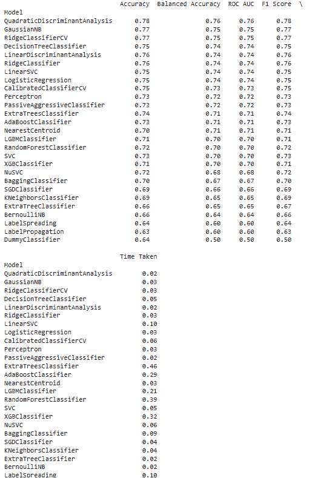
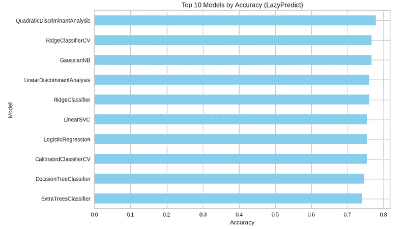
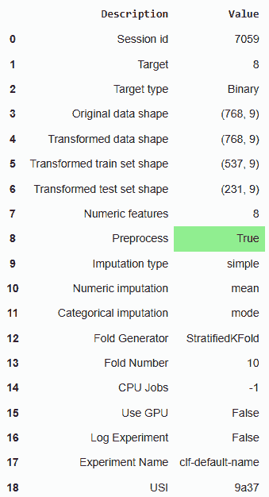
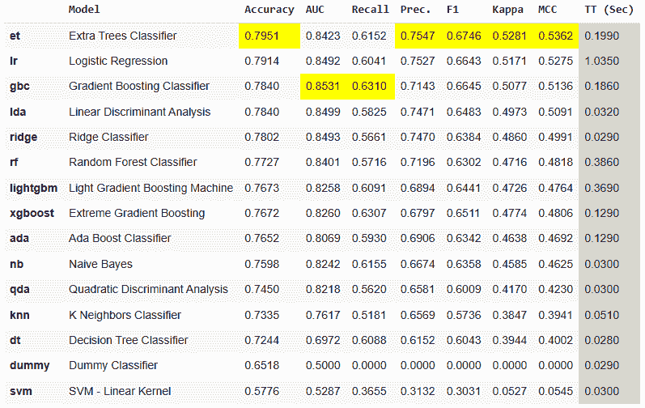

# 如何仅用 10 行 Python 代码自动化我的机器学习工作流程

> [`towardsdatascience.com/how-i-automated-my-machine-learning-workflow-with-just-10-lines-of-python/`](https://towardsdatascience.com/how-i-automated-my-machine-learning-workflow-with-just-10-lines-of-python/)

<mdspan datatext="el1749215109063" class="mdspan-comment">机器学习</mdspan>是神奇的——直到你陷入困境，试图决定为你的数据集使用哪个模型。你应该选择随机森林还是逻辑回归？如果朴素贝叶斯模型的表现优于两者怎么办？对我们大多数人来说，回答这个问题意味着数小时的手动测试、模型构建和困惑。

但如果你能自动化整个模型选择过程呢？

在这篇文章中，我将带你了解一个简单但强大的 Python 自动化，它会自动选择最适合你的数据集的机器学习模型。你不需要深入的了解 ML 知识或调优技能。只需插入你的数据，让 Python 完成剩下的工作。

## 为什么自动化 ML 模型选择？

有多个原因，让我们看看其中的一些。想想看：

+   大多数数据集可以用多种方式建模。

+   手动尝试每个模型是耗时的。

+   早期选择错误的模型可能会使你的项目脱轨。

### 自动化让你：

+   立即比较数十个模型。

+   获取性能指标而不需要编写重复的代码。

+   根据准确度、F1 分数或 RMSE 识别表现最好的算法。

这不仅方便，而且是一种智能的 ML 卫生习惯。

## 我们将使用的库

我们将探索两个被低估的 Python ML 自动化库。这些是**lazypredict**和**pycaret**。你可以使用下面的 pip 命令安装这两个库。

```py
pip install lazypredict
pip install pycaret
```

## 导入所需的库

现在我们已经安装了所需的库，让我们导入它们。我们还将导入一些其他库，这些库将帮助我们加载数据并为建模做准备。我们可以使用下面的代码导入它们。

```py
import pandas as pd
from sklearn.model_selection import train_test_split
from lazypredict.Supervised import LazyClassifier
from pycaret.classification import *
```

## 加载数据集

我们将使用免费提供的糖尿病数据集，你可以从这里检查这些数据[link](https://raw.githubusercontent.com/jbrownlee/Datasets/master/)。我们将使用下面的命令下载数据，将其存储在 dataframe 中，并定义 X（特征）和 Y（结果）。

```py
# Load dataset
url = "https://raw.githubusercontent.com/jbrownlee/Datasets/master/pima-indians-diabetes.data.csv"
df = pd.read_csv(url, header=None)

X = df.iloc[:, :-1]
y = df.iloc[:, -1]
```

## 使用 LazyPredict

现在我们已经加载数据集并导入了所需的库，让我们将数据分成训练集和测试集。之后，我们最终将数据传递给 lazypredict，以了解哪个模型最适合我们的数据。

```py
# Split data
X_train, X_test, y_train, y_test = train_test_split(X, y, test_size=0.2, random_state=42)

# LazyClassifier
clf = LazyClassifier(verbose=0, ignore_warnings=True)
models, predictions = clf.fit(X_train, X_test, y_train, y_test)

# Top 5 models
print(models.head(5))
```



在输出中，我们可以清楚地看到 LazyPredict 尝试在 20+ ML 模型中拟合数据，并在准确度、ROC、AUC 等方面展示了性能，以选择最适合数据集的最佳模型。这使得决策更加节省时间且更准确。同样，我们可以创建这些模型的准确度图，使其成为一个更直观的决策。你还可以检查所花费的时间，这是微不足道的，这使得它节省更多的时间。

```py
import matplotlib.pyplot as plt

# Assuming `models` is the LazyPredict DataFrame
top_models = models.sort_values("Accuracy", ascending=False).head(10)

plt.figure(figsize=(10, 6))
top_models["Accuracy"].plot(kind="barh", color="skyblue")
plt.xlabel("Accuracy")
plt.title("Top 10 Models by Accuracy (LazyPredict)")
plt.gca().invert_yaxis()
plt.tight_layout()
```



## 使用 PyCaret

现在我们来看看 PyCaret 是如何工作的。我们将使用相同的 dataset 来创建模型并比较性能。我们将使用整个 dataset，因为 PyCaret 本身也会进行测试-训练分割。

下面的代码将：

+   运行 15+个模型

+   使用交叉验证评估它们

+   根据性能返回最佳模型

只需两行代码就能完成。

```py
clf = setup(data=df, target=df.columns[-1])
best_model = compare_models()
```



正如我们所看到的，PyCaret 提供了关于模型性能的更多信息。它可能比 LazyPredict 多花几秒钟，但它也提供了更多信息，这样我们就可以做出明智的决定，选择我们想要继续推进的模型。

## 真实世界的应用案例

这些库可以在以下真实世界的用例中带来好处：

+   在黑客马拉松中进行快速原型设计

+   为分析师提供最佳模型建议的内部仪表板

+   在语法中不迷失的机器学习教学

+   在全面部署前对想法进行预测试

## 结论

使用我们讨论过的 AutoML 库并不意味着你应该跳过学习模型背后的数学。但在快节奏的世界里，这是一个巨大的生产力提升。

我喜欢 lazypredict 和 pycaret 的原因是它们为你提供了一个快速的反馈循环，这样你就可以专注于特征工程、领域知识和解释。

如果你正在启动一个新的机器学习项目，尝试这个工作流程。你将节省时间，做出更好的决策，并给你的团队留下深刻印象。让 Python 来做繁重的工作，而你则构建更智能的解决方案。
